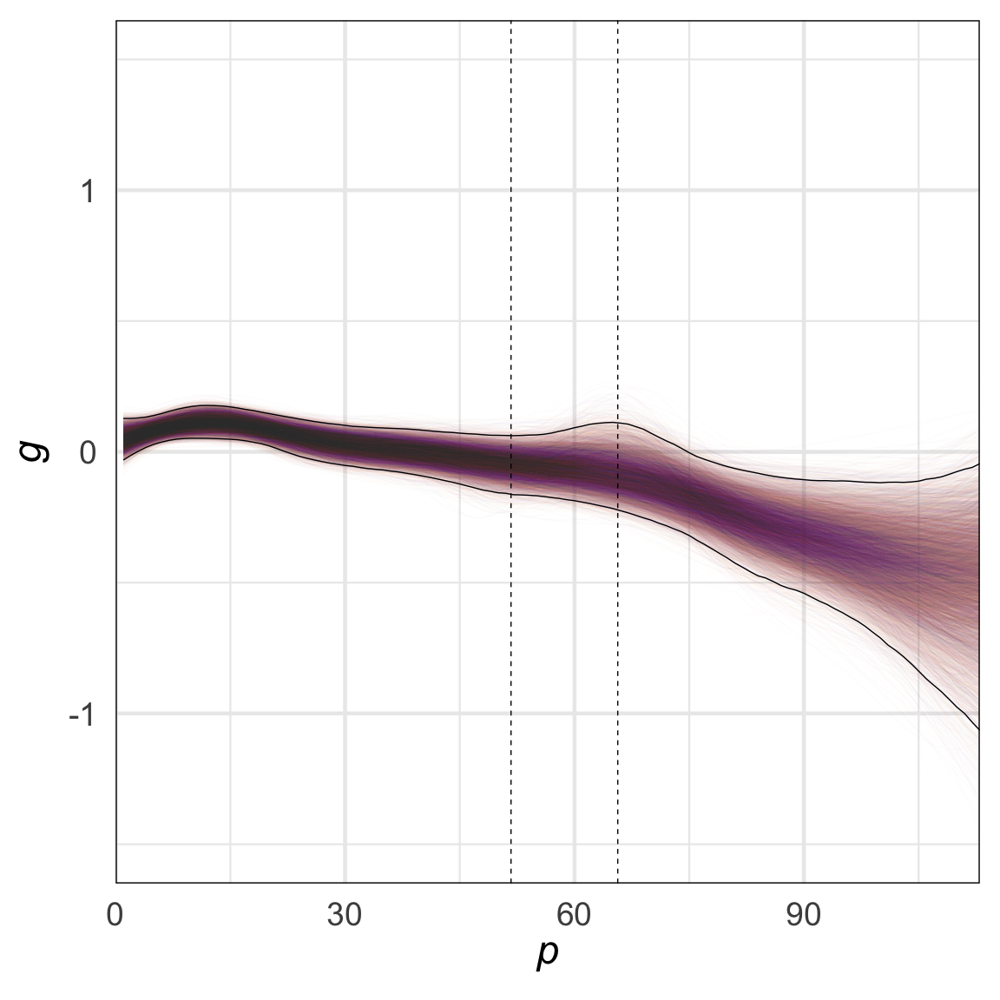
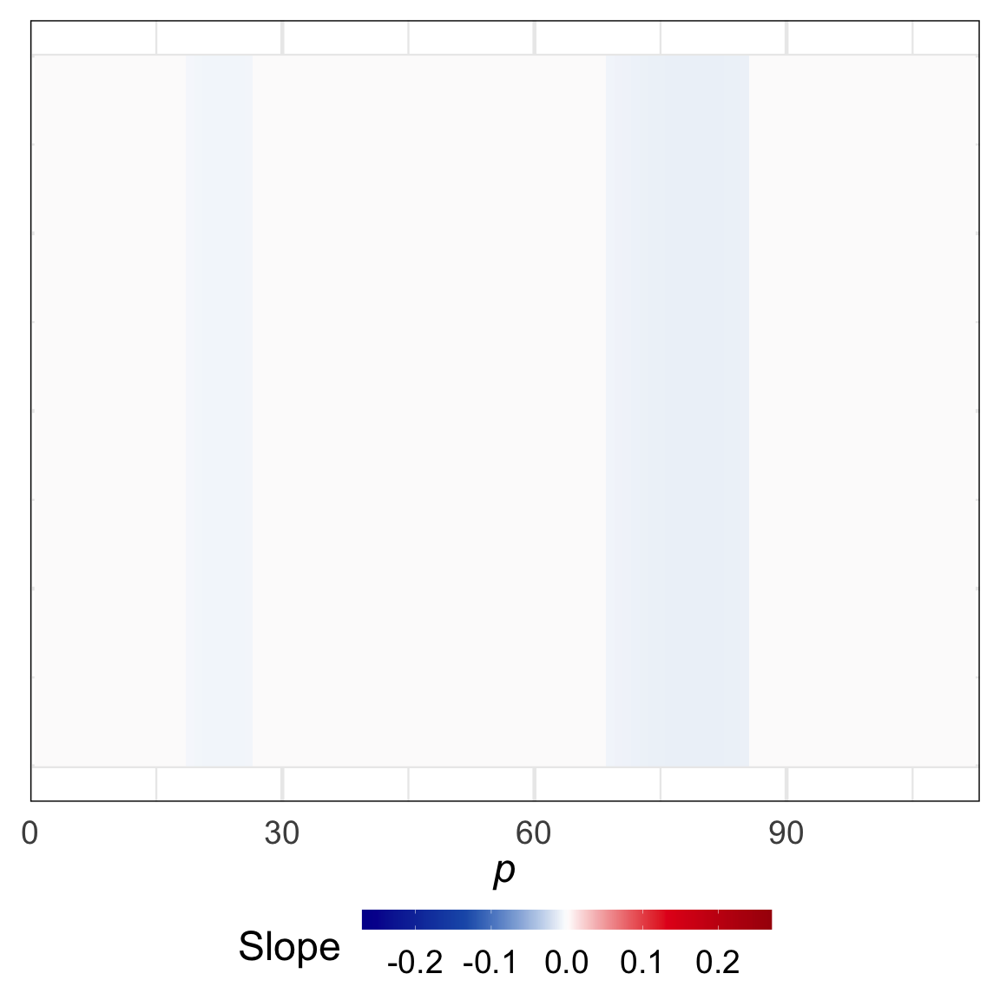
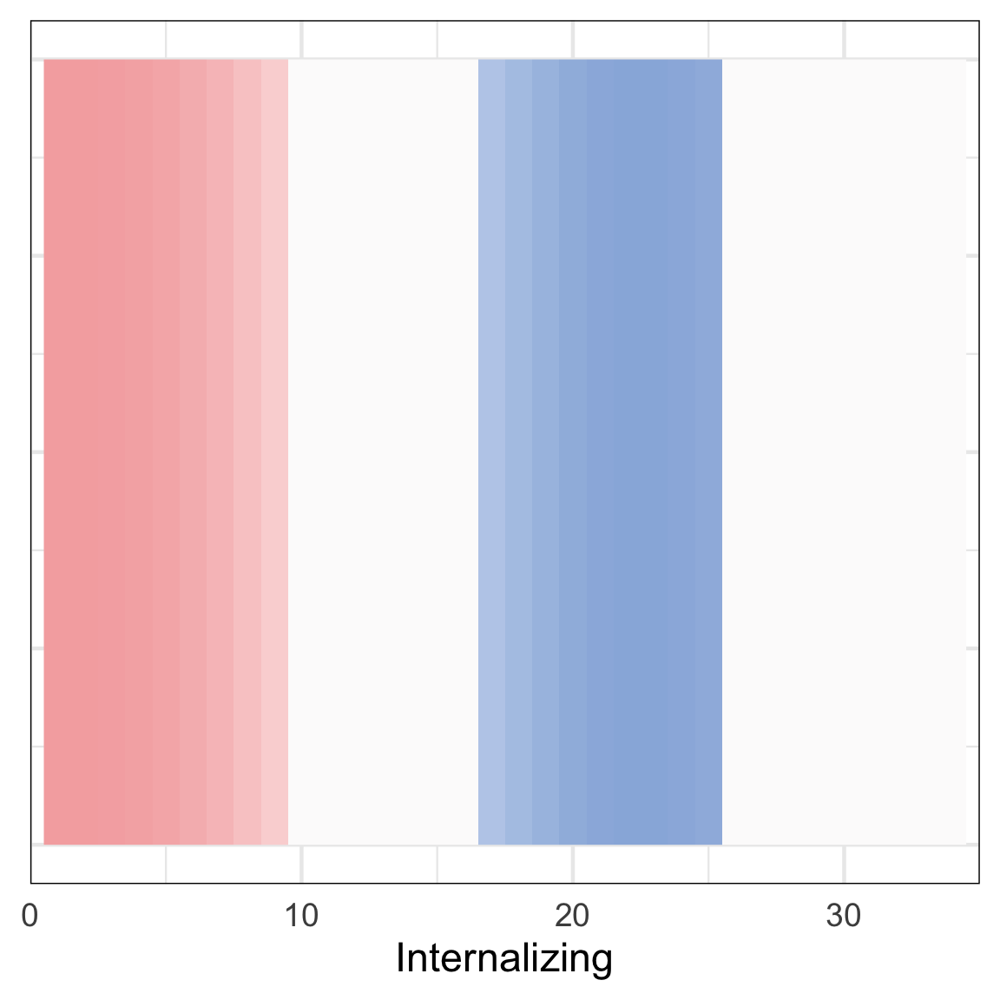
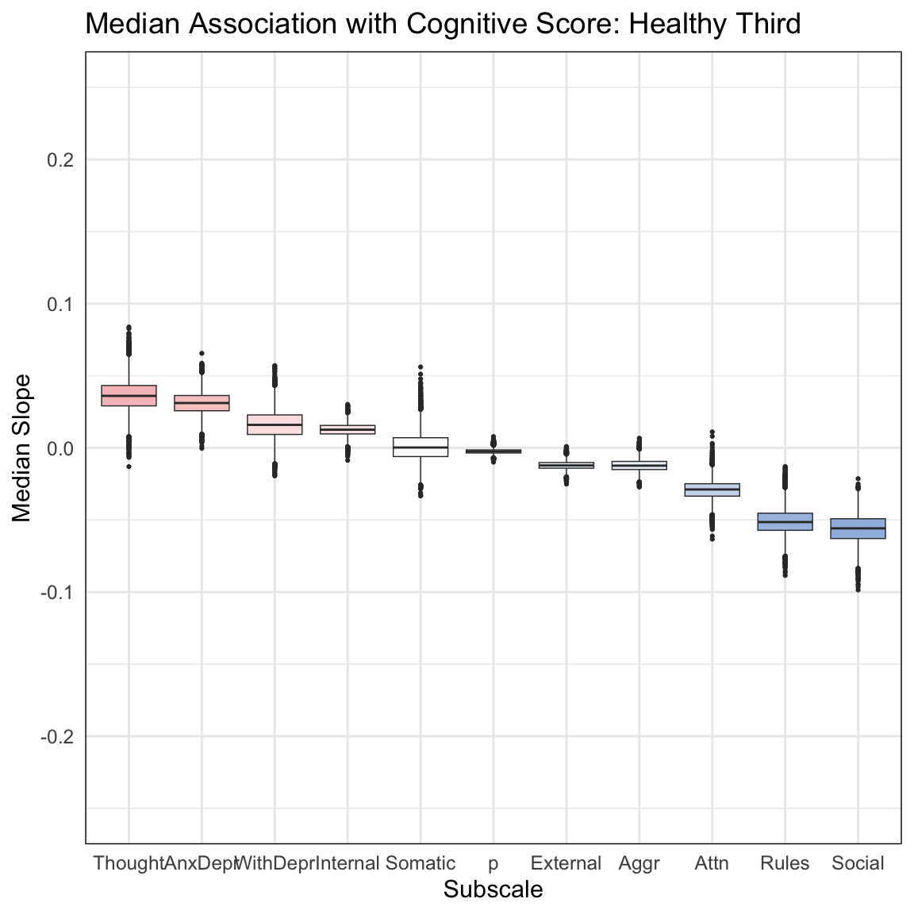
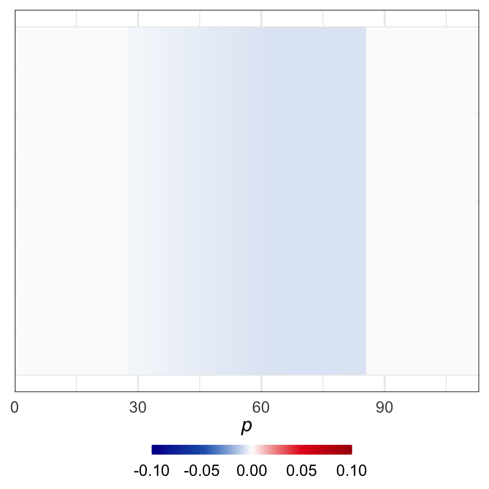
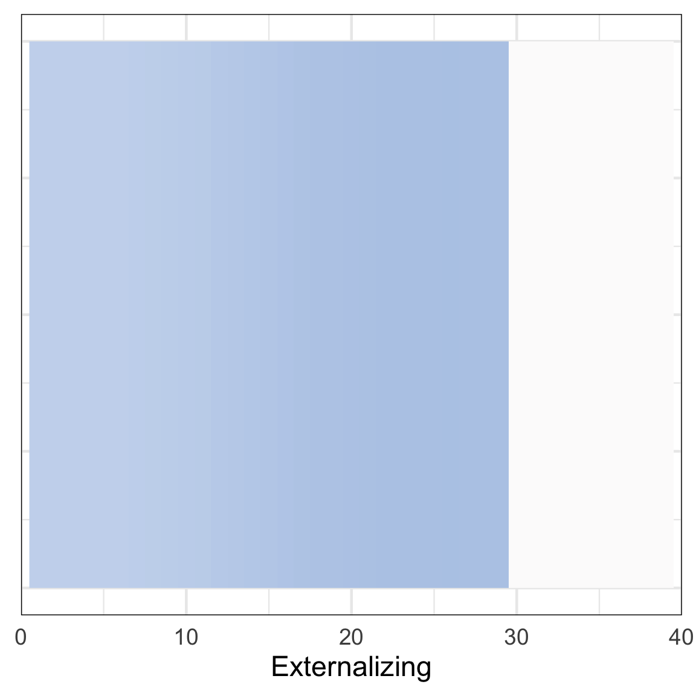
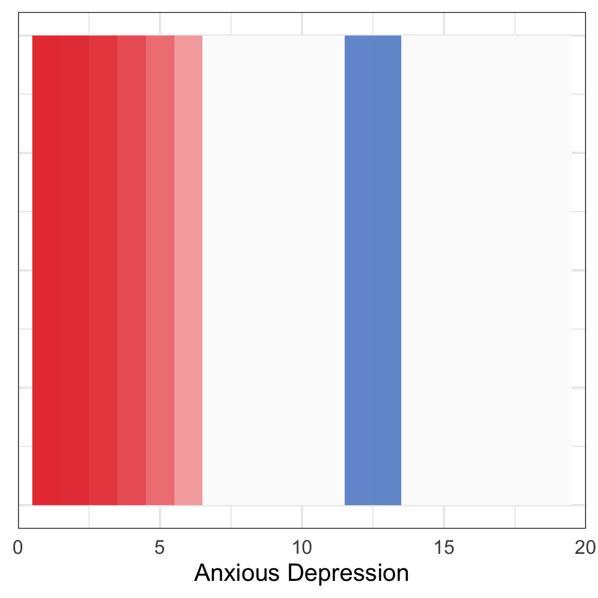
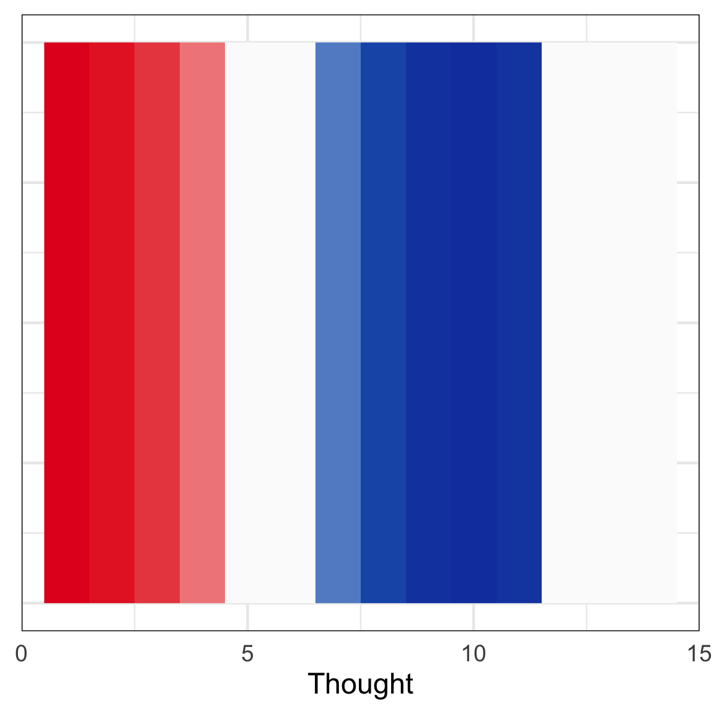

Figure1
================
2023-06-09

``` r
# load libraries
library(ggplot2)
library(hexbin)
library(reshape2)
library(viridis)
```

    ## Loading required package: viridisLite

``` r
library(dplyr)
```

    ## 
    ## Attaching package: 'dplyr'

    ## The following objects are masked from 'package:stats':
    ## 
    ##     filter, lag

    ## The following objects are masked from 'package:base':
    ## 
    ##     intersect, setdiff, setequal, union

``` r
library(mgcv)
```

    ## Loading required package: nlme

    ## 
    ## Attaching package: 'nlme'

    ## The following object is masked from 'package:dplyr':
    ## 
    ##     collapse

    ## This is mgcv 1.8-42. For overview type 'help("mgcv-package")'.

``` r
library(tidyr)
```

    ## 
    ## Attaching package: 'tidyr'

    ## The following object is masked from 'package:reshape2':
    ## 
    ##     smiths

``` r
library(knitr)
knitr::opts_chunk$set(fig.width=12, fig.height=12) 
```

``` r
plot_bootstraps <- function(data,maxval,Name,maxValuePlot,BorderlineClinical,Clinical) {
  # Melt the data frame
  data_melt <- melt(t(data))
  data_melt$Var1 <- rep(seq(0, maxval), nrow(data))

  # Calculate percentiles
  percentiles <- data %>%
    summarise(across(everything(), quantile, probs = c(0.01, 0.99), na.rm = TRUE))
  
  percentiles_long <- tidyr::pivot_longer(percentiles, cols = everything(), names_to = "Percentile", values_to = "YValue")

  # Add CI column
  data_melt$CI <- 0
  
  # Prepare CIs for insertion
  CIs <- data.frame(rep(seq(0, maxval), 2), c(rep(10001, maxval+1), rep(10002, maxval+1)), percentiles_long$YValue, rep(1, ((maxval+1)*2)))
  colnames(CIs) <- colnames(data_melt)
  
  # Add CIs
  data_melt2 <- rbind(data_melt, CIs)
  
  # Convert CI column to factor
  data_melt2$CI <- as.factor(data_melt2$CI)
  
  # Plotting the lines
  ggplot(data = data_melt2, aes(x = Var1, y = value, group = Var2, color = Var2)) +
    geom_line(aes(alpha = CI), show.legend = FALSE) +
    scale_color_viridis_c(option = "inferno", direction = -1) +
    scale_alpha_manual(values = c(0.01, 1), guide = FALSE) + ylim(c(-1.5,1.5)) +
    theme_minimal(base_size=34) + 
    ylab(expression(italic(g)))+xlab(Name)+
    geom_vline(xintercept = BorderlineClinical, linetype = "dashed")+
    geom_vline(xintercept = Clinical, linetype = "dashed")+
    theme(panel.border = element_rect(color = "black", fill = NA, size = 1))+
    scale_x_continuous(limits = c(0,maxValuePlot),expand = expansion(mult = c(0, 0)))
}

# and and a derivatives version. only change is ylim
plot_bootstrapDerivs <- function(data,maxval,Name,maxValuePlot,BorderlineClinical,Clinical) {
  # Melt the data frame
  data_melt <- melt(t(data))
  data_melt$Var1 <- rep(seq(1, maxval), nrow(data))

  # Calculate percentiles
  percentiles <- data %>%
    summarise(across(everything(), quantile, probs = c(0.01, 0.99), na.rm = TRUE))
  
  percentiles_long <- tidyr::pivot_longer(percentiles, cols = everything(), names_to = "Percentile", values_to = "YValue")

  # Add CI column
  data_melt$CI <- 0
  
  # Prepare CIs for insertion
  CIs <- data.frame(rep(seq(0, maxval), 2), c(rep(10001, maxval+1), rep(10002, maxval+1)), percentiles_long$YValue, rep(1, ((maxval+1)*2)))
  colnames(CIs) <- colnames(data_melt)
  
  # Add CIs
  data_melt2 <- rbind(data_melt, CIs)
  
  # Convert CI column to factor
  data_melt2$CI <- as.factor(data_melt2$CI)
  
  # Plotting the lines
  ggplot(data = data_melt2, aes(x = Var1, y = value, group = Var2, color = Var2)) +
    geom_line(aes(alpha = CI), show.legend = FALSE) +
    scale_color_viridis_c(option = "inferno", direction = -1) +
    scale_alpha_manual(values = c(0.01, 1), guide = FALSE) + ylim(c(-.15,.15)) +
    theme_minimal(base_size=35) + 
    ylab(expression(italic(g)))+xlab(Name)+
    geom_vline(xintercept = BorderlineClinical, linetype = "dashed")+
    geom_vline(xintercept = Clinical, linetype = "dashed")+
    theme(panel.border = element_rect(color = "black", fill = NA, size = 1))+
    scale_x_continuous(limits = c(0,maxValuePlot),expand = expansion(mult = c(0, 0)))
}


find_furthest_nonzero <- function(data) {
  numZeros=colSums(data==0)
  isZeroZeros=numZeros==0
  furthest_nonzero=sum(isZeroZeros)
}

# set colors
my_palette <- colorRampPalette(colors = c("#051099", "#1d5cb7", "white", "#e41a1c", "#a80009"))
```

``` r
# load in masterdf (saved out from sample construction)
masterdf=readRDS('~/gp_masterdf.rds')
# convert all cbcl scores to numeric
masterdf$cbcl_scr_syn_totprob_r=as.numeric(masterdf$cbcl_scr_syn_totprob_r)
masterdf$cbcl_scr_syn_internal_r=as.numeric(masterdf$cbcl_scr_syn_internal_r)
masterdf$cbcl_scr_syn_external_r=as.numeric(masterdf$cbcl_scr_syn_external_r)
masterdf$cbcl_scr_syn_somatic_r=as.numeric(masterdf$cbcl_scr_syn_somatic_r)
masterdf$cbcl_scr_syn_anxdep_r=as.numeric(masterdf$cbcl_scr_syn_anxdep_r)
masterdf$cbcl_scr_syn_thought_r=as.numeric(masterdf$cbcl_scr_syn_thought_r)
masterdf$cbcl_scr_syn_withdep_r=as.numeric(masterdf$cbcl_scr_syn_withdep_r)
masterdf$cbcl_scr_syn_social_r=as.numeric(masterdf$cbcl_scr_syn_social_r)
masterdf$cbcl_scr_syn_attention_r=as.numeric(masterdf$cbcl_scr_syn_attention_r)
masterdf$cbcl_scr_syn_rulebreak_r=as.numeric(masterdf$cbcl_scr_syn_rulebreak_r)
masterdf$cbcl_scr_syn_aggressive_r=as.numeric(masterdf$cbcl_scr_syn_aggressive_r)
# AIC to confirm spline use
# p factor
pgAge<-bam(g~s(cbcl_scr_syn_totprob_r,k=4)+s(interview_age,k=4),data=masterdf)
pgAgeL<-bam(g~cbcl_scr_syn_totprob_r+s(interview_age,k=4),data=masterdf)
AIC(pgAge)
```

    ## [1] 26237.54

``` r
AIC(pgAgeL)
```

    ## [1] 26242.94

``` r
# confirm linear is higher AIC than nonlin
paste('p nonlin:',AIC(pgAge)<AIC(pgAgeL))
```

    ## [1] "p nonlin: TRUE"

``` r
# internalizing
intAge<-bam(g~s(cbcl_scr_syn_internal_r,k=4)+s(interview_age,k=4),data=masterdf)
intAgeL<-bam(g~cbcl_scr_syn_internal_r+s(interview_age,k=4),data=masterdf)
AIC(intAge)
```

    ## [1] 26243.8

``` r
AIC(intAgeL)
```

    ## [1] 26265.45

``` r
# confirm linear is higher AIC than nonlin
paste('int nonlin:',AIC(intAge)<AIC(intAgeL))
```

    ## [1] "int nonlin: TRUE"

``` r
# externalizing
extAge<-bam(g~s(cbcl_scr_syn_external_r,k=4)+s(interview_age,k=4),data=masterdf)
extAgeL<-bam(g~cbcl_scr_syn_external_r+s(interview_age,k=4),data=masterdf)
AIC(extAge)
```

    ## [1] 26214.29

``` r
AIC(extAgeL)
```

    ## [1] 26214.1

``` r
# confirm linear is higher AIC than nonlin
paste('ext nonlin:',AIC(extAge)<AIC(extAgeL))
```

    ## [1] "ext nonlin: FALSE"

``` r
# somatic
somAge<-bam(g~s(cbcl_scr_syn_somatic_r,k=4)+s(interview_age,k=4),data=masterdf)
somAgeL<-bam(g~cbcl_scr_syn_somatic_r+s(interview_age,k=4),data=masterdf)
AIC(somAge)
```

    ## [1] 26254.34

``` r
AIC(somAgeL)
```

    ## [1] 26260.71

``` r
# confirm linear is higher AIC than nonlin
paste('somatic nonlin:',AIC(somAge)<AIC(somAgeL))
```

    ## [1] "somatic nonlin: TRUE"

``` r
# attention
attAge<-bam(g~s(cbcl_scr_syn_attention_r,k=4)+s(interview_age,k=4),data=masterdf)
attAgeL<-bam(g~cbcl_scr_syn_attention_r+s(interview_age,k=4),data=masterdf)
AIC(attAge)
```

    ## [1] 26192.55

``` r
AIC(attAgeL)
```

    ## [1] 26192.55

``` r
# confirm linear is higher AIC than nonlin
paste('attn. nonlin:',AIC(attAge)<AIC(attAgeL))
```

    ## [1] "attn. nonlin: FALSE"

``` r
# thought
thoAge<-bam(g~s(cbcl_scr_syn_thought_r,k=4)+s(interview_age,k=4),data=masterdf)
thoAgeL<-bam(g~cbcl_scr_syn_thought_r+s(interview_age,k=4),data=masterdf)
AIC(thoAge)
```

    ## [1] 26237.91

``` r
AIC(thoAgeL)
```

    ## [1] 26264.4

``` r
# confirm linear is higher AIC than nonlin
paste('thought nonlin:',AIC(thoAge)<AIC(thoAgeL))
```

    ## [1] "thought nonlin: TRUE"

``` r
# social
socAge<-bam(g~s(cbcl_scr_syn_social_r,k=4)+s(interview_age,k=4),data=masterdf)
socAgeL<-bam(g~cbcl_scr_syn_social_r+s(interview_age,k=4),data=masterdf)
AIC(socAge)
```

    ## [1] 26167.41

``` r
AIC(socAgeL)
```

    ## [1] 26168.58

``` r
# confirm linear is higher AIC than nonlin
paste('social nonlin:',AIC(socAge)<AIC(socAgeL))
```

    ## [1] "social nonlin: TRUE"

``` r
# anxious depression
anxdepAge<-bam(g~s(cbcl_scr_syn_anxdep_r,k=4)+s(interview_age,k=4),data=masterdf)
anxdepAgeL<-bam(g~cbcl_scr_syn_anxdep_r+s(interview_age,k=4),data=masterdf)
AIC(anxdepAge)
```

    ## [1] 26224.38

``` r
AIC(anxdepAgeL)
```

    ## [1] 26245.84

``` r
# confirm linear is higher AIC than nonlin
paste('anx. dep. nonlin:',AIC(anxdepAge)<AIC(anxdepAgeL))
```

    ## [1] "anx. dep. nonlin: TRUE"

``` r
# withdrawn depression
withdepAge<-bam(g~s(cbcl_scr_syn_withdep_r,k=4)+s(interview_age,k=4),data=masterdf)
withdepAgeL<-bam(g~cbcl_scr_syn_withdep_r+s(interview_age,k=4),data=masterdf)
AIC(withdepAge)
```

    ## [1] 26261.42

``` r
AIC(withdepAgeL)
```

    ## [1] 26268.38

``` r
# confirm linear is higher AIC than nonlin
paste('with. dep. nonlin:',AIC(withdepAge)<AIC(withdepAgeL))
```

    ## [1] "with. dep. nonlin: TRUE"

``` r
# rule breaking
ruleAge<-bam(g~s(cbcl_scr_syn_rulebreak_r,k=4)+s(interview_age,k=4),data=masterdf)
ruleAgeL<-bam(g~cbcl_scr_syn_rulebreak_r+s(interview_age,k=4),data=masterdf)
AIC(ruleAge)
```

    ## [1] 26178.49

``` r
AIC(ruleAgeL)
```

    ## [1] 26178.49

``` r
# confirm linear is higher AIC than nonlin
paste('rule breaking nonlin:',AIC(ruleAge)<AIC(ruleAgeL))
```

    ## [1] "rule breaking nonlin: FALSE"

``` r
# aggressive behavior
aggAge<-bam(g~s(cbcl_scr_syn_aggressive_r,k=4)+s(interview_age,k=4),data=masterdf)
aggAgeL<-bam(g~cbcl_scr_syn_aggressive_r+s(interview_age,k=4),data=masterdf)
AIC(aggAge)
```

    ## [1] 26234.75

``` r
AIC(aggAgeL)
```

    ## [1] 26234.42

``` r
# confirm linear is higher AIC than nonlin
paste('aggr. nonlin:',AIC(aggAge)<AIC(aggAgeL))
```

    ## [1] "aggr. nonlin: FALSE"

``` r
# pull clinical cutoff from master df: t scores > 65 = borderline clinical, 69 = clinical
# https://onlinelibrary.wiley.com/doi/epdf/10.1002/mrdd.20071
# https://aseba.org/wp-content/uploads/2019/02/cbclprofile.pdf
masterdfP_bc<-masterdf[masterdf$cbcl_scr_syn_totprob_t==65,]
masterdfP_c<-masterdf[masterdf$cbcl_scr_syn_totprob_t==69,]
# borderline clinical and clinical cutoffs
Pbc=mean(masterdfP_bc$cbcl_scr_syn_totprob_r)
Pc=mean(masterdfP_c$cbcl_scr_syn_totprob_r)

# reference linear model
plotdf<-data.frame(masterdf$parentPcount,masterdf$g,masterdf$cbcl_scr_syn_totprob_r,masterdf$interview_age)
colnames(plotdf)<-c('parentPcount','g','cbcl_scr_syn_totprob_r','interview_age')
modelforresids<-gam(g~s(interview_age),data=plotdf)
plotdf$resids<-modelforresids$residuals

basic=ggplot(data = plotdf,aes(x = cbcl_scr_syn_totprob_r, y = resids)) + geom_hex(bins=60)+
    geom_point(alpha=0)+
    geom_smooth(method = "lm",formula = y~x,color='gray') +
    scale_fill_viridis_c(option = "inferno") +
    ylim(c(-3.9,4.7)) +
    theme_minimal(base_size=35) + 
    ylab(expression(italic(g)))+xlab(expression(italic(p)))+
    geom_vline(xintercept = Pbc, linetype = "dashed")+
    geom_vline(xintercept = Pc, linetype = "dashed")+
    theme(legend.position = "bottom",panel.border = element_rect(color = "black", fill = NA, size = 1),legend.margin = margin(-25, 0, 0, 0, "pt"),legend.key.width = unit(2.5,"cm"))+
    scale_x_continuous(limits = c(0,128),expand = expansion(mult = c(0, 0)))#+guides(fill=FALSE)
```

    ## Warning: The `size` argument of `element_rect()` is deprecated as of ggplot2 3.4.0.
    ## ℹ Please use the `linewidth` argument instead.
    ## This warning is displayed once every 8 hours.
    ## Call `lifecycle::last_lifecycle_warnings()` to see where this warning was
    ## generated.

``` r
basic
```

    ## Warning: Removed 24 rows containing missing values (`geom_hex()`).

<!-- -->

``` r
# extract line of best fit for comparison
fit_data<-ggplot_build(basic)$data[[3]]
lmforBeta<-lm(resids~cbcl_scr_syn_totprob_r,data=plotdf)

# get rs and r^2
# r full
cor.test(plotdf$cbcl_scr_syn_totprob_r,plotdf$resids)
```

    ## 
    ##  Pearson's product-moment correlation
    ## 
    ## data:  plotdf$cbcl_scr_syn_totprob_r and plotdf$resids
    ## t = -5.1109, df = 9562, p-value = 3.268e-07
    ## alternative hypothesis: true correlation is not equal to 0
    ## 95 percent confidence interval:
    ##  -0.07216192 -0.03218733
    ## sample estimates:
    ##         cor 
    ## -0.05219553

``` r
# r^2 full
cor.test(plotdf$cbcl_scr_syn_totprob_r,plotdf$resids)$estimate^2
```

    ##         cor 
    ## 0.002724374

``` r
# rclinical
clindf<-masterdf[as.numeric(masterdf$cbcl_scr_syn_totprob_r)>Pc,]
# same covarying for age
modelforresids<-gam(g~s(interview_age),data=clindf)
clindf$resids<-modelforresids$residuals
cor.test(clindf$cbcl_scr_syn_totprob_r,clindf$resids)
```

    ## 
    ##  Pearson's product-moment correlation
    ## 
    ## data:  clindf$cbcl_scr_syn_totprob_r and clindf$resids
    ## t = -2.4905, df = 272, p-value = 0.01335
    ## alternative hypothesis: true correlation is not equal to 0
    ## 95 percent confidence interval:
    ##  -0.26315700 -0.03136833
    ## sample estimates:
    ##        cor 
    ## -0.1493133

``` r
# r^2 clinical
cor.test(clindf$cbcl_scr_syn_totprob_r,clindf$resids)$estimate^2
```

    ##        cor 
    ## 0.02229445

``` r
# rsubclinical
sclindf<-masterdf[as.numeric(masterdf$cbcl_scr_syn_totprob_r)<Pbc,]
# same covarying for age
modelforresids<-gam(g~s(interview_age),data=sclindf)
sclindf$resids<-modelforresids$residuals
cor.test(sclindf$cbcl_scr_syn_totprob_r,sclindf$resids)
```

    ## 
    ##  Pearson's product-moment correlation
    ## 
    ## data:  sclindf$cbcl_scr_syn_totprob_r and sclindf$resids
    ## t = -2.1581, df = 9082, p-value = 0.03095
    ## alternative hypothesis: true correlation is not equal to 0
    ## 95 percent confidence interval:
    ##  -0.043184046 -0.002075942
    ## sample estimates:
    ##         cor 
    ## -0.02263956

``` r
# r^2 subclinical
cor.test(sclindf$cbcl_scr_syn_totprob_r,sclindf$resids)$estimate^2
```

    ##          cor 
    ## 0.0005125498

``` r
# ratios
(cor.test(clindf$cbcl_scr_syn_totprob_r,clindf$resids)$estimate^2)/(cor.test(plotdf$cbcl_scr_syn_totprob_r,plotdf$resids)$estimate^2)
```

    ##     cor 
    ## 8.18333

``` r
(cor.test(clindf$cbcl_scr_syn_totprob_r,clindf$resids)$estimate^2)/(cor.test(sclindf$cbcl_scr_syn_totprob_r,sclindf$resids)$estimate^2)
```

    ##      cor 
    ## 43.49713

``` r
# plot out clinical and subclinical with line of best fit, covarying for age
plotdf<-data.frame(clindf$parentPcount,clindf$g,clindf$cbcl_scr_syn_totprob_r,clindf$interview_age)
colnames(plotdf)<-c('parentPcount','g','cbcl_scr_syn_totprob_r','interview_age')
modelforresids<-gam(g~s(interview_age),data=plotdf)
plotdf$resids<-modelforresids$residuals
# clinical
ggplot(data = plotdf,aes(x = cbcl_scr_syn_totprob_r, y = resids)) + geom_hex(bins=30)+
    geom_point(alpha=0)+
    geom_smooth(method = "lm",formula = y~x,color='gray') +
    scale_fill_viridis_c(option = "inferno") +
    ylim(c(-3.9,4.7)) +
    theme_minimal(base_size=35) + 
    ylab(expression(italic(g)))+xlab(expression(italic(p)))+
    geom_vline(xintercept = Pbc, linetype = "dashed")+
    geom_vline(xintercept = min(clindf$cbcl_scr_syn_totprob_r), linetype = "dashed")+
    theme(legend.position = "bottom",panel.border = element_rect(color = "black", fill = NA, size = 1),legend.margin = margin(-25, 0, 0, 0, "pt"),legend.key.width = unit(2.5,"cm"))+
    scale_x_continuous(limits = c(0,128),expand = expansion(mult = c(0, 0)))
```

<!-- -->

``` r
# subclinical
plotdf<-data.frame(sclindf$parentPcount,sclindf$g,sclindf$cbcl_scr_syn_totprob_r,sclindf$interview_age)
colnames(plotdf)<-c('parentPcount','g','cbcl_scr_syn_totprob_r','interview_age')
modelforresids<-gam(g~s(interview_age),data=plotdf)
plotdf$resids<-modelforresids$residuals
ggplot(data = plotdf,aes(x = cbcl_scr_syn_totprob_r, y = resids)) + geom_hex(bins=40)+
    geom_point(alpha=0)+
    geom_smooth(method = "lm",formula = y~x,color='gray') +
    scale_fill_viridis_c(option = "inferno") +
    ylim(c(-3.9,4.7)) +
    theme_minimal(base_size=35) + 
    ylab(expression(italic(g)))+xlab(expression(italic(p)))+
    geom_vline(xintercept = Pbc, linetype = "dashed")+
    geom_vline(xintercept = min(clindf$cbcl_scr_syn_totprob_r), linetype = "dashed")+
    theme(legend.position = "bottom",panel.border = element_rect(color = "black", fill = NA, size = 1),legend.margin = margin(-25, 0, 0, 0, "pt"),legend.key.width = unit(2.5,"cm"))+
    scale_x_continuous(limits = c(0,128),expand = expansion(mult = c(0, 0)))
```

    ## Warning: Removed 18 rows containing missing values (`geom_hex()`).

<!-- -->

``` r
### P boots plot with overlaid linear fit
# load in data
Fits=readRDS('~/Desktop/g_p/gpFitBoots.rds')
# extract p factor
PFits=Fits[,1:128]
MaxP=find_furthest_nonzero(PFits)
# melt data for plotting each line
data_melt <- melt(t(PFits))
data_melt$Var1 <- rep(seq(0, 127), nrow(PFits))
# Calculate percentiles
percentiles <- PFits %>%
summarise(across(everything(), quantile, probs = c(0.01, 0.99), na.rm = TRUE))
```

    ## Warning: There was 1 warning in `summarise()`.
    ## ℹ In argument: `across(everything(), quantile, probs = c(0.01, 0.99), na.rm =
    ##   TRUE)`.
    ## Caused by warning:
    ## ! The `...` argument of `across()` is deprecated as of dplyr 1.1.0.
    ## Supply arguments directly to `.fns` through an anonymous function instead.
    ## 
    ##   # Previously
    ##   across(a:b, mean, na.rm = TRUE)
    ## 
    ##   # Now
    ##   across(a:b, \(x) mean(x, na.rm = TRUE))

    ## Warning: Returning more (or less) than 1 row per `summarise()` group was deprecated in
    ## dplyr 1.1.0.
    ## ℹ Please use `reframe()` instead.
    ## ℹ When switching from `summarise()` to `reframe()`, remember that `reframe()`
    ##   always returns an ungrouped data frame and adjust accordingly.
    ## Call `lifecycle::last_lifecycle_warnings()` to see where this warning was
    ## generated.

``` r
percentiles_long <- tidyr::pivot_longer(percentiles, cols = everything(), names_to = "Percentile", values_to = "YValue")

# Add CI column
data_melt$CI <- 0
  
# Prepare CIs for insertion
CIs <- data.frame(rep(seq(0, 127), 2), c(rep(10001, 128), rep(10002, 128)), percentiles_long$YValue, rep(1, (128*2)))
colnames(CIs) <- colnames(data_melt)
  
# Add CIs
data_melt2 <- rbind(data_melt, CIs)
  
# Convert CI column to factor
data_melt2$CI <- as.factor(data_melt2$CI)
  

# add in var2, only length of 80
fit_data$Var2=rep(10003,80)

# saved out at 600x600

# Plotting the lines
ggplot(data = data_melt2, aes(x = Var1, y = value, group = Var2)) +
  geom_line(aes(alpha = CI, color = Var2), show.legend = FALSE) +
  scale_color_viridis_c(option = "inferno", direction = -1) +
  scale_alpha_manual(values = c(0.01, 1), guide = FALSE) + ylim(c(-1.5,1.5)) +
  theme_minimal(base_size=35) + 
  ylab(expression(italic(g)))+xlab(expression(italic(p)))+
  geom_vline(xintercept = Pbc, linetype = "dashed")+
  geom_vline(xintercept = Pc, linetype = "dashed")+
  theme(panel.border = element_rect(color = "black", fill = NA, size = 1)) +
  scale_x_continuous(limits = c(0,MaxP),expand = expansion(mult = c(0, 0))) + 
  geom_line(data = fit_data, aes(x = x, y = y), color = "gray",size=1.5)
```

    ## Warning: Using `size` aesthetic for lines was deprecated in ggplot2 3.4.0.
    ## ℹ Please use `linewidth` instead.
    ## This warning is displayed once every 8 hours.
    ## Call `lifecycle::last_lifecycle_warnings()` to see where this warning was
    ## generated.

    ## Warning: Removed 130026 rows containing missing values (`geom_line()`).

    ## Warning: Removed 9 rows containing missing values (`geom_line()`).

    ## Warning: The `guide` argument in `scale_*()` cannot be `FALSE`. This was deprecated in
    ## ggplot2 3.3.4.
    ## ℹ Please use "none" instead.
    ## This warning is displayed once every 8 hours.
    ## Call `lifecycle::last_lifecycle_warnings()` to see where this warning was
    ## generated.

<!-- -->

``` r
# load in data
Fits=readRDS('~/Desktop/g_p/gpFitBoots.rds')
# find mean shape and plot it: p
PFits=Fits[,1:128]
IFits=Fits[,129:180]
EFits=Fits[,181:228]
SomFits=Fits[,229:242]
AnxFits=Fits[,243:268]
ThoFits=Fits[,269:287]
WitFits=Fits[,288:304]
SocFits=Fits[,305:322]
AttFits=Fits[,323:342]
RulFits=Fits[,343:361]
AggFits=Fits[,362:394]

MaxP=find_furthest_nonzero(PFits)
MaxI=find_furthest_nonzero(IFits)
MaxE=find_furthest_nonzero(EFits)
MaxAnx=find_furthest_nonzero(AnxFits)
MaxTho=find_furthest_nonzero(ThoFits)
MaxWit=find_furthest_nonzero(WitFits)
MaxSoc=find_furthest_nonzero(SocFits)
MaxSom=find_furthest_nonzero(SomFits)
MaxAtt=find_furthest_nonzero(AttFits)
MaxRul=find_furthest_nonzero(RulFits)
MaxAgg=find_furthest_nonzero(AggFits)

# pull clinical cutoff from master df: t scores > 65 = borderline clinical, 69 = clinical
masterdfP_bc<-masterdf[masterdf$cbcl_scr_syn_totprob_t==65,]
masterdfP_c<-masterdf[masterdf$cbcl_scr_syn_totprob_t==69,]
masterdfI_bc<-masterdf[masterdf$cbcl_scr_syn_internal_t==65,]
masterdfI_c<-masterdf[masterdf$cbcl_scr_syn_internal_t==69,]
masterdfE_bc<-masterdf[masterdf$cbcl_scr_syn_external_t==65,]
masterdfE_c<-masterdf[masterdf$cbcl_scr_syn_external_t==69,]
masterdfAnx_bc<-masterdf[masterdf$cbcl_scr_syn_anxdep_t==65,]
masterdfAnx_c<-masterdf[masterdf$cbcl_scr_syn_anxdep_t==69,]
# note no one has t==65 in this dataset for thought
masterdfTho_bc<-masterdf[masterdf$cbcl_scr_syn_thought_t==66,]
masterdfTho_c<-masterdf[masterdf$cbcl_scr_syn_thought_t==69,]
# note no one has t==65 in this dataset for withdrawn depression
masterdfWit_bc<-masterdf[masterdf$cbcl_scr_syn_withdep_t==66,]
masterdfWit_c<-masterdf[masterdf$cbcl_scr_syn_withdep_t==69,]
masterdfSom_bc<-masterdf[masterdf$cbcl_scr_syn_somatic_t==65,]
# no one has t==69
masterdfSom_c<-masterdf[masterdf$cbcl_scr_syn_somatic_t==70,]
masterdfSoc_bc<-masterdf[masterdf$cbcl_scr_syn_social_t==65,]
masterdfSoc_c<-masterdf[masterdf$cbcl_scr_syn_social_t==69,]
masterdfAtt_bc<-masterdf[masterdf$cbcl_scr_syn_attention_t==65,]
masterdfAtt_c<-masterdf[masterdf$cbcl_scr_syn_attention_t==69,]
masterdfRul_bc<-masterdf[masterdf$cbcl_scr_syn_rulebreak_t==65,]
masterdfRul_c<-masterdf[masterdf$cbcl_scr_syn_rulebreak_t==69,]
masterdfAgg_bc<-masterdf[masterdf$cbcl_scr_syn_aggressive_t==65,]
masterdfAgg_c<-masterdf[masterdf$cbcl_scr_syn_aggressive_t==69,]

# borderline clinical and clinical cutoffs
Pbc=mean(masterdfP_bc$cbcl_scr_syn_totprob_r)
Pc=mean(masterdfP_c$cbcl_scr_syn_totprob_r)
Ibc=mean(masterdfP_bc$cbcl_scr_syn_internal_r)
Ic=mean(masterdfP_c$cbcl_scr_syn_internal_r)
Ebc=mean(masterdfE_bc$cbcl_scr_syn_external_r)
Ec=mean(masterdfE_c$cbcl_scr_syn_external_r)
AnxBc=mean(as.numeric(masterdfAnx_bc$cbcl_scr_syn_anxdep_r))
AnxC=mean(as.numeric(masterdfAnx_c$cbcl_scr_syn_anxdep_r))
ThoBc=mean(as.numeric(masterdfTho_bc$cbcl_scr_syn_thought_r))
ThoC=mean(as.numeric(masterdfTho_c$cbcl_scr_syn_thought_r))
WitBc=mean(as.numeric(masterdfWit_bc$cbcl_scr_syn_withdep_r))
WitC=mean(as.numeric(masterdfWit_c$cbcl_scr_syn_withdep_r))
SomBc=mean(as.numeric(masterdfSom_bc$cbcl_scr_syn_somatic_r))
SomC=mean(as.numeric(masterdfSom_c$cbcl_scr_syn_somatic_r))
SocBc=mean(as.numeric(masterdfSom_bc$cbcl_scr_syn_social_r))
SocC=mean(as.numeric(masterdfSoc_c$cbcl_scr_syn_social_r))
AttBc=mean(as.numeric(masterdfAtt_bc$cbcl_scr_syn_attention_r))
AttC=mean(as.numeric(masterdfAtt_c$cbcl_scr_syn_attention_r))
RulBc=mean(as.numeric(masterdfRul_bc$cbcl_scr_syn_rulebreak_r))
RulC=mean(as.numeric(masterdfRul_c$cbcl_scr_syn_rulebreak_r))
AggBc=mean(as.numeric(masterdfAgg_bc$cbcl_scr_syn_aggressive_r))
AggC=mean(as.numeric(masterdfAgg_c$cbcl_scr_syn_aggressive_r))

# actually plot em
plot_bootstraps(PFits,127,expression(italic(p)),MaxP,Pbc,Pc)
```

    ## Warning: Returning more (or less) than 1 row per `summarise()` group was deprecated in
    ## dplyr 1.1.0.
    ## ℹ Please use `reframe()` instead.
    ## ℹ When switching from `summarise()` to `reframe()`, remember that `reframe()`
    ##   always returns an ungrouped data frame and adjust accordingly.
    ## Call `lifecycle::last_lifecycle_warnings()` to see where this warning was
    ## generated.

    ## Warning: Removed 130026 rows containing missing values (`geom_line()`).

<!-- -->

``` r
plot_bootstraps(IFits,51,'Internalizing',MaxI,Ibc,Ic)
```

    ## Warning: Returning more (or less) than 1 row per `summarise()` group was deprecated in
    ## dplyr 1.1.0.
    ## ℹ Please use `reframe()` instead.
    ## ℹ When switching from `summarise()` to `reframe()`, remember that `reframe()`
    ##   always returns an ungrouped data frame and adjust accordingly.
    ## Call `lifecycle::last_lifecycle_warnings()` to see where this warning was
    ## generated.

    ## Warning: Removed 160032 rows containing missing values (`geom_line()`).

<!-- -->

``` r
plot_bootstraps(EFits,47,'Externalizing',MaxE,Ebc,Ec)
```

    ## Warning: Returning more (or less) than 1 row per `summarise()` group was deprecated in
    ## dplyr 1.1.0.
    ## ℹ Please use `reframe()` instead.
    ## ℹ When switching from `summarise()` to `reframe()`, remember that `reframe()`
    ##   always returns an ungrouped data frame and adjust accordingly.
    ## Call `lifecycle::last_lifecycle_warnings()` to see where this warning was
    ## generated.

    ## Warning: Removed 70018 rows containing missing values (`geom_line()`).

<!-- -->

``` r
# load in data
Fits=readRDS('~/Desktop/g_p/gpDerivBoots.rds')
# find mean shape and plot it: p
PFits=Fits[,1:128]
IFits=Fits[,129:180]
EFits=Fits[,181:228]
SomFits=Fits[,229:242]
AnxFits=Fits[,243:268]
ThoFits=Fits[,269:287]
WitFits=Fits[,288:304]
SocFits=Fits[,305:322]
AttFits=Fits[,323:342]
RulFits=Fits[,343:361]
AggFits=Fits[,362:394]

# for p - saved out at 600x200, 300x200 for minor scales
# get straightfoward of segment where 99% is over 0 or under
positive_counts <- colSums(PFits > 0, na.rm = TRUE)
negative_counts <- colSums(PFits < 0, na.rm = TRUE)
# find where each is 99% or greater
positive_countsSig=positive_counts>9900
negative_countsSig=negative_counts>9900
# make dataframe: 50th percentile of derivatives accompanied by posSig and NegSig vector
data <- apply(PFits, 2, function(x) quantile(x, probs = 0.5))
dervPlotDf<-data.frame(data,positive_countsSig,negative_countsSig)
# if either is sig at 99% plot
dervPlotDf$sig_derivMask=dervPlotDf[,2]+dervPlotDf[,3]>0
# use it to mask calculated derivs
dervPlotDf$sig_deriv=0
dervPlotDf$sig_deriv[dervPlotDf$sig_derivMask]=dervPlotDf$data[dervPlotDf$sig_derivMask]
dervPlotDf$seq=1:(dim(dervPlotDf)[1])
ggplot(data=dervPlotDf) + geom_raster(aes(x = seq, y = .5, fill = sig_deriv))+
    theme(panel.spacing = unit(-.01,"cm")) +
    scale_fill_gradientn(colors = my_palette(100),limits = c(min(-.1),max(0.1)))+theme_minimal(base_size = 35)+
    xlim(c(0,MaxP))+xlab(expression(italic(p)))+
    guides(fill=FALSE)+
    theme(axis.title.y = element_blank(),axis.text.y=element_blank())+theme(panel.border = element_rect(color = "black", fill = NA, size = 1))+
    scale_x_continuous(limits = c(0,MaxP),expand = expansion(mult = c(0, 0)))
```

    ## Warning: The `<scale>` argument of `guides()` cannot be `FALSE`. Use "none" instead as
    ## of ggplot2 3.3.4.
    ## This warning is displayed once every 8 hours.
    ## Call `lifecycle::last_lifecycle_warnings()` to see where this warning was
    ## generated.

    ## Scale for x is already present.
    ## Adding another scale for x, which will replace the existing scale.

    ## Warning: Removed 15 rows containing missing values (`geom_raster()`).

<!-- -->

``` r
# and a version with colorbar - for p only (same color mapping using throughout)
dervPlotDf$Slope=dervPlotDf$sig_deriv
ggplot(data=dervPlotDf) + geom_raster(aes(x = seq, y = .5, fill = Slope))+
    theme(panel.spacing = unit(-.01,"cm")) +
    scale_fill_gradientn(colors = my_palette(100),limits = c(min(-.1),max(0.1)))+theme_minimal(base_size = 35)+
    xlim(c(0,MaxP))+xlab(expression(italic(p)))+
    theme(legend.key.width=unit(3,"cm"),axis.title.y = element_blank(),axis.text.y=element_blank())+theme(panel.border = element_rect(color = "black", fill = NA, size = 1))+
    scale_x_continuous(limits = c(0,MaxP),expand = expansion(mult = c(0, 0)))+
    theme(legend.position = "bottom",panel.border = element_rect(color = "black", fill = NA, size = 1),legend.margin = margin(-25, 0, 0, 0, "pt"),legend.key.width = unit(2.5,"cm"))+
    scale_x_continuous(limits = c(0,113),expand = expansion(mult = c(0, 0)))+labs(fill = "")
```

    ## Scale for x is already present.
    ## Adding another scale for x, which will replace the existing scale.
    ## Scale for x is already present.
    ## Adding another scale for x, which will replace the existing scale.

    ## Warning: Removed 16 rows containing missing values (`geom_raster()`).

<!-- -->

``` r
# for int
# get straightfoward of segment where 99% is over 0 or under
positive_counts <- colSums(IFits > 0, na.rm = TRUE)
negative_counts <- colSums(IFits < 0, na.rm = TRUE)
# find where each is 99% or greater
positive_countsSig=positive_counts>9900
negative_countsSig=negative_counts>9900
# make dataframe: 50th percentile of derivatives accompanied by posSig and NegSig vector
data <- apply(IFits, 2, function(x) quantile(x, probs = 0.5))
dervPlotDf<-data.frame(data,positive_countsSig,negative_countsSig)
# if either is sig at 99% plot
dervPlotDf$sig_derivMask=dervPlotDf[,2]+dervPlotDf[,3]>0
# use it to mask calculated derivs
dervPlotDf$sig_deriv=0
dervPlotDf$sig_deriv[dervPlotDf$sig_derivMask]=dervPlotDf$data[dervPlotDf$sig_derivMask]
dervPlotDf$seq=1:(dim(dervPlotDf)[1])
ggplot(data=dervPlotDf) + geom_raster(aes(x = seq, y = .5, fill = sig_deriv))+
    theme(panel.spacing = unit(-.01,"cm")) +
    scale_fill_gradientn(colors = my_palette(100),limits = c(min(-.1),max(0.1)))+theme_minimal(base_size = 35)+
    xlab('Internalizing')+
    guides(fill=FALSE)+
    theme(axis.title.y = element_blank(),axis.text.y=element_blank())+theme(panel.border = element_rect(color = "black", fill = NA, size = 1))+
    scale_x_continuous(limits = c(0,MaxI),expand = expansion(mult = c(0, 0)))
```

    ## Warning: Removed 18 rows containing missing values (`geom_raster()`).

<!-- -->

``` r
# for ext
# get straightfoward of segment where 99% is over 0 or under
positive_counts <- colSums(EFits > 0, na.rm = TRUE)
negative_counts <- colSums(EFits < 0, na.rm = TRUE)
# find where each is 99% or greater
positive_countsSig=positive_counts>9900
negative_countsSig=negative_counts>9900
# make dataframe: 50th percentile of derivatives accompanied by posSig and NegSig vector
data <- apply(EFits, 2, function(x) quantile(x, probs = 0.5))
dervPlotDf<-data.frame(data,positive_countsSig,negative_countsSig)
# if either is sig at 99% plot
dervPlotDf$sig_derivMask=dervPlotDf[,2]+dervPlotDf[,3]>0
# use it to mask calculated derivs
dervPlotDf$sig_deriv=0
dervPlotDf$sig_deriv[dervPlotDf$sig_derivMask]=dervPlotDf$data[dervPlotDf$sig_derivMask]
dervPlotDf$seq=1:(dim(dervPlotDf)[1])
ggplot(data=dervPlotDf) + geom_raster(aes(x = seq, y = .5, fill = sig_deriv))+
    theme(panel.spacing = unit(-.01,"cm")) +
    scale_fill_gradientn(colors = my_palette(100),limits = c(min(-.1),max(0.1)))+theme_minimal(base_size = 35)+
    xlim(c(0,MaxE))+xlab('Externalizing')+
    guides(fill=FALSE)+
    theme(axis.title.y = element_blank(),axis.text.y=element_blank())+theme(panel.border = element_rect(color = "black", fill = NA, size = 1))+
    scale_x_continuous(limits = c(0,MaxE),expand = expansion(mult = c(0, 0)))
```

    ## Scale for x is already present.
    ## Adding another scale for x, which will replace the existing scale.

    ## Warning: Removed 9 rows containing missing values (`geom_raster()`).

<!-- -->

``` r
# for som
# get straightfoward of segment where 99% is over 0 or under
positive_counts <- colSums(SomFits > 0, na.rm = TRUE)
negative_counts <- colSums(SomFits < 0, na.rm = TRUE)
# find where each is 99% or greater
positive_countsSig=positive_counts>9900
negative_countsSig=negative_counts>9900
# make dataframe: 50th percentile of derivatives accompanied by posSig and NegSig vector
data <- apply(SomFits, 2, function(x) quantile(x, probs = 0.5))
dervPlotDf<-data.frame(data,positive_countsSig,negative_countsSig)
# if either is sig at 99% plot
dervPlotDf$sig_derivMask=dervPlotDf[,2]+dervPlotDf[,3]>0
# use it to mask calculated derivs
dervPlotDf$sig_deriv=0
dervPlotDf$sig_deriv[dervPlotDf$sig_derivMask]=dervPlotDf$data[dervPlotDf$sig_derivMask]
dervPlotDf$seq=1:(dim(dervPlotDf)[1])
ggplot(data=dervPlotDf) + geom_raster(aes(x = seq, y = .5, fill = sig_deriv))+
    theme(panel.spacing = unit(-.01,"cm")) +
    scale_fill_gradientn(colors = my_palette(100),limits = c(min(-.1),max(0.1)))+theme_minimal(base_size = 35)+
    xlim(c(0,MaxSom))+xlab('Somatic')+
    guides(fill=FALSE)+
    theme(axis.title.y = element_blank(),axis.text.y=element_blank())+theme(panel.border = element_rect(color = "black", fill = NA, size = 1))+
    scale_x_continuous(limits = c(0,MaxSom),expand = expansion(mult = c(0, 0)))
```

    ## Scale for x is already present.
    ## Adding another scale for x, which will replace the existing scale.

    ## Warning: Removed 3 rows containing missing values (`geom_raster()`).

<!-- -->

``` r
# for anx
positive_counts <- colSums(AnxFits > 0, na.rm = TRUE)
negative_counts <- colSums(AnxFits < 0, na.rm = TRUE)
positive_countsSig=positive_counts>9900
negative_countsSig=negative_counts>9900
data <- apply(AnxFits, 2, function(x) quantile(x, probs = 0.5))
dervPlotDf<-data.frame(data,positive_countsSig,negative_countsSig)
dervPlotDf$sig_derivMask=dervPlotDf[,2]+dervPlotDf[,3]>0
dervPlotDf$sig_deriv=0
dervPlotDf$sig_deriv[dervPlotDf$sig_derivMask]=dervPlotDf$data[dervPlotDf$sig_derivMask]
dervPlotDf$seq=1:(dim(dervPlotDf)[1])
ggplot(data=dervPlotDf) + geom_raster(aes(x = seq, y = .5, fill = sig_deriv))+
    theme(panel.spacing = unit(-.01,"cm")) +
    scale_fill_gradientn(colors = my_palette(100),limits = c(min(-.1),max(0.1)))+theme_minimal(base_size = 35)+
    xlim(c(0,MaxAnx))+xlab('Anxious Depression')+
    guides(fill=FALSE)+
    theme(axis.title.y = element_blank(),axis.text.y=element_blank())+theme(panel.border = element_rect(color = "black", fill = NA, size = 1))+
    scale_x_continuous(limits = c(0,MaxAnx),expand = expansion(mult = c(0, 0)))
```

    ## Scale for x is already present.
    ## Adding another scale for x, which will replace the existing scale.

    ## Warning: Removed 7 rows containing missing values (`geom_raster()`).

<!-- -->

``` r
# for Tho
positive_counts <- colSums(ThoFits > 0, na.rm = TRUE)
negative_counts <- colSums(ThoFits < 0, na.rm = TRUE)
positive_countsSig=positive_counts>9900
negative_countsSig=negative_counts>9900
data <- apply(ThoFits, 2, function(x) quantile(x, probs = 0.5))
dervPlotDf<-data.frame(data,positive_countsSig,negative_countsSig)
dervPlotDf$sig_derivMask=dervPlotDf[,2]+dervPlotDf[,3]>0
dervPlotDf$sig_deriv=0
dervPlotDf$sig_deriv[dervPlotDf$sig_derivMask]=dervPlotDf$data[dervPlotDf$sig_derivMask]
dervPlotDf$seq=1:(dim(dervPlotDf)[1])
ggplot(data=dervPlotDf) + geom_raster(aes(x = seq, y = .5, fill = sig_deriv))+
    theme(panel.spacing = unit(-.01,"cm")) +
    scale_fill_gradientn(colors = my_palette(100),limits = c(min(-.1),max(0.1)))+theme_minimal(base_size = 35)+
    xlim(c(0,MaxTho))+xlab('Thought')+
    guides(fill=FALSE)+
    theme(axis.title.y = element_blank(),axis.text.y=element_blank())+theme(panel.border = element_rect(color = "black", fill = NA, size = 1))+
    scale_x_continuous(limits = c(0,MaxTho),expand = expansion(mult = c(0, 0)))
```

    ## Scale for x is already present.
    ## Adding another scale for x, which will replace the existing scale.

    ## Warning: Removed 5 rows containing missing values (`geom_raster()`).

<!-- -->

``` r
# for Wit
positive_counts <- colSums(WitFits > 0, na.rm = TRUE)
negative_counts <- colSums(WitFits < 0, na.rm = TRUE)
positive_countsSig=positive_counts>9900
negative_countsSig=negative_counts>9900
data <- apply(WitFits, 2, function(x) quantile(x, probs = 0.5))
dervPlotDf<-data.frame(data,positive_countsSig,negative_countsSig)
dervPlotDf$sig_derivMask=dervPlotDf[,2]+dervPlotDf[,3]>0
dervPlotDf$sig_deriv=0
dervPlotDf$sig_deriv[dervPlotDf$sig_derivMask]=dervPlotDf$data[dervPlotDf$sig_derivMask]
dervPlotDf$seq=1:(dim(dervPlotDf)[1])
ggplot(data=dervPlotDf) + geom_raster(aes(x = seq, y = .5, fill = sig_deriv))+
      theme(panel.spacing = unit(-.01,"cm")) +
      scale_fill_gradientn(colors = my_palette(100),limits = c(min(-.1),max(0.1)))+theme_minimal(base_size = 35)+xlim(c(0,MaxWit))+xlab('Withdrawn Depression')+
      guides(fill=FALSE)+
      theme(axis.title.y = element_blank(),axis.text.y=element_blank())+theme(panel.border = element_rect(color = "black", fill = NA, size = 1))+
      scale_x_continuous(limits = c(0,MaxWit),expand = expansion(mult = c(0, 0)),breaks = seq(0, MaxWit, by = 2))
```

    ## Scale for x is already present.
    ## Adding another scale for x, which will replace the existing scale.

    ## Warning: Removed 5 rows containing missing values (`geom_raster()`).

<!-- -->

``` r
# for Soc
positive_counts <- colSums(SocFits > 0, na.rm = TRUE)
negative_counts <- colSums(SocFits < 0, na.rm = TRUE)
positive_countsSig=positive_counts>9900
negative_countsSig=negative_counts>9900
data <- apply(SocFits, 2, function(x) quantile(x, probs = 0.5))
dervPlotDf<-data.frame(data,positive_countsSig,negative_countsSig)
dervPlotDf$sig_derivMask=dervPlotDf[,2]+dervPlotDf[,3]>0
dervPlotDf$sig_deriv=0
dervPlotDf$sig_deriv[dervPlotDf$sig_derivMask]=dervPlotDf$data[dervPlotDf$sig_derivMask]
dervPlotDf$seq=1:(dim(dervPlotDf)[1])
ggplot(data=dervPlotDf) + geom_raster(aes(x = seq, y = .5, fill = sig_deriv))+
      theme(panel.spacing = unit(-.01,"cm")) +
      scale_fill_gradientn(colors = my_palette(100),limits = c(min(-.1),max(0.1)))+theme_minimal(base_size = 35)+xlim(c(0,MaxSoc))+xlab('Social')+
      guides(fill=FALSE)+
      theme(axis.title.y = element_blank(),axis.text.y=element_blank())+theme(panel.border = element_rect(color = "black", fill = NA, size = 1))+
      scale_x_continuous(breaks=c(0,3,6,9,12),limits = c(0,MaxSoc),expand = expansion(mult = c(0, 0)))
```

    ## Scale for x is already present.
    ## Adding another scale for x, which will replace the existing scale.

    ## Warning: Removed 5 rows containing missing values (`geom_raster()`).

<!-- -->

``` r
# for Att
positive_counts <- colSums(AttFits > 0, na.rm = TRUE)
negative_counts <- colSums(AttFits < 0, na.rm = TRUE)
positive_countsSig=positive_counts>9900
negative_countsSig=negative_counts>9900
data <- apply(AttFits, 2, function(x) quantile(x, probs = 0.5))
dervPlotDf<-data.frame(data,positive_countsSig,negative_countsSig)
dervPlotDf$sig_derivMask=dervPlotDf[,2]+dervPlotDf[,3]>0
dervPlotDf$sig_deriv=0
dervPlotDf$sig_deriv[dervPlotDf$sig_derivMask]=dervPlotDf$data[dervPlotDf$sig_derivMask]
dervPlotDf$seq=1:(dim(dervPlotDf)[1])
ggplot(data=dervPlotDf) + geom_raster(aes(x = seq, y = .5, fill = sig_deriv))+
      theme(panel.spacing = unit(-.01,"cm")) +
      scale_fill_gradientn(colors = my_palette(100),limits = c(min(-.1),max(0.1)))+theme_minimal(base_size = 35)+xlim(c(0,MaxAtt))+xlab('Attention')+
      guides(fill=FALSE)+
      theme(axis.title.y = element_blank(),axis.text.y=element_blank())+theme(panel.border = element_rect(color = "black", fill = NA, size = 1))+
      scale_x_continuous(limits = c(0,MaxAtt),expand = expansion(mult = c(0, 0)))
```

    ## Scale for x is already present.
    ## Adding another scale for x, which will replace the existing scale.

    ## Warning: Removed 3 rows containing missing values (`geom_raster()`).

<!-- -->

``` r
# for Rul
positive_counts <- colSums(RulFits > 0, na.rm = TRUE)
negative_counts <- colSums(RulFits < 0, na.rm = TRUE)
positive_countsSig=positive_counts>9900
negative_countsSig=negative_counts>9900
data <- apply(RulFits, 2, function(x) quantile(x, probs = 0.5))
dervPlotDf<-data.frame(data,positive_countsSig,negative_countsSig)
dervPlotDf$sig_derivMask=dervPlotDf[,2]+dervPlotDf[,3]>0
dervPlotDf$sig_deriv=0
dervPlotDf$sig_deriv[dervPlotDf$sig_derivMask]=dervPlotDf$data[dervPlotDf$sig_derivMask]
dervPlotDf$seq=1:(dim(dervPlotDf)[1])
ggplot(data=dervPlotDf) + geom_raster(aes(x = seq, y = .5, fill = sig_deriv))+
      theme(panel.spacing = unit(-.01,"cm")) +
      scale_fill_gradientn(colors = my_palette(100),limits = c(min(-.1),max(0.1)))+theme_minimal(base_size = 35)+xlim(c(0,MaxRul))+xlab('Rule Breaking')+
      guides(fill=FALSE)+
      theme(axis.title.y = element_blank(),axis.text.y=element_blank())+theme(panel.border = element_rect(color = "black", fill = NA, size = 1))+
      scale_x_continuous(breaks=c(0,3,6,9,12),limits = c(0,MaxRul),expand = expansion(mult = c(0, 0)))
```

    ## Scale for x is already present.
    ## Adding another scale for x, which will replace the existing scale.

    ## Warning: Removed 6 rows containing missing values (`geom_raster()`).

<!-- -->

``` r
# for Agg
positive_counts <- colSums(AggFits > 0, na.rm = TRUE)
negative_counts <- colSums(AggFits < 0, na.rm = TRUE)
positive_countsSig=positive_counts>9900
negative_countsSig=negative_counts>9900
data <- apply(AggFits, 2, function(x) quantile(x, probs = 0.5))
dervPlotDf<-data.frame(data,positive_countsSig,negative_countsSig)
dervPlotDf$sig_derivMask=dervPlotDf[,2]+dervPlotDf[,3]>0
dervPlotDf$sig_deriv=0
dervPlotDf$sig_deriv[dervPlotDf$sig_derivMask]=dervPlotDf$data[dervPlotDf$sig_derivMask]
dervPlotDf$seq=1:(dim(dervPlotDf)[1])
ggplot(data=dervPlotDf) + geom_raster(aes(x = seq, y = .5, fill = sig_deriv))+
      theme(panel.spacing = unit(-.01,"cm")) +
      scale_fill_gradientn(colors = my_palette(100),limits = c(min(-.1),max(0.1)))+theme_minimal(base_size = 35)+xlim(c(0,MaxAgg))+xlab('Aggression')+
      guides(fill=FALSE)+
      theme(axis.title.y = element_blank(),axis.text.y=element_blank())+theme(panel.border = element_rect(color = "black", fill = NA, size = 1))+
      scale_x_continuous(limits = c(0,MaxAgg),expand = expansion(mult = c(0, 0)))
```

    ## Scale for x is already present.
    ## Adding another scale for x, which will replace the existing scale.

    ## Warning: Removed 7 rows containing missing values (`geom_raster()`).

<!-- -->

``` r
# for each bootstrap, recover median slope from subclinical and clinical
df <- data.frame(
  p = apply(PFits[, 1:round(Pbc+1)], 1, median),
  Internal = apply(IFits[, 1:round(Ibc+1)], 1, median),
  External = apply(EFits[, 1:round(Ebc+1)], 1, median),
  Somatic = apply(SomFits[, 1:round(SomBc+1)], 1, median),
  AnxDepr = apply(AnxFits[, 1:round(AnxBc+1)], 1, median),
  Thought = apply(ThoFits[, 1:round(ThoBc+1)], 1, median),
  WithDepr = apply(WitFits[, 1:round(WitBc+1)], 1, median),
  Social = apply(SocFits[, 1:round(SocBc+1)], 1, median),
  Attn = apply(AttFits[, 1:round(AttBc+1)], 1, median),
  Rules = apply(RulFits[, 1:round(RulBc+1)], 1, median),
  Aggr = apply(AggFits[, 1:round(AggBc+1)], 1, median)
)

# Convert the data frame to a tidy format
df_tidy <- df %>%
  gather(key = "Subscale", value = "MedianValue")

# Calculate the median for each subscale iteration
df_median <- df_tidy %>%
  group_by(Subscale) %>%
  summarize(MedianIteration = median(MedianValue))

# Join the MedianIteration column to df_tidy based on Subscale
df_tidy_1st3rd <- left_join(df_tidy, df_median, by = "Subscale")

df_tidy_1st3rd$Subscale <- reorder(df_tidy_1st3rd$Subscale, -df_tidy_1st3rd$MedianValue, median)

# Create the boxplot - saved at 1300 x 860
ggplot(df_tidy_1st3rd, aes(x = Subscale, y = MedianValue,fill=MedianIteration)) +
  geom_boxplot() +
  labs(title = "Median Association with Cognitive Score: Subclinical",
       x = "Subscale",
       y = "Median Slope") +
  theme_minimal(base_size=23)+scale_fill_gradientn(
    colors = my_palette(100),
    limits = c(-.1,.1))+guides(fill=F)+theme(panel.border = element_rect(color = "black", fill = NA, size = 1))
```

<!-- -->

``` r
# and now a clinical risk group
# only in clinical range
df <- data.frame(
  p = apply(PFits[, (Pc+1):MaxP], 1, median),
  Internal = apply(IFits[, (Ic+1):MaxI], 1, median),
  External = apply(EFits[, (Ec+1):MaxE], 1, median),
  Somatic = apply(SomFits[, (SomC+1):MaxSom], 1, median),
  AnxDepr = apply(AnxFits[, (AnxC+1):MaxAnx], 1, median),
  Thought = apply(ThoFits[, (ThoC+1):MaxTho], 1, median),
  WithDepr = apply(WitFits[, (WitC+1):MaxWit], 1, median),
  Social = apply(SocFits[, (SocC+1):MaxSoc], 1, median),
  Attn = apply(AttFits[, (AttC+1):MaxAtt], 1, median),
  Rules = apply(RulFits[, (RulC+1):MaxRul], 1, median),
  Aggr = apply(AggFits[, (AggC+1):MaxAgg], 1, median)
)

# Convert the data frame to a tidy format
df_tidy2 <- df %>%
  gather(key = "Subscale", value = "MedianValue")

# Calculate the median for each subscale iteration
df_median <- df_tidy2 %>%
  group_by(Subscale) %>%
  summarize(MedianIteration = median(MedianValue))

# Join the MedianIteration column to df_tidy based on Subscale
df_tidy_3rd3rd <- left_join(df_tidy2, df_median, by = "Subscale")

# note we are sorting by plot one's order
df_tidy_3rd3rd$Subscale <- reorder(df_tidy_3rd3rd$Subscale, -df_tidy_3rd3rd$MedianValue, median)

# merge for boxplot
df_tidy_1st3rd$third<-'First'
df_tidy_3rd3rd$third<-'Last'

df_tidy_merged<-rbind(df_tidy_1st3rd,df_tidy_3rd3rd)
# Create the boxplot - healthy and unhealthy third
ggplot(df_tidy_merged, aes(x= Subscale, y = MedianValue,fill=MedianIteration,outlier.shape=third)) +
    geom_boxplot(position = position_dodge(0.6),outlier.alpha = .1) +
    labs(title = "Cognitive association in subclinical (left) and clinical (right) ranges",
         x = "Subscale",
         y = "Median Slope") +
    theme_minimal(base_size=23)+scale_fill_gradientn(
        colors = my_palette(100),
        limits = c(-.1,.1))+guides(fill=F)+theme(axis.text.x = element_text(angle = 35, hjust = 1),panel.border = element_rect(color = "black", fill = NA, size = 1))+ylim(c(-.24,.13))
```

    ## Warning: Removed 7 rows containing non-finite values (`stat_boxplot()`).

<!-- -->

``` r
# proof-of-concept g~p linear in healthy and clinical range
masterdf=readRDS('~/gp_masterdf.rds')
healthy=masterdf[masterdf$cbcl_scr_syn_totprob_r<Pbc,]
clin=masterdf[masterdf$cbcl_scr_syn_totprob_r>Pc,]
# reference linear model
plotdf<-data.frame(clin$parentPcount,clin$g,clin$cbcl_scr_syn_totprob_r,clin$interview_age)
colnames(plotdf)<-c('parentPcount','g','cbcl_scr_syn_totprob_r','interview_age')
modelforresids<-gam(g~s(interview_age),data=plotdf)
plotdf$resids<-modelforresids$residuals

ggplot(data = plotdf,aes(x = cbcl_scr_syn_totprob_r, y = resids)) + geom_hex(bins=20)+
    geom_point(alpha=0)+
    geom_smooth(method = "lm",formula = y~x,color='gray') +
    scale_fill_viridis_c(option = "inferno") +
    theme_minimal(base_size=35) + 
    ylab(expression(italic(g)))+xlab(expression(italic(p)))+
    geom_vline(xintercept = Pc, linetype = "dashed")+
    theme(legend.position = "bottom",panel.border = element_rect(color = "black", fill = NA, size = 1),legend.margin = margin(-25, 0, 0, 0, "pt"),legend.key.width = unit(2.5,"cm"))+
    scale_x_continuous(limits = c(Pc,MaxP),expand = expansion(mult = c(0, 0)))
```

    ## Warning: Removed 7 rows containing non-finite values (`stat_binhex()`).

    ## Warning: Removed 7 rows containing non-finite values (`stat_smooth()`).

    ## Warning: Removed 7 rows containing missing values (`geom_point()`).

<!-- -->

``` r
# and healthy version
# reference linear model
plotdf<-data.frame(healthy$parentPcount,healthy$g,healthy$cbcl_scr_syn_totprob_r,healthy$interview_age)
colnames(plotdf)<-c('parentPcount','g','cbcl_scr_syn_totprob_r','interview_age')
modelforresids<-gam(g~s(interview_age),data=plotdf)
plotdf$resids<-modelforresids$residuals

ggplot(data = plotdf,aes(x = cbcl_scr_syn_totprob_r, y = resids)) + geom_hex(bins=20)+
    geom_point(alpha=0)+
    geom_smooth(method = "lm",formula = y~x,color='gray') +
    scale_fill_viridis_c(option = "inferno") +
    theme_minimal(base_size=35) + 
    ylab(expression(italic(g)))+xlab(expression(italic(p)))+
    geom_vline(xintercept = Pbc, linetype = "dashed")+
    theme(legend.position = "bottom",panel.border = element_rect(color = "black", fill = NA, size = 1),legend.margin = margin(-25, 0, 0, 0, "pt"),legend.key.width = unit(2.5,"cm"))+
    scale_x_continuous(limits = c(0,Pbc),expand = expansion(mult = c(0, 0)))
```

    ## Warning: Removed 9 rows containing missing values (`geom_hex()`).

<!-- -->

``` r
# each subscale for supplementary figures
# load in data
Fits=readRDS('~/Desktop/g_p/gpFitBoots.rds')
# find mean shape and plot it: p
PFits=Fits[,1:128]
IFits=Fits[,129:180]
EFits=Fits[,181:228]
SomFits=Fits[,229:242]
AnxFits=Fits[,243:268]
ThoFits=Fits[,269:287]
WitFits=Fits[,288:304]
SocFits=Fits[,305:322]
AttFits=Fits[,323:342]
RulFits=Fits[,343:361]
AggFits=Fits[,362:394]
# actually plot em
plot_bootstraps(SomFits,13,"Somatic",MaxSom,SomBc,SomC)
```

    ## Warning: Returning more (or less) than 1 row per `summarise()` group was deprecated in
    ## dplyr 1.1.0.
    ## ℹ Please use `reframe()` instead.
    ## ℹ When switching from `summarise()` to `reframe()`, remember that `reframe()`
    ##   always returns an ungrouped data frame and adjust accordingly.
    ## Call `lifecycle::last_lifecycle_warnings()` to see where this warning was
    ## generated.

    ## Warning: Removed 10005 rows containing missing values (`geom_line()`).

<!-- -->

``` r
plot_bootstraps(AnxFits,25,'Anxious Depression',MaxAnx,AnxBc,AnxC)
```

    ## Warning: Returning more (or less) than 1 row per `summarise()` group was deprecated in
    ## dplyr 1.1.0.
    ## ℹ Please use `reframe()` instead.
    ## ℹ When switching from `summarise()` to `reframe()`, remember that `reframe()`
    ##   always returns an ungrouped data frame and adjust accordingly.
    ## Call `lifecycle::last_lifecycle_warnings()` to see where this warning was
    ## generated.

    ## Warning: Removed 50010 rows containing missing values (`geom_line()`).

<!-- -->

``` r
plot_bootstraps(ThoFits,18,'Thought',MaxTho,ThoBc,ThoC)
```

    ## Warning: Returning more (or less) than 1 row per `summarise()` group was deprecated in
    ## dplyr 1.1.0.
    ## ℹ Please use `reframe()` instead.
    ## ℹ When switching from `summarise()` to `reframe()`, remember that `reframe()`
    ##   always returns an ungrouped data frame and adjust accordingly.
    ## Call `lifecycle::last_lifecycle_warnings()` to see where this warning was
    ## generated.

    ## Warning: Removed 30006 rows containing missing values (`geom_line()`).

<!-- -->

``` r
plot_bootstraps(WitFits,16,"Withdrawn Depression",MaxWit,WitBc,WitC)
```

    ## Warning: Returning more (or less) than 1 row per `summarise()` group was deprecated in
    ## dplyr 1.1.0.
    ## ℹ Please use `reframe()` instead.
    ## ℹ When switching from `summarise()` to `reframe()`, remember that `reframe()`
    ##   always returns an ungrouped data frame and adjust accordingly.
    ## Call `lifecycle::last_lifecycle_warnings()` to see where this warning was
    ## generated.

    ## Warning: Removed 30015 rows containing missing values (`geom_line()`).

<!-- -->

``` r
plot_bootstraps(SocFits,17,'Social',MaxSoc,SocBc,SocC)
```

    ## Warning: Returning more (or less) than 1 row per `summarise()` group was deprecated in
    ## dplyr 1.1.0.
    ## ℹ Please use `reframe()` instead.
    ## ℹ When switching from `summarise()` to `reframe()`, remember that `reframe()`
    ##   always returns an ungrouped data frame and adjust accordingly.
    ## Call `lifecycle::last_lifecycle_warnings()` to see where this warning was
    ## generated.

    ## Warning: Removed 30006 rows containing missing values (`geom_line()`).

<!-- -->

``` r
plot_bootstraps(AttFits,19,'Attention',MaxAtt,AttBc,AttC)
```

    ## Warning: Returning more (or less) than 1 row per `summarise()` group was deprecated in
    ## dplyr 1.1.0.
    ## ℹ Please use `reframe()` instead.
    ## ℹ When switching from `summarise()` to `reframe()`, remember that `reframe()`
    ##   always returns an ungrouped data frame and adjust accordingly.
    ## Call `lifecycle::last_lifecycle_warnings()` to see where this warning was
    ## generated.

    ## Warning: Removed 10003 rows containing missing values (`geom_line()`).

<!-- -->

``` r
plot_bootstraps(RulFits,18,'Rule Breaking',MaxRul,RulBc,RulC)
```

    ## Warning: Returning more (or less) than 1 row per `summarise()` group was deprecated in
    ## dplyr 1.1.0.
    ## ℹ Please use `reframe()` instead.
    ## ℹ When switching from `summarise()` to `reframe()`, remember that `reframe()`
    ##   always returns an ungrouped data frame and adjust accordingly.
    ## Call `lifecycle::last_lifecycle_warnings()` to see where this warning was
    ## generated.

    ## Warning: Removed 40011 rows containing missing values (`geom_line()`).

<!-- -->

``` r
plot_bootstraps(AggFits,32,'Aggression',MaxAgg,AggBc,AggC)
```

    ## Warning: Returning more (or less) than 1 row per `summarise()` group was deprecated in
    ## dplyr 1.1.0.
    ## ℹ Please use `reframe()` instead.
    ## ℹ When switching from `summarise()` to `reframe()`, remember that `reframe()`
    ##   always returns an ungrouped data frame and adjust accordingly.
    ## Call `lifecycle::last_lifecycle_warnings()` to see where this warning was
    ## generated.

    ## Warning: Removed 50010 rows containing missing values (`geom_line()`).

<!-- -->
