Figure1
================
2023-06-09

``` r
# load libraries
library(ggplot2)
library(hexbin)
library(rgl)
```

    ## Warning in rgl.init(initValue, onlyNULL): RGL: unable to open X11 display

    ## Warning: 'rgl.init' failed, running with 'rgl.useNULL = TRUE'.

``` r
library(shapes)
library(reshape2)
library(viridis)
```

    ## Loading required package: viridisLite

``` r
library(dplyr)
```

    ## 
    ## Attaching package: 'dplyr'

    ## The following objects are masked from 'package:stats':
    ## 
    ##     filter, lag

    ## The following objects are masked from 'package:base':
    ## 
    ##     intersect, setdiff, setequal, union

``` r
library(mgcv)
```

    ## Loading required package: nlme

    ## 
    ## Attaching package: 'nlme'

    ## The following object is masked from 'package:dplyr':
    ## 
    ##     collapse

    ## This is mgcv 1.8-42. For overview type 'help("mgcv-package")'.

``` r
library(ggExtra)
library(tidyr)
```

    ## 
    ## Attaching package: 'tidyr'

    ## The following object is masked from 'package:reshape2':
    ## 
    ##     smiths

``` r
plot_bootstraps_par <- function(data,maxval,Name,maxValuePlot) {
  # Melt the data frame
  data_melt <- melt(t(data))
  data_melt$Var1 <- rep(seq(1, maxval), nrow(data))

  # Calculate percentiles
  percentiles <- data %>%
    summarise(across(everything(), quantile, probs = c(0.01, 0.99), na.rm = TRUE))
  
  percentiles_long <- tidyr::pivot_longer(percentiles, cols = everything(), names_to = "Percentile", values_to = "YValue")

  # Add CI column
  data_melt$CI <- 0
  
  # Prepare CIs for insertion
  CIs <- data.frame(rep(seq(1, maxval), 2), c(rep(1001, maxval), rep(1002, maxval)), percentiles_long$YValue, rep(1, (maxval*2)))
  colnames(CIs) <- colnames(data_melt)
  
  # Add CIs
  data_melt2 <- rbind(data_melt, CIs)
  
  # Convert CI column to factor
  data_melt2$CI <- as.factor(data_melt2$CI)
  
  # Plotting the lines
  ggplot(data = data_melt2, aes(x = Var1, y = value, group = Var2, color = Var2)) +
    geom_line(aes(alpha = CI), show.legend = FALSE) +
    scale_color_viridis_c(option = "inferno", direction = -1) +
    scale_alpha_manual(values = c(0.1, 1), guide = FALSE) + ylim(c(-1.5,1.5)) +
    theme_minimal(base_size=35) + 
    ylab(y_title)+xlab(Name)+
    theme(panel.border = element_rect(color = "black", fill = NA, size = 1))+
    scale_x_continuous(limits = c(0,maxValuePlot),expand = expansion(mult = c(0, 0)))
}
# and and a derivatives version. only change is ylim
plot_bootstrapDerivs <- function(data,maxval,Name,maxValuePlot,BorderlineClinical,Clinical) {
  # Melt the data frame
  data_melt <- melt(t(data))
  data_melt$Var1 <- rep(seq(1, maxval), nrow(data))

  # Calculate percentiles
  percentiles <- data %>%
    summarise(across(everything(), quantile, probs = c(0.01, 0.99), na.rm = TRUE))
  
  percentiles_long <- tidyr::pivot_longer(percentiles, cols = everything(), names_to = "Percentile", values_to = "YValue")

  # Add CI column
  data_melt$CI <- 0
  
  # Prepare CIs for insertion
  CIs <- data.frame(rep(seq(1, maxval), 2), c(rep(10001, maxval), rep(10002, maxval)), percentiles_long$YValue, rep(1, (maxval*2)))
  colnames(CIs) <- colnames(data_melt)
  
  # Add CIs
  data_melt2 <- rbind(data_melt, CIs)
  
  # Convert CI column to factor
  data_melt2$CI <- as.factor(data_melt2$CI)
  
  # Plotting the lines
  ggplot(data = data_melt2, aes(x = Var1, y = value, group = Var2, color = Var2)) +
    geom_line(aes(alpha = CI), show.legend = FALSE) +
    scale_color_viridis_c(option = "inferno", direction = -1) +
    scale_alpha_manual(values = c(0.01, 1), guide = FALSE) + ylim(c(-.15,.15)) +
    theme_minimal(base_size=35) + 
    ylab(expression(italic(g)))+xlab(Name)+
    geom_vline(xintercept = BorderlineClinical, linetype = "dashed")+
    geom_vline(xintercept = Clinical, linetype = "dashed")+
    theme(panel.border = element_rect(color = "black", fill = NA, size = 1))+
    scale_x_continuous(limits = c(0,maxValuePlot),expand = expansion(mult = c(0, 0)))
}
find_furthest_nonzero <- function(data) {
  numZeros=colSums(data==0)
  isZeroZeros=numZeros==0
  furthest_nonzero=sum(isZeroZeros)
}
# set colors
my_palette <- colorRampPalette(colors = c("#051099", "#1d5cb7", "white", "#e41a1c", "#a80009"))
```

``` r
# master df from sample construction
masterdf=readRDS('~/gp_masterdf.rds')
# reference dataframe
plotdf<-data.frame(masterdf$parentPcount,masterdf$g,masterdf$cbcl_scr_syn_totprob_r,masterdf$interview_age)
colnames(plotdf)<-c('parentPcount','g','cbcl_scr_syn_totprob_r','interview_age')

# set plot title outside of plot call
x_title <- expression(paste("Parental ", italic("p")))
y_title <- expression(paste("Child ", italic("g")))
y1_title <- expression(paste("Child ", italic("p")))

basic=ggplot(data = plotdf,aes(y = cbcl_scr_syn_totprob_r, x = parentPcount)) + geom_hex(bins=60)+
    geom_point(alpha=0)+
    #geom_smooth(method = "lm",formula = y~x,color='gray') +
    scale_fill_viridis_c(option = "inferno") +
    scale_y_continuous(limits=c(0,113),expand = expansion(mult = c(0, 0)))+
    theme_minimal(base_size=35) + 
    xlab(x_title)+ylab(y1_title)+
    geom_hline(yintercept = 60.225, linetype = "dashed")+
    geom_hline(yintercept = 65.65574, linetype = "dashed")+
    theme(legend.position = "bottom",panel.border = element_rect(color = "black", fill = NA, size = 1),legend.margin = margin(-25, 0, 0, 0, "pt"),legend.key.width = unit(2.5,"cm"))+
    scale_x_continuous(limits = c(0,135),expand = expansion(mult = c(0, 0)))+guides(fill=FALSE)
```

    ## Warning: The `size` argument of `element_rect()` is deprecated as of ggplot2 3.4.0.
    ## ℹ Please use the `linewidth` argument instead.
    ## This warning is displayed once every 8 hours.
    ## Call `lifecycle::last_lifecycle_warnings()` to see where this warning was
    ## generated.

    ## Warning: The `<scale>` argument of `guides()` cannot be `FALSE`. Use "none" instead as
    ## of ggplot2 3.3.4.
    ## This warning is displayed once every 8 hours.
    ## Call `lifecycle::last_lifecycle_warnings()` to see where this warning was
    ## generated.

``` r
ggMarginal(basic,type="histogram",size=3,binwidth=4,fill="gray")
```

    ## Warning: Removed 15 rows containing non-finite values (`stat_binhex()`).

    ## Warning: Removed 15 rows containing non-finite values (`stat_binhex()`).

    ## Warning: Removed 35 rows containing missing values (`geom_hex()`).

    ## Warning: Removed 15 rows containing missing values (`geom_point()`).

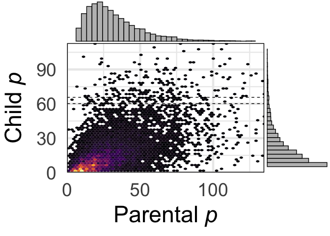<!-- -->

``` r
print(cor.test(masterdf$parentPcount,masterdf$cbcl_scr_syn_totprob_r))
```

    ## 
    ##  Pearson's product-moment correlation
    ## 
    ## data:  masterdf$parentPcount and masterdf$cbcl_scr_syn_totprob_r
    ## t = 67.24, df = 9562, p-value < 2.2e-16
    ## alternative hypothesis: true correlation is not equal to 0
    ## 95 percent confidence interval:
    ##  0.5528383 0.5800571
    ## sample estimates:
    ##       cor 
    ## 0.5666022

``` r
### P boots plot with overlaid linear fit
# load in data
Fits=readRDS('~/Desktop/g_p/gParentpFitBoots.rds')
# find mean shape and plot it: p
PFits=Fits[,481:640]
MaxP=find_furthest_nonzero(PFits)
# melt data for plotting each line
data_melt <- melt(t(PFits))
data_melt$Var1 <- rep(seq(1, 160), nrow(PFits))
# Calculate percentiles
percentiles <- PFits %>%
summarise(across(everything(), quantile, probs = c(0.01, 0.99), na.rm = TRUE))
```

    ## Warning: There was 1 warning in `summarise()`.
    ## ℹ In argument: `across(everything(), quantile, probs = c(0.01, 0.99), na.rm =
    ##   TRUE)`.
    ## Caused by warning:
    ## ! The `...` argument of `across()` is deprecated as of dplyr 1.1.0.
    ## Supply arguments directly to `.fns` through an anonymous function instead.
    ## 
    ##   # Previously
    ##   across(a:b, mean, na.rm = TRUE)
    ## 
    ##   # Now
    ##   across(a:b, \(x) mean(x, na.rm = TRUE))

    ## Warning: Returning more (or less) than 1 row per `summarise()` group was deprecated in
    ## dplyr 1.1.0.
    ## ℹ Please use `reframe()` instead.
    ## ℹ When switching from `summarise()` to `reframe()`, remember that `reframe()`
    ##   always returns an ungrouped data frame and adjust accordingly.
    ## Call `lifecycle::last_lifecycle_warnings()` to see where this warning was
    ## generated.

``` r
percentiles_long <- tidyr::pivot_longer(percentiles, cols = everything(), names_to = "Percentile", values_to = "YValue")

# Add CI column
data_melt$CI <- 0
  
# Prepare CIs for insertion
CIs <- data.frame(rep(seq(1, 160), 2), c(rep(10001, 160), rep(10002, 160)), percentiles_long$YValue, rep(1, (160*2)))
colnames(CIs) <- colnames(data_melt)
  
# Add CIs
data_melt2 <- rbind(data_melt, CIs)
  
# Convert CI column to factor
data_melt2$CI <- as.factor(data_melt2$CI)

# Plotting the lines
ggplot(data = data_melt2, aes(x = Var1, y = value, group = Var2)) +
  geom_line(aes(alpha = CI, color = Var2), show.legend = FALSE) +
  scale_color_viridis_c(option = "inferno", direction = -1) +
  scale_alpha_manual(values = c(0.01, 1), guide = FALSE) + ylim(c(-1.5,1.5)) +
  theme_minimal(base_size=35) + 
  ylab(y_title)+xlab(x_title)+
  theme(panel.border = element_rect(color = "black", fill = NA, size = 1)) +
  scale_x_continuous(limits = c(0,MaxP),expand = expansion(mult = c(0, 0)))
```

    ## Warning: Removed 250050 rows containing missing values (`geom_line()`).

    ## Warning: The `guide` argument in `scale_*()` cannot be `FALSE`. This was deprecated in
    ## ggplot2 3.3.4.
    ## ℹ Please use "none" instead.
    ## This warning is displayed once every 8 hours.
    ## Call `lifecycle::last_lifecycle_warnings()` to see where this warning was
    ## generated.

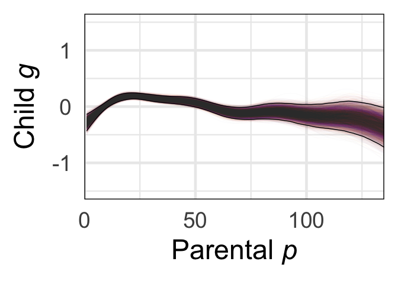<!-- -->

``` r
# load in data: 10,000 only done for p
Fits=readRDS('~/Desktop/g_p/gParentpDerivBoots.rds')
PFits=Fits[,481:640]
MaxP=find_furthest_nonzero(PFits)
# load in 1k data
Fits=readRDS('~/Desktop/g_p/gpFitBoots_asr.rds')

IFits = Fits[1:1000,(161:190)+437]
EFits = Fits[1:1000,(191:253)+437]
SomFits = Fits[1:1000,(254:273)+437]
AnxFits = Fits[1:1000,(274:304)+437]
ThoFits = Fits[1:1000,(305:322)+437]
WitFits = Fits[1:1000,(323:340)+437]
AttFits = Fits[1:1000,(341:371)+437]
RulFits = Fits[1:1000,(372:392)+437]
AggFits = Fits[1:1000,(393:437)+437]

MaxI=find_furthest_nonzero(IFits)
MaxE=find_furthest_nonzero(EFits)

# actually plot em
plot_bootstraps_par(PFits,160,x_title,MaxP)
```

    ## Warning: Returning more (or less) than 1 row per `summarise()` group was deprecated in
    ## dplyr 1.1.0.
    ## ℹ Please use `reframe()` instead.
    ## ℹ When switching from `summarise()` to `reframe()`, remember that `reframe()`
    ##   always returns an ungrouped data frame and adjust accordingly.
    ## Call `lifecycle::last_lifecycle_warnings()` to see where this warning was
    ## generated.

    ## Warning: Removed 250050 rows containing missing values (`geom_line()`).

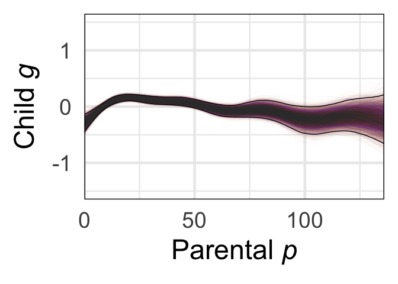<!-- -->

``` r
plot_bootstraps_par(IFits,30,'Parental Internalizing',MaxI)
```

    ## Warning: Returning more (or less) than 1 row per `summarise()` group was deprecated in
    ## dplyr 1.1.0.
    ## ℹ Please use `reframe()` instead.
    ## ℹ When switching from `summarise()` to `reframe()`, remember that `reframe()`
    ##   always returns an ungrouped data frame and adjust accordingly.
    ## Call `lifecycle::last_lifecycle_warnings()` to see where this warning was
    ## generated.

    ## Warning: Removed 5010 rows containing missing values (`geom_line()`).

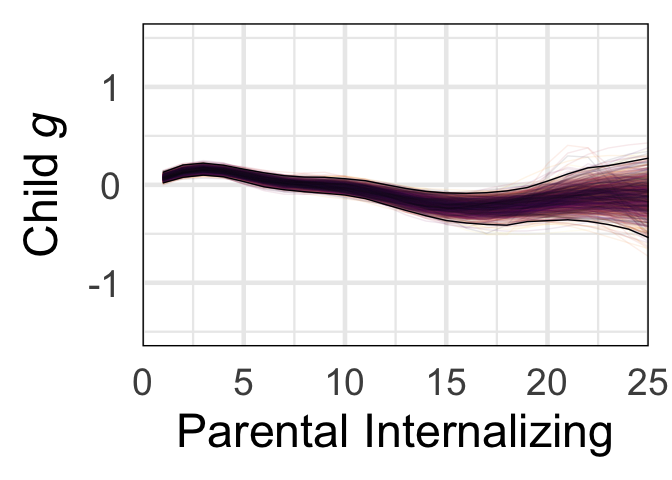<!-- -->

``` r
plot_bootstraps_par(EFits,63,'Parental Externalizing',MaxE)
```

    ## Warning: Returning more (or less) than 1 row per `summarise()` group was deprecated in
    ## dplyr 1.1.0.
    ## ℹ Please use `reframe()` instead.
    ## ℹ When switching from `summarise()` to `reframe()`, remember that `reframe()`
    ##   always returns an ungrouped data frame and adjust accordingly.
    ## Call `lifecycle::last_lifecycle_warnings()` to see where this warning was
    ## generated.

    ## Warning: Removed 17034 rows containing missing values (`geom_line()`).

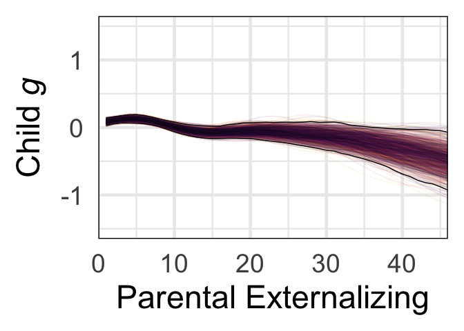<!-- -->

``` r
#plot_bootstraps_par(AnxFits,31,'anx.depr.',MaxAnx)
#plot_bootstraps(ThoFits,18,'thought',MaxTho,ThoBc,ThoC)
#plot_bootstraps(WitFits,16,'withdrawn',MaxWit,WitBc,WitC)
#plot_bootstraps(SocFits,17,'social',MaxSoc,SocBc,SocC)
#plot_bootstraps(AttFits,19,'attention',MaxAtt,AttBc,AttC)
#plot_bootstraps(RulFits,18,'rulebreak',MaxRul,RulBc,RulC)
#plot_bootstraps(AggFits,32,'aggressive',MaxAgg,AggBc,AggC)


MaxI=find_furthest_nonzero(IFits)
MaxE=find_furthest_nonzero(EFits)
MaxAnx=find_furthest_nonzero(AnxFits)
MaxTho=find_furthest_nonzero(ThoFits)
MaxWit=find_furthest_nonzero(WitFits)
#MaxSoc=find_furthest_nonzero(SocFits)
MaxSom=find_furthest_nonzero(SomFits)
MaxAtt=find_furthest_nonzero(AttFits)
MaxRul=find_furthest_nonzero(RulFits)
MaxAgg=find_furthest_nonzero(AggFits)
```

``` r
# load in data
Fits=readRDS('~/Desktop/g_p/gpDerivBoots_asr.rds')
# find mean shape and plot it: p
IFits = Fits[1:1000,(161:190)+437]
EFits = Fits[1:1000,(191:253)+437]
SomFits = Fits[1:1000,(254:273)+437]
AnxFits = Fits[1:1000,(274:304)+437]
ThoFits = Fits[1:1000,(305:322)+437]
WitFits = Fits[1:1000,(323:340)+437]
AttFits = Fits[1:1000,(341:371)+437]
RulFits = Fits[1:1000,(373:392)+437]
AggFits = Fits[1:1000,(393:437)+437]

# for p - saved out at 600x200, 300x200 for minor scales
# get straightfoward of segment where 99% is over 0 or under
positive_counts <- colSums(PFits > 0, na.rm = TRUE)
negative_counts <- colSums(PFits < 0, na.rm = TRUE)
# find where each is 99% or greater
positive_countsSig=positive_counts>9900
negative_countsSig=negative_counts>9900
# make dataframe: 50th percentile of derivatives accompanied by posSig and NegSig vector
data <- apply(PFits, 2, function(x) quantile(x, probs = 0.5))
dervPlotDf<-data.frame(data,positive_countsSig,negative_countsSig)
# if either is sig at 99% plot
dervPlotDf$sig_derivMask=dervPlotDf[,2]+dervPlotDf[,3]>0
# use it to mask calculated derivs
dervPlotDf$sig_deriv=0
dervPlotDf$sig_deriv[dervPlotDf$sig_derivMask]=dervPlotDf$data[dervPlotDf$sig_derivMask]
dervPlotDf$seq=1:(dim(dervPlotDf)[1])
ggplot(data=dervPlotDf) + geom_raster(aes(x = seq, y = .5, fill = sig_deriv))+
    theme(panel.spacing = unit(-.01,"cm")) +
    scale_fill_gradientn(colors = my_palette(100),limits = c(min(-.25),max(0.25)))+theme_minimal(base_size = 35)+
    xlim(c(0,MaxP))+xlab(x_title)+
    guides(fill=FALSE)+
    theme(axis.title.y = element_blank(),axis.text.y=element_blank())+theme(panel.border = element_rect(color = "black", fill = NA, size = 1))+
    scale_x_continuous(limits = c(0,MaxP),expand = expansion(mult = c(0, 0)))
```

    ## Scale for x is already present.
    ## Adding another scale for x, which will replace the existing scale.

    ## Warning: Removed 26 rows containing missing values (`geom_raster()`).

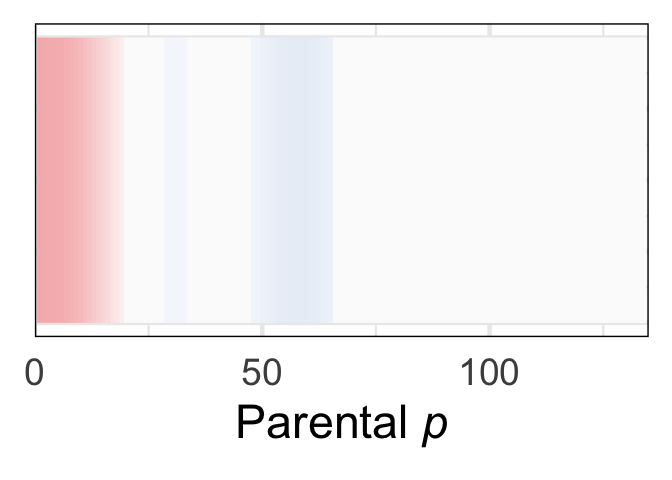<!-- -->

``` r
# and a version with colorbar - for p only (same color mapping using throughout)
dervPlotDf$Slope=dervPlotDf$sig_deriv
ggplot(data=dervPlotDf) + geom_raster(aes(x = seq, y = .5, fill = Slope))+
    theme(panel.spacing = unit(-.01,"cm")) +
    scale_fill_gradientn(colors = my_palette(100),limits = c(min(-.25),max(0.25)))+theme_minimal(base_size = 35)+
    xlim(c(0,MaxP))+xlab(expression(italic(p)))+
    theme(legend.key.width=unit(3,"cm"),axis.title.y = element_blank(),axis.text.y=element_blank())+theme(panel.border = element_rect(color = "black", fill = NA, size = 1))+
    scale_x_continuous(limits = c(0,MaxP),expand = expansion(mult = c(0, 0)))+
    theme(legend.position = "bottom",panel.border = element_rect(color = "black", fill = NA, size = 1),legend.margin = margin(-25, 0, 0, 0, "pt"),legend.key.width = unit(2.5,"cm"))+
    scale_x_continuous(limits = c(0,113),expand = expansion(mult = c(0, 0)))
```

    ## Scale for x is already present.
    ## Adding another scale for x, which will replace the existing scale.
    ## Scale for x is already present.
    ## Adding another scale for x, which will replace the existing scale.

    ## Warning: Removed 48 rows containing missing values (`geom_raster()`).

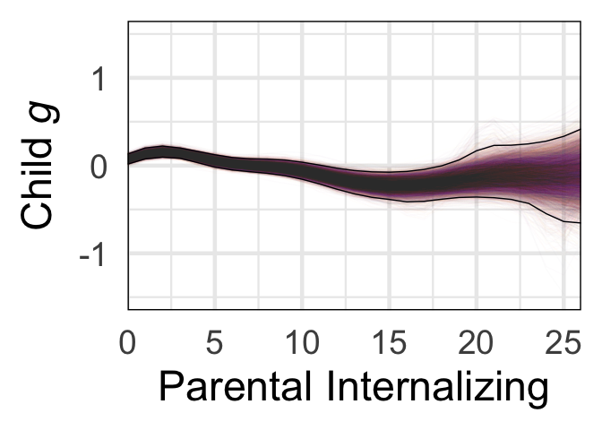<!-- -->

``` r
# for int
# get straightfoward of segment where 99% is over 0 or under
positive_counts <- colSums(IFits > 0, na.rm = TRUE)
negative_counts <- colSums(IFits < 0, na.rm = TRUE)
# find where each is 99% or greater
positive_countsSig=positive_counts>990
negative_countsSig=negative_counts>990
# make dataframe: 50th percentile of derivatives accompanied by posSig and NegSig vector
data <- apply(IFits, 2, function(x) quantile(x, probs = 0.5))
dervPlotDf<-data.frame(data,positive_countsSig,negative_countsSig)
# if either is sig at 99% plot
dervPlotDf$sig_derivMask=dervPlotDf[,2]+dervPlotDf[,3]>0
# use it to mask calculated derivs
dervPlotDf$sig_deriv=0
dervPlotDf$sig_deriv[dervPlotDf$sig_derivMask]=dervPlotDf$data[dervPlotDf$sig_derivMask]
dervPlotDf$seq=1:(dim(dervPlotDf)[1])
ggplot(data=dervPlotDf) + geom_raster(aes(x = seq, y = .5, fill = sig_deriv))+
    theme(panel.spacing = unit(-.01,"cm")) +
    scale_fill_gradientn(colors = my_palette(100),limits = c(min(-.25),max(0.25)))+theme_minimal(base_size = 35)+
    xlab('Parental Internalizing')+
    guides(fill=FALSE)+
    theme(axis.title.y = element_blank(),axis.text.y=element_blank())+theme(panel.border = element_rect(color = "black", fill = NA, size = 1))+
    scale_x_continuous(limits = c(0,MaxI),expand = expansion(mult = c(0, 0)))
```

    ## Warning: Removed 6 rows containing missing values (`geom_raster()`).

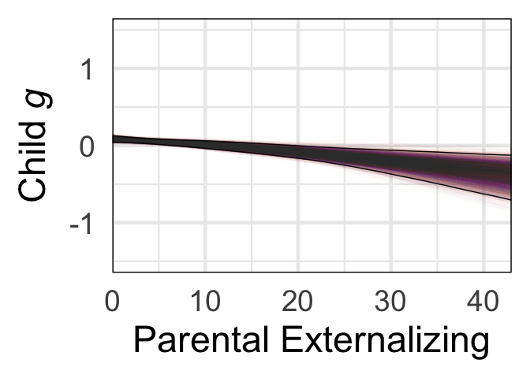<!-- -->

``` r
# for ext
# get straightfoward of segment where 99% is over 0 or under
positive_counts <- colSums(EFits > 0, na.rm = TRUE)
negative_counts <- colSums(EFits < 0, na.rm = TRUE)
# find where each is 99% or greater
positive_countsSig=positive_counts>990
negative_countsSig=negative_counts>990
# make dataframe: 50th percentile of derivatives accompanied by posSig and NegSig vector
data <- apply(EFits, 2, function(x) quantile(x, probs = 0.5))
dervPlotDf<-data.frame(data,positive_countsSig,negative_countsSig)
# if either is sig at 99% plot
dervPlotDf$sig_derivMask=dervPlotDf[,2]+dervPlotDf[,3]>0
# use it to mask calculated derivs
dervPlotDf$sig_deriv=0
dervPlotDf$sig_deriv[dervPlotDf$sig_derivMask]=dervPlotDf$data[dervPlotDf$sig_derivMask]
dervPlotDf$seq=1:(dim(dervPlotDf)[1])
ggplot(data=dervPlotDf) + geom_raster(aes(x = seq, y = .5, fill = sig_deriv))+
    theme(panel.spacing = unit(-.01,"cm")) +
    scale_fill_gradientn(colors = my_palette(100),limits = c(min(-.25),max(0.25)))+theme_minimal(base_size = 35)+
    xlim(c(0,MaxE))+xlab('Parental Externalizing')+
    guides(fill=FALSE)+
    theme(axis.title.y = element_blank(),axis.text.y=element_blank())+theme(panel.border = element_rect(color = "black", fill = NA, size = 1))+
    scale_x_continuous(limits = c(0,MaxE),expand = expansion(mult = c(0, 0)))
```

    ## Scale for x is already present.
    ## Adding another scale for x, which will replace the existing scale.

    ## Warning: Removed 18 rows containing missing values (`geom_raster()`).

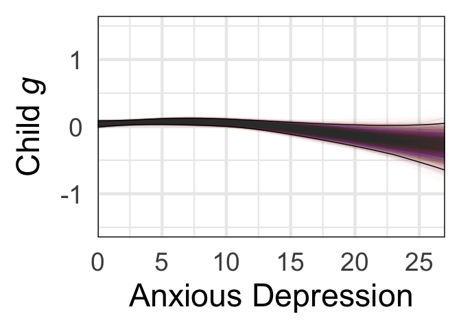<!-- -->

``` r
# for som
# get straightfoward of segment where 99% is over 0 or under
positive_counts <- colSums(SomFits > 0, na.rm = TRUE)
negative_counts <- colSums(SomFits < 0, na.rm = TRUE)
# find where each is 99% or greater
positive_countsSig=positive_counts>990
negative_countsSig=negative_counts>990
# make dataframe: 50th percentile of derivatives accompanied by posSig and NegSig vector
data <- apply(SomFits, 2, function(x) quantile(x, probs = 0.5))
dervPlotDf<-data.frame(data,positive_countsSig,negative_countsSig)
# if either is sig at 99% plot
dervPlotDf$sig_derivMask=dervPlotDf[,2]+dervPlotDf[,3]>0
# use it to mask calculated derivs
dervPlotDf$sig_deriv=0
dervPlotDf$sig_deriv[dervPlotDf$sig_derivMask]=dervPlotDf$data[dervPlotDf$sig_derivMask]
dervPlotDf$seq=1:(dim(dervPlotDf)[1])
ggplot(data=dervPlotDf) + geom_raster(aes(x = seq, y = .5, fill = sig_deriv))+
    theme(panel.spacing = unit(-.01,"cm")) +
    scale_fill_gradientn(colors = my_palette(100),limits = c(min(-.25),max(0.25)))+theme_minimal(base_size = 35)+
    xlim(c(0,MaxSom))+xlab('Somatic')+
    guides(fill=FALSE)+
    theme(axis.title.y = element_blank(),axis.text.y=element_blank())+theme(panel.border = element_rect(color = "black", fill = NA, size = 1))+
    scale_x_continuous(limits = c(0,MaxSom),expand = expansion(mult = c(0, 0)))
```

    ## Scale for x is already present.
    ## Adding another scale for x, which will replace the existing scale.

    ## Warning: Removed 5 rows containing missing values (`geom_raster()`).

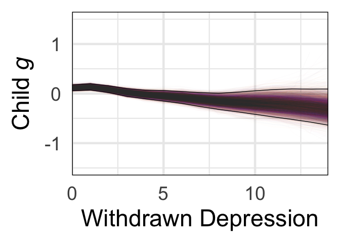<!-- -->

``` r
# for anx
positive_counts <- colSums(AnxFits > 0, na.rm = TRUE)
negative_counts <- colSums(AnxFits < 0, na.rm = TRUE)
positive_countsSig=positive_counts>990
negative_countsSig=negative_counts>990
data <- apply(AnxFits, 2, function(x) quantile(x, probs = 0.5))
dervPlotDf<-data.frame(data,positive_countsSig,negative_countsSig)
dervPlotDf$sig_derivMask=dervPlotDf[,2]+dervPlotDf[,3]>0
dervPlotDf$sig_deriv=0
dervPlotDf$sig_deriv[dervPlotDf$sig_derivMask]=dervPlotDf$data[dervPlotDf$sig_derivMask]
dervPlotDf$seq=1:(dim(dervPlotDf)[1])
ggplot(data=dervPlotDf) + geom_raster(aes(x = seq, y = .5, fill = sig_deriv))+
    theme(panel.spacing = unit(-.01,"cm")) +
    scale_fill_gradientn(colors = my_palette(100),limits = c(min(-.25),max(0.25)))+theme_minimal(base_size = 35)+
    xlim(c(0,MaxAnx))+xlab('Anxious Depression')+
    guides(fill=FALSE)+
    theme(axis.title.y = element_blank(),axis.text.y=element_blank())+theme(panel.border = element_rect(color = "black", fill = NA, size = 1))+
    scale_x_continuous(limits = c(0,MaxAnx),expand = expansion(mult = c(0, 0)))
```

    ## Scale for x is already present.
    ## Adding another scale for x, which will replace the existing scale.

    ## Warning: Removed 5 rows containing missing values (`geom_raster()`).

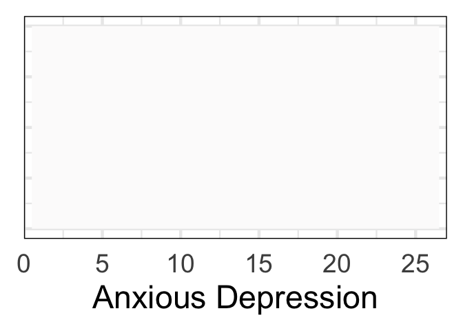<!-- -->

``` r
# for Tho
positive_counts <- colSums(ThoFits > 0, na.rm = TRUE)
negative_counts <- colSums(ThoFits < 0, na.rm = TRUE)
positive_countsSig=positive_counts>990
negative_countsSig=negative_counts>990
data <- apply(ThoFits, 2, function(x) quantile(x, probs = 0.5))
dervPlotDf<-data.frame(data,positive_countsSig,negative_countsSig)
dervPlotDf$sig_derivMask=dervPlotDf[,2]+dervPlotDf[,3]>0
dervPlotDf$sig_deriv=0
dervPlotDf$sig_deriv[dervPlotDf$sig_derivMask]=dervPlotDf$data[dervPlotDf$sig_derivMask]
dervPlotDf$seq=1:(dim(dervPlotDf)[1])
ggplot(data=dervPlotDf) + geom_raster(aes(x = seq, y = .5, fill = sig_deriv))+
    theme(panel.spacing = unit(-.01,"cm")) +
    scale_fill_gradientn(colors = my_palette(100),limits = c(min(-.26),max(0.26)))+theme_minimal(base_size = 35)+
    xlim(c(0,MaxTho))+xlab('Thought')+
    guides(fill=FALSE)+
    theme(axis.title.y = element_blank(),axis.text.y=element_blank())+theme(panel.border = element_rect(color = "black", fill = NA, size = 1))+
    scale_x_continuous(limits = c(0,MaxTho),expand = expansion(mult = c(0, 0)))
```

    ## Scale for x is already present.
    ## Adding another scale for x, which will replace the existing scale.

    ## Warning: Removed 5 rows containing missing values (`geom_raster()`).

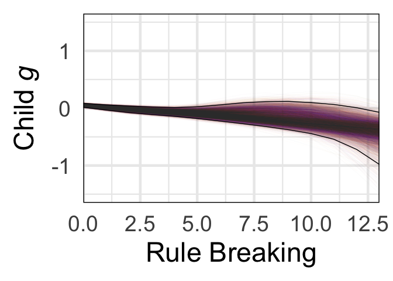<!-- -->

``` r
# for Wit
positive_counts <- colSums(WitFits > 0, na.rm = TRUE)
negative_counts <- colSums(WitFits < 0, na.rm = TRUE)
positive_countsSig=positive_counts>990
negative_countsSig=negative_counts>990
data <- apply(WitFits, 2, function(x) quantile(x, probs = 0.5))
dervPlotDf<-data.frame(data,positive_countsSig,negative_countsSig)
dervPlotDf$sig_derivMask=dervPlotDf[,2]+dervPlotDf[,3]>0
dervPlotDf$sig_deriv=0
dervPlotDf$sig_deriv[dervPlotDf$sig_derivMask]=dervPlotDf$data[dervPlotDf$sig_derivMask]
dervPlotDf$seq=1:(dim(dervPlotDf)[1])
ggplot(data=dervPlotDf) + geom_raster(aes(x = seq, y = .5, fill = sig_deriv))+
      theme(panel.spacing = unit(-.01,"cm")) +
      scale_fill_gradientn(colors = my_palette(100),limits = c(min(-.25),max(0.25)))+theme_minimal(base_size = 35)+xlim(c(0,MaxWit))+xlab('Withdrawn Depression')+
      guides(fill=FALSE)+
      theme(axis.title.y = element_blank(),axis.text.y=element_blank())+theme(panel.border = element_rect(color = "black", fill = NA, size = 1))+
      scale_x_continuous(limits = c(0,MaxWit),expand = expansion(mult = c(0, 0)))
```

    ## Scale for x is already present.
    ## Adding another scale for x, which will replace the existing scale.

    ## Warning: Removed 6 rows containing missing values (`geom_raster()`).

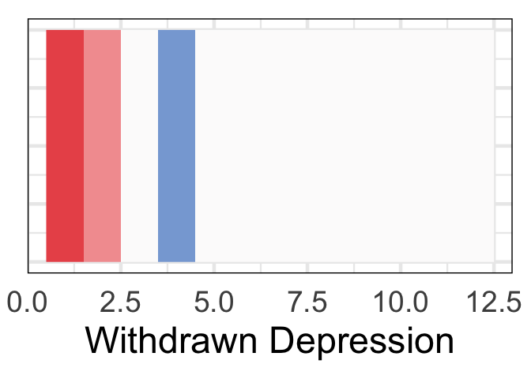<!-- -->

``` r
# for Att
positive_counts <- colSums(AttFits > 0, na.rm = TRUE)
negative_counts <- colSums(AttFits < 0, na.rm = TRUE)
positive_countsSig=positive_counts>990
negative_countsSig=negative_counts>990
data <- apply(AttFits, 2, function(x) quantile(x, probs = 0.5))
dervPlotDf<-data.frame(data,positive_countsSig,negative_countsSig)
dervPlotDf$sig_derivMask=dervPlotDf[,2]+dervPlotDf[,3]>0
dervPlotDf$sig_deriv=0
dervPlotDf$sig_deriv[dervPlotDf$sig_derivMask]=dervPlotDf$data[dervPlotDf$sig_derivMask]
dervPlotDf$seq=1:(dim(dervPlotDf)[1])
ggplot(data=dervPlotDf) + geom_raster(aes(x = seq, y = .5, fill = sig_deriv))+
      theme(panel.spacing = unit(-.01,"cm")) +
      scale_fill_gradientn(colors = my_palette(100),limits = c(min(-.25),max(0.25)))+theme_minimal(base_size = 35)+xlim(c(0,MaxAtt))+xlab('Attention')+
      guides(fill=FALSE)+
      theme(axis.title.y = element_blank(),axis.text.y=element_blank())+theme(panel.border = element_rect(color = "black", fill = NA, size = 1))+
      scale_x_continuous(limits = c(0,MaxAtt),expand = expansion(mult = c(0, 0)))
```

    ## Scale for x is already present.
    ## Adding another scale for x, which will replace the existing scale.

    ## Warning: Removed 5 rows containing missing values (`geom_raster()`).

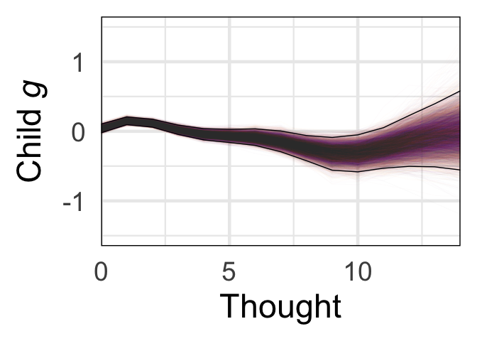<!-- -->

``` r
# for Rul
positive_counts <- colSums(RulFits > 0, na.rm = TRUE)
negative_counts <- colSums(RulFits < 0, na.rm = TRUE)
positive_countsSig=positive_counts>990
negative_countsSig=negative_counts>990
data <- apply(RulFits, 2, function(x) quantile(x, probs = 0.5))
dervPlotDf<-data.frame(data,positive_countsSig,negative_countsSig)
dervPlotDf$sig_derivMask=dervPlotDf[,2]+dervPlotDf[,3]>0
dervPlotDf$sig_deriv=0
dervPlotDf$sig_deriv[dervPlotDf$sig_derivMask]=dervPlotDf$data[dervPlotDf$sig_derivMask]
dervPlotDf$seq=1:(dim(dervPlotDf)[1])
ggplot(data=dervPlotDf) + geom_raster(aes(x = seq, y = .5, fill = sig_deriv))+
      theme(panel.spacing = unit(-.01,"cm")) +
      scale_fill_gradientn(colors = my_palette(100),limits = c(min(-.25),max(0.25)))+theme_minimal(base_size = 35)+xlim(c(0,MaxRul))+xlab('Rule Breaking')+
      guides(fill=FALSE)+
      theme(axis.title.y = element_blank(),axis.text.y=element_blank())+theme(panel.border = element_rect(color = "black", fill = NA, size = 1))+
      scale_x_continuous(breaks=c(0,3,6,9,12),limits = c(0,MaxRul),expand = expansion(mult = c(0, 0)))
```

    ## Scale for x is already present.
    ## Adding another scale for x, which will replace the existing scale.

    ## Warning: Removed 8 rows containing missing values (`geom_raster()`).

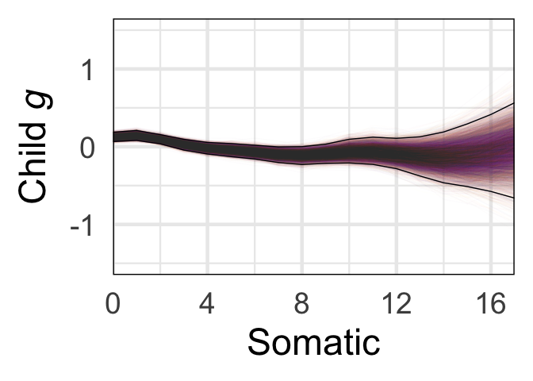<!-- -->

``` r
# for Agg
positive_counts <- colSums(AggFits > 0, na.rm = TRUE)
negative_counts <- colSums(AggFits < 0, na.rm = TRUE)
positive_countsSig=positive_counts>990
negative_countsSig=negative_counts>990
data <- apply(AggFits, 2, function(x) quantile(x, probs = 0.5))
dervPlotDf<-data.frame(data,positive_countsSig,negative_countsSig)
dervPlotDf$sig_derivMask=dervPlotDf[,2]+dervPlotDf[,3]>0
dervPlotDf$sig_deriv=0
dervPlotDf$sig_deriv[dervPlotDf$sig_derivMask]=dervPlotDf$data[dervPlotDf$sig_derivMask]
dervPlotDf$seq=1:(dim(dervPlotDf)[1])
ggplot(data=dervPlotDf) + geom_raster(aes(x = seq, y = .5, fill = sig_deriv))+
      theme(panel.spacing = unit(-.01,"cm")) +
      scale_fill_gradientn(colors = my_palette(100),limits = c(min(-.25),max(0.25)))+theme_minimal(base_size = 35)+xlim(c(0,MaxAgg))+xlab('Aggression')+
      guides(fill=FALSE)+
      theme(axis.title.y = element_blank(),axis.text.y=element_blank())+theme(panel.border = element_rect(color = "black", fill = NA, size = 1))+
      scale_x_continuous(limits = c(0,MaxAgg),expand = expansion(mult = c(0, 0)))
```

    ## Scale for x is already present.
    ## Adding another scale for x, which will replace the existing scale.

    ## Warning: Removed 12 rows containing missing values (`geom_raster()`).

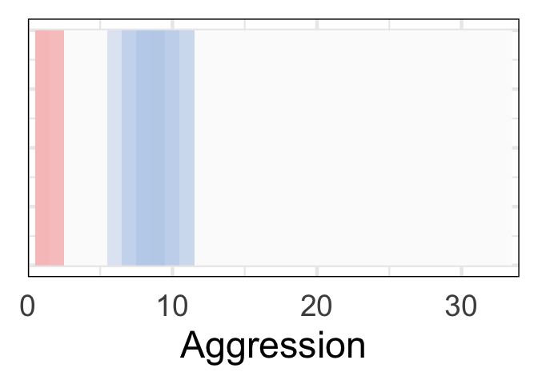<!-- -->

``` r
# for each bootstrap, recover median slope
df <- data.frame(
  p = apply(PFits[, 1:MaxP], 1, median),
  Internal = apply(IFits[, 1:MaxI], 1, median),
  External = apply(EFits[, 1:MaxE], 1, median),
  Somatic = apply(SomFits[, 1:MaxSom], 1, median),
  AnxDepr = apply(AnxFits[, 1:MaxAnx], 1, median),
  Thought = apply(ThoFits[, 1:MaxTho], 1, median),
  WithDepr = apply(WitFits[, 1:MaxWit], 1, median),
  # can replace with intrusive
  #Social = apply(SocFits[, 1:MaxSoc], 1, median),
  Attn = apply(AttFits[, 1:MaxAtt], 1, median),
  Rules = apply(RulFits[, 1:MaxRul], 1, median),
  Aggr = apply(AggFits[, 1:MaxAgg], 1, median)
)
```

    ## Warning in data.frame(p = apply(PFits[, 1:MaxP], 1, median), Internal =
    ## apply(IFits[, : row names were found from a short variable and have been
    ## discarded

``` r
# Convert the data frame to a tidy format
df_tidy <- df %>%
  gather(key = "Subscale", value = "MedianValue")

# Calculate the median for each subscale iteration
df_median <- df_tidy %>%
  group_by(Subscale) %>%
  summarize(MedianIteration = median(MedianValue))

# Join the MedianIteration column to df_tidy based on Subscale
df_tidy <- left_join(df_tidy, df_median, by = "Subscale")

df_tidy$Subscale <- reorder(df_tidy$Subscale, -df_tidy$MedianValue, median)

# Create the boxplot
ggplot(df_tidy, aes(x = Subscale, y = MedianValue,fill=MedianIteration)) +
  geom_boxplot() +
  labs(title = "Median Association with Cognitive Score",
       x = "Subscale",
       y = "Median Slope") +
  theme_minimal(base_size=20)+scale_fill_gradientn(
    colors = my_palette(100),
    limits = c(-.27,.27))+guides(fill=F)+theme(panel.border = element_rect(color = "black", fill = NA, size = 1))
```

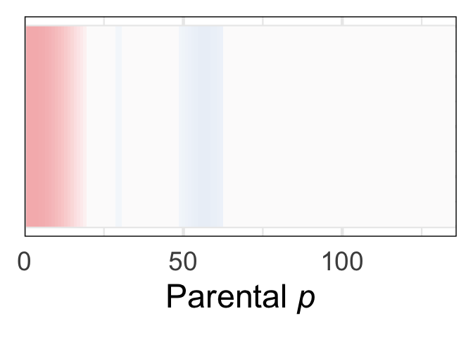<!-- -->
