Figure3
================
2023-05-06

``` r
# figure 3
library(mgcv)
```

    ## Loading required package: nlme

    ## This is mgcv 1.8-42. For overview type 'help("mgcv-package")'.

``` r
library(visreg)
library(gratia)
library(dplyr)
```

    ## 
    ## Attaching package: 'dplyr'

    ## The following object is masked from 'package:nlme':
    ## 
    ##     collapse

    ## The following objects are masked from 'package:stats':
    ## 
    ##     filter, lag

    ## The following objects are masked from 'package:base':
    ## 
    ##     intersect, setdiff, setequal, union

``` r
library(tidyr)
library(stringr)
library(data.table)
```

    ## 
    ## Attaching package: 'data.table'

    ## The following objects are masked from 'package:dplyr':
    ## 
    ##     between, first, last

``` r
library(ggridges)
library(ggbeeswarm)
```

    ## Loading required package: ggplot2

``` r
library(ggExtra)
```

``` r
# set functions
plot_bootstraps <- function(data,maxval,Name,maxValuePlot,BorderlineClinical,Clinical) {
  # Melt the data frame
  data_melt <- melt(t(data))
  data_melt$Var1 <- rep(seq(1, maxval), nrow(data))

  # Calculate percentiles
  percentiles <- data %>%
    summarise(across(everything(), quantile, probs = c(0.01, 0.99), na.rm = TRUE))
  
  percentiles_long <- tidyr::pivot_longer(percentiles, cols = everything(), names_to = "Percentile", values_to = "YValue")

  # Add CI column
  data_melt$CI <- 0
  
  # Prepare CIs for insertion
  CIs <- data.frame(rep(seq(1, maxval), 2), c(rep(10001, maxval), rep(10002, maxval)), percentiles_long$YValue, rep(1, (maxval*2)))
  colnames(CIs) <- colnames(data_melt)
  
  # Add CIs
  data_melt2 <- rbind(data_melt, CIs)
  
  # Convert CI column to factor
  data_melt2$CI <- as.factor(data_melt2$CI)
  
  # Plotting the lines
  ggplot(data = data_melt2, aes(x = Var1, y = value, group = Var2, color = Var2)) +
    geom_line(aes(alpha = CI), show.legend = FALSE) +
    scale_color_viridis_c(option = "inferno", direction = -1) +
    scale_alpha_manual(values = c(0.01, 1), guide = FALSE) + ylim(c(-1.5,1.5)) +
    theme_minimal(base_size=35) + 
    ylab(expression(italic(g)))+xlab(Name)+
    geom_vline(xintercept = BorderlineClinical, linetype = "dashed")+
    geom_vline(xintercept = Clinical, linetype = "dashed")+
    theme(panel.border = element_rect(color = "black", fill = NA, size = 1))+
    scale_x_continuous(limits = c(0,maxValuePlot),expand = expansion(mult = c(0, 0)))
}

find_furthest_nonzero <- function(data) {
  numZeros=colSums(data==0)
  isZeroZeros=numZeros==0
  furthest_nonzero=sum(isZeroZeros)
}

# set colors
my_palette <- colorRampPalette(colors = c("#051099", "#1d5cb7", "white", "#e41a1c", "#a80009"))
```

``` r
# load in fits: ordered as follows:
# F_pFit,M_pFit,P_pFit,R_pFit
Fits=readRDS('~/Desktop/g_p/F3_gpFits.rds')

# read in masterdf from sample construction
masterdf=readRDS('~/gp_masterdf.rds')

# pull clinical cutoff from master df: t scores > 65 = borderline clinical, 70 = clinical
masterdfP_bc<-masterdf[masterdf$cbcl_scr_syn_totprob_t==65,]
masterdfP_c<-masterdf[masterdf$cbcl_scr_syn_totprob_t==69,]

# borderline clinical and clinical cutoffs
Pbc=mean(masterdfP_bc$cbcl_scr_syn_totprob_r)
Pc=mean(masterdfP_c$cbcl_scr_syn_totprob_r)
```

``` r
# isolate Female, Male, Poor, Rich
F_PFits=Fits[,1:128]

# calculate some background info for plots
MaxP=find_furthest_nonzero(F_PFits)

# get median value
F_PFits_Coverage=F_PFits[,seq(1:MaxP)]
col_means=colMeans(F_PFits_Coverage)
FP_medians <- apply(F_PFits_Coverage, 2, median)
```

``` r
# isolate male fits
M_PFits=Fits[,129:256]

# calculate some background info for plots
MaxP=find_furthest_nonzero(M_PFits)

# get mean median value
M_PFits_Coverage=M_PFits[,seq(1:MaxP)]
col_means=colMeans(M_PFits_Coverage)
MP_medians <- apply(M_PFits_Coverage, 2, median)
# need to truncate boys further because girls have fewer max symptoms
MP_medians=MP_medians[1:(find_furthest_nonzero(F_PFits))]

data <- data.frame(
  x = 0:(length(FP_medians)-1),
  y_girls = FP_medians,
  y_boys = MP_medians
)

# Create the line plot for p
ggplot(data, aes(x = x, y = y_boys)) +
  geom_line(aes(), color = "#fbad24", size = 3) +
  geom_line(aes(y=y_girls),color = "#923eb5", size = 3) +
  labs(x = expression(italic(p)), y = expression(italic(g))) +
  theme_minimal(base_size = 35) +
  theme(plot.title = element_text(hjust = 0.5),
        legend.position = "top",
        legend.title = element_blank(),
        legend.background = element_rect(fill = "white"))+ylim(-1.5,1.5)+
  geom_vline(xintercept = Pbc, linetype = "dashed")+
  geom_vline(xintercept = Pc, linetype = "dashed")+
        theme(panel.border = element_rect(color = "black", fill = NA, size = 1))+
        # 78 is max value in poverty subset: match here for figure consistency
        scale_x_continuous(limits = c(0,78),expand = expansion(mult = c(0, 0)))
```

    ## Warning: Using `size` aesthetic for lines was deprecated in ggplot2 3.4.0.
    ## ℹ Please use `linewidth` instead.
    ## This warning is displayed once every 8 hours.
    ## Call `lifecycle::last_lifecycle_warnings()` to see where this warning was
    ## generated.

    ## Warning: The `size` argument of `element_rect()` is deprecated as of ggplot2 3.4.0.
    ## ℹ Please use the `linewidth` argument instead.
    ## This warning is displayed once every 8 hours.
    ## Call `lifecycle::last_lifecycle_warnings()` to see where this warning was
    ## generated.

    ## Warning: Removed 35 rows containing missing values (`geom_line()`).
    ## Removed 35 rows containing missing values (`geom_line()`).

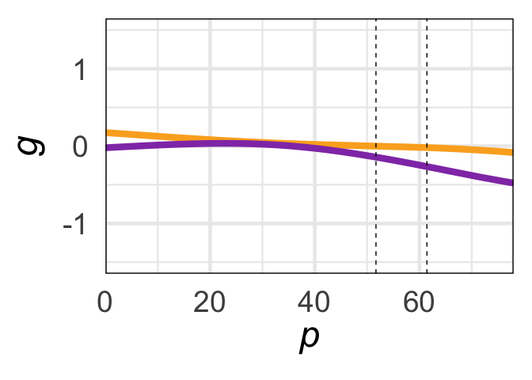<!-- -->

``` r
# and derivatives
# Create an empty matrix to store the derivatives
F_P_derivative_matrix <- matrix(0, nrow = nrow(F_PFits), ncol = ncol(F_PFits) - 1)

# Calculate the derivative for each column
for (i in 1:(ncol(F_PFits) - 1)) {
  # Calculate the differences in x (assuming a constant difference)
  dx <- 1
  # Calculate the differences in y (predicted values)
  dy <- F_PFits[, i + 1] - F_PFits[, i]
  # Calculate the derivatives (slopes)
  derivatives <- dy / dx
  # Store the derivatives in the derivative matrix
  F_P_derivative_matrix[, i] <- derivatives
}

# Create an empty matrix to store the derivatives
M_P_derivative_matrix <- matrix(0, nrow = nrow(M_PFits), ncol = ncol(M_PFits) - 1)

# Calculate the derivative for each column
for (i in 1:(ncol(F_PFits) - 1)) {
  # Calculate the differences in x (assuming a constant difference)
  dx <- 1
  # Calculate the differences in y (predicted values)
  dy <- M_PFits[, i + 1] - M_PFits[, i]
  # Calculate the derivatives (slopes)
  derivatives <- dy / dx
  # Store the derivatives in the derivative matrix
  M_P_derivative_matrix[, i] <- derivatives
}

# calc sig dervs
# get straightfoward of segment where 99% is over 0 or under
positive_counts <- colSums(F_P_derivative_matrix > 0, na.rm = TRUE)
negative_counts <- colSums(F_P_derivative_matrix < 0, na.rm = TRUE)
# find where each is 99% or greater
positive_countsSig=positive_counts>9900
negative_countsSig=negative_counts>9900
# make dataframe: 50th percentile of derivatives accompanied by posSig and NegSig vector
data <- apply(F_P_derivative_matrix, 2, function(x) quantile(x, probs = 0.5))
dervPlotDf<-data.frame(data,positive_countsSig,negative_countsSig)
# if either is sig at 99% plot
dervPlotDf$sig_derivMask=dervPlotDf[,2]+dervPlotDf[,3]>0
# use it to mask calculated derivs
dervPlotDf$sig_deriv=0
dervPlotDf$sig_deriv[dervPlotDf$sig_derivMask]=dervPlotDf$data[dervPlotDf$sig_derivMask]
dervPlotDf$seq=1:(dim(dervPlotDf)[1])
ggplot(data=dervPlotDf) + geom_raster(aes(x = seq, y = .5, fill = sig_deriv))+
    theme(panel.spacing = unit(-.01,"cm")) +
    scale_fill_gradientn(colors = my_palette(100),limits = c(min(-.1),max(0.1)))+theme_minimal(base_size = 35)+
    xlim(c(0,MaxP))+xlab('Girl P')+
    guides(fill=FALSE)+
    theme(axis.title.y = element_blank(),axis.text.y=element_blank())+theme(panel.border = element_rect(color = "black", fill = NA, size = 1))+
    scale_x_continuous(limits = c(0,MaxP),expand = expansion(mult = c(0, 0)))
```

    ## Warning: The `<scale>` argument of `guides()` cannot be `FALSE`. Use "none" instead as
    ## of ggplot2 3.3.4.
    ## This warning is displayed once every 8 hours.
    ## Call `lifecycle::last_lifecycle_warnings()` to see where this warning was
    ## generated.

    ## Scale for x is already present.
    ## Adding another scale for x, which will replace the existing scale.

    ## Warning: Removed 14 rows containing missing values (`geom_raster()`).

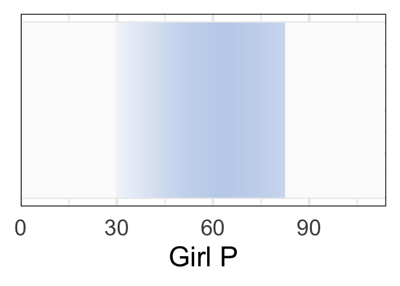<!-- -->

``` r
# get straightfoward of segment where 99% is over 0 or under
positive_counts <- colSums(M_P_derivative_matrix > 0, na.rm = TRUE)
negative_counts <- colSums(M_P_derivative_matrix < 0, na.rm = TRUE)
# find where each is 99% or greater
positive_countsSig=positive_counts>9900
negative_countsSig=negative_counts>9900
# make dataframe: 50th percentile of derivatives accompanied by posSig and NegSig vector
data <- apply(M_P_derivative_matrix, 2, function(x) quantile(x, probs = 0.5))
dervPlotDf<-data.frame(data,positive_countsSig,negative_countsSig)
# if either is sig at 99% plot
dervPlotDf$sig_derivMask=dervPlotDf[,2]+dervPlotDf[,3]>0
# use it to mask calculated derivs
dervPlotDf$sig_deriv=0
dervPlotDf$sig_deriv[dervPlotDf$sig_derivMask]=dervPlotDf$data[dervPlotDf$sig_derivMask]
dervPlotDf$seq=1:(dim(dervPlotDf)[1])
ggplot(data=dervPlotDf) + geom_raster(aes(x = seq, y = .5, fill = sig_deriv))+
    theme(panel.spacing = unit(-.01,"cm")) +
    scale_fill_gradientn(colors = my_palette(100),limits = c(min(-.1),max(0.1)))+theme_minimal(base_size = 35)+
    xlim(c(0,MaxP))+xlab('Boy P')+
    guides(fill=FALSE)+
    theme(axis.title.y = element_blank(),axis.text.y=element_blank())+theme(panel.border = element_rect(color = "black", fill = NA, size = 1))+
    scale_x_continuous(limits = c(0,MaxP),expand = expansion(mult = c(0, 0)))
```

    ## Scale for x is already present.
    ## Adding another scale for x, which will replace the existing scale.

    ## Warning: Removed 14 rows containing missing values (`geom_raster()`).

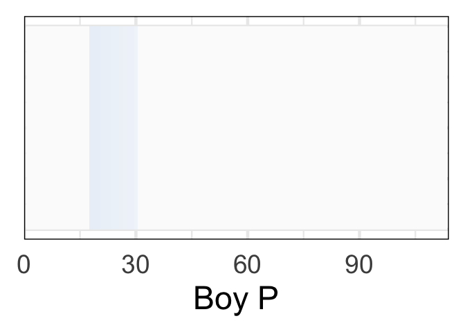<!-- -->

``` r
# grades plots from master df
grade_levels <- c(5, 4, 3, 2, 1)
grade_labels <- c("F", "Failing", "C", "B", "A")
masterdf$plotGrades<-factor(masterdf$Grades, levels = grade_levels, labels = grade_labels)
masterdf$plotGrades[masterdf$plotGrades=="F"]="Failing"
# only 28 f's: merge into Ds
boys_data <- subset(masterdf, sex == "M")
girls_data <- subset(masterdf, sex == "F")

# plot girls
girlsWealth=subset(girls_data, income >5)
girlsPoor=subset(masterdf, income <5)
ggplot(girlsWealth, aes(x = cbcl_scr_syn_totprob_r, y = plotGrades)) +
  geom_boxplot(fill="#923eb5") +
  labs(title = "Girls above poverty line",
       x = expression(italic(p)),
       y = "Grades")+theme_minimal(base_size=25)+xlim(0,113)+
      geom_vline(xintercept = Pbc, linetype = "dashed")+
      geom_vline(xintercept = Pc, linetype = "dashed")
```

    ## Warning: Removed 3 rows containing non-finite values (`stat_boxplot()`).

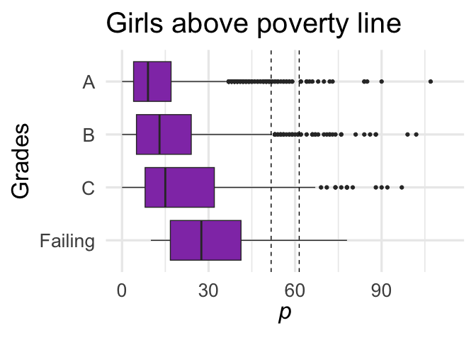<!-- -->

``` r
ggplot(girlsPoor, aes(x = cbcl_scr_syn_totprob_r, y = plotGrades)) +
  geom_boxplot(fill="#923eb5") +
  labs(title = "Girls below poverty line",
       x = expression(italic(p)),
       y = "Grades")+theme_minimal(base_size=25)+xlim(0,113)+
      geom_vline(xintercept = Pbc, linetype = "dashed")+
      geom_vline(xintercept = Pc, linetype = "dashed")
```

    ## Warning: Removed 2 rows containing non-finite values (`stat_boxplot()`).

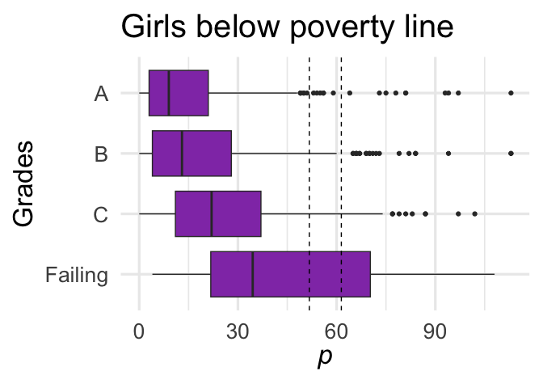<!-- -->

``` r
# plot boys
boysWealth=subset(boys_data, income >5)
boysPoor=subset(boys_data, income <5)
# Create the box plot for boys
ggplot(boysWealth, aes(x = cbcl_scr_syn_totprob_r, y = plotGrades)) +
  geom_boxplot(fill="#fbad24") +
  labs(title = "Boys above poverty line",
       x = expression(italic(p)),
       y = "Grades")+theme_minimal(base_size=25)+xlim(0,113)+
      geom_vline(xintercept = Pbc, linetype = "dashed")+
      geom_vline(xintercept = Pc, linetype = "dashed")
```

    ## Warning: Removed 1 rows containing non-finite values (`stat_boxplot()`).

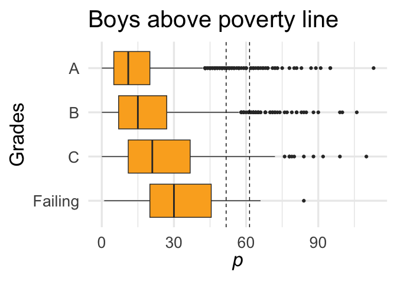<!-- -->

``` r
ggplot(boysPoor, aes(x = cbcl_scr_syn_totprob_r, y = plotGrades)) +
  geom_boxplot(fill="#fbad24")+
  labs(title = "Boys below poverty line",
       x = expression(italic(p)),
       y = "Grades")+theme_minimal(base_size=25)+xlim(0,113)+
      geom_vline(xintercept = Pbc, linetype = "dashed")+
      geom_vline(xintercept = Pc, linetype = "dashed")
```

    ## Warning: Removed 2 rows containing non-finite values (`stat_boxplot()`).

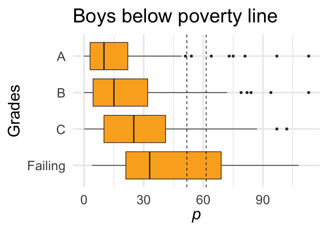<!-- -->

``` r
# deviance explained plots
DevExpl=readRDS('~/Desktop/g_p/F3-5DevExpl.rds')
DevExpl_L=readRDS('~/Desktop/g_p/F3-5DevExpl_longit.rds')
# extract deviance explained above-any-beyond dev expl py timepoint 1 p
DevExpl_L_Relative=DevExpl_L-DevExpl_L[,1]

df_long <- reshape2::melt(DevExpl)
```

    ## No id variables; using all as measure variables

``` r
custom_labels <- c(expression(italic(g)), "Grades", expression(paste(italic(g), " + Parental ", italic("p"))),expression(paste("Grades + Parental ", italic("p"))))
# Create the boxplot - 1350 x 800 dimensions
ggplot(df_long, aes(x = variable, y = value)) +
  geom_boxplot(outlier.alpha = 0.1) +
  xlab("Variables") +
  scale_x_discrete(labels = custom_labels) +
  ylab("Cross-sectional Deviance Explained") + theme_minimal(base_size=26)
```

    ## Warning: Removed 4 rows containing non-finite values (`stat_boxplot()`).

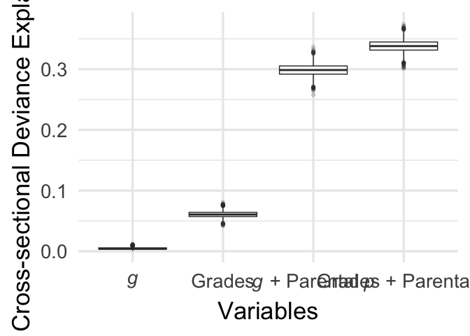<!-- -->

``` r
# now for longitudinal variables
custom_labels <- c(expression(italic(g)), "Grades", expression(paste(italic(g), " + Parental ", italic("p"))),expression(paste("Grades + Parental ", italic("p"))))
df_long <- reshape2::melt(DevExpl_L_Relative[,2:5])
```

    ## No id variables; using all as measure variables

``` r
# Create the boxplot
ggplot(df_long, aes(x = variable, y = value)) +
  geom_boxplot(outlier.alpha = 0.1) +
  xlab("Variables") +
  scale_x_discrete(labels = custom_labels) +
  ylab("Longitudinal Deviance Explained") + theme_minimal(base_size=26)
```

    ## Warning: Removed 3 rows containing non-finite values (`stat_boxplot()`).

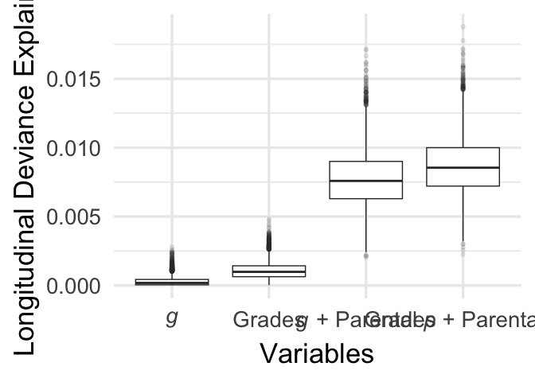<!-- -->

``` r
# grades plots from master df
grade_levels <- c(5, 4, 3, 2, 1)
grade_labels <- c("F", "Failing", "C", "B", "A")
masterdf$plotGrades<-factor(masterdf$Grades, levels = grade_levels, labels = grade_labels)
masterdf$plotGrades[masterdf$plotGrades=="F"]="Failing"
plotdf=masterdf[,c('plotGrades','g')]
### supplementary grades fig
ggplot(plotdf, aes(x = g, y = plotGrades)) +
  geom_boxplot() +
  labs(title = "All Children",
       x = expression(italic(g)),
       y = "Grades")+theme_minimal(base_size=25)+xlim(-4,4.6)
```

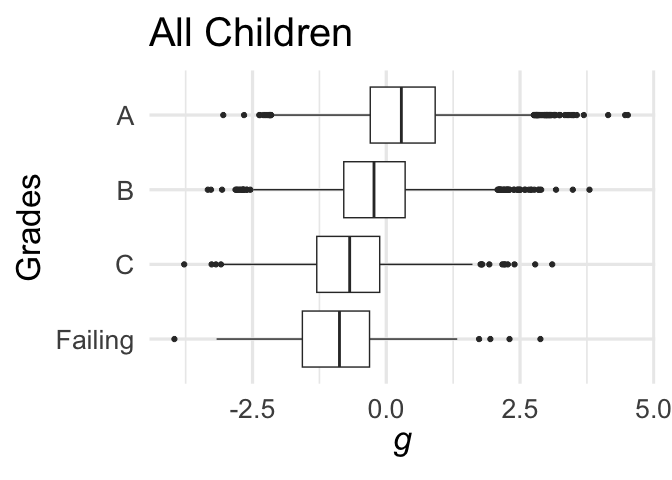<!-- -->

``` r
# poverty plots from master df
masterdf$income<-as.numeric(masterdf$income)
# note that poverty is defined as income < 5: https://collection3165.readthedocs.io/en/stable/recommendations/#2-the-bids-participants-files-and-matched-groups
masterdf$poverty=0
masterdf$poverty[masterdf$income<5]=1
masterdf$poverty=as.ordered(masterdf$poverty)
pov_labels <- c("Above Poverty Line", "Below")
masterdf$poverty<-factor(masterdf$poverty, labels = pov_labels)
# for cats probably not needed
library(forcats)
masterdf$poverty <- fct_relevel(masterdf$poverty, "Below")
plotdf=masterdf[,c('poverty','cbcl_scr_syn_totprob_r')]
### supplementary grades fig
ggplot(plotdf, aes(x = cbcl_scr_syn_totprob_r, y = poverty)) +
  geom_boxplot() +
  labs(title = "All Children",
       x = expression(italic(p)),
       y = "Parental Income")+theme_minimal(base_size=25)
```

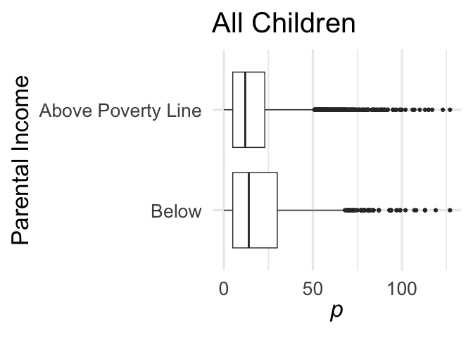<!-- -->

``` r
# poverty analysis
povBootsdf=readRDS('~/Desktop/g_p/F3_gpPovNonPov.rds')
povBoots=povBootsdf[,1:128]
nonpovBoots=povBootsdf[,129:256]
FullnonpovBoots=povBootsdf[,257:384]
```

``` r
# get furthest non zero
print(find_furthest_nonzero(povBoots))
```

    ## [1] 77

``` r
# Select the first 79 columns from each dataframe
povBoots_subset <- povBoots[, 1:77]
nonpovBoots_subset <- nonpovBoots[, 1:77]
FullnonpovBoots_subset <- FullnonpovBoots[, 1:77]

# Create an index variable for the x-axis
index <- 0:76

library(dplyr)
library(tidyr)

# Convert the data to long format for sequential appearance of each column for each row
povBoots_long <- povBoots_subset %>%
  mutate(row = row_number()) %>%
  pivot_longer(-row, names_to = "Column", values_to = "Value")

nonpovBoots_long <- nonpovBoots_subset %>%
  mutate(row = row_number()) %>%
  pivot_longer(-row, names_to = "Column", values_to = "Value")

FullnonpovBoots_long <- FullnonpovBoots_subset %>%
  mutate(row = row_number()) %>%
  pivot_longer(-row, names_to = "Column", values_to = "Value")
```

``` r
# deriv plot pov

# get straightfoward of segment where 90% is over 0 or under
positive_counts <- colSums(povBoots_subset > 0, na.rm = TRUE)
negative_counts <- colSums(povBoots_subset < 0, na.rm = TRUE)
# find where each is 90% or greater
positive_countsSig=positive_counts>9000
negative_countsSig=negative_counts>9000
# make dataframe: 50th percentile of derivatives accompanied by posSig and NegSig vector
data <- apply(povBoots_subset, 2, function(x) quantile(x, probs = 0.5))
dervPlotDf<-data.frame(data,positive_countsSig,negative_countsSig)
# if either is sig at 90% plot
dervPlotDf$sig_derivMask=dervPlotDf[,2]+dervPlotDf[,3]>0
# use it to mask calculated derivs
dervPlotDf$sig_deriv=0
dervPlotDf$sig_deriv[dervPlotDf$sig_derivMask]=dervPlotDf$data[dervPlotDf$sig_derivMask]
dervPlotDf$seq=1:(dim(dervPlotDf)[1])
ggplot(data=dervPlotDf) + geom_raster(aes(x = seq, y = .5, fill = sig_deriv))+
    theme(panel.spacing = unit(-.01,"cm")) +
    scale_fill_gradientn(colors = my_palette(100),limits = c(min(-.1),max(0.1)))+theme_minimal(base_size = 35)+
    xlab("")+
    guides(fill=FALSE)+
    theme(axis.title.y = element_blank(),axis.text.y=element_blank())+theme(panel.border = element_rect(color = "black", fill = NA, size = 1))+
    scale_x_continuous(limits = c(0,find_furthest_nonzero(povBoots)),expand = expansion(mult = c(0, 0)))
```

    ## Warning: Removed 1 rows containing missing values (`geom_raster()`).

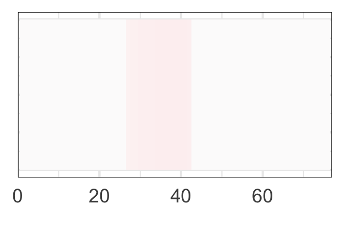<!-- -->

``` r
# deriv plot nonpov
# get straightfoward of segment where 99% is over 0 or under
positive_counts <- colSums(nonpovBoots_subset > 0, na.rm = TRUE)
negative_counts <- colSums(nonpovBoots_subset < 0, na.rm = TRUE)
# find where each is 90% or greater
positive_countsSig=positive_counts>9000
negative_countsSig=negative_counts>9000
# make dataframe: 50th percentile of derivatives accompanied by posSig and NegSig vector
data <- apply(nonpovBoots_subset, 2, function(x) quantile(x, probs = 0.5))
dervPlotDf<-data.frame(data,positive_countsSig,negative_countsSig)
# if either is sig at 90% plot
dervPlotDf$sig_derivMask=dervPlotDf[,2]+dervPlotDf[,3]>0
# use it to mask calculated derivs
dervPlotDf$sig_deriv=0
dervPlotDf$sig_deriv[dervPlotDf$sig_derivMask]=dervPlotDf$data[dervPlotDf$sig_derivMask]
dervPlotDf$seq=1:(dim(dervPlotDf)[1])
ggplot(data=dervPlotDf) + geom_raster(aes(x = seq, y = .5, fill = sig_deriv))+
    theme(panel.spacing = unit(-.01,"cm")) +
    scale_fill_gradientn(colors = my_palette(100),limits = c(min(-.1),max(0.1)))+theme_minimal(base_size = 35)+
    xlab("")+
    guides(fill=FALSE)+
    theme(axis.title.y = element_blank(),axis.text.y=element_blank())+theme(panel.border = element_rect(color = "black", fill = NA, size = 1))+
    scale_x_continuous(limits = c(0,find_furthest_nonzero(povBoots)),expand = expansion(mult = c(0, 0)))
```

    ## Warning: Removed 1 rows containing missing values (`geom_raster()`).

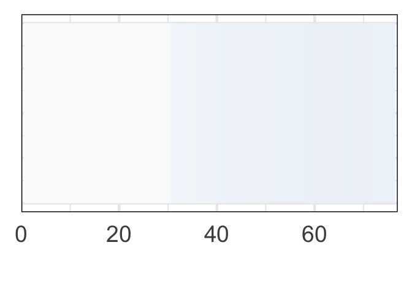<!-- -->

``` r
# deriv nonpov full
# deriv plot nonpov
# get straightfoward of segment where 90% is over 0 or under
positive_counts <- colSums(FullnonpovBoots_subset > 0, na.rm = TRUE)
negative_counts <- colSums(FullnonpovBoots_subset < 0, na.rm = TRUE)
# find where each is 90% or greater
positive_countsSig=positive_counts>9000
negative_countsSig=negative_counts>9000
# make dataframe: 50th percentile of derivatives accompanied by posSig and NegSig vector
data <- apply(FullnonpovBoots_subset, 2, function(x) quantile(x, probs = 0.5))
dervPlotDf<-data.frame(data,positive_countsSig,negative_countsSig)
# if either is sig at 90% plot
dervPlotDf$sig_derivMask=dervPlotDf[,2]+dervPlotDf[,3]>0
# use it to mask calculated derivs
dervPlotDf$sig_deriv=0
dervPlotDf$sig_deriv[dervPlotDf$sig_derivMask]=dervPlotDf$data[dervPlotDf$sig_derivMask]
dervPlotDf$seq=1:(dim(dervPlotDf)[1])
ggplot(data=dervPlotDf) + geom_raster(aes(x = seq, y = .5, fill = sig_deriv))+
    theme(panel.spacing = unit(-.01,"cm")) +
    scale_fill_gradientn(colors = my_palette(100),limits = c(min(-.1),max(0.1)))+theme_minimal(base_size = 35)+
    xlab("")+
    guides(fill=FALSE)+
    theme(axis.title.y = element_blank(),axis.text.y=element_blank())+theme(panel.border = element_rect(color = "black", fill = NA, size = 1))+
    scale_x_continuous(limits = c(0,find_furthest_nonzero(povBoots)),expand = expansion(mult = c(0, 0)))
```

    ## Warning: Removed 1 rows containing missing values (`geom_raster()`).

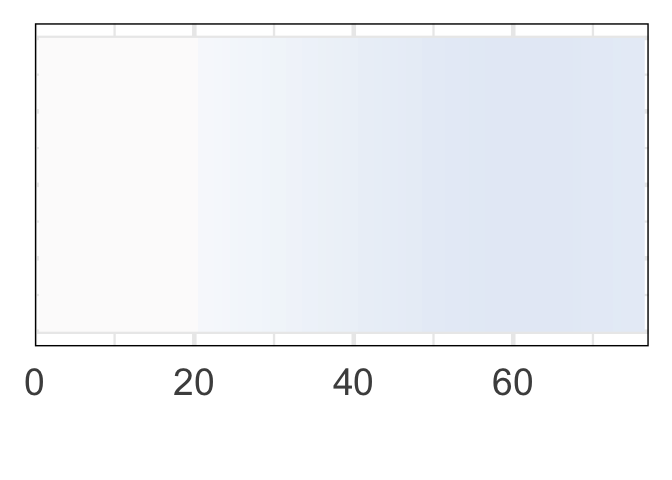<!-- -->

``` r
#### TEMPORAL PRECEDENCE TABLE
library(mgcv)
# load temporal precedence data from SampleConstruction.Rmd
tpdf=readRDS('~/OutDFTmpPrec.rds')

# Load the "lavaan" package
library(lavaan)
```

    ## This is lavaan 0.6-15
    ## lavaan is FREE software! Please report any bugs.

``` r
# Define the model syntax for the cross-lagged panel analysis
model <- '
  # Autoregressive effects
  g.y ~ g.x
  cbcl_scr_syn_totprob_r.y ~ cbcl_scr_syn_totprob_r.x
  
  # Cross-lagged effects
  g.y ~ cbcl_scr_syn_totprob_r.x
  cbcl_scr_syn_totprob_r.y ~ g.x
  
  # Residual covariances
  g.x ~~ cbcl_scr_syn_totprob_r.x
  g.y ~~ cbcl_scr_syn_totprob_r.y
  
  # Residual variances
  g.x ~~ g.x
  g.y ~~ g.y
  cbcl_scr_syn_totprob_r.x ~~ cbcl_scr_syn_totprob_r.x
  cbcl_scr_syn_totprob_r.y ~~ cbcl_scr_syn_totprob_r.y
'

# Fit the model to the data using maximum likelihood estimation
pfit <- sem(model, data = tpdf)

# Define the model syntax for the cross-lagged panel analysis
model <- '
  # Autoregressive effects
  g.y ~ g.x
  cbcl_scr_syn_internal_r.y ~ cbcl_scr_syn_internal_r.x
  
  # Cross-lagged effects
  g.y ~ cbcl_scr_syn_internal_r.x
  cbcl_scr_syn_internal_r.y ~ g.x
  
  # Residual covariances
  g.x ~~ cbcl_scr_syn_internal_r.x
  g.y ~~ cbcl_scr_syn_internal_r.y
  
  # Residual variances
  g.x ~~ g.x
  g.y ~~ g.y
  cbcl_scr_syn_internal_r.x ~~ cbcl_scr_syn_internal_r.x
  cbcl_scr_syn_internal_r.y ~~ cbcl_scr_syn_internal_r.y
'

# Fit the model to the data using maximum likelihood estimation
ifit <- sem(model, data = tpdf)

# Define the model syntax for the cross-lagged panel analysis
model <- '
  # Autoregressive effects
  g.y ~ g.x
  cbcl_scr_syn_external_r.y ~ cbcl_scr_syn_external_r.x
  
  # Cross-lagged effects
  g.y ~ cbcl_scr_syn_external_r.x
  cbcl_scr_syn_external_r.y ~ g.x
  
  # Residual covariances
  g.x ~~ cbcl_scr_syn_external_r.x
  g.y ~~ cbcl_scr_syn_external_r.y
  
  # Residual variances
  # note this tracks concurrent increases in outcome variables
  g.x ~~ g.x
  g.y ~~ g.y
  cbcl_scr_syn_external_r.x ~~ cbcl_scr_syn_external_r.x
  cbcl_scr_syn_external_r.y ~~ cbcl_scr_syn_external_r.y
'

# Fit the model to the data using maximum likelihood estimation
efit <- sem(model, data = tpdf)
```

\`\`\`
