Figure3
================
2023-05-06

``` r
# figure 3 - # be sure to run this one sequentially! relies on counters with same variable name across chunks.
library(mgcv)
```

    ## Loading required package: nlme

    ## This is mgcv 1.8-42. For overview type 'help("mgcv-package")'.

``` r
library(visreg)
library(gratia)
library(dplyr)
```

    ## 
    ## Attaching package: 'dplyr'

    ## The following object is masked from 'package:nlme':
    ## 
    ##     collapse

    ## The following objects are masked from 'package:stats':
    ## 
    ##     filter, lag

    ## The following objects are masked from 'package:base':
    ## 
    ##     intersect, setdiff, setequal, union

``` r
library(tidyr)
library(stringr)
library(data.table)
```

    ## 
    ## Attaching package: 'data.table'

    ## The following objects are masked from 'package:dplyr':
    ## 
    ##     between, first, last

``` r
library(ggridges)
library(ggbeeswarm)
```

    ## Loading required package: ggplot2

``` r
library(ggExtra)
knitr::opts_chunk$set(fig.width=6, fig.height=2) 
```

``` r
# set functions
plot_bootstraps <- function(data,maxval,Name,maxValuePlot,BorderlineClinical,Clinical) {
  # Melt the data frame
  data_melt <- melt(t(data))
  data_melt$Var1 <- rep(seq(1, maxval), nrow(data))

  # Calculate percentiles
  percentiles <- data %>%
    summarise(across(everything(), quantile, probs = c(0.01, 0.99), na.rm = TRUE))
  
  percentiles_long <- tidyr::pivot_longer(percentiles, cols = everything(), names_to = "Percentile", values_to = "YValue")

  # Add CI column
  data_melt$CI <- 0
  
  # Prepare CIs for insertion
  CIs <- data.frame(rep(seq(1, maxval), 2), c(rep(10001, maxval), rep(10002, maxval)), percentiles_long$YValue, rep(1, (maxval*2)))
  colnames(CIs) <- colnames(data_melt)
  
  # Add CIs
  data_melt2 <- rbind(data_melt, CIs)
  
  # Convert CI column to factor
  data_melt2$CI <- as.factor(data_melt2$CI)
  
  # Plotting the lines
  ggplot(data = data_melt2, aes(x = Var1, y = value, group = Var2, color = Var2)) +
    geom_line(aes(alpha = CI), show.legend = FALSE) +
    scale_color_viridis_c(option = "inferno", direction = -1) +
    scale_alpha_manual(values = c(0.01, 1), guide = FALSE) + ylim(c(-1.5,1.5)) +
    theme_minimal(base_size=35) + 
    ylab(expression(italic(g)))+xlab(Name)+
    theme(panel.border = element_rect(color = "black", fill = NA, size = 1))+
    scale_x_continuous(limits = c(0,maxValuePlot),expand = expansion(mult = c(0, 0)))
}

find_furthest_nonzero <- function(data) {
  numZeros=colSums(data==0)
  isZeroZeros=numZeros==0
  furthest_nonzero=sum(isZeroZeros)
}

# set colors
my_palette <- colorRampPalette(colors = c("#051099", "#1d5cb7", "white", "#e41a1c", "#a80009"))
```

``` r
# set y title used throughout
y_title <- expression(paste("Child ", italic("g")))

# load in fits: ordered as follows:
# F_intFit,M_intFit,P_intFit,R_intFit,F_extFit,M_extFit,P_extFit,R_extFit,F_somFit,M_somFit,P_somFit,R_somFit,F_anxFit,M_anxFit,P_anxFit,R_anxFit,F_thoFit,M_thoFit,P_thoFit,R_thoFit,F_witdepFit,M_witdepFit,P_witdepFit,R_witdepFit,F_socFit,M_socFit,P_socFit,R_socFit,F_rulFit,M_rulFit,P_rulFit,R_rulFit,F_attFit,M_attFit,P_attFit,R_attFit,F_aggFit,M_aggFit,P_aggFit,R_aggFit

#F_intFit,M_intFit,P_intFit,R_intFit,F_extFit,M_extFit,P_extFit,R_extFit,F_somFit,M_somFit,P_somFit,R_somFit,F_anxFit,M_anxFit,P_anxFit,R_anxFit,F_thoFit,M_thoFit,P_thoFit,R_thoFit,F_witdepFit,M_witdepFit,P_witdepFit,R_witdepFit,  ### this is where it departs from above, should work until social. F_rulFit,M_rulFit,P_rulFit,R_rulFit,F_attFit,M_attFit,P_attFit,R_attFit,F_aggFit,M_aggFit,P_aggFit,R_aggFit
Fits=readRDS('~/Desktop/g_p/F3_gpSubscaleFits_asrSupp.rds')

# read in masterdf from sample construction
masterdf=readRDS('~/gp_masterdf.rds')

# pull clinical cutoff from master df: t scores > 65 = borderline clinical, 70 = clinical
masterdfP_bc<-masterdf[masterdf$cbcl_scr_syn_totprob_t==65,]
masterdfP_c<-masterdf[masterdf$cbcl_scr_syn_totprob_t==69,]

# borderline clinical and clinical cutoffs
Pbc=mean(masterdfP_bc$cbcl_scr_syn_totprob_r)
Pc=mean(masterdfP_c$cbcl_scr_syn_totprob_r)
```

``` r
# use max value derivation from slurm script to parse individual subscales
intMaxVal=max(as.numeric(masterdf$ASRInt))
extMaxVal=max(as.numeric(masterdf$ASRExt))
somMaxVal=max(as.numeric(masterdf$ASRSomatic))
anxMaxVal=max(as.numeric(masterdf$ASRAnxDepr))
thoMaxVal=max(as.numeric(masterdf$ASRThought))
depMaxVal=max(as.numeric(masterdf$ASRWithdrawn))
attMaxVal=max(as.numeric(masterdf$ASRAttn))
rulMaxVal=max(as.numeric(masterdf$ASRRulB))
aggMaxVal=max(as.numeric(masterdf$ASRAggr))
```

``` r
# start with internalizing as 1 (corresponds to F_intFit,M_intFit,P_intFit,R_intFit) 
# isolate Female, Male, Poor, Rich
# spans 0:maximum value of symptoms
start=1
end=intMaxVal+1
F_PFits=Fits[,start:end]

# calculate some background info for plots
MaxP_F=find_furthest_nonzero(F_PFits)

# isolate male fits
start=end+1
end=end+(intMaxVal+1)
M_PFits=Fits[start:end]

# calculate some background info for plots
MaxP_M=find_furthest_nonzero(M_PFits)
# use lowest common value for plots
MaxP <- min(MaxP_M, MaxP_F)

# get median value girl
F_PFits_Coverage=F_PFits[,seq(1:MaxP)]
col_means=colMeans(F_PFits_Coverage)
FP_medians <- apply(F_PFits_Coverage, 2, median)

# get median value boy
M_PFits_Coverage=M_PFits[,seq(1:MaxP)]
col_means=colMeans(M_PFits_Coverage)
MP_medians <- apply(M_PFits_Coverage, 2, median)
MP_medians=MP_medians[1:MaxP]

# merge data
data <- data.frame(
  x = 0:(MaxP-1),
  y_girls = FP_medians,
  y_boys = MP_medians
)

# Create the line plot for p
ggplot(data, aes(x = x, y = y_boys)) +
  geom_line(aes(), color = "#fbad24", size = 3) +
  geom_line(aes(y=y_girls),color = "#923eb5", size = 3) +
  labs(x = 'Parental Internalizing', y = y_title) +
  theme_minimal(base_size = 35) +
  theme(plot.title = element_text(hjust = 0.5),
        legend.position = "top",
        legend.title = element_blank(),
        legend.background = element_rect(fill = "white"))+ylim(-1.5,1.5)+
        theme(panel.border = element_rect(color = "black", fill = NA, size = 1))+
        scale_x_continuous(limits = c(0,MaxP-1),expand = expansion(mult = c(0, 0)))
```

    ## Warning: Using `size` aesthetic for lines was deprecated in ggplot2 3.4.0.
    ## ℹ Please use `linewidth` instead.
    ## This warning is displayed once every 8 hours.
    ## Call `lifecycle::last_lifecycle_warnings()` to see where this warning was
    ## generated.

    ## Warning: The `size` argument of `element_rect()` is deprecated as of ggplot2 3.4.0.
    ## ℹ Please use the `linewidth` argument instead.
    ## This warning is displayed once every 8 hours.
    ## Call `lifecycle::last_lifecycle_warnings()` to see where this warning was
    ## generated.

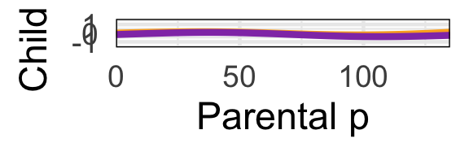<!-- -->

``` r
# and derivatives
# Create an empty matrix to store the derivatives
F_P_derivative_matrix <- matrix(0, nrow = nrow(F_PFits), ncol = ncol(F_PFits) - 1)

# Calculate the derivative for each column
for (i in 1:(ncol(F_PFits) - 1)) {
  # Calculate the differences in x (assuming a constant difference)
  dx <- 1
  # Calculate the differences in y (predicted values)
  dy <- F_PFits[, i + 1] - F_PFits[, i]
  # Calculate the derivatives (slopes)
  derivatives <- dy / dx
  # Store the derivatives in the derivative matrix
  F_P_derivative_matrix[, i] <- derivatives
}

# Create an empty matrix to store the derivatives
M_P_derivative_matrix <- matrix(0, nrow = nrow(M_PFits), ncol = ncol(M_PFits) - 1)

# Calculate the derivative for each column
for (i in 1:(ncol(F_PFits) - 1)) {
  # Calculate the differences in x (assuming a constant difference)
  dx <- 1
  # Calculate the differences in y (predicted values)
  dy <- M_PFits[, i + 1] - M_PFits[, i]
  # Calculate the derivatives (slopes)
  derivatives <- dy / dx
  # Store the derivatives in the derivative matrix
  M_P_derivative_matrix[, i] <- derivatives
}

# calc sig dervs
# get straightfoward of segment where 99% is over 0 or under
positive_counts <- colSums(F_P_derivative_matrix > 0, na.rm = TRUE)
negative_counts <- colSums(F_P_derivative_matrix < 0, na.rm = TRUE)
# find where each is 99% or greater
positive_countsSig=positive_counts>9900
negative_countsSig=negative_counts>9900
# make dataframe: 50th percentile of derivatives accompanied by posSig and NegSig vector
data <- apply(F_P_derivative_matrix, 2, function(x) quantile(x, probs = 0.5))
dervPlotDf<-data.frame(data,positive_countsSig,negative_countsSig)
# if either is sig at 99% plot
dervPlotDf$sig_derivMask=dervPlotDf[,2]+dervPlotDf[,3]>0
# use it to mask calculated derivs
dervPlotDf$sig_deriv=0
dervPlotDf$sig_deriv[dervPlotDf$sig_derivMask]=dervPlotDf$data[dervPlotDf$sig_derivMask]
dervPlotDf$seq=1:(dim(dervPlotDf)[1])
ggplot(data=dervPlotDf) + geom_raster(aes(x = seq, y = .5, fill = sig_deriv))+
    theme(panel.spacing = unit(-.01,"cm")) +
    scale_fill_gradientn(colors = my_palette(100),limits = c(min(-.1),max(0.1)))+theme_minimal(base_size = 35)+
    xlim(c(0,MaxP))+xlab('Parental Int: Girls')+
    guides(fill=FALSE)+
    theme(axis.title.y = element_blank(),axis.text.y=element_blank())+theme(panel.border = element_rect(color = "black", fill = NA, size = 1))+
    scale_x_continuous(limits = c(0,MaxP),expand = expansion(mult = c(0, 0)))
```

    ## Warning: The `<scale>` argument of `guides()` cannot be `FALSE`. Use "none" instead as
    ## of ggplot2 3.3.4.
    ## This warning is displayed once every 8 hours.
    ## Call `lifecycle::last_lifecycle_warnings()` to see where this warning was
    ## generated.

    ## Scale for x is already present.
    ## Adding another scale for x, which will replace the existing scale.

    ## Warning: Removed 5 rows containing missing values (`geom_raster()`).

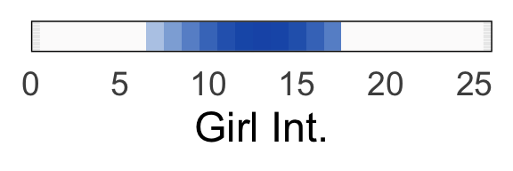<!-- -->

``` r
# get straightfoward of segment where 99% is over 0 or under
positive_counts <- colSums(M_P_derivative_matrix > 0, na.rm = TRUE)
negative_counts <- colSums(M_P_derivative_matrix < 0, na.rm = TRUE)
# find where each is 99% or greater
positive_countsSig=positive_counts>9900
negative_countsSig=negative_counts>9900
# make dataframe: 50th percentile of derivatives accompanied by posSig and NegSig vector
data <- apply(M_P_derivative_matrix, 2, function(x) quantile(x, probs = 0.5))
dervPlotDf<-data.frame(data,positive_countsSig,negative_countsSig)
# if either is sig at 99% plot
dervPlotDf$sig_derivMask=dervPlotDf[,2]+dervPlotDf[,3]>0
# use it to mask calculated derivs
dervPlotDf$sig_deriv=0
dervPlotDf$sig_deriv[dervPlotDf$sig_derivMask]=dervPlotDf$data[dervPlotDf$sig_derivMask]
dervPlotDf$seq=1:(dim(dervPlotDf)[1])
# print out max deriv
paste(max(abs(dervPlotDf$sig_deriv)))
```

    ## [1] "0.13837478729278"

``` r
ggplot(data=dervPlotDf) + geom_raster(aes(x = seq, y = .5, fill = sig_deriv))+
    theme(panel.spacing = unit(-.01,"cm")) +
    scale_fill_gradientn(colors = my_palette(100),limits = c(min(-.15),max(0.15)))+theme_minimal(base_size = 35)+
    xlim(c(0,MaxP))+xlab('Parental Int: Boys*')+
    guides(fill=FALSE)+
    theme(axis.title.y = element_blank(),axis.text.y=element_blank())+theme(panel.border = element_rect(color = "black", fill = NA, size = 1))+
    scale_x_continuous(limits = c(0,MaxP),expand = expansion(mult = c(0, 0)))
```

    ## Scale for x is already present.
    ## Adding another scale for x, which will replace the existing scale.

    ## Warning: Removed 5 rows containing missing values (`geom_raster()`).

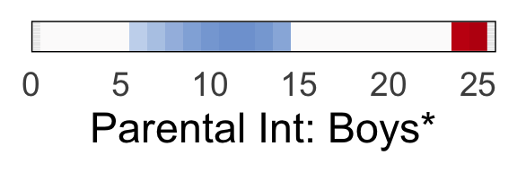<!-- -->

``` r
plot_bootstraps(F_PFits[,1:MaxP],MaxP,"Internalizing",MaxP,Pbc,Pc)
```

    ## Warning in melt(t(data)): The melt generic in data.table has been passed a
    ## matrix and will attempt to redirect to the relevant reshape2 method; please
    ## note that reshape2 is deprecated, and this redirection is now deprecated as
    ## well. To continue using melt methods from reshape2 while both libraries are
    ## attached, e.g. melt.list, you can prepend the namespace like
    ## reshape2::melt(t(data)). In the next version, this warning will become an
    ## error.

    ## Warning: There was 1 warning in `summarise()`.
    ## ℹ In argument: `across(everything(), quantile, probs = c(0.01, 0.99), na.rm =
    ##   TRUE)`.
    ## Caused by warning:
    ## ! The `...` argument of `across()` is deprecated as of dplyr 1.1.0.
    ## Supply arguments directly to `.fns` through an anonymous function instead.
    ## 
    ##   # Previously
    ##   across(a:b, mean, na.rm = TRUE)
    ## 
    ##   # Now
    ##   across(a:b, \(x) mean(x, na.rm = TRUE))

    ## Warning: Returning more (or less) than 1 row per `summarise()` group was deprecated in
    ## dplyr 1.1.0.
    ## ℹ Please use `reframe()` instead.
    ## ℹ When switching from `summarise()` to `reframe()`, remember that `reframe()`
    ##   always returns an ungrouped data frame and adjust accordingly.
    ## Call `lifecycle::last_lifecycle_warnings()` to see where this warning was
    ## generated.

    ## Warning: The `guide` argument in `scale_*()` cannot be `FALSE`. This was deprecated in
    ## ggplot2 3.3.4.
    ## ℹ Please use "none" instead.
    ## This warning is displayed once every 8 hours.
    ## Call `lifecycle::last_lifecycle_warnings()` to see where this warning was
    ## generated.

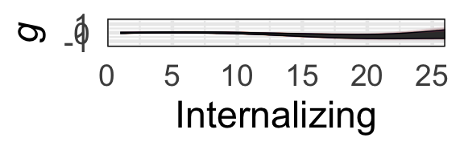<!-- -->

``` r
plot_bootstraps(M_PFits[,1:MaxP],MaxP,"Internalizing",MaxP,Pbc,Pc)
```

    ## Warning in melt(t(data)): The melt generic in data.table has been passed a
    ## matrix and will attempt to redirect to the relevant reshape2 method; please
    ## note that reshape2 is deprecated, and this redirection is now deprecated as
    ## well. To continue using melt methods from reshape2 while both libraries are
    ## attached, e.g. melt.list, you can prepend the namespace like
    ## reshape2::melt(t(data)). In the next version, this warning will become an
    ## error.

    ## Warning: Returning more (or less) than 1 row per `summarise()` group was deprecated in
    ## dplyr 1.1.0.
    ## ℹ Please use `reframe()` instead.
    ## ℹ When switching from `summarise()` to `reframe()`, remember that `reframe()`
    ##   always returns an ungrouped data frame and adjust accordingly.
    ## Call `lifecycle::last_lifecycle_warnings()` to see where this warning was
    ## generated.

    ## Warning: Removed 1 row containing missing values (`geom_line()`).

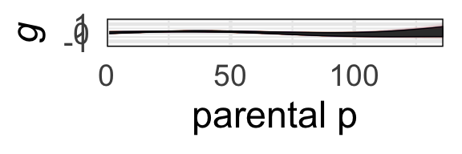<!-- -->

``` r
# poverty analysis: start with below poverty line group
start=end+1
end=end+(intMaxVal+1)
povBoots=Fits[,start:end]
# and nonpov
start=end+1
end=end+(intMaxVal+1)
nonpovBoots=Fits[,start:end]

# calculate some background info for plots
MaxP_P=find_furthest_nonzero(povBoots)
MaxP_R=find_furthest_nonzero(nonpovBoots)

# use lowest common value for plots
MaxP <- min(MaxP_P, MaxP_R)

# get median value pov
P_PFits_Coverage=povBoots[,seq(1:MaxP)]
col_means=colMeans(P_PFits_Coverage)
PP_medians <- apply(P_PFits_Coverage, 2, median)

# get median value nonpov
R_PFits_Coverage=nonpovBoots[,seq(1:MaxP)]
col_means=colMeans(R_PFits_Coverage)
RP_medians <- apply(M_PFits_Coverage, 2, median)
RP_medians=MP_medians[1:MaxP]

# merge data
data <- data.frame(
  x = 0:(MaxP-1),
  y_pov = PP_medians,
  y_nonpov = RP_medians
)

# Create the line plot for p
ggplot(data, aes(x = x, y = y_pov)) +
  geom_line(aes(), color = "#FF5003", size = 3) +
  geom_line(aes(y=y_nonpov),color = "#003F7D", size = 3) +
  labs(x = 'Parental Internalizing', y = y_title) +
  theme_minimal(base_size = 35) +
  theme(plot.title = element_text(hjust = 0.5),
        legend.position = "top",
        legend.title = element_blank(),
        legend.background = element_rect(fill = "white"))+ylim(-1.5,1.5)+
        theme(panel.border = element_rect(color = "black", fill = NA, size = 1))+
        scale_x_continuous(limits = c(0,MaxP-1),expand = expansion(mult = c(0, 0)))
```

<!-- -->

``` r
# and derivatives
# Create an empty matrix to store the derivatives
P_P_derivative_matrix <- matrix(0, nrow = nrow(povBoots), ncol = ncol(povBoots) - 1)

# Calculate the derivative for each column
for (i in 1:(ncol(povBoots) - 1)) {
  # Calculate the differences in x (assuming a constant difference)
  dx <- 1
  # Calculate the differences in y (predicted values)
  dy <- povBoots[, i + 1] - povBoots[, i]
  # Calculate the derivatives (slopes)
  derivatives <- dy / dx
  # Store the derivatives in the derivative matrix
  P_P_derivative_matrix[, i] <- derivatives
}

# Create an empty matrix to store the derivatives
R_P_derivative_matrix <- matrix(0, nrow = nrow(nonpovBoots), ncol = ncol(nonpovBoots) - 1)

# Calculate the derivative for each column
for (i in 1:(ncol(nonpovBoots) - 1)) {
  # Calculate the differences in x (assuming a constant difference)
  dx <- 1
  # Calculate the differences in y (predicted values)
  dy <- nonpovBoots[, i + 1] - nonpovBoots[, i]
  # Calculate the derivatives (slopes)
  derivatives <- dy / dx
  # Store the derivatives in the derivative matrix
  R_P_derivative_matrix[, i] <- derivatives
}

# calc sig dervs
# get straightfoward of segment where 99% is over 0 or under
positive_counts <- colSums(P_P_derivative_matrix > 0, na.rm = TRUE)
negative_counts <- colSums(P_P_derivative_matrix < 0, na.rm = TRUE)
# find where each is 99% or greater
positive_countsSig=positive_counts>9900
negative_countsSig=negative_counts>9900
# make dataframe: 50th percentile of derivatives accompanied by posSig and NegSig vector
data <- apply(P_P_derivative_matrix, 2, function(x) quantile(x, probs = 0.5)) ###  ???
dervPlotDf<-data.frame(data,positive_countsSig,negative_countsSig)
# if either is sig at 99% plot
dervPlotDf$sig_derivMask=dervPlotDf[,2]+dervPlotDf[,3]>0
# use it to mask calculated derivs
dervPlotDf$sig_deriv=0
dervPlotDf$sig_deriv[dervPlotDf$sig_derivMask]=dervPlotDf$data[dervPlotDf$sig_derivMask]
dervPlotDf$seq=1:(dim(dervPlotDf)[1])
ggplot(data=dervPlotDf) + geom_raster(aes(x = seq, y = .5, fill = sig_deriv))+
    theme(panel.spacing = unit(-.01,"cm")) +
    scale_fill_gradientn(colors = my_palette(100),limits = c(min(-.1),max(0.1)))+theme_minimal(base_size = 35)+
    xlim(c(0,MaxP))+xlab('Parental Int: Pov.')+
    guides(fill=FALSE)+
    theme(axis.title.y = element_blank(),axis.text.y=element_blank())+theme(panel.border = element_rect(color = "black", fill = NA, size = 1))+
    scale_x_continuous(limits = c(0,MaxP),expand = expansion(mult = c(0, 0)))
```

    ## Scale for x is already present.
    ## Adding another scale for x, which will replace the existing scale.

    ## Warning: Removed 5 rows containing missing values (`geom_raster()`).

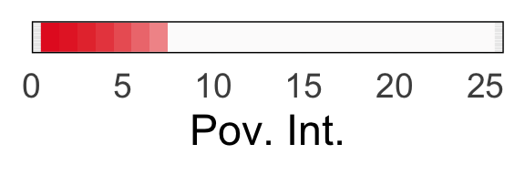<!-- -->

``` r
# get straightfoward of segment where 99% is over 0 or under
positive_counts <- colSums(R_P_derivative_matrix > 0, na.rm = TRUE)
negative_counts <- colSums(R_P_derivative_matrix < 0, na.rm = TRUE)
# find where each is 99% or greater
positive_countsSig=positive_counts>9900
negative_countsSig=negative_counts>9900
# make dataframe: 50th percentile of derivatives accompanied by posSig and NegSig vector
data <- apply(R_P_derivative_matrix, 2, function(x) quantile(x, probs = 0.5))
dervPlotDf<-data.frame(data,positive_countsSig,negative_countsSig)
# if either is sig at 99% plot
dervPlotDf$sig_derivMask=dervPlotDf[,2]+dervPlotDf[,3]>0
# use it to mask calculated derivs
dervPlotDf$sig_deriv=0
dervPlotDf$sig_deriv[dervPlotDf$sig_derivMask]=dervPlotDf$data[dervPlotDf$sig_derivMask]
dervPlotDf$seq=1:(dim(dervPlotDf)[1])
ggplot(data=dervPlotDf) + geom_raster(aes(x = seq, y = .5, fill = sig_deriv))+
    theme(panel.spacing = unit(-.01,"cm")) +
    scale_fill_gradientn(colors = my_palette(100),limits = c(min(-.1),max(0.1)))+theme_minimal(base_size = 35)+
    xlim(c(0,MaxP))+xlab('Parental Int: NonPov.')+
    guides(fill=FALSE)+
    theme(axis.title.y = element_blank(),axis.text.y=element_blank())+theme(panel.border = element_rect(color = "black", fill = NA, size = 1))+
    scale_x_continuous(limits = c(0,MaxP),expand = expansion(mult = c(0, 0)))
```

    ## Scale for x is already present.
    ## Adding another scale for x, which will replace the existing scale.

    ## Warning: Removed 5 rows containing missing values (`geom_raster()`).

<!-- -->

``` r
# end subscale 1
```

``` r
# now do externalizing as 2nd subscale: corresponds to F_extFit,M_extFit,P_extFit,R_extFit
# isolate Female, Male, Poor, Rich
# spans 0:maximum value of symptoms
start=end+1
end=end+(extMaxVal+1)
F_PFits=Fits[,start:end]

# calculate some background info for plots
MaxP_F=find_furthest_nonzero(F_PFits)

# isolate male fits
start=end+1
end=end+(extMaxVal+1)
M_PFits=Fits[start:end]

# calculate some background info for plots
MaxP_M=find_furthest_nonzero(M_PFits)
# use lowest common value for plots
MaxP <- min(MaxP_M, MaxP_F)

# get median value girl
F_PFits_Coverage=F_PFits[,seq(1:MaxP)]
col_means=colMeans(F_PFits_Coverage)
FP_medians <- apply(F_PFits_Coverage, 2, median)

# get median value boy
M_PFits_Coverage=M_PFits[,seq(1:MaxP)]
col_means=colMeans(M_PFits_Coverage)
MP_medians <- apply(M_PFits_Coverage, 2, median)
MP_medians=MP_medians[1:MaxP]

# merge data
data <- data.frame(
  x = 0:(MaxP-1),
  y_girls = FP_medians,
  y_boys = MP_medians
)

# Create the line plot for p
ggplot(data, aes(x = x, y = y_boys)) +
  geom_line(aes(), color = "#fbad24", size = 3) +
  geom_line(aes(y=y_girls),color = "#923eb5", size = 3) +
  labs(x = 'Parental Externalizing', y = y_title) +
  theme_minimal(base_size = 35) +
  theme(plot.title = element_text(hjust = 0.5),
        legend.position = "top",
        legend.title = element_blank(),
        legend.background = element_rect(fill = "white"))+ylim(-1.5,1.5)+
        theme(panel.border = element_rect(color = "black", fill = NA, size = 1))+
        scale_x_continuous(limits = c(0,MaxP-1),expand = expansion(mult = c(0, 0)))
```

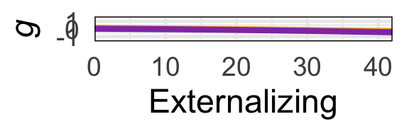<!-- -->

``` r
# and derivatives
# Create an empty matrix to store the derivatives
F_P_derivative_matrix <- matrix(0, nrow = nrow(F_PFits), ncol = ncol(F_PFits) - 1)

# Calculate the derivative for each column
for (i in 1:(ncol(F_PFits) - 1)) {
  # Calculate the differences in x (assuming a constant difference)
  dx <- 1
  # Calculate the differences in y (predicted values)
  dy <- F_PFits[, i + 1] - F_PFits[, i]
  # Calculate the derivatives (slopes)
  derivatives <- dy / dx
  # Store the derivatives in the derivative matrix
  F_P_derivative_matrix[, i] <- derivatives
}

# Create an empty matrix to store the derivatives
M_P_derivative_matrix <- matrix(0, nrow = nrow(M_PFits), ncol = ncol(M_PFits) - 1)

# Calculate the derivative for each column
for (i in 1:(ncol(F_PFits) - 1)) {
  # Calculate the differences in x (assuming a constant difference)
  dx <- 1
  # Calculate the differences in y (predicted values)
  dy <- M_PFits[, i + 1] - M_PFits[, i]
  # Calculate the derivatives (slopes)
  derivatives <- dy / dx
  # Store the derivatives in the derivative matrix
  M_P_derivative_matrix[, i] <- derivatives
}

# calc sig dervs
# get straightfoward of segment where 99% is over 0 or under
positive_counts <- colSums(F_P_derivative_matrix > 0, na.rm = TRUE)
negative_counts <- colSums(F_P_derivative_matrix < 0, na.rm = TRUE)
# find where each is 99% or greater
positive_countsSig=positive_counts>9900
negative_countsSig=negative_counts>9900
# make dataframe: 50th percentile of derivatives accompanied by posSig and NegSig vector
data <- apply(F_P_derivative_matrix, 2, function(x) quantile(x, probs = 0.5))
dervPlotDf<-data.frame(data,positive_countsSig,negative_countsSig)
# if either is sig at 99% plot
dervPlotDf$sig_derivMask=dervPlotDf[,2]+dervPlotDf[,3]>0
# use it to mask calculated derivs
dervPlotDf$sig_deriv=0
dervPlotDf$sig_deriv[dervPlotDf$sig_derivMask]=dervPlotDf$data[dervPlotDf$sig_derivMask]
dervPlotDf$seq=1:(dim(dervPlotDf)[1])
ggplot(data=dervPlotDf) + geom_raster(aes(x = seq, y = .5, fill = sig_deriv))+
    theme(panel.spacing = unit(-.01,"cm")) +
    scale_fill_gradientn(colors = my_palette(100),limits = c(min(-.1),max(0.1)))+theme_minimal(base_size = 35)+
    xlim(c(0,MaxP))+xlab('Parental Ext: Girl')+
    guides(fill=FALSE)+
    theme(axis.title.y = element_blank(),axis.text.y=element_blank())+theme(panel.border = element_rect(color = "black", fill = NA, size = 1))+
    scale_x_continuous(limits = c(0,MaxP),expand = expansion(mult = c(0, 0)))
```

    ## Scale for x is already present.
    ## Adding another scale for x, which will replace the existing scale.

    ## Warning: Removed 21 rows containing missing values (`geom_raster()`).

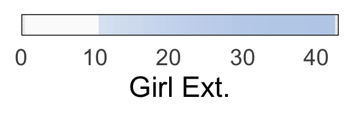<!-- -->

``` r
# get straightfoward of segment where 99% is over 0 or under
positive_counts <- colSums(M_P_derivative_matrix > 0, na.rm = TRUE)
negative_counts <- colSums(M_P_derivative_matrix < 0, na.rm = TRUE)
# find where each is 99% or greater
positive_countsSig=positive_counts>9900
negative_countsSig=negative_counts>9900
# make dataframe: 50th percentile of derivatives accompanied by posSig and NegSig vector
data <- apply(M_P_derivative_matrix, 2, function(x) quantile(x, probs = 0.5))
dervPlotDf<-data.frame(data,positive_countsSig,negative_countsSig)
# if either is sig at 99% plot
dervPlotDf$sig_derivMask=dervPlotDf[,2]+dervPlotDf[,3]>0
# use it to mask calculated derivs
dervPlotDf$sig_deriv=0
dervPlotDf$sig_deriv[dervPlotDf$sig_derivMask]=dervPlotDf$data[dervPlotDf$sig_derivMask]
dervPlotDf$seq=1:(dim(dervPlotDf)[1])
ggplot(data=dervPlotDf) + geom_raster(aes(x = seq, y = .5, fill = sig_deriv))+
    theme(panel.spacing = unit(-.01,"cm")) +
    scale_fill_gradientn(colors = my_palette(100),limits = c(min(-.1),max(0.1)))+theme_minimal(base_size = 35)+
    xlim(c(0,MaxP))+xlab('Parental Ext: Boy')+
    guides(fill=FALSE)+
    theme(axis.title.y = element_blank(),axis.text.y=element_blank())+theme(panel.border = element_rect(color = "black", fill = NA, size = 1))+
    scale_x_continuous(limits = c(0,MaxP),expand = expansion(mult = c(0, 0)))
```

    ## Scale for x is already present.
    ## Adding another scale for x, which will replace the existing scale.

    ## Warning: Removed 21 rows containing missing values (`geom_raster()`).

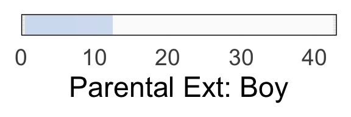<!-- -->

``` r
# poverty analysis: start with below poverty line group
start=end+1
end=end+(extMaxVal+1)
povBoots=Fits[,start:end]
# and nonpov
start=end+1
end=end+(extMaxVal+1)
nonpovBoots=Fits[,start:end]

# calculate some background info for plots
MaxP_P=find_furthest_nonzero(povBoots)
MaxP_R=find_furthest_nonzero(nonpovBoots)

# use lowest common value for plots
MaxP <- min(MaxP_P, MaxP_R)

# get median value pov
P_PFits_Coverage=povBoots[,seq(1:MaxP)]
col_means=colMeans(P_PFits_Coverage)
PP_medians <- apply(P_PFits_Coverage, 2, median)

# get median value nonpov
R_PFits_Coverage=nonpovBoots[,seq(1:MaxP)]
col_means=colMeans(R_PFits_Coverage)
RP_medians <- apply(M_PFits_Coverage, 2, median)
RP_medians=MP_medians[1:MaxP]

# merge data
data <- data.frame(
  x = 0:(MaxP-1),
  y_pov = PP_medians,
  y_nonpov = RP_medians
)

# Create the line plot for p
ggplot(data, aes(x = x, y = y_pov)) +
  geom_line(aes(), color = "#FF5003", size = 3) +
  geom_line(aes(y=y_nonpov),color = "#003F7D", size = 3) +
  labs(x = 'Parental Externalizing', y = y_title) +
  theme_minimal(base_size = 35) +
  theme(plot.title = element_text(hjust = 0.5),
        legend.position = "top",
        legend.title = element_blank(),
        legend.background = element_rect(fill = "white"))+ylim(-1.5,1.5)+
        theme(panel.border = element_rect(color = "black", fill = NA, size = 1))+
        scale_x_continuous(limits = c(0,MaxP-1),expand = expansion(mult = c(0, 0)))
```

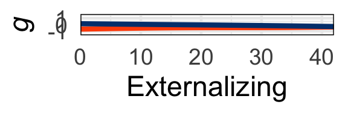<!-- -->

``` r
# and derivatives
# Create an empty matrix to store the derivatives
P_P_derivative_matrix <- matrix(0, nrow = nrow(povBoots), ncol = ncol(povBoots) - 1)

# Calculate the derivative for each column
for (i in 1:(ncol(povBoots) - 1)) {
  # Calculate the differences in x (assuming a constant difference)
  dx <- 1
  # Calculate the differences in y (predicted values)
  dy <- povBoots[, i + 1] - povBoots[, i]
  # Calculate the derivatives (slopes)
  derivatives <- dy / dx
  # Store the derivatives in the derivative matrix
  P_P_derivative_matrix[, i] <- derivatives
}

# Create an empty matrix to store the derivatives
R_P_derivative_matrix <- matrix(0, nrow = nrow(nonpovBoots), ncol = ncol(nonpovBoots) - 1)

# Calculate the derivative for each column
for (i in 1:(ncol(nonpovBoots) - 1)) {
  # Calculate the differences in x (assuming a constant difference)
  dx <- 1
  # Calculate the differences in y (predicted values)
  dy <- nonpovBoots[, i + 1] - nonpovBoots[, i]
  # Calculate the derivatives (slopes)
  derivatives <- dy / dx
  # Store the derivatives in the derivative matrix
  R_P_derivative_matrix[, i] <- derivatives
}

# calc sig dervs
# get straightfoward of segment where 99% is over 0 or under
positive_counts <- colSums(P_P_derivative_matrix > 0, na.rm = TRUE)
negative_counts <- colSums(P_P_derivative_matrix < 0, na.rm = TRUE)
# find where each is 99% or greater
positive_countsSig=positive_counts>9900
negative_countsSig=negative_counts>9900
# make dataframe: 50th percentile of derivatives accompanied by posSig and NegSig vector
data <- apply(P_P_derivative_matrix, 2, function(x) quantile(x, probs = 0.5)) ###  ???
dervPlotDf<-data.frame(data,positive_countsSig,negative_countsSig)
# if either is sig at 99% plot
dervPlotDf$sig_derivMask=dervPlotDf[,2]+dervPlotDf[,3]>0
# use it to mask calculated derivs
dervPlotDf$sig_deriv=0
dervPlotDf$sig_deriv[dervPlotDf$sig_derivMask]=dervPlotDf$data[dervPlotDf$sig_derivMask]
dervPlotDf$seq=1:(dim(dervPlotDf)[1])
ggplot(data=dervPlotDf) + geom_raster(aes(x = seq, y = .5, fill = sig_deriv))+
    theme(panel.spacing = unit(-.01,"cm")) +
    scale_fill_gradientn(colors = my_palette(100),limits = c(min(-.1),max(0.1)))+theme_minimal(base_size = 35)+
    xlim(c(0,MaxP))+xlab('Parental Ext: Pov.')+
    guides(fill=FALSE)+
    theme(axis.title.y = element_blank(),axis.text.y=element_blank())+theme(panel.border = element_rect(color = "black", fill = NA, size = 1))+
    scale_x_continuous(limits = c(0,MaxP),expand = expansion(mult = c(0, 0)))
```

    ## Scale for x is already present.
    ## Adding another scale for x, which will replace the existing scale.

    ## Warning: Removed 21 rows containing missing values (`geom_raster()`).

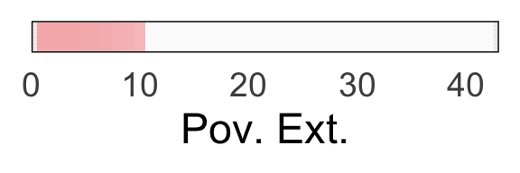<!-- -->

``` r
# get straightfoward of segment where 99% is over 0 or under
positive_counts <- colSums(R_P_derivative_matrix > 0, na.rm = TRUE)
negative_counts <- colSums(R_P_derivative_matrix < 0, na.rm = TRUE)
# find where each is 99% or greater
positive_countsSig=positive_counts>9900
negative_countsSig=negative_counts>9900
# make dataframe: 50th percentile of derivatives accompanied by posSig and NegSig vector
data <- apply(R_P_derivative_matrix, 2, function(x) quantile(x, probs = 0.5))
dervPlotDf<-data.frame(data,positive_countsSig,negative_countsSig)
# if either is sig at 99% plot
dervPlotDf$sig_derivMask=dervPlotDf[,2]+dervPlotDf[,3]>0
# use it to mask calculated derivs
dervPlotDf$sig_deriv=0
dervPlotDf$sig_deriv[dervPlotDf$sig_derivMask]=dervPlotDf$data[dervPlotDf$sig_derivMask]
dervPlotDf$seq=1:(dim(dervPlotDf)[1])
ggplot(data=dervPlotDf) + geom_raster(aes(x = seq, y = .5, fill = sig_deriv))+
    theme(panel.spacing = unit(-.01,"cm")) +
    scale_fill_gradientn(colors = my_palette(100),limits = c(min(-.1),max(0.1)))+theme_minimal(base_size = 35)+
    xlim(c(0,MaxP))+xlab('Parental Ext: NonPov.')+
    guides(fill=FALSE)+
    theme(axis.title.y = element_blank(),axis.text.y=element_blank())+theme(panel.border = element_rect(color = "black", fill = NA, size = 1))+
    scale_x_continuous(limits = c(0,MaxP),expand = expansion(mult = c(0, 0)))
```

    ## Scale for x is already present.
    ## Adding another scale for x, which will replace the existing scale.

    ## Warning: Removed 21 rows containing missing values (`geom_raster()`).

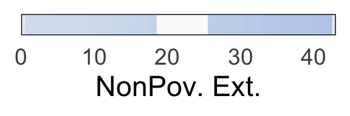<!-- -->

``` r
# end subscale 2
```

``` r
# now do somatic as 3rd subscale: corresponds to F_somFit,M_somFit,P_somFit,R_somFit
# isolate Female, Male, Poor, Rich
# spans 0:maximum value of symptoms
start=end+1
end=end+(somMaxVal+1)
F_PFits=Fits[,start:end]

# calculate some background info for plots
MaxP_F=find_furthest_nonzero(F_PFits)

# isolate male fits
start=end+1
end=end+(somMaxVal+1)
M_PFits=Fits[start:end]

# calculate some background info for plots
MaxP_M=find_furthest_nonzero(M_PFits)
# use lowest common value for plots
MaxP <- min(MaxP_M, MaxP_F)

# get median value girl
F_PFits_Coverage=F_PFits[,seq(1:MaxP)]
col_means=colMeans(F_PFits_Coverage)
FP_medians <- apply(F_PFits_Coverage, 2, median)

# get median value boy
M_PFits_Coverage=M_PFits[,seq(1:MaxP)]
col_means=colMeans(M_PFits_Coverage)
MP_medians <- apply(M_PFits_Coverage, 2, median)
MP_medians=MP_medians[1:MaxP]

# merge data
data <- data.frame(
  x = 0:(MaxP-1),
  y_girls = FP_medians,
  y_boys = MP_medians
)

# Create the line plot for p
ggplot(data, aes(x = x, y = y_boys)) +
  geom_line(aes(), color = "#fbad24", size = 3) +
  geom_line(aes(y=y_girls),color = "#923eb5", size = 3) +
  labs(x = 'Parental Somatic', y = y_title) +
  theme_minimal(base_size = 35) +
  theme(plot.title = element_text(hjust = 0.5),
        legend.position = "top",
        legend.title = element_blank(),
        legend.background = element_rect(fill = "white"))+ylim(-1.5,1.5)+
        theme(panel.border = element_rect(color = "black", fill = NA, size = 1))+
        scale_x_continuous(limits = c(0,MaxP-1),expand = expansion(mult = c(0, 0)))
```

<!-- -->

``` r
# and derivatives
# Create an empty matrix to store the derivatives
F_P_derivative_matrix <- matrix(0, nrow = nrow(F_PFits), ncol = ncol(F_PFits) - 1)

# Calculate the derivative for each column
for (i in 1:(ncol(F_PFits) - 1)) {
  # Calculate the differences in x (assuming a constant difference)
  dx <- 1
  # Calculate the differences in y (predicted values)
  dy <- F_PFits[, i + 1] - F_PFits[, i]
  # Calculate the derivatives (slopes)
  derivatives <- dy / dx
  # Store the derivatives in the derivative matrix
  F_P_derivative_matrix[, i] <- derivatives
}

# Create an empty matrix to store the derivatives
M_P_derivative_matrix <- matrix(0, nrow = nrow(M_PFits), ncol = ncol(M_PFits) - 1)

# Calculate the derivative for each column
for (i in 1:(ncol(F_PFits) - 1)) {
  # Calculate the differences in x (assuming a constant difference)
  dx <- 1
  # Calculate the differences in y (predicted values)
  dy <- M_PFits[, i + 1] - M_PFits[, i]
  # Calculate the derivatives (slopes)
  derivatives <- dy / dx
  # Store the derivatives in the derivative matrix
  M_P_derivative_matrix[, i] <- derivatives
}

# calc sig dervs
# get straightfoward of segment where 99% is over 0 or under
positive_counts <- colSums(F_P_derivative_matrix > 0, na.rm = TRUE)
negative_counts <- colSums(F_P_derivative_matrix < 0, na.rm = TRUE)
# find where each is 99% or greater
positive_countsSig=positive_counts>9900
negative_countsSig=negative_counts>9900
# make dataframe: 50th percentile of derivatives accompanied by posSig and NegSig vector
data <- apply(F_P_derivative_matrix, 2, function(x) quantile(x, probs = 0.5))
dervPlotDf<-data.frame(data,positive_countsSig,negative_countsSig)
# if either is sig at 99% plot
dervPlotDf$sig_derivMask=dervPlotDf[,2]+dervPlotDf[,3]>0
# use it to mask calculated derivs
dervPlotDf$sig_deriv=0
dervPlotDf$sig_deriv[dervPlotDf$sig_derivMask]=dervPlotDf$data[dervPlotDf$sig_derivMask]
dervPlotDf$seq=1:(dim(dervPlotDf)[1])
ggplot(data=dervPlotDf) + geom_raster(aes(x = seq, y = .5, fill = sig_deriv))+
    theme(panel.spacing = unit(-.01,"cm")) +
    scale_fill_gradientn(colors = my_palette(100),limits = c(min(-.1),max(0.1)))+theme_minimal(base_size = 35)+
    xlim(c(0,MaxP))+xlab('Parental Som: Girl')+
    guides(fill=FALSE)+
    theme(axis.title.y = element_blank(),axis.text.y=element_blank())+theme(panel.border = element_rect(color = "black", fill = NA, size = 1))+
    scale_x_continuous(limits = c(0,MaxP),expand = expansion(mult = c(0, 0)))
```

    ## Scale for x is already present.
    ## Adding another scale for x, which will replace the existing scale.

    ## Warning: Removed 4 rows containing missing values (`geom_raster()`).

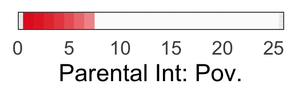<!-- -->

``` r
# get straightfoward of segment where 99% is over 0 or under
positive_counts <- colSums(M_P_derivative_matrix > 0, na.rm = TRUE)
negative_counts <- colSums(M_P_derivative_matrix < 0, na.rm = TRUE)
# find where each is 99% or greater
positive_countsSig=positive_counts>9900
negative_countsSig=negative_counts>9900
# make dataframe: 50th percentile of derivatives accompanied by posSig and NegSig vector
data <- apply(M_P_derivative_matrix, 2, function(x) quantile(x, probs = 0.5))
dervPlotDf<-data.frame(data,positive_countsSig,negative_countsSig)
# if either is sig at 99% plot
dervPlotDf$sig_derivMask=dervPlotDf[,2]+dervPlotDf[,3]>0
# use it to mask calculated derivs
dervPlotDf$sig_deriv=0
dervPlotDf$sig_deriv[dervPlotDf$sig_derivMask]=dervPlotDf$data[dervPlotDf$sig_derivMask]
dervPlotDf$seq=1:(dim(dervPlotDf)[1])
ggplot(data=dervPlotDf) + geom_raster(aes(x = seq, y = .5, fill = sig_deriv))+
    theme(panel.spacing = unit(-.01,"cm")) +
    scale_fill_gradientn(colors = my_palette(100),limits = c(min(-.1),max(0.1)))+theme_minimal(base_size = 35)+
    xlim(c(0,MaxP))+xlab('Parental Som: Boy')+
    guides(fill=FALSE)+
    theme(axis.title.y = element_blank(),axis.text.y=element_blank())+theme(panel.border = element_rect(color = "black", fill = NA, size = 1))+
    scale_x_continuous(limits = c(0,MaxP),expand = expansion(mult = c(0, 0)))
```

    ## Scale for x is already present.
    ## Adding another scale for x, which will replace the existing scale.

    ## Warning: Removed 4 rows containing missing values (`geom_raster()`).

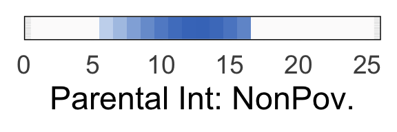<!-- -->

``` r
# poverty analysis: start with below poverty line group
start=end+1
end=end+(somMaxVal+1)
povBoots=Fits[,start:end]
# and nonpov
start=end+1
end=end+(somMaxVal+1)
nonpovBoots=Fits[,start:end]

# calculate some background info for plots
MaxP_P=find_furthest_nonzero(povBoots)
MaxP_R=find_furthest_nonzero(nonpovBoots)

# use lowest common value for plots
MaxP <- min(MaxP_P, MaxP_R)

# get median value pov
P_PFits_Coverage=povBoots[,seq(1:MaxP)]
col_means=colMeans(P_PFits_Coverage)
PP_medians <- apply(P_PFits_Coverage, 2, median)

# get median value nonpov
R_PFits_Coverage=nonpovBoots[,seq(1:MaxP)]
col_means=colMeans(R_PFits_Coverage)
RP_medians <- apply(M_PFits_Coverage, 2, median)
RP_medians=MP_medians[1:MaxP]

# merge data
data <- data.frame(
  x = 0:(MaxP-1),
  y_pov = PP_medians,
  y_nonpov = RP_medians
)

# Create the line plot for p
ggplot(data, aes(x = x, y = y_pov)) +
  geom_line(aes(), color = "#FF5003", size = 3) +
  geom_line(aes(y=y_nonpov),color = "#003F7D", size = 3) +
  labs(x = 'Parental Somatic', y = y_title) +
  theme_minimal(base_size = 35) +
  theme(plot.title = element_text(hjust = 0.5),
        legend.position = "top",
        legend.title = element_blank(),
        legend.background = element_rect(fill = "white"))+ylim(-1.5,1.5)+
        theme(panel.border = element_rect(color = "black", fill = NA, size = 1))+
        scale_x_continuous(limits = c(0,MaxP-1),expand = expansion(mult = c(0, 0)))
```

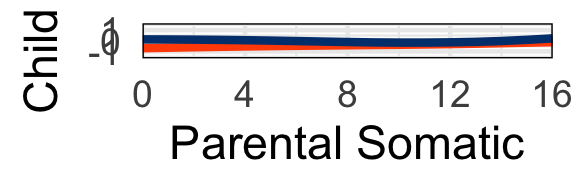<!-- -->

``` r
# and derivatives
# Create an empty matrix to store the derivatives
P_P_derivative_matrix <- matrix(0, nrow = nrow(povBoots), ncol = ncol(povBoots) - 1)

# Calculate the derivative for each column
for (i in 1:(ncol(povBoots) - 1)) {
  # Calculate the differences in x (assuming a constant difference)
  dx <- 1
  # Calculate the differences in y (predicted values)
  dy <- povBoots[, i + 1] - povBoots[, i]
  # Calculate the derivatives (slopes)
  derivatives <- dy / dx
  # Store the derivatives in the derivative matrix
  P_P_derivative_matrix[, i] <- derivatives
}

# Create an empty matrix to store the derivatives
R_P_derivative_matrix <- matrix(0, nrow = nrow(nonpovBoots), ncol = ncol(nonpovBoots) - 1)

# Calculate the derivative for each column
for (i in 1:(ncol(nonpovBoots) - 1)) {
  # Calculate the differences in x (assuming a constant difference)
  dx <- 1
  # Calculate the differences in y (predicted values)
  dy <- nonpovBoots[, i + 1] - nonpovBoots[, i]
  # Calculate the derivatives (slopes)
  derivatives <- dy / dx
  # Store the derivatives in the derivative matrix
  R_P_derivative_matrix[, i] <- derivatives
}

# calc sig dervs
# get straightfoward of segment where 99% is over 0 or under
positive_counts <- colSums(P_P_derivative_matrix > 0, na.rm = TRUE)
negative_counts <- colSums(P_P_derivative_matrix < 0, na.rm = TRUE)
# find where each is 99% or greater
positive_countsSig=positive_counts>9900
negative_countsSig=negative_counts>9900
# make dataframe: 50th percentile of derivatives accompanied by posSig and NegSig vector
data <- apply(P_P_derivative_matrix, 2, function(x) quantile(x, probs = 0.5)) ###  ???
dervPlotDf<-data.frame(data,positive_countsSig,negative_countsSig)
# if either is sig at 99% plot
dervPlotDf$sig_derivMask=dervPlotDf[,2]+dervPlotDf[,3]>0
# use it to mask calculated derivs
dervPlotDf$sig_deriv=0
dervPlotDf$sig_deriv[dervPlotDf$sig_derivMask]=dervPlotDf$data[dervPlotDf$sig_derivMask]
dervPlotDf$seq=1:(dim(dervPlotDf)[1])
ggplot(data=dervPlotDf) + geom_raster(aes(x = seq, y = .5, fill = sig_deriv))+
    theme(panel.spacing = unit(-.01,"cm")) +
    scale_fill_gradientn(colors = my_palette(100),limits = c(min(-.1),max(0.1)))+theme_minimal(base_size = 35)+
    xlim(c(0,MaxP))+xlab('Parental Som: Pov.')+
    guides(fill=FALSE)+
    theme(axis.title.y = element_blank(),axis.text.y=element_blank())+theme(panel.border = element_rect(color = "black", fill = NA, size = 1))+
    scale_x_continuous(limits = c(0,MaxP),expand = expansion(mult = c(0, 0)))
```

    ## Scale for x is already present.
    ## Adding another scale for x, which will replace the existing scale.

    ## Warning: Removed 4 rows containing missing values (`geom_raster()`).

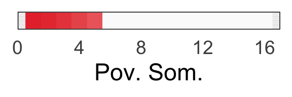<!-- -->

``` r
# get straightfoward of segment where 99% is over 0 or under
positive_counts <- colSums(R_P_derivative_matrix > 0, na.rm = TRUE)
negative_counts <- colSums(R_P_derivative_matrix < 0, na.rm = TRUE)
# find where each is 99% or greater
positive_countsSig=positive_counts>9900
negative_countsSig=negative_counts>9900
# make dataframe: 50th percentile of derivatives accompanied by posSig and NegSig vector
data <- apply(R_P_derivative_matrix, 2, function(x) quantile(x, probs = 0.5))
dervPlotDf<-data.frame(data,positive_countsSig,negative_countsSig)
# if either is sig at 99% plot
dervPlotDf$sig_derivMask=dervPlotDf[,2]+dervPlotDf[,3]>0
# use it to mask calculated derivs
dervPlotDf$sig_deriv=0
dervPlotDf$sig_deriv[dervPlotDf$sig_derivMask]=dervPlotDf$data[dervPlotDf$sig_derivMask]
dervPlotDf$seq=1:(dim(dervPlotDf)[1])
ggplot(data=dervPlotDf) + geom_raster(aes(x = seq, y = .5, fill = sig_deriv))+
    theme(panel.spacing = unit(-.01,"cm")) +
    scale_fill_gradientn(colors = my_palette(100),limits = c(min(-.1),max(0.1)))+theme_minimal(base_size = 35)+
    xlim(c(0,MaxP))+xlab('Parental Som: NonPov.')+
    guides(fill=FALSE)+
    theme(axis.title.y = element_blank(),axis.text.y=element_blank())+theme(panel.border = element_rect(color = "black", fill = NA, size = 1))+
    scale_x_continuous(limits = c(0,MaxP),expand = expansion(mult = c(0, 0)))
```

    ## Scale for x is already present.
    ## Adding another scale for x, which will replace the existing scale.

    ## Warning: Removed 4 rows containing missing values (`geom_raster()`).

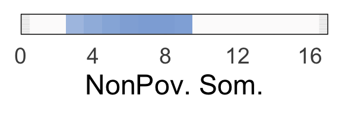<!-- -->

``` r
# end subscale 3
```

``` r
# now do anxious depression as 4th subscale: corresponds to F_anxFit,M_anxFit,P_anxFit,R_anxFit
# isolate Female, Male, Poor, Rich
# spans 0:maximum value of symptoms
start=end+1
end=end+(anxMaxVal+1)
F_PFits=Fits[,start:end]

# calculate some background info for plots
MaxP_F=find_furthest_nonzero(F_PFits)

# isolate male fits
start=end+1
end=end+(anxMaxVal+1)
M_PFits=Fits[start:end]

# calculate some background info for plots
MaxP_M=find_furthest_nonzero(M_PFits)
# use lowest common value for plots
MaxP <- min(MaxP_M, MaxP_F)

# get median value girl
F_PFits_Coverage=F_PFits[,seq(1:MaxP)]
col_means=colMeans(F_PFits_Coverage)
FP_medians <- apply(F_PFits_Coverage, 2, median)

# get median value boy
M_PFits_Coverage=M_PFits[,seq(1:MaxP)]
col_means=colMeans(M_PFits_Coverage)
MP_medians <- apply(M_PFits_Coverage, 2, median)
MP_medians=MP_medians[1:MaxP]

# merge data
data <- data.frame(
  x = 0:(MaxP-1),
  y_girls = FP_medians,
  y_boys = MP_medians
)

# Create the line plot for p
ggplot(data, aes(x = x, y = y_boys)) +
  geom_line(aes(), color = "#fbad24", size = 3) +
  geom_line(aes(y=y_girls),color = "#923eb5", size = 3) +
  labs(x = 'Parental Anxious Depression', y = y_title) +
  theme_minimal(base_size = 35) +
  theme(plot.title = element_text(hjust = 0.5),
        legend.position = "top",
        legend.title = element_blank(),
        legend.background = element_rect(fill = "white"),axis.title.x = element_text(size = 28))+ylim(-1.5,1.5)+
        theme(panel.border = element_rect(color = "black", fill = NA, size = 1))+
        scale_x_continuous(limits = c(0,MaxP-1),expand = expansion(mult = c(0, 0)))
```

<!-- -->

``` r
# and derivatives
# Create an empty matrix to store the derivatives
F_P_derivative_matrix <- matrix(0, nrow = nrow(F_PFits), ncol = ncol(F_PFits) - 1)

# Calculate the derivative for each column
for (i in 1:(ncol(F_PFits) - 1)) {
  # Calculate the differences in x (assuming a constant difference)
  dx <- 1
  # Calculate the differences in y (predicted values)
  dy <- F_PFits[, i + 1] - F_PFits[, i]
  # Calculate the derivatives (slopes)
  derivatives <- dy / dx
  # Store the derivatives in the derivative matrix
  F_P_derivative_matrix[, i] <- derivatives
}

# Create an empty matrix to store the derivatives
M_P_derivative_matrix <- matrix(0, nrow = nrow(M_PFits), ncol = ncol(M_PFits) - 1)

# Calculate the derivative for each column
for (i in 1:(ncol(F_PFits) - 1)) {
  # Calculate the differences in x (assuming a constant difference)
  dx <- 1
  # Calculate the differences in y (predicted values)
  dy <- M_PFits[, i + 1] - M_PFits[, i]
  # Calculate the derivatives (slopes)
  derivatives <- dy / dx
  # Store the derivatives in the derivative matrix
  M_P_derivative_matrix[, i] <- derivatives
}

# calc sig dervs
# get straightfoward of segment where 99% is over 0 or under
positive_counts <- colSums(F_P_derivative_matrix > 0, na.rm = TRUE)
negative_counts <- colSums(F_P_derivative_matrix < 0, na.rm = TRUE)
# find where each is 99% or greater
positive_countsSig=positive_counts>9900
negative_countsSig=negative_counts>9900
# make dataframe: 50th percentile of derivatives accompanied by posSig and NegSig vector
data <- apply(F_P_derivative_matrix, 2, function(x) quantile(x, probs = 0.5))
dervPlotDf<-data.frame(data,positive_countsSig,negative_countsSig)
# if either is sig at 99% plot
dervPlotDf$sig_derivMask=dervPlotDf[,2]+dervPlotDf[,3]>0
# use it to mask calculated derivs
dervPlotDf$sig_deriv=0
dervPlotDf$sig_deriv[dervPlotDf$sig_derivMask]=dervPlotDf$data[dervPlotDf$sig_derivMask]
dervPlotDf$seq=1:(dim(dervPlotDf)[1])
ggplot(data=dervPlotDf) + geom_raster(aes(x = seq, y = .5, fill = sig_deriv))+
    theme(panel.spacing = unit(-.01,"cm")) +
    scale_fill_gradientn(colors = my_palette(100),limits = c(min(-.1),max(0.1)))+theme_minimal(base_size = 35)+
    xlim(c(0,MaxP))+xlab('Parental AnxDep: Girl')+
    guides(fill=FALSE)+
    theme(axis.title.y = element_blank(),axis.text.y=element_blank())+theme(panel.border = element_rect(color = "black", fill = NA, size = 1))+
    scale_x_continuous(limits = c(0,MaxP),expand = expansion(mult = c(0, 0)))
```

    ## Scale for x is already present.
    ## Adding another scale for x, which will replace the existing scale.

    ## Warning: Removed 4 rows containing missing values (`geom_raster()`).

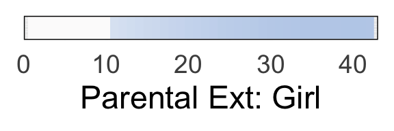<!-- -->

``` r
# get straightfoward of segment where 99% is over 0 or under
positive_counts <- colSums(M_P_derivative_matrix > 0, na.rm = TRUE)
negative_counts <- colSums(M_P_derivative_matrix < 0, na.rm = TRUE)
# find where each is 99% or greater
positive_countsSig=positive_counts>9900
negative_countsSig=negative_counts>9900
# make dataframe: 50th percentile of derivatives accompanied by posSig and NegSig vector
data <- apply(M_P_derivative_matrix, 2, function(x) quantile(x, probs = 0.5))
dervPlotDf<-data.frame(data,positive_countsSig,negative_countsSig)
# if either is sig at 99% plot
dervPlotDf$sig_derivMask=dervPlotDf[,2]+dervPlotDf[,3]>0
# use it to mask calculated derivs
dervPlotDf$sig_deriv=0
dervPlotDf$sig_deriv[dervPlotDf$sig_derivMask]=dervPlotDf$data[dervPlotDf$sig_derivMask]
dervPlotDf$seq=1:(dim(dervPlotDf)[1])
ggplot(data=dervPlotDf) + geom_raster(aes(x = seq, y = .5, fill = sig_deriv))+
    theme(panel.spacing = unit(-.01,"cm")) +
    scale_fill_gradientn(colors = my_palette(100),limits = c(min(-.1),max(0.1)))+theme_minimal(base_size = 35)+
    xlim(c(0,MaxP))+xlab('Parental AnxDep: Boy')+
    guides(fill=FALSE)+
    theme(axis.title.y = element_blank(),axis.text.y=element_blank())+theme(panel.border = element_rect(color = "black", fill = NA, size = 1))+
    scale_x_continuous(limits = c(0,MaxP),expand = expansion(mult = c(0, 0)))
```

    ## Scale for x is already present.
    ## Adding another scale for x, which will replace the existing scale.

    ## Warning: Removed 4 rows containing missing values (`geom_raster()`).

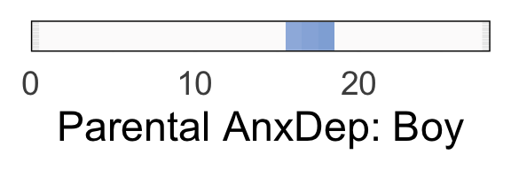<!-- -->

``` r
# poverty analysis: start with below poverty line group
start=end+1
end=end+(anxMaxVal+1)
povBoots=Fits[,start:end]
# and nonpov
start=end+1
end=end+(anxMaxVal+1)
nonpovBoots=Fits[,start:end]

# calculate some background info for plots
MaxP_P=find_furthest_nonzero(povBoots)
MaxP_R=find_furthest_nonzero(nonpovBoots)

# use lowest common value for plots
MaxP <- min(MaxP_P, MaxP_R)

# get median value pov
P_PFits_Coverage=povBoots[,seq(1:MaxP)]
col_means=colMeans(P_PFits_Coverage)
PP_medians <- apply(P_PFits_Coverage, 2, median)

# get median value nonpov
R_PFits_Coverage=nonpovBoots[,seq(1:MaxP)]
col_means=colMeans(R_PFits_Coverage)
RP_medians <- apply(M_PFits_Coverage, 2, median)
RP_medians=MP_medians[1:MaxP]

# merge data
data <- data.frame(
  x = 0:(MaxP-1),
  y_pov = PP_medians,
  y_nonpov = RP_medians
)

# Create the line plot for p
ggplot(data, aes(x = x, y = y_pov)) +
  geom_line(aes(), color = "#FF5003", size = 3) +
  geom_line(aes(y=y_nonpov),color = "#003F7D", size = 3) +
  labs(x = 'Parental Anxious Depression', y = y_title) +
  theme_minimal(base_size = 35) +
  theme(plot.title = element_text(hjust = 0.5),
        legend.position = "top",
        legend.title = element_blank(),
        legend.background = element_rect(fill = "white"))+ylim(-1.5,1.5)+
        theme(panel.border = element_rect(color = "black", fill = NA, size = 1),axis.title.x = element_text(size = 28))+
        scale_x_continuous(limits = c(0,MaxP-1),expand = expansion(mult = c(0, 0)))
```

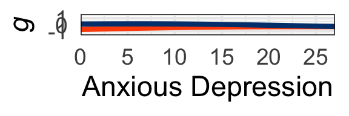<!-- -->

``` r
# and derivatives
# Create an empty matrix to store the derivatives
P_P_derivative_matrix <- matrix(0, nrow = nrow(povBoots), ncol = ncol(povBoots) - 1)

# Calculate the derivative for each column
for (i in 1:(ncol(povBoots) - 1)) {
  # Calculate the differences in x (assuming a constant difference)
  dx <- 1
  # Calculate the differences in y (predicted values)
  dy <- povBoots[, i + 1] - povBoots[, i]
  # Calculate the derivatives (slopes)
  derivatives <- dy / dx
  # Store the derivatives in the derivative matrix
  P_P_derivative_matrix[, i] <- derivatives
}

# Create an empty matrix to store the derivatives
R_P_derivative_matrix <- matrix(0, nrow = nrow(nonpovBoots), ncol = ncol(nonpovBoots) - 1)

# Calculate the derivative for each column
for (i in 1:(ncol(nonpovBoots) - 1)) {
  # Calculate the differences in x (assuming a constant difference)
  dx <- 1
  # Calculate the differences in y (predicted values)
  dy <- nonpovBoots[, i + 1] - nonpovBoots[, i]
  # Calculate the derivatives (slopes)
  derivatives <- dy / dx
  # Store the derivatives in the derivative matrix
  R_P_derivative_matrix[, i] <- derivatives
}

# calc sig dervs
# get straightfoward of segment where 99% is over 0 or under
positive_counts <- colSums(P_P_derivative_matrix > 0, na.rm = TRUE)
negative_counts <- colSums(P_P_derivative_matrix < 0, na.rm = TRUE)
# find where each is 99% or greater
positive_countsSig=positive_counts>9900
negative_countsSig=negative_counts>9900
# make dataframe: 50th percentile of derivatives accompanied by posSig and NegSig vector
data <- apply(P_P_derivative_matrix, 2, function(x) quantile(x, probs = 0.5)) ###  ???
dervPlotDf<-data.frame(data,positive_countsSig,negative_countsSig)
# if either is sig at 99% plot
dervPlotDf$sig_derivMask=dervPlotDf[,2]+dervPlotDf[,3]>0
# use it to mask calculated derivs
dervPlotDf$sig_deriv=0
dervPlotDf$sig_deriv[dervPlotDf$sig_derivMask]=dervPlotDf$data[dervPlotDf$sig_derivMask]
dervPlotDf$seq=1:(dim(dervPlotDf)[1])
ggplot(data=dervPlotDf) + geom_raster(aes(x = seq, y = .5, fill = sig_deriv))+
    theme(panel.spacing = unit(-.01,"cm")) +
    scale_fill_gradientn(colors = my_palette(100),limits = c(min(-.1),max(0.1)))+theme_minimal(base_size = 35)+
    xlim(c(0,MaxP))+xlab('Parental AnxDep: Pov.')+
    guides(fill=FALSE)+
    theme(axis.title.y = element_blank(),axis.text.y=element_blank())+theme(panel.border = element_rect(color = "black", fill = NA, size = 1))+
    scale_x_continuous(limits = c(0,MaxP),expand = expansion(mult = c(0, 0)))
```

    ## Scale for x is already present.
    ## Adding another scale for x, which will replace the existing scale.

    ## Warning: Removed 4 rows containing missing values (`geom_raster()`).

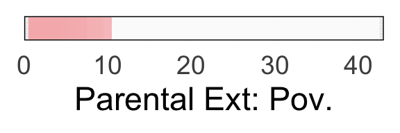<!-- -->

``` r
# get straightfoward of segment where 99% is over 0 or under
positive_counts <- colSums(R_P_derivative_matrix > 0, na.rm = TRUE)
negative_counts <- colSums(R_P_derivative_matrix < 0, na.rm = TRUE)
# find where each is 99% or greater
positive_countsSig=positive_counts>9900
negative_countsSig=negative_counts>9900
# make dataframe: 50th percentile of derivatives accompanied by posSig and NegSig vector
data <- apply(R_P_derivative_matrix, 2, function(x) quantile(x, probs = 0.5))
dervPlotDf<-data.frame(data,positive_countsSig,negative_countsSig)
# if either is sig at 99% plot
dervPlotDf$sig_derivMask=dervPlotDf[,2]+dervPlotDf[,3]>0
# use it to mask calculated derivs
dervPlotDf$sig_deriv=0
dervPlotDf$sig_deriv[dervPlotDf$sig_derivMask]=dervPlotDf$data[dervPlotDf$sig_derivMask]
dervPlotDf$seq=1:(dim(dervPlotDf)[1])
ggplot(data=dervPlotDf) + geom_raster(aes(x = seq, y = .5, fill = sig_deriv))+
    theme(panel.spacing = unit(-.01,"cm")) +
    scale_fill_gradientn(colors = my_palette(100),limits = c(min(-.1),max(0.1)))+theme_minimal(base_size = 35)+
    xlim(c(0,MaxP))+xlab('Parental AnxDep: NonPov.')+
    guides(fill=FALSE)+
    theme(axis.title.y = element_blank(),axis.text.y=element_blank())+theme(panel.border = element_rect(color = "black", fill = NA, size = 1))+
    scale_x_continuous(limits = c(0,MaxP),expand = expansion(mult = c(0, 0)))
```

    ## Scale for x is already present.
    ## Adding another scale for x, which will replace the existing scale.

    ## Warning: Removed 4 rows containing missing values (`geom_raster()`).

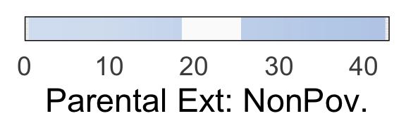<!-- -->

``` r
# end subscale 4
```

``` r
# now do thought as 5th subscale: corresponds to F_thoFit,M_thoFit,P_thoFit,R_thoFit,
# isolate Female, Male, Poor, Rich
# spans 0:maximum value of symptoms
start=end+1
end=end+(thoMaxVal+1)
F_PFits=Fits[,start:end]

# calculate some background info for plots
MaxP_F=find_furthest_nonzero(F_PFits)

# isolate male fits
start=end+1
end=end+(thoMaxVal+1)
M_PFits=Fits[start:end]

# calculate some background info for plots
MaxP_M=find_furthest_nonzero(M_PFits)
# use lowest common value for plots
MaxP <- min(MaxP_M, MaxP_F)

# get median value girl
F_PFits_Coverage=F_PFits[,seq(1:MaxP)]
col_means=colMeans(F_PFits_Coverage)
FP_medians <- apply(F_PFits_Coverage, 2, median)

# get median value boy
M_PFits_Coverage=M_PFits[,seq(1:MaxP)]
col_means=colMeans(M_PFits_Coverage)
MP_medians <- apply(M_PFits_Coverage, 2, median)
MP_medians=MP_medians[1:MaxP]

# merge data
data <- data.frame(
  x = 0:(MaxP-1),
  y_girls = FP_medians,
  y_boys = MP_medians
)

# Create the line plot for p
ggplot(data, aes(x = x, y = y_boys)) +
  geom_line(aes(), color = "#fbad24", size = 3) +
  geom_line(aes(y=y_girls),color = "#923eb5", size = 3) +
  labs(x = 'Parental Thought', y = y_title) +
  theme_minimal(base_size = 35) +
  theme(plot.title = element_text(hjust = 0.5),
        legend.position = "top",
        legend.title = element_blank(),
        legend.background = element_rect(fill = "white"))+ylim(-1.5,1.5)+
        theme(panel.border = element_rect(color = "black", fill = NA, size = 1))+
        scale_x_continuous(limits = c(0,MaxP-1),expand = expansion(mult = c(0, 0)))
```

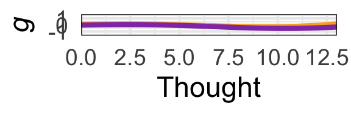<!-- -->

``` r
# and derivatives
# Create an empty matrix to store the derivatives
F_P_derivative_matrix <- matrix(0, nrow = nrow(F_PFits), ncol = ncol(F_PFits) - 1)

# Calculate the derivative for each column
for (i in 1:(ncol(F_PFits) - 1)) {
  # Calculate the differences in x (assuming a constant difference)
  dx <- 1
  # Calculate the differences in y (predicted values)
  dy <- F_PFits[, i + 1] - F_PFits[, i]
  # Calculate the derivatives (slopes)
  derivatives <- dy / dx
  # Store the derivatives in the derivative matrix
  F_P_derivative_matrix[, i] <- derivatives
}

# Create an empty matrix to store the derivatives
M_P_derivative_matrix <- matrix(0, nrow = nrow(M_PFits), ncol = ncol(M_PFits) - 1)

# Calculate the derivative for each column
for (i in 1:(ncol(F_PFits) - 1)) {
  # Calculate the differences in x (assuming a constant difference)
  dx <- 1
  # Calculate the differences in y (predicted values)
  dy <- M_PFits[, i + 1] - M_PFits[, i]
  # Calculate the derivatives (slopes)
  derivatives <- dy / dx
  # Store the derivatives in the derivative matrix
  M_P_derivative_matrix[, i] <- derivatives
}

# calc sig dervs
# get straightfoward of segment where 99% is over 0 or under
positive_counts <- colSums(F_P_derivative_matrix > 0, na.rm = TRUE)
negative_counts <- colSums(F_P_derivative_matrix < 0, na.rm = TRUE)
# find where each is 99% or greater
positive_countsSig=positive_counts>9900
negative_countsSig=negative_counts>9900
# make dataframe: 50th percentile of derivatives accompanied by posSig and NegSig vector
data <- apply(F_P_derivative_matrix, 2, function(x) quantile(x, probs = 0.5))
dervPlotDf<-data.frame(data,positive_countsSig,negative_countsSig)
# if either is sig at 99% plot
dervPlotDf$sig_derivMask=dervPlotDf[,2]+dervPlotDf[,3]>0
# use it to mask calculated derivs
dervPlotDf$sig_deriv=0
dervPlotDf$sig_deriv[dervPlotDf$sig_derivMask]=dervPlotDf$data[dervPlotDf$sig_derivMask]
dervPlotDf$seq=1:(dim(dervPlotDf)[1])
# lil printout to see what max deriv is
paste(max(abs(dervPlotDf$sig_deriv)))
```

    ## [1] "0.116788326755169"

``` r
ggplot(data=dervPlotDf) + geom_raster(aes(x = seq, y = .5, fill = sig_deriv))+
    theme(panel.spacing = unit(-.01,"cm")) +
    scale_fill_gradientn(colors = my_palette(100),limits = c(min(-.15),max(0.15)))+theme_minimal(base_size = 35)+
    xlim(c(0,MaxP))+xlab('Parental Thought: Girl*')+
    guides(fill=FALSE)+
    theme(axis.title.y = element_blank(),axis.text.y=element_blank())+theme(panel.border = element_rect(color = "black", fill = NA, size = 1))+
    scale_x_continuous(limits = c(0,MaxP),expand = expansion(mult = c(0, 0)))
```

    ## Scale for x is already present.
    ## Adding another scale for x, which will replace the existing scale.

    ## Warning: Removed 5 rows containing missing values (`geom_raster()`).

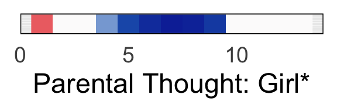<!-- -->

``` r
# get straightfoward of segment where 99% is over 0 or under
positive_counts <- colSums(M_P_derivative_matrix > 0, na.rm = TRUE)
negative_counts <- colSums(M_P_derivative_matrix < 0, na.rm = TRUE)
# find where each is 99% or greater
positive_countsSig=positive_counts>9900
negative_countsSig=negative_counts>9900
# make dataframe: 50th percentile of derivatives accompanied by posSig and NegSig vector
data <- apply(M_P_derivative_matrix, 2, function(x) quantile(x, probs = 0.5))
dervPlotDf<-data.frame(data,positive_countsSig,negative_countsSig)
# if either is sig at 99% plot
dervPlotDf$sig_derivMask=dervPlotDf[,2]+dervPlotDf[,3]>0
# use it to mask calculated derivs
dervPlotDf$sig_deriv=0
dervPlotDf$sig_deriv[dervPlotDf$sig_derivMask]=dervPlotDf$data[dervPlotDf$sig_derivMask]
dervPlotDf$seq=1:(dim(dervPlotDf)[1])
# print out maximmum value
paste(max(abs(dervPlotDf$sig_deriv)))
```

    ## [1] "0.270531292991941"

``` r
ggplot(data=dervPlotDf) + geom_raster(aes(x = seq, y = .5, fill = sig_deriv))+
    theme(panel.spacing = unit(-.01,"cm")) +
    scale_fill_gradientn(colors = my_palette(100),limits = c(min(-.3),max(0.3)))+theme_minimal(base_size = 35)+
    xlim(c(0,MaxP))+xlab('Parental Thought: Boy***')+
    guides(fill=FALSE)+
    theme(axis.title.y = element_blank(),axis.text.y=element_blank())+theme(panel.border = element_rect(color = "black", fill = NA, size = 1))+
    scale_x_continuous(limits = c(0,MaxP),expand = expansion(mult = c(0, 0)))
```

    ## Scale for x is already present.
    ## Adding another scale for x, which will replace the existing scale.

    ## Warning: Removed 5 rows containing missing values (`geom_raster()`).

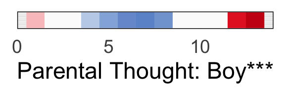<!-- -->

``` r
# poverty analysis: start with below poverty line group
start=end+1
end=end+(thoMaxVal+1)
povBoots=Fits[,start:end]
# and nonpov
start=end+1
end=end+(thoMaxVal+1)
nonpovBoots=Fits[,start:end]

# calculate some background info for plots
MaxP_P=find_furthest_nonzero(povBoots)
MaxP_R=find_furthest_nonzero(nonpovBoots)

# use lowest common value for plots
MaxP <- min(MaxP_P, MaxP_R)

# get median value pov
P_PFits_Coverage=povBoots[,seq(1:MaxP)]
col_means=colMeans(P_PFits_Coverage)
PP_medians <- apply(P_PFits_Coverage, 2, median)

# get median value nonpov
R_PFits_Coverage=nonpovBoots[,seq(1:MaxP)]
col_means=colMeans(R_PFits_Coverage)
RP_medians <- apply(M_PFits_Coverage, 2, median)
RP_medians=MP_medians[1:MaxP]

# merge data
data <- data.frame(
  x = 0:(MaxP-1),
  y_pov = PP_medians,
  y_nonpov = RP_medians
)

# Create the line plot for p
ggplot(data, aes(x = x, y = y_pov)) +
  geom_line(aes(), color = "#FF5003", size = 3) +
  geom_line(aes(y=y_nonpov),color = "#003F7D", size = 3) +
  labs(x = 'Parental Thought', y = y_title) +
  theme_minimal(base_size = 35) +
  theme(plot.title = element_text(hjust = 0.5),
        legend.position = "top",
        legend.title = element_blank(),
        legend.background = element_rect(fill = "white"))+ylim(-1.5,1.5)+
        theme(panel.border = element_rect(color = "black", fill = NA, size = 1))+
        scale_x_continuous(limits = c(0,MaxP-1),expand = expansion(mult = c(0, 0)))
```

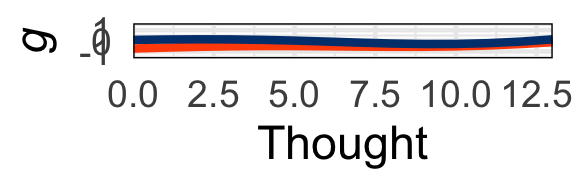<!-- -->

``` r
# and derivatives
# Create an empty matrix to store the derivatives
P_P_derivative_matrix <- matrix(0, nrow = nrow(povBoots), ncol = ncol(povBoots) - 1)

# Calculate the derivative for each column
for (i in 1:(ncol(povBoots) - 1)) {
  # Calculate the differences in x (assuming a constant difference)
  dx <- 1
  # Calculate the differences in y (predicted values)
  dy <- povBoots[, i + 1] - povBoots[, i]
  # Calculate the derivatives (slopes)
  derivatives <- dy / dx
  # Store the derivatives in the derivative matrix
  P_P_derivative_matrix[, i] <- derivatives
}

# Create an empty matrix to store the derivatives
R_P_derivative_matrix <- matrix(0, nrow = nrow(nonpovBoots), ncol = ncol(nonpovBoots) - 1)

# Calculate the derivative for each column
for (i in 1:(ncol(nonpovBoots) - 1)) {
  # Calculate the differences in x (assuming a constant difference)
  dx <- 1
  # Calculate the differences in y (predicted values)
  dy <- nonpovBoots[, i + 1] - nonpovBoots[, i]
  # Calculate the derivatives (slopes)
  derivatives <- dy / dx
  # Store the derivatives in the derivative matrix
  R_P_derivative_matrix[, i] <- derivatives
}

# calc sig dervs
# get straightfoward of segment where 99% is over 0 or under
positive_counts <- colSums(P_P_derivative_matrix > 0, na.rm = TRUE)
negative_counts <- colSums(P_P_derivative_matrix < 0, na.rm = TRUE)
# find where each is 99% or greater
positive_countsSig=positive_counts>9900
negative_countsSig=negative_counts>9900
# make dataframe: 50th percentile of derivatives accompanied by posSig and NegSig vector
data <- apply(P_P_derivative_matrix, 2, function(x) quantile(x, probs = 0.5)) ###  ???
dervPlotDf<-data.frame(data,positive_countsSig,negative_countsSig)
# if either is sig at 99% plot
dervPlotDf$sig_derivMask=dervPlotDf[,2]+dervPlotDf[,3]>0
# use it to mask calculated derivs
dervPlotDf$sig_deriv=0
dervPlotDf$sig_deriv[dervPlotDf$sig_derivMask]=dervPlotDf$data[dervPlotDf$sig_derivMask]
dervPlotDf$seq=1:(dim(dervPlotDf)[1])
ggplot(data=dervPlotDf) + geom_raster(aes(x = seq, y = .5, fill = sig_deriv))+
    theme(panel.spacing = unit(-.01,"cm")) +
    scale_fill_gradientn(colors = my_palette(100),limits = c(min(-.2),max(0.2)))+theme_minimal(base_size = 35)+
    xlim(c(0,MaxP))+xlab('Parental Thought: Pov.**')+
    guides(fill=FALSE)+
    theme(axis.title.y = element_blank(),axis.text.y=element_blank())+theme(panel.border = element_rect(color = "black", fill = NA, size = 1))+
    scale_x_continuous(limits = c(0,MaxP),expand = expansion(mult = c(0, 0)))
```

    ## Scale for x is already present.
    ## Adding another scale for x, which will replace the existing scale.

    ## Warning: Removed 5 rows containing missing values (`geom_raster()`).

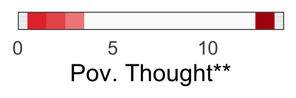<!-- -->

``` r
# get straightfoward of segment where 99% is over 0 or under
positive_counts <- colSums(R_P_derivative_matrix > 0, na.rm = TRUE)
negative_counts <- colSums(R_P_derivative_matrix < 0, na.rm = TRUE)
# find where each is 99% or greater
positive_countsSig=positive_counts>9900
negative_countsSig=negative_counts>9900
# make dataframe: 50th percentile of derivatives accompanied by posSig and NegSig vector
data <- apply(R_P_derivative_matrix, 2, function(x) quantile(x, probs = 0.5))
dervPlotDf<-data.frame(data,positive_countsSig,negative_countsSig)
# if either is sig at 99% plot
dervPlotDf$sig_derivMask=dervPlotDf[,2]+dervPlotDf[,3]>0
# use it to mask calculated derivs
dervPlotDf$sig_deriv=0
dervPlotDf$sig_deriv[dervPlotDf$sig_derivMask]=dervPlotDf$data[dervPlotDf$sig_derivMask]
dervPlotDf$seq=1:(dim(dervPlotDf)[1])
ggplot(data=dervPlotDf) + geom_raster(aes(x = seq, y = .5, fill = sig_deriv))+
    theme(panel.spacing = unit(-.01,"cm")) +
    scale_fill_gradientn(colors = my_palette(100),limits = c(min(-.1),max(0.1)))+theme_minimal(base_size = 35)+
    xlim(c(0,MaxP))+xlab('Parental Thought: NonPov.')+
    guides(fill=FALSE)+
    theme(axis.title.y = element_blank(),axis.text.y=element_blank())+theme(panel.border = element_rect(color = "black", fill = NA, size = 1))+
    scale_x_continuous(limits = c(0,MaxP),expand = expansion(mult = c(0, 0)))
```

    ## Scale for x is already present.
    ## Adding another scale for x, which will replace the existing scale.

    ## Warning: Removed 5 rows containing missing values (`geom_raster()`).

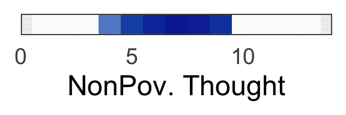<!-- -->

``` r
# end subscale 5
```

``` r
# now do withdrawn depression as 6th subscale: corresponds to F_witdepFit,M_witdepFit,P_witdepFit,R_witdepFit
# isolate Female, Male, Poor, Rich
# spans 0:maximum value of symptoms
start=end+1
end=end+(depMaxVal+1)
F_PFits=Fits[,start:end]

# calculate some background info for plots
MaxP_F=find_furthest_nonzero(F_PFits)

# isolate male fits
start=end+1
end=end+(depMaxVal+1)
M_PFits=Fits[start:end]

# calculate some background info for plots
MaxP_M=find_furthest_nonzero(M_PFits)
# use lowest common value for plots
MaxP <- min(MaxP_M, MaxP_F)

# get median value girl
F_PFits_Coverage=F_PFits[,seq(1:MaxP)]
col_means=colMeans(F_PFits_Coverage)
FP_medians <- apply(F_PFits_Coverage, 2, median)

# get median value boy
M_PFits_Coverage=M_PFits[,seq(1:MaxP)]
col_means=colMeans(M_PFits_Coverage)
MP_medians <- apply(M_PFits_Coverage, 2, median)
MP_medians=MP_medians[1:MaxP]

# merge data
data <- data.frame(
  x = 0:(MaxP-1),
  y_girls = FP_medians,
  y_boys = MP_medians
)

# Create the line plot for p
ggplot(data, aes(x = x, y = y_boys)) +
  geom_line(aes(), color = "#fbad24", size = 3) +
  geom_line(aes(y=y_girls),color = "#923eb5", size = 3) +
  labs(x = 'Parental Withdrawn Depression', y = y_title) +
  theme_minimal(base_size = 35) +
  theme(plot.title = element_text(hjust = 0.5),
        legend.position = "top",
        legend.title = element_blank(),
        legend.background = element_rect(fill = "white"))+ylim(-1.5,1.5)+
        theme(panel.border = element_rect(color = "black", fill = NA, size = 1),axis.title.x = element_text(size = 25))+
        scale_x_continuous(limits = c(0,MaxP-1),expand = expansion(mult = c(0, 0)))
```

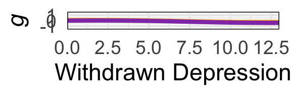<!-- -->

``` r
# and derivatives
# Create an empty matrix to store the derivatives
F_P_derivative_matrix <- matrix(0, nrow = nrow(F_PFits), ncol = ncol(F_PFits) - 1)

# Calculate the derivative for each column
for (i in 1:(ncol(F_PFits) - 1)) {
  # Calculate the differences in x (assuming a constant difference)
  dx <- 1
  # Calculate the differences in y (predicted values)
  dy <- F_PFits[, i + 1] - F_PFits[, i]
  # Calculate the derivatives (slopes)
  derivatives <- dy / dx
  # Store the derivatives in the derivative matrix
  F_P_derivative_matrix[, i] <- derivatives
}

# Create an empty matrix to store the derivatives
M_P_derivative_matrix <- matrix(0, nrow = nrow(M_PFits), ncol = ncol(M_PFits) - 1)

# Calculate the derivative for each column
for (i in 1:(ncol(F_PFits) - 1)) {
  # Calculate the differences in x (assuming a constant difference)
  dx <- 1
  # Calculate the differences in y (predicted values)
  dy <- M_PFits[, i + 1] - M_PFits[, i]
  # Calculate the derivatives (slopes)
  derivatives <- dy / dx
  # Store the derivatives in the derivative matrix
  M_P_derivative_matrix[, i] <- derivatives
}

# calc sig dervs
# get straightfoward of segment where 99% is over 0 or under
positive_counts <- colSums(F_P_derivative_matrix > 0, na.rm = TRUE)
negative_counts <- colSums(F_P_derivative_matrix < 0, na.rm = TRUE)
# find where each is 99% or greater
positive_countsSig=positive_counts>9900
negative_countsSig=negative_counts>9900
# make dataframe: 50th percentile of derivatives accompanied by posSig and NegSig vector
data <- apply(F_P_derivative_matrix, 2, function(x) quantile(x, probs = 0.5))
dervPlotDf<-data.frame(data,positive_countsSig,negative_countsSig)
# if either is sig at 99% plot
dervPlotDf$sig_derivMask=dervPlotDf[,2]+dervPlotDf[,3]>0
# use it to mask calculated derivs
dervPlotDf$sig_deriv=0
dervPlotDf$sig_deriv[dervPlotDf$sig_derivMask]=dervPlotDf$data[dervPlotDf$sig_derivMask]
dervPlotDf$seq=1:(dim(dervPlotDf)[1])
ggplot(data=dervPlotDf) + geom_raster(aes(x = seq, y = .5, fill = sig_deriv))+
    theme(panel.spacing = unit(-.01,"cm")) +
    scale_fill_gradientn(colors = my_palette(100),limits = c(min(-.1),max(0.1)))+theme_minimal(base_size = 35)+
    xlim(c(0,MaxP))+xlab('Parental WithDep: Girl')+
    guides(fill=FALSE)+
    theme(axis.title.y = element_blank(),axis.text.y=element_blank())+theme(panel.border = element_rect(color = "black", fill = NA, size = 1))+
    scale_x_continuous(limits = c(0,MaxP),expand = expansion(mult = c(0, 0)))
```

    ## Scale for x is already present.
    ## Adding another scale for x, which will replace the existing scale.

    ## Warning: Removed 5 rows containing missing values (`geom_raster()`).

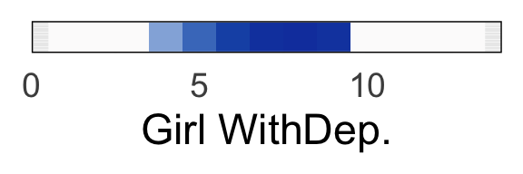<!-- -->

``` r
# get straightfoward of segment where 99% is over 0 or under
positive_counts <- colSums(M_P_derivative_matrix > 0, na.rm = TRUE)
negative_counts <- colSums(M_P_derivative_matrix < 0, na.rm = TRUE)
# find where each is 99% or greater
positive_countsSig=positive_counts>9900
negative_countsSig=negative_counts>9900
# make dataframe: 50th percentile of derivatives accompanied by posSig and NegSig vector
data <- apply(M_P_derivative_matrix, 2, function(x) quantile(x, probs = 0.5))
dervPlotDf<-data.frame(data,positive_countsSig,negative_countsSig)
# if either is sig at 99% plot
dervPlotDf$sig_derivMask=dervPlotDf[,2]+dervPlotDf[,3]>0
# use it to mask calculated derivs
dervPlotDf$sig_deriv=0
dervPlotDf$sig_deriv[dervPlotDf$sig_derivMask]=dervPlotDf$data[dervPlotDf$sig_derivMask]
dervPlotDf$seq=1:(dim(dervPlotDf)[1])
ggplot(data=dervPlotDf) + geom_raster(aes(x = seq, y = .5, fill = sig_deriv))+
    theme(panel.spacing = unit(-.01,"cm")) +
    scale_fill_gradientn(colors = my_palette(100),limits = c(min(-.1),max(0.1)))+theme_minimal(base_size = 35)+
    xlim(c(0,MaxP))+xlab('Parental WithDep: Boy')+
    guides(fill=FALSE)+
    theme(axis.title.y = element_blank(),axis.text.y=element_blank())+theme(panel.border = element_rect(color = "black", fill = NA, size = 1))+
    scale_x_continuous(limits = c(0,MaxP),expand = expansion(mult = c(0, 0)))
```

    ## Scale for x is already present.
    ## Adding another scale for x, which will replace the existing scale.

    ## Warning: Removed 5 rows containing missing values (`geom_raster()`).

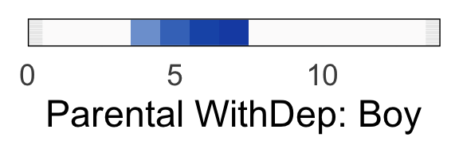<!-- -->

``` r
# poverty analysis: start with below poverty line group
start=end+1
end=end+(depMaxVal+1)
povBoots=Fits[,start:end]
# and nonpov
start=end+1
end=end+(depMaxVal+1)
nonpovBoots=Fits[,start:end]

# calculate some background info for plots
MaxP_P=find_furthest_nonzero(povBoots)
MaxP_R=find_furthest_nonzero(nonpovBoots)

# use lowest common value for plots
MaxP <- min(MaxP_P, MaxP_R)

# get median value pov
P_PFits_Coverage=povBoots[,seq(1:MaxP)]
col_means=colMeans(P_PFits_Coverage)
PP_medians <- apply(P_PFits_Coverage, 2, median)

# get median value nonpov
R_PFits_Coverage=nonpovBoots[,seq(1:MaxP)]
col_means=colMeans(R_PFits_Coverage)
RP_medians <- apply(M_PFits_Coverage, 2, median)
RP_medians=MP_medians[1:MaxP]

# merge data
data <- data.frame(
  x = 0:(MaxP-1),
  y_pov = PP_medians,
  y_nonpov = RP_medians
)

# Create the line plot for p
ggplot(data, aes(x = x, y = y_pov)) +
  geom_line(aes(), color = "#FF5003", size = 3) +
  geom_line(aes(y=y_nonpov),color = "#003F7D", size = 3) +
  labs(x = 'Parental Withdrawn Depression', y = y_title) +
  theme_minimal(base_size = 35) +
  theme(plot.title = element_text(hjust = 0.5),
        legend.position = "top",
        legend.title = element_blank(),
        legend.background = element_rect(fill = "white"))+ylim(-1.5,1.5)+
        theme(panel.border = element_rect(color = "black", fill = NA, size = 1),axis.title.x = element_text(size = 28))+
        scale_x_continuous(limits = c(0,MaxP-1),expand = expansion(mult = c(0, 0)))
```

<!-- -->

``` r
# and derivatives
# Create an empty matrix to store the derivatives
P_P_derivative_matrix <- matrix(0, nrow = nrow(povBoots), ncol = ncol(povBoots) - 1)

# Calculate the derivative for each column
for (i in 1:(ncol(povBoots) - 1)) {
  # Calculate the differences in x (assuming a constant difference)
  dx <- 1
  # Calculate the differences in y (predicted values)
  dy <- povBoots[, i + 1] - povBoots[, i]
  # Calculate the derivatives (slopes)
  derivatives <- dy / dx
  # Store the derivatives in the derivative matrix
  P_P_derivative_matrix[, i] <- derivatives
}

# Create an empty matrix to store the derivatives
R_P_derivative_matrix <- matrix(0, nrow = nrow(nonpovBoots), ncol = ncol(nonpovBoots) - 1)

# Calculate the derivative for each column
for (i in 1:(ncol(nonpovBoots) - 1)) {
  # Calculate the differences in x (assuming a constant difference)
  dx <- 1
  # Calculate the differences in y (predicted values)
  dy <- nonpovBoots[, i + 1] - nonpovBoots[, i]
  # Calculate the derivatives (slopes)
  derivatives <- dy / dx
  # Store the derivatives in the derivative matrix
  R_P_derivative_matrix[, i] <- derivatives
}

# calc sig dervs
# get straightfoward of segment where 99% is over 0 or under
positive_counts <- colSums(P_P_derivative_matrix > 0, na.rm = TRUE)
negative_counts <- colSums(P_P_derivative_matrix < 0, na.rm = TRUE)
# find where each is 99% or greater
positive_countsSig=positive_counts>9900
negative_countsSig=negative_counts>9900
# make dataframe: 50th percentile of derivatives accompanied by posSig and NegSig vector
data <- apply(P_P_derivative_matrix, 2, function(x) quantile(x, probs = 0.5)) ###  ???
dervPlotDf<-data.frame(data,positive_countsSig,negative_countsSig)
# if either is sig at 99% plot
dervPlotDf$sig_derivMask=dervPlotDf[,2]+dervPlotDf[,3]>0
# use it to mask calculated derivs
dervPlotDf$sig_deriv=0
dervPlotDf$sig_deriv[dervPlotDf$sig_derivMask]=dervPlotDf$data[dervPlotDf$sig_derivMask]
dervPlotDf$seq=1:(dim(dervPlotDf)[1])
ggplot(data=dervPlotDf) + geom_raster(aes(x = seq, y = .5, fill = sig_deriv))+
    theme(panel.spacing = unit(-.01,"cm")) +
    scale_fill_gradientn(colors = my_palette(100),limits = c(min(-.1),max(0.1)))+theme_minimal(base_size = 35)+
    xlim(c(0,MaxP))+xlab('Parental WithDep: Pov.')+
    guides(fill=FALSE)+
    theme(axis.title.y = element_blank(),axis.text.y=element_blank())+theme(panel.border = element_rect(color = "black", fill = NA, size = 1))+
    scale_x_continuous(limits = c(0,MaxP),expand = expansion(mult = c(0, 0)))
```

    ## Scale for x is already present.
    ## Adding another scale for x, which will replace the existing scale.

    ## Warning: Removed 5 rows containing missing values (`geom_raster()`).

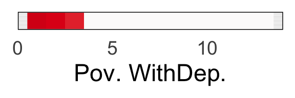<!-- -->

``` r
# get straightfoward of segment where 99% is over 0 or under
positive_counts <- colSums(R_P_derivative_matrix > 0, na.rm = TRUE)
negative_counts <- colSums(R_P_derivative_matrix < 0, na.rm = TRUE)
# find where each is 99% or greater
positive_countsSig=positive_counts>9900
negative_countsSig=negative_counts>9900
# make dataframe: 50th percentile of derivatives accompanied by posSig and NegSig vector
data <- apply(R_P_derivative_matrix, 2, function(x) quantile(x, probs = 0.5))
dervPlotDf<-data.frame(data,positive_countsSig,negative_countsSig)
# if either is sig at 99% plot
dervPlotDf$sig_derivMask=dervPlotDf[,2]+dervPlotDf[,3]>0
# use it to mask calculated derivs
dervPlotDf$sig_deriv=0
dervPlotDf$sig_deriv[dervPlotDf$sig_derivMask]=dervPlotDf$data[dervPlotDf$sig_derivMask]
dervPlotDf$seq=1:(dim(dervPlotDf)[1])
ggplot(data=dervPlotDf) + geom_raster(aes(x = seq, y = .5, fill = sig_deriv))+
    theme(panel.spacing = unit(-.01,"cm")) +
    scale_fill_gradientn(colors = my_palette(100),limits = c(min(-.1),max(0.1)))+theme_minimal(base_size = 35)+
    xlim(c(0,MaxP))+xlab('Parental WithDep: NonPov. ')+
    guides(fill=FALSE)+
    theme(axis.title.y = element_blank(),axis.text.y=element_blank())+theme(panel.border = element_rect(color = "black", fill = NA, size = 1))+
    scale_x_continuous(limits = c(0,MaxP),expand = expansion(mult = c(0, 0)))
```

    ## Scale for x is already present.
    ## Adding another scale for x, which will replace the existing scale.

    ## Warning: Removed 5 rows containing missing values (`geom_raster()`).

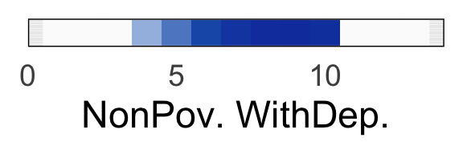<!-- -->

``` r
# end subscale 6
```

``` r
# now do rule breaking as 8th subscale: corresponds to F_rulFit,M_rulFit,P_rulFit,R_rulFit
# isolate Female, Male, Poor, Rich
# spans 0:maximum value of symptoms
start=end+1
end=end+(rulMaxVal+1)
F_PFits=Fits[,start:end]

# calculate some background info for plots
MaxP_F=find_furthest_nonzero(F_PFits)

# isolate male fits
start=end+1
end=end+(rulMaxVal+1)
M_PFits=Fits[start:end]

# calculate some background info for plots
MaxP_M=find_furthest_nonzero(M_PFits)
# use lowest common value for plots
MaxP <- min(MaxP_M, MaxP_F)

# get median value girl
F_PFits_Coverage=F_PFits[,seq(1:MaxP)]
col_means=colMeans(F_PFits_Coverage)
FP_medians <- apply(F_PFits_Coverage, 2, median)

# get median value boy
M_PFits_Coverage=M_PFits[,seq(1:MaxP)]
col_means=colMeans(M_PFits_Coverage)
MP_medians <- apply(M_PFits_Coverage, 2, median)
MP_medians=MP_medians[1:MaxP]

# merge data
data <- data.frame(
  x = 0:(MaxP-1),
  y_girls = FP_medians,
  y_boys = MP_medians
)

# Create the line plot for p
ggplot(data, aes(x = x, y = y_boys)) +
  geom_line(aes(), color = "#fbad24", size = 3) +
  geom_line(aes(y=y_girls),color = "#923eb5", size = 3) +
  labs(x = 'Parental Rule Breaking', y = y_title) +
  theme_minimal(base_size = 35) +
  theme(plot.title = element_text(hjust = 0.5),
        legend.position = "top",
        legend.title = element_blank(),
        legend.background = element_rect(fill = "white"))+ylim(-1.5,1.5)+
        theme(panel.border = element_rect(color = "black", fill = NA, size = 1))+
        scale_x_continuous(limits = c(0,MaxP-1),expand = expansion(mult = c(0, 0)))
```

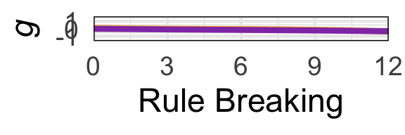<!-- -->

``` r
# and derivatives
# Create an empty matrix to store the derivatives
F_P_derivative_matrix <- matrix(0, nrow = nrow(F_PFits), ncol = ncol(F_PFits) - 1)

# Calculate the derivative for each column
for (i in 1:(ncol(F_PFits) - 1)) {
  # Calculate the differences in x (assuming a constant difference)
  dx <- 1
  # Calculate the differences in y (predicted values)
  dy <- F_PFits[, i + 1] - F_PFits[, i]
  # Calculate the derivatives (slopes)
  derivatives <- dy / dx
  # Store the derivatives in the derivative matrix
  F_P_derivative_matrix[, i] <- derivatives
}

# Create an empty matrix to store the derivatives
M_P_derivative_matrix <- matrix(0, nrow = nrow(M_PFits), ncol = ncol(M_PFits) - 1)

# Calculate the derivative for each column
for (i in 1:(ncol(F_PFits) - 1)) {
  # Calculate the differences in x (assuming a constant difference)
  dx <- 1
  # Calculate the differences in y (predicted values)
  dy <- M_PFits[, i + 1] - M_PFits[, i]
  # Calculate the derivatives (slopes)
  derivatives <- dy / dx
  # Store the derivatives in the derivative matrix
  M_P_derivative_matrix[, i] <- derivatives
}

# calc sig dervs
# get straightfoward of segment where 99% is over 0 or under
positive_counts <- colSums(F_P_derivative_matrix > 0, na.rm = TRUE)
negative_counts <- colSums(F_P_derivative_matrix < 0, na.rm = TRUE)
# find where each is 99% or greater
positive_countsSig=positive_counts>9900
negative_countsSig=negative_counts>9900
# make dataframe: 50th percentile of derivatives accompanied by posSig and NegSig vector
data <- apply(F_P_derivative_matrix, 2, function(x) quantile(x, probs = 0.5))
dervPlotDf<-data.frame(data,positive_countsSig,negative_countsSig)
# if either is sig at 99% plot
dervPlotDf$sig_derivMask=dervPlotDf[,2]+dervPlotDf[,3]>0
# use it to mask calculated derivs
dervPlotDf$sig_deriv=0
dervPlotDf$sig_deriv[dervPlotDf$sig_derivMask]=dervPlotDf$data[dervPlotDf$sig_derivMask]
dervPlotDf$seq=1:(dim(dervPlotDf)[1])
ggplot(data=dervPlotDf) + geom_raster(aes(x = seq, y = .5, fill = sig_deriv))+
    theme(panel.spacing = unit(-.01,"cm")) +
    scale_fill_gradientn(colors = my_palette(100),limits = c(min(-.1),max(0.1)))+theme_minimal(base_size = 35)+
    xlim(c(0,MaxP))+xlab('Parental Rules: Girl')+
    guides(fill=FALSE)+
    theme(axis.title.y = element_blank(),axis.text.y=element_blank())+theme(panel.border = element_rect(color = "black", fill = NA, size = 1))+
    scale_x_continuous(limits = c(0,MaxP),expand = expansion(mult = c(0, 0)))
```

    ## Scale for x is already present.
    ## Adding another scale for x, which will replace the existing scale.

    ## Warning: Removed 9 rows containing missing values (`geom_raster()`).

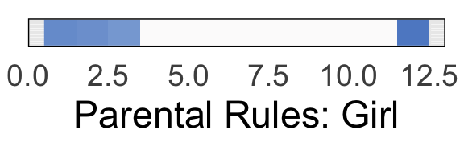<!-- -->

``` r
# get straightfoward of segment where 99% is over 0 or under
positive_counts <- colSums(M_P_derivative_matrix > 0, na.rm = TRUE)
negative_counts <- colSums(M_P_derivative_matrix < 0, na.rm = TRUE)
# find where each is 99% or greater
positive_countsSig=positive_counts>9900
negative_countsSig=negative_counts>9900
# make dataframe: 50th percentile of derivatives accompanied by posSig and NegSig vector
data <- apply(M_P_derivative_matrix, 2, function(x) quantile(x, probs = 0.5))
dervPlotDf<-data.frame(data,positive_countsSig,negative_countsSig)
# if either is sig at 99% plot
dervPlotDf$sig_derivMask=dervPlotDf[,2]+dervPlotDf[,3]>0
# use it to mask calculated derivs
dervPlotDf$sig_deriv=0
dervPlotDf$sig_deriv[dervPlotDf$sig_derivMask]=dervPlotDf$data[dervPlotDf$sig_derivMask]
dervPlotDf$seq=1:(dim(dervPlotDf)[1])
ggplot(data=dervPlotDf) + geom_raster(aes(x = seq, y = .5, fill = sig_deriv))+
    theme(panel.spacing = unit(-.01,"cm")) +
    scale_fill_gradientn(colors = my_palette(100),limits = c(min(-.1),max(0.1)))+theme_minimal(base_size = 35)+
    xlim(c(0,MaxP))+xlab('Parental Rules: Boy')+
    guides(fill=FALSE)+
    theme(axis.title.y = element_blank(),axis.text.y=element_blank())+theme(panel.border = element_rect(color = "black", fill = NA, size = 1))+
    scale_x_continuous(limits = c(0,MaxP),expand = expansion(mult = c(0, 0)))
```

    ## Scale for x is already present.
    ## Adding another scale for x, which will replace the existing scale.

    ## Warning: Removed 9 rows containing missing values (`geom_raster()`).

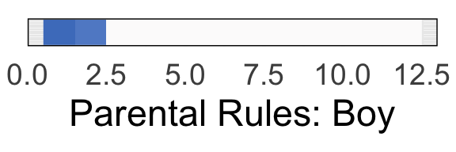<!-- -->

``` r
# poverty analysis: start with below poverty line group
start=end+1
end=end+(rulMaxVal+1)
povBoots=Fits[,start:end]
# and nonpov
start=end+1
end=end+(rulMaxVal+1)
nonpovBoots=Fits[,start:end]

# calculate some background info for plots
MaxP_P=find_furthest_nonzero(povBoots)
MaxP_R=find_furthest_nonzero(nonpovBoots)

# use lowest common value for plots
MaxP <- min(MaxP_P, MaxP_R)

# get median value pov
P_PFits_Coverage=povBoots[,seq(1:MaxP)]
col_means=colMeans(P_PFits_Coverage)
PP_medians <- apply(P_PFits_Coverage, 2, median)

# get median value nonpov
R_PFits_Coverage=nonpovBoots[,seq(1:MaxP)]
col_means=colMeans(R_PFits_Coverage)
RP_medians <- apply(M_PFits_Coverage, 2, median)
RP_medians=MP_medians[1:MaxP]

# merge data
data <- data.frame(
  x = 0:(MaxP-1),
  y_pov = PP_medians,
  y_nonpov = RP_medians
)

# Create the line plot for p
ggplot(data, aes(x = x, y = y_pov)) +
  geom_line(aes(), color = "#FF5003", size = 3) +
  geom_line(aes(y=y_nonpov),color = "#003F7D", size = 3) +
  labs(x = 'Parental Rules', y = y_title) +
  theme_minimal(base_size = 35) +
  theme(plot.title = element_text(hjust = 0.5),
        legend.position = "top",
        legend.title = element_blank(),
        legend.background = element_rect(fill = "white"))+ylim(-1.5,1.5)+
        theme(panel.border = element_rect(color = "black", fill = NA, size = 1))+
        scale_x_continuous(limits = c(0,MaxP-1),expand = expansion(mult = c(0, 0)))
```

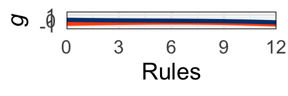<!-- -->

``` r
# and derivatives
# Create an empty matrix to store the derivatives
P_P_derivative_matrix <- matrix(0, nrow = nrow(povBoots), ncol = ncol(povBoots) - 1)

# Calculate the derivative for each column
for (i in 1:(ncol(povBoots) - 1)) {
  # Calculate the differences in x (assuming a constant difference)
  dx <- 1
  # Calculate the differences in y (predicted values)
  dy <- povBoots[, i + 1] - povBoots[, i]
  # Calculate the derivatives (slopes)
  derivatives <- dy / dx
  # Store the derivatives in the derivative matrix
  P_P_derivative_matrix[, i] <- derivatives
}

# Create an empty matrix to store the derivatives
R_P_derivative_matrix <- matrix(0, nrow = nrow(nonpovBoots), ncol = ncol(nonpovBoots) - 1)

# Calculate the derivative for each column
for (i in 1:(ncol(nonpovBoots) - 1)) {
  # Calculate the differences in x (assuming a constant difference)
  dx <- 1
  # Calculate the differences in y (predicted values)
  dy <- nonpovBoots[, i + 1] - nonpovBoots[, i]
  # Calculate the derivatives (slopes)
  derivatives <- dy / dx
  # Store the derivatives in the derivative matrix
  R_P_derivative_matrix[, i] <- derivatives
}

# calc sig dervs
# get straightfoward of segment where 99% is over 0 or under
positive_counts <- colSums(P_P_derivative_matrix > 0, na.rm = TRUE)
negative_counts <- colSums(P_P_derivative_matrix < 0, na.rm = TRUE)
# find where each is 99% or greater
positive_countsSig=positive_counts>9900
negative_countsSig=negative_counts>9900
# make dataframe: 50th percentile of derivatives accompanied by posSig and NegSig vector
data <- apply(P_P_derivative_matrix, 2, function(x) quantile(x, probs = 0.5)) ###  ???
dervPlotDf<-data.frame(data,positive_countsSig,negative_countsSig)
# if either is sig at 99% plot
dervPlotDf$sig_derivMask=dervPlotDf[,2]+dervPlotDf[,3]>0
# use it to mask calculated derivs
dervPlotDf$sig_deriv=0
dervPlotDf$sig_deriv[dervPlotDf$sig_derivMask]=dervPlotDf$data[dervPlotDf$sig_derivMask]
dervPlotDf$seq=1:(dim(dervPlotDf)[1])
ggplot(data=dervPlotDf) + geom_raster(aes(x = seq, y = .5, fill = sig_deriv))+
    theme(panel.spacing = unit(-.01,"cm")) +
    scale_fill_gradientn(colors = my_palette(100),limits = c(min(-.1),max(0.1)))+theme_minimal(base_size = 35)+
    xlim(c(0,MaxP))+xlab('Parental Rules: Pov.')+
    guides(fill=FALSE)+
    theme(axis.title.y = element_blank(),axis.text.y=element_blank())+theme(panel.border = element_rect(color = "black", fill = NA, size = 1))+
    scale_x_continuous(limits = c(0,MaxP),expand = expansion(mult = c(0, 0)))
```

    ## Scale for x is already present.
    ## Adding another scale for x, which will replace the existing scale.

    ## Warning: Removed 9 rows containing missing values (`geom_raster()`).

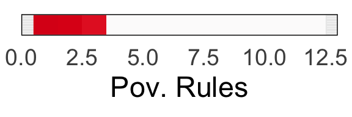<!-- -->

``` r
# get straightfoward of segment where 99% is over 0 or under
positive_counts <- colSums(R_P_derivative_matrix > 0, na.rm = TRUE)
negative_counts <- colSums(R_P_derivative_matrix < 0, na.rm = TRUE)
# find where each is 99% or greater
positive_countsSig=positive_counts>9900
negative_countsSig=negative_counts>9900
# make dataframe: 50th percentile of derivatives accompanied by posSig and NegSig vector
data <- apply(R_P_derivative_matrix, 2, function(x) quantile(x, probs = 0.5))
dervPlotDf<-data.frame(data,positive_countsSig,negative_countsSig)
# if either is sig at 99% plot
dervPlotDf$sig_derivMask=dervPlotDf[,2]+dervPlotDf[,3]>0
# use it to mask calculated derivs
dervPlotDf$sig_deriv=0
dervPlotDf$sig_deriv[dervPlotDf$sig_derivMask]=dervPlotDf$data[dervPlotDf$sig_derivMask]
dervPlotDf$seq=1:(dim(dervPlotDf)[1])
ggplot(data=dervPlotDf) + geom_raster(aes(x = seq, y = .5, fill = sig_deriv))+
    theme(panel.spacing = unit(-.01,"cm")) +
    scale_fill_gradientn(colors = my_palette(100),limits = c(min(-.1),max(0.1)))+theme_minimal(base_size = 35)+
    xlim(c(0,MaxP))+xlab('Parental Rules: NonPov.')+
    guides(fill=FALSE)+
    theme(axis.title.y = element_blank(),axis.text.y=element_blank())+theme(panel.border = element_rect(color = "black", fill = NA, size = 1))+
    scale_x_continuous(limits = c(0,MaxP),expand = expansion(mult = c(0, 0)))
```

    ## Scale for x is already present.
    ## Adding another scale for x, which will replace the existing scale.

    ## Warning: Removed 9 rows containing missing values (`geom_raster()`).

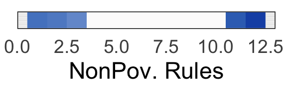<!-- -->

``` r
# end subscale 8
```

``` r
# now do attention as 9th subscale: corresponds to F_attFit,M_attFit,P_attFit,R_attFit
# isolate Female, Male, Poor, Rich
# spans 0:maximum value of symptoms
start=end+1
end=end+(attMaxVal+1)
F_PFits=Fits[,start:end]

# calculate some background info for plots
MaxP_F=find_furthest_nonzero(F_PFits)

# isolate male fits
start=end+1
end=end+(attMaxVal+1)
M_PFits=Fits[start:end]

# calculate some background info for plots
MaxP_M=find_furthest_nonzero(M_PFits)
# use lowest common value for plots
MaxP <- min(MaxP_M, MaxP_F)

# get median value girl
F_PFits_Coverage=F_PFits[,seq(1:MaxP)]
col_means=colMeans(F_PFits_Coverage)
FP_medians <- apply(F_PFits_Coverage, 2, median)

# get median value boy
M_PFits_Coverage=M_PFits[,seq(1:MaxP)]
col_means=colMeans(M_PFits_Coverage)
MP_medians <- apply(M_PFits_Coverage, 2, median)
MP_medians=MP_medians[1:MaxP]

# merge data
data <- data.frame(
  x = 0:(MaxP-1),
  y_girls = FP_medians,
  y_boys = MP_medians
)

# Create the line plot for p
ggplot(data, aes(x = x, y = y_boys)) +
  geom_line(aes(), color = "#fbad24", size = 3) +
  geom_line(aes(y=y_girls),color = "#923eb5", size = 3) +
  labs(x = 'Parental Attention', y = y_title) +
  theme_minimal(base_size = 35) +
  theme(plot.title = element_text(hjust = 0.5),
        legend.position = "top",
        legend.title = element_blank(),
        legend.background = element_rect(fill = "white"))+ylim(-1.5,1.5)+
        theme(panel.border = element_rect(color = "black", fill = NA, size = 1))+
        scale_x_continuous(limits = c(0,MaxP-1),expand = expansion(mult = c(0, 0)))
```

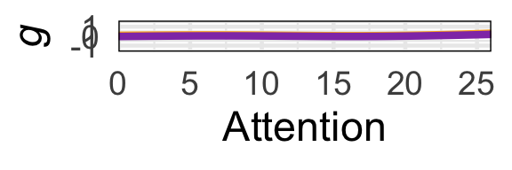<!-- -->

``` r
# and derivatives
# Create an empty matrix to store the derivatives
F_P_derivative_matrix <- matrix(0, nrow = nrow(F_PFits), ncol = ncol(F_PFits) - 1)

# Calculate the derivative for each column
for (i in 1:(ncol(F_PFits) - 1)) {
  # Calculate the differences in x (assuming a constant difference)
  dx <- 1
  # Calculate the differences in y (predicted values)
  dy <- F_PFits[, i + 1] - F_PFits[, i]
  # Calculate the derivatives (slopes)
  derivatives <- dy / dx
  # Store the derivatives in the derivative matrix
  F_P_derivative_matrix[, i] <- derivatives
}

# Create an empty matrix to store the derivatives
M_P_derivative_matrix <- matrix(0, nrow = nrow(M_PFits), ncol = ncol(M_PFits) - 1)

# Calculate the derivative for each column
for (i in 1:(ncol(F_PFits) - 1)) {
  # Calculate the differences in x (assuming a constant difference)
  dx <- 1
  # Calculate the differences in y (predicted values)
  dy <- M_PFits[, i + 1] - M_PFits[, i]
  # Calculate the derivatives (slopes)
  derivatives <- dy / dx
  # Store the derivatives in the derivative matrix
  M_P_derivative_matrix[, i] <- derivatives
}

# calc sig dervs
# get straightfoward of segment where 99% is over 0 or under
positive_counts <- colSums(F_P_derivative_matrix > 0, na.rm = TRUE)
negative_counts <- colSums(F_P_derivative_matrix < 0, na.rm = TRUE)
# find where each is 99% or greater
positive_countsSig=positive_counts>9900
negative_countsSig=negative_counts>9900
# make dataframe: 50th percentile of derivatives accompanied by posSig and NegSig vector
data <- apply(F_P_derivative_matrix, 2, function(x) quantile(x, probs = 0.5))
dervPlotDf<-data.frame(data,positive_countsSig,negative_countsSig)
# if either is sig at 99% plot
dervPlotDf$sig_derivMask=dervPlotDf[,2]+dervPlotDf[,3]>0
# use it to mask calculated derivs
dervPlotDf$sig_deriv=0
dervPlotDf$sig_deriv[dervPlotDf$sig_derivMask]=dervPlotDf$data[dervPlotDf$sig_derivMask]
dervPlotDf$seq=1:(dim(dervPlotDf)[1])
ggplot(data=dervPlotDf) + geom_raster(aes(x = seq, y = .5, fill = sig_deriv))+
    theme(panel.spacing = unit(-.01,"cm")) +
    scale_fill_gradientn(colors = my_palette(100),limits = c(min(-.1),max(0.1)))+theme_minimal(base_size = 35)+
    xlim(c(0,MaxP))+xlab('Parental Attn: Girl')+
    guides(fill=FALSE)+
    theme(axis.title.y = element_blank(),axis.text.y=element_blank())+theme(panel.border = element_rect(color = "black", fill = NA, size = 1))+
    scale_x_continuous(limits = c(0,MaxP),expand = expansion(mult = c(0, 0)))
```

    ## Scale for x is already present.
    ## Adding another scale for x, which will replace the existing scale.

    ## Warning: Removed 5 rows containing missing values (`geom_raster()`).

<!-- -->

``` r
# get straightfoward of segment where 99% is over 0 or under
positive_counts <- colSums(M_P_derivative_matrix > 0, na.rm = TRUE)
negative_counts <- colSums(M_P_derivative_matrix < 0, na.rm = TRUE)
# find where each is 99% or greater
positive_countsSig=positive_counts>9900
negative_countsSig=negative_counts>9900
# make dataframe: 50th percentile of derivatives accompanied by posSig and NegSig vector
data <- apply(M_P_derivative_matrix, 2, function(x) quantile(x, probs = 0.5))
dervPlotDf<-data.frame(data,positive_countsSig,negative_countsSig)
# if either is sig at 99% plot
dervPlotDf$sig_derivMask=dervPlotDf[,2]+dervPlotDf[,3]>0
# use it to mask calculated derivs
dervPlotDf$sig_deriv=0
dervPlotDf$sig_deriv[dervPlotDf$sig_derivMask]=dervPlotDf$data[dervPlotDf$sig_derivMask]
dervPlotDf$seq=1:(dim(dervPlotDf)[1])
ggplot(data=dervPlotDf) + geom_raster(aes(x = seq, y = .5, fill = sig_deriv))+
    theme(panel.spacing = unit(-.01,"cm")) +
    scale_fill_gradientn(colors = my_palette(100),limits = c(min(-.1),max(0.1)))+theme_minimal(base_size = 35)+
    xlim(c(0,MaxP))+xlab('Parental Attn: Boy')+
    guides(fill=FALSE)+
    theme(axis.title.y = element_blank(),axis.text.y=element_blank())+theme(panel.border = element_rect(color = "black", fill = NA, size = 1))+
    scale_x_continuous(limits = c(0,MaxP),expand = expansion(mult = c(0, 0)))
```

    ## Scale for x is already present.
    ## Adding another scale for x, which will replace the existing scale.

    ## Warning: Removed 5 rows containing missing values (`geom_raster()`).

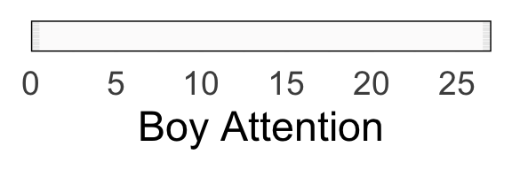<!-- -->

``` r
# poverty analysis: start with below poverty line group
start=end+1
end=end+(attMaxVal+1)
povBoots=Fits[,start:end]
# and nonpov
start=end+1
end=end+(attMaxVal+1)
nonpovBoots=Fits[,start:end]

# calculate some background info for plots
MaxP_P=find_furthest_nonzero(povBoots)
MaxP_R=find_furthest_nonzero(nonpovBoots)

# use lowest common value for plots
MaxP <- min(MaxP_P, MaxP_R)

# get median value pov
P_PFits_Coverage=povBoots[,seq(1:MaxP)]
col_means=colMeans(P_PFits_Coverage)
PP_medians <- apply(P_PFits_Coverage, 2, median)

# get median value nonpov
R_PFits_Coverage=nonpovBoots[,seq(1:MaxP)]
col_means=colMeans(R_PFits_Coverage)
RP_medians <- apply(M_PFits_Coverage, 2, median)
RP_medians=MP_medians[1:MaxP]

# merge data
data <- data.frame(
  x = 0:(MaxP-1),
  y_pov = PP_medians,
  y_nonpov = RP_medians
)

# Create the line plot for p
ggplot(data, aes(x = x, y = y_pov)) +
  geom_line(aes(), color = "#FF5003", size = 3) +
  geom_line(aes(y=y_nonpov),color = "#003F7D", size = 3) +
  labs(x = 'Parental Attention', y = y_title) +
  theme_minimal(base_size = 35) +
  theme(plot.title = element_text(hjust = 0.5),
        legend.position = "top",
        legend.title = element_blank(),
        legend.background = element_rect(fill = "white"))+ylim(-1.5,1.5)+
        theme(panel.border = element_rect(color = "black", fill = NA, size = 1))+
        scale_x_continuous(limits = c(0,MaxP-1),expand = expansion(mult = c(0, 0)))
```

<!-- -->

``` r
# and derivatives
# Create an empty matrix to store the derivatives
P_P_derivative_matrix <- matrix(0, nrow = nrow(povBoots), ncol = ncol(povBoots) - 1)

# Calculate the derivative for each column
for (i in 1:(ncol(povBoots) - 1)) {
  # Calculate the differences in x (assuming a constant difference)
  dx <- 1
  # Calculate the differences in y (predicted values)
  dy <- povBoots[, i + 1] - povBoots[, i]
  # Calculate the derivatives (slopes)
  derivatives <- dy / dx
  # Store the derivatives in the derivative matrix
  P_P_derivative_matrix[, i] <- derivatives
}

# Create an empty matrix to store the derivatives
R_P_derivative_matrix <- matrix(0, nrow = nrow(nonpovBoots), ncol = ncol(nonpovBoots) - 1)

# Calculate the derivative for each column
for (i in 1:(ncol(nonpovBoots) - 1)) {
  # Calculate the differences in x (assuming a constant difference)
  dx <- 1
  # Calculate the differences in y (predicted values)
  dy <- nonpovBoots[, i + 1] - nonpovBoots[, i]
  # Calculate the derivatives (slopes)
  derivatives <- dy / dx
  # Store the derivatives in the derivative matrix
  R_P_derivative_matrix[, i] <- derivatives
}

# calc sig dervs
# get straightfoward of segment where 99% is over 0 or under
positive_counts <- colSums(P_P_derivative_matrix > 0, na.rm = TRUE)
negative_counts <- colSums(P_P_derivative_matrix < 0, na.rm = TRUE)
# find where each is 99% or greater
positive_countsSig=positive_counts>9900
negative_countsSig=negative_counts>9900
# make dataframe: 50th percentile of derivatives accompanied by posSig and NegSig vector
data <- apply(P_P_derivative_matrix, 2, function(x) quantile(x, probs = 0.5)) ###  ???
dervPlotDf<-data.frame(data,positive_countsSig,negative_countsSig)
# if either is sig at 99% plot
dervPlotDf$sig_derivMask=dervPlotDf[,2]+dervPlotDf[,3]>0
# use it to mask calculated derivs
dervPlotDf$sig_deriv=0
dervPlotDf$sig_deriv[dervPlotDf$sig_derivMask]=dervPlotDf$data[dervPlotDf$sig_derivMask]
dervPlotDf$seq=1:(dim(dervPlotDf)[1])
ggplot(data=dervPlotDf) + geom_raster(aes(x = seq, y = .5, fill = sig_deriv))+
    theme(panel.spacing = unit(-.01,"cm")) +
    scale_fill_gradientn(colors = my_palette(100),limits = c(min(-.2),max(0.2)))+theme_minimal(base_size = 35)+
    xlim(c(0,MaxP))+xlab('Parental Attn: Pov.**')+
    guides(fill=FALSE)+
    theme(axis.title.y = element_blank(),axis.text.y=element_blank())+theme(panel.border = element_rect(color = "black", fill = NA, size = 1))+
    scale_x_continuous(limits = c(0,MaxP),expand = expansion(mult = c(0, 0)))
```

    ## Scale for x is already present.
    ## Adding another scale for x, which will replace the existing scale.

    ## Warning: Removed 5 rows containing missing values (`geom_raster()`).

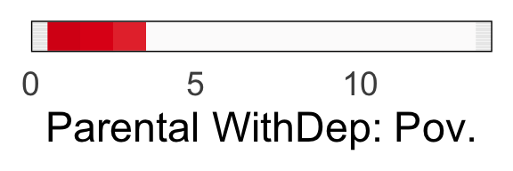<!-- -->

``` r
# get straightfoward of segment where 99% is over 0 or under
positive_counts <- colSums(R_P_derivative_matrix > 0, na.rm = TRUE)
negative_counts <- colSums(R_P_derivative_matrix < 0, na.rm = TRUE)
# find where each is 99% or greater
positive_countsSig=positive_counts>9900
negative_countsSig=negative_counts>9900
# make dataframe: 50th percentile of derivatives accompanied by posSig and NegSig vector
data <- apply(R_P_derivative_matrix, 2, function(x) quantile(x, probs = 0.5))
dervPlotDf<-data.frame(data,positive_countsSig,negative_countsSig)
# if either is sig at 99% plot
dervPlotDf$sig_derivMask=dervPlotDf[,2]+dervPlotDf[,3]>0
# use it to mask calculated derivs
dervPlotDf$sig_deriv=0
dervPlotDf$sig_deriv[dervPlotDf$sig_derivMask]=dervPlotDf$data[dervPlotDf$sig_derivMask]
dervPlotDf$seq=1:(dim(dervPlotDf)[1])
ggplot(data=dervPlotDf) + geom_raster(aes(x = seq, y = .5, fill = sig_deriv))+
    theme(panel.spacing = unit(-.01,"cm")) +
    scale_fill_gradientn(colors = my_palette(100),limits = c(min(-.1),max(0.1)))+theme_minimal(base_size = 35)+
    xlim(c(0,MaxP))+xlab('Parental Attn: NonPov.')+
    guides(fill=FALSE)+
    theme(axis.title.y = element_blank(),axis.text.y=element_blank())+theme(panel.border = element_rect(color = "black", fill = NA, size = 1))+
    scale_x_continuous(limits = c(0,MaxP),expand = expansion(mult = c(0, 0)))
```

    ## Scale for x is already present.
    ## Adding another scale for x, which will replace the existing scale.

    ## Warning: Removed 5 rows containing missing values (`geom_raster()`).

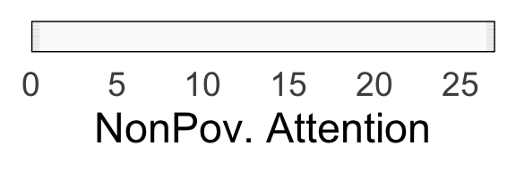<!-- -->

``` r
# end subscale 9
```

``` r
# now do aggression as 10th subscale: corresponds to F_aggFit,M_aggFit,P_aggFit,R_aggFit
# isolate Female, Male, Poor, Rich
# spans 0:maximum value of symptoms
start=end+1
end=end+(aggMaxVal+1)
F_PFits=Fits[,start:end]

# calculate some background info for plots
MaxP_F=find_furthest_nonzero(F_PFits)

# isolate male fits
start=end+1
end=end+(aggMaxVal+1)
M_PFits=Fits[start:end]

# calculate some background info for plots
MaxP_M=find_furthest_nonzero(M_PFits)
# use lowest common value for plots
MaxP <- min(MaxP_M, MaxP_F)

# get median value girl
F_PFits_Coverage=F_PFits[,seq(1:MaxP)]
col_means=colMeans(F_PFits_Coverage)
FP_medians <- apply(F_PFits_Coverage, 2, median)

# get median value boy
M_PFits_Coverage=M_PFits[,seq(1:MaxP)]
col_means=colMeans(M_PFits_Coverage)
MP_medians <- apply(M_PFits_Coverage, 2, median)
MP_medians=MP_medians[1:MaxP]

# merge data
data <- data.frame(
  x = 0:(MaxP-1),
  y_girls = FP_medians,
  y_boys = MP_medians
)

# Create the line plot for p
ggplot(data, aes(x = x, y = y_boys)) +
  geom_line(aes(), color = "#fbad24", size = 3) +
  geom_line(aes(y=y_girls),color = "#923eb5", size = 3) +
  labs(x = 'Parental Aggression', y = y_title) +
  theme_minimal(base_size = 35) +
  theme(plot.title = element_text(hjust = 0.5),
        legend.position = "top",
        legend.title = element_blank(),
        legend.background = element_rect(fill = "white"))+ylim(-1.5,1.5)+
        theme(panel.border = element_rect(color = "black", fill = NA, size = 1))+
        scale_x_continuous(limits = c(0,MaxP-1),expand = expansion(mult = c(0, 0)))
```

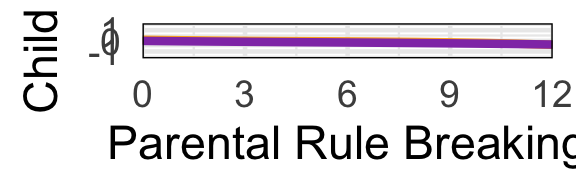<!-- -->

``` r
# and derivatives
# Create an empty matrix to store the derivatives
F_P_derivative_matrix <- matrix(0, nrow = nrow(F_PFits), ncol = ncol(F_PFits) - 1)

# Calculate the derivative for each column
for (i in 1:(ncol(F_PFits) - 1)) {
  # Calculate the differences in x (assuming a constant difference)
  dx <- 1
  # Calculate the differences in y (predicted values)
  dy <- F_PFits[, i + 1] - F_PFits[, i]
  # Calculate the derivatives (slopes)
  derivatives <- dy / dx
  # Store the derivatives in the derivative matrix
  F_P_derivative_matrix[, i] <- derivatives
}

# Create an empty matrix to store the derivatives
M_P_derivative_matrix <- matrix(0, nrow = nrow(M_PFits), ncol = ncol(M_PFits) - 1)

# Calculate the derivative for each column
for (i in 1:(ncol(F_PFits) - 1)) {
  # Calculate the differences in x (assuming a constant difference)
  dx <- 1
  # Calculate the differences in y (predicted values)
  dy <- M_PFits[, i + 1] - M_PFits[, i]
  # Calculate the derivatives (slopes)
  derivatives <- dy / dx
  # Store the derivatives in the derivative matrix
  M_P_derivative_matrix[, i] <- derivatives
}

# calc sig dervs
# get straightfoward of segment where 99% is over 0 or under
positive_counts <- colSums(F_P_derivative_matrix > 0, na.rm = TRUE)
negative_counts <- colSums(F_P_derivative_matrix < 0, na.rm = TRUE)
# find where each is 99% or greater
positive_countsSig=positive_counts>9900
negative_countsSig=negative_counts>9900
# make dataframe: 50th percentile of derivatives accompanied by posSig and NegSig vector
data <- apply(F_P_derivative_matrix, 2, function(x) quantile(x, probs = 0.5))
dervPlotDf<-data.frame(data,positive_countsSig,negative_countsSig)
# if either is sig at 99% plot
dervPlotDf$sig_derivMask=dervPlotDf[,2]+dervPlotDf[,3]>0
# use it to mask calculated derivs
dervPlotDf$sig_deriv=0
dervPlotDf$sig_deriv[dervPlotDf$sig_derivMask]=dervPlotDf$data[dervPlotDf$sig_derivMask]
dervPlotDf$seq=1:(dim(dervPlotDf)[1])
ggplot(data=dervPlotDf) + geom_raster(aes(x = seq, y = .5, fill = sig_deriv))+
    theme(panel.spacing = unit(-.01,"cm")) +
    scale_fill_gradientn(colors = my_palette(100),limits = c(min(-.1),max(0.1)))+theme_minimal(base_size = 35)+
    xlim(c(0,MaxP))+xlab('Parental Aggr. Girl')+
    guides(fill=FALSE)+
    theme(axis.title.y = element_blank(),axis.text.y=element_blank())+theme(panel.border = element_rect(color = "black", fill = NA, size = 1))+
    scale_x_continuous(limits = c(0,MaxP),expand = expansion(mult = c(0, 0)))
```

    ## Scale for x is already present.
    ## Adding another scale for x, which will replace the existing scale.

    ## Warning: Removed 12 rows containing missing values (`geom_raster()`).

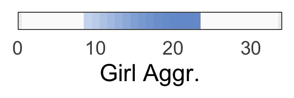<!-- -->

``` r
# get straightfoward of segment where 99% is over 0 or under
positive_counts <- colSums(M_P_derivative_matrix > 0, na.rm = TRUE)
negative_counts <- colSums(M_P_derivative_matrix < 0, na.rm = TRUE)
# find where each is 99% or greater
positive_countsSig=positive_counts>9900
negative_countsSig=negative_counts>9900
# make dataframe: 50th percentile of derivatives accompanied by posSig and NegSig vector
data <- apply(M_P_derivative_matrix, 2, function(x) quantile(x, probs = 0.5))
dervPlotDf<-data.frame(data,positive_countsSig,negative_countsSig)
# if either is sig at 99% plot
dervPlotDf$sig_derivMask=dervPlotDf[,2]+dervPlotDf[,3]>0
# use it to mask calculated derivs
dervPlotDf$sig_deriv=0
dervPlotDf$sig_deriv[dervPlotDf$sig_derivMask]=dervPlotDf$data[dervPlotDf$sig_derivMask]
dervPlotDf$seq=1:(dim(dervPlotDf)[1])
ggplot(data=dervPlotDf) + geom_raster(aes(x = seq, y = .5, fill = sig_deriv))+
    theme(panel.spacing = unit(-.01,"cm")) +
    scale_fill_gradientn(colors = my_palette(100),limits = c(min(-.1),max(0.1)))+theme_minimal(base_size = 35)+
    xlim(c(0,MaxP))+xlab('Parental Aggr: Boy')+
    guides(fill=FALSE)+
    theme(axis.title.y = element_blank(),axis.text.y=element_blank())+theme(panel.border = element_rect(color = "black", fill = NA, size = 1))+
    scale_x_continuous(limits = c(0,MaxP),expand = expansion(mult = c(0, 0)))
```

    ## Scale for x is already present.
    ## Adding another scale for x, which will replace the existing scale.

    ## Warning: Removed 12 rows containing missing values (`geom_raster()`).

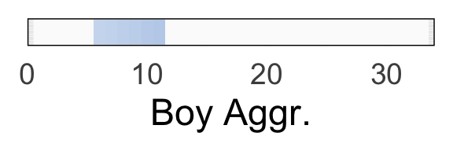<!-- -->

``` r
# poverty analysis: start with below poverty line group
start=end+1
end=end+(aggMaxVal+1)
povBoots=Fits[,start:end]
# and nonpov
start=end+1
end=end+(aggMaxVal+1)
nonpovBoots=Fits[,start:end]

# calculate some background info for plots
MaxP_P=find_furthest_nonzero(povBoots)
MaxP_R=find_furthest_nonzero(nonpovBoots)

# use lowest common value for plots
MaxP <- min(MaxP_P, MaxP_R)

# get median value pov
P_PFits_Coverage=povBoots[,seq(1:MaxP)]
col_means=colMeans(P_PFits_Coverage)
PP_medians <- apply(P_PFits_Coverage, 2, median)

# get median value nonpov
R_PFits_Coverage=nonpovBoots[,seq(1:MaxP)]
col_means=colMeans(R_PFits_Coverage)
RP_medians <- apply(M_PFits_Coverage, 2, median)
RP_medians=MP_medians[1:MaxP]

# merge data
data <- data.frame(
  x = 0:(MaxP-1),
  y_pov = PP_medians,
  y_nonpov = RP_medians
)

# Create the line plot for p
ggplot(data, aes(x = x, y = y_pov)) +
  geom_line(aes(), color = "#FF5003", size = 3) +
  geom_line(aes(y=y_nonpov),color = "#003F7D", size = 3) +
  labs(x = 'Parental Aggression', y = y_title) +
  theme_minimal(base_size = 35) +
  theme(plot.title = element_text(hjust = 0.5),
        legend.position = "top",
        legend.title = element_blank(),
        legend.background = element_rect(fill = "white"))+ylim(-1.5,1.5)+
        theme(panel.border = element_rect(color = "black", fill = NA, size = 1))+
        scale_x_continuous(limits = c(0,MaxP-1),expand = expansion(mult = c(0, 0)))
```

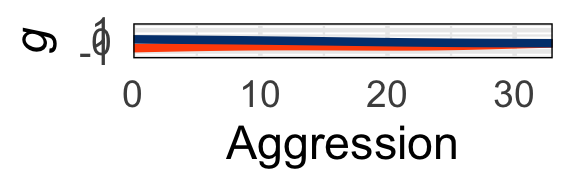<!-- -->

``` r
# and derivatives
# Create an empty matrix to store the derivatives
P_P_derivative_matrix <- matrix(0, nrow = nrow(povBoots), ncol = ncol(povBoots) - 1)

# Calculate the derivative for each column
for (i in 1:(ncol(povBoots) - 1)) {
  # Calculate the differences in x (assuming a constant difference)
  dx <- 1
  # Calculate the differences in y (predicted values)
  dy <- povBoots[, i + 1] - povBoots[, i]
  # Calculate the derivatives (slopes)
  derivatives <- dy / dx
  # Store the derivatives in the derivative matrix
  P_P_derivative_matrix[, i] <- derivatives
}

# Create an empty matrix to store the derivatives
R_P_derivative_matrix <- matrix(0, nrow = nrow(nonpovBoots), ncol = ncol(nonpovBoots) - 1)

# Calculate the derivative for each column
for (i in 1:(ncol(nonpovBoots) - 1)) {
  # Calculate the differences in x (assuming a constant difference)
  dx <- 1
  # Calculate the differences in y (predicted values)
  dy <- nonpovBoots[, i + 1] - nonpovBoots[, i]
  # Calculate the derivatives (slopes)
  derivatives <- dy / dx
  # Store the derivatives in the derivative matrix
  R_P_derivative_matrix[, i] <- derivatives
}

# calc sig dervs
# get straightfoward of segment where 99% is over 0 or under
positive_counts <- colSums(P_P_derivative_matrix > 0, na.rm = TRUE)
negative_counts <- colSums(P_P_derivative_matrix < 0, na.rm = TRUE)
# find where each is 99% or greater
positive_countsSig=positive_counts>9900
negative_countsSig=negative_counts>9900
# make dataframe: 50th percentile of derivatives accompanied by posSig and NegSig vector
data <- apply(P_P_derivative_matrix, 2, function(x) quantile(x, probs = 0.5)) ###  ???
dervPlotDf<-data.frame(data,positive_countsSig,negative_countsSig)
# if either is sig at 99% plot
dervPlotDf$sig_derivMask=dervPlotDf[,2]+dervPlotDf[,3]>0
# use it to mask calculated derivs
dervPlotDf$sig_deriv=0
dervPlotDf$sig_deriv[dervPlotDf$sig_derivMask]=dervPlotDf$data[dervPlotDf$sig_derivMask]
dervPlotDf$seq=1:(dim(dervPlotDf)[1])
ggplot(data=dervPlotDf) + geom_raster(aes(x = seq, y = .5, fill = sig_deriv))+
    theme(panel.spacing = unit(-.01,"cm")) +
    scale_fill_gradientn(colors = my_palette(100),limits = c(min(-.1),max(0.1)))+theme_minimal(base_size = 35)+
    xlim(c(0,MaxP))+xlab('Parental Aggr: Pov.')+
    guides(fill=FALSE)+
    theme(axis.title.y = element_blank(),axis.text.y=element_blank())+theme(panel.border = element_rect(color = "black", fill = NA, size = 1))+
    scale_x_continuous(limits = c(0,MaxP),expand = expansion(mult = c(0, 0)))
```

    ## Scale for x is already present.
    ## Adding another scale for x, which will replace the existing scale.

    ## Warning: Removed 12 rows containing missing values (`geom_raster()`).

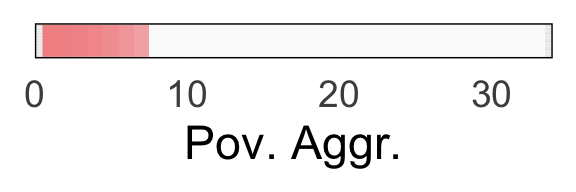<!-- -->

``` r
# get straightfoward of segment where 99% is over 0 or under
positive_counts <- colSums(R_P_derivative_matrix > 0, na.rm = TRUE)
negative_counts <- colSums(R_P_derivative_matrix < 0, na.rm = TRUE)
# find where each is 99% or greater
positive_countsSig=positive_counts>9900
negative_countsSig=negative_counts>9900
# make dataframe: 50th percentile of derivatives accompanied by posSig and NegSig vector
data <- apply(R_P_derivative_matrix, 2, function(x) quantile(x, probs = 0.5))
dervPlotDf<-data.frame(data,positive_countsSig,negative_countsSig)
# if either is sig at 99% plot
dervPlotDf$sig_derivMask=dervPlotDf[,2]+dervPlotDf[,3]>0
# use it to mask calculated derivs
dervPlotDf$sig_deriv=0
dervPlotDf$sig_deriv[dervPlotDf$sig_derivMask]=dervPlotDf$data[dervPlotDf$sig_derivMask]
dervPlotDf$seq=1:(dim(dervPlotDf)[1])
ggplot(data=dervPlotDf) + geom_raster(aes(x = seq, y = .5, fill = sig_deriv))+
    theme(panel.spacing = unit(-.01,"cm")) +
    scale_fill_gradientn(colors = my_palette(100),limits = c(min(-.1),max(0.1)))+theme_minimal(base_size = 35)+
    xlim(c(0,MaxP))+xlab('Parental Aggr: NonPov.')+
    guides(fill=FALSE)+
    theme(axis.title.y = element_blank(),axis.text.y=element_blank())+theme(panel.border = element_rect(color = "black", fill = NA, size = 1))+
    scale_x_continuous(limits = c(0,MaxP),expand = expansion(mult = c(0, 0)))
```

    ## Scale for x is already present.
    ## Adding another scale for x, which will replace the existing scale.

    ## Warning: Removed 12 rows containing missing values (`geom_raster()`).

<!-- -->

``` r
# end subscale 10
```
