SampleConstruction
================
Adam
2023-01-25

This .rmd links ndar downloads into a master dataset. Cross-sectional
and temporal precedence datasets are be exported from this file (no
matched imaging groups needed, pooled factor decomposition), while
predictive datasets are exported from SampleConstruction_Ridge.Rmd

``` r
#### load libraries
library(rapportools)
```

    ## 
    ## Attaching package: 'rapportools'

    ## The following objects are masked from 'package:stats':
    ## 
    ##     IQR, median, sd, var

    ## The following objects are masked from 'package:base':
    ## 
    ##     max, mean, min, range, sum

``` r
library(reshape2)
library(ggplot2)
```

``` r
###########∆∆∆∆∆∆∆∆∆∆∆∆∆∆∆∆∆∆∆∆∆∆∆##############
### This chunk processes mental health data ###
###########∆∆∆∆∆∆∆∆∆∆∆∆∆∆∆∆∆∆∆∆∆∆∆##############

### LOAD in cbcl data
cbcl=read.delim('~/Downloads/Package_1210940/abcd_cbcl01.txt')
cbcls=read.delim('~/Downloads/Package_1210940/abcd_cbcls01.txt')
# subset timepoints
cbclsBV=subset(cbcls,eventname=='baseline_year_1_arm_1')
cbcls2=subset(cbcls,eventname=='2_year_follow_up_y_arm_1')
# subset timepoints
cbclBV=subset(cbcl,eventname=='baseline_year_1_arm_1')
cbcl2=subset(cbcl,eventname=='2_year_follow_up_y_arm_1')
# merge with other cbcl
cbclsBV=merge(cbclsBV,cbclBV,by=c('subjectkey','eventname'))
cbcls2=merge(cbcls2,cbcl2,by=c('subjectkey','eventname'))

# initialize master df
masterdf<-merge(cbcls,cbcl,by=c('subjectkey','eventname','interview_age','src_subject_id','sex'))
# omit nans and empties for variables of interest (totprobs,int,ext)
masterdf=masterdf[!is.empty(masterdf$cbcl_scr_syn_totprob_r),]
masterdf=masterdf[!is.na(masterdf$cbcl_scr_syn_totprob_r),]
masterdf=masterdf[!is.empty(masterdf$cbcl_scr_syn_internal_r),]
masterdf=masterdf[!is.na(masterdf$cbcl_scr_syn_internal_r),]
masterdf=masterdf[!is.empty(masterdf$cbcl_scr_syn_external_r),]
masterdf=masterdf[!is.na(masterdf$cbcl_scr_syn_external_r),]
# calculate remaining subjs
cbclSubjs=length(unique(masterdf$subjectkey))
# initialize included subjects df
includedSubjects=data.frame(unique(masterdf$subjectkey))
colnames(includedSubjects)<-'subj'
includedSubjects$cbclInclude=1


# check for completeness at both timepoints- subset those timepoints
masterdf=masterdf[masterdf$eventname!='1_year_follow_up_y_arm_1',]
masterdf=masterdf[masterdf$eventname!='3_year_follow_up_y_arm_1',]

# get other vars of interest to check for complete cases
KidVarsOfInt=c('cbcl_scr_syn_totprob_r','cbcl_scr_syn_external_r','cbcl_scr_syn_internal_r')

# only use subjects with both timepoints as complete cases
subjs=unique(masterdf$subjectkey)
for (s in subjs){
  # if there are less than two complete cases of the variables of interest
  if (sum(complete.cases(masterdf[masterdf$subjectkey==s,c(KidVarsOfInt)]))<2){
    subjs=subjs[subjs!=s]
  }
}

# exclude participants without data at both timepoints
cbclSubjs=length(unique(masterdf$subjectkey))
masterdf=masterdf[masterdf$subjectkey %in% subjs,]

# included subjs df
includedSubjects$CBCLBoth=0
includedSubjects[includedSubjects$subj %in% unique(masterdf$subjectkey),]$CBCLBoth=1

cbclSubjsBoth=length(unique(masterdf$subjectkey))
print(paste0(cbclSubjs-cbclSubjsBoth,' lost due to single-timepoint CBCL completeness'))
```

    ## [1] "3764 lost due to single-timepoint CBCL completeness"

``` r
###########∆∆∆∆∆∆∆∆∆∆∆∆∆∆∆∆∆∆∆∆∆∆∆##############
### This  chunk  processes  scholastic  data ###
###########∆∆∆∆∆∆∆∆∆∆∆∆∆∆∆∆∆∆∆∆∆∆∆##############

### LOAD in grades, ∆∆∆ will need to correct for incongruency between tp1 measure (decent granularity) and tp2 measure (high granularity) ∆∆∆
gradesInfoBV=read.delim('~/Downloads/Package_1210940/dibf01.txt')
# extract baseline
gradesInfoBV=subset(gradesInfoBV,eventname=='baseline_year_1_arm_1')
gradesInfoBV$Grades<-as.numeric(gradesInfoBV$kbi_p_grades_in_school)
# convert ndar value to R
gradesInfoBV$Grades[gradesInfoBV$Grades==-1]=NA
# convert ndar colnames to other ndar colnames
# for tp2, the key is 1 = A's, 2 = B's, 3 = C's, 4 = D's, 5 = F's, -1 = NA
gradesInfoY2=read.delim('~/Downloads/Package_1210940/abcd_saag01.txt')
gradesInfoY2=subset(gradesInfoY2,eventname=='2_year_follow_up_y_arm_1')
gradesInfoY2$sag_grade_type<-as.numeric(gradesInfoY2$sag_grade_type)
# key: 1=100-97,2=96-93,3=92-90,4=89-87,5=86-83,6=82-80,7=79-77,8=76-73,9=72-70,10=69-67,11=66-65,12=0-65,-1=NA,777= no answer
gradesInfoY2$sag_grade_type[gradesInfoY2$sag_grade_type==-1]=NA
gradesInfoY2$sag_grade_type[gradesInfoY2$sag_grade_type==777]=NA
# now convert to be equivalent with timepoint 1 grades measure
ind12=gradesInfoY2$sag_grade_type==12
ind11=gradesInfoY2$sag_grade_type==11
ind10=gradesInfoY2$sag_grade_type==10
ind9=gradesInfoY2$sag_grade_type==9
ind8=gradesInfoY2$sag_grade_type==8
ind7=gradesInfoY2$sag_grade_type==7
ind6=gradesInfoY2$sag_grade_type==6
ind5=gradesInfoY2$sag_grade_type==5
ind4=gradesInfoY2$sag_grade_type==4
ind3=gradesInfoY2$sag_grade_type==3
ind2=gradesInfoY2$sag_grade_type==2
ind1=gradesInfoY2$sag_grade_type==1
#### Set indices to low-res versions
# < 65 becomes failing
gradesInfoY2$sag_grade_type[ind12]=5
# 66-69 = Ds
gradesInfoY2$sag_grade_type[ind11]=4
gradesInfoY2$sag_grade_type[ind10]=4
# 70-79 = Cs
gradesInfoY2$sag_grade_type[ind7]=3
gradesInfoY2$sag_grade_type[ind8]=3
gradesInfoY2$sag_grade_type[ind9]=3
# 80-89 = Bs
gradesInfoY2$sag_grade_type[ind4]=2
gradesInfoY2$sag_grade_type[ind5]=2
gradesInfoY2$sag_grade_type[ind6]=2
# 90+ = As
gradesInfoY2$sag_grade_type[ind1]=1
gradesInfoY2$sag_grade_type[ind2]=1
gradesInfoY2$sag_grade_type[ind3]=1
gradesInfoY2$Grades<-gradesInfoY2$sag_grade_type

###### ∆∆∆∆∆∆∆ create grades info from both of em
NeededColNames=c('subjectkey','eventname','Grades')
gradesInfo<-rbind(gradesInfoBV[,NeededColNames],gradesInfoY2[,NeededColNames])
gradesInfo$Grades<-as.ordered(gradesInfo$Grades)

# merge and count losses
masterdf<-merge(masterdf,gradesInfo,by=c('subjectkey','eventname'))

# subjects with this measure at both timepoints
# only use subjects with both timepoints as complete cases
subjs=unique(masterdf$subjectkey)
for (s in subjs){
  # if there are less than two complete cases of the variables of interest
  if (sum(complete.cases(masterdf[masterdf$subjectkey==s,'Grades']))<2){
    subjs=subjs[subjs!=s]
  }
}

# exclude participants without data at both timepoints
masterdf=masterdf[masterdf$subjectkey %in% subjs,]

# omit nans and empties for variables of interest (totprobs,int,ext)
masterdf=masterdf[!is.empty(masterdf$Grades),]
masterdf=masterdf[!is.na(masterdf$Grades),]
gradesSubjs=length(unique(masterdf$subjectkey))
# add to included subjs DF
includedSubjects$Grades=0
includedSubjects[includedSubjects$subj %in% unique(masterdf$subjectkey),]$Grades=1
# print data volume
print(gradesSubjs)
```

    ## [1] 7665

``` r
dif=cbclSubjsBoth-gradesSubjs
print(paste0(dif,' participants lost from grades merge'))
```

    ## [1] "398 participants lost from grades merge"

``` r
# included subjs df
includedSubjects$Grades=0
includedSubjects[includedSubjects$subj %in% unique(masterdf$subjectkey),]$Grades=1
```

``` r
###########∆∆∆∆∆∆∆∆∆∆∆∆∆∆∆∆∆∆∆∆∆∆∆##############
### This chunk processes adult mental health ###
###########∆∆∆∆∆∆∆∆∆∆∆∆∆∆∆∆∆∆∆∆∆∆∆##############

### LOAD in ASR data
asr=read.delim('~/Downloads/Package_1210940/pasr01.txt',na.strings=c("","NA"))
# merge
masterdf<-merge(masterdf,asr,by=c('subjectkey','eventname','interview_age','sex'))
# check for populated data at BOTH timepoints
ColsOfInt=asr[,c(11:141)]
ASRVarsOfInt=colnames(ColsOfInt)
# only use subjects with both timepoints as complete cases
subjs=unique(masterdf$subjectkey)
for (s in subjs){
  # if there are less than two complete cases of the variables of interest
  if (sum(complete.cases(masterdf[masterdf$subjectkey==s,c(ASRVarsOfInt)]))<2){
    subjs=subjs[subjs!=s]
  }
}

masterdf=masterdf[masterdf$subjectkey %in% subjs,]

# full losses counted after asr count chunk, but note one participant is probably lost here just from merge
asrSubjs=length(unique(masterdf$subjectkey))
dif=gradesSubjs-asrSubjs
print(paste0(dif,' participants lost from needing ASR at both timepoints'))
```

    ## [1] "1 participants lost from needing ASR at both timepoints"

``` r
# included subjs df
includedSubjects$ASR=0
includedSubjects[includedSubjects$subj %in% unique(masterdf$subjectkey),]$ASR=1
```

``` r
###########∆∆∆∆∆∆∆∆∆∆∆∆∆∆∆∆∆∆∆∆∆∆∆##############
### This   chunk   processes family ID   data ###
###########∆∆∆∆∆∆∆∆∆∆∆∆∆∆∆∆∆∆∆∆∆∆∆##############

# load in acs file for rel_family_ID
# get family ID from acs
acs=read.delim('~/Downloads/Package_1210940/acspsw03.txt')
acs$subjectkey<-acs$src_subject_id
acs=acs[,c('rel_family_id','subjectkey','eventname')]
# looks like all family IDs are missing from timepoint 1, so exclude for ease
acs=acs[acs$eventname=='baseline_year_1_arm_1',]
# and isolate family ID for ease
acs=data.frame(acs$subjectkey,acs$rel_family_id)
colnames(acs)=c('subjectkey','rel_family_id')
masterdf<-merge(masterdf,acs,by=c('subjectkey'))
# na omitted version
masterdf=masterdf[!is.na(masterdf$rel_family_id),] 
masterdf=masterdf[!is.empty(masterdf$rel_family_id),] 
acsSubjs=length(unique(masterdf$subjectkey))
# add to included subjs DF
includedSubjects$acs=0
includedSubjects[includedSubjects$subj %in% unique(masterdf$subjectkey),]$acs=1
# print data volume
print(acsSubjs)
```

    ## [1] 7663

``` r
dif=asrSubjs-acsSubjs
print(paste0(dif,' participants lost from ACS merge for family ID'))
```

    ## [1] "1 participants lost from ACS merge for family ID"

``` r
###########∆∆∆∆∆∆∆∆∆∆∆∆∆∆∆∆∆∆∆∆∆∆∆##############
### This  (short)  chunk formats   cbcl data ###
###########∆∆∆∆∆∆∆∆∆∆∆∆∆∆∆∆∆∆∆∆∆∆∆##############

### CLEAN data
# subjectkey as factor
masterdf$subjectkey<-as.factor(masterdf$subjectkey)
# convert cbcl scores to numeric
masterdf$cbcl_scr_syn_totprob_r<-as.numeric(masterdf$cbcl_scr_syn_totprob_r)
masterdf$cbcl_scr_syn_internal_r<-as.numeric(masterdf$cbcl_scr_syn_internal_r)
masterdf$cbcl_scr_syn_external_r<-as.numeric(masterdf$cbcl_scr_syn_external_r)
```

``` r
###########∆∆∆∆∆∆∆∆∆∆∆∆∆∆∆∆∆∆∆∆∆∆∆##############
###   This chunk processes cognitive data    ###
###########∆∆∆∆∆∆∆∆∆∆∆∆∆∆∆∆∆∆∆∆∆∆∆##############

#### LOAD in cognitive data
nihCog=read.delim('~/Downloads/Package_1210940/abcd_tbss01.txt')
othCog=read.delim('~/Downloads/Package_1210940/abcd_ps01.txt')
littleMan=read.delim('~/Downloads/Package_1210940/lmtp201.txt')

# merge in
masterdf<-merge(masterdf,nihCog,by=c('subjectkey','eventname','interview_age','sex'))
```

    ## Warning in merge.data.frame(masterdf, nihCog, by = c("subjectkey",
    ## "eventname", : column names 'collection_id.x', 'dataset_id.x',
    ## 'interview_date.x', 'collection_title.x', 'collection_id.y', 'dataset_id.y',
    ## 'interview_date.y', 'collection_title.y' are duplicated in the result

``` r
newList=length(unique(masterdf$subjectkey))
print(paste0(newList,' after merging nih toolbox, ',(acsSubjs- newList),' lost after merge'))
```

    ## [1] "7663 after merging nih toolbox, 0 lost after merge"

``` r
masterdf<-merge(masterdf,othCog,by=c('subjectkey','eventname','interview_age','sex'))
```

    ## Warning in merge.data.frame(masterdf, othCog, by = c("subjectkey",
    ## "eventname", : column names 'collection_id.x', 'dataset_id.x',
    ## 'interview_date.x', 'collection_title.x', 'collection_id.y', 'dataset_id.y',
    ## 'src_subject_id.x', 'interview_date.y', 'collection_title.y', 'src_subject_id.y'
    ## are duplicated in the result

``` r
newList2=length(unique(masterdf$subjectkey))
print(paste0(newList2,' after merging other cognitive measures, ',(newList- newList2),' lost after merge'))
```

    ## [1] "7663 after merging other cognitive measures, 0 lost after merge"

``` r
masterdf<-merge(masterdf,littleMan,by=c('subjectkey','eventname','interview_age','sex'))
```

    ## Warning in merge.data.frame(masterdf, littleMan, by = c("subjectkey",
    ## "eventname", : column names 'collection_id.x', 'dataset_id.x',
    ## 'interview_date.x', 'collection_title.x', 'collection_id.y', 'dataset_id.y',
    ## 'src_subject_id.x', 'interview_date.y', 'collection_title.y', 'collection_id.x',
    ## 'dataset_id.x', 'src_subject_id.y', 'interview_date.x', 'collection_title.x',
    ## 'collection_id.y', 'dataset_id.y', 'interview_date.y', 'collection_title.y' are
    ## duplicated in the result

``` r
newList3=length(unique(masterdf$subjectkey))
print(paste0(newList3,' after merging little man, ',(newList2 - newList3),' lost after merge'))
```

    ## [1] "7663 after merging little man, 0 lost after merge"

``` r
# clean age
masterdf$interview_age<-as.numeric(masterdf$interview_age)
masterdf$interview_age<-as.numeric(masterdf$interview_age)/12
```

``` r
###########∆∆∆∆∆∆∆∆∆∆∆∆∆∆∆∆∆∆∆∆∆∆∆##############
##This chunk preps for cognition factorization##
###########∆∆∆∆∆∆∆∆∆∆∆∆∆∆∆∆∆∆∆∆∆∆∆##############

# use thompson 2019 recreation of non nih-tb measures
ind_pea_ravlt = c(which(names(masterdf)=="pea_ravlt_sd_trial_i_tc"),which(names(masterdf)=="pea_ravlt_sd_trial_ii_tc"),
    which(names(masterdf)=="pea_ravlt_sd_trial_iii_tc"),which(names(masterdf)=="pea_ravlt_sd_trial_iv_tc"),
    which(names(masterdf)=="pea_ravlt_sd_trial_v_tc")); names(masterdf)[ind_pea_ravlt];
```

    ## [1] "pea_ravlt_sd_trial_i_tc"   "pea_ravlt_sd_trial_ii_tc" 
    ## [3] "pea_ravlt_sd_trial_iii_tc" "pea_ravlt_sd_trial_iv_tc" 
    ## [5] "pea_ravlt_sd_trial_v_tc"

``` r
# set numbers to numeric
masterdf$pea_ravlt_sd_trial_i_tc=as.numeric(masterdf$pea_ravlt_sd_trial_i_tc)
masterdf$pea_ravlt_sd_trial_ii_tc=as.numeric(masterdf$pea_ravlt_sd_trial_ii_tc)
masterdf$pea_ravlt_sd_trial_iii_tc=as.numeric(masterdf$pea_ravlt_sd_trial_iii_tc)
masterdf$pea_ravlt_sd_trial_iv_tc=as.numeric(masterdf$pea_ravlt_sd_trial_vi_tc)
masterdf$pea_ravlt_sd_trial_v_tc=as.numeric(masterdf$pea_ravlt_sd_trial_v_tc)

# total correct across trials
masterdf$pea_ravlt_ld = masterdf$pea_ravlt_sd_trial_i_tc + masterdf$pea_ravlt_sd_trial_ii_tc + masterdf$pea_ravlt_sd_trial_iii_tc + masterdf$pea_ravlt_sd_trial_iv_tc + masterdf$pea_ravlt_sd_trial_v_tc

# change to numeric
masterdf$nihtbx_picvocab_uncorrected<-as.numeric(masterdf$nihtbx_picvocab_uncorrected)
masterdf$nihtbx_flanker_uncorrected<-as.numeric(masterdf$nihtbx_flanker_uncorrected)
masterdf$nihtbx_list_uncorrected<-as.numeric(masterdf$nihtbx_list_uncorrected)
masterdf$nihtbx_cardsort_uncorrected<-as.numeric(masterdf$nihtbx_cardsort_uncorrected)
masterdf$nihtbx_pattern_uncorrected<-as.numeric(masterdf$nihtbx_pattern_uncorrected)
masterdf$nihtbx_picture_uncorrected<-as.numeric(masterdf$nihtbx_picture_uncorrected)
masterdf$nihtbx_reading_uncorrected<-as.numeric(masterdf$nihtbx_reading_uncorrected)
masterdf$pea_wiscv_tss<-as.numeric(masterdf$pea_wiscv_tss)
masterdf$lmt_scr_perc_correct<-as.numeric(masterdf$lmt_scr_perc_correct)

# for isolating PCA dataframe
pcVars=c("nihtbx_picvocab_uncorrected","nihtbx_flanker_uncorrected","nihtbx_pattern_uncorrected","nihtbx_picture_uncorrected","nihtbx_reading_uncorrected","pea_ravlt_ld","lmt_scr_perc_correct")

# only use subjects with both timepoints as complete cases
subjs=unique(masterdf$subjectkey)
for (s in subjs){
  # if there are less than two complete cases of the variables of interest
  if (sum(complete.cases(masterdf[masterdf$subjectkey==s,c(pcVars)]))<2){
    subjs=subjs[subjs!=s]
  }
}
# convert masterdf to df with complete observations for cognition
masterdf=masterdf[masterdf$subjectkey %in% subjs,]
newList4=length(unique(masterdf$subjectkey))
print(paste0(newList4,' after retaining only subjs with Cognitive vars of int at BOTH timepoints, ',(newList3- newList4),' lost after removing'))
```

    ## [1] "6255 after retaining only subjs with Cognitive vars of int at BOTH timepoints, 1408 lost after removing"

``` r
print(dim(masterdf))
```

    ## [1] 12510   592

``` r
# populated included subjs df
includedSubjects$CogBoth=0
includedSubjects[includedSubjects$subj %in% unique(masterdf$subjectkey),]$CogBoth=1
```

``` r
### ∆∆∆
# finish cleaning data for sherlock runs: one family member per family to facilitate random sample
masterdf$id_fam = NULL
# default value of family size (# of children in abcd study)
masterdf$fam_size = 1

# counter index
ind=0

# set each instance of multiple family members to a family ID, as ind
set.seed(1)
for(f in 1:length(unique(masterdf$rel_family_id))){
  # calculate family size
  famsize=sum(masterdf$rel_family_id == unique(masterdf$rel_family_id)[f]) / 2
  masterdf$fam_size[masterdf$rel_family_id == unique(masterdf$rel_family_id)[f]] = famsize
  # note that each  person is represented twice at this point:
  # divide by 2 to take number of visits to number of people, if there's more than 2x visits per family ID, izza family
  # this logic gets hairy. Starting from outside in: > 1 is family size >1, /2 is divided by 2 for two visits, [f] is unique familyID, rel_family_id is place in column of masterdf
  if(famsize>1){
    # remove one from instances where family-id = this relative family id (sequence for siblings, 1:size(Family))
    #print(paste0('family size ',famsize))
    # keep one sib
    kept=sample(seq(1,famsize),1)
    #print(paste0('kept ',kept))
    # use to select one subject id
    famIDs=unique(masterdf$subjectkey[masterdf$rel_family_id == unique(masterdf$rel_family_id)[f]])
    # chosen sib
    keeper=famIDs[kept]
    left=famIDs[-c(kept)]
    # leave rest
    masterdf=masterdf[!masterdf$subjectkey %in% left,] 
    # calc index of family
    ind=ind+1   
    # set index of family
    masterdf$id_fam[masterdf$rel_family_id == unique(masterdf$rel_family_id)[f]] = ind
  } 
}

# make family ID for those with families represented in ABCD
masterdf$rel_family_id=masterdf$id_fam

newList5=length(unique(masterdf$subjectkey))
print(paste0(newList5,' after retaining only one subjs per family, ',(newList4- newList5),' lost after removing'))
```

    ## [1] "5433 after retaining only one subjs per family, 822 lost after removing"

``` r
# included subjects DF to track subj loss
includedSubjects$OnePerFamily=0
includedSubjects[includedSubjects$subj %in% unique(masterdf$subjectkey),]$OnePerFamily=1

# pea_wiscv_tss, nihtbx_list_uncorrected, and nihtbx_cardsort_uncorrected taken out for lack of longitudinal coverage
pcaDf<-masterdf[,pcVars]
```

``` r
###########∆∆∆∆∆∆∆∆∆∆∆∆∆∆∆∆∆∆∆∆∆∆∆##############
###  This chunk runs cognition factorization ###
###########∆∆∆∆∆∆∆∆∆∆∆∆∆∆∆∆∆∆∆∆∆∆∆##############

# derive pcs
Y = as.matrix(scale(pcaDf[complete.cases(pcaDf[,pcVars]),pcVars]))
# equiv for binding scores to IDs and eventnames
pcVarsAndIDs=c("nihtbx_picvocab_uncorrected","nihtbx_flanker_uncorrected","nihtbx_pattern_uncorrected","nihtbx_picture_uncorrected","nihtbx_reading_uncorrected","pea_ravlt_ld","lmt_scr_perc_correct","subjectkey","eventname")
Yextended=masterdf[complete.cases(masterdf[,pcVarsAndIDs]),pcVarsAndIDs]
ncomp = 3
y.pca = psych::principal(Y, rotate="varimax", nfactors=ncomp, scores=TRUE)
y.pca$loadings
```

    ## 
    ## Loadings:
    ##                             RC1    RC2    RC3   
    ## nihtbx_picvocab_uncorrected  0.748  0.195       
    ## nihtbx_flanker_uncorrected   0.195  0.827       
    ## nihtbx_pattern_uncorrected   0.173  0.838       
    ## nihtbx_picture_uncorrected   0.614  0.231       
    ## nihtbx_reading_uncorrected   0.706  0.210  0.176
    ## pea_ravlt_ld                 0.764              
    ## lmt_scr_perc_correct                       0.983
    ## 
    ##                  RC1   RC2   RC3
    ## SS loadings    2.093 1.527 1.014
    ## Proportion Var 0.299 0.218 0.145
    ## Cumulative Var 0.299 0.517 0.662

``` r
# assign scores to subjs
Yextended$g<-y.pca$scores[,1]
# merge in cog data
masterdf$g<-Yextended$g
```

``` r
###########∆∆∆∆∆∆∆∆∆∆∆∆∆∆∆∆∆∆∆∆∆∆∆##############
## merges subjects with data at both timepoints##
###########∆∆∆∆∆∆∆∆∆∆∆∆∆∆∆∆∆∆∆∆∆∆∆##############

# exclude subjs without data for both timepoints
OutDFsubjects=length(unique(masterdf$subjectkey))
OutDFBV=subset(masterdf,eventname=='baseline_year_1_arm_1')
OutDF2Y=subset(masterdf,eventname=='2_year_follow_up_y_arm_1')
# intersection of subjs in both
BothTPsubjs=intersect(OutDFBV$subjectkey,OutDF2Y$subjectkey)
Different=setdiff(unique(masterdf$subjectkey),BothTPsubjs)
# print sanity check subjs lost to another check of both tps populated
newList6=length(unique(BothTPsubjs))
dif=newList5-newList6
print(paste0(dif,' rows lost from only using subjs with both timepoints'))
```

    ## [1] "0 rows lost from only using subjs with both timepoints"

``` r
###########∆∆∆∆∆∆∆∆∆∆∆∆∆∆∆∆∆∆∆∆∆∆∆##############
## handles adult p factor                     ##
###########∆∆∆∆∆∆∆∆∆∆∆∆∆∆∆∆∆∆∆∆∆∆∆##############

# make count version of adult P
ASRdfNum<-as.data.frame(lapply(asr[-1,11:141],as.numeric))
ASRtotal=rowSums(ASRdfNum)
# and subtract reverse score items because they were included in sum above, and modeling "happiness" as symmetric to "symptoms" seems like a strong assumption
# reverse scored = face validity AND loading in expected direction
ASRtotal=ASRtotal-ASRdfNum$asr_q02_p
ASRtotal=ASRtotal-ASRdfNum$asr_q04_p
ASRtotal=ASRtotal-ASRdfNum$asr_q15_p
ASRtotal=ASRtotal-ASRdfNum$asr_q73_p
ASRtotal=ASRtotal-ASRdfNum$asr_q80_p
ASRtotal=ASRtotal-ASRdfNum$asr_q88_p
ASRtotal=ASRtotal-ASRdfNum$asr_q106_p
ASRtotal=ASRtotal-ASRdfNum$asr_q109_p
ASRtotal=ASRtotal-ASRdfNum$asr_q123_p

# merge in (first row is colnames)
asr$parentPcount=c(NA,ASRtotal)
# fix asr age for merge
asr$interview_age=as.numeric(asr$interview_age)/12
```

    ## Warning: NAs introduced by coercion

``` r
# set subjectkey to factor for merge
asr$subjectkey<-as.factor(asr$subjectkey)

# ensure none are missing
paste0(length(unique(masterdf$subjectkey)))
```

    ## [1] "5433"

``` r
# collapse to just variables of interest to prevent duplicate variables
asr=asr[,c('parentPcount','subjectkey','eventname','interview_age')]
# merge
masterdf=merge(masterdf,asr,by=c('subjectkey','eventname','interview_age'))
```

    ## Warning in merge.data.frame(masterdf, asr, by = c("subjectkey", "eventname", :
    ## column names 'collection_id.x', 'dataset_id.x', 'interview_date.x',
    ## 'collection_title.x', 'collection_id.y', 'dataset_id.y', 'src_subject_id.x',
    ## 'interview_date.y', 'collection_title.y', 'collection_id.x', 'dataset_id.x',
    ## 'src_subject_id.y', 'interview_date.x', 'collection_title.x', 'collection_id.y',
    ## 'dataset_id.y', 'interview_date.y', 'collection_title.y' are duplicated in the
    ## result

``` r
# ensure none are missing
paste0(length(unique(masterdf$subjectkey)))
```

    ## [1] "5433"

``` r
###########∆∆∆∆∆∆∆∆∆∆∆∆∆∆∆∆∆∆∆∆∆∆∆##############
## Handles participants TSV from              ##
###########∆∆∆∆∆∆∆∆∆∆∆∆∆∆∆∆∆∆∆∆∆∆∆##############

### LOAD in ParticipantsTSV for parent income and edu background
# ordained sample split
participantsTSV=read.delim('~/Downloads/participants.tsv',sep="\t")
participantsTSV$subjectkey<-participantsTSV$participant_id
# reformat participant IDs so they match everything else
participantsTSV$subjectkey<-gsub('sub-','',participantsTSV$subjectkey)
participantsTSV$subjectkey<-as.factor(gsub('NDARINV','NDAR_INV',participantsTSV$subjectkey))
participantsTSV$eventname=participantsTSV$session_id
### issue where subjects are repeated. Rows are not identical either.
# query. get table of subject ids
b=table(as.factor(participantsTSV$participant_id))
# report subj ids used more than once and times used
bdf=data.frame(b[b>1])
SubjsRepeated=bdf$Var1
# well some rows with the same participant IDs have different sites, can't use that unless it makes sense
dimB4repRem=dim(participantsTSV)
# remove repeated subjs
participantsTSV=participantsTSV[!participantsTSV$participant_id %in% SubjsRepeated,]
dif=dimB4repRem[1]-dim(participantsTSV)[1]
print(paste0(dif/2,' Participants lost from ambiguously repeated pt ids in participants.tsv'))
```

    ## [1] "44 Participants lost from ambiguously repeated pt ids in participants.tsv"

``` r
# well some rows with the same participant IDs have different sites, can't use that unless it makes sense\
dimB4repRem=dim(participantsTSV)
# remove repeated subjs
participantsTSV=participantsTSV[!participantsTSV$participant_id %in% SubjsRepeated,]
# remove eventname column from participants tsv, not informative and causes problems down the road
participantsTSV = participantsTSV[,!(names(participantsTSV) %in% 'eventname')]
# convert sex to M/F in particpants tsv
participantsTSV$sex[participantsTSV$sex==1]="M"
participantsTSV$sex[participantsTSV$sex==2]="F"

# take out na incomes
participantsTSV=participantsTSV[participantsTSV$income!=777,]
participantsTSV=participantsTSV[participantsTSV$income!=999,]
# race
participantsTSV=participantsTSV[participantsTSV$race_ethnicity!=888,]
participantsTSV$race_ethnicity<-as.factor(participantsTSV$race_ethnicity)
# parental edu
participantsTSV=participantsTSV[participantsTSV$parental_education!=888,]
participantsTSV=participantsTSV[participantsTSV$parental_education!=777,]
participantsTSV$parental_education<-as.ordered(participantsTSV$parental_education)

### merge in for fam income and parent edu
masterdf=merge(masterdf,participantsTSV,by=c('subjectkey','sex'))
```

    ## Warning in merge.data.frame(masterdf, participantsTSV, by = c("subjectkey", :
    ## column names 'collection_id.x', 'dataset_id.x', 'interview_date.x',
    ## 'collection_title.x', 'collection_id.y', 'dataset_id.y', 'src_subject_id.x',
    ## 'interview_date.y', 'collection_title.y', 'collection_id.x', 'dataset_id.x',
    ## 'src_subject_id.y', 'interview_date.x', 'collection_title.x', 'collection_id.y',
    ## 'dataset_id.y', 'interview_date.y', 'collection_title.y' are duplicated in the
    ## result

``` r
# new merge and count
participantsTSVSubjs=length(unique(masterdf$subjectkey))
# add to included subjs DF
includedSubjects$pTSV=0
includedSubjects[includedSubjects$subj %in% unique(masterdf$subjectkey),]$pTSV=1

print(paste0(newList6-participantsTSVSubjs,' participants lost after needing complete data in participantstsv'))
```

    ## [1] "446 participants lost after needing complete data in participantstsv"

``` r
paste0(participantsTSVSubjs,' remain')
```

    ## [1] "4987 remain"

``` r
###########∆∆∆∆∆∆∆∆∆∆∆∆∆∆∆∆∆∆∆∆∆∆∆##############
## Handles YLE                                ##
###########∆∆∆∆∆∆∆∆∆∆∆∆∆∆∆∆∆∆∆∆∆∆∆##############


#### LOAD in youth life events. Unfortunately this also appears to be missing for most participants, but is populated for slightly more than residential deprivation
yle=read.delim('~/Downloads/Package_1210940/abcd_yle01.txt')
yleColnames=colnames(yle)
yleColDescrip=yle[1,]
# note yle's are labeled ple's in the colnames, but end with a _y extension (ples end with _p extension)

##### Extract purely retrospective, i.e., viable for inclusion in tp1-based predictions
#### Some will need to be retrospective. Use PLE and YLE instances of "not in past year" to get starting point for ACEs (assumed prior to tp1 scan)
# so to reconstruct whether or not this happened before timepoint 1 scan, we will need _past_yr variables
ylePastYearcols=yleColnames[grep('_past_yr',yleColnames)]

# remove "past year?" from column names to boil down to binary variables of interest
yle_No_PastYearcols=yleColnames[-which(yleColnames %in% ylePastYearcols)]

# remove "was this a good or bad experience?", not really true retrospective
goodBad=yle_No_PastYearcols[grep('_fu_',yle_No_PastYearcols)]
yle_No_PastYearcols_No_Goodbad=yle_No_PastYearcols[-which(yle_No_PastYearcols %in% goodBad)]

# remove "how much did this event affect you" for now, not really true retrospective
EvAffect=yle_No_PastYearcols_No_Goodbad[grep('_fu2_',yle_No_PastYearcols_No_Goodbad)]
yle_No_PastYearcols_No_Goodbad_No_EvAff=yle_No_PastYearcols_No_Goodbad[-which(yle_No_PastYearcols_No_Goodbad %in% EvAffect)]
```

``` r
###########∆∆∆∆∆∆∆∆∆∆∆∆∆∆∆∆∆∆∆∆∆∆∆##############
## Handles errors in yle                     ##
###########∆∆∆∆∆∆∆∆∆∆∆∆∆∆∆∆∆∆∆∆∆∆∆##############

#### make outdf for cross-sectional analyses w/ bootstrapping

# extract just tp1 (really timepoint 1.5, 1-year in) for yle's
yle1=subset(yle,eventname=='1_year_follow_up_y_arm_1')
# will need tp2 eventually doe
yle2=subset(yle,eventname=='2_year_follow_up_y_arm_1')
# and subset of both that have full data

### ∆∆∆ This will soon be redundant, updating by placing lower down
subsetOfBoth=merge(yle1,yle2,by='subjectkey')
subsetOfBoth=subsetOfBoth$subjectkey
### ∆∆∆ 

# need an exception for suicide follow ups (which appear to be blank) and collection ID
yle_No_PastYearcols_No_Goodbad_No_EvAff=yle_No_PastYearcols_No_Goodbad_No_EvAff[-c(43,44,46)]

# for iterative dataset construct
preBVdf=data.frame(as.factor(yle1$subjectkey))
colnames(preBVdf)<-'subjectkey'

# OK, now lets remove instances of these things happening in the past year
for (i in 10:length(yle_No_PastYearcols_No_Goodbad_No_EvAff)){
  # extract column name
  currColName=yle_No_PastYearcols_No_Goodbad_No_EvAff[i]
  # extract corresponding "was this in the past year?" boolean, which is always right after
  currColIndex=grep(currColName,yleColnames)
  # extract vector of values for PTs
  currCol=yle1[,currColIndex]
  # need an exception for le_friend_injur_past_yr_y. Appears to be misnamed without p in ple
  if  (currColName=='ple_friend_injur_y'){
    currColNamePastYear='le_friend_injur_past_yr_y'
  # also need except for ple_injur_past_yr_y, which is actually ple_injur_y_past_yr_y which is also probably a typo
  } else if (currColName=='ple_injur_y'){
    currColNamePastYear='ple_injur_y_past_yr_y'
  }  else {
    # return colname of past year using text in aim to be more robust
    currColNamePastYear=gsub('_y','_past_yr_y',currColName)
  }
  currColIndexPastYear=grep(currColNamePastYear,yleColnames)
  # This turned out to not be robust to heterogeneity in questionnaire
  ## "past year"? immediately proceeds question
  ## currColIndexPastYear=currColIndex+1
  ## extract this vector of values for PTs
  currCol_pastyr=yle1[,currColIndexPastYear]
  # set empties to 0 in follow up question
  currCol_pastyr[is.empty(currCol_pastyr)]=0
  # ple_injur_y and ple_injur_y_yr_y are misnamed, need to build catch specifically for these variables
  if (currColIndex[1]==42){
    # set to correct column
    currColIndex=42
    # re-draw currCol
    currCol=yle1[,currColIndex]
    # re-draw past year
    currColIndexPastYear=currColIndex+1
    # re-draw vector of values for PTs
    currCol_pastyr=yle1[,currColIndexPastYear]
    # set is empty to 0 in follow up question
    currCol_pastyr[is.empty(currCol_pastyr)]=0
    # extract "past year"?
    NotPastYr=as.numeric(currCol)-as.numeric(currCol_pastyr)
  } else {
    # if past year, subtract instance
    NotPastYr=as.numeric(currCol)-as.numeric(currCol_pastyr)
  }
  # print out utilized column names to ensure they match
  print(paste('Variables:',yle[1,currColIndex],yle[1,currColIndexPastYear]))
  # explicitly count instances in past year
  PastYr=as.numeric(currCol)+as.numeric(currCol_pastyr)==2
  # make a plot dataframe for ggplot2
  plotdf=data.frame(as.numeric(yle1[,yle_No_PastYearcols_No_Goodbad_No_EvAff[i]]),NotPastYr,as.numeric(PastYr))
  colnames(plotdf)=c('Total','BeforeLastYear','DuringLastYear')
  plotdf<-invisible(melt(plotdf))
  a<-ggplot(plotdf, aes(x=value,fill=variable)) + geom_histogram(position="dodge")+theme_classic()+ggtitle(paste(yle[1,yle_No_PastYearcols_No_Goodbad_No_EvAff[i]]))
  print(a)
  # iteratively make a dataframe of yes/no (standard) for cross-sectional DF
  preBVdf$null<-as.numeric(yle1[,yle_No_PastYearcols_No_Goodbad_No_EvAff[i]])
  colnamesMinusNull=head(colnames(preBVdf), -1)
  colnames(preBVdf)<-c(colnamesMinusNull,currColName)
}
```

    ## [1] "Variables: Someone in family died? Did this happen in the past year?"

    ## No id variables; using all as measure variables

    ## `stat_bin()` using `bins = 30`. Pick better value with `binwidth`.

    ## Warning: Removed 18 rows containing non-finite values (stat_bin).

    ## [1] "Variables: Family member was seriously injured? Did this happen in the past year?"

    ## No id variables; using all as measure variables

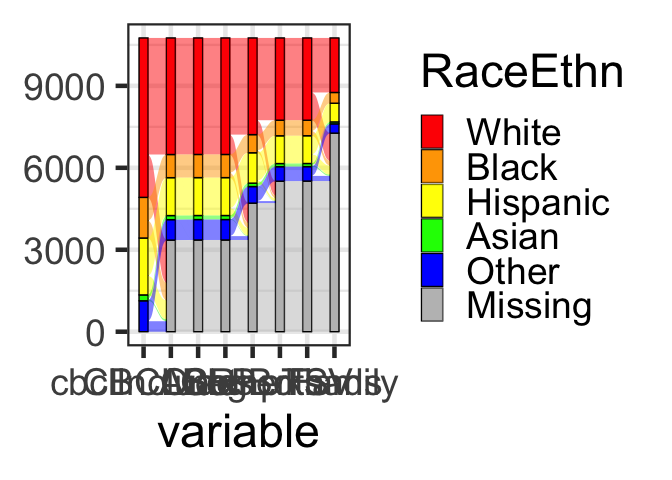<!-- -->

    ## `stat_bin()` using `bins = 30`. Pick better value with `binwidth`.

    ## Warning: Removed 18 rows containing non-finite values (stat_bin).

    ## [1] "Variables: Saw crime or accident? Did this happen in the past year?"

    ## No id variables; using all as measure variables

<!-- -->

    ## `stat_bin()` using `bins = 30`. Pick better value with `binwidth`.

    ## Warning: Removed 18 rows containing non-finite values (stat_bin).

    ## [1] "Variables: Lost a close friend? Did this happen in the past year?"

    ## No id variables; using all as measure variables

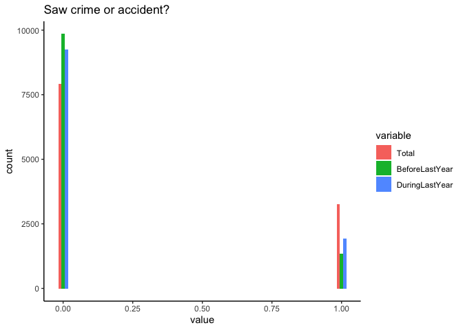<!-- -->

    ## `stat_bin()` using `bins = 30`. Pick better value with `binwidth`.

    ## Warning: Removed 18 rows containing non-finite values (stat_bin).

    ## [1] "Variables: Close friend was seriously sick/injured? Did this happen in the past year?"

    ## No id variables; using all as measure variables

<!-- -->

    ## `stat_bin()` using `bins = 30`. Pick better value with `binwidth`.

    ## Warning: Removed 18 rows containing non-finite values (stat_bin).

    ## [1] "Variables: Negative change in parent's financial situation? Did this happen in the past year?"

    ## No id variables; using all as measure variables

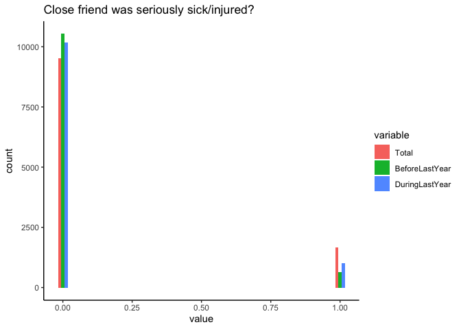<!-- -->

    ## `stat_bin()` using `bins = 30`. Pick better value with `binwidth`.

    ## Warning: Removed 18 rows containing non-finite values (stat_bin).

    ## [1] "Variables: Family member had drug and/or alcohol problem? Did this happen in the past year?"

    ## No id variables; using all as measure variables

<!-- -->

    ## `stat_bin()` using `bins = 30`. Pick better value with `binwidth`.

    ## Warning: Removed 21 rows containing non-finite values (stat_bin).

    ## [1] "Variables: You got seriously sick? Did this happen in the past year?"

    ## No id variables; using all as measure variables

<!-- -->

    ## `stat_bin()` using `bins = 30`. Pick better value with `binwidth`.

    ## Warning: Removed 21 rows containing non-finite values (stat_bin).

    ## [1] "Variables: You got seriously injured? Did this happen in the past year?"

    ## No id variables; using all as measure variables

<!-- -->

    ## `stat_bin()` using `bins = 30`. Pick better value with `binwidth`.

    ## Warning: Removed 24 rows containing non-finite values (stat_bin).

    ## [1] "Variables: Parents argued more than previously? Did this happen in the past year?"

    ## No id variables; using all as measure variables

<!-- -->

    ## `stat_bin()` using `bins = 30`. Pick better value with `binwidth`.

    ## Warning: Removed 21 rows containing non-finite values (stat_bin).

    ## [1] "Variables: Mother/father figure lost job? Did this happen in the past year?"

    ## No id variables; using all as measure variables

<!-- -->

    ## `stat_bin()` using `bins = 30`. Pick better value with `binwidth`.

    ## Warning: Removed 21 rows containing non-finite values (stat_bin).

    ## [1] "Variables: One parent was away from home more often? Did this happen in the past year?"

    ## No id variables; using all as measure variables

<!-- -->

    ## `stat_bin()` using `bins = 30`. Pick better value with `binwidth`.

    ## Warning: Removed 21 rows containing non-finite values (stat_bin).

    ## [1] "Variables: Someone in the family was arrested? Did this happen in the past year?"

    ## No id variables; using all as measure variables

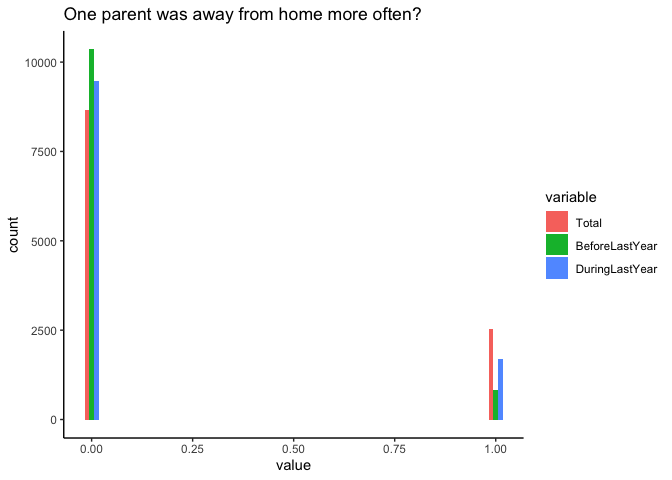<!-- -->

    ## `stat_bin()` using `bins = 30`. Pick better value with `binwidth`.

    ## Warning: Removed 21 rows containing non-finite values (stat_bin).

    ## [1] "Variables: Close friend died? Did this happen in the past year?"

    ## No id variables; using all as measure variables

<!-- -->

    ## `stat_bin()` using `bins = 30`. Pick better value with `binwidth`.

    ## Warning: Removed 21 rows containing non-finite values (stat_bin).

    ## [1] "Variables: Family member had mental/emotional problem? Did this happen in the past year?"

    ## No id variables; using all as measure variables

<!-- -->

    ## `stat_bin()` using `bins = 30`. Pick better value with `binwidth`.

    ## Warning: Removed 21 rows containing non-finite values (stat_bin).

    ## [1] "Variables: Brother or sister left home? Did this happen in the past year?"

    ## No id variables; using all as measure variables

<!-- -->

    ## `stat_bin()` using `bins = 30`. Pick better value with `binwidth`.

    ## Warning: Removed 21 rows containing non-finite values (stat_bin).

    ## [1] "Variables: Was a victim of crime/violence/assault? Did this happen in the past year?"

    ## No id variables; using all as measure variables

<!-- -->

    ## `stat_bin()` using `bins = 30`. Pick better value with `binwidth`.

    ## Warning: Removed 21 rows containing non-finite values (stat_bin).

    ## [1] "Variables: Parents separated or divorced? Did this happen in the past year?"

    ## No id variables; using all as measure variables

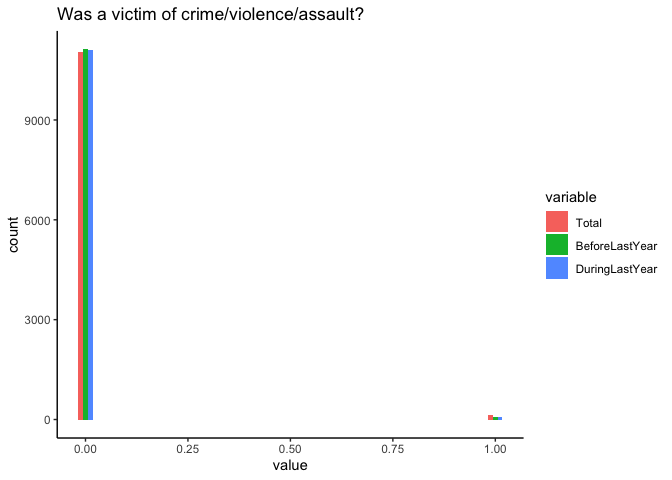<!-- -->

    ## `stat_bin()` using `bins = 30`. Pick better value with `binwidth`.

    ## Warning: Removed 21 rows containing non-finite values (stat_bin).

    ## [1] "Variables: Parents/caregiver got into trouble with the law? Did this happen in the past year?"

    ## No id variables; using all as measure variables

<!-- -->

    ## `stat_bin()` using `bins = 30`. Pick better value with `binwidth`.

    ## Warning: Removed 21 rows containing non-finite values (stat_bin).

    ## [1] "Variables: Attended a new school? Did this happen in the past year?"

    ## No id variables; using all as measure variables

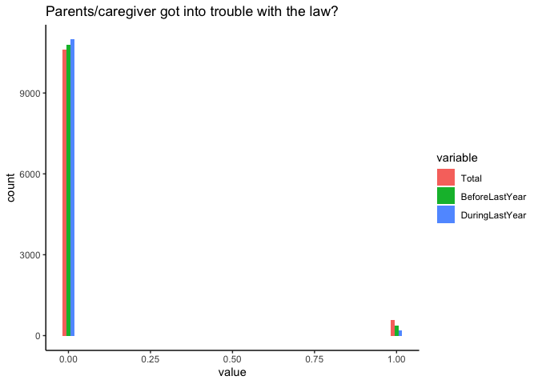<!-- -->

    ## `stat_bin()` using `bins = 30`. Pick better value with `binwidth`.

    ## Warning: Removed 21 rows containing non-finite values (stat_bin).

    ## [1] "Variables: Family moved? Did this happen in the past year?"

    ## No id variables; using all as measure variables

<!-- -->

    ## `stat_bin()` using `bins = 30`. Pick better value with `binwidth`.

    ## Warning: Removed 21 rows containing non-finite values (stat_bin).

    ## [1] "Variables: One of the parents/caregivers went to jail? Did this happen in the past year?"

    ## No id variables; using all as measure variables

<!-- -->

    ## `stat_bin()` using `bins = 30`. Pick better value with `binwidth`.

    ## Warning: Removed 21 rows containing non-finite values (stat_bin).

    ## [1] "Variables: Got new stepmother or stepfather? Did this happen in the past year?"

    ## No id variables; using all as measure variables

<!-- -->

    ## `stat_bin()` using `bins = 30`. Pick better value with `binwidth`.

    ## Warning: Removed 21 rows containing non-finite values (stat_bin).

    ## [1] "Variables: Parent/caregiver got a new job? Did this happen in the past year?"

    ## No id variables; using all as measure variables

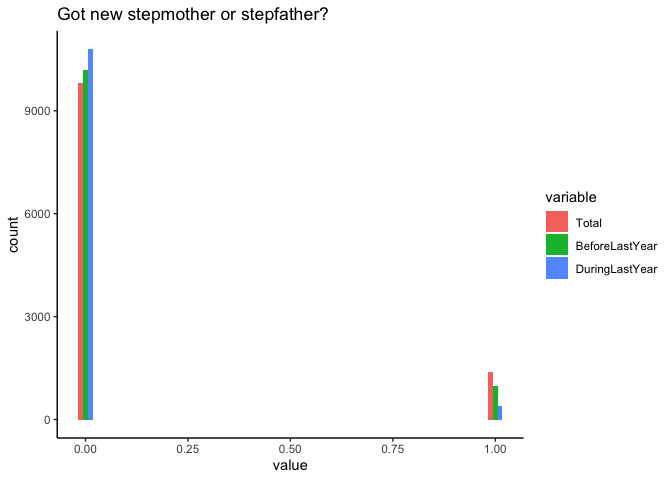<!-- -->

    ## `stat_bin()` using `bins = 30`. Pick better value with `binwidth`.

    ## Warning: Removed 21 rows containing non-finite values (stat_bin).

    ## [1] "Variables: Got new brother or sister? Did this happen in the past year?"

    ## No id variables; using all as measure variables

<!-- -->

    ## `stat_bin()` using `bins = 30`. Pick better value with `binwidth`.

    ## Warning: Removed 21 rows containing non-finite values (stat_bin).

    ## [1] "Variables: You were placed in foster care? Did this happen in the past year?"

    ## No id variables; using all as measure variables

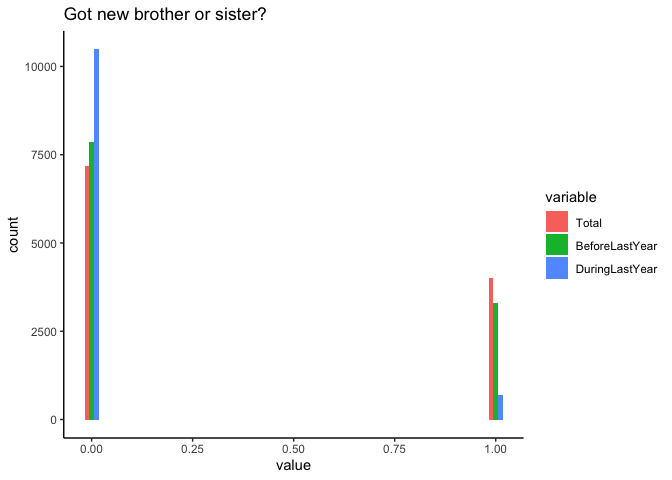<!-- -->

    ## `stat_bin()` using `bins = 30`. Pick better value with `binwidth`.

    ## Warning: Removed 33570 rows containing non-finite values (stat_bin).

    ## [1] "Variables: Saw or heard someone getting hit Did this happen in the past year?"

    ## No id variables; using all as measure variables

<!-- -->

    ## `stat_bin()` using `bins = 30`. Pick better value with `binwidth`.

    ## Warning: Removed 33570 rows containing non-finite values (stat_bin).

    ## [1] "Variables: Your family was homeless? Did this happen in the past year?"

    ## No id variables; using all as measure variables

<!-- -->

    ## `stat_bin()` using `bins = 30`. Pick better value with `binwidth`.

    ## Warning: Removed 33570 rows containing non-finite values (stat_bin).

    ## [1] "Variables: Parent or caregiver hospitalized? Did this happen in the past year?"

    ## No id variables; using all as measure variables

<!-- -->

    ## `stat_bin()` using `bins = 30`. Pick better value with `binwidth`.

    ## Warning: Removed 33570 rows containing non-finite values (stat_bin).

    ## [1] "Variables: Had a lockdown at your school due to concerns about a school shooting or violence? Did this happen in the past year?"

    ## No id variables; using all as measure variables

<!-- -->

    ## `stat_bin()` using `bins = 30`. Pick better value with `binwidth`.

    ## Warning: Removed 33570 rows containing non-finite values (stat_bin).

    ## [1] "Variables: Please indicate how instrument was administered: Please indicate how instrument was administered:"

    ## No id variables; using all as measure variables

<!-- -->

    ## `stat_bin()` using `bins = 30`. Pick better value with `binwidth`.

    ## Warning: Removed 33570 rows containing non-finite values (stat_bin).

    ## [1] "Variables: Saw or heard someone being shot at (but not actually wounded) in your school or neighborhood? Did this happen in the past year?"

    ## No id variables; using all as measure variables

<!-- -->

    ## `stat_bin()` using `bins = 30`. Pick better value with `binwidth`.

    ## Warning: Removed 33570 rows containing non-finite values (stat_bin).

    ## [1] "Variables: Do you know someone who has attempted suicide? Did this happen in the past year?"

    ## No id variables; using all as measure variables

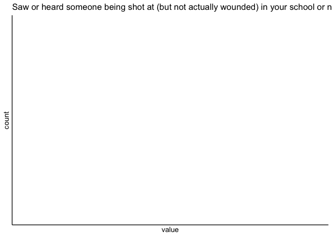<!-- -->

    ## `stat_bin()` using `bins = 30`. Pick better value with `binwidth`.

    ## Warning: Removed 33570 rows containing non-finite values (stat_bin).

    ## [1] "Variables: Parent or caregiver deported? Did this happen in the past year?"

    ## No id variables; using all as measure variables

<!-- -->

    ## `stat_bin()` using `bins = 30`. Pick better value with `binwidth`.

    ## Warning: Removed 33570 rows containing non-finite values (stat_bin).

<!-- -->

``` r
#### for year1 visit
# note NO answers recorded to ple_foster_care_past_yr_y. I guess we can't use that variable unless new release has it populated
# ditto, ple_hit_y
# ditto, ple_homeless_y
# ditto, ple_hospitalized_y
# ditto, ple_lockdown_y
# ditto, ple_shot_y
# ditto, ple_suicide_y

# ∆∆ now that these are events stemming from prior to the baseline visit, we can consider them as functionally BV (not for "since" variables, which can be interpreted in a different predictive context)
# ∆∆ BUT this only captures baseline ABCD visit. Now we need to merge two-year FUP life events with the rest of the two years for cross-sectional analyses
OutDFBV=subset(masterdf,eventname=='baseline_year_1_arm_1')
OutDF2Y=subset(masterdf,eventname=='2_year_follow_up_y_arm_1')
# we have one valid reconstruction from code above to merge into bv - but remove subjects already removed from master df
preBVdf=preBVdf[preBVdf$subjectkey %in% masterdf$subjectkey,]
# for merging purposes to avoid doubling
preBVdf$eventname='baseline_year_1_arm_1'
OutDFBVyle=merge(masterdf,preBVdf,by=c('subjectkey','eventname'))
```

    ## Warning in merge.data.frame(masterdf, preBVdf, by = c("subjectkey",
    ## "eventname")): column names 'collection_id.x', 'dataset_id.x',
    ## 'interview_date.x', 'collection_title.x', 'collection_id.y', 'dataset_id.y',
    ## 'src_subject_id.x', 'interview_date.y', 'collection_title.y', 'collection_id.x',
    ## 'dataset_id.x', 'src_subject_id.y', 'interview_date.x', 'collection_title.x',
    ## 'collection_id.y', 'dataset_id.y', 'interview_date.y', 'collection_title.y' are
    ## duplicated in the result

``` r
# and now we need to get the two year yles to merge in - but remove subjects already removed from master df
yle2=yle2[yle2$subjectkey %in% masterdf$subjectkey,]
yle2=subset(yle,eventname=='2_year_follow_up_y_arm_1')
#### extract same columns of interest - 2 YEAR
# for iterative dataset construct
Y2df=data.frame(as.factor(yle2$subjectkey))
colnames(Y2df)<-'subjectkey'
# OK, now lets extract timepoint 2 values for the same columns
for (i in 10:length(yle_No_PastYearcols_No_Goodbad_No_EvAff)){
  # extract column name
  currColName=yle_No_PastYearcols_No_Goodbad_No_EvAff[i]
  # get variable of interest and plop into loop Y2 dataframe
  Y2df$null<-as.numeric(yle2[,yle_No_PastYearcols_No_Goodbad_No_EvAff[i]])
  colnamesMinusNull=head(colnames(Y2df), -1)
  colnames(Y2df)<-c(colnamesMinusNull,currColName)         
}  
# and now we can merge it in
OutDF2Yyle=merge(OutDF2Y,Y2df,by=c('subjectkey'))
# remove redundant colnames
redundantColnames=setdiff(colnames(OutDF2Yyle),colnames(OutDFBVyle))
OutDF2Yyle=OutDF2Yyle[, !names(OutDF2Yyle) %in%  redundantColnames]
# remove duplicated column names
OutDFBVyle <- OutDFBVyle[, !duplicated(colnames(OutDFBVyle))]
# now we can recombine them
OutDFyle=rbind(OutDFBVyle,OutDF2Yyle)

# only use subjects with both timepoints as complete cases
# cols of interest to guage over
varsOfInt=yle_No_PastYearcols_No_Goodbad_No_EvAff[10:34]
subjs=unique(OutDFyle$subjectkey)
for (s in subjs){
  # if there are less than two complete cases of the variables of interest
  if (sum(complete.cases(OutDFyle[OutDFyle$subjectkey==s,c(varsOfInt)]))<2){
    subjs=subjs[subjs!=s]
  }
}
# convert masterdf to df with complete observations for cognition
masterdf=masterdf[masterdf$subjectkey %in% subjs,]

# new count after merge
masterdf=merge(masterdf,OutDFyle,by=c('subjectkey','sex','eventname','interview_age','Grades','g','income','parental_education','race_ethnicity','matched_group','parentPcount','cbcl_scr_syn_totprob_r','cbcl_scr_syn_external_r','cbcl_scr_syn_internal_r'))
```

    ## Warning in merge.data.frame(masterdf, OutDFyle, by = c("subjectkey", "sex", :
    ## column names 'collection_id.x.x', 'dataset_id.x.x', 'interview_date.x.x',
    ## 'collection_title.x.x', 'collection_id.y.x', 'dataset_id.y.x',
    ## 'src_subject_id.x.x', 'interview_date.y.x', 'collection_title.y.x',
    ## 'collection_id.x.x', 'dataset_id.x.x', 'src_subject_id.y.x',
    ## 'interview_date.x.x', 'collection_title.x.x', 'collection_id.y.x',
    ## 'dataset_id.y.x', 'interview_date.y.x', 'collection_title.y.x' are duplicated in
    ## the result

``` r
YLESubjs=length(unique(masterdf$subjectkey))
# add to included subjs DF
includedSubjects$YLESubjs=0
includedSubjects[includedSubjects$subj %in% unique(masterdf$subjectkey),]$YLESubjs=1

# so if we use the events recorded that happened prior to the baseline visit, and those that are included at 2 year FUP how much missingness does that imbue?
print(paste0(participantsTSVSubjs-YLESubjs,' lost from requiring those with yle at both timepoints with full data'))
```

    ## [1] "90 lost from requiring those with yle at both timepoints with full data"

``` r
# gauge consistency of responses across visits: happened at al in past should be reflected at tp 2 if it is at tp1
tmpdf=merge(OutDFBVyle,OutDF2Yyle,by='subjectkey')

# f'in ugh
ggplot(data=tmpdf,aes(x=ple_arrest_y.x,y=ple_arrest_y.y))+geom_point()+geom_jitter()+xlab('Has a family member ever been arrested? timepoint 1')+ylab('Has a family member ever been arrested? timepoint 2')
```

    ## Warning: Removed 3 rows containing missing values (geom_point).
    ## Removed 3 rows containing missing values (geom_point).

<!-- -->

``` r
# find subjects who report yle's at timepoint 1 but not 2
questionableSubjs=as.factor(NULL)
for (i in 10:34){
  # extract column name
  currColName=yle_No_PastYearcols_No_Goodbad_No_EvAff[i]
  currColNamex=paste0(currColName,'.x')
  currColNamey=paste0(currColName,'.y')
  # extract year 1
  y1<-tmpdf[,currColNamex]
  # extract year 2
  y2<-tmpdf[,currColNamey]
  # if x > y, either i don't understand this questionnaire or the kids don't
  questionableSubjs=tmpdf$subjectkey[y1>y2]
  # are these subjs who were interviewer by RA disprop?
  questionableSubjs=c(questionableSubjs,tmpdf$subjectkey[y1>y2])
}

# and if we exclude subjs with inconsistent timepoint-to-timepoint answers 
masterdf=masterdf[!masterdf$subjectkey %in% questionableSubjs,]
# remaining unique subjs
ConsistentYleSubjs=length(unique(masterdf$subjectkey))
print(paste0(YLESubjs-ConsistentYleSubjs,' lost from requiring those with yle at both timepoints with full data, and kids who inconsistently report yles'))
```

    ## [1] "421 lost from requiring those with yle at both timepoints with full data, and kids who inconsistently report yles"

``` r
print(paste0(ConsistentYleSubjs,' participants remain'))
```

    ## [1] "4476 participants remain"

``` r
# add to included subjs DF
includedSubjects$YLEConsistentSubjs=0
includedSubjects[includedSubjects$subj %in% unique(masterdf$subjectkey),]$YLEConsistentSubjs=1
```

``` r
###########∆∆∆∆∆∆∆∆∆∆∆∆∆∆∆∆∆∆∆∆∆∆∆##############
## Handles discrep. in ple~yle, saves out X-sectionaldf ##
###########∆∆∆∆∆∆∆∆∆∆∆∆∆∆∆∆∆∆∆∆∆∆∆##############
# ple QC
#### LOAD in youth life events. Unfortunately this also appears to be missing for most participants, but is populated for slightly more than residential deprivation
ple=read.delim('~/Downloads/Package_1210940/abcd_ple01.txt')
pleColnames=colnames(ple)
pleColDescrip=ple[1,]
# note yle's are labeled ple's in the colnames, but end with a _y extension (ples end with _p extension)

##### Extract purely retrospective, i.e., viable for inclusion in tp1-based predictions
#### Some will need to be retrospective. Use PLE and YLE instances of "not in past year" to get starting point for ACEs (assumed prior to tp1 scan)
# so to reconstruct whether or not this happened before timepoint 1 scan, we will need _past_yr variables
plePastYearcols=pleColnames[grep('_past_yr',pleColnames)]

# remove "past year?" from column names to boil down to binary variables of interest
ple_No_PastYearcols=pleColnames[-which(pleColnames %in% plePastYearcols)]

# remove "was this a good or bad experience?", not really true retrospective
goodBad=ple_No_PastYearcols[grep('_fu_',ple_No_PastYearcols)]
ple_No_PastYearcols_No_Goodbad=ple_No_PastYearcols[-which(ple_No_PastYearcols %in% goodBad)]

# remove "how much did this event affect you" for now, not really true retrospective
EvAffect=ple_No_PastYearcols_No_Goodbad[grep('_fu2_',ple_No_PastYearcols_No_Goodbad)]
ple_No_PastYearcols_No_Goodbad_No_EvAff=ple_No_PastYearcols_No_Goodbad[-which(ple_No_PastYearcols_No_Goodbad %in% EvAffect)]

# remove remaining instances of undesireable columns (unpopulated, misnamed)
ple_No_PastYearcols_No_Goodbad_No_EvAff=ple_No_PastYearcols_No_Goodbad_No_EvAff[-c(13,21)]

# now loop through to look for inconsistency b/w timepoints
timepoint1PLE=subset(ple,eventname=='1_year_follow_up_y_arm_1')
timepoint2PLE=subset(ple,eventname=='2_year_follow_up_y_arm_1')
# make merged PLE
tmpdf=merge(timepoint1PLE,timepoint2PLE,by='subjectkey')
# and merged ple + yle for each timepoint to eval correspondence between parent/child
BVboth=merge(OutDFBVyle,timepoint1PLE,by='subjectkey')
```

    ## Warning in merge.data.frame(OutDFBVyle, timepoint1PLE, by = "subjectkey"):
    ## column names 'src_subject_id.x', 'src_subject_id.y' are duplicated in the result

``` r
Y2both=merge(OutDF2Yyle,timepoint2PLE,by='subjectkey')
```

    ## Warning in merge.data.frame(OutDF2Yyle, timepoint2PLE, by = "subjectkey"):
    ## column names 'src_subject_id.x', 'src_subject_id.y' are duplicated in the result

``` r
# loop over to get another estimate of questionable reliability
ple_based_questionableSubjs=as.factor(NULL)
# starts with 11 instead of 10 because 10 is "select language" here
for (i in 11:34){
  # extract column name
  currColName=ple_No_PastYearcols_No_Goodbad_No_EvAff[i]
  currColNamex=paste0(currColName,'.x')
  currColNamey=paste0(currColName,'.y')
  # extract year 1
  y1<-as.numeric(tmpdf[,currColNamex])
  # extract year 2
  y2<-as.numeric(tmpdf[,currColNamey])
  # if x > y, either i don't understand this questionnaire or the kids don't
  ple_based_questionableSubjs=tmpdf$subjectkey[y1>y2]
  # are these subjs who were interviewer by RA disprop?
  ple_based_questionableSubjs=c(ple_based_questionableSubjs,tmpdf$subjectkey[y1>y2])
  # consistent subjs are those that aren't questionable
  goodsubjs=tmpdf$subjectkey[!tmpdf$subjectkey %in% ple_based_questionableSubjs]
  #### ∆∆∆ now see if they are discordant with their own child's answers
    # find corresponding column name in yle - in theory it's replacing the _p with _y but both dataframes have typos in column names
    currColName_y=gsub('.{1}$', 'y', currColName)
    # extract columns
    # extract year 1 - parent SR
    p_y1<-as.numeric(BVboth[,currColName])
    # youth
    y_y1<-as.numeric(BVboth[,currColName_y])
    # extract year 2 - parent SR
    p_y2<-as.numeric(Y2both[,currColName])
    # youth
    y_y2<-as.numeric(Y2both[,currColName_y])
    # discordant timepoint 1?
    Discordant_tp1=BVboth$subjectkey[p_y1!=y_y1]
    # discordant timepoint 2
    Discordant_tp2=Y2both$subjectkey[p_y2!=y_y2]
    Discordantsubjs=unique(c(Discordant_tp1,Discordant_tp2))
    ple_based_questionableSubjs=c(ple_based_questionableSubjs,Discordantsubjs)
}


# combine with questionable subjs on the basis of tp1 ysr and tp2 ysr not matching
questionableSubjs=unique(c(questionableSubjs,ple_based_questionableSubjs))
masterdf=masterdf[!masterdf$subjectkey %in% questionableSubjs,]

AgreeingYleSubjs=length(unique(masterdf$subjectkey))
print(paste0(ConsistentYleSubjs-AgreeingYleSubjs,' lost from cross-referencing parent report of childs life events and removing inconsistents'))
```

    ## [1] "567 lost from cross-referencing parent report of childs life events and removing inconsistents"

``` r
print(paste0(AgreeingYleSubjs,' Participants remain'))
```

    ## [1] "3909 Participants remain"

``` r
# add to included subjs DF
includedSubjects$YLEConsistentAgreeSubjs=0
includedSubjects[includedSubjects$subj %in% unique(masterdf$subjectkey),]$YLEConsistentAgreeSubjs=1
```

``` r
# rope in physical characteristic
Phys=read.delim('~/Downloads/Package_1211089/abcd_ant01.txt')
PhysColnames=colnames(Phys)
PhysColDescrip=Phys[1,]

# sep out baseline and two-year visits by removing 1 and 3 year followups
Phys=Phys[Phys$eventname!='1_year_follow_up_y_arm_1',]
Phys=Phys[Phys$eventname!='3_year_follow_up_y_arm_1',]

# note > 5x missing data for anthroweightcalc and waist hybrid rather than individual weight + waist measurements
# Use individual weight and waist measurements

# calc weight manually
Phys$weight=(as.numeric(Phys$anthroweight1lb)+as.numeric(Phys$anthroweight2lb))/2
```

    ## Warning: NAs introduced by coercion

    ## Warning: NAs introduced by coercion

``` r
# rename waist for ease 
Phys$waist=as.numeric(Phys$anthro_waist_cm)
```

    ## Warning: NAs introduced by coercion

``` r
# rename height with easier variable name 
Phys$height=as.numeric(Phys$anthroheightcalc)
```

    ## Warning: NAs introduced by coercion

``` r
# calc BMI manually
Phys$BMI=703*(Phys$weight/(Phys$height^2))
### https://www.cdc.gov/healthyweight/assessing/bmi/childrens_BMI/childrens_BMI_formula.html
# Formula: 703 x weight (lbs) / [height (in)]2

# isolate variables of interest
Phys=Phys[,c('weight','waist','height','BMI','subjectkey','eventname','sex')]

# check for empties
Phys=Phys[rowSums(is.empty(Phys))==0,]

# check for absurd values - weight
hist(Phys$weight)
```

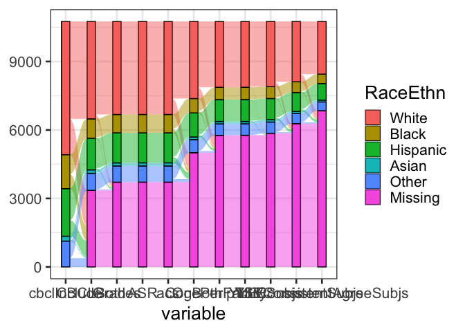<!-- -->

``` r
# safe to assume there is not a child 4x the world record weight in this study
Phys=Phys[Phys$weight<5000,]
# safe to assume there is not a child weighing 3.5 pounds in this study
Phys=Phys[Phys$weight>27,]
# check for absurd values - height
hist(Phys$height)
```

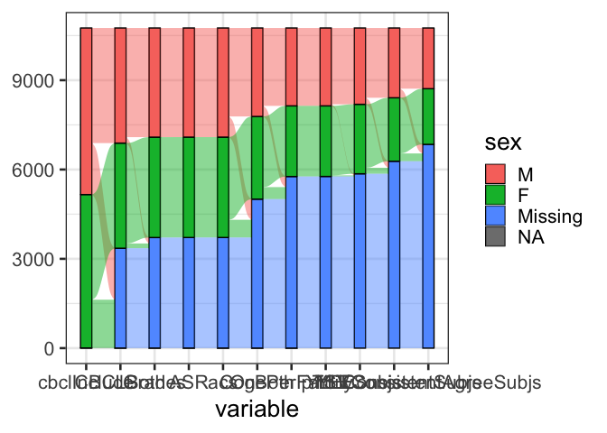<!-- -->

``` r
# safe to assume there is not an 8 foot 2 in. child 4in this study... setting max height to 6'3 based on distribution
Phys=Phys[Phys$height<76.1,]
# safe to assume there are not 4-6 inch tall children in this study
Phys=Phys[Phys$height>7,]
# check for absurd values - waist
hist(Phys$waist)
```

<!-- -->

``` r
# can't assume the 3.5, 9, and 12 measurements are real
Phys=Phys[Phys$waist>12,]

# merge in
masterdf=merge(masterdf,Phys,by=c('subjectkey','eventname','sex'))
```

    ## Warning in merge.data.frame(masterdf, Phys, by = c("subjectkey", "eventname", :
    ## column names 'collection_id.x.x', 'dataset_id.x.x', 'interview_date.x.x',
    ## 'collection_title.x.x', 'collection_id.y.x', 'dataset_id.y.x',
    ## 'src_subject_id.x.x', 'interview_date.y.x', 'collection_title.y.x',
    ## 'collection_id.x.x', 'dataset_id.x.x', 'src_subject_id.y.x',
    ## 'interview_date.x.x', 'collection_title.x.x', 'collection_id.y.x',
    ## 'dataset_id.y.x', 'interview_date.y.x', 'collection_title.y.x' are duplicated in
    ## the result

``` r
PhysCharSubjs=length(unique(masterdf$subjectkey))
print(paste0(AgreeingYleSubjs-PhysCharSubjs,' lost from requiring complete, feasible physical measurements data'))
```

    ## [1] "0 lost from requiring complete, feasible physical measurements data"

``` r
print(paste0(PhysCharSubjs,' Participants remain'))
```

    ## [1] "3909 Participants remain"

``` r
# add to included subjs DF
includedSubjects$PhysCharSubjs=0
includedSubjects[includedSubjects$subj %in% unique(masterdf$subjectkey),]$PhysCharSubjs=1
```

``` r
# rope in salimetrics - section commented out for excessive exclusion - can provide same illustration for RDI if needed

#hss=read.delim('~/Downloads/Package_1211427/abcd_hsss01.txt')
#hssColname=colnames(hss)
#hssColDescrip=hss[1,]
#
## sep out baseline and two-year visits by removing 1 and 3 year followups
#hss=hss[hss$eventname!='1_year_follow_up_y_arm_1',]
#hss=hss[hss$eventname!='3_year_follow_up_y_arm_1',]
#
## cool. Lets chose the variables of interest (factor scores, consistent w/ rest of project)
#hss=hss[,c('hormone_scr_dhea_mean','hormone_scr_hse_mean','hormone_scr_ert_mean','subjectkey','eventname','sex')]
#
## guage how many are missing/NA
## now omit the empties and NAs now and see what we lose
#hssNum<-data.frame(lapply(hss[-1,1:3],as.numeric))
## colsums is empty
#EmptyRows_dhea=sum(is.na(hssNum$hormone_scr_dhea_mean))
#EmptyRows_hse=sum(is.na(hssNum$hormone_scr_hse_mean))
#EmptyRows_ert=sum(is.na(hssNum$hormone_scr_ert_mean))
#
#hss=hss[rowSums(is.empty(hss))==0,]
#
## merge in
#masterdf=merge(masterdf,hss,by=c('subjectkey','eventname','sex'))
#
#hsssubjs=length(unique(masterdf$subjectkey))
#print(paste0(PhysCharSubjs-hsssubjs,' lost from requiring hss data'))
#print(paste0(hsssubjs,' Participants remain (troublesome)'))
#
#
## add to included subjs DF
#includedSubjects$hss=0
#includedSubjects[includedSubjects$subj %in% unique(masterdf$subjectkey),]$hss=1
```

``` r
# rope in teacher self-report - section commented out for excessive exclusion - can provide same illustration for RDI if needed
# rope in physical characteristic
#TSR=read.delim('~/Downloads/Package_1211089/abcd_ssbpmtf01.txt')
#TSRColnames=colnames(TSR)
#TSRColDescrip=TSR[1,]
#
## sep out baseline and two-year visits by removing 1 and 3 year followups
#TSR=TSR[TSR$eventname!='1_year_follow_up_y_arm_1',]
#TSR=TSR[TSR$eventname!='3_year_follow_up_y_arm_1',]
#
## cool. Lets chose the variables of interest (factor scores, consistent w/ rest of project)
#TSR=TSR[,c('bpm_t_scr_attention_r','bpm_t_scr_totalprob_r','bpm_t_scr_internal_r','bpm_t_scr_external_r','subjectkey','eventname','sex')]
#
#
## now omit the empties and NAs now and see what we lose
#TSR=TSR[rowSums(is.empty(TSR))==0,]
#
#
## merge in
#masterdf=merge(masterdf,TSR,by=c('subjectkey','eventname','sex'))
#
#TSRsubjs=length(unique(masterdf$subjectkey))
#print(paste0(PhysCharSubjs-TSRsubjs,' lost from requiring TSR data'))
#print(paste0(TSRsubjs,' Participants remain (troublesome)'))
#
#
## add to included subjs DF
#includedSubjects$TSR=0
#includedSubjects[includedSubjects$subj %in% unique(masterdf$subjectkey),]$TSR=1
```

``` r
# rope in screen time 
# rope in physical characteristic
#stq=read.delim('~/Downloads/Package_1211427/abcd_stq01.txt')
#stqColnames=colnames(stq)
#stqColDescrip=stq[1,]
#
## sep out baseline and two-year visits by removing 1 and 3 year followups
#stq=stq[stq$eventname!='1_year_follow_up_y_arm_1',]
#stq=stq[stq$eventname!='3_year_follow_up_y_arm_1',]
#
## cool. Lets chose the variables of interest (factor scores, consistent w/ rest of project)
#stq=stq[,c('screentime_wkdy_typical_hr','subjectkey','eventname','sex')]
#
#
## now omit the empties and NAs now and see what we lose
#stq=stq[rowSums(is.empty(stq))==0,]
#
#
## merge in
#masterdf=merge(masterdf,stq,by=c('subjectkey','eventname','sex'))
#
#stqsubjs=length(unique(masterdf$subjectkey))
#print(paste0(stqsubjs,' Participants remain (troublesome)'))
#
#
## add to included subjs DF
#includedSubjects$stq=0
#includedSubjects[includedSubjects$subj %in% unique(masterdf$subjectkey),]$stq=1
```

``` r
###### fix data formats
# variables of interest
variablesOfInterest=c('cbcl_scr_syn_totprob_r','cbcl_scr_syn_external_r','cbcl_scr_syn_internal_r','ple_died_y','ple_injured_y','ple_crime_y','ple_friend_y','ple_friend_injur_y','ple_arrest_y','ple_friend_died_y','ple_mh_y','ple_sib_y','ple_victim_y','ple_separ_y','ple_law_y','ple_school_y','ple_move_y','ple_jail_y','ple_step_y','ple_new_job_y','ple_new_sib_y','g','subjectkey','interview_age','Grades','parentPcount','income','parental_education','sex','race_ethnicity','weight','waist','height','BMI','eventname')

# convert PLE's to factors
for (i in 4:21){
  VarOfInt=variablesOfInterest[i]
  masterdf[,VarOfInt]<-as.factor(masterdf[,VarOfInt])
}

# convert grades, parent P, income, and parental edu to numeric
for (i in 25:28){
  VarOfInt=variablesOfInterest[i]
  masterdf[,VarOfInt]<-as.numeric(masterdf[,VarOfInt])
}

# convert sex and race/ethnicity to factors
for (i in 29:30){
  VarOfInt=variablesOfInterest[i]
  masterdf[,VarOfInt]<-as.factor(masterdf[,VarOfInt])
}

#### ∆∆∆
# last catch: eliminate rows with NAs and without two-timepoint data
#### ∆∆∆
# variables of interest redux
masterdf=masterdf[,c(variablesOfInterest)]
# na omitted version
masterdf=masterdf[rowSums(is.na(masterdf)) == 0, ] 
print(dim(masterdf))
```

    ## [1] 7752   35

``` r
# and two-timepoint check
twoTPsubjs=names(table(masterdf$subjectkey)[table(masterdf$subjectkey)>1])
masterdf=masterdf[masterdf$subj %in% twoTPsubjs,]

# now set subsets to use for yle for temporal precedence analyses 
df1=masterdf[masterdf$eventname=='baseline_year_1_arm_1',]
df2=masterdf[masterdf$eventname=='2_year_follow_up_y_arm_1',]
subsetOfBoth=merge(df1,df2,by='subjectkey')
subsetOfBoth=subsetOfBoth$subjectkey

# complete included Subjects df
includedSubjects$twoTP=0
includedSubjects[includedSubjects$subj %in% unique(masterdf$subjectkey),]$twoTP=1

# save ouput
saveRDS(masterdf,'~/OutDfxc.rds')
```

``` r
# make alluvial
library(ggplot2)
library(ggalluvial)
library(scales)
```

    ## 
    ## Attaching package: 'scales'

    ## The following object is masked from 'package:rapportools':
    ## 
    ##     percent

``` r
# melt the plot df to get in proper format
plotdf=melt(includedSubjects)
```

    ## Using subj as id variables

``` r
plotdf$value<-as.factor(plotdf$value)
plotdf$subj<-as.factor(plotdf$subj)

# merge in raceEth of each subj
raceEth=participantsTSV$race_ethnicity
subjectsInPtsv=participantsTSV$subjectkey
infoDf=data.frame(raceEth,subjectsInPtsv)
colnames(infoDf)<-c('RaceEthn','subj')
test=merge(plotdf,infoDf,by='subj')
# overwrite race with "empty" if missing after each checkpoint
test$RaceEthn<-factor(test$RaceEthn,levels=c(1,2,3,4,5,6),labels=c("White","Black","Hispanic","Asian","Other","Missing"))
test$RaceEthn[test$value==0]="Missing"

ggplot(test,aes(x=variable,stratum=RaceEthn,alluvium=subj))+geom_stratum(aes(fill=RaceEthn))+geom_flow(aes(fill=RaceEthn))+theme_bw(base_size=18)
```

<!-- -->

``` r
# can overlay two pie charts: starting raceEth Comp and Ending. Tuck into area that is pink now
startingdf=test[test$variable=='cbclInclude',]
startingdf=startingdf[startingdf$value==1,]
endingdf=test[test$variable=='twoTP',]
endingdf=endingdf[endingdf$value==1,]
# now tabulate them to get in proper plotting format
startingdfTab=tabulate(startingdf$RaceEthn)
endingdfTab=tabulate(endingdf$RaceEthn)

# starting df
startingdf=data.frame(startingdfTab,c("White","Black","Hispanic","Asian","Other"))
colnames(startingdf)<-c('value','RaceEthnicity')
ggplot(startingdf, aes(x="", y=value, fill=RaceEthnicity)) +
  geom_bar(stat="identity", width=1) +
  coord_polar("y", start=0)+ggtitle('Before Exclusions')
```

<!-- -->

``` r
# plot df is both with race labels
endingdf=data.frame(endingdfTab,c("White","Black","Hispanic","Asian","Other"))
colnames(endingdf)<-c('value','RaceEthnicity')
ggplot(endingdf, aes(x="", y=value, fill=RaceEthnicity)) +
  geom_bar(stat="identity", width=1) +
  coord_polar("y", start=0)+ggtitle('After Exclusions')
```

<!-- -->

``` r
### and equivalent for sex
plotdf=melt(includedSubjects)
```

    ## Using subj as id variables

``` r
plotdf$value<-as.factor(plotdf$value)
plotdf$subj<-as.factor(plotdf$subj)

# merge in raceEth of each subj
sexes=participantsTSV$sex
subjectsInPtsv=participantsTSV$subjectkey
infoDf=data.frame(sexes,subjectsInPtsv)
colnames(infoDf)<-c('sex','subj')
test=merge(plotdf,infoDf,by='subj')
# overwrite race with "empty" if missing after each checkpoint
test$sex<-factor(test$sex,levels=c("M","F","Missing"))
test$sex[test$value==0]="Missing"

ggplot(test,aes(x=variable,stratum=sex,alluvium=subj))+geom_stratum(aes(fill=sex))+geom_flow(aes(fill=sex))+theme_bw(base_size=18)
```

<!-- -->

``` r
###########∆∆∆∆∆∆∆∆∆∆∆∆∆∆∆∆∆∆∆∆∆∆∆##############
## Handles tp1 (not bv) yle, tempPrec df ##
###########∆∆∆∆∆∆∆∆∆∆∆∆∆∆∆∆∆∆∆∆∆∆∆##############

# remove prior YLE columns for clarity (except for subjectkey, eventname, sex, interview_age: items 4,6,8 and 9)
yle_No_PastYearcols_No_Goodbad_No_EvAff=yle_No_PastYearcols_No_Goodbad_No_EvAff[-c(4,6,8,9)]
masterdf=masterdf[,!colnames(masterdf) %in% yle_No_PastYearcols_No_Goodbad_No_EvAff]


##### make outdf absolute retrospective for temporal precedence analyses
## for iterative dataset construct
preBVdf=data.frame(as.factor(yle1$subjectkey))
colnames(preBVdf)<-'subjectkey'

# OK, now lets remove instances of these things happening in the past year
for (i in 6:length(yle_No_PastYearcols_No_Goodbad_No_EvAff)){
  # extract column name
  currColName=yle_No_PastYearcols_No_Goodbad_No_EvAff[i]
  # extract corresponding "was this in the past year?" boolean, which is always right after
  currColIndex=grep(currColName,yleColnames)
  # extract vector of values for PTs
  currCol=yle1[,currColIndex]
  # need an exception for le_friend_injur_past_yr_y. Appears to be misnamed without p in ple
  if  (currColName=='ple_friend_injur_y'){
    currColNamePastYear='le_friend_injur_past_yr_y'
  # also need except for ple_injur_past_yr_y, which is actually ple_injur_y_past_yr_y which is also probably a typo
  } else if (currColName=='ple_injur_y'){
    currColNamePastYear='ple_injur_y_past_yr_y'
  }  else {
    # return colname of past year using text in aim to be more robust
    currColNamePastYear=gsub('_y','_past_yr_y',currColName)
  }
  currColIndexPastYear=grep(currColNamePastYear,yleColnames)
  # This turned out to not be robust to heterogeneity in questionnaire
  ## "past year"? immediately proceeds question
  ## currColIndexPastYear=currColIndex+1
  ## extract this vector of values for PTs
  currCol_pastyr=yle1[,currColIndexPastYear]
  # set empties to 0 in follow up question
  currCol_pastyr[is.empty(currCol_pastyr)]=0
  # ple_injur_y and ple_injur_y_yr_y are misnamed, need to build catch specifically for these variables
  if (currColIndex[1]==42){
    # set to correct column
    currColIndex=42
    # re-draw currCol
    currCol=yle1[,currColIndex]
    # re-draw past year
    currColIndexPastYear=currColIndex+1
    # re-draw vector of values for PTs
    currCol_pastyr=yle1[,currColIndexPastYear]
    # set is empty to 0 in follow up question
    currCol_pastyr[is.empty(currCol_pastyr)]=0
    # extract "past year"?
    NotPastYr=as.numeric(currCol)-as.numeric(currCol_pastyr)
  } else {
    # if past year, subtract instance
    NotPastYr=as.numeric(currCol)-as.numeric(currCol_pastyr)
  }
  # print out utilized colum names to ensure they match
  print(paste('Variables:',yle[1,currColIndex],yle[1,currColIndexPastYear]))
  # explicitly count instances in past year
  PastYr=as.numeric(currCol)+as.numeric(currCol_pastyr)==2
  # make a plot dataframe for ggplot2
  plotdf=data.frame(as.numeric(yle1[,yle_No_PastYearcols_No_Goodbad_No_EvAff[i]]),NotPastYr,as.numeric(PastYr))
  colnames(plotdf)=c('Total','BeforeLastYear','DuringLastYear')
  plotdf<-invisible(melt(plotdf))
  a<-ggplot(plotdf, aes(x=value,fill=variable)) + geom_histogram(position="dodge")+theme_classic()+ggtitle(paste(yle[1,yle_No_PastYearcols_No_Goodbad_No_EvAff[i]]))
  print(a)
  # iteratively make a dataframe of yes/no (standard)
  preBVdf$null<-NotPastYr
  colnamesMinusNull=head(colnames(preBVdf), -1)
  colnames(preBVdf)<-c(colnamesMinusNull,currColName)
}
```

    ## [1] "Variables: Someone in family died? Did this happen in the past year?"

    ## No id variables; using all as measure variables

    ## `stat_bin()` using `bins = 30`. Pick better value with `binwidth`.

    ## Warning: Removed 18 rows containing non-finite values (stat_bin).

    ## [1] "Variables: Family member was seriously injured? Did this happen in the past year?"

    ## No id variables; using all as measure variables

<!-- -->

    ## `stat_bin()` using `bins = 30`. Pick better value with `binwidth`.

    ## Warning: Removed 18 rows containing non-finite values (stat_bin).

    ## [1] "Variables: Saw crime or accident? Did this happen in the past year?"

    ## No id variables; using all as measure variables

<!-- -->

    ## `stat_bin()` using `bins = 30`. Pick better value with `binwidth`.

    ## Warning: Removed 18 rows containing non-finite values (stat_bin).

    ## [1] "Variables: Lost a close friend? Did this happen in the past year?"

    ## No id variables; using all as measure variables

<!-- -->

    ## `stat_bin()` using `bins = 30`. Pick better value with `binwidth`.

    ## Warning: Removed 18 rows containing non-finite values (stat_bin).

    ## [1] "Variables: Close friend was seriously sick/injured? Did this happen in the past year?"

    ## No id variables; using all as measure variables

<!-- -->

    ## `stat_bin()` using `bins = 30`. Pick better value with `binwidth`.

    ## Warning: Removed 18 rows containing non-finite values (stat_bin).

    ## [1] "Variables: Negative change in parent's financial situation? Did this happen in the past year?"

    ## No id variables; using all as measure variables

<!-- -->

    ## `stat_bin()` using `bins = 30`. Pick better value with `binwidth`.

    ## Warning: Removed 18 rows containing non-finite values (stat_bin).

    ## [1] "Variables: Family member had drug and/or alcohol problem? Did this happen in the past year?"

    ## No id variables; using all as measure variables

<!-- -->

    ## `stat_bin()` using `bins = 30`. Pick better value with `binwidth`.

    ## Warning: Removed 21 rows containing non-finite values (stat_bin).

    ## [1] "Variables: You got seriously sick? Did this happen in the past year?"

    ## No id variables; using all as measure variables

<!-- -->

    ## `stat_bin()` using `bins = 30`. Pick better value with `binwidth`.

    ## Warning: Removed 21 rows containing non-finite values (stat_bin).

    ## [1] "Variables: You got seriously injured? Did this happen in the past year?"

    ## No id variables; using all as measure variables

<!-- -->

    ## `stat_bin()` using `bins = 30`. Pick better value with `binwidth`.

    ## Warning: Removed 24 rows containing non-finite values (stat_bin).

    ## [1] "Variables: Parents argued more than previously? Did this happen in the past year?"

    ## No id variables; using all as measure variables

<!-- -->

    ## `stat_bin()` using `bins = 30`. Pick better value with `binwidth`.

    ## Warning: Removed 21 rows containing non-finite values (stat_bin).

    ## [1] "Variables: Mother/father figure lost job? Did this happen in the past year?"

    ## No id variables; using all as measure variables

<!-- -->

    ## `stat_bin()` using `bins = 30`. Pick better value with `binwidth`.

    ## Warning: Removed 21 rows containing non-finite values (stat_bin).

    ## [1] "Variables: One parent was away from home more often? Did this happen in the past year?"

    ## No id variables; using all as measure variables

<!-- -->

    ## `stat_bin()` using `bins = 30`. Pick better value with `binwidth`.

    ## Warning: Removed 21 rows containing non-finite values (stat_bin).

    ## [1] "Variables: Someone in the family was arrested? Did this happen in the past year?"

    ## No id variables; using all as measure variables

<!-- -->

    ## `stat_bin()` using `bins = 30`. Pick better value with `binwidth`.

    ## Warning: Removed 21 rows containing non-finite values (stat_bin).

    ## [1] "Variables: Close friend died? Did this happen in the past year?"

    ## No id variables; using all as measure variables

<!-- -->

    ## `stat_bin()` using `bins = 30`. Pick better value with `binwidth`.

    ## Warning: Removed 21 rows containing non-finite values (stat_bin).

    ## [1] "Variables: Family member had mental/emotional problem? Did this happen in the past year?"

    ## No id variables; using all as measure variables

<!-- -->

    ## `stat_bin()` using `bins = 30`. Pick better value with `binwidth`.

    ## Warning: Removed 21 rows containing non-finite values (stat_bin).

    ## [1] "Variables: Brother or sister left home? Did this happen in the past year?"

    ## No id variables; using all as measure variables

<!-- -->

    ## `stat_bin()` using `bins = 30`. Pick better value with `binwidth`.

    ## Warning: Removed 21 rows containing non-finite values (stat_bin).

    ## [1] "Variables: Was a victim of crime/violence/assault? Did this happen in the past year?"

    ## No id variables; using all as measure variables

<!-- -->

    ## `stat_bin()` using `bins = 30`. Pick better value with `binwidth`.

    ## Warning: Removed 21 rows containing non-finite values (stat_bin).

    ## [1] "Variables: Parents separated or divorced? Did this happen in the past year?"

    ## No id variables; using all as measure variables

<!-- -->

    ## `stat_bin()` using `bins = 30`. Pick better value with `binwidth`.

    ## Warning: Removed 21 rows containing non-finite values (stat_bin).

    ## [1] "Variables: Parents/caregiver got into trouble with the law? Did this happen in the past year?"

    ## No id variables; using all as measure variables

<!-- -->

    ## `stat_bin()` using `bins = 30`. Pick better value with `binwidth`.

    ## Warning: Removed 21 rows containing non-finite values (stat_bin).

    ## [1] "Variables: Attended a new school? Did this happen in the past year?"

    ## No id variables; using all as measure variables

<!-- -->

    ## `stat_bin()` using `bins = 30`. Pick better value with `binwidth`.

    ## Warning: Removed 21 rows containing non-finite values (stat_bin).

    ## [1] "Variables: Family moved? Did this happen in the past year?"

    ## No id variables; using all as measure variables

<!-- -->

    ## `stat_bin()` using `bins = 30`. Pick better value with `binwidth`.

    ## Warning: Removed 21 rows containing non-finite values (stat_bin).

    ## [1] "Variables: One of the parents/caregivers went to jail? Did this happen in the past year?"

    ## No id variables; using all as measure variables

<!-- -->

    ## `stat_bin()` using `bins = 30`. Pick better value with `binwidth`.

    ## Warning: Removed 21 rows containing non-finite values (stat_bin).

    ## [1] "Variables: Got new stepmother or stepfather? Did this happen in the past year?"

    ## No id variables; using all as measure variables

<!-- -->

    ## `stat_bin()` using `bins = 30`. Pick better value with `binwidth`.

    ## Warning: Removed 21 rows containing non-finite values (stat_bin).

    ## [1] "Variables: Parent/caregiver got a new job? Did this happen in the past year?"

    ## No id variables; using all as measure variables

<!-- -->

    ## `stat_bin()` using `bins = 30`. Pick better value with `binwidth`.

    ## Warning: Removed 21 rows containing non-finite values (stat_bin).

    ## [1] "Variables: Got new brother or sister? Did this happen in the past year?"

    ## No id variables; using all as measure variables

<!-- -->

    ## `stat_bin()` using `bins = 30`. Pick better value with `binwidth`.

    ## Warning: Removed 21 rows containing non-finite values (stat_bin).

    ## [1] "Variables: You were placed in foster care? Did this happen in the past year?"

    ## No id variables; using all as measure variables

<!-- -->

    ## `stat_bin()` using `bins = 30`. Pick better value with `binwidth`.

    ## Warning: Removed 33570 rows containing non-finite values (stat_bin).

    ## [1] "Variables: Saw or heard someone getting hit Did this happen in the past year?"

    ## No id variables; using all as measure variables

<!-- -->

    ## `stat_bin()` using `bins = 30`. Pick better value with `binwidth`.

    ## Warning: Removed 33570 rows containing non-finite values (stat_bin).

    ## [1] "Variables: Your family was homeless? Did this happen in the past year?"

    ## No id variables; using all as measure variables

<!-- -->

    ## `stat_bin()` using `bins = 30`. Pick better value with `binwidth`.

    ## Warning: Removed 33570 rows containing non-finite values (stat_bin).

    ## [1] "Variables: Parent or caregiver hospitalized? Did this happen in the past year?"

    ## No id variables; using all as measure variables

<!-- -->

    ## `stat_bin()` using `bins = 30`. Pick better value with `binwidth`.

    ## Warning: Removed 33570 rows containing non-finite values (stat_bin).

    ## [1] "Variables: Had a lockdown at your school due to concerns about a school shooting or violence? Did this happen in the past year?"

    ## No id variables; using all as measure variables

<!-- -->

    ## `stat_bin()` using `bins = 30`. Pick better value with `binwidth`.

    ## Warning: Removed 33570 rows containing non-finite values (stat_bin).

    ## [1] "Variables: Please indicate how instrument was administered: Please indicate how instrument was administered:"

    ## No id variables; using all as measure variables

<!-- -->

    ## `stat_bin()` using `bins = 30`. Pick better value with `binwidth`.

    ## Warning: Removed 33570 rows containing non-finite values (stat_bin).

    ## [1] "Variables: Saw or heard someone being shot at (but not actually wounded) in your school or neighborhood? Did this happen in the past year?"

    ## No id variables; using all as measure variables

<!-- -->

    ## `stat_bin()` using `bins = 30`. Pick better value with `binwidth`.

    ## Warning: Removed 33570 rows containing non-finite values (stat_bin).

    ## [1] "Variables: Do you know someone who has attempted suicide? Did this happen in the past year?"

    ## No id variables; using all as measure variables

<!-- -->

    ## `stat_bin()` using `bins = 30`. Pick better value with `binwidth`.

    ## Warning: Removed 33570 rows containing non-finite values (stat_bin).

    ## [1] "Variables: Parent or caregiver deported? Did this happen in the past year?"

    ## No id variables; using all as measure variables

<!-- -->

    ## `stat_bin()` using `bins = 30`. Pick better value with `binwidth`.

    ## Warning: Removed 33570 rows containing non-finite values (stat_bin).

<!-- -->

``` r
#### for year1 visit
# note NO answers recorded to ple_foster_care_past_yr_y. I guess we can't use that variable unless new release has it populated
# ditto, ple_hit_y
# ditto, ple_homeless_y
# ditto, ple_hospitalized_y
# ditto, ple_lockdown_y
# ditto, ple_shot_y
# ditto, ple_suicide_y

# now that events reported refer to prior to the baseline visit, we can consider them as BV (not for "since" variables, which can be interpreted differently as below)
# no event name gen. or merging for pure prediction DF, might need to go to ridgePrep
#preBVdf$eventname='baseline_year_1_arm_1'

# merge it back in (OutDFyle3 is legacy name, 1 and 2 have gone their own way)
OutDFyle3=merge(preBVdf,masterdf,by=c('subjectkey'))
print(dim(OutDFyle3))
```

    ## [1] 7686   51

``` r
# convert to one row per subj for temporal precedence analyses
OutDFBV=subset(OutDFyle3,eventname=='baseline_year_1_arm_1')
OutDF2Y=subset(OutDFyle3,eventname=='2_year_follow_up_y_arm_1')
OutDFTmpPrec<-merge(OutDFBV,OutDF2Y,by='subjectkey')
print(dim(OutDFTmpPrec))
```

    ## [1] 3843  101

``` r
#### ∆∆∆
# last catch: eliminate rows with NAs
#### ∆∆∆
# na omitted version - columns
OutDFTmpPrec_nao=OutDFTmpPrec[,colSums(is.na(OutDFTmpPrec)) < 20] 
# na omitted version - rows
OutDFTmpPrec_nao=OutDFTmpPrec_nao[rowSums(is.na(OutDFTmpPrec_nao)) == 0,] 

print(dim(OutDFTmpPrec_nao))
```

    ## [1] 3843   83

``` r
# make age column name a little more succinct
OutDFTmpPrec_nao$age.x<-OutDFTmpPrec$interview_age.x
OutDFTmpPrec_nao$age.y<-OutDFTmpPrec$interview_age.y

saveRDS(OutDFTmpPrec_nao,'~/OutDFTmpPrec_FullRetro.rds')
```

``` r
###########∆∆∆∆∆∆∆∆∆∆∆∆∆∆∆∆∆∆∆∆∆∆∆##############
## Calculates events-since-bv, saves tempPrec df ##
###########∆∆∆∆∆∆∆∆∆∆∆∆∆∆∆∆∆∆∆∆∆∆∆##############

#### make outdf retrospective PLUS for temporal precedence analyses (includes YLE's that happened before tp2 measurement. Sep. measure)
##### make outdf FULL retrospective for temporal precedence analyses
# but for this, we need to subselect subjects who have data for both timepoints
yle1=yle1[yle1$subjectkey %in% subsetOfBoth,]
yle2=yle2[yle2$subjectkey %in% subsetOfBoth,]
## for iterative dataset construct
preBVdf=data.frame(as.factor(yle1$subjectkey))
colnames(preBVdf)<-'subjectkey'
# same but for two-year FUP
y2df=data.frame(as.factor(yle2$subjectkey))
colnames(y2df)<-'subjectkey'

#### NOTE YOUTH LIFE EVENTS WILL HAVE SLIGHTLY DIFFERENT COEFFICIENTS BECAUSE OF SLIGHTLY DIFFERENT SAMPLE: SMALLER THAN PREVIOUS CHUNK
# CAN VERIFY EQUIVALENT EXTRACTION OF as.numeric(currCol) into output DF
# Need to clean this up so there is one column for "occured by baseline" and one for "inter-visit event" for each variable, not this x.x or y.x boggis

# OK, now lets remove instances of these things happening in the past year
for (i in 6:length(yle_No_PastYearcols_No_Goodbad_No_EvAff)){
  # extract column name
  currColName=yle_No_PastYearcols_No_Goodbad_No_EvAff[i]
  # extract corresponding "was this in the past year?" boolean, which is always right after
  currColIndex=grep(currColName,yleColnames)
  # extract vector of values for PTs
  currCol=yle1[,currColIndex]
  # extract 2-year values for later
  currCol2=yle2[,currColIndex]
  # need an exception for le_friend_injur_past_yr_y. Appears to be misnamed without p in ple
  if  (currColName=='ple_friend_injur_y'){
    currColNamePastYear='le_friend_injur_past_yr_y'
  # also need except for ple_injur_past_yr_y, which is actually ple_injur_y_past_yr_y which is also probably a typo
  } else if (currColName=='ple_injur_y'){
    currColNamePastYear='ple_injur_y_past_yr_y'
  }  else {
    # return colname of past year using text in aim to be more robust
    currColNamePastYear=gsub('_y','_past_yr_y',currColName)
  }
  currColIndexPastYear=grep(currColNamePastYear,yleColnames)
  ## "past year"? immediately proceeds question
  ## extract this vector of values for PTs
  currCol_pastyr=yle1[,currColIndexPastYear]
  currCol_pastyr2=yle2[,currColIndexPastYear]
  # set empties to 0 in follow up question
  currCol_pastyr[is.empty(currCol_pastyr)]=0
  currCol_pastyr2[is.empty(currCol_pastyr2)]=0
  # ple_injur_y and ple_injur_y_yr_y are misnamed, need to build catch specifically for these variables
  if (currColIndex[1]==42){
    # set to correct column
    currColIndex=42
    # re-draw currCol
    currCol=yle1[,currColIndex]
    # re-draw past year
    currColIndexPastYear=currColIndex+1
    # re-draw vector of values for PTs
    currCol_pastyr=yle1[,currColIndexPastYear]
    # set is empty to 0 in follow up question
    currCol_pastyr[is.empty(currCol_pastyr)]=0
    # extract "past year"?
    NotPastYr=as.numeric(currCol)-as.numeric(currCol_pastyr)
    # same for 2-year
    # re-draw currCol
    currCol2=yle2[,currColIndex]
    # re-draw past year
    currColIndexPastYear2=currColIndex+1
    # re-draw vector of values for PTs
    currCol_pastyr2=yle2[,currColIndexPastYear2]
    # set is empty to 0 in follow up question
    currCol_pastyr2[is.empty(currCol_pastyr2)]=0
    # extract "past year"?
    NotPastYr2=as.numeric(currCol2)-as.numeric(currCol_pastyr2)
  } else {
    # if past year, subtract instance
    NotPastYr=as.numeric(currCol)-as.numeric(currCol_pastyr)
  }
  # print out utilized column names to ensure they match
  print(paste('Variables:',yle[1,currColIndex],yle[1,currColIndexPastYear]))
  # explicitly count instances in past year
  PastYr=as.numeric(currCol)+as.numeric(currCol_pastyr)==2
  PastYr2=as.numeric(currCol2)+as.numeric(currCol_pastyr2)==2
  # make a plot dataframe for ggplot2
  plotdf=data.frame(as.numeric(yle1[,yle_No_PastYearcols_No_Goodbad_No_EvAff[i]]),NotPastYr,as.numeric(PastYr))
  colnames(plotdf)=c('Total','BeforeLastYear','DuringLastYear')
  plotdf<-invisible(melt(plotdf))
  a<-ggplot(plotdf, aes(x=value,fill=variable)) + geom_histogram(position="dodge")+theme_classic()+ggtitle(paste(yle[1,yle_No_PastYearcols_No_Goodbad_No_EvAff[i]]))
  print(a)
  # iteratively make a dataframe of yes/no (standard)
  preBVdf$null<-as.numeric(currCol)
  colnamesMinusNull=head(colnames(preBVdf), -1)
  colnames(preBVdf)<-c(colnamesMinusNull,currColName)
  # now a sep. column for recent (meaning inter-visit event: either past year or reported as past year in timepoint 2)
  InterVisit_event<-as.numeric(PastYr2)+as.numeric(PastYr)
  # finally, set 2 = 1 for intervisit event, as participants could have truthfully answered yes to past year in both visits given visits can be <1 year apart
  InterVisit_event[InterVisit_event==2]=1
  y2df$null<-as.numeric(InterVisit_event)
  colnamesMinusNull=head(colnames(y2df), -1)
  currColName_intervisit=paste0(currColName,'_IVE')
  colnames(y2df)<-c(colnamesMinusNull,currColName_intervisit)
  # visual QC
  tmpdf=data.frame(as.numeric(currCol),as.numeric(InterVisit_event))
  print(ggplot(data=tmpdf,aes(x=as.numeric.currCol.,y=as.numeric.InterVisit_event.))+geom_point()+geom_jitter()+xlab(paste(currColName, '(BV)'))+ylab(currColName_intervisit))
}
```

    ## [1] "Variables: Someone in family died? Did this happen in the past year?"

    ## No id variables; using all as measure variables

    ## `stat_bin()` using `bins = 30`. Pick better value with `binwidth`.

<!-- -->

    ## [1] "Variables: Family member was seriously injured? Did this happen in the past year?"

    ## No id variables; using all as measure variables

<!-- -->

    ## `stat_bin()` using `bins = 30`. Pick better value with `binwidth`.

<!-- -->

    ## [1] "Variables: Saw crime or accident? Did this happen in the past year?"

    ## No id variables; using all as measure variables

<!-- -->

    ## `stat_bin()` using `bins = 30`. Pick better value with `binwidth`.

<!-- -->

    ## [1] "Variables: Lost a close friend? Did this happen in the past year?"

    ## No id variables; using all as measure variables

<!-- -->

    ## `stat_bin()` using `bins = 30`. Pick better value with `binwidth`.

<!-- -->

    ## [1] "Variables: Close friend was seriously sick/injured? Did this happen in the past year?"

    ## No id variables; using all as measure variables

<!-- -->

    ## `stat_bin()` using `bins = 30`. Pick better value with `binwidth`.

<!-- -->

    ## [1] "Variables: Negative change in parent's financial situation? Did this happen in the past year?"

    ## No id variables; using all as measure variables

<!-- -->

    ## `stat_bin()` using `bins = 30`. Pick better value with `binwidth`.

<!-- -->

    ## [1] "Variables: Family member had drug and/or alcohol problem? Did this happen in the past year?"

    ## No id variables; using all as measure variables

<!-- -->

    ## `stat_bin()` using `bins = 30`. Pick better value with `binwidth`.

<!-- -->

    ## [1] "Variables: You got seriously sick? Did this happen in the past year?"

    ## No id variables; using all as measure variables

<!-- -->

    ## `stat_bin()` using `bins = 30`. Pick better value with `binwidth`.

<!-- -->

    ## [1] "Variables: You got seriously injured? Did this happen in the past year?"

    ## No id variables; using all as measure variables

<!-- -->

    ## `stat_bin()` using `bins = 30`. Pick better value with `binwidth`.

<!-- -->

    ## [1] "Variables: Parents argued more than previously? Did this happen in the past year?"

    ## No id variables; using all as measure variables

<!-- -->

    ## `stat_bin()` using `bins = 30`. Pick better value with `binwidth`.

<!-- -->

    ## [1] "Variables: Mother/father figure lost job? Did this happen in the past year?"

    ## No id variables; using all as measure variables

<!-- -->

    ## `stat_bin()` using `bins = 30`. Pick better value with `binwidth`.

<!-- -->

    ## [1] "Variables: One parent was away from home more often? Did this happen in the past year?"

    ## No id variables; using all as measure variables

<!-- -->

    ## `stat_bin()` using `bins = 30`. Pick better value with `binwidth`.

<!-- -->

    ## [1] "Variables: Someone in the family was arrested? Did this happen in the past year?"

    ## No id variables; using all as measure variables

<!-- -->

    ## `stat_bin()` using `bins = 30`. Pick better value with `binwidth`.

<!-- -->

    ## [1] "Variables: Close friend died? Did this happen in the past year?"

    ## No id variables; using all as measure variables

<!-- -->

    ## `stat_bin()` using `bins = 30`. Pick better value with `binwidth`.

<!-- -->

    ## [1] "Variables: Family member had mental/emotional problem? Did this happen in the past year?"

    ## No id variables; using all as measure variables

<!-- -->

    ## `stat_bin()` using `bins = 30`. Pick better value with `binwidth`.

<!-- -->

    ## [1] "Variables: Brother or sister left home? Did this happen in the past year?"

    ## No id variables; using all as measure variables

<!-- -->

    ## `stat_bin()` using `bins = 30`. Pick better value with `binwidth`.

<!-- -->

    ## [1] "Variables: Was a victim of crime/violence/assault? Did this happen in the past year?"

    ## No id variables; using all as measure variables

<!-- -->

    ## `stat_bin()` using `bins = 30`. Pick better value with `binwidth`.

<!-- -->

    ## [1] "Variables: Parents separated or divorced? Did this happen in the past year?"

    ## No id variables; using all as measure variables

<!-- -->

    ## `stat_bin()` using `bins = 30`. Pick better value with `binwidth`.

<!-- -->

    ## [1] "Variables: Parents/caregiver got into trouble with the law? Did this happen in the past year?"

    ## No id variables; using all as measure variables

<!-- -->

    ## `stat_bin()` using `bins = 30`. Pick better value with `binwidth`.

<!-- -->

    ## [1] "Variables: Attended a new school? Did this happen in the past year?"

    ## No id variables; using all as measure variables

<!-- -->

    ## `stat_bin()` using `bins = 30`. Pick better value with `binwidth`.

<!-- -->

    ## [1] "Variables: Family moved? Did this happen in the past year?"

    ## No id variables; using all as measure variables

<!-- -->

    ## `stat_bin()` using `bins = 30`. Pick better value with `binwidth`.

<!-- -->

    ## [1] "Variables: One of the parents/caregivers went to jail? Did this happen in the past year?"

    ## No id variables; using all as measure variables

<!-- -->

    ## `stat_bin()` using `bins = 30`. Pick better value with `binwidth`.

<!-- -->

    ## [1] "Variables: Got new stepmother or stepfather? Did this happen in the past year?"

    ## No id variables; using all as measure variables

<!-- -->

    ## `stat_bin()` using `bins = 30`. Pick better value with `binwidth`.

<!-- -->

    ## [1] "Variables: Parent/caregiver got a new job? Did this happen in the past year?"

    ## No id variables; using all as measure variables

<!-- -->

    ## `stat_bin()` using `bins = 30`. Pick better value with `binwidth`.

<!-- -->

    ## [1] "Variables: Got new brother or sister? Did this happen in the past year?"

    ## No id variables; using all as measure variables

<!-- -->

    ## `stat_bin()` using `bins = 30`. Pick better value with `binwidth`.

<!-- -->

    ## [1] "Variables: You were placed in foster care? Did this happen in the past year?"

    ## No id variables; using all as measure variables

<!-- -->

    ## `stat_bin()` using `bins = 30`. Pick better value with `binwidth`.

    ## Warning: Removed 11529 rows containing non-finite values (stat_bin).

<!-- -->

    ## Warning in min(x): no non-missing arguments to min; returning Inf

    ## Warning in max(x): no non-missing arguments to max; returning -Inf

    ## Warning in min(diff(sort(x))): no non-missing arguments to min; returning Inf

    ## Warning in min(x): no non-missing arguments to min; returning Inf

    ## Warning in max(x): no non-missing arguments to max; returning -Inf

    ## Warning in min(diff(sort(x))): no non-missing arguments to min; returning Inf

    ## Warning in min(x): no non-missing arguments to min; returning Inf

    ## Warning in max(x): no non-missing arguments to max; returning -Inf

    ## Warning in stats::runif(length(x), -amount, amount): NAs produced

    ## Warning in min(x): no non-missing arguments to min; returning Inf

    ## Warning in max(x): no non-missing arguments to max; returning -Inf

    ## Warning in stats::runif(length(x), -amount, amount): NAs produced

    ## Warning: Removed 3843 rows containing missing values (geom_point).
    ## Removed 3843 rows containing missing values (geom_point).

    ## [1] "Variables: Saw or heard someone getting hit Did this happen in the past year?"

    ## No id variables; using all as measure variables

<!-- -->

    ## `stat_bin()` using `bins = 30`. Pick better value with `binwidth`.

    ## Warning: Removed 11529 rows containing non-finite values (stat_bin).

<!-- -->

    ## Warning in min(x): no non-missing arguments to min; returning Inf

    ## Warning in max(x): no non-missing arguments to max; returning -Inf

    ## Warning in min(diff(sort(x))): no non-missing arguments to min; returning Inf

    ## Warning in min(x): no non-missing arguments to min; returning Inf

    ## Warning in max(x): no non-missing arguments to max; returning -Inf

    ## Warning in min(diff(sort(x))): no non-missing arguments to min; returning Inf

    ## Warning in min(x): no non-missing arguments to min; returning Inf

    ## Warning in max(x): no non-missing arguments to max; returning -Inf

    ## Warning in stats::runif(length(x), -amount, amount): NAs produced

    ## Warning in min(x): no non-missing arguments to min; returning Inf

    ## Warning in max(x): no non-missing arguments to max; returning -Inf

    ## Warning in stats::runif(length(x), -amount, amount): NAs produced

    ## Warning: Removed 3843 rows containing missing values (geom_point).
    ## Removed 3843 rows containing missing values (geom_point).

    ## [1] "Variables: Your family was homeless? Did this happen in the past year?"

    ## No id variables; using all as measure variables

<!-- -->

    ## `stat_bin()` using `bins = 30`. Pick better value with `binwidth`.

    ## Warning: Removed 11529 rows containing non-finite values (stat_bin).

<!-- -->

    ## Warning in min(x): no non-missing arguments to min; returning Inf

    ## Warning in max(x): no non-missing arguments to max; returning -Inf

    ## Warning in min(diff(sort(x))): no non-missing arguments to min; returning Inf

    ## Warning in min(x): no non-missing arguments to min; returning Inf

    ## Warning in max(x): no non-missing arguments to max; returning -Inf

    ## Warning in min(diff(sort(x))): no non-missing arguments to min; returning Inf

    ## Warning in min(x): no non-missing arguments to min; returning Inf

    ## Warning in max(x): no non-missing arguments to max; returning -Inf

    ## Warning in stats::runif(length(x), -amount, amount): NAs produced

    ## Warning in min(x): no non-missing arguments to min; returning Inf

    ## Warning in max(x): no non-missing arguments to max; returning -Inf

    ## Warning in stats::runif(length(x), -amount, amount): NAs produced

    ## Warning: Removed 3843 rows containing missing values (geom_point).
    ## Removed 3843 rows containing missing values (geom_point).

    ## [1] "Variables: Parent or caregiver hospitalized? Did this happen in the past year?"

    ## No id variables; using all as measure variables

<!-- -->

    ## `stat_bin()` using `bins = 30`. Pick better value with `binwidth`.

    ## Warning: Removed 11529 rows containing non-finite values (stat_bin).

<!-- -->

    ## Warning in min(x): no non-missing arguments to min; returning Inf

    ## Warning in max(x): no non-missing arguments to max; returning -Inf

    ## Warning in min(diff(sort(x))): no non-missing arguments to min; returning Inf

    ## Warning in min(x): no non-missing arguments to min; returning Inf

    ## Warning in max(x): no non-missing arguments to max; returning -Inf

    ## Warning in min(diff(sort(x))): no non-missing arguments to min; returning Inf

    ## Warning in min(x): no non-missing arguments to min; returning Inf

    ## Warning in max(x): no non-missing arguments to max; returning -Inf

    ## Warning in stats::runif(length(x), -amount, amount): NAs produced

    ## Warning in min(x): no non-missing arguments to min; returning Inf

    ## Warning in max(x): no non-missing arguments to max; returning -Inf

    ## Warning in stats::runif(length(x), -amount, amount): NAs produced

    ## Warning: Removed 3843 rows containing missing values (geom_point).
    ## Removed 3843 rows containing missing values (geom_point).

    ## [1] "Variables: Had a lockdown at your school due to concerns about a school shooting or violence? Did this happen in the past year?"

    ## No id variables; using all as measure variables

<!-- -->

    ## `stat_bin()` using `bins = 30`. Pick better value with `binwidth`.

    ## Warning: Removed 11529 rows containing non-finite values (stat_bin).

<!-- -->

    ## Warning in min(x): no non-missing arguments to min; returning Inf

    ## Warning in max(x): no non-missing arguments to max; returning -Inf

    ## Warning in min(diff(sort(x))): no non-missing arguments to min; returning Inf

    ## Warning in min(x): no non-missing arguments to min; returning Inf

    ## Warning in max(x): no non-missing arguments to max; returning -Inf

    ## Warning in min(diff(sort(x))): no non-missing arguments to min; returning Inf

    ## Warning in min(x): no non-missing arguments to min; returning Inf

    ## Warning in max(x): no non-missing arguments to max; returning -Inf

    ## Warning in stats::runif(length(x), -amount, amount): NAs produced

    ## Warning in min(x): no non-missing arguments to min; returning Inf

    ## Warning in max(x): no non-missing arguments to max; returning -Inf

    ## Warning in stats::runif(length(x), -amount, amount): NAs produced

    ## Warning: Removed 3843 rows containing missing values (geom_point).
    ## Removed 3843 rows containing missing values (geom_point).

    ## [1] "Variables: Please indicate how instrument was administered: Please indicate how instrument was administered:"

    ## No id variables; using all as measure variables

<!-- -->

    ## `stat_bin()` using `bins = 30`. Pick better value with `binwidth`.

    ## Warning: Removed 11529 rows containing non-finite values (stat_bin).

<!-- -->

    ## Warning in min(x): no non-missing arguments to min; returning Inf

    ## Warning in max(x): no non-missing arguments to max; returning -Inf

    ## Warning in min(diff(sort(x))): no non-missing arguments to min; returning Inf

    ## Warning in min(x): no non-missing arguments to min; returning Inf

    ## Warning in max(x): no non-missing arguments to max; returning -Inf

    ## Warning in min(diff(sort(x))): no non-missing arguments to min; returning Inf

    ## Warning in min(x): no non-missing arguments to min; returning Inf

    ## Warning in max(x): no non-missing arguments to max; returning -Inf

    ## Warning in stats::runif(length(x), -amount, amount): NAs produced

    ## Warning in min(x): no non-missing arguments to min; returning Inf

    ## Warning in max(x): no non-missing arguments to max; returning -Inf

    ## Warning in stats::runif(length(x), -amount, amount): NAs produced

    ## Warning: Removed 3843 rows containing missing values (geom_point).
    ## Removed 3843 rows containing missing values (geom_point).

    ## [1] "Variables: Saw or heard someone being shot at (but not actually wounded) in your school or neighborhood? Did this happen in the past year?"

    ## No id variables; using all as measure variables

<!-- -->

    ## `stat_bin()` using `bins = 30`. Pick better value with `binwidth`.

    ## Warning: Removed 11529 rows containing non-finite values (stat_bin).

<!-- -->

    ## Warning in min(x): no non-missing arguments to min; returning Inf

    ## Warning in max(x): no non-missing arguments to max; returning -Inf

    ## Warning in min(diff(sort(x))): no non-missing arguments to min; returning Inf

    ## Warning in min(x): no non-missing arguments to min; returning Inf

    ## Warning in max(x): no non-missing arguments to max; returning -Inf

    ## Warning in min(diff(sort(x))): no non-missing arguments to min; returning Inf

    ## Warning in min(x): no non-missing arguments to min; returning Inf

    ## Warning in max(x): no non-missing arguments to max; returning -Inf

    ## Warning in stats::runif(length(x), -amount, amount): NAs produced

    ## Warning in min(x): no non-missing arguments to min; returning Inf

    ## Warning in max(x): no non-missing arguments to max; returning -Inf

    ## Warning in stats::runif(length(x), -amount, amount): NAs produced

    ## Warning: Removed 3843 rows containing missing values (geom_point).
    ## Removed 3843 rows containing missing values (geom_point).

    ## [1] "Variables: Do you know someone who has attempted suicide? Did this happen in the past year?"

    ## No id variables; using all as measure variables

<!-- -->

    ## `stat_bin()` using `bins = 30`. Pick better value with `binwidth`.

    ## Warning: Removed 11529 rows containing non-finite values (stat_bin).

<!-- -->

    ## Warning in min(x): no non-missing arguments to min; returning Inf

    ## Warning in max(x): no non-missing arguments to max; returning -Inf

    ## Warning in min(diff(sort(x))): no non-missing arguments to min; returning Inf

    ## Warning in min(x): no non-missing arguments to min; returning Inf

    ## Warning in max(x): no non-missing arguments to max; returning -Inf

    ## Warning in min(diff(sort(x))): no non-missing arguments to min; returning Inf

    ## Warning in min(x): no non-missing arguments to min; returning Inf

    ## Warning in max(x): no non-missing arguments to max; returning -Inf

    ## Warning in stats::runif(length(x), -amount, amount): NAs produced

    ## Warning in min(x): no non-missing arguments to min; returning Inf

    ## Warning in max(x): no non-missing arguments to max; returning -Inf

    ## Warning in stats::runif(length(x), -amount, amount): NAs produced

    ## Warning: Removed 3843 rows containing missing values (geom_point).
    ## Removed 3843 rows containing missing values (geom_point).

    ## [1] "Variables: Parent or caregiver deported? Did this happen in the past year?"

    ## No id variables; using all as measure variables

<!-- -->

    ## `stat_bin()` using `bins = 30`. Pick better value with `binwidth`.

    ## Warning: Removed 11529 rows containing non-finite values (stat_bin).

<!-- -->

    ## Warning in min(x): no non-missing arguments to min; returning Inf

    ## Warning in max(x): no non-missing arguments to max; returning -Inf

    ## Warning in min(diff(sort(x))): no non-missing arguments to min; returning Inf

    ## Warning in min(x): no non-missing arguments to min; returning Inf

    ## Warning in max(x): no non-missing arguments to max; returning -Inf

    ## Warning in min(diff(sort(x))): no non-missing arguments to min; returning Inf

    ## Warning in min(x): no non-missing arguments to min; returning Inf

    ## Warning in max(x): no non-missing arguments to max; returning -Inf

    ## Warning in stats::runif(length(x), -amount, amount): NAs produced

    ## Warning in min(x): no non-missing arguments to min; returning Inf

    ## Warning in max(x): no non-missing arguments to max; returning -Inf

    ## Warning in stats::runif(length(x), -amount, amount): NAs produced

    ## Warning: Removed 3843 rows containing missing values (geom_point).
    ## Removed 3843 rows containing missing values (geom_point).

<!-- -->

``` r
#### for year1 visit
# note NO answers recorded to ple_foster_care_past_yr_y. I guess we can't use that variable unless new release has it populated
# ditto, ple_hit_y
# ditto, ple_homeless_y
# ditto, ple_hospitalized_y
# ditto, ple_lockdown_y
# ditto, ple_shot_y
# ditto, ple_suicide_y

# now that these are events stemming from prior to the baseline visit, we can consider them as functionally BV (not for "since" variables, which can be interpreted in a different predictive context)
# no event name gen. or merging for pure prediction DF, might need to go to ridgePrep
#preBVdf$eventname='baseline_year_1_arm_1'
colnames(preBVdf)=gsub('_y','_yBV',colnames(preBVdf))
OutDFyle3=merge(preBVdf,masterdf,by=c('subjectkey'))
OutDFyle3=merge(y2df,OutDFyle3,by=c('subjectkey'))
print(dim(OutDFyle3))
```

    ## [1] 7686   85

``` r
# convert to one row per subj for temporal precedence analyses
OutDFBV=subset(OutDFyle3,eventname=='baseline_year_1_arm_1')
OutDF2Y=subset(OutDFyle3,eventname=='2_year_follow_up_y_arm_1')

OutDFTmpPrec<-merge(OutDFBV,OutDF2Y,by='subjectkey')

print(dim(OutDFTmpPrec))
```

    ## [1] 3843  169

``` r
# make age column name a little more succinct
OutDFTmpPrec$age.x<-OutDFTmpPrec$interview_age.x
OutDFTmpPrec$age.y<-OutDFTmpPrec$interview_age.y

# saveout
saveRDS(OutDFTmpPrec,'~/OutDFTmpPrec_IVEandRetro.rds')
```
