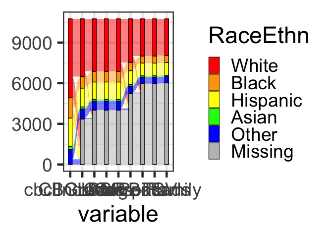
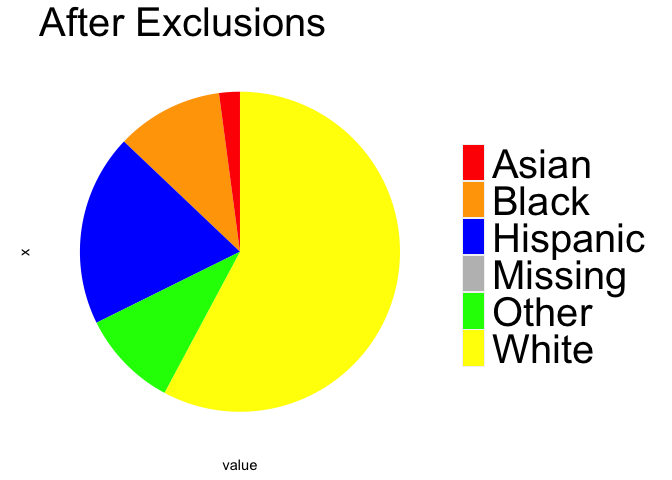

SampleConstruction
================
Adam
2023-01-25

This .rmd links ndar downloads into a master dataset. Cross-sectional
and temporal precedence datasets are be exported from this file (no
matched imaging groups needed, pooled factor decomposition).

``` r
#### load libraries
library(rapportools)
```

    ## 
    ## Attaching package: 'rapportools'

    ## The following objects are masked from 'package:stats':
    ## 
    ##     IQR, median, sd, var

    ## The following objects are masked from 'package:base':
    ## 
    ##     max, mean, min, range, sum

``` r
library(reshape2)
library(ggplot2)
library(ggalluvial)
```

``` r
###########∆∆∆∆∆∆∆∆∆∆∆∆∆∆∆∆∆∆∆∆∆∆∆##############
####  chunk 1 processes mental health data  ####
###########∆∆∆∆∆∆∆∆∆∆∆∆∆∆∆∆∆∆∆∆∆∆∆##############

### LOAD in cbcl data
cbcl=read.delim('~/Downloads/Package_1210940/abcd_cbcl01.txt')
cbcls=read.delim('~/Downloads/Package_1210940/abcd_cbcls01.txt')
# subset timepoints
cbclsBV=subset(cbcls,eventname=='baseline_year_1_arm_1')
cbcls2=subset(cbcls,eventname=='2_year_follow_up_y_arm_1')
# subset timepoints
cbclBV=subset(cbcl,eventname=='baseline_year_1_arm_1')
cbcl2=subset(cbcl,eventname=='2_year_follow_up_y_arm_1')
# merge with other cbcl
cbclsBV=merge(cbclsBV,cbclBV,by=c('subjectkey','eventname'))
cbcls2=merge(cbcls2,cbcl2,by=c('subjectkey','eventname'))

# initialize master df
masterdf<-merge(cbcls,cbcl,by=c('subjectkey','eventname','interview_age','src_subject_id','sex'))
# omit nans and empties for variables of interest (totprobs,int,ext)
masterdf=masterdf[!is.empty(masterdf$cbcl_scr_syn_totprob_r),]
masterdf=masterdf[!is.na(masterdf$cbcl_scr_syn_totprob_r),]
masterdf=masterdf[!is.empty(masterdf$cbcl_scr_syn_internal_r),]
masterdf=masterdf[!is.na(masterdf$cbcl_scr_syn_internal_r),]
masterdf=masterdf[!is.empty(masterdf$cbcl_scr_syn_external_r),]
masterdf=masterdf[!is.na(masterdf$cbcl_scr_syn_external_r),]

# initialize included subjects df
includedSubjects=data.frame(unique(masterdf$subjectkey))
colnames(includedSubjects)<-'subj'
includedSubjects$cbclInclude=1

# check for completeness at both timepoints- subset those timepoints
masterdf=masterdf[masterdf$eventname!='1_year_follow_up_y_arm_1',]
masterdf=masterdf[masterdf$eventname!='3_year_follow_up_y_arm_1',]
# calculate remaining subjs
cbclSubjs=length(unique(masterdf$subjectkey))
length(unique(masterdf$subjectkey))
```

    ## [1] 11827

``` r
# get other vars of interest to check for complete cases
KidVarsOfInt=c('cbcl_scr_syn_totprob_r','cbcl_scr_syn_external_r','cbcl_scr_syn_internal_r')

# only use subjects with both timepoints as complete cases
subjs=unique(masterdf$subjectkey)
for (s in subjs){
  # if there are less than two complete cases of the variables of interest
  if (sum(complete.cases(masterdf[masterdf$subjectkey==s,c(KidVarsOfInt)]))<2){
    subjs=subjs[subjs!=s]
  }
}

# exclude participants without data at both timepoints
cbclSubjs=length(unique(masterdf$subjectkey))
masterdf=masterdf[masterdf$subjectkey %in% subjs,]

# included subjs df
includedSubjects$CBCLBoth=0
includedSubjects[includedSubjects$subj %in% unique(masterdf$subjectkey),]$CBCLBoth=1

cbclSubjsBoth=length(unique(masterdf$subjectkey))
print(paste0(cbclSubjs-cbclSubjsBoth,' lost due to single-timepoint CBCL completeness'))
```

    ## [1] "3764 lost due to single-timepoint CBCL completeness"

``` r
###########∆∆∆∆∆∆∆∆∆∆∆∆∆∆∆∆∆∆∆∆∆∆∆##############
###   Chunk 2  processes  scholastic  data.  ###
###########∆∆∆∆∆∆∆∆∆∆∆∆∆∆∆∆∆∆∆∆∆∆∆##############

### LOAD in grades, ∆∆∆ will need to correct for incongruency between tp1 measure (decent granularity) and tp2 measure (high granularity) ∆∆∆
gradesInfoBV=read.delim('~/Downloads/Package_1210940/dibf01.txt')
# extract baseline
gradesInfoBV=subset(gradesInfoBV,eventname=='baseline_year_1_arm_1')
gradesInfoBV$Grades<-as.numeric(gradesInfoBV$kbi_p_grades_in_school)
# convert ndar value to R
gradesInfoBV$Grades[gradesInfoBV$Grades==-1]=NA
# ungraded NA for these analyses
gradesInfoBV$Grades[gradesInfoBV$Grades==6]=NA
# convert ndar colnames to other ndar colnames
# for tp2, the key is 1 = A's, 2 = B's, 3 = C's, 4 = D's, 5 = F's, 6 = ungraded, -1 = NA
gradesInfoY2=read.delim('~/Downloads/Package_1210940/abcd_saag01.txt')
gradesInfoY2=subset(gradesInfoY2,eventname=='2_year_follow_up_y_arm_1')
gradesInfoY2$sag_grade_type<-as.numeric(gradesInfoY2$sag_grade_type)
# key: 1=100-97,2=96-93,3=92-90,4=89-87,5=86-83,6=82-80,7=79-77,8=76-73,9=72-70,10=69-67,11=66-65,12=0-65,-1=NA,777= no answer
gradesInfoY2$sag_grade_type[gradesInfoY2$sag_grade_type==-1]=NA
gradesInfoY2$sag_grade_type[gradesInfoY2$sag_grade_type==777]=NA
# now convert to be equivalent with timepoint 1 grades measure
ind12=gradesInfoY2$sag_grade_type==12
ind11=gradesInfoY2$sag_grade_type==11
ind10=gradesInfoY2$sag_grade_type==10
ind9=gradesInfoY2$sag_grade_type==9
ind8=gradesInfoY2$sag_grade_type==8
ind7=gradesInfoY2$sag_grade_type==7
ind6=gradesInfoY2$sag_grade_type==6
ind5=gradesInfoY2$sag_grade_type==5
ind4=gradesInfoY2$sag_grade_type==4
ind3=gradesInfoY2$sag_grade_type==3
ind2=gradesInfoY2$sag_grade_type==2
ind1=gradesInfoY2$sag_grade_type==1
#### Set indices to low-res versions
# < 65 becomes failing
gradesInfoY2$sag_grade_type[ind12]=5
# 66-69 = Ds
gradesInfoY2$sag_grade_type[ind11]=4
gradesInfoY2$sag_grade_type[ind10]=4
# 70-79 = Cs
gradesInfoY2$sag_grade_type[ind7]=3
gradesInfoY2$sag_grade_type[ind8]=3
gradesInfoY2$sag_grade_type[ind9]=3
# 80-89 = Bs
gradesInfoY2$sag_grade_type[ind4]=2
gradesInfoY2$sag_grade_type[ind5]=2
gradesInfoY2$sag_grade_type[ind6]=2
# 90+ = As
gradesInfoY2$sag_grade_type[ind1]=1
gradesInfoY2$sag_grade_type[ind2]=1
gradesInfoY2$sag_grade_type[ind3]=1
gradesInfoY2$Grades<-gradesInfoY2$sag_grade_type

###### ∆∆∆∆∆∆∆ create grades info from both of em
NeededColNames=c('subjectkey','eventname','Grades')
gradesInfo<-rbind(gradesInfoBV[,NeededColNames],gradesInfoY2[,NeededColNames])
gradesInfo$Grades<-as.ordered(gradesInfo$Grades)

# merge and count losses
masterdf<-merge(masterdf,gradesInfo,by=c('subjectkey','eventname'))

# subjects with this measure at both timepoints
# only use subjects with both timepoints as complete cases
subjs=unique(masterdf$subjectkey)
for (s in subjs){
  # if there are less than two complete cases of the variables of interest
  if (sum(complete.cases(masterdf[masterdf$subjectkey==s,'Grades']))<2){
    subjs=subjs[subjs!=s]
  }
}

# exclude participants without data at both timepoints
masterdf=masterdf[masterdf$subjectkey %in% subjs,]

# omit nans and empties for variables of interest (totprobs,int,ext)
masterdf=masterdf[!is.empty(masterdf$Grades),]
masterdf=masterdf[!is.na(masterdf$Grades),]
gradesSubjs=length(unique(masterdf$subjectkey))
# add to included subjs DF
includedSubjects$Grades=0
includedSubjects[includedSubjects$subj %in% unique(masterdf$subjectkey),]$Grades=1
# print data volume
print(gradesSubjs)
```

    ## [1] 7348

``` r
dif=cbclSubjsBoth-gradesSubjs
print(paste0(dif,' participants lost from grades merge'))
```

    ## [1] "715 participants lost from grades merge"

``` r
# included subjs df
includedSubjects$Grades=0
includedSubjects[includedSubjects$subj %in% unique(masterdf$subjectkey),]$Grades=1
```

``` r
###########∆∆∆∆∆∆∆∆∆∆∆∆∆∆∆∆∆∆∆∆∆∆∆##############
#### Chunk 3 processes adult mental health ####
###########∆∆∆∆∆∆∆∆∆∆∆∆∆∆∆∆∆∆∆∆∆∆∆##############

### LOAD in ASR data
asr=read.delim('~/Downloads/Package_1210940/pasr01.txt',na.strings=c("","NA"))
# merge
masterdf<-merge(masterdf,asr,by=c('subjectkey','eventname','interview_age','sex'))
# check for populated data at BOTH timepoints
ColsOfInt=asr[,c(11:141)]
ASRVarsOfInt=colnames(ColsOfInt)
# only use subjects with both timepoints as complete cases
subjs=unique(masterdf$subjectkey)
for (s in subjs){
  # if there are less than two complete cases of the variables of interest
  if (sum(complete.cases(masterdf[masterdf$subjectkey==s,c(ASRVarsOfInt)]))<2){
    subjs=subjs[subjs!=s]
  }
}

masterdf=masterdf[masterdf$subjectkey %in% subjs,]

# full losses counted after asr count chunk, but note one participant is probably lost here just from merge
asrSubjs=length(unique(masterdf$subjectkey))
dif=gradesSubjs-asrSubjs
print(paste0(dif,' participants lost from needing ASR at both timepoints'))
```

    ## [1] "1 participants lost from needing ASR at both timepoints"

``` r
# included subjs df
includedSubjects$ASR=0
includedSubjects[includedSubjects$subj %in% unique(masterdf$subjectkey),]$ASR=1
```

``` r
###########∆∆∆∆∆∆∆∆∆∆∆∆∆∆∆∆∆∆∆∆∆∆∆##############
####  Chunk 4   processes family ID   data  ####
###########∆∆∆∆∆∆∆∆∆∆∆∆∆∆∆∆∆∆∆∆∆∆∆##############

# load in acs file for rel_family_ID
# get family ID from acs
acs=read.delim('~/Downloads/Package_1210940/acspsw03.txt')
acs$subjectkey<-acs$src_subject_id
acs=acs[,c('rel_family_id','subjectkey','eventname')]
# looks like all family IDs are missing from timepoint 1, so exclude for ease
acs=acs[acs$eventname=='baseline_year_1_arm_1',]
# and isolate family ID for ease
acs=data.frame(acs$subjectkey,acs$rel_family_id)
colnames(acs)=c('subjectkey','rel_family_id')
masterdf<-merge(masterdf,acs,by=c('subjectkey'))
# na omitted version
masterdf=masterdf[!is.na(masterdf$rel_family_id),] 
masterdf=masterdf[!is.empty(masterdf$rel_family_id),] 
acsSubjs=length(unique(masterdf$subjectkey))
# add to included subjs DF
includedSubjects$acs=0
includedSubjects[includedSubjects$subj %in% unique(masterdf$subjectkey),]$acs=1
# print data volume
print(acsSubjs)
```

    ## [1] 7346

``` r
dif=asrSubjs-acsSubjs
print(paste0(dif,' participants lost from ACS merge for family ID'))
```

    ## [1] "1 participants lost from ACS merge for family ID"

``` r
###########∆∆∆∆∆∆∆∆∆∆∆∆∆∆∆∆∆∆∆∆∆∆∆##############
### This  (short)  chunk formats   cbcl data ###
###########∆∆∆∆∆∆∆∆∆∆∆∆∆∆∆∆∆∆∆∆∆∆∆##############

### CLEAN data
# subjectkey as factor
masterdf$subjectkey<-as.factor(masterdf$subjectkey)
# convert cbcl scores to numeric
masterdf$cbcl_scr_syn_totprob_r<-as.numeric(masterdf$cbcl_scr_syn_totprob_r)
masterdf$cbcl_scr_syn_internal_r<-as.numeric(masterdf$cbcl_scr_syn_internal_r)
masterdf$cbcl_scr_syn_external_r<-as.numeric(masterdf$cbcl_scr_syn_external_r)
```

``` r
###########∆∆∆∆∆∆∆∆∆∆∆∆∆∆∆∆∆∆∆∆∆∆∆##############
####   Chunk 6 processes cognitive data    ####
###########∆∆∆∆∆∆∆∆∆∆∆∆∆∆∆∆∆∆∆∆∆∆∆##############

#### LOAD in cognitive data
nihCog=read.delim('~/Downloads/Package_1210940/abcd_tbss01.txt')
othCog=read.delim('~/Downloads/Package_1210940/abcd_ps01.txt')
littleMan=read.delim('~/Downloads/Package_1210940/lmtp201.txt')

# merge in
masterdf<-merge(masterdf,nihCog,by=c('subjectkey','eventname','interview_age','sex'))
```

    ## Warning in merge.data.frame(masterdf, nihCog, by = c("subjectkey", "eventname",
    ## : column names 'collection_id.x', 'dataset_id.x', 'interview_date.x',
    ## 'collection_title.x', 'collection_id.y', 'dataset_id.y', 'interview_date.y',
    ## 'collection_title.y' are duplicated in the result

``` r
newList=length(unique(masterdf$subjectkey))
print(paste0(newList,' after merging nih toolbox, ',(acsSubjs- newList),' lost after merge'))
```

    ## [1] "7346 after merging nih toolbox, 0 lost after merge"

``` r
masterdf<-merge(masterdf,othCog,by=c('subjectkey','eventname','interview_age','sex'))
```

    ## Warning in merge.data.frame(masterdf, othCog, by = c("subjectkey", "eventname",
    ## : column names 'collection_id.x', 'dataset_id.x', 'interview_date.x',
    ## 'collection_title.x', 'collection_id.y', 'dataset_id.y', 'src_subject_id.x',
    ## 'interview_date.y', 'collection_title.y', 'src_subject_id.y' are duplicated in
    ## the result

``` r
newList2=length(unique(masterdf$subjectkey))
print(paste0(newList2,' after merging other cognitive measures, ',(newList- newList2),' lost after merge'))
```

    ## [1] "7346 after merging other cognitive measures, 0 lost after merge"

``` r
masterdf<-merge(masterdf,littleMan,by=c('subjectkey','eventname','interview_age','sex'))
```

    ## Warning in merge.data.frame(masterdf, littleMan, by = c("subjectkey",
    ## "eventname", : column names 'collection_id.x', 'dataset_id.x',
    ## 'interview_date.x', 'collection_title.x', 'collection_id.y', 'dataset_id.y',
    ## 'src_subject_id.x', 'interview_date.y', 'collection_title.y',
    ## 'collection_id.x', 'dataset_id.x', 'src_subject_id.y', 'interview_date.x',
    ## 'collection_title.x', 'collection_id.y', 'dataset_id.y', 'interview_date.y',
    ## 'collection_title.y' are duplicated in the result

``` r
newList3=length(unique(masterdf$subjectkey))
print(paste0(newList3,' after merging little man, ',(newList2 - newList3),' lost after merge'))
```

    ## [1] "7346 after merging little man, 0 lost after merge"

``` r
# clean age
masterdf$interview_age<-as.numeric(masterdf$interview_age)
masterdf$interview_age<-as.numeric(masterdf$interview_age)/12
```

``` r
###########∆∆∆∆∆∆∆∆∆∆∆∆∆∆∆∆∆∆∆∆∆∆∆##############
## Chunk 7 preps for cognition factorization ###
###########∆∆∆∆∆∆∆∆∆∆∆∆∆∆∆∆∆∆∆∆∆∆∆##############

# use thompson 2019 recreation of non nih-tb measures
ind_pea_ravlt = c(which(names(masterdf)=="pea_ravlt_sd_trial_i_tc"),which(names(masterdf)=="pea_ravlt_sd_trial_ii_tc"),
    which(names(masterdf)=="pea_ravlt_sd_trial_iii_tc"),which(names(masterdf)=="pea_ravlt_sd_trial_iv_tc"),
    which(names(masterdf)=="pea_ravlt_sd_trial_v_tc")); names(masterdf)[ind_pea_ravlt];
```

    ## [1] "pea_ravlt_sd_trial_i_tc"   "pea_ravlt_sd_trial_ii_tc" 
    ## [3] "pea_ravlt_sd_trial_iii_tc" "pea_ravlt_sd_trial_iv_tc" 
    ## [5] "pea_ravlt_sd_trial_v_tc"

``` r
# set numbers to numeric
masterdf$pea_ravlt_sd_trial_i_tc=as.numeric(masterdf$pea_ravlt_sd_trial_i_tc)
masterdf$pea_ravlt_sd_trial_ii_tc=as.numeric(masterdf$pea_ravlt_sd_trial_ii_tc)
masterdf$pea_ravlt_sd_trial_iii_tc=as.numeric(masterdf$pea_ravlt_sd_trial_iii_tc)
masterdf$pea_ravlt_sd_trial_iv_tc=as.numeric(masterdf$pea_ravlt_sd_trial_vi_tc)
masterdf$pea_ravlt_sd_trial_v_tc=as.numeric(masterdf$pea_ravlt_sd_trial_v_tc)

# total correct across trials
masterdf$pea_ravlt_ld = masterdf$pea_ravlt_sd_trial_i_tc + masterdf$pea_ravlt_sd_trial_ii_tc + masterdf$pea_ravlt_sd_trial_iii_tc + masterdf$pea_ravlt_sd_trial_iv_tc + masterdf$pea_ravlt_sd_trial_v_tc

# change to numeric
masterdf$nihtbx_picvocab_uncorrected<-as.numeric(masterdf$nihtbx_picvocab_uncorrected)
masterdf$nihtbx_flanker_uncorrected<-as.numeric(masterdf$nihtbx_flanker_uncorrected)
masterdf$nihtbx_list_uncorrected<-as.numeric(masterdf$nihtbx_list_uncorrected)
masterdf$nihtbx_cardsort_uncorrected<-as.numeric(masterdf$nihtbx_cardsort_uncorrected)
masterdf$nihtbx_pattern_uncorrected<-as.numeric(masterdf$nihtbx_pattern_uncorrected)
masterdf$nihtbx_picture_uncorrected<-as.numeric(masterdf$nihtbx_picture_uncorrected)
masterdf$nihtbx_reading_uncorrected<-as.numeric(masterdf$nihtbx_reading_uncorrected)
masterdf$pea_wiscv_tss<-as.numeric(masterdf$pea_wiscv_tss)
masterdf$lmt_scr_perc_correct<-as.numeric(masterdf$lmt_scr_perc_correct)

# for isolating PCA dataframe
pcVars=c("nihtbx_picvocab_uncorrected","nihtbx_flanker_uncorrected","nihtbx_pattern_uncorrected","nihtbx_picture_uncorrected","nihtbx_reading_uncorrected","pea_ravlt_ld","lmt_scr_perc_correct")

# only use subjects with both timepoints as complete cases
subjs=unique(masterdf$subjectkey)
for (s in subjs){
  # if there are less than two complete cases of the variables of interest
  if (sum(complete.cases(masterdf[masterdf$subjectkey==s,c(pcVars)]))<2){
    subjs=subjs[subjs!=s]
  }
}
# convert masterdf to df with complete observations for cognition
masterdf=masterdf[masterdf$subjectkey %in% subjs,]
newList4=length(unique(masterdf$subjectkey))
print(paste0(newList4,' after retaining only subjs with Cognitive vars of interest at BOTH timepoints, ',(newList3- newList4),' lost after removing'))
```

    ## [1] "5994 after retaining only subjs with Cognitive vars of interest at BOTH timepoints, 1352 lost after removing"

``` r
# populated included subjs df
includedSubjects$CogBoth=0
includedSubjects[includedSubjects$subj %in% unique(masterdf$subjectkey),]$CogBoth=1
```

``` r
###########∆∆∆∆∆∆∆∆∆∆∆∆∆∆∆∆∆∆∆∆∆∆∆##############
###  Chunk 8 preps by selecting 1 per family ###
###########∆∆∆∆∆∆∆∆∆∆∆∆∆∆∆∆∆∆∆∆∆∆∆##############
# finish cleaning data for sherlock runs: one family member per family to facilitate random sample
masterdf$id_fam = NULL
# default value of family size (# of children in abcd study)
masterdf$fam_size = 1

# counter index
ind=0

# set each instance of multiple family members to a family ID, as ind
set.seed(1)
for(f in 1:length(unique(masterdf$rel_family_id))){
  # calculate family size
  famsize=sum(masterdf$rel_family_id == unique(masterdf$rel_family_id)[f]) / 2
  masterdf$fam_size[masterdf$rel_family_id == unique(masterdf$rel_family_id)[f]] = famsize
  # note that each  person is represented twice at this point:
  # divide by 2 to take number of visits to number of people, if there's more than 2x visits per family ID, izza family
  # this logic gets hairy. Starting from outside in: > 1 is family size >1, /2 is divided by 2 for two visits, [f] is unique familyID, rel_family_id is place in column of masterdf
  if(famsize>1){
    # remove one from instances where family-id = this relative family id (sequence for siblings, 1:size(Family))
    #print(paste0('family size ',famsize))
    # keep one sib
    kept=sample(seq(1,famsize),1)
    #print(paste0('kept ',kept))
    # use to select one subject id
    famIDs=unique(masterdf$subjectkey[masterdf$rel_family_id == unique(masterdf$rel_family_id)[f]])
    # chosen sib
    keeper=famIDs[kept]
    left=famIDs[-c(kept)]
    # leave rest
    masterdf=masterdf[!masterdf$subjectkey %in% left,] 
    # calc index of family
    ind=ind+1   
    # set index of family
    masterdf$id_fam[masterdf$rel_family_id == unique(masterdf$rel_family_id)[f]] = ind
  } 
}

# make family ID for those with families represented in ABCD
masterdf$rel_family_id=masterdf$id_fam

newList5=length(unique(masterdf$subjectkey))
print(paste0(newList5,' after retaining only one subjs per family, ',(newList4- newList5),' lost after removing'))
```

    ## [1] "5214 after retaining only one subjs per family, 780 lost after removing"

``` r
# included subjects DF to track subj loss
includedSubjects$OnePerFamily=0
includedSubjects[includedSubjects$subj %in% unique(masterdf$subjectkey),]$OnePerFamily=1

# pea_wiscv_tss, nihtbx_list_uncorrected, and nihtbx_cardsort_uncorrected taken out for lack of longitudinal coverage
pcaDf<-masterdf[,pcVars]
```

``` r
###########∆∆∆∆∆∆∆∆∆∆∆∆∆∆∆∆∆∆∆∆∆∆∆##############
### Chunk 9: it runs cognition factorization ###
###########∆∆∆∆∆∆∆∆∆∆∆∆∆∆∆∆∆∆∆∆∆∆∆##############

# derive pcs
Y = as.matrix(scale(pcaDf[complete.cases(pcaDf[,pcVars]),pcVars]))
# equiv for binding scores to IDs and eventnames
pcVarsAndIDs=c("nihtbx_picvocab_uncorrected","nihtbx_flanker_uncorrected","nihtbx_pattern_uncorrected","nihtbx_picture_uncorrected","nihtbx_reading_uncorrected","pea_ravlt_ld","lmt_scr_perc_correct","subjectkey","eventname")
Yextended=masterdf[complete.cases(masterdf[,pcVarsAndIDs]),pcVarsAndIDs]
ncomp = 3
y.pca = psych::principal(Y, rotate="varimax", nfactors=ncomp, scores=TRUE)
y.pca$loadings
```

    ## 
    ## Loadings:
    ##                             RC1   RC2   RC3  
    ## nihtbx_picvocab_uncorrected 0.816 0.146 0.224
    ## nihtbx_flanker_uncorrected  0.184 0.790      
    ## nihtbx_pattern_uncorrected  0.104 0.833 0.139
    ## nihtbx_picture_uncorrected        0.278 0.812
    ## nihtbx_reading_uncorrected  0.857 0.177 0.126
    ## pea_ravlt_ld                0.294       0.797
    ## lmt_scr_perc_correct        0.456 0.477 0.164
    ## 
    ##                  RC1   RC2   RC3
    ## SS loadings    1.746 1.675 1.415
    ## Proportion Var 0.249 0.239 0.202
    ## Cumulative Var 0.249 0.489 0.691

``` r
# assign scores to subjs
Yextended$g<-y.pca$scores[,1]

# merge in cog data
masterdf$g<-Yextended$g
```

``` r
###########∆∆∆∆∆∆∆∆∆∆∆∆∆∆∆∆∆∆∆∆∆∆∆##############
## Chunk 10 subjects with data at both timepoints##
###########∆∆∆∆∆∆∆∆∆∆∆∆∆∆∆∆∆∆∆∆∆∆∆##############

# exclude subjs without data for both timepoints
OutDFsubjects=length(unique(masterdf$subjectkey))
OutDFBV=subset(masterdf,eventname=='baseline_year_1_arm_1')
OutDF2Y=subset(masterdf,eventname=='2_year_follow_up_y_arm_1')
# intersection of subjs in both
BothTPsubjs=intersect(OutDFBV$subjectkey,OutDF2Y$subjectkey)
Different=setdiff(unique(masterdf$subjectkey),BothTPsubjs)
# print sanity check subjs lost to another check of both tps populated
newList6=length(unique(BothTPsubjs))
dif=newList5-newList6
print(paste0(dif,' rows lost from only using subjs with both timepoints'))
```

    ## [1] "0 rows lost from only using subjs with both timepoints"

``` r
###########∆∆∆∆∆∆∆∆∆∆∆∆∆∆∆∆∆∆∆∆∆∆∆##############
## Chunk 11 calculates adult mental health    ##
###########∆∆∆∆∆∆∆∆∆∆∆∆∆∆∆∆∆∆∆∆∆∆∆##############
# make count version of adult P
ASRdfNum<-as.data.frame(lapply(asr[-1,11:141],as.numeric))
ASRtotal=rowSums(ASRdfNum)

ASRAnxDepr=ASRdfNum$asr_q12_p+ASRdfNum$asr_q13_p+ASRdfNum$asr_q14_p+ASRdfNum$asr_q22_p+ASRdfNum$asr_q31_p+ASRdfNum$asr_q33_p+ASRdfNum$asr_q34_p+ASRdfNum$asr_q35_p+ASRdfNum$asr_q45_p+ASRdfNum$asr_q47_p+ASRdfNum$asr_q50_p+ASRdfNum$asr_q71_p+ASRdfNum$asr_q91_p+ASRdfNum$asr_q103_p+ASRdfNum$asr_q107_p+ASRdfNum$asr_q112_p+ASRdfNum$asr_q113_p

ASRWithdrawn=ASRdfNum$asr_q25_p+ASRdfNum$asr_q30_p+ASRdfNum$asr_q42_p+ASRdfNum$asr_q48_p+ASRdfNum$asr_q60_p+ASRdfNum$asr_q65_p+ASRdfNum$asr_q67_p+ASRdfNum$asr_q69_p+ASRdfNum$asr_q111_p

ASRSomatic=ASRdfNum$asr_q51_p+ASRdfNum$asr_q56a_p+ASRdfNum$asr_q56b_p+ASRdfNum$asr_q56c_p+ASRdfNum$asr_q56e_p+ASRdfNum$asr_q56f_p+ASRdfNum$asr_q56g_p+ASRdfNum$asr_q56h_p+ASRdfNum$asr_q56i_p+ASRdfNum$asr_q100_p

ASRThought=ASRdfNum$asr_q09_p+ASRdfNum$asr_q18_p+ASRdfNum$asr_q36_p+ASRdfNum$asr_q40_p+ASRdfNum$asr_q46_p+ASRdfNum$asr_q63_p+ASRdfNum$asr_q66_p+ASRdfNum$asr_q70_p+ASRdfNum$asr_q80_p+ASRdfNum$asr_q84_p+ASRdfNum$asr_q85_p+ASRdfNum$asr_q91_p

ASRAttn=ASRdfNum$asr_q01_p+ASRdfNum$asr_q08_p+ASRdfNum$asr_q11_p+ASRdfNum$asr_q13_p+ASRdfNum$asr_q17_p+ASRdfNum$asr_q53_p+ASRdfNum$asr_q59_p+ASRdfNum$asr_q61_p+ASRdfNum$asr_q64_p+ASRdfNum$asr_q78_p+ASRdfNum$asr_q96_p+ASRdfNum$asr_q101_p+ASRdfNum$asr_q102_p+ASRdfNum$asr_q105_p+ASRdfNum$asr_q108_p+ASRdfNum$asr_q119_p+ASRdfNum$asr_q121_p

ASRRulB=ASRdfNum$asr_q06_p+ASRdfNum$asr_q20_p+ASRdfNum$asr_q23_p+ASRdfNum$asr_q26_p+ASRdfNum$asr_q39_p+ASRdfNum$asr_q41_p+ASRdfNum$asr_q43_p+ASRdfNum$asr_q76_p+ASRdfNum$asr_q82_p+ASRdfNum$asr_q90_p+ASRdfNum$asr_q92_p+ASRdfNum$asr_q114_p+ASRdfNum$asr_q117_p+ASRdfNum$asr_q122_p

ASRAggr=ASRdfNum$asr_q03_p+ASRdfNum$asr_q05_p+ASRdfNum$asr_q16_p+ASRdfNum$asr_q28_p+ASRdfNum$asr_q37_p+ASRdfNum$asr_q55_p+ASRdfNum$asr_q57_p+ASRdfNum$asr_q68_p+ASRdfNum$asr_q81_p+ASRdfNum$asr_q86_p+ASRdfNum$asr_q87_p+ASRdfNum$asr_q95_p+ASRdfNum$asr_q97_p+ASRdfNum$asr_q113_p+ASRdfNum$asr_q116_p+ASRdfNum$asr_q118_p+ASRdfNum$asr_q06_p+ASRdfNum$asr_q20_p+ASRdfNum$asr_q23_p+ASRdfNum$asr_q26_p+ASRdfNum$asr_q39_p+ASRdfNum$asr_q41_p+ASRdfNum$asr_q43_p+ASRdfNum$asr_q76_p+ASRdfNum$asr_q82_p+ASRdfNum$asr_q90_p+ASRdfNum$asr_q92_p+ASRdfNum$asr_q114_p+ASRdfNum$asr_q117_p+ASRdfNum$asr_q122_p

# now internalizing and externalizing, to be equivalent with children
ASRInt=ASRWithdrawn+ASRSomatic

ASRExt=ASRAggr+ASRRulB
# and subtract reverse score items because they were included in sum above, and modeling "happiness" as symmetric to "symptoms" seems like a strong assumption
# reverse scored = face validity AND loading in expected direction
ASRtotal=ASRtotal-ASRdfNum$asr_q02_p
ASRtotal=ASRtotal-ASRdfNum$asr_q04_p
ASRtotal=ASRtotal-ASRdfNum$asr_q15_p
ASRtotal=ASRtotal-ASRdfNum$asr_q73_p
ASRtotal=ASRtotal-ASRdfNum$asr_q80_p
ASRtotal=ASRtotal-ASRdfNum$asr_q88_p
ASRtotal=ASRtotal-ASRdfNum$asr_q106_p
ASRtotal=ASRtotal-ASRdfNum$asr_q109_p
ASRtotal=ASRtotal-ASRdfNum$asr_q123_p

# merge in (first row is colnames)
asr$parentPcount=c(NA,ASRtotal)
asr$ASRAnxDepr=c(NA,ASRAnxDepr)
asr$ASRWithdrawn=c(NA,ASRWithdrawn)
asr$ASRSomatic=c(NA,ASRSomatic)
asr$ASRThought=c(NA,ASRThought)
asr$ASRAttn=c(NA,ASRAttn)
asr$ASRAggr=c(NA,ASRAggr)
asr$ASRRulB=c(NA,ASRRulB)
asr$ASRInt=c(NA,ASRInt)
asr$ASRExt=c(NA,ASRExt)
#

# fix asr age for merge
asr$interview_age=as.numeric(asr$interview_age)/12
```

    ## Warning: NAs introduced by coercion

``` r
# set subjectkey to factor for merge
asr$subjectkey<-as.factor(asr$subjectkey)

# ensure none are missing
paste0(length(unique(masterdf$subjectkey)))
```

    ## [1] "5214"

``` r
# collapse to just variables of interest to prevent duplicate variables
asr=asr[,c('parentPcount','subjectkey','eventname','interview_age','ASRAnxDepr','ASRWithdrawn','ASRSomatic','ASRThought','ASRAttn','ASRAggr','ASRRulB','ASRInt','ASRExt')]
# merge
masterdf=merge(masterdf,asr,by=c('subjectkey','eventname','interview_age'))
```

    ## Warning in merge.data.frame(masterdf, asr, by = c("subjectkey", "eventname", :
    ## column names 'collection_id.x', 'dataset_id.x', 'interview_date.x',
    ## 'collection_title.x', 'collection_id.y', 'dataset_id.y', 'src_subject_id.x',
    ## 'interview_date.y', 'collection_title.y', 'collection_id.x', 'dataset_id.x',
    ## 'src_subject_id.y', 'interview_date.x', 'collection_title.x',
    ## 'collection_id.y', 'dataset_id.y', 'interview_date.y', 'collection_title.y' are
    ## duplicated in the result

``` r
# ensure none are missing
paste0(length(unique(masterdf$subjectkey)))
```

    ## [1] "5214"

``` r
###########∆∆∆∆∆∆∆∆∆∆∆∆∆∆∆∆∆∆∆∆∆∆∆##############
## Chunk 12 Handles participants TSV          ##
###########∆∆∆∆∆∆∆∆∆∆∆∆∆∆∆∆∆∆∆∆∆∆∆##############

### LOAD in ParticipantsTSV for parent income and edu background
# ordained sample split
participantsTSV=read.delim('~/Downloads/participants.tsv',sep="\t")
participantsTSV$subjectkey<-participantsTSV$participant_id
# reformat participant IDs so they match everything else
participantsTSV$subjectkey<-gsub('sub-','',participantsTSV$subjectkey)
participantsTSV$subjectkey<-as.factor(gsub('NDARINV','NDAR_INV',participantsTSV$subjectkey))
participantsTSV$eventname=participantsTSV$session_id
### issue where subjects are repeated. Rows are not identical either.
# query. get table of subject ids
b=table(as.factor(participantsTSV$participant_id))
# report subj ids used more than once and times used
bdf=data.frame(b[b>1])
SubjsRepeated=bdf$Var1
# well some rows with the same participant IDs have different sites, can't use that unless it makes sense
dimB4repRem=dim(participantsTSV)
# remove repeated subjs
participantsTSV=participantsTSV[!participantsTSV$participant_id %in% SubjsRepeated,]
dif=dimB4repRem[1]-dim(participantsTSV)[1]
print(paste0(dif/2,' Participants lost from ambiguously repeated pt ids in participants.tsv'))
```

    ## [1] "44 Participants lost from ambiguously repeated pt ids in participants.tsv"

``` r
# well some rows with the same participant IDs have different sites, can't use that unless it makes sense\
dimB4repRem=dim(participantsTSV)
# remove repeated subjs
participantsTSV=participantsTSV[!participantsTSV$participant_id %in% SubjsRepeated,]
# remove eventname column from participants tsv, not informative and causes problems down the road
participantsTSV = participantsTSV[,!(names(participantsTSV) %in% 'eventname')]
# convert sex to M/F in particpants tsv
participantsTSV$sex[participantsTSV$sex==1]="M"
participantsTSV$sex[participantsTSV$sex==2]="F"

# take out na incomes
participantsTSV=participantsTSV[participantsTSV$income!=777,]
participantsTSV=participantsTSV[participantsTSV$income!=999,]
# race
participantsTSV=participantsTSV[participantsTSV$race_ethnicity!=888,]
participantsTSV$race_ethnicity<-as.factor(participantsTSV$race_ethnicity)
# parental edu
participantsTSV=participantsTSV[participantsTSV$parental_education!=888,]
participantsTSV=participantsTSV[participantsTSV$parental_education!=777,]
participantsTSV$parental_education<-as.ordered(participantsTSV$parental_education)


### merge in for fam income and parent edu
masterdf=merge(masterdf,participantsTSV,by=c('subjectkey','sex'))
```

    ## Warning in merge.data.frame(masterdf, participantsTSV, by = c("subjectkey", :
    ## column names 'collection_id.x', 'dataset_id.x', 'interview_date.x',
    ## 'collection_title.x', 'collection_id.y', 'dataset_id.y', 'src_subject_id.x',
    ## 'interview_date.y', 'collection_title.y', 'collection_id.x', 'dataset_id.x',
    ## 'src_subject_id.y', 'interview_date.x', 'collection_title.x',
    ## 'collection_id.y', 'dataset_id.y', 'interview_date.y', 'collection_title.y' are
    ## duplicated in the result

``` r
participantsTSVSubjs=length(unique(masterdf$subjectkey))
# add to included subjs DF
includedSubjects$pTSV=0
includedSubjects[includedSubjects$subj %in% unique(masterdf$subjectkey),]$pTSV=1

print(paste0(newList6-participantsTSVSubjs,' participants lost after needing complete data in participantstsv'))
```

    ## [1] "432 participants lost after needing complete data in participantstsv"

``` r
paste0(participantsTSVSubjs,' remain')
```

    ## [1] "4782 remain"

``` r
###########∆∆∆∆∆∆∆∆∆∆∆∆∆∆∆∆∆∆∆∆∆∆∆##############
## Chunk 9: higher-resolution demographics     ##
###########∆∆∆∆∆∆∆∆∆∆∆∆∆∆∆∆∆∆∆∆∆∆∆##############

#### get more fine-grained demographics
fg_demo=read.delim('~/Downloads/Package_1223147/abcd_lpds01.txt',sep="\t")
# INR is Household Income : Poverty line for this # of people
# convert Household income
HouseholdIncome=as.factor(fg_demo$demo_comb_income_v2_l)
# to be replaced with numerican "median" income
fg_demo$HouseholdIncome=NULL
# to be replace with number of household members
fg_demo$NumPeeps=NULL
# to be replaced with number of people-specific poverty line
fg_demo$PL=NULL
# to be replaced with INR
fg_demo$INR=NULL

# 1 is less than 5k
fg_demo$HouseholdIncome[fg_demo$demo_comb_income_v2_l==1]=median(c(0,5000))
# 2 is 5-12k
fg_demo$HouseholdIncome[fg_demo$demo_comb_income_v2_l==2]=median(c(5000,11999))
# 3 is 12-16k
fg_demo$HouseholdIncome[fg_demo$demo_comb_income_v2_l==3]=median(c(12000,15999))
# 4 is 16-25k
fg_demo$HouseholdIncome[fg_demo$demo_comb_income_v2_l==4]=median(c(16000,24999))
# 5 25-35 k
fg_demo$HouseholdIncome[fg_demo$demo_comb_income_v2_l==5]=median(c(25000,34999))
# 6 35-50 k
fg_demo$HouseholdIncome[fg_demo$demo_comb_income_v2_l==6]=median(c(35000,49999))
# 7 50-75 k
fg_demo$HouseholdIncome[fg_demo$demo_comb_income_v2_l==7]=median(c(50000,74999))
# 8 75-100 k
fg_demo$HouseholdIncome[fg_demo$demo_comb_income_v2_l==8]=median(c(75000,99999))
# 9 100-200 k
fg_demo$HouseholdIncome[fg_demo$demo_comb_income_v2_l==9]=median(c(100000,199999))
# 10 > 200k: note 500k is top bound for median purposes
fg_demo$HouseholdIncome[fg_demo$demo_comb_income_v2_l==10]=median(c(200000,500000))
# 999 idk
fg_demo$HouseholdIncome[fg_demo$demo_comb_income_v2_l==999]=NA
# 777 refuse to answer
fg_demo$HouseholdIncome[fg_demo$demo_comb_income_v2_l==777]=NA
# convert number of people
fg_demo$NumPeeps=as.numeric(fg_demo$demo_roster_v2_l)
# Separate out income bins to match to their poverty line: https://aspe.hhs.gov/topics/poverty-economic-mobility/poverty-guidelines/prior-hhs-poverty-guidelines-federal-register-references/2017-poverty-guidelines
# 12,060 for 1 (note 1 should not be included in analyses, indicates child does not live there)
fg_demo$PL[fg_demo$NumPeeps==1]=12060
# 16,240 for 2
fg_demo$PL[fg_demo$NumPeeps==2]=16240
# 20,420 for 3
fg_demo$PL[fg_demo$NumPeeps==3]=20420
# 24,600 for 4
fg_demo$PL[fg_demo$NumPeeps==4]=24600
# 28,780 for 5
fg_demo$PL[fg_demo$NumPeeps==5]=28780
# 32,960 for 6
fg_demo$PL[fg_demo$NumPeeps==6]=32960
# 37,140 for 7
fg_demo$PL[fg_demo$NumPeeps==7]=37140
# 41,320 for 8
fg_demo$PL[fg_demo$NumPeeps==8]=41320
# 41,320 + 4,180 for 9
fg_demo$PL[fg_demo$NumPeeps==9]=45300
# 41,320 + 2*(4,180) for 10
fg_demo$PL[fg_demo$NumPeeps==10]=49480
# 41,320 + 3*(4,180) for 11
fg_demo$PL[fg_demo$NumPeeps==11]=53660
# 41,320 + 4*(4,180) for 12
fg_demo$PL[fg_demo$NumPeeps==12]=57840
# 41,320 + 5*(4,180) for 13
fg_demo$PL[fg_demo$NumPeeps==13]=62020
# 41,320 + 6*(4,180) for 14
fg_demo$PL[fg_demo$NumPeeps==14]=66200
# 41,320 + 7*(4,180) for 15
fg_demo$PL[fg_demo$NumPeeps==15]=70380
# 41,320 + 8*(4,180) for 16
fg_demo$PL[fg_demo$NumPeeps==16]=74560

# drop interview age for merge
fg_demo <- fg_demo[, !(names(fg_demo) %in% "interview_age")]
# drop eventname for merge
fg_demo <- fg_demo[, !(names(fg_demo) %in% "eventname")]


# INR is Household Income : Poverty line for this # of people
fg_demo$INR=fg_demo$HouseholdIncome/fg_demo$PL
# new pov classification
fg_demo$Pov_v2=as.numeric(fg_demo$HouseholdIncome<fg_demo$PL)

# retain only those with actual INR data
fg_demo=fg_demo[!is.na(fg_demo$INR),]

# number of rows should be = number of unique subjects
duplicated_rows <- duplicated(fg_demo$subjectkey)
fg_demo_unique <- fg_demo[!(duplicated_rows & is.na(fg_demo$INR)), ]

# now populate both observations in masterdf
masterdf$Pov_v2 <- 0
masterdf$INR <- NA
masterdf$NumPeeps <-NA
masterdf$HouseholdIncome <- NA

# loop over each subject in masterdf
for (subject in unique(fg_demo_unique$subjectkey)) {
  subjrow=fg_demo_unique[fg_demo_unique$subjectkey == subject,]
  # insert
  masterdf$Pov_v2[masterdf$src_subject_id.x == subject] <- subjrow$Pov_v2
  masterdf$INR[masterdf$src_subject_id.x == subject] <- subjrow$INR
  masterdf$NumPeeps[masterdf$src_subject_id.x == subject] <- subjrow$NumPeeps
  masterdf$HouseholdIncome[masterdf$src_subject_id.x == subject] <- subjrow$HouseholdIncome
}

# omit missing values
masterdf=masterdf[!is.na(masterdf$INR),]

# new merge and count
parentDemo_TSVSubjs=length(unique(masterdf$subjectkey))
# add to included subjs DF
includedSubjects$PD=0
includedSubjects[includedSubjects$subj %in% unique(masterdf$subjectkey),]$PD=1

print(paste0(participantsTSVSubjs-parentDemo_TSVSubjs,' participants lost after needing complete data in Parent demographics'))
```

    ## [1] "57 participants lost after needing complete data in Parent demographics"

``` r
paste0(parentDemo_TSVSubjs,' remain')
```

    ## [1] "4725 remain"

``` r
#########################
#########################
#########################
# this dataframe is now your working data frame for main figure RMDs
saveRDS(masterdf,'~/gp_masterdf.rds')
####################
#########################
#########################
#########################
```

``` r
###################∆∆∆∆∆∆∆∆∆∆∆∆∆∆∆∆∆∆∆∆∆∆∆##############
##  Chunk 10 saves out clinical thresholds for boots  ##
###################∆∆∆∆∆∆∆∆∆∆∆∆∆∆∆∆∆∆∆∆∆∆∆##############
# pull clinical cutoff from master df: t scores > 65 = borderline clinical, 69 = clinical
masterdfP_bc<-masterdf[masterdf$cbcl_scr_syn_totprob_t==65,]
masterdfP_c<-masterdf[masterdf$cbcl_scr_syn_totprob_t==69,]
masterdfI_bc<-masterdf[masterdf$cbcl_scr_syn_internal_t==65,]
masterdfI_c<-masterdf[masterdf$cbcl_scr_syn_internal_t==69,]
masterdfE_bc<-masterdf[masterdf$cbcl_scr_syn_external_t==65,]
masterdfE_c<-masterdf[masterdf$cbcl_scr_syn_external_t==69,]
masterdfAnx_bc<-masterdf[masterdf$cbcl_scr_syn_anxdep_t==65,]
masterdfAnx_c<-masterdf[masterdf$cbcl_scr_syn_anxdep_t==69,]
# note no one has t==65 in this dataset for thought
masterdfTho_bc<-masterdf[masterdf$cbcl_scr_syn_thought_t==66,]
masterdfTho_c<-masterdf[masterdf$cbcl_scr_syn_thought_t==69,]
# note no one has t==65 in this dataset for withdrawn depression
masterdfWit_bc<-masterdf[masterdf$cbcl_scr_syn_withdep_t==66,]
masterdfWit_c<-masterdf[masterdf$cbcl_scr_syn_withdep_t==69,]
masterdfSom_bc<-masterdf[masterdf$cbcl_scr_syn_somatic_t==65,]
# no one has t==69
masterdfSom_c<-masterdf[masterdf$cbcl_scr_syn_somatic_t==70,]
masterdfSoc_bc<-masterdf[masterdf$cbcl_scr_syn_social_t==65,]
masterdfSoc_c<-masterdf[masterdf$cbcl_scr_syn_social_t==69,]
masterdfAtt_bc<-masterdf[masterdf$cbcl_scr_syn_attention_t==65,]
masterdfAtt_c<-masterdf[masterdf$cbcl_scr_syn_attention_t==69,]
masterdfRul_bc<-masterdf[masterdf$cbcl_scr_syn_rulebreak_t==65,]
masterdfRul_c<-masterdf[masterdf$cbcl_scr_syn_rulebreak_t==69,]
masterdfAgg_bc<-masterdf[masterdf$cbcl_scr_syn_aggressive_t==65,]
masterdfAgg_c<-masterdf[masterdf$cbcl_scr_syn_aggressive_t==69,]

# borderline clinical and clinical cutoffs
Pbc=mean(masterdfP_bc$cbcl_scr_syn_totprob_r)
Pc=mean(masterdfP_c$cbcl_scr_syn_totprob_r)
Ibc=mean(masterdfP_bc$cbcl_scr_syn_internal_r)
Ic=mean(masterdfP_c$cbcl_scr_syn_internal_r)
Ebc=mean(masterdfE_bc$cbcl_scr_syn_external_r)
Ec=mean(masterdfE_c$cbcl_scr_syn_external_r)
AnxBc=mean(as.numeric(masterdfAnx_bc$cbcl_scr_syn_anxdep_r))
AnxC=mean(as.numeric(masterdfAnx_c$cbcl_scr_syn_anxdep_r))
ThoBc=mean(as.numeric(masterdfTho_bc$cbcl_scr_syn_thought_r))
ThoC=mean(as.numeric(masterdfTho_c$cbcl_scr_syn_thought_r))
WitBc=mean(as.numeric(masterdfWit_bc$cbcl_scr_syn_withdep_r))
WitC=mean(as.numeric(masterdfWit_c$cbcl_scr_syn_withdep_r))
SomBc=mean(as.numeric(masterdfSom_bc$cbcl_scr_syn_somatic_r))
SomC=mean(as.numeric(masterdfSom_c$cbcl_scr_syn_somatic_r))
SocBc=mean(as.numeric(masterdfSom_bc$cbcl_scr_syn_social_r))
SocC=mean(as.numeric(masterdfSoc_c$cbcl_scr_syn_social_r))
AttBc=mean(as.numeric(masterdfAtt_bc$cbcl_scr_syn_attention_r))
AttC=mean(as.numeric(masterdfAtt_c$cbcl_scr_syn_attention_r))
RulBc=mean(as.numeric(masterdfRul_bc$cbcl_scr_syn_rulebreak_r))
RulC=mean(as.numeric(masterdfRul_c$cbcl_scr_syn_rulebreak_r))
AggBc=mean(as.numeric(masterdfAgg_bc$cbcl_scr_syn_aggressive_r))
AggC=mean(as.numeric(masterdfAgg_c$cbcl_scr_syn_aggressive_r))

# save out cuttoffs in RDS for sherlock bootstrapping
saveRDS(data.frame(Pbc,Pc,Ibc,Ic,Ebc,Ec,AnxBc,AnxC,ThoBc,ThoC,WitBc,WitC,SomBc,SomC,SocBc,SocC,AttBc,AttC,RulBc,RulC,AggBc,AggC),'~/gp_ClinCutoffs.rds')
```

    ## Using subj as id variables

<!-- -->

``` r
###########∆∆∆∆∆∆∆∆∆∆∆∆∆∆∆∆∆∆∆∆∆∆∆##############
#### Chunk 13 plots  missingness as pie charts #
###########∆∆∆∆∆∆∆∆∆∆∆∆∆∆∆∆∆∆∆∆∆∆∆##############

# can overlay two pie charts: starting raceEth Comp and Ending. Tuck into area that is pink now
startingdf=plotdf2[plotdf2$variable=='cbclInclude',]
startingdf=startingdf[startingdf$value==1,]
endingdf=plotdf2[plotdf2$variable=='PD',]
endingdf=endingdf[endingdf$value==1,]
# now tabulate them to get in proper plotting format
startingdfTab=tabulate(startingdf$RaceEthn)
endingdfTab=tabulate(endingdf$RaceEthn)
# starting df: adding 0 for placeholder for missing category (consistent coloration)
startingdf=data.frame(c(startingdfTab,0),factor(c("White","Black","Hispanic","Asian","Other","Missing"),levels=c("White","Black","Hispanic","Asian","Other","Missing")))
colnames(startingdf)<-c('value','RaceEthnicity')

# now make color assignment equivalent

ggplot(startingdf, aes(x="", y=value, fill = factor(RaceEthnicity, levels = alph_order))) +
  geom_bar(stat="identity", width=1) +
  coord_polar("y", start=0)+ggtitle('Before Exclusions')+
  theme(axis.text = element_blank(),
        axis.ticks = element_blank(),
        panel.grid  = element_blank(),panel.background = element_blank(),
        plot.title = element_text(size = 30),
        legend.text = element_text(size=30),legend.title = element_blank())+scale_fill_manual(values = my_colors)
```

<!-- -->

``` r
# plot df is both with race labels
endingdf=data.frame(c(endingdfTab,0),factor(c("White","Black","Hispanic","Asian","Other","Missing"),levels=c("White","Black","Hispanic","Asian","Other","Missing")))
colnames(endingdf)<-c('value','RaceEthnicity')
ggplot(endingdf, aes(x="", y=value, fill = factor(RaceEthnicity, levels = alph_order))) +
  geom_bar(stat="identity", width=1) +
  coord_polar("y", start=0)+ggtitle('After Exclusions')+
  theme(axis.text = element_blank(),
        axis.ticks = element_blank(),
        panel.grid  = element_blank(),panel.background = element_blank(),
        plot.title = element_text(size = 30),
        legend.text = element_text(size=30),legend.title = element_blank())+scale_fill_manual(values = my_colors)
```

<!-- -->

``` r
###########∆∆∆∆∆∆∆∆∆∆∆∆∆∆∆∆∆∆∆∆∆∆∆################################
#### Chunk 14 prepares data for analysis of temporal precedence ##
###########∆∆∆∆∆∆∆∆∆∆∆∆∆∆∆∆∆∆∆∆∆∆∆################################
variablesOfInterest=c('cbcl_scr_syn_totprob_r','cbcl_scr_syn_external_r','cbcl_scr_syn_internal_r','g','subjectkey','interview_age','Grades','income','sex','race_ethnicity','matched_group','eventname','INR','NumPeeps','income','Pov_v2','cbcl_scr_syn_somatic_r','parentPcount')
# eliminate rows with NAs and ensure none without two-timepoint data
# variables of interest redux
masterdf=masterdf[,c(variablesOfInterest)]
# na omitted version
masterdf=masterdf[rowSums(is.na(masterdf)) == 0, ] 
print(dim(masterdf))
```

    ## [1] 9450   18

``` r
# and two-timepoint check
twoTPsubjs=names(table(masterdf$subjectkey)[table(masterdf$subjectkey)>1])
masterdf=masterdf[masterdf$subj %in% twoTPsubjs,]

# now set subsets to use for temporal precedence analyses 
df1=masterdf[masterdf$eventname=='baseline_year_1_arm_1',]
df2=masterdf[masterdf$eventname=='2_year_follow_up_y_arm_1',]
subsetOfBoth=merge(df1,df2,by='subjectkey')
subsetOfBoth=subsetOfBoth$subjectkey

# convert to one row per subj for temporal precedence analyses
OutDFTmpPrec<-merge(df1,df2,by='subjectkey')
print(dim(OutDFTmpPrec))
```

    ## [1] 4725   35

``` r
# save it out
saveRDS(OutDFTmpPrec,'~/OutDFTmpPrec.rds')
```

``` r
###########∆∆∆∆∆∆∆∆∆∆∆∆∆∆∆∆∆∆∆∆∆∆∆################################
#### Chunk 15: basic sample characterization                    ##
###########∆∆∆∆∆∆∆∆∆∆∆∆∆∆∆∆∆∆∆∆∆∆∆################################
# basic t-test for boys vs. girls: baseline
bBV=subset(df1,sex=="M")
gBV=subset(df1,sex=="F")
t.test(bBV$cbcl_scr_syn_totprob_r,gBV$cbcl_scr_syn_totprob_r)
```

    ## 
    ##  Welch Two Sample t-test
    ## 
    ## data:  bBV$cbcl_scr_syn_totprob_r and gBV$cbcl_scr_syn_totprob_r
    ## t = 7.0712, df = 4708.7, p-value = 1.762e-12
    ## alternative hypothesis: true difference in means is not equal to 0
    ## 95 percent confidence interval:
    ##  2.526702 4.465182
    ## sample estimates:
    ## mean of x mean of y 
    ##  19.40885  15.91291

``` r
# basic t-test for boys vs. girls: 2-years
b2=subset(df2,sex=="M")
g2=subset(df2,sex=="F")
t.test(b2$cbcl_scr_syn_totprob_r,g2$cbcl_scr_syn_totprob_r)
```

    ## 
    ##  Welch Two Sample t-test
    ## 
    ## data:  b2$cbcl_scr_syn_totprob_r and g2$cbcl_scr_syn_totprob_r
    ## t = 5.5242, df = 4721.4, p-value = 3.488e-08
    ## alternative hypothesis: true difference in means is not equal to 0
    ## 95 percent confidence interval:
    ##  1.697554 3.565277
    ## sample estimates:
    ## mean of x mean of y 
    ##  17.61064  14.97922

``` r
# and by poverty status # new subsetting
masterdf$poverty=0
masterdf$income<-as.numeric(masterdf$income)
# note that poverty is defined as income < 5: https://collection3165.readthedocs.io/en/stable/recommendations/#2-the-bids-participants-files-and-matched-groups
masterdf$poverty[masterdf$income<5]=1
masterdf$poverty=as.ordered(masterdf$poverty)
df1=masterdf[masterdf$eventname=='baseline_year_1_arm_1',]
df2=masterdf[masterdf$eventname=='2_year_follow_up_y_arm_1',]
# now divide
pBV=subset(df1,poverty==1)
npBV=subset(df1,poverty==0)
t.test(pBV$cbcl_scr_syn_totprob_r,npBV$cbcl_scr_syn_totprob_r)
```

    ## 
    ##  Welch Two Sample t-test
    ## 
    ## data:  pBV$cbcl_scr_syn_totprob_r and npBV$cbcl_scr_syn_totprob_r
    ## t = 5.1765, df = 689.77, p-value = 2.969e-07
    ## alternative hypothesis: true difference in means is not equal to 0
    ## 95 percent confidence interval:
    ##  2.994746 6.654753
    ## sample estimates:
    ## mean of x mean of y 
    ##  21.95447  17.12972

``` r
# basic t-test for boys vs. girls: 2-years
p2=subset(df2,poverty==1)
np2=subset(df2,poverty==0)
t.test(p2$cbcl_scr_syn_totprob_r,np2$cbcl_scr_syn_totprob_r)
```

    ## 
    ##  Welch Two Sample t-test
    ## 
    ## data:  p2$cbcl_scr_syn_totprob_r and np2$cbcl_scr_syn_totprob_r
    ## t = 4.3331, df = 687.07, p-value = 1.69e-05
    ## alternative hypothesis: true difference in means is not equal to 0
    ## 95 percent confidence interval:
    ##  2.140705 5.688091
    ## sample estimates:
    ## mean of x mean of y 
    ##  19.77403  15.85963
