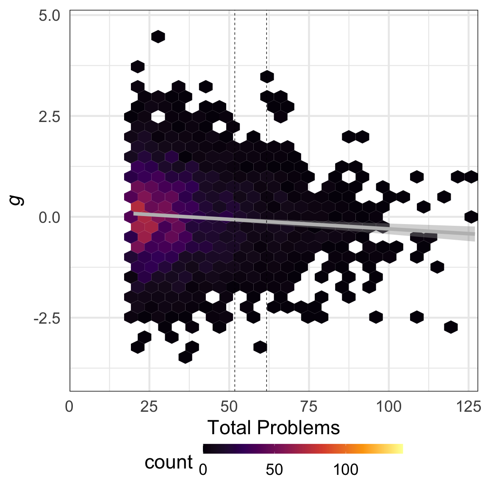
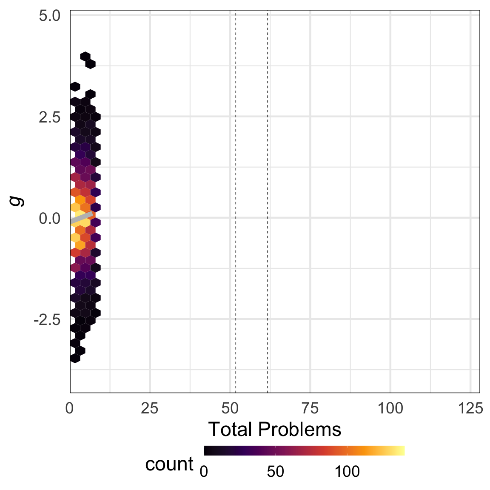
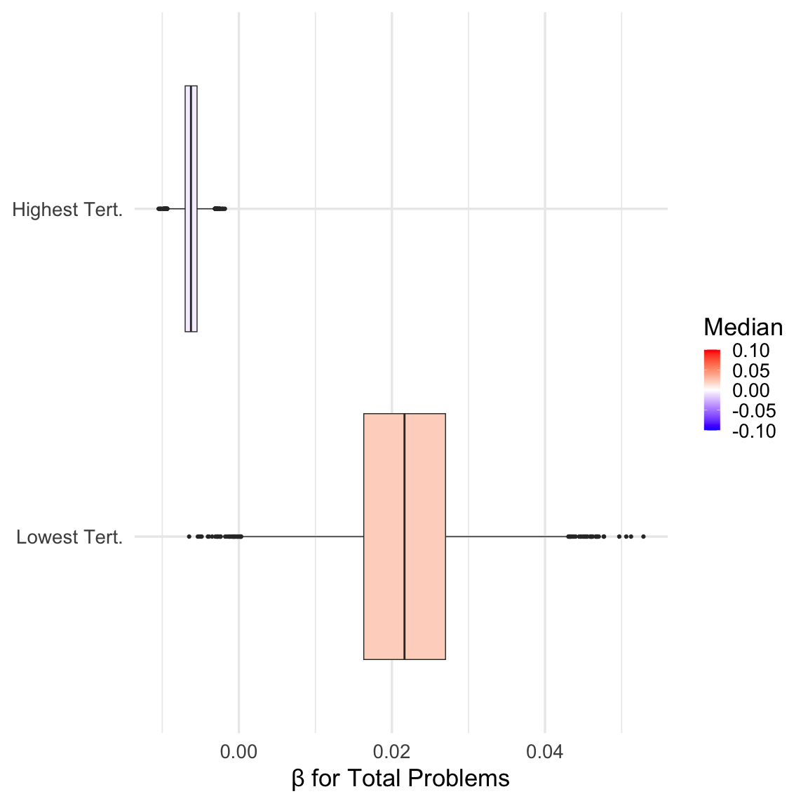
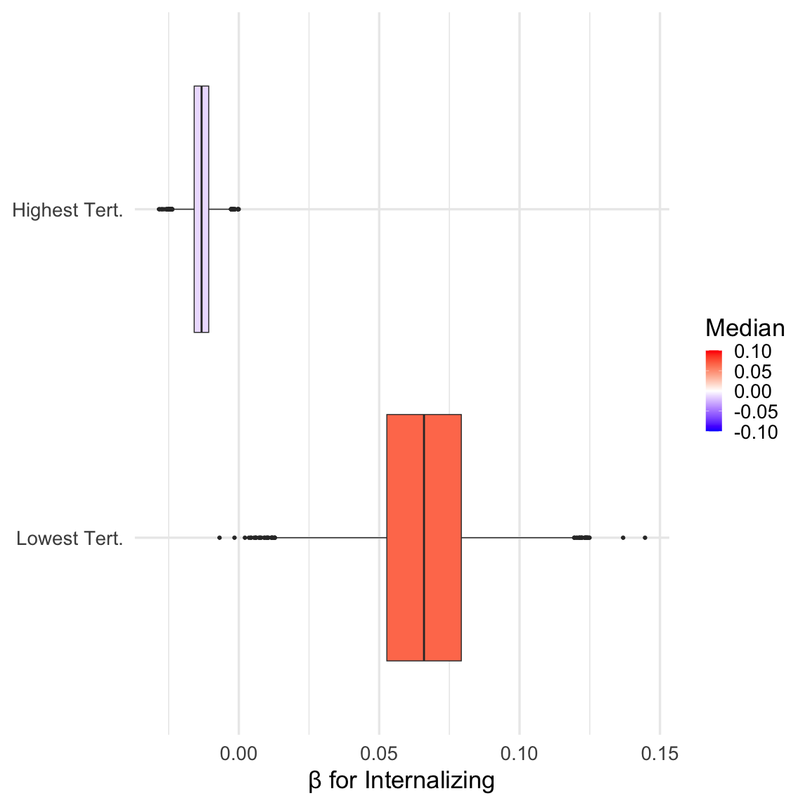
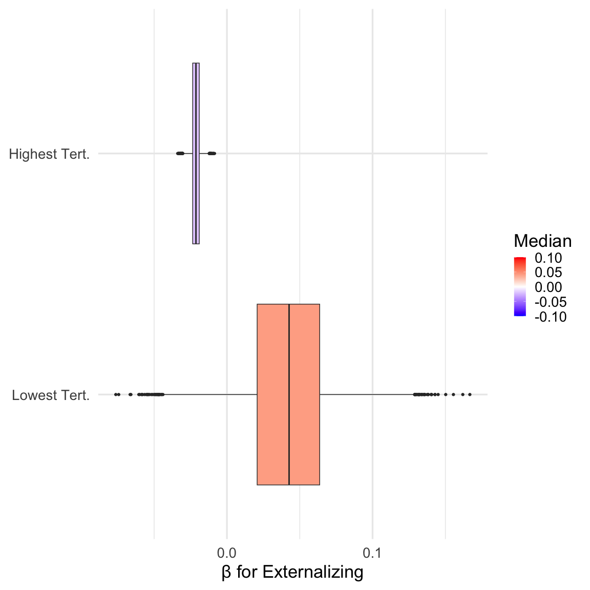
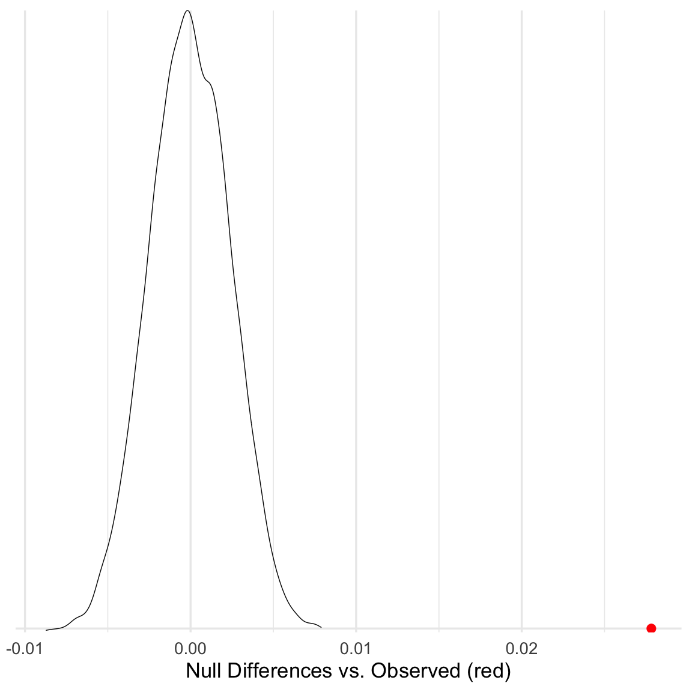
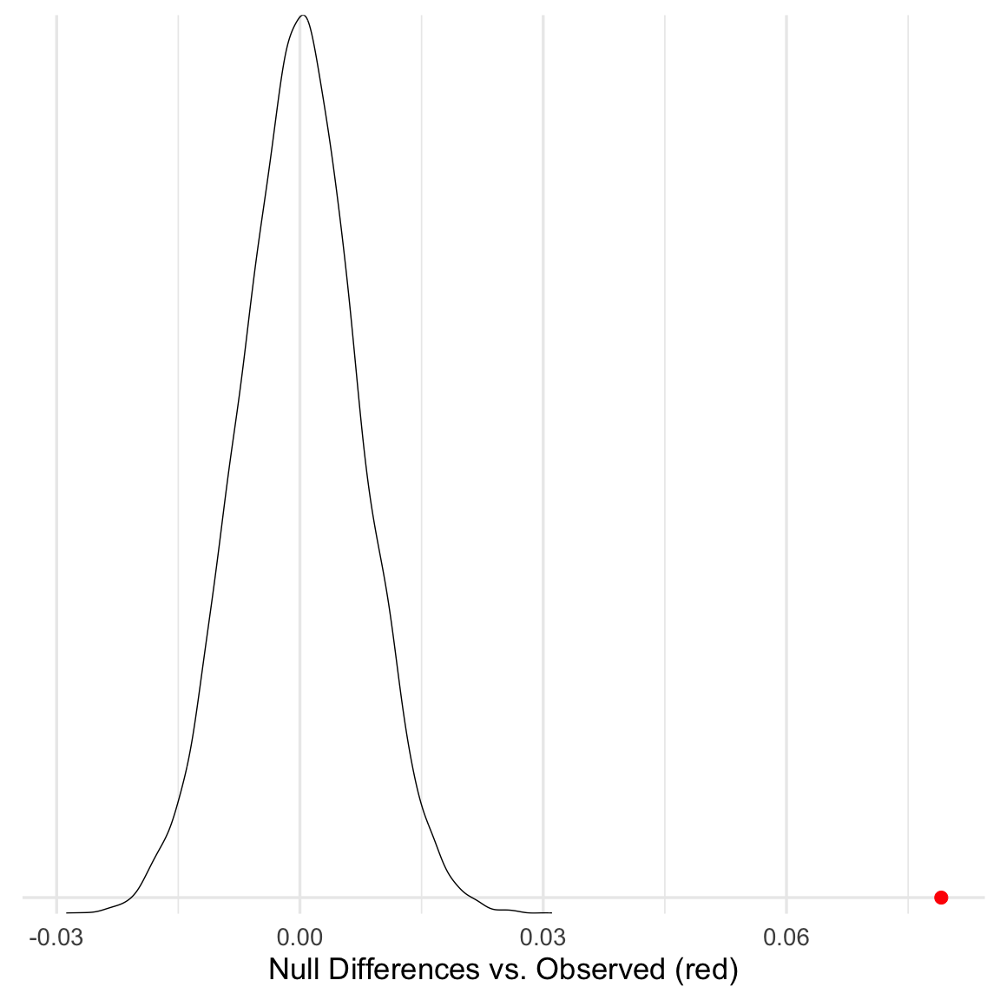
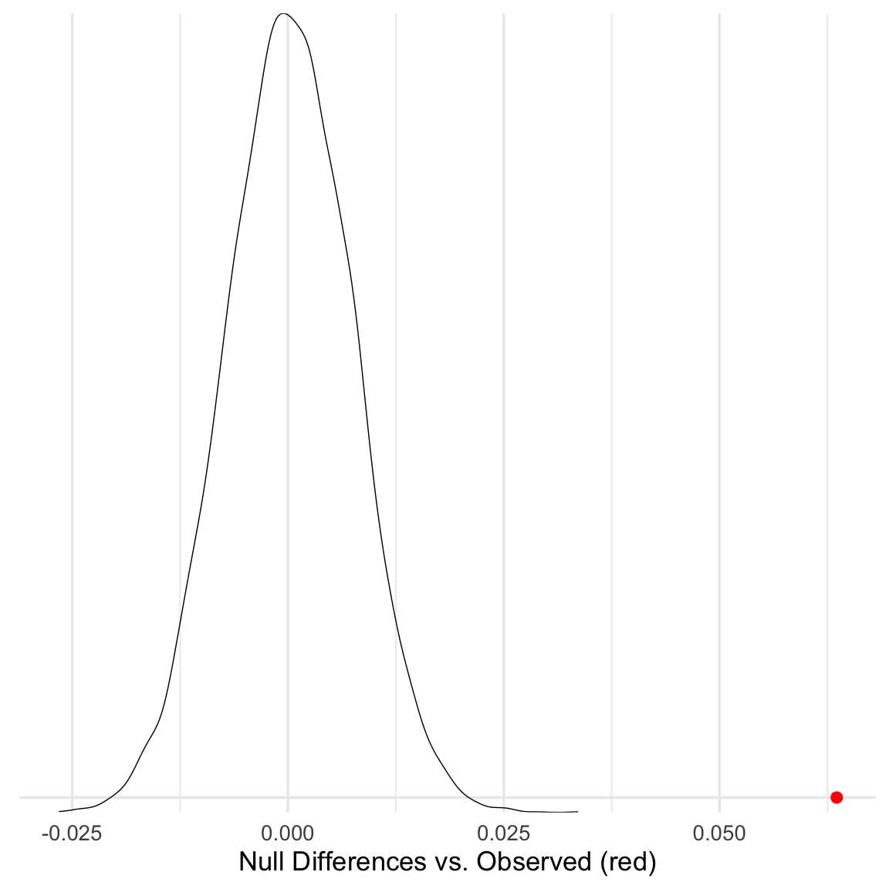

Figure1
================
2023-06-09

``` r
# load libraries
library(ggplot2)
library(hexbin)
library(reshape2)
library(viridis)
```

    ## Loading required package: viridisLite

``` r
library(dplyr)
```

    ## 
    ## Attaching package: 'dplyr'

    ## The following objects are masked from 'package:stats':
    ## 
    ##     filter, lag

    ## The following objects are masked from 'package:base':
    ## 
    ##     intersect, setdiff, setequal, union

``` r
library(mgcv)
```

    ## Loading required package: nlme

    ## 
    ## Attaching package: 'nlme'

    ## The following object is masked from 'package:dplyr':
    ## 
    ##     collapse

    ## This is mgcv 1.8-42. For overview type 'help("mgcv-package")'.

``` r
library(tidyr)
```

    ## 
    ## Attaching package: 'tidyr'

    ## The following object is masked from 'package:reshape2':
    ## 
    ##     smiths

``` r
library(knitr)
knitr::opts_chunk$set(fig.width=12, fig.height=12) 
```

``` r
plot_bootstraps <- function(data,maxval,Name,maxValuePlot,BorderlineClinical,Clinical) {
  # Melt the data frame
  data_melt <- melt(t(data))
  data_melt$Var1 <- rep(seq(0, maxval), nrow(data))

  # Calculate percentiles
  percentiles <- data %>%
    summarise(across(everything(), quantile, probs = c(0.01, 0.99), na.rm = TRUE))
  
  percentiles_long <- tidyr::pivot_longer(percentiles, cols = everything(), names_to = "Percentile", values_to = "YValue")

  # Add CI column
  data_melt$CI <- 0
  
  # Prepare CIs for insertion
  CIs <- data.frame(rep(seq(0, maxval), 2), c(rep(10001, maxval+1), rep(10002, maxval+1)), percentiles_long$YValue, rep(1, ((maxval+1)*2)))
  colnames(CIs) <- colnames(data_melt)
  
  # Add CIs
  data_melt2 <- rbind(data_melt, CIs)
  
  # Convert CI column to factor
  data_melt2$CI <- as.factor(data_melt2$CI)
  
  # Plotting the lines
  ggplot(data = data_melt2, aes(x = Var1, y = value, group = Var2, color = Var2)) +
    geom_line(aes(alpha = CI), show.legend = FALSE) +
    scale_color_viridis_c(option = "inferno", direction = -1) +
    scale_alpha_manual(values = c(0.01, 1), guide = FALSE) + ylim(c(-1.5,1.5)) +
    theme_minimal(base_size=34) + 
    ylab(expression(italic(g)))+xlab(Name)+
    geom_vline(xintercept = BorderlineClinical, linetype = "dashed")+
    geom_vline(xintercept = Clinical, linetype = "dashed")+
    theme(panel.border = element_rect(color = "black", fill = NA, size = 1))+
    scale_x_continuous(limits = c(0,maxValuePlot),expand = expansion(mult = c(0, 0)))
}

# and and a derivatives version. only change is ylim
plot_bootstrapDerivs <- function(data,maxval,Name,maxValuePlot,BorderlineClinical,Clinical) {
  # Melt the data frame
  data_melt <- melt(t(data))
  data_melt$Var1 <- rep(seq(1, maxval), nrow(data))

  # Calculate percentiles
  percentiles <- data %>%
    summarise(across(everything(), quantile, probs = c(0.01, 0.99), na.rm = TRUE))
  
  percentiles_long <- tidyr::pivot_longer(percentiles, cols = everything(), names_to = "Percentile", values_to = "YValue")

  # Add CI column
  data_melt$CI <- 0
  
  # Prepare CIs for insertion
  CIs <- data.frame(rep(seq(0, maxval), 2), c(rep(10001, maxval+1), rep(10002, maxval+1)), percentiles_long$YValue, rep(1, ((maxval+1)*2)))
  colnames(CIs) <- colnames(data_melt)
  
  # Add CIs
  data_melt2 <- rbind(data_melt, CIs)
  
  # Convert CI column to factor
  data_melt2$CI <- as.factor(data_melt2$CI)
  
  # Plotting the lines
  ggplot(data = data_melt2, aes(x = Var1, y = value, group = Var2, color = Var2)) +
    geom_line(aes(alpha = CI), show.legend = FALSE) +
    scale_color_viridis_c(option = "inferno", direction = -1) +
    scale_alpha_manual(values = c(0.01, 1), guide = FALSE) + ylim(c(-.15,.15)) +
    theme_minimal(base_size=35) + 
    ylab(expression(italic(g)))+xlab(Name)+
    geom_vline(xintercept = BorderlineClinical, linetype = "dashed")+
    geom_vline(xintercept = Clinical, linetype = "dashed")+
    theme(panel.border = element_rect(color = "black", fill = NA, size = 1))+
    scale_x_continuous(limits = c(0,maxValuePlot),expand = expansion(mult = c(0, 0)))
}


find_furthest_nonzero <- function(data) {
  numZeros=colSums(data==0)
  isZeroZeros=numZeros==0
  furthest_nonzero=sum(isZeroZeros)
}

# set colors
my_palette <- colorRampPalette(colors = c("#051099", "#1d5cb7", "white", "#e41a1c", "#a80009"))
```

``` r
# load in masterdf (saved out from sample construction)
masterdf=readRDS('~/gp_masterdf.rds')
# convert all cbcl scores to numeric
masterdf$cbcl_scr_syn_totprob_r=as.numeric(masterdf$cbcl_scr_syn_totprob_r)
masterdf$cbcl_scr_syn_internal_r=as.numeric(masterdf$cbcl_scr_syn_internal_r)
masterdf$cbcl_scr_syn_external_r=as.numeric(masterdf$cbcl_scr_syn_external_r)
masterdf$cbcl_scr_syn_somatic_r=as.numeric(masterdf$cbcl_scr_syn_somatic_r)
masterdf$cbcl_scr_syn_anxdep_r=as.numeric(masterdf$cbcl_scr_syn_anxdep_r)
masterdf$cbcl_scr_syn_thought_r=as.numeric(masterdf$cbcl_scr_syn_thought_r)
masterdf$cbcl_scr_syn_withdep_r=as.numeric(masterdf$cbcl_scr_syn_withdep_r)
masterdf$cbcl_scr_syn_social_r=as.numeric(masterdf$cbcl_scr_syn_social_r)
masterdf$cbcl_scr_syn_attention_r=as.numeric(masterdf$cbcl_scr_syn_attention_r)
masterdf$cbcl_scr_syn_rulebreak_r=as.numeric(masterdf$cbcl_scr_syn_rulebreak_r)
masterdf$cbcl_scr_syn_aggressive_r=as.numeric(masterdf$cbcl_scr_syn_aggressive_r)
# AIC to confirm nonlinearities 
# p factor
pgAge<-bam(g~s(cbcl_scr_syn_totprob_r,k=4)+s(interview_age,k=4),data=masterdf)
pgAgeL<-bam(g~cbcl_scr_syn_totprob_r+s(interview_age,k=4),data=masterdf)
AIC(pgAge)
```

    ## [1] 28414.92

``` r
AIC(pgAgeL)
```

    ## [1] 28423.28

``` r
# confirm linear is higher AIC than nonlin
paste('p nonlin:',AIC(pgAge)<AIC(pgAgeL))
```

    ## [1] "p nonlin: TRUE"

``` r
# internalizing
intAge<-bam(g~s(cbcl_scr_syn_internal_r,k=4)+s(interview_age,k=4),data=masterdf)
intAgeL<-bam(g~cbcl_scr_syn_internal_r+s(interview_age,k=4),data=masterdf)
AIC(intAge)
```

    ## [1] 28421.88

``` r
AIC(intAgeL)
```

    ## [1] 28449.82

``` r
# confirm linear is higher AIC than nonlin
paste('int nonlin:',AIC(intAge)<AIC(intAgeL))
```

    ## [1] "int nonlin: TRUE"

``` r
# externalizing
extAge<-bam(g~s(cbcl_scr_syn_external_r,k=4)+s(interview_age,k=4),data=masterdf)
extAgeL<-bam(g~cbcl_scr_syn_external_r+s(interview_age,k=4),data=masterdf)
AIC(extAge)
```

    ## [1] 28386.22

``` r
AIC(extAgeL)
```

    ## [1] 28386.08

``` r
# confirm linear is higher AIC than nonlin
paste('ext nonlin:',AIC(extAge)<AIC(extAgeL))
```

    ## [1] "ext nonlin: FALSE"

``` r
# somatic
somAge<-bam(g~s(cbcl_scr_syn_somatic_r,k=4)+s(interview_age,k=4),data=masterdf)
somAgeL<-bam(g~cbcl_scr_syn_somatic_r+s(interview_age,k=4),data=masterdf)
AIC(somAge)
```

    ## [1] 28434

``` r
AIC(somAgeL)
```

    ## [1] 28445.28

``` r
# confirm linear is higher AIC than nonlin
paste('somatic nonlin:',AIC(somAge)<AIC(somAgeL))
```

    ## [1] "somatic nonlin: TRUE"

``` r
# attention
attAge<-bam(g~s(cbcl_scr_syn_attention_r,k=4)+s(interview_age,k=4),data=masterdf)
attAgeL<-bam(g~cbcl_scr_syn_attention_r+s(interview_age,k=4),data=masterdf)
AIC(attAge)
```

    ## [1] 28375.01

``` r
AIC(attAgeL)
```

    ## [1] 28375.01

``` r
# confirm linear is higher AIC than nonlin
paste('attn. nonlin:',AIC(attAge)<AIC(attAgeL))
```

    ## [1] "attn. nonlin: FALSE"

``` r
# thought
thoAge<-bam(g~s(cbcl_scr_syn_thought_r,k=4)+s(interview_age,k=4),data=masterdf)
thoAgeL<-bam(g~cbcl_scr_syn_thought_r+s(interview_age,k=4),data=masterdf)
AIC(thoAge)
```

    ## [1] 28418.87

``` r
AIC(thoAgeL)
```

    ## [1] 28447.07

``` r
# confirm linear is higher AIC than nonlin
paste('thought nonlin:',AIC(thoAge)<AIC(thoAgeL))
```

    ## [1] "thought nonlin: TRUE"

``` r
# social
socAge<-bam(g~s(cbcl_scr_syn_social_r,k=4)+s(interview_age,k=4),data=masterdf)
socAgeL<-bam(g~cbcl_scr_syn_social_r+s(interview_age,k=4),data=masterdf)
AIC(socAge)
```

    ## [1] 28351.56

``` r
AIC(socAgeL)
```

    ## [1] 28351.3

``` r
# confirm linear is higher AIC than nonlin
paste('social nonlin:',AIC(socAge)<AIC(socAgeL))
```

    ## [1] "social nonlin: FALSE"

``` r
# anxious depression
anxdepAge<-bam(g~s(cbcl_scr_syn_anxdep_r,k=4)+s(interview_age,k=4),data=masterdf)
anxdepAgeL<-bam(g~cbcl_scr_syn_anxdep_r+s(interview_age,k=4),data=masterdf)
AIC(anxdepAge)
```

    ## [1] 28409.72

``` r
AIC(anxdepAgeL)
```

    ## [1] 28431.95

``` r
# confirm linear is higher AIC than nonlin
paste('anx. dep. nonlin:',AIC(anxdepAge)<AIC(anxdepAgeL))
```

    ## [1] "anx. dep. nonlin: TRUE"

``` r
# withdrawn depression
withdepAge<-bam(g~s(cbcl_scr_syn_withdep_r,k=4)+s(interview_age,k=4),data=masterdf)
withdepAgeL<-bam(g~cbcl_scr_syn_withdep_r+s(interview_age,k=4),data=masterdf)
AIC(withdepAge)
```

    ## [1] 28439.97

``` r
AIC(withdepAgeL)
```

    ## [1] 28452.05

``` r
# confirm linear is higher AIC than nonlin
paste('with. dep. nonlin:',AIC(withdepAge)<AIC(withdepAgeL))
```

    ## [1] "with. dep. nonlin: TRUE"

``` r
# rule breaking
ruleAge<-bam(g~s(cbcl_scr_syn_rulebreak_r,k=4)+s(interview_age,k=4),data=masterdf)
ruleAgeL<-bam(g~cbcl_scr_syn_rulebreak_r+s(interview_age,k=4),data=masterdf)
AIC(ruleAge)
```

    ## [1] 28345.85

``` r
AIC(ruleAgeL)
```

    ## [1] 28345.85

``` r
# confirm linear is higher AIC than nonlin
paste('rule breaking nonlin:',AIC(ruleAge)<AIC(ruleAgeL))
```

    ## [1] "rule breaking nonlin: FALSE"

``` r
# aggressive behavior
aggAge<-bam(g~s(cbcl_scr_syn_aggressive_r,k=4)+s(interview_age,k=4),data=masterdf)
aggAgeL<-bam(g~cbcl_scr_syn_aggressive_r+s(interview_age,k=4),data=masterdf)
AIC(aggAge)
```

    ## [1] 28410.05

``` r
AIC(aggAgeL)
```

    ## [1] 28409.85

``` r
# confirm linear is higher AIC than nonlin
paste('aggr. nonlin:',AIC(aggAge)<AIC(aggAgeL))
```

    ## [1] "aggr. nonlin: FALSE"

``` r
# no longer basis of sample splits, consider retaining for reference

# pull clinical cutoff from master df: t scores > 65 = borderline clinical, 69 = clinical
# https://onlinelibrary.wiley.com/doi/epdf/10.1002/mrdd.20071
# https://aseba.org/wp-content/uploads/2019/02/cbclprofile.pdf
masterdfP_bc<-masterdf[masterdf$cbcl_scr_syn_totprob_t==65,]
masterdfP_c<-masterdf[masterdf$cbcl_scr_syn_totprob_t==69,]
# borderline clinical and clinical cutoffs
Pbc=mean(masterdfP_bc$cbcl_scr_syn_totprob_r)
Pc=mean(masterdfP_c$cbcl_scr_syn_totprob_r)

PTL=quantile(masterdf$cbcl_scr_syn_totprob_r,0.33)
PTH=quantile(masterdf$cbcl_scr_syn_totprob_r,0.67)

# reference linear model
plotdf<-data.frame(masterdf$g,masterdf$cbcl_scr_syn_totprob_r,masterdf$interview_age)
colnames(plotdf)<-c('g','cbcl_scr_syn_totprob_r','interview_age')
modelforresids<-lm(g~interview_age,data=plotdf)
plotdf$resids<-modelforresids$residuals

basic=ggplot(data = plotdf,aes(x = cbcl_scr_syn_totprob_r, y = resids)) + geom_hex(bins=40)+
    geom_point(alpha=0)+
    geom_smooth(method = "lm",formula = y~x,color='gray',size=2) +
    scale_fill_viridis_c(option = "inferno",limits=c(0,140)) +
    ylim(c(-3.9,4.7)) +
    theme_minimal(base_size=35) + 
    ylab(expression(italic(g)))+xlab('Total Problems')+
    geom_vline(xintercept = Pbc, linetype = "dashed")+
    geom_vline(xintercept = Pc, linetype = "dashed")+
    theme(legend.position = "bottom",panel.border = element_rect(color = "black", fill = NA, size = 1),legend.margin = margin(-25, 0, 0, 0, "pt"),legend.key.width = unit(2.5,"cm"))+
    scale_x_continuous(limits = c(0,128),expand = expansion(mult = c(0, 0)))#+guides(fill=FALSE)
```

    ## Warning: Using `size` aesthetic for lines was deprecated in ggplot2 3.4.0.
    ## ℹ Please use `linewidth` instead.
    ## This warning is displayed once every 8 hours.
    ## Call `lifecycle::last_lifecycle_warnings()` to see where this warning was
    ## generated.

    ## Warning: The `size` argument of `element_rect()` is deprecated as of ggplot2 3.4.0.
    ## ℹ Please use the `linewidth` argument instead.
    ## This warning is displayed once every 8 hours.
    ## Call `lifecycle::last_lifecycle_warnings()` to see where this warning was
    ## generated.

``` r
basic
```

    ## Warning: Removed 3 rows containing non-finite values (`stat_binhex()`).

    ## Warning: Removed 3 rows containing non-finite values (`stat_smooth()`).

    ## Warning: Removed 17 rows containing missing values (`geom_hex()`).

    ## Warning: Removed 3 rows containing missing values (`geom_point()`).

<!-- -->

``` r
# extract line of best fit for comparison
fit_data<-ggplot_build(basic)$data[[3]]
```

    ## Warning: Removed 3 rows containing non-finite values (`stat_binhex()`).

    ## Warning: Removed 3 rows containing non-finite values (`stat_smooth()`).

``` r
lmforBeta<-lm(resids~cbcl_scr_syn_totprob_r,data=plotdf)
lmforBeta
```

    ## 
    ## Call:
    ## lm(formula = resids ~ cbcl_scr_syn_totprob_r, data = plotdf)
    ## 
    ## Coefficients:
    ##            (Intercept)  cbcl_scr_syn_totprob_r  
    ##                0.05108                -0.00297

``` r
# get rs and r^2
# r full
cor.test(plotdf$cbcl_scr_syn_totprob_r,plotdf$resids)
```

    ## 
    ##  Pearson's product-moment correlation
    ## 
    ## data:  plotdf$cbcl_scr_syn_totprob_r and plotdf$resids
    ## t = -5.3648, df = 10348, p-value = 8.279e-08
    ## alternative hypothesis: true correlation is not equal to 0
    ## 95 percent confidence interval:
    ##  -0.07185780 -0.03343303
    ## sample estimates:
    ##         cor 
    ## -0.05266491

``` r
# r^2 full
cor.test(plotdf$cbcl_scr_syn_totprob_r,plotdf$resids)$estimate^2
```

    ##         cor 
    ## 0.002773593

``` r
# rclinical
clindf<-masterdf[as.numeric(masterdf$cbcl_scr_syn_totprob_r)>PTH,]
# same covarying for age
modelforresids<-lm(g~interview_age,data=clindf)
clindf$resids<-modelforresids$residuals
cor.test(clindf$cbcl_scr_syn_totprob_r,clindf$resids)
```

    ## 
    ##  Pearson's product-moment correlation
    ## 
    ## data:  clindf$cbcl_scr_syn_totprob_r and clindf$resids
    ## t = -4.954, df = 3295, p-value = 7.636e-07
    ## alternative hypothesis: true correlation is not equal to 0
    ## 95 percent confidence interval:
    ##  -0.11976888 -0.05200028
    ## sample estimates:
    ##         cor 
    ## -0.08598404

``` r
# r^2 clinical
cor.test(clindf$cbcl_scr_syn_totprob_r,clindf$resids)$estimate^2
```

    ##         cor 
    ## 0.007393255

``` r
# rsubclinical
sclindf<-masterdf[as.numeric(masterdf$cbcl_scr_syn_totprob_r)<=PTL,]
# same covarying for age
modelforresids<-lm(g~interview_age,data=sclindf)
sclindf$resids<-modelforresids$residuals
cor.test(sclindf$cbcl_scr_syn_totprob_r,sclindf$resids)
```

    ## 
    ##  Pearson's product-moment correlation
    ## 
    ## data:  sclindf$cbcl_scr_syn_totprob_r and sclindf$resids
    ## t = 4.3213, df = 3537, p-value = 1.594e-05
    ## alternative hypothesis: true correlation is not equal to 0
    ## 95 percent confidence interval:
    ##  0.03961576 0.10516691
    ## sample estimates:
    ##        cor 
    ## 0.07246959

``` r
# r^2 subclinical
cor.test(sclindf$cbcl_scr_syn_totprob_r,sclindf$resids)$estimate^2
```

    ##         cor 
    ## 0.005251842

``` r
# ratios
(cor.test(clindf$cbcl_scr_syn_totprob_r,clindf$resids)$estimate^2)/(cor.test(plotdf$cbcl_scr_syn_totprob_r,plotdf$resids)$estimate^2)
```

    ##      cor 
    ## 2.665588

``` r
(cor.test(clindf$cbcl_scr_syn_totprob_r,clindf$resids)$estimate^2)/(cor.test(sclindf$cbcl_scr_syn_totprob_r,sclindf$resids)$estimate^2)
```

    ##      cor 
    ## 1.407745

``` r
# plot out clinical and subclinical with line of best fit, covarying for age
plotdf<-data.frame(clindf$g,clindf$cbcl_scr_syn_totprob_r,clindf$interview_age)
colnames(plotdf)<-c('g','cbcl_scr_syn_totprob_r','interview_age')
modelforresids<-lm(g~interview_age,data=plotdf)
plotdf$resids<-modelforresids$residuals
# high tertile
ggplot(data = plotdf,aes(x = cbcl_scr_syn_totprob_r, y = resids)) + geom_hex(bins=30)+
    geom_point(alpha=0)+
    geom_smooth(method = "lm",formula = y~x,color='gray',size=3) +
    scale_fill_viridis_c(option = "inferno",limits = c(0, 140)) +
    ylim(c(-3.9,4.7)) +
    theme_minimal(base_size=35) + 
    ylab(expression(italic(g)))+xlab('Total Problems')+
    geom_vline(xintercept = Pbc, linetype = "dashed")+
    geom_vline(xintercept = Pc, linetype = "dashed")+
    theme(legend.position = "bottom",panel.border = element_rect(color = "black", fill = NA, size = 1),legend.margin = margin(-25, 0, 0, 0, "pt"),legend.key.width = unit(2.5,"cm"))+
    scale_x_continuous(limits = c(0,128),expand = expansion(mult = c(0, 0)))
```

    ## Warning: Removed 3 rows containing non-finite values (`stat_binhex()`).
    ## Removed 3 rows containing non-finite values (`stat_smooth()`).

    ## Warning: Removed 3 rows containing missing values (`geom_point()`).

<!-- -->

``` r
lmforBeta<-lm(resids~cbcl_scr_syn_totprob_r,data=plotdf)
lmforBeta
```

    ## 
    ## Call:
    ## lm(formula = resids ~ cbcl_scr_syn_totprob_r, data = plotdf)
    ## 
    ## Coefficients:
    ##            (Intercept)  cbcl_scr_syn_totprob_r  
    ##               0.184390               -0.005033

``` r
# subclinical
plotdf<-data.frame(sclindf$g,sclindf$cbcl_scr_syn_totprob_r,sclindf$interview_age)
colnames(plotdf)<-c('g','cbcl_scr_syn_totprob_r','interview_age')
modelforresids<-lm(g~interview_age,data=plotdf)
plotdf$resids<-modelforresids$residuals
ggplot(data = plotdf,aes(x = cbcl_scr_syn_totprob_r, y = resids)) + geom_hex(bins=40)+
    geom_point(alpha=0)+
    geom_smooth(method = "lm",formula = y~x,color='gray',size=4) +
    scale_fill_viridis_c(option = "inferno",limits = c(0, 140)) +
    ylim(c(-3.9,4.7)) +
    theme_minimal(base_size=35) + 
    ylab(expression(italic(g)))+xlab('Total Problems')+
    geom_vline(xintercept = Pbc, linetype = "dashed")+
    geom_vline(xintercept = Pc, linetype = "dashed")+
    theme(legend.position = "bottom",panel.border = element_rect(color = "black", fill = NA, size = 1),legend.margin = margin(-25, 0, 0, 0, "pt"),legend.key.width = unit(2.5,"cm"))+
    scale_x_continuous(limits = c(0,128),expand = expansion(mult = c(0, 0)))
```

    ## Warning: Removed 17 rows containing missing values (`geom_hex()`).

<!-- -->

``` r
# save out at 750 x 800

lmforBeta<-lm(resids~cbcl_scr_syn_totprob_r,data=plotdf)
lmforBeta
```

    ## 
    ## Call:
    ## lm(formula = resids ~ cbcl_scr_syn_totprob_r, data = plotdf)
    ## 
    ## Coefficients:
    ##            (Intercept)  cbcl_scr_syn_totprob_r  
    ##               -0.10375                 0.03037

``` r
library(lme4)
```

    ## Warning: package 'lme4' was built under R version 4.2.3

    ## Loading required package: Matrix

    ## 
    ## Attaching package: 'Matrix'

    ## The following objects are masked from 'package:tidyr':
    ## 
    ##     expand, pack, unpack

    ## 
    ## Attaching package: 'lme4'

    ## The following object is masked from 'package:nlme':
    ## 
    ##     lmList

``` r
# for plot significance testing
masterdf$subjectkey<-as.factor(masterdf$subjectkey)
modelAll<-lme(g~interview_age+cbcl_scr_syn_totprob_r,random=~1|subjectkey,data=masterdf)
summary(modelAll)
```

    ## Linear mixed-effects model fit by REML
    ##   Data: masterdf 
    ##       AIC      BIC    logLik
    ##   24082.7 24118.92 -12036.35
    ## 
    ## Random effects:
    ##  Formula: ~1 | subjectkey
    ##         (Intercept)  Residual
    ## StdDev:   0.8324486 0.4713865
    ## 
    ## Fixed effects:  g ~ interview_age + cbcl_scr_syn_totprob_r 
    ##                             Value  Std.Error   DF   t-value p-value
    ## (Intercept)            -2.0613371 0.05262989 5174 -39.16666  0.0000
    ## interview_age           0.1943902 0.00453364 5173  42.87728  0.0000
    ## cbcl_scr_syn_totprob_r -0.0017471 0.00053717 5173  -3.25240  0.0012
    ##  Correlation: 
    ##                        (Intr) intrv_
    ## interview_age          -0.956       
    ## cbcl_scr_syn_totprob_r -0.250  0.080
    ## 
    ## Standardized Within-Group Residuals:
    ##         Min          Q1         Med          Q3         Max 
    ## -3.62834027 -0.50000753 -0.02483119  0.47390242  3.31807388 
    ## 
    ## Number of Observations: 10350
    ## Number of Groups: 5175

``` r
# model just clinical
modelClin<-lme(g~interview_age+cbcl_scr_syn_totprob_r,random=~1|subjectkey,data=clindf)
summary(modelClin)
```

    ## Linear mixed-effects model fit by REML
    ##   Data: clindf 
    ##        AIC      BIC    logLik
    ##   8229.204 8259.704 -4109.602
    ## 
    ## Random effects:
    ##  Formula: ~1 | subjectkey
    ##         (Intercept)  Residual
    ## StdDev:   0.8594946 0.4701998
    ## 
    ## Fixed effects:  g ~ interview_age + cbcl_scr_syn_totprob_r 
    ##                             Value  Std.Error   DF    t-value p-value
    ## (Intercept)            -2.0756883 0.10589284 2154 -19.601782  0.0000
    ## interview_age           0.1961151 0.00903765 1140  21.699795  0.0000
    ## cbcl_scr_syn_totprob_r -0.0025410 0.00087554 1140  -2.902241  0.0038
    ##  Correlation: 
    ##                        (Intr) intrv_
    ## interview_age          -0.937       
    ## cbcl_scr_syn_totprob_r -0.330  0.042
    ## 
    ## Standardized Within-Group Residuals:
    ##         Min          Q1         Med          Q3         Max 
    ## -3.13803673 -0.41258971 -0.01524217  0.39750518  3.30938382 
    ## 
    ## Number of Observations: 3297
    ## Number of Groups: 2155

``` r
# model just subclinical
modelSClin<-lme(g~interview_age+cbcl_scr_syn_totprob_r,random=~1|subjectkey,data=sclindf)
summary(modelSClin)
```

    ## Linear mixed-effects model fit by REML
    ##   Data: sclindf 
    ##        AIC      BIC    logLik
    ##   8691.958 8722.812 -4340.979
    ## 
    ## Random effects:
    ##  Formula: ~1 | subjectkey
    ##         (Intercept)  Residual
    ## StdDev:   0.8217791 0.4729291
    ## 
    ## Fixed effects:  g ~ interview_age + cbcl_scr_syn_totprob_r 
    ##                             Value  Std.Error   DF    t-value p-value
    ## (Intercept)            -2.1215371 0.10333368 2330 -20.530934   0.000
    ## interview_age           0.1947644 0.00879609 1206  22.142148   0.000
    ## cbcl_scr_syn_totprob_r  0.0098754 0.00574706 1206   1.718338   0.086
    ##  Correlation: 
    ##                        (Intr) intrv_
    ## interview_age          -0.963       
    ## cbcl_scr_syn_totprob_r -0.318  0.127
    ## 
    ## Standardized Within-Group Residuals:
    ##         Min          Q1         Med          Q3         Max 
    ## -2.76723181 -0.42486429 -0.02732756  0.41163160  2.74682151 
    ## 
    ## Number of Observations: 3539
    ## Number of Groups: 2331

``` r
library(ggplot2)
library(gganimate)
library(dplyr)

# Calculate percentiles and create a new column for grouping
percentile_df <- plotdf %>%
  mutate(percentile_group = cut_number(cbcl_scr_syn_totprob_r, n = 3, labels = FALSE))

# Calculate beta values for each percentile group
corr_values <- list()
for (pg in unique(percentile_df$percentile_group)) {
  data = percentile_df %>% filter(percentile_group == pg)
  lm_model <- cor.test(data$resids,data$cbcl_scr_syn_totprob_r)
  corr_values[[as.character(pg)]] <- lm_model[4]
}

# Create a data frame for beta annotation
beta_df <- data.frame(percentile_group = unique(percentile_df$percentile_group),
                      beta = unlist(corr_values))

# Create the animated plot
animated_plot <- ggplot(percentile_df, aes(x = cbcl_scr_syn_totprob_r, y = resids)) +
  geom_hex(bins = 60) +
  geom_point(alpha = 0) +
  geom_smooth(method = "lm", formula = y ~ x, color = '#e8e6e6', size = 2) +
  scale_fill_viridis_c(option = "inferno") +
  ylim(c(-3.9, 4.7)) +
  theme_minimal(base_size = 35) +
  ylab('General Cognition') + xlab('General Psychopathology') +
  geom_vline(xintercept = Pbc, linetype = "dashed") +
  geom_vline(xintercept = Pc, linetype = "dashed") +
  theme(legend.position = "bottom", panel.border = element_rect(color = "black", fill = NA, size = 1),
        legend.margin = margin(-25, 0, 0, 0, "pt"), legend.key.width = unit(2.5, "cm")) +
  scale_x_continuous(limits = c(0, 110), expand = expansion(mult = c(0, 0))) +
  transition_states(percentile_group, transition_length = 2) +
  enter_fade() +
  exit_fade()

# Create the animation with corr annotation
animated_plot <- animated_plot +
  theme(plot.title = element_text(size = 12)) +
  geom_text(data = beta_df,
            aes(x = 80, y = 4, label = sprintf("Corr = %.2f", beta)),
            size = 6, color = "black")

# Save the animation as a GIF
anim_save(
  filename = "gp_corr.gif",
  animation = animated_plot,
  width = 520,  # Set the desired width in pixels
  height = 520,  # Set the desired height in pixels
  renderer = gifski_renderer()
)
```

    ## Warning: Removed 24 rows containing missing values (`geom_hex()`).
    ## Removed 24 rows containing missing values (`geom_hex()`).
    ## Removed 24 rows containing missing values (`geom_hex()`).
    ## Removed 24 rows containing missing values (`geom_hex()`).
    ## Removed 24 rows containing missing values (`geom_hex()`).
    ## Removed 24 rows containing missing values (`geom_hex()`).
    ## Removed 24 rows containing missing values (`geom_hex()`).
    ## Removed 24 rows containing missing values (`geom_hex()`).
    ## Removed 24 rows containing missing values (`geom_hex()`).
    ## Removed 24 rows containing missing values (`geom_hex()`).
    ## Removed 24 rows containing missing values (`geom_hex()`).
    ## Removed 24 rows containing missing values (`geom_hex()`).
    ## Removed 24 rows containing missing values (`geom_hex()`).
    ## Removed 24 rows containing missing values (`geom_hex()`).
    ## Removed 24 rows containing missing values (`geom_hex()`).
    ## Removed 24 rows containing missing values (`geom_hex()`).
    ## Removed 24 rows containing missing values (`geom_hex()`).
    ## Removed 24 rows containing missing values (`geom_hex()`).
    ## Removed 24 rows containing missing values (`geom_hex()`).
    ## Removed 24 rows containing missing values (`geom_hex()`).
    ## Removed 24 rows containing missing values (`geom_hex()`).
    ## Removed 24 rows containing missing values (`geom_hex()`).
    ## Removed 24 rows containing missing values (`geom_hex()`).
    ## Removed 24 rows containing missing values (`geom_hex()`).
    ## Removed 24 rows containing missing values (`geom_hex()`).
    ## Removed 24 rows containing missing values (`geom_hex()`).
    ## Removed 24 rows containing missing values (`geom_hex()`).
    ## Removed 24 rows containing missing values (`geom_hex()`).
    ## Removed 24 rows containing missing values (`geom_hex()`).
    ## Removed 24 rows containing missing values (`geom_hex()`).
    ## Removed 24 rows containing missing values (`geom_hex()`).
    ## Removed 24 rows containing missing values (`geom_hex()`).
    ## Removed 24 rows containing missing values (`geom_hex()`).
    ## Removed 24 rows containing missing values (`geom_hex()`).
    ## Removed 24 rows containing missing values (`geom_hex()`).
    ## Removed 24 rows containing missing values (`geom_hex()`).
    ## Removed 24 rows containing missing values (`geom_hex()`).
    ## Removed 24 rows containing missing values (`geom_hex()`).
    ## Removed 24 rows containing missing values (`geom_hex()`).
    ## Removed 24 rows containing missing values (`geom_hex()`).
    ## Removed 24 rows containing missing values (`geom_hex()`).
    ## Removed 24 rows containing missing values (`geom_hex()`).
    ## Removed 24 rows containing missing values (`geom_hex()`).
    ## Removed 24 rows containing missing values (`geom_hex()`).
    ## Removed 24 rows containing missing values (`geom_hex()`).
    ## Removed 24 rows containing missing values (`geom_hex()`).
    ## Removed 24 rows containing missing values (`geom_hex()`).
    ## Removed 24 rows containing missing values (`geom_hex()`).
    ## Removed 24 rows containing missing values (`geom_hex()`).
    ## Removed 24 rows containing missing values (`geom_hex()`).
    ## Removed 24 rows containing missing values (`geom_hex()`).
    ## Removed 24 rows containing missing values (`geom_hex()`).
    ## Removed 24 rows containing missing values (`geom_hex()`).
    ## Removed 24 rows containing missing values (`geom_hex()`).
    ## Removed 24 rows containing missing values (`geom_hex()`).

``` r
# insert subclinical vs. clincal bootstrapped betas as horizontal box-and-whiskers,consider adding permuted vs. median observed difference
### ∆∆∆∆∆∆∆∆
# actual beta fits are under gp_CvSC_bootBetas
Fits=readRDS('~/Downloads/gpR1/gp_CvSC_bootBetas.rds')

# get differences in betas between real and permuted clinical groups
Diffs=readRDS('~/Downloads/gpR1/gp_CvSC_diffs.rds')
```

``` r
# make horizontal box and whiskers for betas from clinical and subclincal for each scale
# denote significance using observed beta difference vs. permutations

# P
FitsP_long <- Fits %>%
  select(pSubclinBeta,pClinBeta) %>%
  tidyr::gather(key = "Variable", value = "Value")
# create cleaner labels for plot
FitsP_long <- FitsP_long %>%
  mutate(Labels = factor(ifelse(Variable == 'pSubclinBeta', 'Lowest Tert.', 'Highest Tert.')))
# re order for plot
FitsP_long$Labels <- factor(FitsP_long$Labels, levels = c("Lowest Tert.", "Highest Tert."))
# get median values
medianClin=median(FitsP_long$Value[FitsP_long$Labels=='Highest Tert.'])
medianSClin=median(FitsP_long$Value[FitsP_long$Labels=='Lowest Tert.'])
FitsP_long$Median=NULL
FitsP_long$Median[FitsP_long$Labels=='Highest Tert.']=medianClin
FitsP_long$Median[FitsP_long$Labels=='Lowest Tert.']=medianSClin
# Plotting both pClinBeta and pSubclinBeta in the same horizontal boxplot
ggplot(FitsP_long, aes(x = Labels, y = Value, fill = Median)) +
  geom_boxplot() +
  coord_flip() +
  scale_fill_gradient2(
    low = "blue", mid = "white", high = "red",
    midpoint = 0, limits = c(-0.1, 0.1)
  )+
  ylab(expression(paste("\u03B2 for Total Problems"))) +
  theme_minimal(base_size = 26)+theme(axis.title.y = element_blank())
```

<!-- -->

``` r
# saved at 700 width 300 height

# INT
# Plotting both intClinBeta and intSubclinBeta in the same horizontal boxplot
FitsInt_long <- Fits %>%
  select(intSubclinBeta,intClinBeta) %>%
  tidyr::gather(key = "Variable", value = "Value")
# create cleaner labels for plot
FitsInt_long <- FitsInt_long %>%
  mutate(Labels = factor(ifelse(Variable == 'intSubclinBeta', 'Lowest Tert.', 'Highest Tert.')))
# re order for plot
FitsInt_long$Labels <- factor(FitsInt_long$Labels, levels = c("Lowest Tert.", "Highest Tert."))
# get median values
medianClin=median(FitsInt_long$Value[FitsInt_long$Labels=='Highest Tert.'])
medianSClin=median(FitsInt_long$Value[FitsInt_long$Labels=='Lowest Tert.'])
FitsInt_long$Median=NULL
FitsInt_long$Median[FitsInt_long$Labels=='Highest Tert.']=medianClin
FitsInt_long$Median[FitsInt_long$Labels=='Lowest Tert.']=medianSClin
# Plotting both pClinBeta and pSubclinBeta in the same horizontal boxplot
ggplot(FitsInt_long, aes(x = Labels, y = Value, fill = Median)) +
  geom_boxplot() +
  coord_flip() +
  scale_fill_gradient2(
    low = "blue", mid = "white", high = "red",
    midpoint = 0, limits = c(-0.1, 0.1)
  )+
  ylab(expression(paste("\u03B2 for Internalizing"))) +
  theme_minimal(base_size = 26)+theme(axis.title.y = element_blank())
```

<!-- -->

``` r
# Ext
# Plotting both intClinBeta and intSubclinBeta in the same horizontal boxplot
FitsExt_long <- Fits %>%
  select(extSubclinBeta,extClinBeta) %>%
  tidyr::gather(key = "Variable", value = "Value")
# create cleaner labels for plot
FitsExt_long <- FitsExt_long %>%
  mutate(Labels = factor(ifelse(Variable == 'extSubclinBeta', 'Lowest Tert.', 'Highest Tert.')))
# re order for plot
FitsExt_long$Labels <- factor(FitsExt_long$Labels, levels = c("Lowest Tert.", "Highest Tert."))
# get median values
medianClin=median(FitsExt_long$Value[FitsExt_long$Labels=='Highest Tert.'])
medianSClin=median(FitsExt_long$Value[FitsExt_long$Labels=='Lowest Tert.'])
FitsExt_long$Median=NULL
FitsExt_long$Median[FitsExt_long$Labels=='Highest Tert.']=medianClin
FitsExt_long$Median[FitsExt_long$Labels=='Lowest Tert.']=medianSClin
# Plotting both pClinBeta and pSubclinBeta in the same horizontal boxplot
ggplot(FitsExt_long, aes(x = Labels, y = Value, fill = Median)) +
  geom_boxplot() +
  coord_flip() +
    scale_fill_gradient2(
    low = "blue", mid = "white", high = "red",
    midpoint = 0, limits = c(-0.1, 0.1)
  )+
  ylab((paste("\u03B2 for Externalizing"))) +
  theme_minimal(base_size = 26)+theme(axis.title.y = element_blank())
```

<!-- -->

``` r
library(ggridges)

# make plots of linear model comparison - total problems
# Create a new data frame with the first 10,000 rows
df_subset_p <- Diffs[1:10000,1]
# Melt the data frame for easier plotting
df_melted <- reshape2::melt(df_subset_p)
# Create a data frame with the 10,001st row for annotation
df_10001 <- data.frame(variable = names(Diffs[1]), value = as.numeric(Diffs[10001,1]))
# Plot the distribution for each column with the 10,001st value marked distinctly
ggplot(df_melted, aes(x = value)) +
  geom_density(trim=T) +
  geom_point(data = df_10001, aes(x = value, y = variable), color = "red", size = 5)+
  theme_minimal(base_size=26)+xlab('Null Differences vs. Observed (red)')+
  theme(axis.text.y = element_blank(),axis.title.y = element_blank())
```

<!-- -->

``` r
# make plots of linear model comparison - internalizing
# Create a new data frame with the first 10,000 rows
df_subset_i <- Diffs[1:10000,2]
# Melt the data frame for easier plotting
df_melted <- reshape2::melt(df_subset_i)
# Create a data frame with the 10,001st row for annotation
df_10001 <- data.frame(variable = names(Diffs[2]), value = as.numeric(Diffs[10001,2]))
# Plot the distribution for each column with the 10,001st value marked distinctly
ggplot(df_melted, aes(x = value)) +
  geom_density(trim=T) +
  geom_point(data = df_10001, aes(x = value, y = variable), color = "red", size = 5)+
  theme_minimal(base_size=26)+xlab('Null Differences vs. Observed (red)')+
  theme(axis.text.y = element_blank(),axis.title.y = element_blank())
```

<!-- -->

``` r
# make plots of linear model comparison - externalizing
# Create a new data frame with the first 10,000 rows
df_subset_e <- Diffs[1:10000,3]
# Melt the data frame for easier plotting
df_melted <- reshape2::melt(df_subset_e)
# Create a data frame with the 10,001st row for annotation
df_10001 <- data.frame(variable = names(Diffs[3]), value = as.numeric(Diffs[10001,3]))
# Plot the distribution for each column with the 10,001st value marked distinctly
ggplot(df_melted, aes(x = value)) +
  geom_density(trim=T) +
  geom_point(data = df_10001, aes(x = value, y = variable), color = "red", size = 5)+
  theme_minimal(base_size=26)+xlab('Null Differences vs. Observed (red)')+
  theme(axis.text.y = element_blank(),axis.title.y = element_blank())
```

<!-- -->

``` r
# manually derive p-values (not needed when observed > all nulls)
#ps=NULL
#for (i in 1:3){
#  ps[i]=sum((df_subset[,i])>df_10001[i,2])/10000
#}
```
