Figure2
================
2023-06-09

``` r
# load libraries
library(ggplot2)
library(hexbin)
library(reshape2)
library(viridis)
```

    ## Loading required package: viridisLite

``` r
library(dplyr)
```

    ## 
    ## Attaching package: 'dplyr'

    ## The following objects are masked from 'package:stats':
    ## 
    ##     filter, lag

    ## The following objects are masked from 'package:base':
    ## 
    ##     intersect, setdiff, setequal, union

``` r
library(mgcv)
```

    ## Loading required package: nlme

    ## 
    ## Attaching package: 'nlme'

    ## The following object is masked from 'package:dplyr':
    ## 
    ##     collapse

    ## This is mgcv 1.8-42. For overview type 'help("mgcv-package")'.

``` r
library(ggExtra)
library(tidyr)
```

    ## 
    ## Attaching package: 'tidyr'

    ## The following object is masked from 'package:reshape2':
    ## 
    ##     smiths

``` r
plot_bootstraps_par <- function(data,maxval,Name,maxValuePlot) {
  # Melt the data frame
  data_melt <- melt(t(data))
  data_melt$Var1 <- rep(seq(0, maxval), nrow(data))

  # Calculate percentiles
  percentiles <- data %>%
    summarise(across(everything(), quantile, probs = c(0.01, 0.99), na.rm = TRUE))
  
  percentiles_long <- tidyr::pivot_longer(percentiles, cols = everything(), names_to = "Percentile", values_to = "YValue")

  # Add CI column
  data_melt$CI <- 0
  
  # Prepare CIs for insertion
  CIs <- data.frame(rep(seq(0, maxval), 2), c(rep(10001, (maxval+1)), rep(10002, (maxval+1))), percentiles_long$YValue, rep(1, ((maxval+1)*2)))
  colnames(CIs) <- colnames(data_melt)
  
  # Add CIs
  data_melt2 <- rbind(data_melt, CIs)
  
  # Convert CI column to factor
  data_melt2$CI <- as.factor(data_melt2$CI)
  
  # Plotting the lines
  ggplot(data = data_melt2, aes(x = Var1, y = value, group = Var2, color = Var2)) +
    geom_line(aes(alpha = CI), show.legend = FALSE) +
    scale_color_viridis_c(option = "inferno", direction = -1) +
    scale_alpha_manual(values = c(0.01, 1), guide = FALSE) + ylim(c(-1.5,1.5)) +
    theme_minimal(base_size=35) + 
    ylab(y_title)+xlab(Name)+
    theme(panel.border = element_rect(color = "black", fill = NA, size = 1))+
    scale_x_continuous(limits = c(0,maxValuePlot),expand = expansion(mult = c(0, 0)))
}

# and and a derivatives version. only change is ylim
plot_bootstrapDerivs <- function(data,maxval,Name,maxValuePlot,BorderlineClinical,Clinical) {
  # Melt the data frame
  data_melt <- melt(t(data))
  data_melt$Var1 <- rep(seq(0, maxval), nrow(data))

  # Calculate percentiles
  percentiles <- data %>%
    summarise(across(everything(), quantile, probs = c(0.01, 0.99), na.rm = TRUE))
  
  percentiles_long <- tidyr::pivot_longer(percentiles, cols = everything(), names_to = "Percentile", values_to = "YValue")

  # Add CI column
  data_melt$CI <- 0
  
  # Prepare CIs for insertion
  CIs <- data.frame(rep(seq(0, maxval), 2), c(rep(10001, (maxval+1)), rep(10002, (maxval+1))), percentiles_long$YValue, rep(1, ((maxval+1)*2)))
  colnames(CIs) <- colnames(data_melt)
  
  # Add CIs
  data_melt2 <- rbind(data_melt, CIs)
  
  # Convert CI column to factor
  data_melt2$CI <- as.factor(data_melt2$CI)
  
  # Plotting the lines
  ggplot(data = data_melt2, aes(x = Var1, y = value, group = Var2, color = Var2)) +
    geom_line(aes(alpha = CI), show.legend = FALSE) +
    scale_color_viridis_c(option = "inferno", direction = -1) +
    scale_alpha_manual(values = c(0.01, 1), guide = FALSE) + ylim(c(-.15,.15)) +
    theme_minimal(base_size=35) + 
    ylab(expression(italic(g)))+xlab(Name)+
    geom_vline(xintercept = BorderlineClinical, linetype = "dashed")+
    geom_vline(xintercept = Clinical, linetype = "dashed")+
    theme(panel.border = element_rect(color = "black", fill = NA, size = 1))+
    scale_x_continuous(limits = c(0,maxValuePlot),expand = expansion(mult = c(0, 0)))
}

# version for plotting poverty vs. nonpoverty
plot_bootstraps_pnp <- function(dataPov,dataNPov,maxval,Name,maxValuePlot) {
  # Melt the data frame
  pdata_melt <- melt(t(dataPov))
  pdata_melt$Var1 <- rep(seq(0, maxval), nrow(dataPov))
  # Melt the data frame
  ndata_melt <- melt(t(dataNPov))
  ndata_melt$Var1 <- rep(seq(0, maxval), nrow(dataNPov))
  
  # Calculate percentiles
  ppercentiles <- dataPov %>%
    summarise(across(everything(), quantile, probs = c(0.01, 0.99), na.rm = TRUE))
  # Calculate percentiles
  npercentiles <- dataNPov %>%
    summarise(across(everything(), quantile, probs = c(0.01, 0.99), na.rm = TRUE))
  
  ppercentiles_long <- tidyr::pivot_longer(ppercentiles, cols = everything(), names_to = "Percentile", values_to = "YValue")
  npercentiles_long <- tidyr::pivot_longer(npercentiles, cols = everything(), names_to = "Percentile", values_to = "YValue")

  # Add CI column
  pdata_melt$CI <- 0
  ndata_melt$CI <- 0
  
  # Prepare CIs for insertion
  pCIs <- data.frame(rep(seq(0, maxval), 2), c(rep(10001, (maxval+1)), rep(10002, (maxval+1))), ppercentiles_long$YValue, rep(1, ((maxval+1)*2)))
  colnames(pCIs) <- colnames(pdata_melt)
  nCIs <- data.frame(rep(seq(0, maxval), 2), c(rep(10001, (maxval+1)), rep(10002, (maxval+1))), npercentiles_long$YValue, rep(1, ((maxval+1)*2)))
  colnames(nCIs) <- colnames(ndata_melt)
  
  # Add CIs
  pdata_melt2 <- rbind(pdata_melt, pCIs)
  ndata_melt2 <- rbind(ndata_melt, nCIs)

  # Convert CI column to factor
  pdata_melt2$CI <- as.factor(pdata_melt2$CI)
  ndata_melt2$CI <- as.factor(ndata_melt2$CI)

  # Plotting the lines
  ggplot(data = pdata_melt2, aes(x = Var1, y = value, group = Var2)) +
    geom_line(aes(alpha = CI,color='blue'), show.legend = FALSE) +
    scale_alpha_manual(values = c(0.01, 1), guide = FALSE) + ylim(c(-1.5,1.5)) +
    geom_line(data = ndata_melt2, aes(alpha = CI,y=value,group=Var2,color='red'), show.legend = FALSE) +
    scale_alpha_manual(values = c(0.01, 1), guide = FALSE) + ylim(c(-1.5,1.5)) +
    theme_minimal(base_size=35) + 
    ylab(y_title)+xlab(Name)+
    theme(panel.border = element_rect(color = "black", fill = NA, size = 1))+
    scale_x_continuous(limits = c(0,maxValuePlot),expand = expansion(mult = c(0, 0)))
}


find_furthest_nonzero <- function(data) {
  numZeros=colSums(data==0)
  isZeroZeros=numZeros==0
  furthest_nonzero=sum(isZeroZeros)
}
# set colors
my_palette <- colorRampPalette(colors = c("#051099", "#1d5cb7", "white", "#e41a1c", "#a80009"))
```

``` r
# master df from sample construction
masterdf=readRDS('~/gp_masterdf.rds')
# convert all scores to numeric
masterdf$parentPcount=as.numeric(masterdf$parentPcount)
masterdf$cbcl_scr_syn_totprob_r=as.numeric(masterdf$cbcl_scr_syn_totprob_r)
masterdf$cbcl_scr_syn_internal_r=as.numeric(masterdf$cbcl_scr_syn_internal_r)
masterdf$cbcl_scr_syn_external_r=as.numeric(masterdf$cbcl_scr_syn_external_r)
masterdf$cbcl_scr_syn_somatic_r=as.numeric(masterdf$cbcl_scr_syn_somatic_r)
masterdf$cbcl_scr_syn_anxdep_r=as.numeric(masterdf$cbcl_scr_syn_anxdep_r)
masterdf$cbcl_scr_syn_thought_r=as.numeric(masterdf$cbcl_scr_syn_thought_r)
masterdf$cbcl_scr_syn_withdep_r=as.numeric(masterdf$cbcl_scr_syn_withdep_r)
masterdf$cbcl_scr_syn_social_r=as.numeric(masterdf$cbcl_scr_syn_social_r)
masterdf$cbcl_scr_syn_attention_r=as.numeric(masterdf$cbcl_scr_syn_attention_r)
masterdf$cbcl_scr_syn_rulebreak_r=as.numeric(masterdf$cbcl_scr_syn_rulebreak_r)
masterdf$cbcl_scr_syn_aggressive_r=as.numeric(masterdf$cbcl_scr_syn_aggressive_r)
masterdf$parentPcount=as.numeric(masterdf$parentPcount)
masterdf$ASRInt=as.numeric(masterdf$ASRInt)
masterdf$ASRExt=as.numeric(masterdf$ASRExt)
masterdf$ASRSomatic=as.numeric(masterdf$ASRSomatic)
masterdf$ASRAnxDepr=as.numeric(masterdf$ASRAnxDepr)
masterdf$ASRThought=as.numeric(masterdf$ASRThought)
masterdf$ASRWithdrawn=as.numeric(masterdf$ASRWithdrawn)
masterdf$ASRAttn=as.numeric(masterdf$ASRAttn)
masterdf$ASRRulB=as.numeric(masterdf$ASRRulB)
masterdf$ASRAggr=as.numeric(masterdf$ASRAggr)
# AIC to confirm spline use
# p factor
pgAge<-bam(g~s(parentPcount,k=4)+s(interview_age,k=4),data=masterdf)
pgAgeL<-bam(g~parentPcount+s(interview_age,k=4),data=masterdf)
AIC(pgAge)
```

    ## [1] 25877.66

``` r
AIC(pgAgeL)
```

    ## [1] 25932.95

``` r
# confirm linear is higher AIC than nonlin
paste('parentPcount nonlin:',AIC(pgAge)<AIC(pgAgeL))
```

    ## [1] "parentPcount nonlin: TRUE"

``` r
# internalizing
intAge<-bam(g~s(ASRInt,k=4)+s(interview_age,k=4),data=masterdf)
intAgeL<-bam(g~ASRInt+s(interview_age,k=4),data=masterdf)
AIC(intAge)
```

    ## [1] 25893.97

``` r
AIC(intAgeL)
```

    ## [1] 25914.76

``` r
# confirm linear is higher AIC than nonlin
paste('int nonlin:',AIC(intAge)<AIC(intAgeL))
```

    ## [1] "int nonlin: TRUE"

``` r
# externalizing
extAge<-bam(g~s(ASRExt,k=4)+s(interview_age,k=4),data=masterdf)
extAgeL<-bam(g~ASRExt+s(interview_age,k=4),data=masterdf)
AIC(extAge)
```

    ## [1] 25906

``` r
AIC(extAgeL)
```

    ## [1] 25905.68

``` r
# confirm linear is higher AIC than nonlin
paste('ext nonlin:',AIC(extAge)<AIC(extAgeL))
```

    ## [1] "ext nonlin: FALSE"

``` r
# somatic
somAge<-bam(g~s(ASRSomatic,k=4)+s(interview_age,k=4),data=masterdf)
somAgeL<-bam(g~ASRSomatic+s(interview_age,k=4),data=masterdf)
AIC(somAge)
```

    ## [1] 25912.91

``` r
AIC(somAgeL)
```

    ## [1] 25912.83

``` r
# confirm linear is higher AIC than nonlin
paste('somatic nonlin:',AIC(somAge)<AIC(somAgeL))
```

    ## [1] "somatic nonlin: FALSE"

``` r
# attention
attAge<-bam(g~s(ASRAttn,k=4)+s(interview_age,k=4),data=masterdf)
attAgeL<-bam(g~ASRAttn+s(interview_age,k=4),data=masterdf)
AIC(attAge)
```

    ## [1] 25928.52

``` r
AIC(attAgeL)
```

    ## [1] 25933.84

``` r
# confirm linear is higher AIC than nonlin
paste('attn. nonlin:',AIC(attAge)<AIC(attAgeL))
```

    ## [1] "attn. nonlin: TRUE"

``` r
# thought
thoAge<-bam(g~s(ASRThought,k=4)+s(interview_age,k=4),data=masterdf)
thoAgeL<-bam(g~ASRThought+s(interview_age,k=4),data=masterdf)
AIC(thoAge)
```

    ## [1] 25883.71

``` r
AIC(thoAgeL)
```

    ## [1] 25924.04

``` r
# confirm linear is higher AIC than nonlin
paste('thought nonlin:',AIC(thoAge)<AIC(thoAgeL))
```

    ## [1] "thought nonlin: TRUE"

``` r
# anxious depression
anxdepAge<-bam(g~s(ASRAnxDepr,k=4)+s(interview_age,k=4),data=masterdf)
anxdepAgeL<-bam(g~ASRAnxDepr+s(interview_age,k=4),data=masterdf)
AIC(anxdepAge)
```

    ## [1] 25926.3

``` r
AIC(anxdepAgeL)
```

    ## [1] 25934.35

``` r
# confirm linear is higher AIC than nonlin
paste('anx. dep. nonlin:',AIC(anxdepAge)<AIC(anxdepAgeL))
```

    ## [1] "anx. dep. nonlin: TRUE"

``` r
# withdrawn depression
withdepAge<-bam(g~s(ASRWithdrawn,k=4)+s(interview_age,k=4),data=masterdf)
withdepAgeL<-bam(g~ASRWithdrawn+s(interview_age,k=4),data=masterdf)
AIC(withdepAge)
```

    ## [1] 25919.68

``` r
AIC(withdepAgeL)
```

    ## [1] 25928.78

``` r
# confirm linear is higher AIC than nonlin
paste('with. dep. nonlin:',AIC(withdepAge)<AIC(withdepAgeL))
```

    ## [1] "with. dep. nonlin: TRUE"

``` r
# rule breaking
ruleAge<-bam(g~s(ASRRulB,k=4)+s(interview_age,k=4),data=masterdf)
ruleAgeL<-bam(g~ASRRulB+s(interview_age,k=4),data=masterdf)
AIC(ruleAge)
```

    ## [1] 25905.14

``` r
AIC(ruleAgeL)
```

    ## [1] 25905.14

``` r
# confirm linear is higher AIC than nonlin
paste('rule breaking nonlin:',AIC(ruleAge)<AIC(ruleAgeL))
```

    ## [1] "rule breaking nonlin: FALSE"

``` r
# aggressive behavior
aggAge<-bam(g~s(ASRAggr,k=4)+s(interview_age,k=4),data=masterdf)
aggAgeL<-bam(g~ASRAggr+s(interview_age,k=4),data=masterdf)
AIC(aggAge)
```

    ## [1] 25907.85

``` r
AIC(aggAgeL)
```

    ## [1] 25909.57

``` r
# confirm linear is higher AIC than nonlin
paste('aggr. nonlin:',AIC(aggAge)<AIC(aggAgeL))
```

    ## [1] "aggr. nonlin: TRUE"

``` r
# pull clinical cutoff from master df: t scores > 65 = borderline clinical, 69 = clinical
masterdfP_bc<-masterdf[masterdf$cbcl_scr_syn_totprob_t==65,]
masterdfP_c<-masterdf[masterdf$cbcl_scr_syn_totprob_t==69,]
masterdfI_bc<-masterdf[masterdf$cbcl_scr_syn_internal_t==65,]
masterdfI_c<-masterdf[masterdf$cbcl_scr_syn_internal_t==69,]
masterdfE_bc<-masterdf[masterdf$cbcl_scr_syn_external_t==65,]
masterdfE_c<-masterdf[masterdf$cbcl_scr_syn_external_t==69,]
masterdfAnx_bc<-masterdf[masterdf$cbcl_scr_syn_anxdep_t==65,]
masterdfAnx_c<-masterdf[masterdf$cbcl_scr_syn_anxdep_t==69,]
masterdfTho_bc<-masterdf[masterdf$cbcl_scr_syn_thought_t==65,]
masterdfTho_c<-masterdf[masterdf$cbcl_scr_syn_thought_t==69,]
# note no one has t==65 in this dataset for withdrawn depression
masterdfWit_bc<-masterdf[masterdf$cbcl_scr_syn_withdep_t==65,]
masterdfWit_c<-masterdf[masterdf$cbcl_scr_syn_withdep_t==69,]
masterdfSom_bc<-masterdf[masterdf$cbcl_scr_syn_somatic_t==65,]
masterdfSom_c<-masterdf[masterdf$cbcl_scr_syn_somatic_t==69,]
masterdfSoc_bc<-masterdf[masterdf$cbcl_scr_syn_social_t==65,]
masterdfSoc_c<-masterdf[masterdf$cbcl_scr_syn_social_t==69,]
masterdfAtt_bc<-masterdf[masterdf$cbcl_scr_syn_attention_t==65,]
masterdfAtt_c<-masterdf[masterdf$cbcl_scr_syn_attention_t==69,]
masterdfRul_bc<-masterdf[masterdf$cbcl_scr_syn_rulebreak_t==65,]
masterdfRul_c<-masterdf[masterdf$cbcl_scr_syn_rulebreak_t==69,]
masterdfAgg_bc<-masterdf[masterdf$cbcl_scr_syn_aggressive_t==65,]
masterdfAgg_c<-masterdf[masterdf$cbcl_scr_syn_aggressive_t==69,]

# borderline clinical and clinical cutoffs
Pbc=mean(masterdfP_bc$cbcl_scr_syn_totprob_r)
Pc=mean(masterdfP_c$cbcl_scr_syn_totprob_r)
Ibc=mean(masterdfP_bc$cbcl_scr_syn_internal_r)
Ic=mean(masterdfP_c$cbcl_scr_syn_internal_r)
Ebc=mean(masterdfE_bc$cbcl_scr_syn_external_r)
Ec=mean(masterdfE_c$cbcl_scr_syn_external_r)
AnxBc=mean(as.numeric(masterdfAnx_bc$cbcl_scr_syn_anxdep_r))
AnxC=mean(as.numeric(masterdfAnx_c$cbcl_scr_syn_anxdep_r))
ThoBc=mean(as.numeric(masterdfTho_bc$cbcl_scr_syn_thought_r))
ThoC=mean(as.numeric(masterdfTho_c$cbcl_scr_syn_thought_r))
WitBc=mean(as.numeric(masterdfWit_bc$cbcl_scr_syn_withdep_r))
WitC=mean(as.numeric(masterdfWit_c$cbcl_scr_syn_withdep_r))
SomBc=mean(as.numeric(masterdfSom_bc$cbcl_scr_syn_somatic_r))
SomC=mean(as.numeric(masterdfSom_c$cbcl_scr_syn_somatic_r))
SocBc=mean(as.numeric(masterdfSom_bc$cbcl_scr_syn_social_r))
SocC=mean(as.numeric(masterdfSoc_c$cbcl_scr_syn_social_r))
AttBc=mean(as.numeric(masterdfAtt_bc$cbcl_scr_syn_attention_r))
AttC=mean(as.numeric(masterdfAtt_c$cbcl_scr_syn_attention_r))
RulBc=mean(as.numeric(masterdfRul_bc$cbcl_scr_syn_rulebreak_r))
RulC=mean(as.numeric(masterdfRul_c$cbcl_scr_syn_rulebreak_r))
AggBc=mean(as.numeric(masterdfAgg_bc$cbcl_scr_syn_aggressive_r))
AggC=mean(as.numeric(masterdfAgg_c$cbcl_scr_syn_aggressive_r))
```

``` r
# reference dataframe
plotdf<-data.frame(masterdf$parentPcount,masterdf$g,masterdf$cbcl_scr_syn_totprob_r,masterdf$interview_age)
colnames(plotdf)<-c('parentPcount','g','cbcl_scr_syn_totprob_r','interview_age')

# set plot title outside of plot call
x_title <- expression(paste("Parental ", italic("p")))
y_title <- expression(paste("Child ", italic("g")))
y1_title <- expression(paste("Child ", italic("p")))

basic=ggplot(data = plotdf,aes(y = cbcl_scr_syn_totprob_r, x = parentPcount)) + geom_hex(bins=60)+
    geom_point(alpha=0)+
    #geom_smooth(method = "gam",formula = y~s(x),color='gray') +
    scale_fill_viridis_c(option = "inferno") +
    scale_y_continuous(expand = expansion(mult = c(0, 0)))+
    theme_minimal(base_size=35) + 
    xlab(x_title)+ylab(y1_title)+
    geom_hline(yintercept = Pbc, linetype = "dashed")+
    geom_hline(yintercept = Pc, linetype = "dashed")+
    theme(legend.position = "bottom",panel.border = element_rect(color = "black", fill = NA, size = 1),legend.margin = margin(-25, 0, 0, 0, "pt"),legend.key.width = unit(2.5,"cm"))+
    scale_x_continuous(expand = expansion(mult = c(0, 0)))+guides(fill=FALSE)
```

    ## Warning: The `size` argument of `element_rect()` is deprecated as of ggplot2 3.4.0.
    ## ℹ Please use the `linewidth` argument instead.
    ## This warning is displayed once every 8 hours.
    ## Call `lifecycle::last_lifecycle_warnings()` to see where this warning was
    ## generated.

    ## Warning: The `<scale>` argument of `guides()` cannot be `FALSE`. Use "none" instead as
    ## of ggplot2 3.3.4.
    ## This warning is displayed once every 8 hours.
    ## Call `lifecycle::last_lifecycle_warnings()` to see where this warning was
    ## generated.

``` r
ggMarginal(basic,type="histogram",size=3,binwidth=4,fill="gray")
```

<!-- -->

``` r
print(cor.test(masterdf$parentPcount,masterdf$cbcl_scr_syn_totprob_r))
```

    ## 
    ##  Pearson's product-moment correlation
    ## 
    ## data:  masterdf$parentPcount and masterdf$cbcl_scr_syn_totprob_r
    ## t = 66.631, df = 9448, p-value < 2.2e-16
    ## alternative hypothesis: true correlation is not equal to 0
    ## 95 percent confidence interval:
    ##  0.5515342 0.5789713
    ## sample estimates:
    ##       cor 
    ## 0.5654092

``` r
# ASR boots plots
# load in data
Fits1=readRDS('~/Desktop/g_p/gpFitBoots_cbclasr1.rds')
Fits2=readRDS('~/Desktop/g_p/gpFitBoots_cbclasr2.rds')
Fits3=readRDS('~/Desktop/g_p/gpFitBoots_cbclasr3.rds')
Fits4=readRDS('~/Desktop/g_p/gpFitBoots_cbclasr4.rds')
Fits5=readRDS('~/Desktop/g_p/gpFitBoots_cbclasr5.rds')
Fits1[2001:4000,]=Fits2[2001:4000,]
Fits1[4001:6000,]=Fits3[4001:6000,]
Fits1[6001:8000,]=Fits4[6001:8000,]
Fits1[8001:10000,]=Fits5[8001:10000,]

# may need updating after adding social cbcl scores to this df
parentPfits=Fits1[,377:537]
MaxP=find_furthest_nonzero(parentPfits)
plot_bootstraps_par(parentPfits,160,x_title,MaxP)
```

    ## Warning: There was 1 warning in `summarise()`.
    ## ℹ In argument: `across(everything(), quantile, probs = c(0.01, 0.99), na.rm =
    ##   TRUE)`.
    ## Caused by warning:
    ## ! The `...` argument of `across()` is deprecated as of dplyr 1.1.0.
    ## Supply arguments directly to `.fns` through an anonymous function instead.
    ## 
    ##   # Previously
    ##   across(a:b, mean, na.rm = TRUE)
    ## 
    ##   # Now
    ##   across(a:b, \(x) mean(x, na.rm = TRUE))

    ## Warning: Returning more (or less) than 1 row per `summarise()` group was deprecated in
    ## dplyr 1.1.0.
    ## ℹ Please use `reframe()` instead.
    ## ℹ When switching from `summarise()` to `reframe()`, remember that `reframe()`
    ##   always returns an ungrouped data frame and adjust accordingly.
    ## Call `lifecycle::last_lifecycle_warnings()` to see where this warning was
    ## generated.

    ## Warning: Removed 110022 rows containing missing values (`geom_line()`).

    ## Warning: The `guide` argument in `scale_*()` cannot be `FALSE`. This was deprecated in
    ## ggplot2 3.3.4.
    ## ℹ Please use "none" instead.
    ## This warning is displayed once every 8 hours.
    ## Call `lifecycle::last_lifecycle_warnings()` to see where this warning was
    ## generated.

<!-- -->

``` r
# p-factor
P_derivative_matrix <- matrix(0, nrow = nrow(parentPfits), ncol = ncol(parentPfits) - 1)
# Calculate the derivative for each column
for (i in 1:(ncol(parentPfits) - 1)) {
  # Calculate the differences in x (assuming a constant difference)
  dx <- 1
  # Calculate the differences in y (predicted values)
  dy <- parentPfits[, i + 1] - parentPfits[, i]
  # Calculate the derivatives (slopes)
  derivatives <- dy / dx
  # Store the derivatives in the derivative matrix
  P_derivative_matrix[, i] <- derivatives
}
# calc sig dervs
# get straightfoward of segment where 99% is over 0 or under
positive_counts <- colSums(P_derivative_matrix > 0, na.rm = TRUE)
negative_counts <- colSums(P_derivative_matrix < 0, na.rm = TRUE)
# find where each is 99% or greater
positive_countsSig=positive_counts>9900
negative_countsSig=negative_counts>9900
# make dataframe: 50th percentile of derivatives accompanied by posSig and NegSig vector
data <- apply(P_derivative_matrix, 2, function(x) quantile(x, probs = 0.5))
dervPlotDf<-data.frame(data,positive_countsSig,negative_countsSig)
# if either is sig at 99% plot
dervPlotDf$sig_derivMask=dervPlotDf[,2]+dervPlotDf[,3]>0
# use it to mask calculated derivs
dervPlotDf$sig_deriv=0
dervPlotDf$sig_deriv[dervPlotDf$sig_derivMask]=dervPlotDf$data[dervPlotDf$sig_derivMask]
dervPlotDf$seq=1:(dim(dervPlotDf)[1])
ggplot(data=dervPlotDf) + geom_raster(aes(x = seq, y = .5, fill = sig_deriv))+
    theme(panel.spacing = unit(-.01,"cm")) +
    scale_fill_gradientn(colors = my_palette(100),limits = c(min(-.1),max(0.1)))+theme_minimal(base_size = 35)+
    xlim(c(0,MaxP))+xlab(x_title)+
    guides(fill=FALSE)+
    theme(axis.title.y = element_blank(),axis.text.y=element_blank())+theme(panel.border = element_rect(color = "black", fill = NA, size = 1))+
    scale_x_continuous(limits = c(0,MaxP),expand = expansion(mult = c(0, 0)))
```

    ## Scale for x is already present.
    ## Adding another scale for x, which will replace the existing scale.

    ## Warning: Removed 12 rows containing missing values (`geom_raster()`).

<!-- -->

``` r
### poverty versus nonpoverty boots plot - CBCL

### re-merge the 5, update indices to pull values from
pNpFits1=readRDS('~/Desktop/g_p/gpFitBoots_cbcl_pNp1.rds')
pNpFits2=readRDS('~/Desktop/g_p/gpFitBoots_cbcl_pNp2.rds')
pNpFits3=readRDS('~/Desktop/g_p/gpFitBoots_cbcl_pNp3.rds')
pNpFits4=readRDS('~/Desktop/g_p/gpFitBoots_cbcl_pNp4.rds')
pNpFits5=readRDS('~/Desktop/g_p/gpFitBoots_cbcl_pNp5.rds')

# sub in values created in other iteration
pNpFits1[2001:4000,]=pNpFits2[2001:4000,]
pNpFits1[4001:6000,]=pNpFits3[4001:6000,]
pNpFits1[6001:8000,]=pNpFits4[6001:8000,]
pNpFits1[8001:10000,]=pNpFits5[8001:10000,]

# poverty child p
pov_p=pNpFits1[,1:128]
# nonpov
npov_p=pNpFits1[,129:256]
# using 99th percentile as cutoff - sparser coverage in poverty bootstraps
MaxP=quantile(masterdf$cbcl_scr_syn_totprob_r, probs = 0.99)
plot<-plot_bootstraps_pnp(pov_p,npov_p,127,'P',MaxP)
```

    ## Warning: Returning more (or less) than 1 row per `summarise()` group was deprecated in
    ## dplyr 1.1.0.
    ## ℹ Please use `reframe()` instead.
    ## ℹ When switching from `summarise()` to `reframe()`, remember that `reframe()`
    ##   always returns an ungrouped data frame and adjust accordingly.
    ## Call `lifecycle::last_lifecycle_warnings()` to see where this warning was
    ## generated.

    ## Warning: Returning more (or less) than 1 row per `summarise()` group was deprecated in
    ## dplyr 1.1.0.
    ## ℹ Please use `reframe()` instead.
    ## ℹ When switching from `summarise()` to `reframe()`, remember that `reframe()`
    ##   always returns an ungrouped data frame and adjust accordingly.
    ## Call `lifecycle::last_lifecycle_warnings()` to see where this warning was
    ## generated.

    ## Scale for alpha is already present.
    ## Adding another scale for alpha, which will replace the existing scale.
    ## Scale for y is already present.
    ## Adding another scale for y, which will replace the existing scale.

``` r
plot + theme(plot.margin = margin(r = 30,l=5,t=5,b=5))
```

    ## Warning: Removed 480096 rows containing missing values (`geom_line()`).

    ## Warning: Removed 480096 rows containing missing values (`geom_line()`).

<!-- -->

``` r
# derivatives
# poverty
P_derivative_matrix <- matrix(0, nrow = nrow(pov_p), ncol = ncol(pov_p) - 1)
# Calculate the derivative for each column
for (i in 1:(ncol(pov_p) - 1)) {
  # Calculate the differences in x (assuming a constant difference)
  dx <- 1
  # Calculate the differences in y (predicted values)
  dy <- pov_p[, i + 1] - pov_p[, i]
  # Calculate the derivatives (slopes)
  derivatives <- dy / dx
  # Store the derivatives in the derivative matrix
  P_derivative_matrix[, i] <- derivatives
}
# calc sig dervs
# get straightfoward of segment where 99% is over 0 or under
positive_counts <- colSums(P_derivative_matrix > 0, na.rm = TRUE)
negative_counts <- colSums(P_derivative_matrix < 0, na.rm = TRUE)
# find where each is 99% or greater
positive_countsSig=positive_counts>9500
negative_countsSig=negative_counts>9500
# make dataframe: 50th percentile of derivatives accompanied by posSig and NegSig vector
data <- apply(P_derivative_matrix, 2, function(x) quantile(x, probs = 0.5))
dervPlotDf<-data.frame(data,positive_countsSig,negative_countsSig)
# if either is sig at 99% plot
dervPlotDf$sig_derivMask=dervPlotDf[,2]+dervPlotDf[,3]>0
# use it to mask calculated derivs
dervPlotDf$sig_deriv=0
dervPlotDf$sig_deriv[dervPlotDf$sig_derivMask]=dervPlotDf$data[dervPlotDf$sig_derivMask]
dervPlotDf$seq=1:(dim(dervPlotDf)[1])
plot<-ggplot(data=dervPlotDf) + geom_raster(aes(x = seq, y = .5, fill = sig_deriv))+
    theme(panel.spacing = unit(-.01,"cm")) +
    scale_fill_gradientn(colors = my_palette(100),limits = c(min(-.1),max(0.1)))+theme_minimal(base_size = 35)+
    xlim(c(0,MaxP))+xlab('Child p')+
    guides(fill=FALSE)+
    theme(axis.title.y = element_blank(),axis.text.y=element_blank())+theme(panel.border = element_rect(color = "black", fill = NA, size = 1))+
    scale_x_continuous(limits = c(0,MaxP),expand = expansion(mult = c(0, 0)))
```

    ## Scale for x is already present.
    ## Adding another scale for x, which will replace the existing scale.

``` r
plot + theme(plot.margin = margin(r = 30,l=5,t=5,b=5))
```

    ## Warning: Removed 49 rows containing missing values (`geom_raster()`).

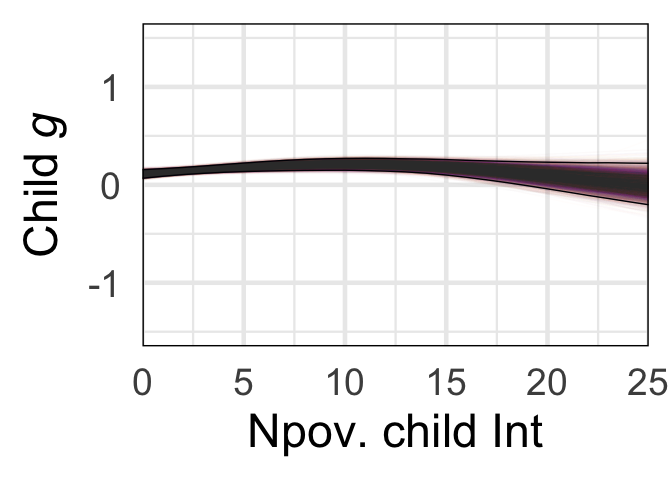<!-- -->

``` r
# nonpoverty
P_derivative_matrix <- matrix(0, nrow = nrow(npov_p), ncol = ncol(npov_p) - 1)
# Calculate the derivative for each column
for (i in 1:(ncol(npov_p) - 1)) {
  # Calculate the differences in x (assuming a constant difference)
  dx <- 1
  # Calculate the differences in y (predicted values)
  dy <- npov_p[, i + 1] - npov_p[, i]
  # Calculate the derivatives (slopes)
  derivatives <- dy / dx
  # Store the derivatives in the derivative matrix
  P_derivative_matrix[, i] <- derivatives
}
# calc sig dervs
# get straightfoward of segment where 99% is over 0 or under
positive_counts <- colSums(P_derivative_matrix > 0, na.rm = TRUE)
negative_counts <- colSums(P_derivative_matrix < 0, na.rm = TRUE)
# find where each is 99% or greater
positive_countsSig=positive_counts>9500
negative_countsSig=negative_counts>9500
# make dataframe: 50th percentile of derivatives accompanied by posSig and NegSig vector
data <- apply(P_derivative_matrix, 2, function(x) quantile(x, probs = 0.5))
dervPlotDf<-data.frame(data,positive_countsSig,negative_countsSig)
# if either is sig at 99% plot
dervPlotDf$sig_derivMask=dervPlotDf[,2]+dervPlotDf[,3]>0
# use it to mask calculated derivs
dervPlotDf$sig_deriv=0
dervPlotDf$sig_deriv[dervPlotDf$sig_derivMask]=dervPlotDf$data[dervPlotDf$sig_derivMask]
dervPlotDf$seq=1:(dim(dervPlotDf)[1])
plot<-ggplot(data=dervPlotDf) + geom_raster(aes(x = seq, y = .5, fill = sig_deriv))+
    theme(panel.spacing = unit(-.01,"cm")) +
    scale_fill_gradientn(colors = my_palette(100),limits = c(min(-.1),max(0.1)))+theme_minimal(base_size = 35)+
    xlim(c(0,MaxP))+xlab('Child p')+
    guides(fill=FALSE)+
    theme(axis.title.y = element_blank(),axis.text.y=element_blank())+theme(panel.border = element_rect(color = "black", fill = NA, size = 1))+
    scale_x_continuous(limits = c(0,MaxP),expand = expansion(mult = c(0, 0)))
```

    ## Scale for x is already present.
    ## Adding another scale for x, which will replace the existing scale.

``` r
plot + theme(plot.margin = margin(r = 30,l=5,t=5,b=5))
```

    ## Warning: Removed 49 rows containing missing values (`geom_raster()`).

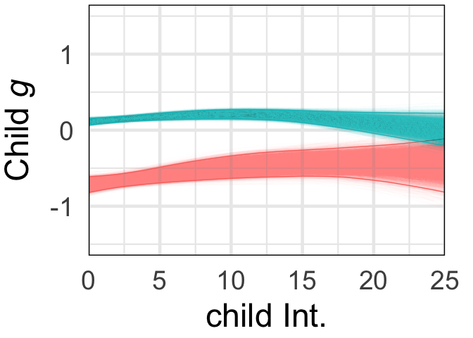<!-- -->

``` r
# poverty child int
pov_Int=pNpFits1[,257:308]
MaxInt=quantile(masterdf$cbcl_scr_syn_internal_r, probs = 0.99)
plot_bootstraps_par(pov_Int,51,'Pov. child Int',MaxInt)
```

    ## Warning: Returning more (or less) than 1 row per `summarise()` group was deprecated in
    ## dplyr 1.1.0.
    ## ℹ Please use `reframe()` instead.
    ## ℹ When switching from `summarise()` to `reframe()`, remember that `reframe()`
    ##   always returns an ungrouped data frame and adjust accordingly.
    ## Call `lifecycle::last_lifecycle_warnings()` to see where this warning was
    ## generated.

    ## Warning: Removed 260052 rows containing missing values (`geom_line()`).

<!-- -->

``` r
# nonpoverty child int
npov_Int=pNpFits1[,309:360]
plot_bootstraps_par(npov_Int,51,'Npov. child Int',MaxInt)
```

    ## Warning: Returning more (or less) than 1 row per `summarise()` group was deprecated in
    ## dplyr 1.1.0.
    ## ℹ Please use `reframe()` instead.
    ## ℹ When switching from `summarise()` to `reframe()`, remember that `reframe()`
    ##   always returns an ungrouped data frame and adjust accordingly.
    ## Removed 260052 rows containing missing values (`geom_line()`).
    ## Call `lifecycle::last_lifecycle_warnings()` to see where this warning was
    ## generated.

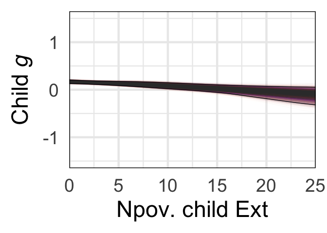<!-- -->

``` r
# both merged
plot<-plot_bootstraps_pnp(pov_Int,npov_Int,51,'child Int.',MaxInt)
```

    ## Warning: Returning more (or less) than 1 row per `summarise()` group was deprecated in
    ## dplyr 1.1.0.
    ## ℹ Please use `reframe()` instead.
    ## ℹ When switching from `summarise()` to `reframe()`, remember that `reframe()`
    ##   always returns an ungrouped data frame and adjust accordingly.
    ## Call `lifecycle::last_lifecycle_warnings()` to see where this warning was
    ## generated.

    ## Warning: Returning more (or less) than 1 row per `summarise()` group was deprecated in
    ## dplyr 1.1.0.
    ## ℹ Please use `reframe()` instead.
    ## ℹ When switching from `summarise()` to `reframe()`, remember that `reframe()`
    ##   always returns an ungrouped data frame and adjust accordingly.
    ## Call `lifecycle::last_lifecycle_warnings()` to see where this warning was
    ## generated.

    ## Scale for alpha is already present.
    ## Adding another scale for alpha, which will replace the existing scale.
    ## Scale for y is already present.
    ## Adding another scale for y, which will replace the existing scale.

``` r
plot + theme(plot.margin = margin(r = 30,l=5,t=5,b=5))
```

    ## Warning: Removed 260052 rows containing missing values (`geom_line()`).

    ## Warning: Removed 260052 rows containing missing values (`geom_line()`).

<!-- -->

``` r
# derivatives
# poverty
P_derivative_matrix <- matrix(0, nrow = nrow(pov_Int), ncol = ncol(pov_Int) - 1)
# Calculate the derivative for each column
for (i in 1:(ncol(pov_Int) - 1)) {
  # Calculate the differences in x (assuming a constant difference)
  dx <- 1
  # Calculate the differences in y (predicted values)
  dy <- pov_Int[, i + 1] - pov_Int[, i]
  # Calculate the derivatives (slopes)
  derivatives <- dy / dx
  # Store the derivatives in the derivative matrix
  P_derivative_matrix[, i] <- derivatives
}
# calc sig dervs
# get straightfoward of segment where 99% is over 0 or under
positive_counts <- colSums(P_derivative_matrix > 0, na.rm = TRUE)
negative_counts <- colSums(P_derivative_matrix < 0, na.rm = TRUE)
# find where each is 99% or greater
positive_countsSig=positive_counts>9500
negative_countsSig=negative_counts>9500
# make dataframe: 50th percentile of derivatives accompanied by posSig and NegSig vector
data <- apply(P_derivative_matrix, 2, function(x) quantile(x, probs = 0.5))
dervPlotDf<-data.frame(data,positive_countsSig,negative_countsSig)
# if either is sig at 99% plot
dervPlotDf$sig_derivMask=dervPlotDf[,2]+dervPlotDf[,3]>0
# use it to mask calculated derivs
dervPlotDf$sig_deriv=0
dervPlotDf$sig_deriv[dervPlotDf$sig_derivMask]=dervPlotDf$data[dervPlotDf$sig_derivMask]
dervPlotDf$seq=1:(dim(dervPlotDf)[1])
plot<-ggplot(data=dervPlotDf) + geom_raster(aes(x = seq, y = .5, fill = sig_deriv))+
    theme(panel.spacing = unit(-.01,"cm")) +
    scale_fill_gradientn(colors = my_palette(100),limits = c(min(-.1),max(0.1)))+theme_minimal(base_size = 35)+
    xlim(c(0,MaxInt))+xlab('child Int.')+
    guides(fill=FALSE)+
    theme(axis.title.y = element_blank(),axis.text.y=element_blank())+theme(panel.border = element_rect(color = "black", fill = NA, size = 1))+
    scale_x_continuous(limits = c(0,MaxInt),expand = expansion(mult = c(0, 0)))
```

    ## Scale for x is already present.
    ## Adding another scale for x, which will replace the existing scale.

``` r
plot + theme(plot.margin = margin(r = 30,l=5,t=5,b=5))
```

    ## Warning: Removed 27 rows containing missing values (`geom_raster()`).

<!-- -->

``` r
# nonpoverty
P_derivative_matrix <- matrix(0, nrow = nrow(npov_Int), ncol = ncol(npov_Int) - 1)
# Calculate the derivative for each column
for (i in 1:(ncol(npov_Int) - 1)) {
  # Calculate the differences in x (assuming a constant difference)
  dx <- 1
  # Calculate the differences in y (predicted values)
  dy <- npov_Int[, i + 1] - npov_Int[, i]
  # Calculate the derivatives (slopes)
  derivatives <- dy / dx
  # Store the derivatives in the derivative matrix
  P_derivative_matrix[, i] <- derivatives
}
# calc sig dervs
# get straightfoward of segment where 99% is over 0 or under
positive_counts <- colSums(P_derivative_matrix > 0, na.rm = TRUE)
negative_counts <- colSums(P_derivative_matrix < 0, na.rm = TRUE)
# find where each is 99% or greater
positive_countsSig=positive_counts>9500
negative_countsSig=negative_counts>9500
# make dataframe: 50th percentile of derivatives accompanied by posSig and NegSig vector
data <- apply(P_derivative_matrix, 2, function(x) quantile(x, probs = 0.5))
dervPlotDf<-data.frame(data,positive_countsSig,negative_countsSig)
# if either is sig at 99% plot
dervPlotDf$sig_derivMask=dervPlotDf[,2]+dervPlotDf[,3]>0
# use it to mask calculated derivs
dervPlotDf$sig_deriv=0
dervPlotDf$sig_deriv[dervPlotDf$sig_derivMask]=dervPlotDf$data[dervPlotDf$sig_derivMask]
dervPlotDf$seq=1:(dim(dervPlotDf)[1])
plot<-ggplot(data=dervPlotDf) + geom_raster(aes(x = seq, y = .5, fill = sig_deriv))+
    theme(panel.spacing = unit(-.01,"cm")) +
    scale_fill_gradientn(colors = my_palette(100),limits = c(min(-.1),max(0.1)))+theme_minimal(base_size = 35)+
    xlim(c(0,MaxInt))+xlab('child Int.')+
    guides(fill=FALSE)+
    theme(axis.title.y = element_blank(),axis.text.y=element_blank())+theme(panel.border = element_rect(color = "black", fill = NA, size = 1))+
    scale_x_continuous(limits = c(0,MaxInt),expand = expansion(mult = c(0, 0)))
```

    ## Scale for x is already present.
    ## Adding another scale for x, which will replace the existing scale.

``` r
plot + theme(plot.margin = margin(r = 30,l=5,t=5,b=5))
```

    ## Warning: Removed 27 rows containing missing values (`geom_raster()`).

<!-- -->

``` r
# poverty child ext
pov_Ext=pNpFits1[,361:408]
MaxExt=quantile(masterdf$cbcl_scr_syn_external_r, probs = 0.99)
plot_bootstraps_par(pov_Ext,47,'Pov. child Ext',MaxExt)
```

    ## Warning: Returning more (or less) than 1 row per `summarise()` group was deprecated in
    ## dplyr 1.1.0.
    ## ℹ Please use `reframe()` instead.
    ## ℹ When switching from `summarise()` to `reframe()`, remember that `reframe()`
    ##   always returns an ungrouped data frame and adjust accordingly.
    ## Call `lifecycle::last_lifecycle_warnings()` to see where this warning was
    ## generated.

    ## Warning: Removed 220044 rows containing missing values (`geom_line()`).

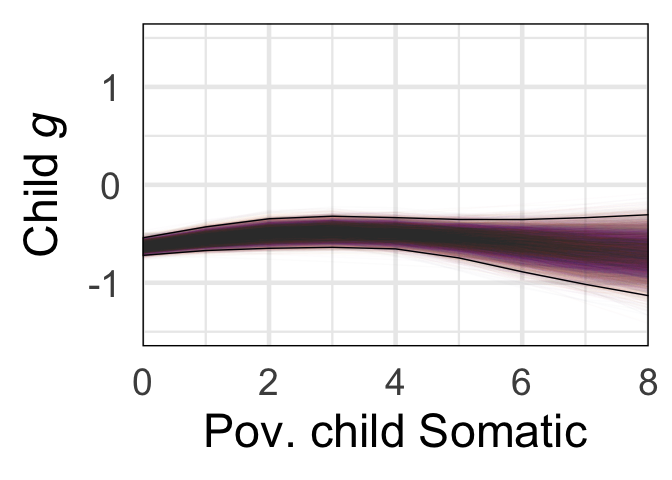<!-- -->

``` r
# nonpoverty child p
npov_Ext=pNpFits1[,409:456]
plot_bootstraps_par(npov_Ext,47,'Npov. child Ext',MaxExt)
```

    ## Warning: Returning more (or less) than 1 row per `summarise()` group was deprecated in
    ## dplyr 1.1.0.
    ## ℹ Please use `reframe()` instead.
    ## ℹ When switching from `summarise()` to `reframe()`, remember that `reframe()`
    ##   always returns an ungrouped data frame and adjust accordingly.
    ## Removed 220044 rows containing missing values (`geom_line()`).
    ## Call `lifecycle::last_lifecycle_warnings()` to see where this warning was
    ## generated.

<!-- -->

``` r
# both merged
plot<-plot_bootstraps_pnp(pov_Ext,npov_Ext,47,'child Ext.',MaxExt)
```

    ## Warning: Returning more (or less) than 1 row per `summarise()` group was deprecated in
    ## dplyr 1.1.0.
    ## ℹ Please use `reframe()` instead.
    ## ℹ When switching from `summarise()` to `reframe()`, remember that `reframe()`
    ##   always returns an ungrouped data frame and adjust accordingly.
    ## Call `lifecycle::last_lifecycle_warnings()` to see where this warning was
    ## generated.

    ## Warning: Returning more (or less) than 1 row per `summarise()` group was deprecated in
    ## dplyr 1.1.0.
    ## ℹ Please use `reframe()` instead.
    ## ℹ When switching from `summarise()` to `reframe()`, remember that `reframe()`
    ##   always returns an ungrouped data frame and adjust accordingly.
    ## Call `lifecycle::last_lifecycle_warnings()` to see where this warning was
    ## generated.

    ## Scale for alpha is already present.
    ## Adding another scale for alpha, which will replace the existing scale.
    ## Scale for y is already present.
    ## Adding another scale for y, which will replace the existing scale.

``` r
plot + theme(plot.margin = margin(r = 30,l=5,t=5,b=5))
```

    ## Warning: Removed 220044 rows containing missing values (`geom_line()`).

    ## Warning: Removed 220044 rows containing missing values (`geom_line()`).

<!-- -->

``` r
# poverty
P_derivative_matrix <- matrix(0, nrow = nrow(pov_Ext), ncol = ncol(pov_Ext) - 1)
# Calculate the derivative for each column
for (i in 1:(ncol(pov_Ext) - 1)) {
  # Calculate the differences in x (assuming a constant difference)
  dx <- 1
  # Calculate the differences in y (predicted values)
  dy <- pov_Ext[, i + 1] - pov_Ext[, i]
  # Calculate the derivatives (slopes)
  derivatives <- dy / dx
  # Store the derivatives in the derivative matrix
  P_derivative_matrix[, i] <- derivatives
}
# calc sig dervs
# get straightfoward of segment where 99% is over 0 or under
positive_counts <- colSums(P_derivative_matrix > 0, na.rm = TRUE)
negative_counts <- colSums(P_derivative_matrix < 0, na.rm = TRUE)
# find where each is 99% or greater
positive_countsSig=positive_counts>9500
negative_countsSig=negative_counts>9500
# make dataframe: 50th percentile of derivatives accompanied by posSig and NegSig vector
data <- apply(P_derivative_matrix, 2, function(x) quantile(x, probs = 0.5))
dervPlotDf<-data.frame(data,positive_countsSig,negative_countsSig)
# if either is sig at 99% plot
dervPlotDf$sig_derivMask=dervPlotDf[,2]+dervPlotDf[,3]>0
# use it to mask calculated derivs
dervPlotDf$sig_deriv=0
dervPlotDf$sig_deriv[dervPlotDf$sig_derivMask]=dervPlotDf$data[dervPlotDf$sig_derivMask]
dervPlotDf$seq=1:(dim(dervPlotDf)[1])
plot<-ggplot(data=dervPlotDf) + geom_raster(aes(x = seq, y = .5, fill = sig_deriv))+
    theme(panel.spacing = unit(-.01,"cm")) +
    scale_fill_gradientn(colors = my_palette(100),limits = c(min(-.1),max(0.1)))+theme_minimal(base_size = 35)+
    xlim(c(0,MaxInt))+xlab('child Ext.')+
    guides(fill=FALSE)+
    theme(axis.title.y = element_blank(),axis.text.y=element_blank())+theme(panel.border = element_rect(color = "black", fill = NA, size = 1))+
    scale_x_continuous(limits = c(0,MaxExt),expand = expansion(mult = c(0, 0)))
```

    ## Scale for x is already present.
    ## Adding another scale for x, which will replace the existing scale.

``` r
plot + theme(plot.margin = margin(r = 30,l=5,t=5,b=5))
```

    ## Warning: Removed 23 rows containing missing values (`geom_raster()`).

<!-- -->

``` r
# nonpoverty
P_derivative_matrix <- matrix(0, nrow = nrow(npov_Ext), ncol = ncol(npov_Ext) - 1)
# Calculate the derivative for each column
for (i in 1:(ncol(npov_Ext) - 1)) {
  # Calculate the differences in x (assuming a constant difference)
  dx <- 1
  # Calculate the differences in y (predicted values)
  dy <- npov_Ext[, i + 1] - npov_Ext[, i]
  # Calculate the derivatives (slopes)
  derivatives <- dy / dx
  # Store the derivatives in the derivative matrix
  P_derivative_matrix[, i] <- derivatives
}
# calc sig dervs
# get straightfoward of segment where 99% is over 0 or under
positive_counts <- colSums(P_derivative_matrix > 0, na.rm = TRUE)
negative_counts <- colSums(P_derivative_matrix < 0, na.rm = TRUE)
# find where each is 99% or greater
positive_countsSig=positive_counts>9500
negative_countsSig=negative_counts>9500
# make dataframe: 50th percentile of derivatives accompanied by posSig and NegSig vector
data <- apply(P_derivative_matrix, 2, function(x) quantile(x, probs = 0.5))
dervPlotDf<-data.frame(data,positive_countsSig,negative_countsSig)
# if either is sig at 99% plot
dervPlotDf$sig_derivMask=dervPlotDf[,2]+dervPlotDf[,3]>0
# use it to mask calculated derivs
dervPlotDf$sig_deriv=0
dervPlotDf$sig_deriv[dervPlotDf$sig_derivMask]=dervPlotDf$data[dervPlotDf$sig_derivMask]
dervPlotDf$seq=1:(dim(dervPlotDf)[1])
plot<-ggplot(data=dervPlotDf) + geom_raster(aes(x = seq, y = .5, fill = sig_deriv))+
    theme(panel.spacing = unit(-.01,"cm")) +
    scale_fill_gradientn(colors = my_palette(100),limits = c(min(-.1),max(0.1)))+theme_minimal(base_size = 35)+
    xlim(c(0,MaxInt))+xlab('child Ext.')+
    guides(fill=FALSE)+
    theme(axis.title.y = element_blank(),axis.text.y=element_blank())+theme(panel.border = element_rect(color = "black", fill = NA, size = 1))+
    scale_x_continuous(limits = c(0,MaxExt),expand = expansion(mult = c(0, 0)))
```

    ## Scale for x is already present.
    ## Adding another scale for x, which will replace the existing scale.

``` r
plot + theme(plot.margin = margin(r = 30,l=5,t=5,b=5))
```

    ## Warning: Removed 23 rows containing missing values (`geom_raster()`).

<!-- -->

``` r
# poverty child somatic
pov_Som=pNpFits1[,457:470]
MaxSom=quantile(masterdf$cbcl_scr_syn_somatic_r, probs = 0.99)
plot_bootstraps_par(pov_Som,13,'Pov. child Somatic',MaxSom)
```

    ## Warning: Returning more (or less) than 1 row per `summarise()` group was deprecated in
    ## dplyr 1.1.0.
    ## ℹ Please use `reframe()` instead.
    ## ℹ When switching from `summarise()` to `reframe()`, remember that `reframe()`
    ##   always returns an ungrouped data frame and adjust accordingly.
    ## Call `lifecycle::last_lifecycle_warnings()` to see where this warning was
    ## generated.

    ## Warning: Removed 50010 rows containing missing values (`geom_line()`).

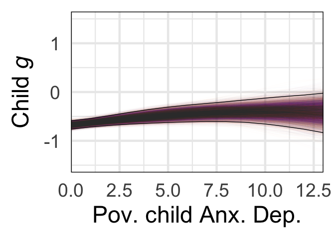<!-- -->

``` r
# nonpoverty child p
npov_Som=pNpFits1[,471:484]
plot_bootstraps_par(npov_Som,13,'Npov. child Somatic',MaxSom)
```

    ## Warning: Returning more (or less) than 1 row per `summarise()` group was deprecated in
    ## dplyr 1.1.0.
    ## ℹ Please use `reframe()` instead.
    ## ℹ When switching from `summarise()` to `reframe()`, remember that `reframe()`
    ##   always returns an ungrouped data frame and adjust accordingly.
    ## Removed 50010 rows containing missing values (`geom_line()`).
    ## Call `lifecycle::last_lifecycle_warnings()` to see where this warning was
    ## generated.

<!-- -->

``` r
# both merged
plot<-plot_bootstraps_pnp(pov_Som,npov_Som,13,'child Somatic',MaxSom)
```

    ## Warning: Returning more (or less) than 1 row per `summarise()` group was deprecated in
    ## dplyr 1.1.0.
    ## ℹ Please use `reframe()` instead.
    ## ℹ When switching from `summarise()` to `reframe()`, remember that `reframe()`
    ##   always returns an ungrouped data frame and adjust accordingly.
    ## Call `lifecycle::last_lifecycle_warnings()` to see where this warning was
    ## generated.

    ## Warning: Returning more (or less) than 1 row per `summarise()` group was deprecated in
    ## dplyr 1.1.0.
    ## ℹ Please use `reframe()` instead.
    ## ℹ When switching from `summarise()` to `reframe()`, remember that `reframe()`
    ##   always returns an ungrouped data frame and adjust accordingly.
    ## Call `lifecycle::last_lifecycle_warnings()` to see where this warning was
    ## generated.

    ## Scale for alpha is already present.
    ## Adding another scale for alpha, which will replace the existing scale.
    ## Scale for y is already present.
    ## Adding another scale for y, which will replace the existing scale.

``` r
plot + theme(plot.margin = margin(r = 30,l=5,t=5,b=5))
```

    ## Warning: Removed 50010 rows containing missing values (`geom_line()`).

    ## Warning: Removed 50010 rows containing missing values (`geom_line()`).

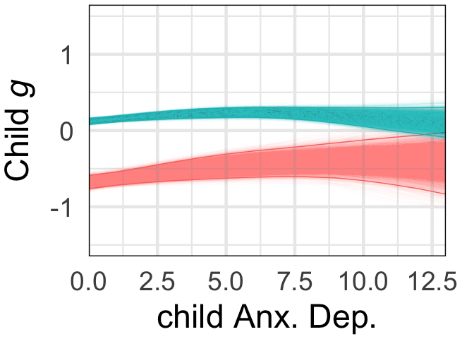<!-- -->

``` r
# poverty
P_derivative_matrix <- matrix(0, nrow = nrow(pov_Som), ncol = ncol(pov_Som) - 1)
# Calculate the derivative for each column
for (i in 1:(ncol(pov_Som) - 1)) {
  # Calculate the differences in x (assuming a constant difference)
  dx <- 1
  # Calculate the differences in y (predicted values)
  dy <- pov_Som[, i + 1] - pov_Som[, i]
  # Calculate the derivatives (slopes)
  derivatives <- dy / dx
  # Store the derivatives in the derivative matrix
  P_derivative_matrix[, i] <- derivatives
}
# calc sig dervs
# get straightfoward of segment where 99% is over 0 or under
positive_counts <- colSums(P_derivative_matrix > 0, na.rm = TRUE)
negative_counts <- colSums(P_derivative_matrix < 0, na.rm = TRUE)
# find where each is 99% or greater
positive_countsSig=positive_counts>9500
negative_countsSig=negative_counts>9500
# make dataframe: 50th percentile of derivatives accompanied by posSig and NegSig vector
data <- apply(P_derivative_matrix, 2, function(x) quantile(x, probs = 0.5))
dervPlotDf<-data.frame(data,positive_countsSig,negative_countsSig)
# if either is sig at 99% plot
dervPlotDf$sig_derivMask=dervPlotDf[,2]+dervPlotDf[,3]>0
# use it to mask calculated derivs
dervPlotDf$sig_deriv=0
dervPlotDf$sig_deriv[dervPlotDf$sig_derivMask]=dervPlotDf$data[dervPlotDf$sig_derivMask]
dervPlotDf$seq=1:(dim(dervPlotDf)[1])
plot<-ggplot(data=dervPlotDf) + geom_raster(aes(x = seq, y = .5, fill = sig_deriv))+
    theme(panel.spacing = unit(-.01,"cm")) +
    scale_fill_gradientn(colors = my_palette(100),limits = c(min(-.1),max(0.1)))+theme_minimal(base_size = 35)+
    xlim(c(0,MaxSom))+xlab('child Somatic')+
    guides(fill=FALSE)+
    theme(axis.title.y = element_blank(),axis.text.y=element_blank())+theme(panel.border = element_rect(color = "black", fill = NA, size = 1))+
    scale_x_continuous(limits = c(0,MaxSom),expand = expansion(mult = c(0, 0)))
```

    ## Scale for x is already present.
    ## Adding another scale for x, which will replace the existing scale.

``` r
plot + theme(plot.margin = margin(r = 30,l=5,t=5,b=5))
```

    ## Warning: Removed 6 rows containing missing values (`geom_raster()`).

<!-- -->

``` r
# nonpoverty
P_derivative_matrix <- matrix(0, nrow = nrow(npov_Som), ncol = ncol(npov_Som) - 1)
# Calculate the derivative for each column
for (i in 1:(ncol(npov_Som) - 1)) {
  # Calculate the differences in x (assuming a constant difference)
  dx <- 1
  # Calculate the differences in y (predicted values)
  dy <- npov_Som[, i + 1] - npov_Som[, i]
  # Calculate the derivatives (slopes)
  derivatives <- dy / dx
  # Store the derivatives in the derivative matrix
  P_derivative_matrix[, i] <- derivatives
}
# calc sig dervs
# get straightfoward of segment where 99% is over 0 or under
positive_counts <- colSums(P_derivative_matrix > 0, na.rm = TRUE)
negative_counts <- colSums(P_derivative_matrix < 0, na.rm = TRUE)
# find where each is 99% or greater
positive_countsSig=positive_counts>9500
negative_countsSig=negative_counts>9500
# make dataframe: 50th percentile of derivatives accompanied by posSig and NegSig vector
data <- apply(P_derivative_matrix, 2, function(x) quantile(x, probs = 0.5))
dervPlotDf<-data.frame(data,positive_countsSig,negative_countsSig)
# if either is sig at 99% plot
dervPlotDf$sig_derivMask=dervPlotDf[,2]+dervPlotDf[,3]>0
# use it to mask calculated derivs
dervPlotDf$sig_deriv=0
dervPlotDf$sig_deriv[dervPlotDf$sig_derivMask]=dervPlotDf$data[dervPlotDf$sig_derivMask]
dervPlotDf$seq=1:(dim(dervPlotDf)[1])
plot<-ggplot(data=dervPlotDf) + geom_raster(aes(x = seq, y = .5, fill = sig_deriv))+
    theme(panel.spacing = unit(-.01,"cm")) +
    scale_fill_gradientn(colors = my_palette(100),limits = c(min(-.1),max(0.1)))+theme_minimal(base_size = 35)+
    xlim(c(0,MaxSom))+xlab('child Somatic')+
    guides(fill=FALSE)+
    theme(axis.title.y = element_blank(),axis.text.y=element_blank())+theme(panel.border = element_rect(color = "black", fill = NA, size = 1))+
    scale_x_continuous(limits = c(0,MaxSom),expand = expansion(mult = c(0, 0)))
```

    ## Scale for x is already present.
    ## Adding another scale for x, which will replace the existing scale.

``` r
plot + theme(plot.margin = margin(r = 30,l=5,t=5,b=5))
```

    ## Warning: Removed 6 rows containing missing values (`geom_raster()`).

<!-- -->

``` r
# Anxious Depression
pov_Anx=pNpFits1[,485:510]
MaxAnx=quantile(as.numeric(masterdf$cbcl_scr_syn_anxdep_r), probs = 0.99)
plot_bootstraps_par(pov_Anx,25,'Pov. child Anx. Dep.',MaxAnx)
```

    ## Warning: Returning more (or less) than 1 row per `summarise()` group was deprecated in
    ## dplyr 1.1.0.
    ## ℹ Please use `reframe()` instead.
    ## ℹ When switching from `summarise()` to `reframe()`, remember that `reframe()`
    ##   always returns an ungrouped data frame and adjust accordingly.
    ## Call `lifecycle::last_lifecycle_warnings()` to see where this warning was
    ## generated.

    ## Warning: Removed 120024 rows containing missing values (`geom_line()`).

<!-- -->

``` r
# nonpoverty child p
npov_Anx=pNpFits1[,511:536]
plot_bootstraps_par(npov_Anx,25,'Npov. child Anx. Dep.',MaxAnx)
```

    ## Warning: Returning more (or less) than 1 row per `summarise()` group was deprecated in
    ## dplyr 1.1.0.
    ## ℹ Please use `reframe()` instead.
    ## ℹ When switching from `summarise()` to `reframe()`, remember that `reframe()`
    ##   always returns an ungrouped data frame and adjust accordingly.
    ## Removed 120024 rows containing missing values (`geom_line()`).
    ## Call `lifecycle::last_lifecycle_warnings()` to see where this warning was
    ## generated.

<!-- -->

``` r
# both merged
plot<-plot_bootstraps_pnp(pov_Anx,npov_Anx,25,'child Anx. Dep.',MaxAnx)
```

    ## Warning: Returning more (or less) than 1 row per `summarise()` group was deprecated in
    ## dplyr 1.1.0.
    ## ℹ Please use `reframe()` instead.
    ## ℹ When switching from `summarise()` to `reframe()`, remember that `reframe()`
    ##   always returns an ungrouped data frame and adjust accordingly.
    ## Call `lifecycle::last_lifecycle_warnings()` to see where this warning was
    ## generated.

    ## Warning: Returning more (or less) than 1 row per `summarise()` group was deprecated in
    ## dplyr 1.1.0.
    ## ℹ Please use `reframe()` instead.
    ## ℹ When switching from `summarise()` to `reframe()`, remember that `reframe()`
    ##   always returns an ungrouped data frame and adjust accordingly.
    ## Call `lifecycle::last_lifecycle_warnings()` to see where this warning was
    ## generated.

    ## Scale for alpha is already present.
    ## Adding another scale for alpha, which will replace the existing scale.
    ## Scale for y is already present.
    ## Adding another scale for y, which will replace the existing scale.

``` r
plot + theme(plot.margin = margin(r = 30,l=5,t=5,b=5))
```

    ## Warning: Removed 120024 rows containing missing values (`geom_line()`).

    ## Warning: Removed 120024 rows containing missing values (`geom_line()`).

<!-- -->

``` r
# poverty
P_derivative_matrix <- matrix(0, nrow = nrow(pov_Anx), ncol = ncol(pov_Anx) - 1)
# Calculate the derivative for each column
for (i in 1:(ncol(pov_Anx) - 1)) {
  # Calculate the differences in x (assuming a constant difference)
  dx <- 1
  # Calculate the differences in y (predicted values)
  dy <- pov_Anx[, i + 1] - pov_Anx[, i]
  # Calculate the derivatives (slopes)
  derivatives <- dy / dx
  # Store the derivatives in the derivative matrix
  P_derivative_matrix[, i] <- derivatives
}
# calc sig dervs
# get straightfoward of segment where 99% is over 0 or under
positive_counts <- colSums(P_derivative_matrix > 0, na.rm = TRUE)
negative_counts <- colSums(P_derivative_matrix < 0, na.rm = TRUE)
# find where each is 99% or greater
positive_countsSig=positive_counts>9500
negative_countsSig=negative_counts>9500
# make dataframe: 50th percentile of derivatives accompanied by posSig and NegSig vector
data <- apply(P_derivative_matrix, 2, function(x) quantile(x, probs = 0.5))
dervPlotDf<-data.frame(data,positive_countsSig,negative_countsSig)
# if either is sig at 99% plot
dervPlotDf$sig_derivMask=dervPlotDf[,2]+dervPlotDf[,3]>0
# use it to mask calculated derivs
dervPlotDf$sig_deriv=0
dervPlotDf$sig_deriv[dervPlotDf$sig_derivMask]=dervPlotDf$data[dervPlotDf$sig_derivMask]
dervPlotDf$seq=1:(dim(dervPlotDf)[1])
plot<-ggplot(data=dervPlotDf) + geom_raster(aes(x = seq, y = .5, fill = sig_deriv))+
    theme(panel.spacing = unit(-.01,"cm")) +
    scale_fill_gradientn(colors = my_palette(100),limits = c(min(-.1),max(0.1)))+theme_minimal(base_size = 35)+
    xlim(c(0,MaxAnx))+xlab('child Anx. Dep.')+
    guides(fill=FALSE)+
    theme(axis.title.y = element_blank(),axis.text.y=element_blank())+theme(panel.border = element_rect(color = "black", fill = NA, size = 1))+
    scale_x_continuous(limits = c(0,MaxAnx),expand = expansion(mult = c(0, 0)))
```

    ## Scale for x is already present.
    ## Adding another scale for x, which will replace the existing scale.

``` r
plot + theme(plot.margin = margin(r = 30,l=5,t=5,b=5))
```

    ## Warning: Removed 13 rows containing missing values (`geom_raster()`).

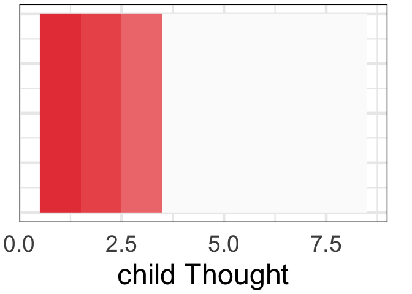<!-- -->

``` r
# nonpoverty
P_derivative_matrix <- matrix(0, nrow = nrow(npov_Anx), ncol = ncol(npov_Anx) - 1)
# Calculate the derivative for each column
for (i in 1:(ncol(npov_Anx) - 1)) {
  # Calculate the differences in x (assuming a constant difference)
  dx <- 1
  # Calculate the differences in y (predicted values)
  dy <- npov_Anx[, i + 1] - npov_Anx[, i]
  # Calculate the derivatives (slopes)
  derivatives <- dy / dx
  # Store the derivatives in the derivative matrix
  P_derivative_matrix[, i] <- derivatives
}
# calc sig dervs
# get straightfoward of segment where 99% is over 0 or under
positive_counts <- colSums(P_derivative_matrix > 0, na.rm = TRUE)
negative_counts <- colSums(P_derivative_matrix < 0, na.rm = TRUE)
# find where each is 99% or greater
positive_countsSig=positive_counts>9500
negative_countsSig=negative_counts>9500
# make dataframe: 50th percentile of derivatives accompanied by posSig and NegSig vector
data <- apply(P_derivative_matrix, 2, function(x) quantile(x, probs = 0.5))
dervPlotDf<-data.frame(data,positive_countsSig,negative_countsSig)
# if either is sig at 99% plot
dervPlotDf$sig_derivMask=dervPlotDf[,2]+dervPlotDf[,3]>0
# use it to mask calculated derivs
dervPlotDf$sig_deriv=0
dervPlotDf$sig_deriv[dervPlotDf$sig_derivMask]=dervPlotDf$data[dervPlotDf$sig_derivMask]
dervPlotDf$seq=1:(dim(dervPlotDf)[1])
plot<-ggplot(data=dervPlotDf) + geom_raster(aes(x = seq, y = .5, fill = sig_deriv))+
    theme(panel.spacing = unit(-.01,"cm")) +
    scale_fill_gradientn(colors = my_palette(100),limits = c(min(-.1),max(0.1)))+theme_minimal(base_size = 35)+
    xlim(c(0,MaxAnx))+xlab('child Anx. Dep.')+
    guides(fill=FALSE)+
    theme(axis.title.y = element_blank(),axis.text.y=element_blank())+theme(panel.border = element_rect(color = "black", fill = NA, size = 1))+
    scale_x_continuous(limits = c(0,MaxAnx),expand = expansion(mult = c(0, 0)))
```

    ## Scale for x is already present.
    ## Adding another scale for x, which will replace the existing scale.

``` r
plot + theme(plot.margin = margin(r = 30,l=5,t=5,b=5))
```

    ## Warning: Removed 13 rows containing missing values (`geom_raster()`).

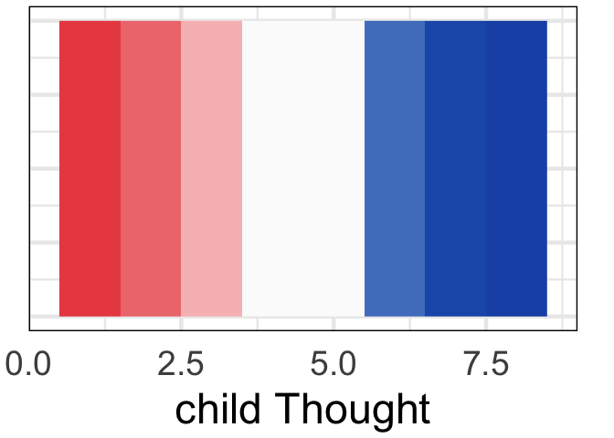<!-- -->

``` r
# Thought
pov_Tho=pNpFits1[,537:555]
MaxTho=quantile(as.numeric(masterdf$cbcl_scr_syn_thought_r), probs = 0.99)
plot_bootstraps_par(pov_Tho,18,'Pov. child Thought',MaxTho)
```

    ## Warning: Returning more (or less) than 1 row per `summarise()` group was deprecated in
    ## dplyr 1.1.0.
    ## ℹ Please use `reframe()` instead.
    ## ℹ When switching from `summarise()` to `reframe()`, remember that `reframe()`
    ##   always returns an ungrouped data frame and adjust accordingly.
    ## Call `lifecycle::last_lifecycle_warnings()` to see where this warning was
    ## generated.

    ## Warning: Removed 90018 rows containing missing values (`geom_line()`).

<!-- -->

``` r
# nonpoverty child p
npov_Tho=pNpFits1[,556:574]
plot_bootstraps_par(npov_Tho,18,'Npov. child Thought',MaxTho)
```

    ## Warning: Returning more (or less) than 1 row per `summarise()` group was deprecated in
    ## dplyr 1.1.0.
    ## ℹ Please use `reframe()` instead.
    ## ℹ When switching from `summarise()` to `reframe()`, remember that `reframe()`
    ##   always returns an ungrouped data frame and adjust accordingly.
    ## Removed 90018 rows containing missing values (`geom_line()`).
    ## Call `lifecycle::last_lifecycle_warnings()` to see where this warning was
    ## generated.

<!-- -->

``` r
# both merged
plot<-plot_bootstraps_pnp(pov_Tho,npov_Tho,18,'child Thought',MaxTho)
```

    ## Warning: Returning more (or less) than 1 row per `summarise()` group was deprecated in
    ## dplyr 1.1.0.
    ## ℹ Please use `reframe()` instead.
    ## ℹ When switching from `summarise()` to `reframe()`, remember that `reframe()`
    ##   always returns an ungrouped data frame and adjust accordingly.
    ## Call `lifecycle::last_lifecycle_warnings()` to see where this warning was
    ## generated.

    ## Warning: Returning more (or less) than 1 row per `summarise()` group was deprecated in
    ## dplyr 1.1.0.
    ## ℹ Please use `reframe()` instead.
    ## ℹ When switching from `summarise()` to `reframe()`, remember that `reframe()`
    ##   always returns an ungrouped data frame and adjust accordingly.
    ## Call `lifecycle::last_lifecycle_warnings()` to see where this warning was
    ## generated.

    ## Scale for alpha is already present.
    ## Adding another scale for alpha, which will replace the existing scale.
    ## Scale for y is already present.
    ## Adding another scale for y, which will replace the existing scale.

``` r
plot + theme(plot.margin = margin(r = 30,l=15,t=5,b=5))
```

    ## Warning: Removed 90018 rows containing missing values (`geom_line()`).

    ## Warning: Removed 90018 rows containing missing values (`geom_line()`).

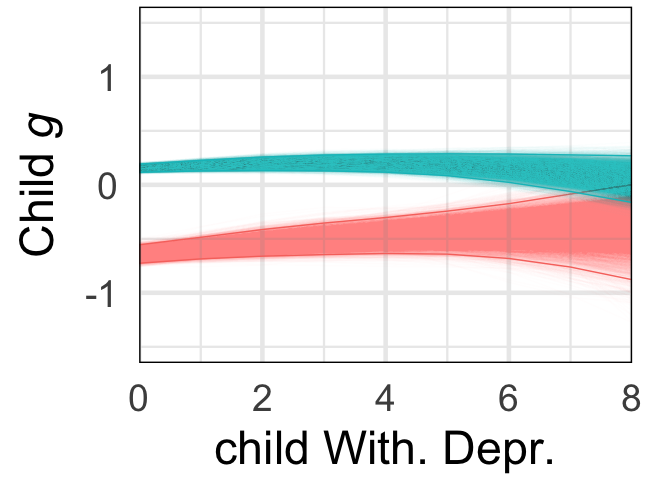<!-- -->

``` r
# poverty
P_derivative_matrix <- matrix(0, nrow = nrow(pov_Tho), ncol = ncol(pov_Tho) - 1)
# Calculate the derivative for each column
for (i in 1:(ncol(pov_Tho) - 1)) {
  # Calculate the differences in x (assuming a constant difference)
  dx <- 1
  # Calculate the differences in y (predicted values)
  dy <- pov_Tho[, i + 1] - pov_Tho[, i]
  # Calculate the derivatives (slopes)
  derivatives <- dy / dx
  # Store the derivatives in the derivative matrix
  P_derivative_matrix[, i] <- derivatives
}
# calc sig dervs
# get straightfoward of segment where 99% is over 0 or under
positive_counts <- colSums(P_derivative_matrix > 0, na.rm = TRUE)
negative_counts <- colSums(P_derivative_matrix < 0, na.rm = TRUE)
# find where each is 99% or greater
positive_countsSig=positive_counts>9500
negative_countsSig=negative_counts>9500
# make dataframe: 50th percentile of derivatives accompanied by posSig and NegSig vector
data <- apply(P_derivative_matrix, 2, function(x) quantile(x, probs = 0.5))
dervPlotDf<-data.frame(data,positive_countsSig,negative_countsSig)
# if either is sig at 99% plot
dervPlotDf$sig_derivMask=dervPlotDf[,2]+dervPlotDf[,3]>0
# use it to mask calculated derivs
dervPlotDf$sig_deriv=0
dervPlotDf$sig_deriv[dervPlotDf$sig_derivMask]=dervPlotDf$data[dervPlotDf$sig_derivMask]
dervPlotDf$seq=1:(dim(dervPlotDf)[1])
plot<-ggplot(data=dervPlotDf) + geom_raster(aes(x = seq, y = .5, fill = sig_deriv))+
    theme(panel.spacing = unit(-.01,"cm")) +
    scale_fill_gradientn(colors = my_palette(100),limits = c(min(-.1),max(0.1)))+theme_minimal(base_size = 35)+
    xlim(c(0,MaxTho))+xlab('child Thought')+
    guides(fill=FALSE)+
    theme(axis.title.y = element_blank(),axis.text.y=element_blank())+theme(panel.border = element_rect(color = "black", fill = NA, size = 1))+
    scale_x_continuous(limits = c(0,MaxTho),expand = expansion(mult = c(0, 0)))
```

    ## Scale for x is already present.
    ## Adding another scale for x, which will replace the existing scale.

``` r
plot + theme(plot.margin = margin(r = 30,l=15,t=5,b=5))
```

    ## Warning: Removed 10 rows containing missing values (`geom_raster()`).

<!-- -->

``` r
# nonpoverty
P_derivative_matrix <- matrix(0, nrow = nrow(npov_Tho), ncol = ncol(npov_Tho) - 1)
# Calculate the derivative for each column
for (i in 1:(ncol(npov_Tho) - 1)) {
  # Calculate the differences in x (assuming a constant difference)
  dx <- 1
  # Calculate the differences in y (predicted values)
  dy <- npov_Tho[, i + 1] - npov_Tho[, i]
  # Calculate the derivatives (slopes)
  derivatives <- dy / dx
  # Store the derivatives in the derivative matrix
  P_derivative_matrix[, i] <- derivatives
}
# calc sig dervs
# get straightfoward of segment where 99% is over 0 or under
positive_counts <- colSums(P_derivative_matrix > 0, na.rm = TRUE)
negative_counts <- colSums(P_derivative_matrix < 0, na.rm = TRUE)
# find where each is 99% or greater
positive_countsSig=positive_counts>9500
negative_countsSig=negative_counts>9500
# make dataframe: 50th percentile of derivatives accompanied by posSig and NegSig vector
data <- apply(P_derivative_matrix, 2, function(x) quantile(x, probs = 0.5))
dervPlotDf<-data.frame(data,positive_countsSig,negative_countsSig)
# if either is sig at 99% plot
dervPlotDf$sig_derivMask=dervPlotDf[,2]+dervPlotDf[,3]>0
# use it to mask calculated derivs
dervPlotDf$sig_deriv=0
dervPlotDf$sig_deriv[dervPlotDf$sig_derivMask]=dervPlotDf$data[dervPlotDf$sig_derivMask]
dervPlotDf$seq=1:(dim(dervPlotDf)[1])
plot<-ggplot(data=dervPlotDf) + geom_raster(aes(x = seq, y = .5, fill = sig_deriv))+
    theme(panel.spacing = unit(-.01,"cm")) +
    scale_fill_gradientn(colors = my_palette(100),limits = c(min(-.1),max(0.1)))+theme_minimal(base_size = 35)+
    xlim(c(0,MaxTho))+xlab('child Thought')+
    guides(fill=FALSE)+
    theme(axis.title.y = element_blank(),axis.text.y=element_blank())+theme(panel.border = element_rect(color = "black", fill = NA, size = 1))+
    scale_x_continuous(limits = c(0,MaxTho),expand = expansion(mult = c(0, 0)))
```

    ## Scale for x is already present.
    ## Adding another scale for x, which will replace the existing scale.

``` r
plot + theme(plot.margin = margin(r = 30,l=15,t=5,b=5))
```

    ## Warning: Removed 10 rows containing missing values (`geom_raster()`).

<!-- -->

``` r
# Withdrawn Depression
pov_Wit=pNpFits1[,575:591]
MaxWit=quantile(as.numeric(masterdf$cbcl_scr_syn_withdep_r), probs = 0.99)
plot_bootstraps_par(pov_Wit,16,'Pov. With. Depr.',MaxWit)
```

    ## Warning: Returning more (or less) than 1 row per `summarise()` group was deprecated in
    ## dplyr 1.1.0.
    ## ℹ Please use `reframe()` instead.
    ## ℹ When switching from `summarise()` to `reframe()`, remember that `reframe()`
    ##   always returns an ungrouped data frame and adjust accordingly.
    ## Call `lifecycle::last_lifecycle_warnings()` to see where this warning was
    ## generated.

    ## Warning: Removed 80016 rows containing missing values (`geom_line()`).

<!-- -->

``` r
# nonpoverty child p
npov_Wit=pNpFits1[,592:608]
plot_bootstraps_par(npov_Wit,16,'Npov. child With. Depr.',MaxWit)
```

    ## Warning: Returning more (or less) than 1 row per `summarise()` group was deprecated in
    ## dplyr 1.1.0.
    ## ℹ Please use `reframe()` instead.
    ## ℹ When switching from `summarise()` to `reframe()`, remember that `reframe()`
    ##   always returns an ungrouped data frame and adjust accordingly.
    ## Removed 80016 rows containing missing values (`geom_line()`).
    ## Call `lifecycle::last_lifecycle_warnings()` to see where this warning was
    ## generated.

<!-- -->

``` r
# both merged
plot<-plot_bootstraps_pnp(pov_Wit,npov_Wit,16,'child With. Depr.',MaxWit)
```

    ## Warning: Returning more (or less) than 1 row per `summarise()` group was deprecated in
    ## dplyr 1.1.0.
    ## ℹ Please use `reframe()` instead.
    ## ℹ When switching from `summarise()` to `reframe()`, remember that `reframe()`
    ##   always returns an ungrouped data frame and adjust accordingly.
    ## Call `lifecycle::last_lifecycle_warnings()` to see where this warning was
    ## generated.

    ## Warning: Returning more (or less) than 1 row per `summarise()` group was deprecated in
    ## dplyr 1.1.0.
    ## ℹ Please use `reframe()` instead.
    ## ℹ When switching from `summarise()` to `reframe()`, remember that `reframe()`
    ##   always returns an ungrouped data frame and adjust accordingly.
    ## Call `lifecycle::last_lifecycle_warnings()` to see where this warning was
    ## generated.

    ## Scale for alpha is already present.
    ## Adding another scale for alpha, which will replace the existing scale.
    ## Scale for y is already present.
    ## Adding another scale for y, which will replace the existing scale.

``` r
plot + theme(plot.margin = margin(r = 30,l=15,t=5,b=5))
```

    ## Warning: Removed 80016 rows containing missing values (`geom_line()`).

    ## Warning: Removed 80016 rows containing missing values (`geom_line()`).

<!-- -->

``` r
# poverty
P_derivative_matrix <- matrix(0, nrow = nrow(pov_Wit), ncol = ncol(pov_Wit) - 1)
# Calculate the derivative for each column
for (i in 1:(ncol(pov_Wit) - 1)) {
  # Calculate the differences in x (assuming a constant difference)
  dx <- 1
  # Calculate the differences in y (predicted values)
  dy <- pov_Wit[, i + 1] - pov_Wit[, i]
  # Calculate the derivatives (slopes)
  derivatives <- dy / dx
  # Store the derivatives in the derivative matrix
  P_derivative_matrix[, i] <- derivatives
}
# calc sig dervs
# get straightfoward of segment where 99% is over 0 or under
positive_counts <- colSums(P_derivative_matrix > 0, na.rm = TRUE)
negative_counts <- colSums(P_derivative_matrix < 0, na.rm = TRUE)
# find where each is 99% or greater
positive_countsSig=positive_counts>9500
negative_countsSig=negative_counts>9500
# make dataframe: 50th percentile of derivatives accompanied by posSig and NegSig vector
data <- apply(P_derivative_matrix, 2, function(x) quantile(x, probs = 0.5))
dervPlotDf<-data.frame(data,positive_countsSig,negative_countsSig)
# if either is sig at 99% plot
dervPlotDf$sig_derivMask=dervPlotDf[,2]+dervPlotDf[,3]>0
# use it to mask calculated derivs
dervPlotDf$sig_deriv=0
dervPlotDf$sig_deriv[dervPlotDf$sig_derivMask]=dervPlotDf$data[dervPlotDf$sig_derivMask]
dervPlotDf$seq=1:(dim(dervPlotDf)[1])
plot<-ggplot(data=dervPlotDf) + geom_raster(aes(x = seq, y = .5, fill = sig_deriv))+
    theme(panel.spacing = unit(-.01,"cm")) +
    scale_fill_gradientn(colors = my_palette(100),limits = c(min(-.1),max(0.1)))+theme_minimal(base_size = 35)+
    xlim(c(0,MaxWit))+xlab('child Wit. Depr.')+
    guides(fill=FALSE)+
    theme(axis.title.y = element_blank(),axis.text.y=element_blank())+theme(panel.border = element_rect(color = "black", fill = NA, size = 1))+
    scale_x_continuous(limits = c(0,MaxWit),expand = expansion(mult = c(0, 0)))
```

    ## Scale for x is already present.
    ## Adding another scale for x, which will replace the existing scale.

``` r
plot + theme(plot.margin = margin(r = 30,l=15,t=5,b=5))
```

    ## Warning: Removed 9 rows containing missing values (`geom_raster()`).

<!-- -->

``` r
# nonpoverty
P_derivative_matrix <- matrix(0, nrow = nrow(npov_Wit), ncol = ncol(npov_Wit) - 1)
# Calculate the derivative for each column
for (i in 1:(ncol(npov_Wit) - 1)) {
  # Calculate the differences in x (assuming a constant difference)
  dx <- 1
  # Calculate the differences in y (predicted values)
  dy <- npov_Wit[, i + 1] - npov_Wit[, i]
  # Calculate the derivatives (slopes)
  derivatives <- dy / dx
  # Store the derivatives in the derivative matrix
  P_derivative_matrix[, i] <- derivatives
}
# calc sig dervs
# get straightfoward of segment where 99% is over 0 or under
positive_counts <- colSums(P_derivative_matrix > 0, na.rm = TRUE)
negative_counts <- colSums(P_derivative_matrix < 0, na.rm = TRUE)
# find where each is 99% or greater
positive_countsSig=positive_counts>9500
negative_countsSig=negative_counts>9500
# make dataframe: 50th percentile of derivatives accompanied by posSig and NegSig vector
data <- apply(P_derivative_matrix, 2, function(x) quantile(x, probs = 0.5))
dervPlotDf<-data.frame(data,positive_countsSig,negative_countsSig)
# if either is sig at 99% plot
dervPlotDf$sig_derivMask=dervPlotDf[,2]+dervPlotDf[,3]>0
# use it to mask calculated derivs
dervPlotDf$sig_deriv=0
dervPlotDf$sig_deriv[dervPlotDf$sig_derivMask]=dervPlotDf$data[dervPlotDf$sig_derivMask]
dervPlotDf$seq=1:(dim(dervPlotDf)[1])
plot<-ggplot(data=dervPlotDf) + geom_raster(aes(x = seq, y = .5, fill = sig_deriv))+
    theme(panel.spacing = unit(-.01,"cm")) +
    scale_fill_gradientn(colors = my_palette(100),limits = c(min(-.1),max(0.1)))+theme_minimal(base_size = 35)+
    xlim(c(0,MaxWit))+xlab('child Wit. Dep.')+
    guides(fill=FALSE)+
    theme(axis.title.y = element_blank(),axis.text.y=element_blank())+theme(panel.border = element_rect(color = "black", fill = NA, size = 1))+
    scale_x_continuous(limits = c(0,MaxWit),expand = expansion(mult = c(0, 0)))
```

    ## Scale for x is already present.
    ## Adding another scale for x, which will replace the existing scale.

``` r
plot + theme(plot.margin = margin(r = 30,l=15,t=5,b=5))
```

    ## Warning: Removed 9 rows containing missing values (`geom_raster()`).

<!-- -->

``` r
# Social
pov_Soc=pNpFits1[,609:626]
MaxSoc=quantile(as.numeric(masterdf$cbcl_scr_syn_social_r), probs = 0.99)
plot_bootstraps_par(pov_Soc,17,'Pov. Social',MaxSoc)
```

    ## Warning: Returning more (or less) than 1 row per `summarise()` group was deprecated in
    ## dplyr 1.1.0.
    ## ℹ Please use `reframe()` instead.
    ## ℹ When switching from `summarise()` to `reframe()`, remember that `reframe()`
    ##   always returns an ungrouped data frame and adjust accordingly.
    ## Call `lifecycle::last_lifecycle_warnings()` to see where this warning was
    ## generated.

    ## Warning: Removed 70014 rows containing missing values (`geom_line()`).

<!-- -->

``` r
# nonpoverty child p
npov_Soc=pNpFits1[,627:644]
plot_bootstraps_par(npov_Soc,17,'Npov. Social',MaxSoc)
```

    ## Warning: Returning more (or less) than 1 row per `summarise()` group was deprecated in
    ## dplyr 1.1.0.
    ## ℹ Please use `reframe()` instead.
    ## ℹ When switching from `summarise()` to `reframe()`, remember that `reframe()`
    ##   always returns an ungrouped data frame and adjust accordingly.
    ## Removed 70014 rows containing missing values (`geom_line()`).
    ## Call `lifecycle::last_lifecycle_warnings()` to see where this warning was
    ## generated.

<!-- -->

``` r
# both merged
plot<-plot_bootstraps_pnp(pov_Soc,npov_Soc,17,'child Social',MaxSoc)
```

    ## Warning: Returning more (or less) than 1 row per `summarise()` group was deprecated in
    ## dplyr 1.1.0.
    ## ℹ Please use `reframe()` instead.
    ## ℹ When switching from `summarise()` to `reframe()`, remember that `reframe()`
    ##   always returns an ungrouped data frame and adjust accordingly.
    ## Call `lifecycle::last_lifecycle_warnings()` to see where this warning was
    ## generated.

    ## Warning: Returning more (or less) than 1 row per `summarise()` group was deprecated in
    ## dplyr 1.1.0.
    ## ℹ Please use `reframe()` instead.
    ## ℹ When switching from `summarise()` to `reframe()`, remember that `reframe()`
    ##   always returns an ungrouped data frame and adjust accordingly.
    ## Call `lifecycle::last_lifecycle_warnings()` to see where this warning was
    ## generated.

    ## Scale for alpha is already present.
    ## Adding another scale for alpha, which will replace the existing scale.
    ## Scale for y is already present.
    ## Adding another scale for y, which will replace the existing scale.

``` r
plot + theme(plot.margin = margin(r = 30,l=15,t=5,b=5))
```

    ## Warning: Removed 70014 rows containing missing values (`geom_line()`).

    ## Warning: Removed 70014 rows containing missing values (`geom_line()`).

<!-- -->

``` r
# poverty
P_derivative_matrix <- matrix(0, nrow = nrow(pov_Soc), ncol = ncol(pov_Soc) - 1)
# Calculate the derivative for each column
for (i in 1:(ncol(pov_Soc) - 1)) {
  # Calculate the differences in x (assuming a constant difference)
  dx <- 1
  # Calculate the differences in y (predicted values)
  dy <- pov_Soc[, i + 1] - pov_Soc[, i]
  # Calculate the derivatives (slopes)
  derivatives <- dy / dx
  # Store the derivatives in the derivative matrix
  P_derivative_matrix[, i] <- derivatives
}
# calc sig dervs
# get straightfoward of segment where 99% is over 0 or under
positive_counts <- colSums(P_derivative_matrix > 0, na.rm = TRUE)
negative_counts <- colSums(P_derivative_matrix < 0, na.rm = TRUE)
# find where each is 99% or greater
positive_countsSig=positive_counts>9500
negative_countsSig=negative_counts>9500
# make dataframe: 50th percentile of derivatives accompanied by posSig and NegSig vector
data <- apply(P_derivative_matrix, 2, function(x) quantile(x, probs = 0.5))
dervPlotDf<-data.frame(data,positive_countsSig,negative_countsSig)
# if either is sig at 99% plot
dervPlotDf$sig_derivMask=dervPlotDf[,2]+dervPlotDf[,3]>0
# use it to mask calculated derivs
dervPlotDf$sig_deriv=0
dervPlotDf$sig_deriv[dervPlotDf$sig_derivMask]=dervPlotDf$data[dervPlotDf$sig_derivMask]
dervPlotDf$seq=1:(dim(dervPlotDf)[1])
plot<-ggplot(data=dervPlotDf) + geom_raster(aes(x = seq, y = .5, fill = sig_deriv))+
    theme(panel.spacing = unit(-.01,"cm")) +
    scale_fill_gradientn(colors = my_palette(100),limits = c(min(-.1),max(0.1)))+theme_minimal(base_size = 35)+
    xlim(c(0,MaxSoc))+xlab('child Social')+
    guides(fill=FALSE)+
    theme(axis.title.y = element_blank(),axis.text.y=element_blank())+theme(panel.border = element_rect(color = "black", fill = NA, size = 1))+
    scale_x_continuous(limits = c(0,MaxSoc),expand = expansion(mult = c(0, 0)))
```

    ## Scale for x is already present.
    ## Adding another scale for x, which will replace the existing scale.

``` r
plot + theme(plot.margin = margin(r = 30,l=15,t=5,b=5))
```

    ## Warning: Removed 8 rows containing missing values (`geom_raster()`).

<!-- -->

``` r
# nonpoverty
P_derivative_matrix <- matrix(0, nrow = nrow(npov_Soc), ncol = ncol(npov_Soc) - 1)
# Calculate the derivative for each column
for (i in 1:(ncol(npov_Soc) - 1)) {
  # Calculate the differences in x (assuming a constant difference)
  dx <- 1
  # Calculate the differences in y (predicted values)
  dy <- npov_Soc[, i + 1] - npov_Soc[, i]
  # Calculate the derivatives (slopes)
  derivatives <- dy / dx
  # Store the derivatives in the derivative matrix
  P_derivative_matrix[, i] <- derivatives
}
# calc sig dervs
# get straightfoward of segment where 99% is over 0 or under
positive_counts <- colSums(P_derivative_matrix > 0, na.rm = TRUE)
negative_counts <- colSums(P_derivative_matrix < 0, na.rm = TRUE)
# find where each is 99% or greater
positive_countsSig=positive_counts>9500
negative_countsSig=negative_counts>9500
# make dataframe: 50th percentile of derivatives accompanied by posSig and NegSig vector
data <- apply(P_derivative_matrix, 2, function(x) quantile(x, probs = 0.5))
dervPlotDf<-data.frame(data,positive_countsSig,negative_countsSig)
# if either is sig at 99% plot
dervPlotDf$sig_derivMask=dervPlotDf[,2]+dervPlotDf[,3]>0
# use it to mask calculated derivs
dervPlotDf$sig_deriv=0
dervPlotDf$sig_deriv[dervPlotDf$sig_derivMask]=dervPlotDf$data[dervPlotDf$sig_derivMask]
dervPlotDf$seq=1:(dim(dervPlotDf)[1])
plot<-ggplot(data=dervPlotDf) + geom_raster(aes(x = seq, y = .5, fill = sig_deriv))+
    theme(panel.spacing = unit(-.01,"cm")) +
    scale_fill_gradientn(colors = my_palette(100),limits = c(min(-.1),max(0.1)))+theme_minimal(base_size = 35)+
    xlim(c(0,MaxSoc))+xlab('child Social')+
    guides(fill=FALSE)+
    theme(axis.title.y = element_blank(),axis.text.y=element_blank())+theme(panel.border = element_rect(color = "black", fill = NA, size = 1))+
    scale_x_continuous(limits = c(0,MaxSoc),expand = expansion(mult = c(0, 0)))
```

    ## Scale for x is already present.
    ## Adding another scale for x, which will replace the existing scale.

``` r
plot + theme(plot.margin = margin(r = 30,l=15,t=5,b=5))
```

    ## Warning: Removed 8 rows containing missing values (`geom_raster()`).

<!-- -->

``` r
# attention
# and also note increased y-axis
pov_Att=pNpFits1[,645:664]
MaxAtt=quantile(as.numeric(masterdf$cbcl_scr_syn_attention_r), probs = 0.99)
plot_bootstraps_par(pov_Att,19,'Pov. Attn.',MaxAtt)
```

    ## Warning: Returning more (or less) than 1 row per `summarise()` group was deprecated in
    ## dplyr 1.1.0.
    ## ℹ Please use `reframe()` instead.
    ## ℹ When switching from `summarise()` to `reframe()`, remember that `reframe()`
    ##   always returns an ungrouped data frame and adjust accordingly.
    ## Call `lifecycle::last_lifecycle_warnings()` to see where this warning was
    ## generated.

    ## Warning: Removed 50010 rows containing missing values (`geom_line()`).

<!-- -->

``` r
# nonpoverty child p
npov_Att=pNpFits1[,665:684]
plot_bootstraps_par(npov_Att,19,'Npov. Attn.',MaxAtt)
```

    ## Warning: Returning more (or less) than 1 row per `summarise()` group was deprecated in
    ## dplyr 1.1.0.
    ## ℹ Please use `reframe()` instead.
    ## ℹ When switching from `summarise()` to `reframe()`, remember that `reframe()`
    ##   always returns an ungrouped data frame and adjust accordingly.
    ## Removed 50010 rows containing missing values (`geom_line()`).
    ## Call `lifecycle::last_lifecycle_warnings()` to see where this warning was
    ## generated.

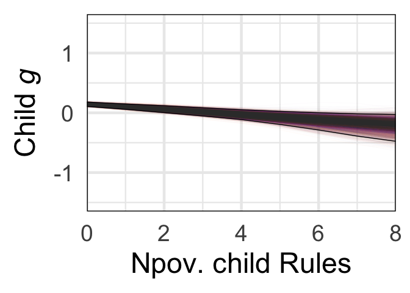<!-- -->

``` r
# both merged
plot<-plot_bootstraps_pnp(pov_Att,npov_Att,19,'child Attention',MaxAtt)
```

    ## Warning: Returning more (or less) than 1 row per `summarise()` group was deprecated in
    ## dplyr 1.1.0.
    ## ℹ Please use `reframe()` instead.
    ## ℹ When switching from `summarise()` to `reframe()`, remember that `reframe()`
    ##   always returns an ungrouped data frame and adjust accordingly.
    ## Call `lifecycle::last_lifecycle_warnings()` to see where this warning was
    ## generated.

    ## Warning: Returning more (or less) than 1 row per `summarise()` group was deprecated in
    ## dplyr 1.1.0.
    ## ℹ Please use `reframe()` instead.
    ## ℹ When switching from `summarise()` to `reframe()`, remember that `reframe()`
    ##   always returns an ungrouped data frame and adjust accordingly.
    ## Call `lifecycle::last_lifecycle_warnings()` to see where this warning was
    ## generated.

    ## Scale for alpha is already present.
    ## Adding another scale for alpha, which will replace the existing scale.
    ## Scale for y is already present.
    ## Adding another scale for y, which will replace the existing scale.

``` r
plot + theme(plot.margin = margin(r = 30,l=5,t=5,b=5))
```

    ## Warning: Removed 50010 rows containing missing values (`geom_line()`).

    ## Warning: Removed 50010 rows containing missing values (`geom_line()`).

<!-- -->

``` r
# poverty
P_derivative_matrix <- matrix(0, nrow = nrow(pov_Att), ncol = ncol(pov_Att) - 1)
# Calculate the derivative for each column
for (i in 1:(ncol(pov_Att) - 1)) {
  # Calculate the differences in x (assuming a constant difference)
  dx <- 1
  # Calculate the differences in y (predicted values)
  dy <- pov_Att[, i + 1] - pov_Att[, i]
  # Calculate the derivatives (slopes)
  derivatives <- dy / dx
  # Store the derivatives in the derivative matrix
  P_derivative_matrix[, i] <- derivatives
}
# calc sig dervs
# get straightfoward of segment where 99% is over 0 or under
positive_counts <- colSums(P_derivative_matrix > 0, na.rm = TRUE)
negative_counts <- colSums(P_derivative_matrix < 0, na.rm = TRUE)
# find where each is 99% or greater
positive_countsSig=positive_counts>9500
negative_countsSig=negative_counts>9500
# make dataframe: 50th percentile of derivatives accompanied by posSig and NegSig vector
data <- apply(P_derivative_matrix, 2, function(x) quantile(x, probs = 0.5))
dervPlotDf<-data.frame(data,positive_countsSig,negative_countsSig)
# if either is sig at 99% plot
dervPlotDf$sig_derivMask=dervPlotDf[,2]+dervPlotDf[,3]>0
# use it to mask calculated derivs
dervPlotDf$sig_deriv=0
dervPlotDf$sig_deriv[dervPlotDf$sig_derivMask]=dervPlotDf$data[dervPlotDf$sig_derivMask]
dervPlotDf$seq=1:(dim(dervPlotDf)[1])
plot<-ggplot(data=dervPlotDf) + geom_raster(aes(x = seq, y = .5, fill = sig_deriv))+
    theme(panel.spacing = unit(-.01,"cm")) +
    scale_fill_gradientn(colors = my_palette(100),limits = c(min(-.1),max(0.1)))+theme_minimal(base_size = 35)+
    xlim(c(0,MaxAtt))+xlab('child Attn.')+
    guides(fill=FALSE)+
    theme(axis.title.y = element_blank(),axis.text.y=element_blank())+theme(panel.border = element_rect(color = "black", fill = NA, size = 1))+
    scale_x_continuous(limits = c(0,MaxAtt),expand = expansion(mult = c(0, 0)))
```

    ## Scale for x is already present.
    ## Adding another scale for x, which will replace the existing scale.

``` r
plot + theme(plot.margin = margin(r = 30,l=5,t=5,b=5))
```

    ## Warning: Removed 6 rows containing missing values (`geom_raster()`).

<!-- -->

``` r
# nonpoverty
P_derivative_matrix <- matrix(0, nrow = nrow(npov_Att), ncol = ncol(npov_Att) - 1)
# Calculate the derivative for each column
for (i in 1:(ncol(npov_Att) - 1)) {
  # Calculate the differences in x (assuming a constant difference)
  dx <- 1
  # Calculate the differences in y (predicted values)
  dy <- npov_Att[, i + 1] - npov_Att[, i]
  # Calculate the derivatives (slopes)
  derivatives <- dy / dx
  # Store the derivatives in the derivative matrix
  P_derivative_matrix[, i] <- derivatives
}
# calc sig dervs
# get straightfoward of segment where 99% is over 0 or under
positive_counts <- colSums(P_derivative_matrix > 0, na.rm = TRUE)
negative_counts <- colSums(P_derivative_matrix < 0, na.rm = TRUE)
# find where each is 99% or greater
positive_countsSig=positive_counts>9500
negative_countsSig=negative_counts>9500
# make dataframe: 50th percentile of derivatives accompanied by posSig and NegSig vector
data <- apply(P_derivative_matrix, 2, function(x) quantile(x, probs = 0.5))
dervPlotDf<-data.frame(data,positive_countsSig,negative_countsSig)
# if either is sig at 99% plot
dervPlotDf$sig_derivMask=dervPlotDf[,2]+dervPlotDf[,3]>0
# use it to mask calculated derivs
dervPlotDf$sig_deriv=0
dervPlotDf$sig_deriv[dervPlotDf$sig_derivMask]=dervPlotDf$data[dervPlotDf$sig_derivMask]
dervPlotDf$seq=1:(dim(dervPlotDf)[1])
plot<-ggplot(data=dervPlotDf) + geom_raster(aes(x = seq, y = .5, fill = sig_deriv))+
    theme(panel.spacing = unit(-.01,"cm")) +
    scale_fill_gradientn(colors = my_palette(100),limits = c(min(-.1),max(0.1)))+theme_minimal(base_size = 35)+
    xlim(c(0,MaxAtt))+xlab('child Attn.')+
    guides(fill=FALSE)+
    theme(axis.title.y = element_blank(),axis.text.y=element_blank())+theme(panel.border = element_rect(color = "black", fill = NA, size = 1))+
    scale_x_continuous(limits = c(0,MaxAtt),expand = expansion(mult = c(0, 0)))
```

    ## Scale for x is already present.
    ## Adding another scale for x, which will replace the existing scale.

``` r
plot + theme(plot.margin = margin(r = 30,l=5,t=5,b=5))
```

    ## Warning: Removed 6 rows containing missing values (`geom_raster()`).

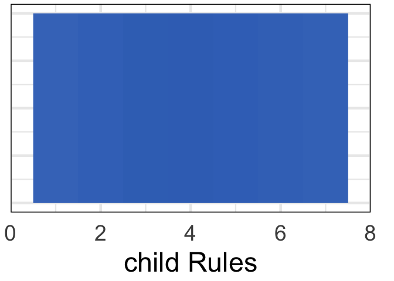<!-- -->

``` r
# Rule breaking
pov_RB=pNpFits1[,685:703]
MaxRB=quantile(as.numeric(masterdf$cbcl_scr_syn_rulebreak_r), probs = 0.99)
plot_bootstraps_par(pov_RB,18,'Pov. Rules',MaxRB)
```

    ## Warning: Returning more (or less) than 1 row per `summarise()` group was deprecated in
    ## dplyr 1.1.0.
    ## ℹ Please use `reframe()` instead.
    ## ℹ When switching from `summarise()` to `reframe()`, remember that `reframe()`
    ##   always returns an ungrouped data frame and adjust accordingly.
    ## Call `lifecycle::last_lifecycle_warnings()` to see where this warning was
    ## generated.

    ## Warning: Removed 100020 rows containing missing values (`geom_line()`).

<!-- -->

``` r
# nonpoverty child p
npov_RB=pNpFits1[,704:722]
plot_bootstraps_par(npov_RB,18,'Npov. child Rules',MaxRB)
```

    ## Warning: Returning more (or less) than 1 row per `summarise()` group was deprecated in
    ## dplyr 1.1.0.
    ## ℹ Please use `reframe()` instead.
    ## ℹ When switching from `summarise()` to `reframe()`, remember that `reframe()`
    ##   always returns an ungrouped data frame and adjust accordingly.
    ## Removed 100020 rows containing missing values (`geom_line()`).
    ## Call `lifecycle::last_lifecycle_warnings()` to see where this warning was
    ## generated.

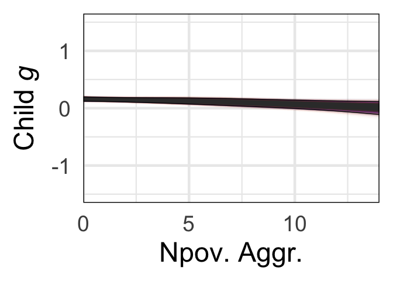<!-- -->

``` r
# both merged
plot<-plot_bootstraps_pnp(pov_RB,npov_RB,18,'child Rules',MaxRB)
```

    ## Warning: Returning more (or less) than 1 row per `summarise()` group was deprecated in
    ## dplyr 1.1.0.
    ## ℹ Please use `reframe()` instead.
    ## ℹ When switching from `summarise()` to `reframe()`, remember that `reframe()`
    ##   always returns an ungrouped data frame and adjust accordingly.
    ## Call `lifecycle::last_lifecycle_warnings()` to see where this warning was
    ## generated.

    ## Warning: Returning more (or less) than 1 row per `summarise()` group was deprecated in
    ## dplyr 1.1.0.
    ## ℹ Please use `reframe()` instead.
    ## ℹ When switching from `summarise()` to `reframe()`, remember that `reframe()`
    ##   always returns an ungrouped data frame and adjust accordingly.
    ## Call `lifecycle::last_lifecycle_warnings()` to see where this warning was
    ## generated.

    ## Scale for alpha is already present.
    ## Adding another scale for alpha, which will replace the existing scale.
    ## Scale for y is already present.
    ## Adding another scale for y, which will replace the existing scale.

``` r
plot + theme(plot.margin = margin(r = 30,l=5,t=5,b=5))
```

    ## Warning: Removed 100020 rows containing missing values (`geom_line()`).

    ## Warning: Removed 100020 rows containing missing values (`geom_line()`).

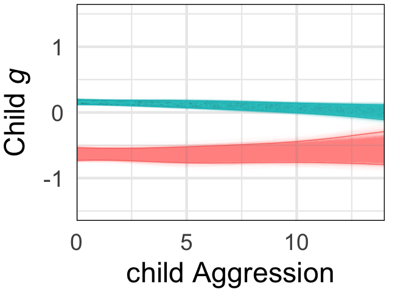<!-- -->

``` r
# poverty
P_derivative_matrix <- matrix(0, nrow = nrow(pov_RB), ncol = ncol(pov_RB) - 1)
# Calculate the derivative for each column
for (i in 1:(ncol(pov_RB) - 1)) {
  # Calculate the differences in x (assuming a constant difference)
  dx <- 1
  # Calculate the differences in y (predicted values)
  dy <- pov_RB[, i + 1] - pov_RB[, i]
  # Calculate the derivatives (slopes)
  derivatives <- dy / dx
  # Store the derivatives in the derivative matrix
  P_derivative_matrix[, i] <- derivatives
}
# calc sig dervs
# get straightfoward of segment where 99% is over 0 or under
positive_counts <- colSums(P_derivative_matrix > 0, na.rm = TRUE)
negative_counts <- colSums(P_derivative_matrix < 0, na.rm = TRUE)
# find where each is 99% or greater
positive_countsSig=positive_counts>9500
negative_countsSig=negative_counts>9500
# make dataframe: 50th percentile of derivatives accompanied by posSig and NegSig vector
data <- apply(P_derivative_matrix, 2, function(x) quantile(x, probs = 0.5))
dervPlotDf<-data.frame(data,positive_countsSig,negative_countsSig)
# if either is sig at 99% plot
dervPlotDf$sig_derivMask=dervPlotDf[,2]+dervPlotDf[,3]>0
# use it to mask calculated derivs
dervPlotDf$sig_deriv=0
dervPlotDf$sig_deriv[dervPlotDf$sig_derivMask]=dervPlotDf$data[dervPlotDf$sig_derivMask]
dervPlotDf$seq=1:(dim(dervPlotDf)[1])
plot<-ggplot(data=dervPlotDf) + geom_raster(aes(x = seq, y = .5, fill = sig_deriv))+
    theme(panel.spacing = unit(-.01,"cm")) +
    scale_fill_gradientn(colors = my_palette(100),limits = c(min(-.1),max(0.1)))+theme_minimal(base_size = 35)+
    xlim(c(0,MaxRB))+xlab('child Rules')+
    guides(fill=FALSE)+
    theme(axis.title.y = element_blank(),axis.text.y=element_blank())+theme(panel.border = element_rect(color = "black", fill = NA, size = 1))+
    scale_x_continuous(limits = c(0,MaxRB),expand = expansion(mult = c(0, 0)))
```

    ## Scale for x is already present.
    ## Adding another scale for x, which will replace the existing scale.

``` r
plot + theme(plot.margin = margin(r = 30,l=5,t=5,b=5))
```

    ## Warning: Removed 11 rows containing missing values (`geom_raster()`).

<!-- -->

``` r
# nonpoverty
P_derivative_matrix <- matrix(0, nrow = nrow(npov_RB), ncol = ncol(npov_RB) - 1)
# Calculate the derivative for each column
for (i in 1:(ncol(npov_RB) - 1)) {
  # Calculate the differences in x (assuming a constant difference)
  dx <- 1
  # Calculate the differences in y (predicted values)
  dy <- npov_RB[, i + 1] - npov_RB[, i]
  # Calculate the derivatives (slopes)
  derivatives <- dy / dx
  # Store the derivatives in the derivative matrix
  P_derivative_matrix[, i] <- derivatives
}
# calc sig dervs
# get straightfoward of segment where 99% is over 0 or under
positive_counts <- colSums(P_derivative_matrix > 0, na.rm = TRUE)
negative_counts <- colSums(P_derivative_matrix < 0, na.rm = TRUE)
# find where each is 99% or greater
positive_countsSig=positive_counts>9500
negative_countsSig=negative_counts>9500
# make dataframe: 50th percentile of derivatives accompanied by posSig and NegSig vector
data <- apply(P_derivative_matrix, 2, function(x) quantile(x, probs = 0.5))
dervPlotDf<-data.frame(data,positive_countsSig,negative_countsSig)
# if either is sig at 99% plot
dervPlotDf$sig_derivMask=dervPlotDf[,2]+dervPlotDf[,3]>0
# use it to mask calculated derivs
dervPlotDf$sig_deriv=0
dervPlotDf$sig_deriv[dervPlotDf$sig_derivMask]=dervPlotDf$data[dervPlotDf$sig_derivMask]
dervPlotDf$seq=1:(dim(dervPlotDf)[1])
plot<-ggplot(data=dervPlotDf) + geom_raster(aes(x = seq, y = .5, fill = sig_deriv))+
    theme(panel.spacing = unit(-.01,"cm")) +
    scale_fill_gradientn(colors = my_palette(100),limits = c(min(-.1),max(0.1)))+theme_minimal(base_size = 35)+
    xlim(c(0,MaxRB))+xlab('child Rules')+
    guides(fill=FALSE)+
    theme(axis.title.y = element_blank(),axis.text.y=element_blank())+theme(panel.border = element_rect(color = "black", fill = NA, size = 1))+
    scale_x_continuous(limits = c(0,MaxRB),expand = expansion(mult = c(0, 0)))
```

    ## Scale for x is already present.
    ## Adding another scale for x, which will replace the existing scale.

``` r
plot + theme(plot.margin = margin(r = 30,l=5,t=5,b=5))
```

    ## Warning: Removed 11 rows containing missing values (`geom_raster()`).

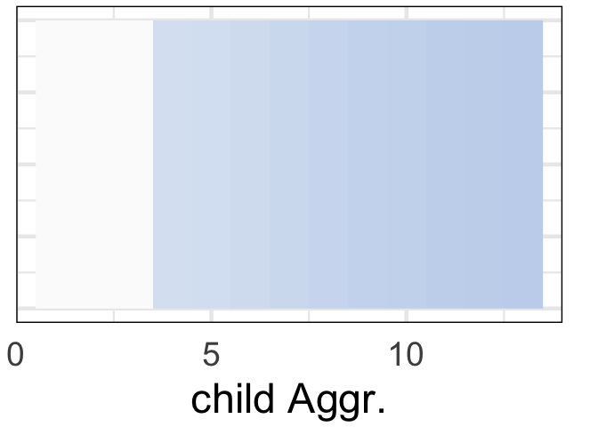<!-- -->

``` r
# aggression
pov_Agg=pNpFits1[,723:755]
MaxAgg=quantile(as.numeric(masterdf$cbcl_scr_syn_attention_r), probs = 0.99)
plot_bootstraps_par(pov_Agg,32,'Pov. Aggr.',MaxAgg)
```

    ## Warning: Returning more (or less) than 1 row per `summarise()` group was deprecated in
    ## dplyr 1.1.0.
    ## ℹ Please use `reframe()` instead.
    ## ℹ When switching from `summarise()` to `reframe()`, remember that `reframe()`
    ##   always returns an ungrouped data frame and adjust accordingly.
    ## Call `lifecycle::last_lifecycle_warnings()` to see where this warning was
    ## generated.

    ## Warning: Removed 180036 rows containing missing values (`geom_line()`).

<!-- -->

``` r
# nonpoverty child p
npov_Agg=pNpFits1[,756:788]
plot_bootstraps_par(npov_Agg,32,'Npov. Aggr.',MaxAgg)
```

    ## Warning: Returning more (or less) than 1 row per `summarise()` group was deprecated in
    ## dplyr 1.1.0.
    ## ℹ Please use `reframe()` instead.
    ## ℹ When switching from `summarise()` to `reframe()`, remember that `reframe()`
    ##   always returns an ungrouped data frame and adjust accordingly.
    ## Removed 180036 rows containing missing values (`geom_line()`).
    ## Call `lifecycle::last_lifecycle_warnings()` to see where this warning was
    ## generated.

<!-- -->

``` r
# both merged
plot<-plot_bootstraps_pnp(pov_Agg,npov_Agg,32,'child Aggression',MaxAgg)
```

    ## Warning: Returning more (or less) than 1 row per `summarise()` group was deprecated in
    ## dplyr 1.1.0.
    ## ℹ Please use `reframe()` instead.
    ## ℹ When switching from `summarise()` to `reframe()`, remember that `reframe()`
    ##   always returns an ungrouped data frame and adjust accordingly.
    ## Call `lifecycle::last_lifecycle_warnings()` to see where this warning was
    ## generated.

    ## Warning: Returning more (or less) than 1 row per `summarise()` group was deprecated in
    ## dplyr 1.1.0.
    ## ℹ Please use `reframe()` instead.
    ## ℹ When switching from `summarise()` to `reframe()`, remember that `reframe()`
    ##   always returns an ungrouped data frame and adjust accordingly.
    ## Call `lifecycle::last_lifecycle_warnings()` to see where this warning was
    ## generated.

    ## Scale for alpha is already present.
    ## Adding another scale for alpha, which will replace the existing scale.
    ## Scale for y is already present.
    ## Adding another scale for y, which will replace the existing scale.

``` r
plot + theme(plot.margin = margin(r = 30,l=5,t=5,b=5))
```

    ## Warning: Removed 180036 rows containing missing values (`geom_line()`).

    ## Warning: Removed 180036 rows containing missing values (`geom_line()`).

<!-- -->

``` r
# poverty
P_derivative_matrix <- matrix(0, nrow = nrow(pov_Int), ncol = ncol(pov_Int) - 1)
# Calculate the derivative for each column
for (i in 1:(ncol(pov_Int) - 1)) {
  # Calculate the differences in x (assuming a constant difference)
  dx <- 1
  # Calculate the differences in y (predicted values)
  dy <- pov_Int[, i + 1] - pov_Int[, i]
  # Calculate the derivatives (slopes)
  derivatives <- dy / dx
  # Store the derivatives in the derivative matrix
  P_derivative_matrix[, i] <- derivatives
}
# calc sig dervs
# get straightfoward of segment where 99% is over 0 or under
positive_counts <- colSums(P_derivative_matrix > 0, na.rm = TRUE)
negative_counts <- colSums(P_derivative_matrix < 0, na.rm = TRUE)
# find where each is 99% or greater
positive_countsSig=positive_counts>9500
negative_countsSig=negative_counts>9500
# make dataframe: 50th percentile of derivatives accompanied by posSig and NegSig vector
data <- apply(P_derivative_matrix, 2, function(x) quantile(x, probs = 0.5))
dervPlotDf<-data.frame(data,positive_countsSig,negative_countsSig)
# if either is sig at 99% plot
dervPlotDf$sig_derivMask=dervPlotDf[,2]+dervPlotDf[,3]>0
# use it to mask calculated derivs
dervPlotDf$sig_deriv=0
dervPlotDf$sig_deriv[dervPlotDf$sig_derivMask]=dervPlotDf$data[dervPlotDf$sig_derivMask]
dervPlotDf$seq=1:(dim(dervPlotDf)[1])
plot<-ggplot(data=dervPlotDf) + geom_raster(aes(x = seq, y = .5, fill = sig_deriv))+
    theme(panel.spacing = unit(-.01,"cm")) +
    scale_fill_gradientn(colors = my_palette(100),limits = c(min(-.1),max(0.1)))+theme_minimal(base_size = 35)+
    xlim(c(0,MaxAgg))+xlab('child Aggr.')+
    guides(fill=FALSE)+
    theme(axis.title.y = element_blank(),axis.text.y=element_blank())+theme(panel.border = element_rect(color = "black", fill = NA, size = 1))+
    scale_x_continuous(limits = c(0,MaxAgg),expand = expansion(mult = c(0, 0)))
```

    ## Scale for x is already present.
    ## Adding another scale for x, which will replace the existing scale.

``` r
plot + theme(plot.margin = margin(r = 30,l=5,t=5,b=5))
```

    ## Warning: Removed 38 rows containing missing values (`geom_raster()`).

<!-- -->

``` r
# nonpoverty
P_derivative_matrix <- matrix(0, nrow = nrow(npov_Agg), ncol = ncol(npov_Agg) - 1)
# Calculate the derivative for each column
for (i in 1:(ncol(npov_Agg) - 1)) {
  # Calculate the differences in x (assuming a constant difference)
  dx <- 1
  # Calculate the differences in y (predicted values)
  dy <- npov_Agg[, i + 1] - npov_Agg[, i]
  # Calculate the derivatives (slopes)
  derivatives <- dy / dx
  # Store the derivatives in the derivative matrix
  P_derivative_matrix[, i] <- derivatives
}
# calc sig dervs
# get straightfoward of segment where 99% is over 0 or under
positive_counts <- colSums(P_derivative_matrix > 0, na.rm = TRUE)
negative_counts <- colSums(P_derivative_matrix < 0, na.rm = TRUE)
# find where each is 99% or greater
positive_countsSig=positive_counts>9500
negative_countsSig=negative_counts>9500
# make dataframe: 50th percentile of derivatives accompanied by posSig and NegSig vector
data <- apply(P_derivative_matrix, 2, function(x) quantile(x, probs = 0.5))
dervPlotDf<-data.frame(data,positive_countsSig,negative_countsSig)
# if either is sig at 99% plot
dervPlotDf$sig_derivMask=dervPlotDf[,2]+dervPlotDf[,3]>0
# use it to mask calculated derivs
dervPlotDf$sig_deriv=0
dervPlotDf$sig_deriv[dervPlotDf$sig_derivMask]=dervPlotDf$data[dervPlotDf$sig_derivMask]
dervPlotDf$seq=1:(dim(dervPlotDf)[1])
plot<-ggplot(data=dervPlotDf) + geom_raster(aes(x = seq, y = .5, fill = sig_deriv))+
    theme(panel.spacing = unit(-.01,"cm")) +
    scale_fill_gradientn(colors = my_palette(100),limits = c(min(-.1),max(0.1)))+theme_minimal(base_size = 35)+
    xlim(c(0,MaxAgg))+xlab('child Aggr.')+
    guides(fill=FALSE)+
    theme(axis.title.y = element_blank(),axis.text.y=element_blank())+theme(panel.border = element_rect(color = "black", fill = NA, size = 1))+
    scale_x_continuous(limits = c(0,MaxAgg),expand = expansion(mult = c(0, 0)))
```

    ## Scale for x is already present.
    ## Adding another scale for x, which will replace the existing scale.

``` r
plot + theme(plot.margin = margin(r = 30,l=5,t=5,b=5))
```

    ## Warning: Removed 19 rows containing missing values (`geom_raster()`).

<!-- -->

``` r
# end of child poverty plots
```

``` r
### poverty versus nonpoverty boots plot - ASR

### re-merge the 5, update indices to pull values from
pNpFits1=readRDS('~/Desktop/g_p/gpFitBoots_asr_pNp1.rds')
pNpFits2=readRDS('~/Desktop/g_p/gpFitBoots_asr_pNp2.rds')
pNpFits3=readRDS('~/Desktop/g_p/gpFitBoots_asr_pNp3.rds')
pNpFits4=readRDS('~/Desktop/g_p/gpFitBoots_asr_pNp4.rds')
pNpFits5=readRDS('~/Desktop/g_p/gpFitBoots_asr_pNp5.rds')

# sub in values created in other iteration
pNpFits1[2001:4000,]=pNpFits2[2001:4000,]
pNpFits1[4001:6000,]=pNpFits3[4001:6000,]
pNpFits1[6001:8000,]=pNpFits4[6001:8000,]
pNpFits1[8001:10000,]=pNpFits5[8001:10000,]


# poverty parental p
# p is 1:160, pov then nopov
pov_p=pNpFits1[,1:161]
# using 99th percentile as cutoff - sparser coverage in poverty bootstraps
MaxP=quantile(masterdf$parentPcount, probs = 0.99)
plot_bootstraps_par(pov_p,160,'Pov. Parental P',MaxP)
```

    ## Warning: Returning more (or less) than 1 row per `summarise()` group was deprecated in
    ## dplyr 1.1.0.
    ## ℹ Please use `reframe()` instead.
    ## ℹ When switching from `summarise()` to `reframe()`, remember that `reframe()`
    ##   always returns an ungrouped data frame and adjust accordingly.
    ## Call `lifecycle::last_lifecycle_warnings()` to see where this warning was
    ## generated.

    ## Warning: Removed 600120 rows containing missing values (`geom_line()`).

<!-- -->

``` r
# nonpoverty parental p
npov_p=pNpFits1[,162:322]
plot_bootstraps_par(npov_p,160,'Npov. Parental P',MaxP)
```

    ## Warning: Returning more (or less) than 1 row per `summarise()` group was deprecated in
    ## dplyr 1.1.0.
    ## ℹ Please use `reframe()` instead.
    ## ℹ When switching from `summarise()` to `reframe()`, remember that `reframe()`
    ##   always returns an ungrouped data frame and adjust accordingly.
    ## Removed 600120 rows containing missing values (`geom_line()`).
    ## Call `lifecycle::last_lifecycle_warnings()` to see where this warning was
    ## generated.

<!-- -->

``` r
# both merged
plot<-plot_bootstraps_pnp(pov_p,npov_p,160,'Parental P',MaxP)
```

    ## Warning: Returning more (or less) than 1 row per `summarise()` group was deprecated in
    ## dplyr 1.1.0.
    ## ℹ Please use `reframe()` instead.
    ## ℹ When switching from `summarise()` to `reframe()`, remember that `reframe()`
    ##   always returns an ungrouped data frame and adjust accordingly.
    ## Call `lifecycle::last_lifecycle_warnings()` to see where this warning was
    ## generated.

    ## Warning: Returning more (or less) than 1 row per `summarise()` group was deprecated in
    ## dplyr 1.1.0.
    ## ℹ Please use `reframe()` instead.
    ## ℹ When switching from `summarise()` to `reframe()`, remember that `reframe()`
    ##   always returns an ungrouped data frame and adjust accordingly.
    ## Call `lifecycle::last_lifecycle_warnings()` to see where this warning was
    ## generated.

    ## Scale for alpha is already present.
    ## Adding another scale for alpha, which will replace the existing scale.
    ## Scale for y is already present.
    ## Adding another scale for y, which will replace the existing scale.

``` r
plot + theme(plot.margin = margin(r = 30,l=5,t=5,b=5))
```

    ## Warning: Removed 600120 rows containing missing values (`geom_line()`).

    ## Warning: Removed 600120 rows containing missing values (`geom_line()`).

<!-- -->

``` r
# derivatives
# poverty
P_derivative_matrix <- matrix(0, nrow = nrow(pov_p), ncol = ncol(pov_p) - 1)
# Calculate the derivative for each column
for (i in 1:(ncol(pov_p) - 1)) {
  # Calculate the differences in x (assuming a constant difference)
  dx <- 1
  # Calculate the differences in y (predicted values)
  dy <- pov_p[, i + 1] - pov_p[, i]
  # Calculate the derivatives (slopes)
  derivatives <- dy / dx
  # Store the derivatives in the derivative matrix
  P_derivative_matrix[, i] <- derivatives
}
# calc sig dervs
# get straightfoward of segment where 99% is over 0 or under
positive_counts <- colSums(P_derivative_matrix > 0, na.rm = TRUE)
negative_counts <- colSums(P_derivative_matrix < 0, na.rm = TRUE)
# find where each is 99% or greater
positive_countsSig=positive_counts>9500
negative_countsSig=negative_counts>9500
# make dataframe: 50th percentile of derivatives accompanied by posSig and NegSig vector
data <- apply(P_derivative_matrix, 2, function(x) quantile(x, probs = 0.5))
dervPlotDf<-data.frame(data,positive_countsSig,negative_countsSig)
# if either is sig at 99% plot
dervPlotDf$sig_derivMask=dervPlotDf[,2]+dervPlotDf[,3]>0
# use it to mask calculated derivs
dervPlotDf$sig_deriv=0
dervPlotDf$sig_deriv[dervPlotDf$sig_derivMask]=dervPlotDf$data[dervPlotDf$sig_derivMask]
dervPlotDf$seq=1:(dim(dervPlotDf)[1])
plot<-ggplot(data=dervPlotDf) + geom_raster(aes(x = seq, y = .5, fill = sig_deriv))+
    theme(panel.spacing = unit(-.01,"cm")) +
    scale_fill_gradientn(colors = my_palette(100),limits = c(min(-.1),max(0.1)))+theme_minimal(base_size = 35)+
    xlim(c(0,MaxP))+xlab(x_title)+
    guides(fill=FALSE)+
    theme(axis.title.y = element_blank(),axis.text.y=element_blank())+theme(panel.border = element_rect(color = "black", fill = NA, size = 1))+
    scale_x_continuous(limits = c(0,MaxP),expand = expansion(mult = c(0, 0)))
```

    ## Scale for x is already present.
    ## Adding another scale for x, which will replace the existing scale.

``` r
plot + theme(plot.margin = margin(r = 30,l=5,t=5,b=5))
```

    ## Warning: Removed 61 rows containing missing values (`geom_raster()`).

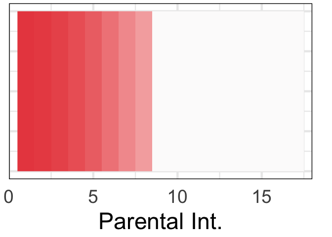<!-- -->

``` r
# nonpoverty
P_derivative_matrix <- matrix(0, nrow = nrow(npov_p), ncol = ncol(npov_p) - 1)
# Calculate the derivative for each column
for (i in 1:(ncol(npov_p) - 1)) {
  # Calculate the differences in x (assuming a constant difference)
  dx <- 1
  # Calculate the differences in y (predicted values)
  dy <- npov_p[, i + 1] - npov_p[, i]
  # Calculate the derivatives (slopes)
  derivatives <- dy / dx
  # Store the derivatives in the derivative matrix
  P_derivative_matrix[, i] <- derivatives
}
# calc sig dervs
# get straightfoward of segment where 99% is over 0 or under
positive_counts <- colSums(P_derivative_matrix > 0, na.rm = TRUE)
negative_counts <- colSums(P_derivative_matrix < 0, na.rm = TRUE)
# find where each is 99% or greater
positive_countsSig=positive_counts>9500
negative_countsSig=negative_counts>9500
# make dataframe: 50th percentile of derivatives accompanied by posSig and NegSig vector
data <- apply(P_derivative_matrix, 2, function(x) quantile(x, probs = 0.5))
dervPlotDf<-data.frame(data,positive_countsSig,negative_countsSig)
# if either is sig at 99% plot
dervPlotDf$sig_derivMask=dervPlotDf[,2]+dervPlotDf[,3]>0
# use it to mask calculated derivs
dervPlotDf$sig_deriv=0
dervPlotDf$sig_deriv[dervPlotDf$sig_derivMask]=dervPlotDf$data[dervPlotDf$sig_derivMask]
dervPlotDf$seq=1:(dim(dervPlotDf)[1])
plot<-ggplot(data=dervPlotDf) + geom_raster(aes(x = seq, y = .5, fill = sig_deriv))+
    theme(panel.spacing = unit(-.01,"cm")) +
    scale_fill_gradientn(colors = my_palette(100),limits = c(min(-.1),max(0.1)))+theme_minimal(base_size = 35)+
    xlim(c(0,MaxP))+xlab(x_title)+
    guides(fill=FALSE)+
    theme(axis.title.y = element_blank(),axis.text.y=element_blank())+theme(panel.border = element_rect(color = "black", fill = NA, size = 1))+
    scale_x_continuous(limits = c(0,MaxP),expand = expansion(mult = c(0, 0)))
```

    ## Scale for x is already present.
    ## Adding another scale for x, which will replace the existing scale.

``` r
plot + theme(plot.margin = margin(r = 30,l=5,t=5,b=5))
```

    ## Warning: Removed 61 rows containing missing values (`geom_raster()`).

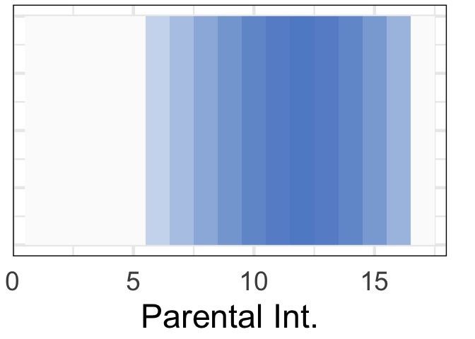<!-- -->

``` r
# poverty parental int
pov_Int=pNpFits1[,323:353]
MaxInt=quantile(masterdf$ASRInt, probs = 0.99)
plot_bootstraps_par(pov_Int,30,'Pov. Parental Int',MaxInt)
```

    ## Warning: Returning more (or less) than 1 row per `summarise()` group was deprecated in
    ## dplyr 1.1.0.
    ## ℹ Please use `reframe()` instead.
    ## ℹ When switching from `summarise()` to `reframe()`, remember that `reframe()`
    ##   always returns an ungrouped data frame and adjust accordingly.
    ## Call `lifecycle::last_lifecycle_warnings()` to see where this warning was
    ## generated.

    ## Warning: Removed 120024 rows containing missing values (`geom_line()`).

<!-- -->

``` r
# nonpoverty parental int
npov_Int=pNpFits1[,354:384]
plot_bootstraps_par(npov_Int,30,'Npov. Parental Int',MaxInt)
```

    ## Warning: Returning more (or less) than 1 row per `summarise()` group was deprecated in
    ## dplyr 1.1.0.
    ## ℹ Please use `reframe()` instead.
    ## ℹ When switching from `summarise()` to `reframe()`, remember that `reframe()`
    ##   always returns an ungrouped data frame and adjust accordingly.
    ## Removed 120024 rows containing missing values (`geom_line()`).
    ## Call `lifecycle::last_lifecycle_warnings()` to see where this warning was
    ## generated.

<!-- -->

``` r
# both merged
plot<-plot_bootstraps_pnp(pov_Int,npov_Int,30,'Parental Int.',MaxInt)
```

    ## Warning: Returning more (or less) than 1 row per `summarise()` group was deprecated in
    ## dplyr 1.1.0.
    ## ℹ Please use `reframe()` instead.
    ## ℹ When switching from `summarise()` to `reframe()`, remember that `reframe()`
    ##   always returns an ungrouped data frame and adjust accordingly.
    ## Call `lifecycle::last_lifecycle_warnings()` to see where this warning was
    ## generated.

    ## Warning: Returning more (or less) than 1 row per `summarise()` group was deprecated in
    ## dplyr 1.1.0.
    ## ℹ Please use `reframe()` instead.
    ## ℹ When switching from `summarise()` to `reframe()`, remember that `reframe()`
    ##   always returns an ungrouped data frame and adjust accordingly.
    ## Call `lifecycle::last_lifecycle_warnings()` to see where this warning was
    ## generated.

    ## Scale for alpha is already present.
    ## Adding another scale for alpha, which will replace the existing scale.
    ## Scale for y is already present.
    ## Adding another scale for y, which will replace the existing scale.

``` r
plot + theme(plot.margin = margin(r = 30,l=5,t=5,b=5))
```

    ## Warning: Removed 120024 rows containing missing values (`geom_line()`).

    ## Warning: Removed 120024 rows containing missing values (`geom_line()`).

<!-- -->

``` r
# derivatives
# poverty
P_derivative_matrix <- matrix(0, nrow = nrow(pov_Int), ncol = ncol(pov_Int) - 1)
# Calculate the derivative for each column
for (i in 1:(ncol(pov_Int) - 1)) {
  # Calculate the differences in x (assuming a constant difference)
  dx <- 1
  # Calculate the differences in y (predicted values)
  dy <- pov_Int[, i + 1] - pov_Int[, i]
  # Calculate the derivatives (slopes)
  derivatives <- dy / dx
  # Store the derivatives in the derivative matrix
  P_derivative_matrix[, i] <- derivatives
}
# calc sig dervs
# get straightfoward of segment where 99% is over 0 or under
positive_counts <- colSums(P_derivative_matrix > 0, na.rm = TRUE)
negative_counts <- colSums(P_derivative_matrix < 0, na.rm = TRUE)
# find where each is 99% or greater
positive_countsSig=positive_counts>9500
negative_countsSig=negative_counts>9500
# make dataframe: 50th percentile of derivatives accompanied by posSig and NegSig vector
data <- apply(P_derivative_matrix, 2, function(x) quantile(x, probs = 0.5))
dervPlotDf<-data.frame(data,positive_countsSig,negative_countsSig)
# if either is sig at 99% plot
dervPlotDf$sig_derivMask=dervPlotDf[,2]+dervPlotDf[,3]>0
# use it to mask calculated derivs
dervPlotDf$sig_deriv=0
dervPlotDf$sig_deriv[dervPlotDf$sig_derivMask]=dervPlotDf$data[dervPlotDf$sig_derivMask]
dervPlotDf$seq=1:(dim(dervPlotDf)[1])
plot<-ggplot(data=dervPlotDf) + geom_raster(aes(x = seq, y = .5, fill = sig_deriv))+
    theme(panel.spacing = unit(-.01,"cm")) +
    scale_fill_gradientn(colors = my_palette(100),limits = c(min(-.1),max(0.1)))+theme_minimal(base_size = 35)+
    xlim(c(0,MaxInt))+xlab('Parental Int.')+
    guides(fill=FALSE)+
    theme(axis.title.y = element_blank(),axis.text.y=element_blank())+theme(panel.border = element_rect(color = "black", fill = NA, size = 1))+
    scale_x_continuous(limits = c(0,MaxInt),expand = expansion(mult = c(0, 0)))
```

    ## Scale for x is already present.
    ## Adding another scale for x, which will replace the existing scale.

``` r
plot + theme(plot.margin = margin(r = 30,l=5,t=5,b=5))
```

    ## Warning: Removed 13 rows containing missing values (`geom_raster()`).

<!-- -->

``` r
# nonpoverty
P_derivative_matrix <- matrix(0, nrow = nrow(npov_Int), ncol = ncol(npov_Int) - 1)
# Calculate the derivative for each column
for (i in 1:(ncol(npov_Int) - 1)) {
  # Calculate the differences in x (assuming a constant difference)
  dx <- 1
  # Calculate the differences in y (predicted values)
  dy <- npov_Int[, i + 1] - npov_Int[, i]
  # Calculate the derivatives (slopes)
  derivatives <- dy / dx
  # Store the derivatives in the derivative matrix
  P_derivative_matrix[, i] <- derivatives
}
# calc sig dervs
# get straightfoward of segment where 99% is over 0 or under
positive_counts <- colSums(P_derivative_matrix > 0, na.rm = TRUE)
negative_counts <- colSums(P_derivative_matrix < 0, na.rm = TRUE)
# find where each is 99% or greater
positive_countsSig=positive_counts>9500
negative_countsSig=negative_counts>9500
# make dataframe: 50th percentile of derivatives accompanied by posSig and NegSig vector
data <- apply(P_derivative_matrix, 2, function(x) quantile(x, probs = 0.5))
dervPlotDf<-data.frame(data,positive_countsSig,negative_countsSig)
# if either is sig at 99% plot
dervPlotDf$sig_derivMask=dervPlotDf[,2]+dervPlotDf[,3]>0
# use it to mask calculated derivs
dervPlotDf$sig_deriv=0
dervPlotDf$sig_deriv[dervPlotDf$sig_derivMask]=dervPlotDf$data[dervPlotDf$sig_derivMask]
dervPlotDf$seq=1:(dim(dervPlotDf)[1])
plot<-ggplot(data=dervPlotDf) + geom_raster(aes(x = seq, y = .5, fill = sig_deriv))+
    theme(panel.spacing = unit(-.01,"cm")) +
    scale_fill_gradientn(colors = my_palette(100),limits = c(min(-.1),max(0.1)))+theme_minimal(base_size = 35)+
    xlim(c(0,MaxInt))+xlab('Parental Int.')+
    guides(fill=FALSE)+
    theme(axis.title.y = element_blank(),axis.text.y=element_blank())+theme(panel.border = element_rect(color = "black", fill = NA, size = 1))+
    scale_x_continuous(limits = c(0,MaxInt),expand = expansion(mult = c(0, 0)))
```

    ## Scale for x is already present.
    ## Adding another scale for x, which will replace the existing scale.

``` r
plot + theme(plot.margin = margin(r = 30,l=5,t=5,b=5))
```

    ## Warning: Removed 13 rows containing missing values (`geom_raster()`).

<!-- -->

``` r
# poverty parental ext
pov_Ext=pNpFits1[,385:448]
MaxExt=quantile(masterdf$ASRExt, probs = 0.99)
plot_bootstraps_par(pov_Ext,63,'Pov. Parental Ext',MaxExt)
```

    ## Warning: Returning more (or less) than 1 row per `summarise()` group was deprecated in
    ## dplyr 1.1.0.
    ## ℹ Please use `reframe()` instead.
    ## ℹ When switching from `summarise()` to `reframe()`, remember that `reframe()`
    ##   always returns an ungrouped data frame and adjust accordingly.
    ## Call `lifecycle::last_lifecycle_warnings()` to see where this warning was
    ## generated.

    ## Warning: Removed 350070 rows containing missing values (`geom_line()`).

<!-- -->

``` r
# nonpoverty parental p
npov_Ext=pNpFits1[,449:512]
plot_bootstraps_par(npov_Ext,63,'Npov. Parental Ext',MaxExt)
```

    ## Warning: Returning more (or less) than 1 row per `summarise()` group was deprecated in
    ## dplyr 1.1.0.
    ## ℹ Please use `reframe()` instead.
    ## ℹ When switching from `summarise()` to `reframe()`, remember that `reframe()`
    ##   always returns an ungrouped data frame and adjust accordingly.
    ## Removed 350070 rows containing missing values (`geom_line()`).
    ## Call `lifecycle::last_lifecycle_warnings()` to see where this warning was
    ## generated.

<!-- -->

``` r
# both merged
plot<-plot_bootstraps_pnp(pov_Ext,npov_Ext,63,'Parental Ext.',MaxExt)
```

    ## Warning: Returning more (or less) than 1 row per `summarise()` group was deprecated in
    ## dplyr 1.1.0.
    ## ℹ Please use `reframe()` instead.
    ## ℹ When switching from `summarise()` to `reframe()`, remember that `reframe()`
    ##   always returns an ungrouped data frame and adjust accordingly.
    ## Call `lifecycle::last_lifecycle_warnings()` to see where this warning was
    ## generated.

    ## Warning: Returning more (or less) than 1 row per `summarise()` group was deprecated in
    ## dplyr 1.1.0.
    ## ℹ Please use `reframe()` instead.
    ## ℹ When switching from `summarise()` to `reframe()`, remember that `reframe()`
    ##   always returns an ungrouped data frame and adjust accordingly.
    ## Call `lifecycle::last_lifecycle_warnings()` to see where this warning was
    ## generated.

    ## Scale for alpha is already present.
    ## Adding another scale for alpha, which will replace the existing scale.
    ## Scale for y is already present.
    ## Adding another scale for y, which will replace the existing scale.

``` r
plot + theme(plot.margin = margin(r = 30,l=5,t=5,b=5))
```

    ## Warning: Removed 350070 rows containing missing values (`geom_line()`).

    ## Warning: Removed 350070 rows containing missing values (`geom_line()`).

<!-- -->

``` r
# poverty
P_derivative_matrix <- matrix(0, nrow = nrow(pov_Ext), ncol = ncol(pov_Ext) - 1)
# Calculate the derivative for each column
for (i in 1:(ncol(pov_Ext) - 1)) {
  # Calculate the differences in x (assuming a constant difference)
  dx <- 1
  # Calculate the differences in y (predicted values)
  dy <- pov_Ext[, i + 1] - pov_Ext[, i]
  # Calculate the derivatives (slopes)
  derivatives <- dy / dx
  # Store the derivatives in the derivative matrix
  P_derivative_matrix[, i] <- derivatives
}
# calc sig dervs
# get straightfoward of segment where 99% is over 0 or under
positive_counts <- colSums(P_derivative_matrix > 0, na.rm = TRUE)
negative_counts <- colSums(P_derivative_matrix < 0, na.rm = TRUE)
# find where each is 99% or greater
positive_countsSig=positive_counts>9500
negative_countsSig=negative_counts>9500
# make dataframe: 50th percentile of derivatives accompanied by posSig and NegSig vector
data <- apply(P_derivative_matrix, 2, function(x) quantile(x, probs = 0.5))
dervPlotDf<-data.frame(data,positive_countsSig,negative_countsSig)
# if either is sig at 99% plot
dervPlotDf$sig_derivMask=dervPlotDf[,2]+dervPlotDf[,3]>0
# use it to mask calculated derivs
dervPlotDf$sig_deriv=0
dervPlotDf$sig_deriv[dervPlotDf$sig_derivMask]=dervPlotDf$data[dervPlotDf$sig_derivMask]
dervPlotDf$seq=1:(dim(dervPlotDf)[1])
plot<-ggplot(data=dervPlotDf) + geom_raster(aes(x = seq, y = .5, fill = sig_deriv))+
    theme(panel.spacing = unit(-.01,"cm")) +
    scale_fill_gradientn(colors = my_palette(100),limits = c(min(-.1),max(0.1)))+theme_minimal(base_size = 35)+
    xlim(c(0,MaxInt))+xlab('Parental Ext.')+
    guides(fill=FALSE)+
    theme(axis.title.y = element_blank(),axis.text.y=element_blank())+theme(panel.border = element_rect(color = "black", fill = NA, size = 1))+
    scale_x_continuous(limits = c(0,MaxExt),expand = expansion(mult = c(0, 0)))
```

    ## Scale for x is already present.
    ## Adding another scale for x, which will replace the existing scale.

``` r
plot + theme(plot.margin = margin(r = 30,l=5,t=5,b=5))
```

    ## Warning: Removed 36 rows containing missing values (`geom_raster()`).

<!-- -->

``` r
# nonpoverty
P_derivative_matrix <- matrix(0, nrow = nrow(npov_Ext), ncol = ncol(npov_Ext) - 1)
# Calculate the derivative for each column
for (i in 1:(ncol(npov_Ext) - 1)) {
  # Calculate the differences in x (assuming a constant difference)
  dx <- 1
  # Calculate the differences in y (predicted values)
  dy <- npov_Ext[, i + 1] - npov_Ext[, i]
  # Calculate the derivatives (slopes)
  derivatives <- dy / dx
  # Store the derivatives in the derivative matrix
  P_derivative_matrix[, i] <- derivatives
}
# calc sig dervs
# get straightfoward of segment where 99% is over 0 or under
positive_counts <- colSums(P_derivative_matrix > 0, na.rm = TRUE)
negative_counts <- colSums(P_derivative_matrix < 0, na.rm = TRUE)
# find where each is 99% or greater
positive_countsSig=positive_counts>9500
negative_countsSig=negative_counts>9500
# make dataframe: 50th percentile of derivatives accompanied by posSig and NegSig vector
data <- apply(P_derivative_matrix, 2, function(x) quantile(x, probs = 0.5))
dervPlotDf<-data.frame(data,positive_countsSig,negative_countsSig)
# if either is sig at 99% plot
dervPlotDf$sig_derivMask=dervPlotDf[,2]+dervPlotDf[,3]>0
# use it to mask calculated derivs
dervPlotDf$sig_deriv=0
dervPlotDf$sig_deriv[dervPlotDf$sig_derivMask]=dervPlotDf$data[dervPlotDf$sig_derivMask]
dervPlotDf$seq=1:(dim(dervPlotDf)[1])
plot<-ggplot(data=dervPlotDf) + geom_raster(aes(x = seq, y = .5, fill = sig_deriv))+
    theme(panel.spacing = unit(-.01,"cm")) +
    scale_fill_gradientn(colors = my_palette(100),limits = c(min(-.1),max(0.1)))+theme_minimal(base_size = 35)+
    xlim(c(0,MaxInt))+xlab('Parental Ext.')+
    guides(fill=FALSE)+
    theme(axis.title.y = element_blank(),axis.text.y=element_blank())+theme(panel.border = element_rect(color = "black", fill = NA, size = 1))+
    scale_x_continuous(limits = c(0,MaxExt),expand = expansion(mult = c(0, 0)))
```

    ## Scale for x is already present.
    ## Adding another scale for x, which will replace the existing scale.

``` r
plot + theme(plot.margin = margin(r = 30,l=5,t=5,b=5))
```

    ## Warning: Removed 36 rows containing missing values (`geom_raster()`).

<!-- -->

``` r
# poverty parental somatic
pov_Som=pNpFits1[,513:533]
MaxSom=quantile(masterdf$ASRSomatic, probs = 0.99)
plot_bootstraps_par(pov_Som,20,'Pov. Parental Somatic',MaxSom)
```

    ## Warning: Returning more (or less) than 1 row per `summarise()` group was deprecated in
    ## dplyr 1.1.0.
    ## ℹ Please use `reframe()` instead.
    ## ℹ When switching from `summarise()` to `reframe()`, remember that `reframe()`
    ##   always returns an ungrouped data frame and adjust accordingly.
    ## Call `lifecycle::last_lifecycle_warnings()` to see where this warning was
    ## generated.

    ## Warning: Removed 80016 rows containing missing values (`geom_line()`).

<!-- -->

``` r
# nonpoverty parental p
npov_Som=pNpFits1[,534:554]
plot_bootstraps_par(npov_Som,20,'Npov. Parental Somatic',MaxSom)
```

    ## Warning: Returning more (or less) than 1 row per `summarise()` group was deprecated in
    ## dplyr 1.1.0.
    ## ℹ Please use `reframe()` instead.
    ## ℹ When switching from `summarise()` to `reframe()`, remember that `reframe()`
    ##   always returns an ungrouped data frame and adjust accordingly.
    ## Removed 80016 rows containing missing values (`geom_line()`).
    ## Call `lifecycle::last_lifecycle_warnings()` to see where this warning was
    ## generated.

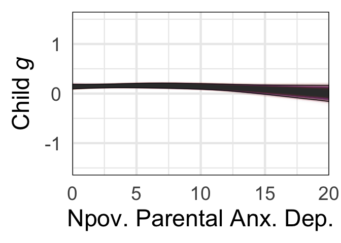<!-- -->

``` r
# both merged
plot<-plot_bootstraps_pnp(pov_Som,npov_Som,20,'Parental Somatic',MaxSom)
```

    ## Warning: Returning more (or less) than 1 row per `summarise()` group was deprecated in
    ## dplyr 1.1.0.
    ## ℹ Please use `reframe()` instead.
    ## ℹ When switching from `summarise()` to `reframe()`, remember that `reframe()`
    ##   always returns an ungrouped data frame and adjust accordingly.
    ## Call `lifecycle::last_lifecycle_warnings()` to see where this warning was
    ## generated.

    ## Warning: Returning more (or less) than 1 row per `summarise()` group was deprecated in
    ## dplyr 1.1.0.
    ## ℹ Please use `reframe()` instead.
    ## ℹ When switching from `summarise()` to `reframe()`, remember that `reframe()`
    ##   always returns an ungrouped data frame and adjust accordingly.
    ## Call `lifecycle::last_lifecycle_warnings()` to see where this warning was
    ## generated.

    ## Scale for alpha is already present.
    ## Adding another scale for alpha, which will replace the existing scale.
    ## Scale for y is already present.
    ## Adding another scale for y, which will replace the existing scale.

``` r
plot + theme(plot.margin = margin(r = 30,l=5,t=5,b=5))
```

    ## Warning: Removed 80016 rows containing missing values (`geom_line()`).

    ## Warning: Removed 80016 rows containing missing values (`geom_line()`).

<!-- -->

``` r
# poverty
P_derivative_matrix <- matrix(0, nrow = nrow(pov_Som), ncol = ncol(pov_Som) - 1)
# Calculate the derivative for each column
for (i in 1:(ncol(pov_Som) - 1)) {
  # Calculate the differences in x (assuming a constant difference)
  dx <- 1
  # Calculate the differences in y (predicted values)
  dy <- pov_Som[, i + 1] - pov_Som[, i]
  # Calculate the derivatives (slopes)
  derivatives <- dy / dx
  # Store the derivatives in the derivative matrix
  P_derivative_matrix[, i] <- derivatives
}
# calc sig dervs
# get straightfoward of segment where 99% is over 0 or under
positive_counts <- colSums(P_derivative_matrix > 0, na.rm = TRUE)
negative_counts <- colSums(P_derivative_matrix < 0, na.rm = TRUE)
# find where each is 99% or greater
positive_countsSig=positive_counts>9500
negative_countsSig=negative_counts>9500
# make dataframe: 50th percentile of derivatives accompanied by posSig and NegSig vector
data <- apply(P_derivative_matrix, 2, function(x) quantile(x, probs = 0.5))
dervPlotDf<-data.frame(data,positive_countsSig,negative_countsSig)
# if either is sig at 99% plot
dervPlotDf$sig_derivMask=dervPlotDf[,2]+dervPlotDf[,3]>0
# use it to mask calculated derivs
dervPlotDf$sig_deriv=0
dervPlotDf$sig_deriv[dervPlotDf$sig_derivMask]=dervPlotDf$data[dervPlotDf$sig_derivMask]
dervPlotDf$seq=1:(dim(dervPlotDf)[1])
plot<-ggplot(data=dervPlotDf) + geom_raster(aes(x = seq, y = .5, fill = sig_deriv))+
    theme(panel.spacing = unit(-.01,"cm")) +
    scale_fill_gradientn(colors = my_palette(100),limits = c(min(-.1),max(0.1)))+theme_minimal(base_size = 35)+
    xlim(c(0,MaxSom))+xlab('Parental Somatic')+
    guides(fill=FALSE)+
    theme(axis.title.y = element_blank(),axis.text.y=element_blank())+theme(panel.border = element_rect(color = "black", fill = NA, size = 1))+
    scale_x_continuous(limits = c(0,MaxSom),expand = expansion(mult = c(0, 0)))
```

    ## Scale for x is already present.
    ## Adding another scale for x, which will replace the existing scale.

``` r
plot + theme(plot.margin = margin(r = 30,l=5,t=5,b=5))
```

    ## Warning: Removed 9 rows containing missing values (`geom_raster()`).

<!-- -->

``` r
# nonpoverty
P_derivative_matrix <- matrix(0, nrow = nrow(npov_Som), ncol = ncol(npov_Som) - 1)
# Calculate the derivative for each column
for (i in 1:(ncol(npov_Som) - 1)) {
  # Calculate the differences in x (assuming a constant difference)
  dx <- 1
  # Calculate the differences in y (predicted values)
  dy <- npov_Som[, i + 1] - npov_Som[, i]
  # Calculate the derivatives (slopes)
  derivatives <- dy / dx
  # Store the derivatives in the derivative matrix
  P_derivative_matrix[, i] <- derivatives
}
# calc sig dervs
# get straightfoward of segment where 99% is over 0 or under
positive_counts <- colSums(P_derivative_matrix > 0, na.rm = TRUE)
negative_counts <- colSums(P_derivative_matrix < 0, na.rm = TRUE)
# find where each is 99% or greater
positive_countsSig=positive_counts>9500
negative_countsSig=negative_counts>9500
# make dataframe: 50th percentile of derivatives accompanied by posSig and NegSig vector
data <- apply(P_derivative_matrix, 2, function(x) quantile(x, probs = 0.5))
dervPlotDf<-data.frame(data,positive_countsSig,negative_countsSig)
# if either is sig at 99% plot
dervPlotDf$sig_derivMask=dervPlotDf[,2]+dervPlotDf[,3]>0
# use it to mask calculated derivs
dervPlotDf$sig_deriv=0
dervPlotDf$sig_deriv[dervPlotDf$sig_derivMask]=dervPlotDf$data[dervPlotDf$sig_derivMask]
dervPlotDf$seq=1:(dim(dervPlotDf)[1])
plot<-ggplot(data=dervPlotDf) + geom_raster(aes(x = seq, y = .5, fill = sig_deriv))+
    theme(panel.spacing = unit(-.01,"cm")) +
    scale_fill_gradientn(colors = my_palette(100),limits = c(min(-.1),max(0.1)))+theme_minimal(base_size = 35)+
    xlim(c(0,MaxSom))+xlab('Parental Somatic')+
    guides(fill=FALSE)+
    theme(axis.title.y = element_blank(),axis.text.y=element_blank())+theme(panel.border = element_rect(color = "black", fill = NA, size = 1))+
    scale_x_continuous(limits = c(0,MaxSom),expand = expansion(mult = c(0, 0)))
```

    ## Scale for x is already present.
    ## Adding another scale for x, which will replace the existing scale.

``` r
plot + theme(plot.margin = margin(r = 30,l=5,t=5,b=5))
```

    ## Warning: Removed 9 rows containing missing values (`geom_raster()`).

<!-- -->

``` r
# Anxious Depression
pov_Anx=pNpFits1[,555:586]
MaxAnx=quantile(masterdf$ASRAnxDepr, probs = 0.99)
plot_bootstraps_par(pov_Anx,31,'Pov. Parental Anx. Dep.',MaxAnx)
```

    ## Warning: Returning more (or less) than 1 row per `summarise()` group was deprecated in
    ## dplyr 1.1.0.
    ## ℹ Please use `reframe()` instead.
    ## ℹ When switching from `summarise()` to `reframe()`, remember that `reframe()`
    ##   always returns an ungrouped data frame and adjust accordingly.
    ## Call `lifecycle::last_lifecycle_warnings()` to see where this warning was
    ## generated.

    ## Warning: Removed 110022 rows containing missing values (`geom_line()`).

<!-- -->

``` r
# nonpoverty parental p
npov_Anx=pNpFits1[,587:618]
plot_bootstraps_par(npov_Anx,31,'Npov. Parental Anx. Dep.',MaxAnx)
```

    ## Warning: Returning more (or less) than 1 row per `summarise()` group was deprecated in
    ## dplyr 1.1.0.
    ## ℹ Please use `reframe()` instead.
    ## ℹ When switching from `summarise()` to `reframe()`, remember that `reframe()`
    ##   always returns an ungrouped data frame and adjust accordingly.
    ## Removed 110022 rows containing missing values (`geom_line()`).
    ## Call `lifecycle::last_lifecycle_warnings()` to see where this warning was
    ## generated.

<!-- -->

``` r
# both merged
plot<-plot_bootstraps_pnp(pov_Anx,npov_Anx,31,'Parental Anx. Dep.',MaxAnx)
```

    ## Warning: Returning more (or less) than 1 row per `summarise()` group was deprecated in
    ## dplyr 1.1.0.
    ## ℹ Please use `reframe()` instead.
    ## ℹ When switching from `summarise()` to `reframe()`, remember that `reframe()`
    ##   always returns an ungrouped data frame and adjust accordingly.
    ## Call `lifecycle::last_lifecycle_warnings()` to see where this warning was
    ## generated.

    ## Warning: Returning more (or less) than 1 row per `summarise()` group was deprecated in
    ## dplyr 1.1.0.
    ## ℹ Please use `reframe()` instead.
    ## ℹ When switching from `summarise()` to `reframe()`, remember that `reframe()`
    ##   always returns an ungrouped data frame and adjust accordingly.
    ## Call `lifecycle::last_lifecycle_warnings()` to see where this warning was
    ## generated.

    ## Scale for alpha is already present.
    ## Adding another scale for alpha, which will replace the existing scale.
    ## Scale for y is already present.
    ## Adding another scale for y, which will replace the existing scale.

``` r
plot + theme(plot.margin = margin(r = 30,l=5,t=5,b=5))
```

    ## Warning: Removed 110022 rows containing missing values (`geom_line()`).

    ## Warning: Removed 110022 rows containing missing values (`geom_line()`).

<!-- -->

``` r
# poverty
P_derivative_matrix <- matrix(0, nrow = nrow(pov_Anx), ncol = ncol(pov_Anx) - 1)
# Calculate the derivative for each column
for (i in 1:(ncol(pov_Anx) - 1)) {
  # Calculate the differences in x (assuming a constant difference)
  dx <- 1
  # Calculate the differences in y (predicted values)
  dy <- pov_Anx[, i + 1] - pov_Anx[, i]
  # Calculate the derivatives (slopes)
  derivatives <- dy / dx
  # Store the derivatives in the derivative matrix
  P_derivative_matrix[, i] <- derivatives
}
# calc sig dervs
# get straightfoward of segment where 99% is over 0 or under
positive_counts <- colSums(P_derivative_matrix > 0, na.rm = TRUE)
negative_counts <- colSums(P_derivative_matrix < 0, na.rm = TRUE)
# find where each is 99% or greater
positive_countsSig=positive_counts>9500
negative_countsSig=negative_counts>9500
# make dataframe: 50th percentile of derivatives accompanied by posSig and NegSig vector
data <- apply(P_derivative_matrix, 2, function(x) quantile(x, probs = 0.5))
dervPlotDf<-data.frame(data,positive_countsSig,negative_countsSig)
# if either is sig at 99% plot
dervPlotDf$sig_derivMask=dervPlotDf[,2]+dervPlotDf[,3]>0
# use it to mask calculated derivs
dervPlotDf$sig_deriv=0
dervPlotDf$sig_deriv[dervPlotDf$sig_derivMask]=dervPlotDf$data[dervPlotDf$sig_derivMask]
dervPlotDf$seq=1:(dim(dervPlotDf)[1])
plot<-ggplot(data=dervPlotDf) + geom_raster(aes(x = seq, y = .5, fill = sig_deriv))+
    theme(panel.spacing = unit(-.01,"cm")) +
    scale_fill_gradientn(colors = my_palette(100),limits = c(min(-.1),max(0.1)))+theme_minimal(base_size = 35)+
    xlim(c(0,MaxAnx))+xlab('Parental Anx. Dep.')+
    guides(fill=FALSE)+
    theme(axis.title.y = element_blank(),axis.text.y=element_blank())+theme(panel.border = element_rect(color = "black", fill = NA, size = 1))+
    scale_x_continuous(limits = c(0,MaxAnx),expand = expansion(mult = c(0, 0)))
```

    ## Scale for x is already present.
    ## Adding another scale for x, which will replace the existing scale.

``` r
plot + theme(plot.margin = margin(r = 30,l=5,t=5,b=5))
```

    ## Warning: Removed 12 rows containing missing values (`geom_raster()`).

<!-- -->

``` r
# nonpoverty
P_derivative_matrix <- matrix(0, nrow = nrow(npov_Anx), ncol = ncol(npov_Anx) - 1)
# Calculate the derivative for each column
for (i in 1:(ncol(npov_Anx) - 1)) {
  # Calculate the differences in x (assuming a constant difference)
  dx <- 1
  # Calculate the differences in y (predicted values)
  dy <- npov_Anx[, i + 1] - npov_Anx[, i]
  # Calculate the derivatives (slopes)
  derivatives <- dy / dx
  # Store the derivatives in the derivative matrix
  P_derivative_matrix[, i] <- derivatives
}
# calc sig dervs
# get straightfoward of segment where 99% is over 0 or under
positive_counts <- colSums(P_derivative_matrix > 0, na.rm = TRUE)
negative_counts <- colSums(P_derivative_matrix < 0, na.rm = TRUE)
# find where each is 99% or greater
positive_countsSig=positive_counts>9500
negative_countsSig=negative_counts>9500
# make dataframe: 50th percentile of derivatives accompanied by posSig and NegSig vector
data <- apply(P_derivative_matrix, 2, function(x) quantile(x, probs = 0.5))
dervPlotDf<-data.frame(data,positive_countsSig,negative_countsSig)
# if either is sig at 99% plot
dervPlotDf$sig_derivMask=dervPlotDf[,2]+dervPlotDf[,3]>0
# use it to mask calculated derivs
dervPlotDf$sig_deriv=0
dervPlotDf$sig_deriv[dervPlotDf$sig_derivMask]=dervPlotDf$data[dervPlotDf$sig_derivMask]
dervPlotDf$seq=1:(dim(dervPlotDf)[1])
plot<-ggplot(data=dervPlotDf) + geom_raster(aes(x = seq, y = .5, fill = sig_deriv))+
    theme(panel.spacing = unit(-.01,"cm")) +
    scale_fill_gradientn(colors = my_palette(100),limits = c(min(-.1),max(0.1)))+theme_minimal(base_size = 35)+
    xlim(c(0,MaxAnx))+xlab('Parental Anx. Dep.')+
    guides(fill=FALSE)+
    theme(axis.title.y = element_blank(),axis.text.y=element_blank())+theme(panel.border = element_rect(color = "black", fill = NA, size = 1))+
    scale_x_continuous(limits = c(0,MaxAnx),expand = expansion(mult = c(0, 0)))
```

    ## Scale for x is already present.
    ## Adding another scale for x, which will replace the existing scale.

``` r
plot + theme(plot.margin = margin(r = 30,l=5,t=5,b=5))
```

    ## Warning: Removed 12 rows containing missing values (`geom_raster()`).

<!-- -->

``` r
# Thought
pov_Tho=pNpFits1[,619:637]
MaxTho=quantile(masterdf$ASRThought, probs = 0.99)
plot_bootstraps_par(pov_Tho,18,'Pov. Parental Thought',MaxTho)
```

    ## Warning: Returning more (or less) than 1 row per `summarise()` group was deprecated in
    ## dplyr 1.1.0.
    ## ℹ Please use `reframe()` instead.
    ## ℹ When switching from `summarise()` to `reframe()`, remember that `reframe()`
    ##   always returns an ungrouped data frame and adjust accordingly.
    ## Call `lifecycle::last_lifecycle_warnings()` to see where this warning was
    ## generated.

    ## Warning: Removed 80016 rows containing missing values (`geom_line()`).

<!-- -->

``` r
# nonpoverty parental p
npov_Tho=pNpFits1[,638:656]
plot_bootstraps_par(npov_Tho,18,'Npov. Parental Thought',MaxTho)
```

    ## Warning: Returning more (or less) than 1 row per `summarise()` group was deprecated in
    ## dplyr 1.1.0.
    ## ℹ Please use `reframe()` instead.
    ## ℹ When switching from `summarise()` to `reframe()`, remember that `reframe()`
    ##   always returns an ungrouped data frame and adjust accordingly.
    ## Removed 80016 rows containing missing values (`geom_line()`).
    ## Call `lifecycle::last_lifecycle_warnings()` to see where this warning was
    ## generated.

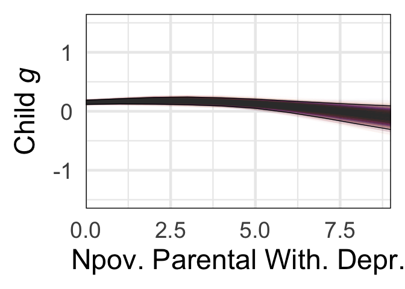<!-- -->

``` r
# both merged
plot<-plot_bootstraps_pnp(pov_Tho,npov_Tho,18,'Parental Thought',MaxTho)
```

    ## Warning: Returning more (or less) than 1 row per `summarise()` group was deprecated in
    ## dplyr 1.1.0.
    ## ℹ Please use `reframe()` instead.
    ## ℹ When switching from `summarise()` to `reframe()`, remember that `reframe()`
    ##   always returns an ungrouped data frame and adjust accordingly.
    ## Call `lifecycle::last_lifecycle_warnings()` to see where this warning was
    ## generated.

    ## Warning: Returning more (or less) than 1 row per `summarise()` group was deprecated in
    ## dplyr 1.1.0.
    ## ℹ Please use `reframe()` instead.
    ## ℹ When switching from `summarise()` to `reframe()`, remember that `reframe()`
    ##   always returns an ungrouped data frame and adjust accordingly.
    ## Call `lifecycle::last_lifecycle_warnings()` to see where this warning was
    ## generated.

    ## Scale for alpha is already present.
    ## Adding another scale for alpha, which will replace the existing scale.
    ## Scale for y is already present.
    ## Adding another scale for y, which will replace the existing scale.

``` r
plot + theme(plot.margin = margin(r = 30,l=15,t=5,b=5))
```

    ## Warning: Removed 80016 rows containing missing values (`geom_line()`).

    ## Warning: Removed 80016 rows containing missing values (`geom_line()`).

<!-- -->

``` r
# poverty
P_derivative_matrix <- matrix(0, nrow = nrow(pov_Tho), ncol = ncol(pov_Tho) - 1)
# Calculate the derivative for each column
for (i in 1:(ncol(pov_Tho) - 1)) {
  # Calculate the differences in x (assuming a constant difference)
  dx <- 1
  # Calculate the differences in y (predicted values)
  dy <- pov_Tho[, i + 1] - pov_Tho[, i]
  # Calculate the derivatives (slopes)
  derivatives <- dy / dx
  # Store the derivatives in the derivative matrix
  P_derivative_matrix[, i] <- derivatives
}
# calc sig dervs
# get straightfoward of segment where 99% is over 0 or under
positive_counts <- colSums(P_derivative_matrix > 0, na.rm = TRUE)
negative_counts <- colSums(P_derivative_matrix < 0, na.rm = TRUE)
# find where each is 99% or greater
positive_countsSig=positive_counts>9500
negative_countsSig=negative_counts>9500
# make dataframe: 50th percentile of derivatives accompanied by posSig and NegSig vector
data <- apply(P_derivative_matrix, 2, function(x) quantile(x, probs = 0.5))
dervPlotDf<-data.frame(data,positive_countsSig,negative_countsSig)
# if either is sig at 99% plot
dervPlotDf$sig_derivMask=dervPlotDf[,2]+dervPlotDf[,3]>0
# use it to mask calculated derivs
dervPlotDf$sig_deriv=0
dervPlotDf$sig_deriv[dervPlotDf$sig_derivMask]=dervPlotDf$data[dervPlotDf$sig_derivMask]
dervPlotDf$seq=1:(dim(dervPlotDf)[1])
plot<-ggplot(data=dervPlotDf) + geom_raster(aes(x = seq, y = .5, fill = sig_deriv))+
    theme(panel.spacing = unit(-.01,"cm")) +
    scale_fill_gradientn(colors = my_palette(100),limits = c(min(-.1),max(0.1)))+theme_minimal(base_size = 35)+
    xlim(c(0,MaxTho))+xlab('Parental Thought')+
    guides(fill=FALSE)+
    theme(axis.title.y = element_blank(),axis.text.y=element_blank())+theme(panel.border = element_rect(color = "black", fill = NA, size = 1))+
    scale_x_continuous(limits = c(0,MaxTho),expand = expansion(mult = c(0, 0)))
```

    ## Scale for x is already present.
    ## Adding another scale for x, which will replace the existing scale.

``` r
plot + theme(plot.margin = margin(r = 30,l=15,t=5,b=5))
```

    ## Warning: Removed 9 rows containing missing values (`geom_raster()`).

<!-- -->

``` r
# nonpoverty
P_derivative_matrix <- matrix(0, nrow = nrow(npov_Tho), ncol = ncol(npov_Tho) - 1)
# Calculate the derivative for each column
for (i in 1:(ncol(npov_Tho) - 1)) {
  # Calculate the differences in x (assuming a constant difference)
  dx <- 1
  # Calculate the differences in y (predicted values)
  dy <- npov_Tho[, i + 1] - npov_Tho[, i]
  # Calculate the derivatives (slopes)
  derivatives <- dy / dx
  # Store the derivatives in the derivative matrix
  P_derivative_matrix[, i] <- derivatives
}
# calc sig dervs
# get straightfoward of segment where 99% is over 0 or under
positive_counts <- colSums(P_derivative_matrix > 0, na.rm = TRUE)
negative_counts <- colSums(P_derivative_matrix < 0, na.rm = TRUE)
# find where each is 99% or greater
positive_countsSig=positive_counts>9500
negative_countsSig=negative_counts>9500
# make dataframe: 50th percentile of derivatives accompanied by posSig and NegSig vector
data <- apply(P_derivative_matrix, 2, function(x) quantile(x, probs = 0.5))
dervPlotDf<-data.frame(data,positive_countsSig,negative_countsSig)
# if either is sig at 99% plot
dervPlotDf$sig_derivMask=dervPlotDf[,2]+dervPlotDf[,3]>0
# use it to mask calculated derivs
dervPlotDf$sig_deriv=0
dervPlotDf$sig_deriv[dervPlotDf$sig_derivMask]=dervPlotDf$data[dervPlotDf$sig_derivMask]
dervPlotDf$seq=1:(dim(dervPlotDf)[1])
plot<-ggplot(data=dervPlotDf) + geom_raster(aes(x = seq, y = .5, fill = sig_deriv))+
    theme(panel.spacing = unit(-.01,"cm")) +
    scale_fill_gradientn(colors = my_palette(100),limits = c(min(-.1),max(0.1)))+theme_minimal(base_size = 35)+
    xlim(c(0,MaxTho))+xlab('Parental Thought')+
    guides(fill=FALSE)+
    theme(axis.title.y = element_blank(),axis.text.y=element_blank())+theme(panel.border = element_rect(color = "black", fill = NA, size = 1))+
    scale_x_continuous(limits = c(0,MaxTho),expand = expansion(mult = c(0, 0)))
```

    ## Scale for x is already present.
    ## Adding another scale for x, which will replace the existing scale.

``` r
plot + theme(plot.margin = margin(r = 30,l=15,t=5,b=5))
```

    ## Warning: Removed 9 rows containing missing values (`geom_raster()`).

<!-- -->

``` r
# Withdrawn Depression
pov_Wit=pNpFits1[,657:675]
MaxWit=quantile(masterdf$ASRWithdrawn, probs = 0.99)
plot_bootstraps_par(pov_Wit,18,'Pov. With. Depr.',MaxWit)
```

    ## Warning: Returning more (or less) than 1 row per `summarise()` group was deprecated in
    ## dplyr 1.1.0.
    ## ℹ Please use `reframe()` instead.
    ## ℹ When switching from `summarise()` to `reframe()`, remember that `reframe()`
    ##   always returns an ungrouped data frame and adjust accordingly.
    ## Call `lifecycle::last_lifecycle_warnings()` to see where this warning was
    ## generated.

    ## Warning: Removed 90018 rows containing missing values (`geom_line()`).

<!-- -->

``` r
# nonpoverty parental p
npov_Wit=pNpFits1[,676:694]
plot_bootstraps_par(npov_Wit,18,'Npov. Parental With. Depr.',MaxWit)
```

    ## Warning: Returning more (or less) than 1 row per `summarise()` group was deprecated in
    ## dplyr 1.1.0.
    ## ℹ Please use `reframe()` instead.
    ## ℹ When switching from `summarise()` to `reframe()`, remember that `reframe()`
    ##   always returns an ungrouped data frame and adjust accordingly.
    ## Removed 90018 rows containing missing values (`geom_line()`).
    ## Call `lifecycle::last_lifecycle_warnings()` to see where this warning was
    ## generated.

<!-- -->

``` r
# both merged
plot<-plot_bootstraps_pnp(pov_Wit,npov_Wit,18,'Parental With. Depr.',MaxWit)
```

    ## Warning: Returning more (or less) than 1 row per `summarise()` group was deprecated in
    ## dplyr 1.1.0.
    ## ℹ Please use `reframe()` instead.
    ## ℹ When switching from `summarise()` to `reframe()`, remember that `reframe()`
    ##   always returns an ungrouped data frame and adjust accordingly.
    ## Call `lifecycle::last_lifecycle_warnings()` to see where this warning was
    ## generated.

    ## Warning: Returning more (or less) than 1 row per `summarise()` group was deprecated in
    ## dplyr 1.1.0.
    ## ℹ Please use `reframe()` instead.
    ## ℹ When switching from `summarise()` to `reframe()`, remember that `reframe()`
    ##   always returns an ungrouped data frame and adjust accordingly.
    ## Call `lifecycle::last_lifecycle_warnings()` to see where this warning was
    ## generated.

    ## Scale for alpha is already present.
    ## Adding another scale for alpha, which will replace the existing scale.
    ## Scale for y is already present.
    ## Adding another scale for y, which will replace the existing scale.

``` r
plot + theme(plot.margin = margin(r = 30,l=15,t=5,b=5))
```

    ## Warning: Removed 90018 rows containing missing values (`geom_line()`).

    ## Warning: Removed 90018 rows containing missing values (`geom_line()`).

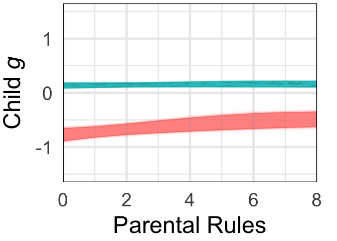<!-- -->

``` r
# poverty
P_derivative_matrix <- matrix(0, nrow = nrow(pov_Wit), ncol = ncol(pov_Wit) - 1)
# Calculate the derivative for each column
for (i in 1:(ncol(pov_Wit) - 1)) {
  # Calculate the differences in x (assuming a constant difference)
  dx <- 1
  # Calculate the differences in y (predicted values)
  dy <- pov_Wit[, i + 1] - pov_Wit[, i]
  # Calculate the derivatives (slopes)
  derivatives <- dy / dx
  # Store the derivatives in the derivative matrix
  P_derivative_matrix[, i] <- derivatives
}
# calc sig dervs
# get straightfoward of segment where 99% is over 0 or under
positive_counts <- colSums(P_derivative_matrix > 0, na.rm = TRUE)
negative_counts <- colSums(P_derivative_matrix < 0, na.rm = TRUE)
# find where each is 99% or greater
positive_countsSig=positive_counts>9500
negative_countsSig=negative_counts>9500
# make dataframe: 50th percentile of derivatives accompanied by posSig and NegSig vector
data <- apply(P_derivative_matrix, 2, function(x) quantile(x, probs = 0.5))
dervPlotDf<-data.frame(data,positive_countsSig,negative_countsSig)
# if either is sig at 99% plot
dervPlotDf$sig_derivMask=dervPlotDf[,2]+dervPlotDf[,3]>0
# use it to mask calculated derivs
dervPlotDf$sig_deriv=0
dervPlotDf$sig_deriv[dervPlotDf$sig_derivMask]=dervPlotDf$data[dervPlotDf$sig_derivMask]
dervPlotDf$seq=1:(dim(dervPlotDf)[1])
plot<-ggplot(data=dervPlotDf) + geom_raster(aes(x = seq, y = .5, fill = sig_deriv))+
    theme(panel.spacing = unit(-.01,"cm")) +
    scale_fill_gradientn(colors = my_palette(100),limits = c(min(-.1),max(0.1)))+theme_minimal(base_size = 35)+
    xlim(c(0,MaxWit))+xlab('Parental Wit. Depr.')+
    guides(fill=FALSE)+
    theme(axis.title.y = element_blank(),axis.text.y=element_blank())+theme(panel.border = element_rect(color = "black", fill = NA, size = 1))+
    scale_x_continuous(limits = c(0,MaxWit),expand = expansion(mult = c(0, 0)))
```

    ## Scale for x is already present.
    ## Adding another scale for x, which will replace the existing scale.

``` r
plot + theme(plot.margin = margin(r = 30,l=15,t=5,b=5))
```

    ## Warning: Removed 10 rows containing missing values (`geom_raster()`).

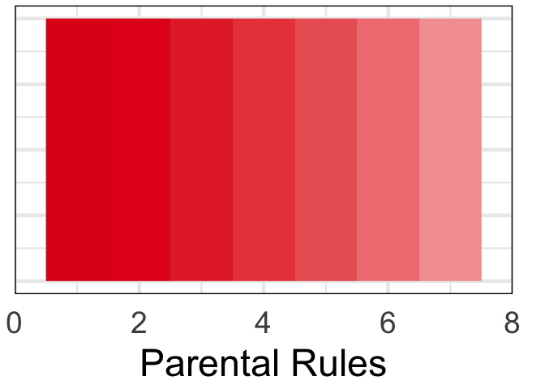<!-- -->

``` r
# nonpoverty
P_derivative_matrix <- matrix(0, nrow = nrow(npov_Wit), ncol = ncol(npov_Wit) - 1)
# Calculate the derivative for each column
for (i in 1:(ncol(npov_Wit) - 1)) {
  # Calculate the differences in x (assuming a constant difference)
  dx <- 1
  # Calculate the differences in y (predicted values)
  dy <- npov_Wit[, i + 1] - npov_Wit[, i]
  # Calculate the derivatives (slopes)
  derivatives <- dy / dx
  # Store the derivatives in the derivative matrix
  P_derivative_matrix[, i] <- derivatives
}
# calc sig dervs
# get straightfoward of segment where 99% is over 0 or under
positive_counts <- colSums(P_derivative_matrix > 0, na.rm = TRUE)
negative_counts <- colSums(P_derivative_matrix < 0, na.rm = TRUE)
# find where each is 99% or greater
positive_countsSig=positive_counts>9500
negative_countsSig=negative_counts>9500
# make dataframe: 50th percentile of derivatives accompanied by posSig and NegSig vector
data <- apply(P_derivative_matrix, 2, function(x) quantile(x, probs = 0.5))
dervPlotDf<-data.frame(data,positive_countsSig,negative_countsSig)
# if either is sig at 99% plot
dervPlotDf$sig_derivMask=dervPlotDf[,2]+dervPlotDf[,3]>0
# use it to mask calculated derivs
dervPlotDf$sig_deriv=0
dervPlotDf$sig_deriv[dervPlotDf$sig_derivMask]=dervPlotDf$data[dervPlotDf$sig_derivMask]
dervPlotDf$seq=1:(dim(dervPlotDf)[1])
plot<-ggplot(data=dervPlotDf) + geom_raster(aes(x = seq, y = .5, fill = sig_deriv))+
    theme(panel.spacing = unit(-.01,"cm")) +
    scale_fill_gradientn(colors = my_palette(100),limits = c(min(-.1),max(0.1)))+theme_minimal(base_size = 35)+
    xlim(c(0,MaxWit))+xlab('Parental Wit. Dep.')+
    guides(fill=FALSE)+
    theme(axis.title.y = element_blank(),axis.text.y=element_blank())+theme(panel.border = element_rect(color = "black", fill = NA, size = 1))+
    scale_x_continuous(limits = c(0,MaxWit),expand = expansion(mult = c(0, 0)))
```

    ## Scale for x is already present.
    ## Adding another scale for x, which will replace the existing scale.

``` r
plot + theme(plot.margin = margin(r = 30,l=15,t=5,b=5))
```

    ## Warning: Removed 10 rows containing missing values (`geom_raster()`).

<!-- -->

``` r
# Rule breaking
pov_RB=pNpFits1[,695:726]
MaxRB=quantile(masterdf$ASRRulB, probs = 0.99)
plot_bootstraps_par(pov_RB,31,'Pov. Rules',MaxRB)
```

    ## Warning: Returning more (or less) than 1 row per `summarise()` group was deprecated in
    ## dplyr 1.1.0.
    ## ℹ Please use `reframe()` instead.
    ## ℹ When switching from `summarise()` to `reframe()`, remember that `reframe()`
    ##   always returns an ungrouped data frame and adjust accordingly.
    ## Call `lifecycle::last_lifecycle_warnings()` to see where this warning was
    ## generated.

    ## Warning: Removed 230046 rows containing missing values (`geom_line()`).

<!-- -->

``` r
# nonpoverty parental p
npov_RB=pNpFits1[,727:758]
plot_bootstraps_par(npov_RB,31,'Npov. Parental Rules',MaxRB)
```

    ## Warning: Returning more (or less) than 1 row per `summarise()` group was deprecated in
    ## dplyr 1.1.0.
    ## ℹ Please use `reframe()` instead.
    ## ℹ When switching from `summarise()` to `reframe()`, remember that `reframe()`
    ##   always returns an ungrouped data frame and adjust accordingly.
    ## Removed 230046 rows containing missing values (`geom_line()`).
    ## Call `lifecycle::last_lifecycle_warnings()` to see where this warning was
    ## generated.

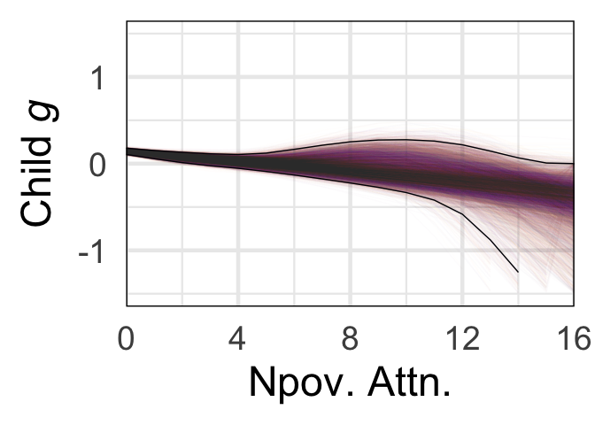<!-- -->

``` r
# both merged
plot<-plot_bootstraps_pnp(pov_RB,npov_RB,31,'Parental Rules',MaxRB)
```

    ## Warning: Returning more (or less) than 1 row per `summarise()` group was deprecated in
    ## dplyr 1.1.0.
    ## ℹ Please use `reframe()` instead.
    ## ℹ When switching from `summarise()` to `reframe()`, remember that `reframe()`
    ##   always returns an ungrouped data frame and adjust accordingly.
    ## Call `lifecycle::last_lifecycle_warnings()` to see where this warning was
    ## generated.

    ## Warning: Returning more (or less) than 1 row per `summarise()` group was deprecated in
    ## dplyr 1.1.0.
    ## ℹ Please use `reframe()` instead.
    ## ℹ When switching from `summarise()` to `reframe()`, remember that `reframe()`
    ##   always returns an ungrouped data frame and adjust accordingly.
    ## Call `lifecycle::last_lifecycle_warnings()` to see where this warning was
    ## generated.

    ## Scale for alpha is already present.
    ## Adding another scale for alpha, which will replace the existing scale.
    ## Scale for y is already present.
    ## Adding another scale for y, which will replace the existing scale.

``` r
plot + theme(plot.margin = margin(r = 30,l=5,t=5,b=5))
```

    ## Warning: Removed 230046 rows containing missing values (`geom_line()`).

    ## Warning: Removed 230046 rows containing missing values (`geom_line()`).

<!-- -->

``` r
# poverty
P_derivative_matrix <- matrix(0, nrow = nrow(pov_RB), ncol = ncol(pov_RB) - 1)
# Calculate the derivative for each column
for (i in 1:(ncol(pov_RB) - 1)) {
  # Calculate the differences in x (assuming a constant difference)
  dx <- 1
  # Calculate the differences in y (predicted values)
  dy <- pov_RB[, i + 1] - pov_RB[, i]
  # Calculate the derivatives (slopes)
  derivatives <- dy / dx
  # Store the derivatives in the derivative matrix
  P_derivative_matrix[, i] <- derivatives
}
# calc sig dervs
# get straightfoward of segment where 99% is over 0 or under
positive_counts <- colSums(P_derivative_matrix > 0, na.rm = TRUE)
negative_counts <- colSums(P_derivative_matrix < 0, na.rm = TRUE)
# find where each is 99% or greater
positive_countsSig=positive_counts>9500
negative_countsSig=negative_counts>9500
# make dataframe: 50th percentile of derivatives accompanied by posSig and NegSig vector
data <- apply(P_derivative_matrix, 2, function(x) quantile(x, probs = 0.5))
dervPlotDf<-data.frame(data,positive_countsSig,negative_countsSig)
# if either is sig at 99% plot
dervPlotDf$sig_derivMask=dervPlotDf[,2]+dervPlotDf[,3]>0
# use it to mask calculated derivs
dervPlotDf$sig_deriv=0
dervPlotDf$sig_deriv[dervPlotDf$sig_derivMask]=dervPlotDf$data[dervPlotDf$sig_derivMask]
dervPlotDf$seq=1:(dim(dervPlotDf)[1])
plot<-ggplot(data=dervPlotDf) + geom_raster(aes(x = seq, y = .5, fill = sig_deriv))+
    theme(panel.spacing = unit(-.01,"cm")) +
    scale_fill_gradientn(colors = my_palette(100),limits = c(min(-.1),max(0.1)))+theme_minimal(base_size = 35)+
    xlim(c(0,MaxRB))+xlab('Parental Rules')+
    guides(fill=FALSE)+
    theme(axis.title.y = element_blank(),axis.text.y=element_blank())+theme(panel.border = element_rect(color = "black", fill = NA, size = 1))+
    scale_x_continuous(limits = c(0,MaxRB),expand = expansion(mult = c(0, 0)))
```

    ## Scale for x is already present.
    ## Adding another scale for x, which will replace the existing scale.

``` r
plot + theme(plot.margin = margin(r = 30,l=5,t=5,b=5))
```

    ## Warning: Removed 24 rows containing missing values (`geom_raster()`).

<!-- -->

``` r
# nonpoverty
P_derivative_matrix <- matrix(0, nrow = nrow(npov_RB), ncol = ncol(npov_RB) - 1)
# Calculate the derivative for each column
for (i in 1:(ncol(npov_RB) - 1)) {
  # Calculate the differences in x (assuming a constant difference)
  dx <- 1
  # Calculate the differences in y (predicted values)
  dy <- npov_RB[, i + 1] - npov_RB[, i]
  # Calculate the derivatives (slopes)
  derivatives <- dy / dx
  # Store the derivatives in the derivative matrix
  P_derivative_matrix[, i] <- derivatives
}
# calc sig dervs
# get straightfoward of segment where 99% is over 0 or under
positive_counts <- colSums(P_derivative_matrix > 0, na.rm = TRUE)
negative_counts <- colSums(P_derivative_matrix < 0, na.rm = TRUE)
# find where each is 99% or greater
positive_countsSig=positive_counts>9500
negative_countsSig=negative_counts>9500
# make dataframe: 50th percentile of derivatives accompanied by posSig and NegSig vector
data <- apply(P_derivative_matrix, 2, function(x) quantile(x, probs = 0.5))
dervPlotDf<-data.frame(data,positive_countsSig,negative_countsSig)
# if either is sig at 99% plot
dervPlotDf$sig_derivMask=dervPlotDf[,2]+dervPlotDf[,3]>0
# use it to mask calculated derivs
dervPlotDf$sig_deriv=0
dervPlotDf$sig_deriv[dervPlotDf$sig_derivMask]=dervPlotDf$data[dervPlotDf$sig_derivMask]
dervPlotDf$seq=1:(dim(dervPlotDf)[1])
plot<-ggplot(data=dervPlotDf) + geom_raster(aes(x = seq, y = .5, fill = sig_deriv))+
    theme(panel.spacing = unit(-.01,"cm")) +
    scale_fill_gradientn(colors = my_palette(100),limits = c(min(-.1),max(0.1)))+theme_minimal(base_size = 35)+
    xlim(c(0,MaxRB))+xlab('Parental Rules')+
    guides(fill=FALSE)+
    theme(axis.title.y = element_blank(),axis.text.y=element_blank())+theme(panel.border = element_rect(color = "black", fill = NA, size = 1))+
    scale_x_continuous(limits = c(0,MaxRB),expand = expansion(mult = c(0, 0)))
```

    ## Scale for x is already present.
    ## Adding another scale for x, which will replace the existing scale.

``` r
plot + theme(plot.margin = margin(r = 30,l=5,t=5,b=5))
```

    ## Warning: Removed 24 rows containing missing values (`geom_raster()`).

<!-- -->

``` r
# attention
# NOTE: parents in poverty seem to be undersampled for attention, change max att to 16 just for this plot
# and also note increased y-axis
pov_Att=pNpFits1[,759:780]
MaxAtt=quantile(masterdf$ASRAttn, probs = 0.99)
MaxAtt=16
plot_bootstraps_par(pov_Att,21,'Pov. Attn.',MaxAtt)
```

    ## Warning: Returning more (or less) than 1 row per `summarise()` group was deprecated in
    ## dplyr 1.1.0.
    ## ℹ Please use `reframe()` instead.
    ## ℹ When switching from `summarise()` to `reframe()`, remember that `reframe()`
    ##   always returns an ungrouped data frame and adjust accordingly.
    ## Call `lifecycle::last_lifecycle_warnings()` to see where this warning was
    ## generated.

    ## Warning: Removed 56265 rows containing missing values (`geom_line()`).

<!-- -->

``` r
# nonpoverty parental p
npov_Att=pNpFits1[,781:802]
plot_bootstraps_par(npov_Att,21,'Npov. Attn.',MaxAtt)
```

    ## Warning: Returning more (or less) than 1 row per `summarise()` group was deprecated in
    ## dplyr 1.1.0.
    ## ℹ Please use `reframe()` instead.
    ## ℹ When switching from `summarise()` to `reframe()`, remember that `reframe()`
    ##   always returns an ungrouped data frame and adjust accordingly.
    ## Call `lifecycle::last_lifecycle_warnings()` to see where this warning was
    ## generated.

    ## Warning: Removed 50350 rows containing missing values (`geom_line()`).

<!-- -->

``` r
# both merged
plot<-plot_bootstraps_pnp(pov_Att,npov_Att,21,'Parental Attention',MaxAtt)
```

    ## Warning: Returning more (or less) than 1 row per `summarise()` group was deprecated in
    ## dplyr 1.1.0.
    ## ℹ Please use `reframe()` instead.
    ## ℹ When switching from `summarise()` to `reframe()`, remember that `reframe()`
    ##   always returns an ungrouped data frame and adjust accordingly.
    ## Call `lifecycle::last_lifecycle_warnings()` to see where this warning was
    ## generated.

    ## Warning: Returning more (or less) than 1 row per `summarise()` group was deprecated in
    ## dplyr 1.1.0.
    ## ℹ Please use `reframe()` instead.
    ## ℹ When switching from `summarise()` to `reframe()`, remember that `reframe()`
    ##   always returns an ungrouped data frame and adjust accordingly.
    ## Call `lifecycle::last_lifecycle_warnings()` to see where this warning was
    ## generated.

    ## Scale for alpha is already present.
    ## Adding another scale for alpha, which will replace the existing scale.
    ## Scale for y is already present.
    ## Adding another scale for y, which will replace the existing scale.

``` r
plot + theme(plot.margin = margin(r = 30,l=5,t=5,b=5))
```

    ## Warning: Removed 56265 rows containing missing values (`geom_line()`).

    ## Warning: Removed 50350 rows containing missing values (`geom_line()`).

<!-- -->

``` r
# poverty
P_derivative_matrix <- matrix(0, nrow = nrow(pov_Att), ncol = ncol(pov_Att) - 1)
# Calculate the derivative for each column
for (i in 1:(ncol(pov_Att) - 1)) {
  # Calculate the differences in x (assuming a constant difference)
  dx <- 1
  # Calculate the differences in y (predicted values)
  dy <- pov_Att[, i + 1] - pov_Att[, i]
  # Calculate the derivatives (slopes)
  derivatives <- dy / dx
  # Store the derivatives in the derivative matrix
  P_derivative_matrix[, i] <- derivatives
}
# calc sig dervs
# get straightfoward of segment where 99% is over 0 or under
positive_counts <- colSums(P_derivative_matrix > 0, na.rm = TRUE)
negative_counts <- colSums(P_derivative_matrix < 0, na.rm = TRUE)
# find where each is 99% or greater
positive_countsSig=positive_counts>9500
negative_countsSig=negative_counts>9500
# make dataframe: 50th percentile of derivatives accompanied by posSig and NegSig vector
data <- apply(P_derivative_matrix, 2, function(x) quantile(x, probs = 0.5))
dervPlotDf<-data.frame(data,positive_countsSig,negative_countsSig)
# if either is sig at 99% plot
dervPlotDf$sig_derivMask=dervPlotDf[,2]+dervPlotDf[,3]>0
# use it to mask calculated derivs
dervPlotDf$sig_deriv=0
dervPlotDf$sig_deriv[dervPlotDf$sig_derivMask]=dervPlotDf$data[dervPlotDf$sig_derivMask]
dervPlotDf$seq=1:(dim(dervPlotDf)[1])
plot<-ggplot(data=dervPlotDf) + geom_raster(aes(x = seq, y = .5, fill = sig_deriv))+
    theme(panel.spacing = unit(-.01,"cm")) +
    scale_fill_gradientn(colors = my_palette(100),limits = c(min(-.1),max(0.1)))+theme_minimal(base_size = 35)+
    xlim(c(0,MaxAtt))+xlab('Parental Attn.')+
    guides(fill=FALSE)+
    theme(axis.title.y = element_blank(),axis.text.y=element_blank())+theme(panel.border = element_rect(color = "black", fill = NA, size = 1))+
    scale_x_continuous(limits = c(0,MaxAtt),expand = expansion(mult = c(0, 0)))
```

    ## Scale for x is already present.
    ## Adding another scale for x, which will replace the existing scale.

``` r
plot + theme(plot.margin = margin(r = 30,l=5,t=5,b=5))
```

    ## Warning: Removed 6 rows containing missing values (`geom_raster()`).

<!-- -->

``` r
# nonpoverty
P_derivative_matrix <- matrix(0, nrow = nrow(npov_Att), ncol = ncol(npov_Att) - 1)
# Calculate the derivative for each column
for (i in 1:(ncol(npov_Att) - 1)) {
  # Calculate the differences in x (assuming a constant difference)
  dx <- 1
  # Calculate the differences in y (predicted values)
  dy <- npov_Att[, i + 1] - npov_Att[, i]
  # Calculate the derivatives (slopes)
  derivatives <- dy / dx
  # Store the derivatives in the derivative matrix
  P_derivative_matrix[, i] <- derivatives
}
# calc sig dervs
# get straightfoward of segment where 99% is over 0 or under
positive_counts <- colSums(P_derivative_matrix > 0, na.rm = TRUE)
negative_counts <- colSums(P_derivative_matrix < 0, na.rm = TRUE)
# find where each is 99% or greater
positive_countsSig=positive_counts>9500
negative_countsSig=negative_counts>9500
# make dataframe: 50th percentile of derivatives accompanied by posSig and NegSig vector
data <- apply(P_derivative_matrix, 2, function(x) quantile(x, probs = 0.5))
dervPlotDf<-data.frame(data,positive_countsSig,negative_countsSig)
# if either is sig at 99% plot
dervPlotDf$sig_derivMask=dervPlotDf[,2]+dervPlotDf[,3]>0
# use it to mask calculated derivs
dervPlotDf$sig_deriv=0
dervPlotDf$sig_deriv[dervPlotDf$sig_derivMask]=dervPlotDf$data[dervPlotDf$sig_derivMask]
dervPlotDf$seq=1:(dim(dervPlotDf)[1])
plot<-ggplot(data=dervPlotDf) + geom_raster(aes(x = seq, y = .5, fill = sig_deriv))+
    theme(panel.spacing = unit(-.01,"cm")) +
    scale_fill_gradientn(colors = my_palette(100),limits = c(min(-.1),max(0.1)))+theme_minimal(base_size = 35)+
    xlim(c(0,MaxAtt))+xlab('Parental Attn.')+
    guides(fill=FALSE)+
    theme(axis.title.y = element_blank(),axis.text.y=element_blank())+theme(panel.border = element_rect(color = "black", fill = NA, size = 1))+
    scale_x_continuous(limits = c(0,MaxAtt),expand = expansion(mult = c(0, 0)))
```

    ## Scale for x is already present.
    ## Adding another scale for x, which will replace the existing scale.

``` r
plot + theme(plot.margin = margin(r = 30,l=5,t=5,b=5))
```

    ## Warning: Removed 6 rows containing missing values (`geom_raster()`).

<!-- -->

``` r
# aggression
pov_Agg=pNpFits1[,803:848]
MaxAgg=quantile(masterdf$ASRAggr, probs = 0.99)
plot_bootstraps_par(pov_Agg,45,'Pov. Aggr.',MaxAgg)
```

    ## Warning: Returning more (or less) than 1 row per `summarise()` group was deprecated in
    ## dplyr 1.1.0.
    ## ℹ Please use `reframe()` instead.
    ## ℹ When switching from `summarise()` to `reframe()`, remember that `reframe()`
    ##   always returns an ungrouped data frame and adjust accordingly.
    ## Call `lifecycle::last_lifecycle_warnings()` to see where this warning was
    ## generated.

    ## Warning: Removed 240048 rows containing missing values (`geom_line()`).

<!-- -->

``` r
# nonpoverty parental p
npov_Agg=pNpFits1[,849:894]
plot_bootstraps_par(npov_Agg,45,'Npov. Aggr.',MaxAgg)
```

    ## Warning: Returning more (or less) than 1 row per `summarise()` group was deprecated in
    ## dplyr 1.1.0.
    ## ℹ Please use `reframe()` instead.
    ## ℹ When switching from `summarise()` to `reframe()`, remember that `reframe()`
    ##   always returns an ungrouped data frame and adjust accordingly.
    ## Removed 240048 rows containing missing values (`geom_line()`).
    ## Call `lifecycle::last_lifecycle_warnings()` to see where this warning was
    ## generated.

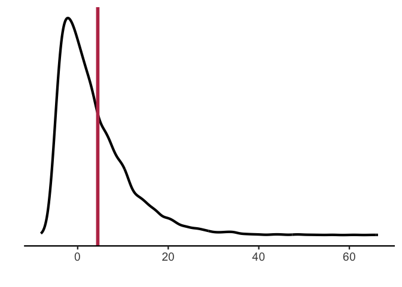<!-- -->

``` r
# both merged
plot<-plot_bootstraps_pnp(pov_Agg,npov_Agg,45,'Parental Aggression',MaxAgg)
```

    ## Warning: Returning more (or less) than 1 row per `summarise()` group was deprecated in
    ## dplyr 1.1.0.
    ## ℹ Please use `reframe()` instead.
    ## ℹ When switching from `summarise()` to `reframe()`, remember that `reframe()`
    ##   always returns an ungrouped data frame and adjust accordingly.
    ## Call `lifecycle::last_lifecycle_warnings()` to see where this warning was
    ## generated.

    ## Warning: Returning more (or less) than 1 row per `summarise()` group was deprecated in
    ## dplyr 1.1.0.
    ## ℹ Please use `reframe()` instead.
    ## ℹ When switching from `summarise()` to `reframe()`, remember that `reframe()`
    ##   always returns an ungrouped data frame and adjust accordingly.
    ## Call `lifecycle::last_lifecycle_warnings()` to see where this warning was
    ## generated.

    ## Scale for alpha is already present.
    ## Adding another scale for alpha, which will replace the existing scale.
    ## Scale for y is already present.
    ## Adding another scale for y, which will replace the existing scale.

``` r
plot + theme(plot.margin = margin(r = 30,l=5,t=5,b=5))
```

    ## Warning: Removed 240048 rows containing missing values (`geom_line()`).

    ## Warning: Removed 240048 rows containing missing values (`geom_line()`).

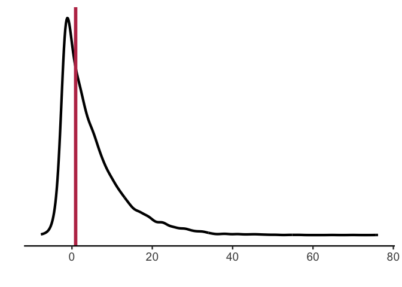<!-- -->

``` r
# poverty
P_derivative_matrix <- matrix(0, nrow = nrow(pov_Int), ncol = ncol(pov_Int) - 1)
# Calculate the derivative for each column
for (i in 1:(ncol(pov_Int) - 1)) {
  # Calculate the differences in x (assuming a constant difference)
  dx <- 1
  # Calculate the differences in y (predicted values)
  dy <- pov_Int[, i + 1] - pov_Int[, i]
  # Calculate the derivatives (slopes)
  derivatives <- dy / dx
  # Store the derivatives in the derivative matrix
  P_derivative_matrix[, i] <- derivatives
}
# calc sig dervs
# get straightfoward of segment where 99% is over 0 or under
positive_counts <- colSums(P_derivative_matrix > 0, na.rm = TRUE)
negative_counts <- colSums(P_derivative_matrix < 0, na.rm = TRUE)
# find where each is 99% or greater
positive_countsSig=positive_counts>9500
negative_countsSig=negative_counts>9500
# make dataframe: 50th percentile of derivatives accompanied by posSig and NegSig vector
data <- apply(P_derivative_matrix, 2, function(x) quantile(x, probs = 0.5))
dervPlotDf<-data.frame(data,positive_countsSig,negative_countsSig)
# if either is sig at 99% plot
dervPlotDf$sig_derivMask=dervPlotDf[,2]+dervPlotDf[,3]>0
# use it to mask calculated derivs
dervPlotDf$sig_deriv=0
dervPlotDf$sig_deriv[dervPlotDf$sig_derivMask]=dervPlotDf$data[dervPlotDf$sig_derivMask]
dervPlotDf$seq=1:(dim(dervPlotDf)[1])
plot<-ggplot(data=dervPlotDf) + geom_raster(aes(x = seq, y = .5, fill = sig_deriv))+
    theme(panel.spacing = unit(-.01,"cm")) +
    scale_fill_gradientn(colors = my_palette(100),limits = c(min(-.1),max(0.1)))+theme_minimal(base_size = 35)+
    xlim(c(0,MaxAgg))+xlab('Parental Aggr.')+
    guides(fill=FALSE)+
    theme(axis.title.y = element_blank(),axis.text.y=element_blank())+theme(panel.border = element_rect(color = "black", fill = NA, size = 1))+
    scale_x_continuous(limits = c(0,MaxAgg),expand = expansion(mult = c(0, 0)))
```

    ## Scale for x is already present.
    ## Adding another scale for x, which will replace the existing scale.

``` r
plot + theme(plot.margin = margin(r = 30,l=5,t=5,b=5))
```

    ## Warning: Removed 10 rows containing missing values (`geom_raster()`).

<!-- -->

``` r
# nonpoverty
P_derivative_matrix <- matrix(0, nrow = nrow(npov_Agg), ncol = ncol(npov_Agg) - 1)
# Calculate the derivative for each column
for (i in 1:(ncol(npov_Agg) - 1)) {
  # Calculate the differences in x (assuming a constant difference)
  dx <- 1
  # Calculate the differences in y (predicted values)
  dy <- npov_Agg[, i + 1] - npov_Agg[, i]
  # Calculate the derivatives (slopes)
  derivatives <- dy / dx
  # Store the derivatives in the derivative matrix
  P_derivative_matrix[, i] <- derivatives
}
# calc sig dervs
# get straightfoward of segment where 99% is over 0 or under
positive_counts <- colSums(P_derivative_matrix > 0, na.rm = TRUE)
negative_counts <- colSums(P_derivative_matrix < 0, na.rm = TRUE)
# find where each is 99% or greater
positive_countsSig=positive_counts>9500
negative_countsSig=negative_counts>9500
# make dataframe: 50th percentile of derivatives accompanied by posSig and NegSig vector
data <- apply(P_derivative_matrix, 2, function(x) quantile(x, probs = 0.5))
dervPlotDf<-data.frame(data,positive_countsSig,negative_countsSig)
# if either is sig at 99% plot
dervPlotDf$sig_derivMask=dervPlotDf[,2]+dervPlotDf[,3]>0
# use it to mask calculated derivs
dervPlotDf$sig_deriv=0
dervPlotDf$sig_deriv[dervPlotDf$sig_derivMask]=dervPlotDf$data[dervPlotDf$sig_derivMask]
dervPlotDf$seq=1:(dim(dervPlotDf)[1])
plot<-ggplot(data=dervPlotDf) + geom_raster(aes(x = seq, y = .5, fill = sig_deriv))+
    theme(panel.spacing = unit(-.01,"cm")) +
    scale_fill_gradientn(colors = my_palette(100),limits = c(min(-.1),max(0.1)))+theme_minimal(base_size = 35)+
    xlim(c(0,MaxAgg))+xlab('Parental Aggr.')+
    guides(fill=FALSE)+
    theme(axis.title.y = element_blank(),axis.text.y=element_blank())+theme(panel.border = element_rect(color = "black", fill = NA, size = 1))+
    scale_x_continuous(limits = c(0,MaxAgg),expand = expansion(mult = c(0, 0)))
```

    ## Scale for x is already present.
    ## Adding another scale for x, which will replace the existing scale.

``` r
plot + theme(plot.margin = margin(r = 30,l=5,t=5,b=5))
```

    ## Warning: Removed 25 rows containing missing values (`geom_raster()`).

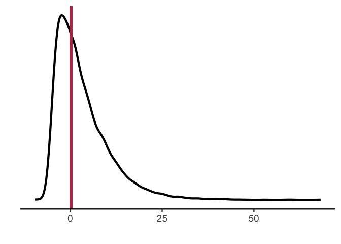<!-- -->

``` r
############### ∆∆∆∆∆∆∆∆∆∆∆∆∆∆∆∆∆∆∆∆∆∆∆∆∆∆∆∆∆∆∆∆∆∆ Now get poverty interaction fits vs. null
# first for children
# check out bootstrapped poverty evidence through difference in AIC (actual difference in AIC vs. 10,000 null derivations)
diff1=readRDS('~/Desktop/g_p/gpDiffBoots_cbclPseudo1.rds')
diff2=readRDS('~/Desktop/g_p/gpDiffBoots_cbclPseudo2.rds')
diff3=readRDS('~/Desktop/g_p/gpDiffBoots_cbclPseudo3.rds')
diff4=readRDS('~/Desktop/g_p/gpDiffBoots_cbclPseudo4.rds')
diff5=readRDS('~/Desktop/g_p/gpDiffBoots_cbclPseudo5.rds')
# combine
diff1[2001:4000,]=diff2[2001:4000,]
diff1[4001:6000,]=diff3[4001:6000,]
diff1[6001:8000,]=diff4[6001:8000,]
diff1[8001:10000,]=diff5[8001:10000,]
# looks good, compare to full data AIC

##### lil' section to mirror slurm calculations ##### §§§§§§§§§§§
masterdf<-readRDS('~/gp_masterdf.rds')
masterdf$poverty=0
# poverty now defined in sample construction
masterdf$poverty[masterdf$Pov_v2==1]=1
masterdf$poverty=as.factor(masterdf$poverty)
masterdf$cbcl_scr_syn_totprob_r=as.numeric(masterdf$cbcl_scr_syn_totprob_r)
masterdf$cbcl_scr_syn_internal_r=as.numeric(masterdf$cbcl_scr_syn_internal_r)
masterdf$cbcl_scr_syn_external_r=as.numeric(masterdf$cbcl_scr_syn_external_r)
masterdf$cbcl_scr_syn_somatic_r=as.numeric(masterdf$cbcl_scr_syn_somatic_r)
masterdf$cbcl_scr_syn_thought_r=as.numeric(masterdf$cbcl_scr_syn_thought_r)
masterdf$cbcl_scr_syn_anxdep_r=as.numeric(masterdf$cbcl_scr_syn_anxdep_r)
masterdf$cbcl_scr_syn_withdep_r=as.numeric(masterdf$cbcl_scr_syn_withdep_r)
masterdf$cbcl_scr_syn_rulebreak_r=as.numeric(masterdf$cbcl_scr_syn_rulebreak_r)
masterdf$cbcl_scr_syn_social_r=as.numeric(masterdf$cbcl_scr_syn_social_r)
masterdf$cbcl_scr_syn_attention_r=as.numeric(masterdf$cbcl_scr_syn_attention_r)
masterdf$cbcl_scr_syn_aggressive_r=as.numeric(masterdf$cbcl_scr_syn_aggressive_r)
#######            ----------------              ##### §§§§§§§§§§§

# plot cbcl p versus null
cbclpgAge_pov=bam(g~s(cbcl_scr_syn_totprob_r,k=4)+s(interview_age,k=4)+poverty,data=masterdf)
cbclpgAge_povint=bam(g~s(cbcl_scr_syn_totprob_r,by=poverty,k=4)+s(interview_age,k=4)+poverty,data=masterdf)
PovInt_AICDiff=AIC(cbclpgAge_pov)-AIC(cbclpgAge_povint)
# plot it relative to null distribution
ggplot(diff1,aes(x=pDiffPseudo))+geom_density(size=1.5)+geom_vline(xintercept = PovInt_AICDiff,size=2,color='#BC3754')+theme_classic(base_size=18)+ylab('')+xlab('')+guides(y="none")+scale_x_continuous()
```

    ## Warning: Using `size` aesthetic for lines was deprecated in ggplot2 3.4.0.
    ## ℹ Please use `linewidth` instead.
    ## This warning is displayed once every 8 hours.
    ## Call `lifecycle::last_lifecycle_warnings()` to see where this warning was
    ## generated.

<!-- -->

``` r
print(sum(diff1$pDiffPseudo>PovInt_AICDiff)/10000)
```

    ## [1] 0.4104

``` r
# cbcl int vs. null
cbclintgAge_pov=bam(g~s(cbcl_scr_syn_internal_r,k=4)+s(interview_age,k=4)+poverty,data=masterdf)
cbclintgAge_povint=bam(g~s(cbcl_scr_syn_internal_r,by=poverty,k=4)+s(interview_age,k=4)+poverty,data=masterdf)
PovInt_AICDiff=AIC(cbclintgAge_pov)-AIC(cbclintgAge_povint)
# plot it relative to null distribution
ggplot(diff1,aes(x=intDiffPseudo))+geom_density(size=1.5)+geom_vline(xintercept = PovInt_AICDiff,size=2,color='#BC3754')+theme_classic(base_size=18)+ylab('')+xlab('')+guides(y="none")+scale_x_continuous()
```

<!-- -->

``` r
print(sum(diff1$intDiffPseudo>PovInt_AICDiff)/10000)
```

    ## [1] 0.3501

``` r
# cbcl ext vs. null
cbclextgAge_pov=bam(g~s(cbcl_scr_syn_external_r,k=4)+s(interview_age,k=4)+poverty,data=masterdf)
cbclextgAge_povint=bam(g~s(cbcl_scr_syn_external_r,by=poverty,k=4)+s(interview_age,k=4)+poverty,data=masterdf)
PovInt_AICDiff=AIC(cbclextgAge_pov)-AIC(cbclextgAge_povint)
# plot it relative to null distribution
ggplot(diff1,aes(x=extDiffPseudo))+geom_density(size=1.5)+geom_vline(xintercept = PovInt_AICDiff,size=2,color='#BC3754')+theme_classic(base_size=18)+ylab('')+xlab('')+guides(y="none")+scale_x_continuous()
```

<!-- -->

``` r
print(sum(diff1$extDiffPseudo>PovInt_AICDiff)/10000)
```

    ## [1] 0.6218

``` r
# cbcl som vs. null
cbclsomgAge_pov=bam(g~s(cbcl_scr_syn_somatic_r,k=4)+s(interview_age,k=4)+poverty,data=masterdf)
cbclsomgAge_povint=bam(g~s(cbcl_scr_syn_somatic_r,by=poverty,k=4)+s(interview_age,k=4)+poverty,data=masterdf)
PovInt_AICDiff=AIC(cbclsomgAge_pov)-AIC(cbclsomgAge_povint)
# plot it relative to null distribution
ggplot(diff1,aes(x=somDiffPseudo))+geom_density(size=1.5)+geom_vline(xintercept = PovInt_AICDiff,size=2,color='#BC3754')+theme_classic(base_size=18)+ylab('')+xlab('')+guides(y="none")+scale_x_continuous()
```

<!-- -->

``` r
print(sum(diff1$somDiffPseudo>PovInt_AICDiff)/10000)
```

    ## [1] 0.1393

``` r
# cbcl anxdep vs. null
cbclanxgAge_pov=bam(g~s(cbcl_scr_syn_anxdep_r,k=4)+s(interview_age,k=4)+poverty,data=masterdf)
cbclanxgAge_povint=bam(g~s(cbcl_scr_syn_anxdep_r,by=poverty,k=4)+s(interview_age,k=4)+poverty,data=masterdf)
PovInt_AICDiff=AIC(cbclanxgAge_pov)-AIC(cbclanxgAge_povint)
# plot it relative to null distribution
ggplot(diff1,aes(x=anxDiffPseudo))+geom_density(size=1.5)+geom_vline(xintercept = PovInt_AICDiff,size=2,color='#BC3754')+theme_classic(base_size=18)+ylab('')+xlab('')+guides(y="none")+scale_x_continuous()
```

<!-- -->

``` r
print(sum(diff1$anxDiffPseudo>PovInt_AICDiff)/10000)
```

    ## [1] 0.5812

``` r
# cbcl tho vs. null
cbclthogAge_pov=bam(g~s(cbcl_scr_syn_thought_r,k=4)+s(interview_age,k=4)+poverty,data=masterdf)
cbclthogAge_povint=bam(g~s(cbcl_scr_syn_thought_r,by=poverty,k=4)+s(interview_age,k=4)+poverty,data=masterdf)
PovInt_AICDiff=AIC(cbclthogAge_pov)-AIC(cbclthogAge_povint)
# plot it relative to null distribution
ggplot(diff1,aes(x=thoDiffPseudo))+geom_density(size=1.5)+geom_vline(xintercept = PovInt_AICDiff,size=2,color='#BC3754')+theme_classic(base_size=18)+ylab('')+xlab('')+guides(y="none")+scale_x_continuous()
```

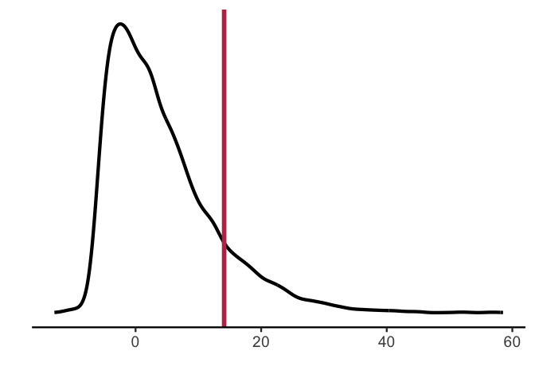<!-- -->

``` r
print(sum(diff1$thoDiffPseudo>PovInt_AICDiff)/10000)
```

    ## [1] 0.9129

``` r
# cbcl withdep vs. null
cbclwithgAge_pov=bam(g~s(cbcl_scr_syn_withdep_r,k=4)+s(interview_age,k=4)+poverty,data=masterdf)
cbclwithgAge_povint=bam(g~s(cbcl_scr_syn_withdep_r,by=poverty,k=4)+s(interview_age,k=4)+poverty,data=masterdf)
PovInt_AICDiff=AIC(cbclwithgAge_pov)-AIC(cbclwithgAge_povint)
# plot it relative to null distribution
ggplot(diff1,aes(x=witDiffPseudo))+geom_density(size=1.5)+geom_vline(xintercept = PovInt_AICDiff,size=2,color='#BC3754')+theme_classic(base_size=18)+ylab('')+xlab('')+guides(y="none")+scale_x_continuous()
```

<!-- -->

``` r
print(sum(diff1$witDiffPseudo>PovInt_AICDiff)/10000)
```

    ## [1] 0.4508

``` r
# cbcl attention vs. null
cbclattgAge_pov=bam(g~s(cbcl_scr_syn_attention_r,k=4)+s(interview_age,k=4)+poverty,data=masterdf)
cbclattgAge_povint=bam(g~s(cbcl_scr_syn_attention_r,by=poverty,k=4)+s(interview_age,k=4)+poverty,data=masterdf)
PovInt_AICDiff=AIC(cbclattgAge_pov)-AIC(cbclattgAge_povint)
# plot it relative to null distribution
ggplot(diff1,aes(x=attDiffPseudo))+geom_density(size=1.5)+geom_vline(xintercept = PovInt_AICDiff,size=2,color='#BC3754')+theme_classic(base_size=18)+ylab('')+xlab('')+guides(y="none")+scale_x_continuous()
```

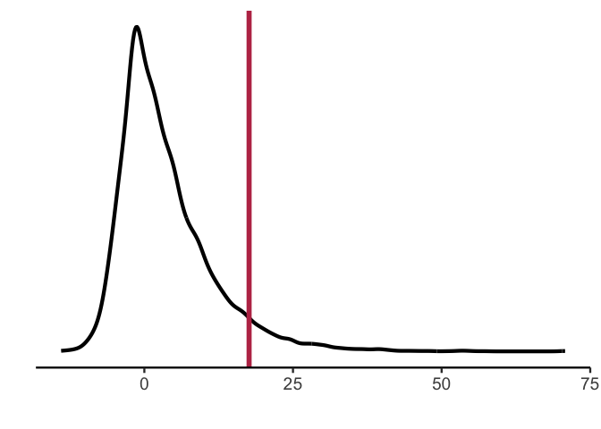<!-- -->

``` r
print(sum(diff1$attDiffPseudo>PovInt_AICDiff)/10000)
```

    ## [1] 0.5856

``` r
# cbcl rulebreak vs. null
cbclrulegAge_pov=bam(g~s(cbcl_scr_syn_rulebreak_r,k=4)+s(interview_age,k=4)+poverty,data=masterdf)
cbclrulegAge_povint=bam(g~s(cbcl_scr_syn_rulebreak_r,by=poverty,k=4)+s(interview_age,k=4)+poverty,data=masterdf)
PovInt_AICDiff=AIC(cbclrulegAge_pov)-AIC(cbclrulegAge_povint)
# plot it relative to null distribution
ggplot(diff1,aes(x=rulDiffPseudo))+geom_density(size=1.5)+geom_vline(xintercept = PovInt_AICDiff,size=2,color='#BC3754')+theme_classic(base_size=18)+ylab('')+xlab('')+guides(y="none")+scale_x_continuous()
```

<!-- -->

``` r
print(sum(diff1$rulDiffPseudo>PovInt_AICDiff)/10000)
```

    ## [1] 0.6149

``` r
# cbcl aggr vs. null
cbclaggrgAge_pov=bam(g~s(cbcl_scr_syn_aggressive_r,k=4)+s(interview_age,k=4)+poverty,data=masterdf)
cbclaggrgAge_povint=bam(g~s(cbcl_scr_syn_aggressive_r,by=poverty,k=4)+s(interview_age,k=4)+poverty,data=masterdf)
PovInt_AICDiff=AIC(cbclaggrgAge_pov)-AIC(cbclaggrgAge_povint)
# plot it relative to null distribution
ggplot(diff1,aes(x=aggDiffPseudo))+geom_density(size=1.5)+geom_vline(xintercept = PovInt_AICDiff,size=2,color='#BC3754')+theme_classic(base_size=18)+ylab('')+xlab('')+guides(y="none")+scale_x_continuous()
```

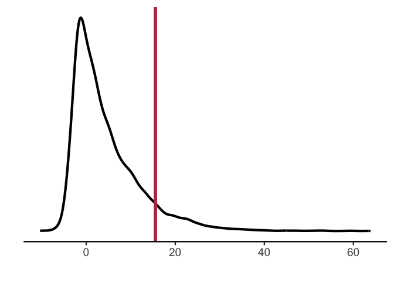<!-- -->

``` r
print(sum(diff1$aggDiffPseudo>PovInt_AICDiff)/10000)
```

    ## [1] 0.657

``` r
# cbcl social vs. null
cbclsocgAge_pov=bam(g~s(cbcl_scr_syn_social_r,k=4)+s(interview_age,k=4)+poverty,data=masterdf)
cbclsocgAge_povint=bam(g~s(cbcl_scr_syn_social_r,by=poverty,k=4)+s(interview_age,k=4)+poverty,data=masterdf)
PovInt_AICDiff=AIC(cbclsocgAge_pov)-AIC(cbclsocgAge_povint)
# plot it relative to null distribution
ggplot(diff1,aes(x=socDiffPseudo))+geom_density(size=1.5)+geom_vline(xintercept = PovInt_AICDiff,size=2,color='#BC3754')+theme_classic(base_size=18)+ylab('')+xlab('')+guides(y="none")+scale_x_continuous()
```

<!-- -->

``` r
print(sum(diff1$aggDiffPseudo>PovInt_AICDiff)/10000)
```

    ## [1] 0.5287

``` r
# now for ASR
# check out bootstrapped poverty evidence through difference in AIC (actual difference in AIC vs. 10,000 null derivations)
diff1=readRDS('~/Desktop/g_p/gpDiffBoots_asrPseudo1.rds')
diff2=readRDS('~/Desktop/g_p/gpDiffBoots_asrPseudo2.rds')
diff3=readRDS('~/Desktop/g_p/gpDiffBoots_asrPseudo3.rds')
diff4=readRDS('~/Desktop/g_p/gpDiffBoots_asrPseudo4.rds')
diff5=readRDS('~/Desktop/g_p/gpDiffBoots_asrPseudo5.rds')
# combine
diff1[2001:4000,]=diff2[2001:4000,]
diff1[4001:6000,]=diff3[4001:6000,]
diff1[6001:8000,]=diff4[6001:8000,]
diff1[8001:10000,]=diff5[8001:10000,]
# looks good, compare to full data AIC

##### lil' section to mirror slurm calculations ##### §§§§§§§§§§§
masterdf<-readRDS('~/gp_masterdf.rds')
masterdf$poverty=0
# poverty now defined in sample construction
masterdf$poverty[masterdf$Pov_v2==1]=1
masterdf$poverty=as.factor(masterdf$poverty)
masterdf$ASR_anxdep=as.numeric(masterdf$ASRAnxDepr)
masterdf$ASR_withdep=as.numeric(masterdf$ASRWithdrawn)
masterdf$ASR_somatic=as.numeric(masterdf$ASRSomatic)
masterdf$ASR_thought=as.numeric(masterdf$ASRThought)
masterdf$ASR_attention=as.numeric(masterdf$ASRAttn)
masterdf$ASR_aggressive=as.numeric(masterdf$ASRAggr)
masterdf$ASR_rulebreak=as.numeric(masterdf$ASRRulB)
masterdf$ASRInt=as.numeric(masterdf$ASRInt)
masterdf$ASRExt=as.numeric(masterdf$ASRExt)
#######            ----------------              ##### §§§§§§§§§§§

# plot asr p versus null
asrpgAge_pov=bam(g~s(parentPcount,k=4)+s(interview_age,k=4)+poverty,data=masterdf)
asrpgAge_povint=bam(g~s(parentPcount,by=poverty,k=4)+s(interview_age,k=4)+poverty,data=masterdf)
PovInt_AICDiff=AIC(asrpgAge_pov)-AIC(asrpgAge_povint)
# plot it relative to null distribution
ggplot(diff1,aes(x=asrPDiffPseudo))+geom_density(size=1.5)+geom_vline(xintercept = PovInt_AICDiff,size=2,color='#BC3754')+theme_classic(base_size=18)+ylab('')+xlab('')+guides(y="none")+scale_x_continuous()
```

<!-- -->

``` r
print(sum(diff1$asrPDiffPseudo>PovInt_AICDiff)/10000)
```

    ## [1] 0.0459

``` r
# asr int vs. null
asrintgAge_pov=bam(g~s(ASRInt,k=4)+s(interview_age,k=4)+poverty,data=masterdf)
asrintgAge_povint=bam(g~s(ASRInt,by=poverty,k=4)+s(interview_age,k=4)+poverty,data=masterdf)
PovInt_AICDiff=AIC(asrintgAge_pov)-AIC(asrintgAge_povint)
# plot it relative to null distribution
ggplot(diff1,aes(x=asrintDiffPseudo))+geom_density(size=1.5)+geom_vline(xintercept = PovInt_AICDiff,size=2,color='#BC3754')+theme_classic(base_size=18)+ylab('')+xlab('')+guides(y="none")+scale_x_continuous()
```

<!-- -->

``` r
print(sum(diff1$asrintDiffPseudo>PovInt_AICDiff)/10000)
```

    ## [1] 0.0179

``` r
# asr ext vs. null
asrextgAge_pov=bam(g~s(ASRExt,k=4)+s(interview_age,k=4)+poverty,data=masterdf)
asrextgAge_povint=bam(g~s(ASRExt,by=poverty,k=4)+s(interview_age,k=4)+poverty,data=masterdf)
PovInt_AICDiff=AIC(asrextgAge_pov)-AIC(asrextgAge_povint)
# plot it relative to null distribution
ggplot(diff1,aes(x=asrextDiffPseudo))+geom_density(size=1.5)+geom_vline(xintercept = PovInt_AICDiff,size=2,color='#BC3754')+theme_classic(base_size=18)+ylab('')+xlab('')+guides(y="none")+scale_x_continuous()
```

<!-- -->

``` r
print(sum(diff1$asrextDiffPseudo>PovInt_AICDiff)/10000)
```

    ## [1] 0.0612

``` r
# asr som vs. null
asrsomgAge_pov=bam(g~s(ASR_somatic,k=4)+s(interview_age,k=4)+poverty,data=masterdf)
asrsomgAge_povint=bam(g~s(ASR_somatic,by=poverty,k=4)+s(interview_age,k=4)+poverty,data=masterdf)
PovInt_AICDiff=AIC(asrsomgAge_pov)-AIC(asrsomgAge_povint)
# plot it relative to null distribution
ggplot(diff1,aes(x=asrsomDiffPseudo))+geom_density(size=1.5)+geom_vline(xintercept = PovInt_AICDiff,size=2,color='#BC3754')+theme_classic(base_size=18)+ylab('')+xlab('')+guides(y="none")+scale_x_continuous()
```

<!-- -->

``` r
print(sum(diff1$asrsomDiffPseudo>PovInt_AICDiff)/10000)
```

    ## [1] 0.0174

``` r
# asr anxdep vs. null
asranxgAge_pov=bam(g~s(ASR_anxdep,k=4)+s(interview_age,k=4)+poverty,data=masterdf)
asranxgAge_povint=bam(g~s(ASR_anxdep,by=poverty,k=4)+s(interview_age,k=4)+poverty,data=masterdf)
PovInt_AICDiff=AIC(asranxgAge_pov)-AIC(asranxgAge_povint)
# plot it relative to null distribution
ggplot(diff1,aes(x=asranxDiffPseudo))+geom_density(size=1.5)+geom_vline(xintercept = PovInt_AICDiff,size=2,color='#BC3754')+theme_classic(base_size=18)+ylab('')+xlab('')+guides(y="none")+scale_x_continuous()
```

<!-- -->

``` r
print(sum(diff1$asranxDiffPseudo>PovInt_AICDiff)/10000)
```

    ## [1] 0.0467

``` r
# asr tho vs. null
asrthogAge_pov=bam(g~s(ASR_thought,k=4)+s(interview_age,k=4)+poverty,data=masterdf)
asrthogAge_povint=bam(g~s(ASR_thought,by=poverty,k=4)+s(interview_age,k=4)+poverty,data=masterdf)
PovInt_AICDiff=AIC(asrthogAge_pov)-AIC(asrthogAge_povint)
# plot it relative to null distribution
ggplot(diff1,aes(x=asrthoDiffPseudo))+geom_density(size=1.5)+geom_vline(xintercept = PovInt_AICDiff,size=2,color='#BC3754')+theme_classic(base_size=18)+ylab('')+xlab('')+guides(y="none")+scale_x_continuous()
```

<!-- -->

``` r
print(sum(diff1$asrthoDiffPseudo>PovInt_AICDiff)/10000)
```

    ## [1] 0.1237

``` r
# asr withdep vs. null
asrwithgAge_pov=bam(g~s(ASR_withdep,k=4)+s(interview_age,k=4)+poverty,data=masterdf)
asrwithgAge_povint=bam(g~s(ASR_withdep,by=poverty,k=4)+s(interview_age,k=4)+poverty,data=masterdf)
PovInt_AICDiff=AIC(asrwithgAge_pov)-AIC(asrwithgAge_povint)
# plot it relative to null distribution
ggplot(diff1,aes(x=asrwitDiffPseudo))+geom_density(size=1.5)+geom_vline(xintercept = PovInt_AICDiff,size=2,color='#BC3754')+theme_classic(base_size=18)+ylab('')+xlab('')+guides(y="none")+scale_x_continuous()
```

<!-- -->

``` r
print(sum(diff1$asrwitDiffPseudo>PovInt_AICDiff)/10000)
```

    ## [1] 0.1263

``` r
# asr attention vs. null
asrattgAge_pov=bam(g~s(ASR_attention,k=4)+s(interview_age,k=4)+poverty,data=masterdf)
asrattgAge_povint=bam(g~s(ASR_attention,by=poverty,k=4)+s(interview_age,k=4)+poverty,data=masterdf)
PovInt_AICDiff=AIC(asrattgAge_pov)-AIC(asrattgAge_povint)
# plot it relative to null distribution
ggplot(diff1,aes(x=asrattDiffPseudo))+geom_density(size=1.5)+geom_vline(xintercept = PovInt_AICDiff,size=2,color='#BC3754')+theme_classic(base_size=18)+ylab('')+xlab('')+guides(y="none")+scale_x_continuous()
```

<!-- -->

``` r
print(sum(diff1$asrattDiffPseudo>PovInt_AICDiff)/10000)
```

    ## [1] 0.0546

``` r
# asr rulebreak vs. null
asrrulegAge_pov=bam(g~s(ASR_rulebreak,k=4)+s(interview_age,k=4)+poverty,data=masterdf)
asrrulegAge_povint=bam(g~s(ASR_rulebreak,by=poverty,k=4)+s(interview_age,k=4)+poverty,data=masterdf)
PovInt_AICDiff=AIC(asrrulegAge_pov)-AIC(asrrulegAge_povint)
# plot it relative to null distribution
ggplot(diff1,aes(x=asrrulDiffPseudo))+geom_density(size=1.5)+geom_vline(xintercept = PovInt_AICDiff,size=2,color='#BC3754')+theme_classic(base_size=18)+ylab('')+xlab('')+guides(y="none")+scale_x_continuous()
```

<!-- -->

``` r
print(sum(diff1$asrrulDiffPseudo>PovInt_AICDiff)/10000)
```

    ## [1] 0.0741

``` r
# asr aggr vs. null
asraggrgAge_pov=bam(g~s(ASR_aggressive,k=4)+s(interview_age,k=4)+poverty,data=masterdf)
asraggrgAge_povint=bam(g~s(ASR_aggressive,by=poverty,k=4)+s(interview_age,k=4)+poverty,data=masterdf)
PovInt_AICDiff=AIC(asraggrgAge_pov)-AIC(asraggrgAge_povint)
# plot it relative to null distribution
ggplot(diff1,aes(x=asraggDiffPseudo))+geom_density(size=1.5)+geom_vline(xintercept = PovInt_AICDiff,size=2,color='#BC3754')+theme_classic(base_size=18)+ylab('')+xlab('')+guides(y="none")+scale_x_continuous()
```

<!-- -->

``` r
print(sum(diff1$asraggDiffPseudo>PovInt_AICDiff)/10000)
```

    ## [1] 0.0825

``` r
# load in data
Fits=readRDS('~/Desktop/g_p/gpFitBoots_asr.rds')
# find mean shape and plot it: p
PFits=Fits[,448:608]
MaxP=find_furthest_nonzero(PFits)
# melt data for plotting each line
data_melt <- melt(t(PFits))
data_melt$Var1 <- rep(seq(0, 160), nrow(PFits))
# Calculate percentiles
percentiles <- PFits %>%
summarise(across(everything(), quantile, probs = c(0.01, 0.99), na.rm = TRUE))
```

    ## Warning: Returning more (or less) than 1 row per `summarise()` group was deprecated in
    ## dplyr 1.1.0.
    ## ℹ Please use `reframe()` instead.
    ## ℹ When switching from `summarise()` to `reframe()`, remember that `reframe()`
    ##   always returns an ungrouped data frame and adjust accordingly.
    ## Call `lifecycle::last_lifecycle_warnings()` to see where this warning was
    ## generated.

``` r
percentiles_long <- tidyr::pivot_longer(percentiles, cols = everything(), names_to = "Percentile", values_to = "YValue")

# Add CI column
data_melt$CI <- 0
  
# Prepare CIs for insertion
CIs <- data.frame(rep(seq(0, 160), 2), c(rep(10001, 161), rep(10002, 161)), percentiles_long$YValue, rep(1, (161*2)))
colnames(CIs) <- colnames(data_melt)
  
# Add CIs
data_melt2 <- rbind(data_melt, CIs)
  
# Convert CI column to factor
data_melt2$CI <- as.factor(data_melt2$CI)

# Plotting the lines
ggplot(data = data_melt2, aes(x = Var1, y = value, group = Var2)) +
  geom_line(aes(alpha = CI, color = Var2), show.legend = FALSE) +
  scale_color_viridis_c(option = "inferno", direction = -1) +
  scale_alpha_manual(values = c(0.01, 1), guide = FALSE) + ylim(c(-1.5,1.5)) +
  theme_minimal(base_size=35) + 
  ylab(y_title)+xlab(x_title)+
  theme(panel.border = element_rect(color = "black", fill = NA, size = 1)) +
  scale_x_continuous(limits = c(0,MaxP),expand = expansion(mult = c(0, 0)))
```

    ## Warning: Removed 240048 rows containing missing values (`geom_line()`).

<!-- -->

``` r
# load in data
Fits1=readRDS('~/Desktop/g_p/gpFitBoots_cbclasr1.rds')
Fits2=readRDS('~/Desktop/g_p/gpFitBoots_cbclasr2.rds')
Fits3=readRDS('~/Desktop/g_p/gpFitBoots_cbclasr3.rds')
Fits4=readRDS('~/Desktop/g_p/gpFitBoots_cbclasr4.rds')
Fits5=readRDS('~/Desktop/g_p/gpFitBoots_cbclasr5.rds')
Fits=Fits1
Fits[2001:4000,]=Fits2[2001:4000,]
Fits[4001:6000,]=Fits3[4001:6000,]
Fits[6001:8000,]=Fits4[6001:8000,]
Fits[8001:10000,]=Fits5[8001:10000,]

PFits=Fits[,395:555]
MaxP=quantile(masterdf$parentPcount,.99)

IFits = Fits[,(161:191)+395]
EFits = Fits[,(192:255)+395]
SomFits = Fits[,(256:276)+395]
AnxFits = Fits[,(277:308)+395]
ThoFits = Fits[,(309:327)+395]
WitFits = Fits[,(328:346)+395]
AttFits = Fits[,(347:378)+395]
RulFits = Fits[,(379:400)+395]
AggFits = Fits[,(401:446)+395]

MaxI=quantile(masterdf$ASRInt,.99)
MaxE=quantile(masterdf$ASRExt,.99)
MaxAnx=quantile(masterdf$ASRAnxDepr,.99)
MaxTho=quantile(masterdf$ASRThought,.99)
MaxWit=quantile(masterdf$ASRWithdrawn,.99)
MaxSom=quantile(masterdf$ASRSomatic,.99)
MaxAtt=quantile(masterdf$ASR_attention,.99)
MaxRul=quantile(masterdf$ASR_rulebreak,.99)
MaxAgg=quantile(masterdf$ASR_aggressive,.99)

# actually plot em: some in main text as fig 2, some as fig s5
plot_bootstraps_par(PFits,160,x_title,MaxP)
```

    ## Warning: Returning more (or less) than 1 row per `summarise()` group was deprecated in
    ## dplyr 1.1.0.
    ## ℹ Please use `reframe()` instead.
    ## ℹ When switching from `summarise()` to `reframe()`, remember that `reframe()`
    ##   always returns an ungrouped data frame and adjust accordingly.
    ## Call `lifecycle::last_lifecycle_warnings()` to see where this warning was
    ## generated.

    ## Warning: Removed 600120 rows containing missing values (`geom_line()`).

<!-- -->

``` r
plot_bootstraps_par(IFits,30,'Caregiver Internalizing',MaxI)
```

    ## Warning: Returning more (or less) than 1 row per `summarise()` group was deprecated in
    ## dplyr 1.1.0.
    ## ℹ Please use `reframe()` instead.
    ## ℹ When switching from `summarise()` to `reframe()`, remember that `reframe()`
    ##   always returns an ungrouped data frame and adjust accordingly.
    ## Call `lifecycle::last_lifecycle_warnings()` to see where this warning was
    ## generated.

    ## Warning: Removed 120024 rows containing missing values (`geom_line()`).

<!-- -->

``` r
plot_bootstraps_par(EFits,63,'Externalizing',MaxE)
```

    ## Warning: Returning more (or less) than 1 row per `summarise()` group was deprecated in
    ## dplyr 1.1.0.
    ## ℹ Please use `reframe()` instead.
    ## ℹ When switching from `summarise()` to `reframe()`, remember that `reframe()`
    ##   always returns an ungrouped data frame and adjust accordingly.
    ## Call `lifecycle::last_lifecycle_warnings()` to see where this warning was
    ## generated.

    ## Warning: Removed 350070 rows containing missing values (`geom_line()`).

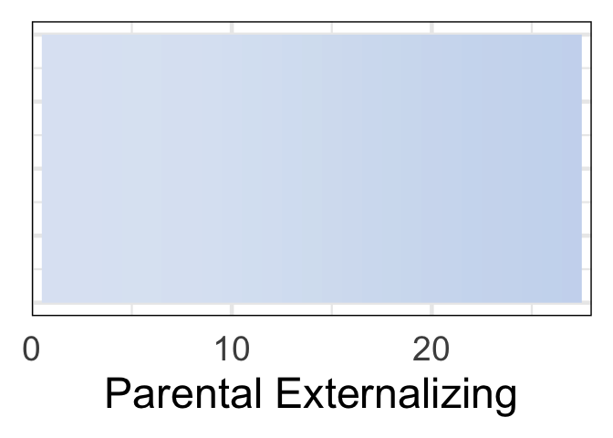<!-- -->

``` r
plot_bootstraps_par(AnxFits,31,'Anxious Depression',MaxAnx)
```

    ## Warning: Returning more (or less) than 1 row per `summarise()` group was deprecated in
    ## dplyr 1.1.0.
    ## ℹ Please use `reframe()` instead.
    ## ℹ When switching from `summarise()` to `reframe()`, remember that `reframe()`
    ##   always returns an ungrouped data frame and adjust accordingly.
    ## Call `lifecycle::last_lifecycle_warnings()` to see where this warning was
    ## generated.

    ## Warning: Removed 110022 rows containing missing values (`geom_line()`).

<!-- -->

``` r
plot_bootstraps_par(WitFits,18,'Withdrawn Depression',MaxWit)
```

    ## Warning: Returning more (or less) than 1 row per `summarise()` group was deprecated in
    ## dplyr 1.1.0.
    ## ℹ Please use `reframe()` instead.
    ## ℹ When switching from `summarise()` to `reframe()`, remember that `reframe()`
    ##   always returns an ungrouped data frame and adjust accordingly.
    ## Call `lifecycle::last_lifecycle_warnings()` to see where this warning was
    ## generated.

    ## Warning: Removed 90018 rows containing missing values (`geom_line()`).

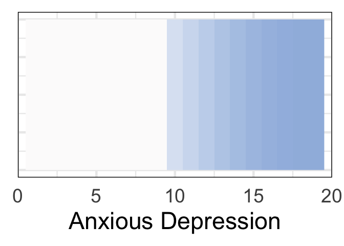<!-- -->

``` r
plot_bootstraps_par(AttFits,31,'Attention',MaxAtt)
```

    ## Warning: Returning more (or less) than 1 row per `summarise()` group was deprecated in
    ## dplyr 1.1.0.
    ## ℹ Please use `reframe()` instead.
    ## ℹ When switching from `summarise()` to `reframe()`, remember that `reframe()`
    ##   always returns an ungrouped data frame and adjust accordingly.
    ## Call `lifecycle::last_lifecycle_warnings()` to see where this warning was
    ## generated.

    ## Warning: Removed 120024 rows containing missing values (`geom_line()`).

<!-- -->

``` r
plot_bootstraps_par(RulFits,21,'Rule Breaking',MaxRul)
```

    ## Warning: Returning more (or less) than 1 row per `summarise()` group was deprecated in
    ## dplyr 1.1.0.
    ## ℹ Please use `reframe()` instead.
    ## ℹ When switching from `summarise()` to `reframe()`, remember that `reframe()`
    ##   always returns an ungrouped data frame and adjust accordingly.
    ## Call `lifecycle::last_lifecycle_warnings()` to see where this warning was
    ## generated.

    ## Warning: Removed 130026 rows containing missing values (`geom_line()`).

<!-- -->

``` r
plot_bootstraps_par(AggFits,45,'Aggression',MaxAgg)
```

    ## Warning: Returning more (or less) than 1 row per `summarise()` group was deprecated in
    ## dplyr 1.1.0.
    ## ℹ Please use `reframe()` instead.
    ## ℹ When switching from `summarise()` to `reframe()`, remember that `reframe()`
    ##   always returns an ungrouped data frame and adjust accordingly.
    ## Call `lifecycle::last_lifecycle_warnings()` to see where this warning was
    ## generated.

    ## Warning: Removed 240048 rows containing missing values (`geom_line()`).

<!-- -->

``` r
plot_bootstraps_par(ThoFits,18,'Thought',MaxTho)
```

    ## Warning: Returning more (or less) than 1 row per `summarise()` group was deprecated in
    ## dplyr 1.1.0.
    ## ℹ Please use `reframe()` instead.
    ## ℹ When switching from `summarise()` to `reframe()`, remember that `reframe()`
    ##   always returns an ungrouped data frame and adjust accordingly.
    ## Call `lifecycle::last_lifecycle_warnings()` to see where this warning was
    ## generated.

    ## Warning: Removed 80016 rows containing missing values (`geom_line()`).

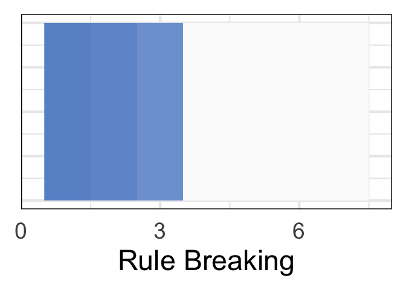<!-- -->

``` r
plot_bootstraps_par(SomFits,20,'Somatic',MaxSom)
```

    ## Warning: Returning more (or less) than 1 row per `summarise()` group was deprecated in
    ## dplyr 1.1.0.
    ## ℹ Please use `reframe()` instead.
    ## ℹ When switching from `summarise()` to `reframe()`, remember that `reframe()`
    ##   always returns an ungrouped data frame and adjust accordingly.
    ## Removed 80016 rows containing missing values (`geom_line()`).
    ## Call `lifecycle::last_lifecycle_warnings()` to see where this warning was
    ## generated.

<!-- -->

``` r
p_derivative_matrix <- matrix(0, nrow = nrow(PFits), ncol = ncol(PFits) - 1)
# Calculate the derivative for each column
for (i in 1:(ncol(PFits) - 1)) {
  # Calculate the differences in x (assuming a constant difference)
  dx <- 1
  # Calculate the differences in y (predicted values)
  dy <- PFits[, i + 1] - PFits[, i]
  # Calculate the derivatives (slopes)
  derivatives <- dy / dx
  # Store the derivatives in the derivative matrix
  p_derivative_matrix[, i] <- derivatives
}
# for p - saved out at 600x200, 300x200 for minor scales
# get straightfoward of segment where 99% is over 0 or under
positive_counts <- colSums(p_derivative_matrix > 0, na.rm = TRUE)
negative_counts <- colSums(p_derivative_matrix < 0, na.rm = TRUE)
# find where each is 99% or greater
positive_countsSig=positive_counts>9500
negative_countsSig=negative_counts>9500
# make dataframe: 50th percentile of derivatives accompanied by posSig and NegSig vector
data <- apply(p_derivative_matrix, 2, function(x) quantile(x, probs = 0.5))
dervPlotDf<-data.frame(data,positive_countsSig,negative_countsSig)
# if either is sig at 99% plot
dervPlotDf$sig_derivMask=dervPlotDf[,2]+dervPlotDf[,3]>0
# use it to mask calculated derivs
dervPlotDf$sig_deriv=0
dervPlotDf$sig_deriv[dervPlotDf$sig_derivMask]=dervPlotDf$data[dervPlotDf$sig_derivMask]
dervPlotDf$seq=1:(dim(dervPlotDf)[1])
plot<-ggplot(data=dervPlotDf) + geom_raster(aes(x = seq, y = .5, fill = sig_deriv))+
    theme(panel.spacing = unit(-.01,"cm")) +
    scale_fill_gradientn(colors = my_palette(100),limits = c(min(-.1),max(0.1)))+theme_minimal(base_size = 35)+
    xlim(c(0,MaxP))+xlab(x_title)+
    guides(fill=FALSE)+
    theme(axis.title.y = element_blank(),axis.text.y=element_blank())+theme(panel.border = element_rect(color = "black", fill = NA, size = 1))+
    scale_x_continuous(limits = c(0,MaxP),expand = expansion(mult = c(0, 0)))
```

    ## Scale for x is already present.
    ## Adding another scale for x, which will replace the existing scale.

``` r
plot + theme(plot.margin = margin(r = 30,l=5,t=5,b=5))
```

    ## Warning: Removed 61 rows containing missing values (`geom_raster()`).

<!-- -->

``` r
# for int
int_derivative_matrix <- matrix(0, nrow = nrow(IFits), ncol = ncol(IFits) - 1)
# Calculate the derivative for each column
for (i in 1:(ncol(IFits) - 1)) {
  # Calculate the differences in x (assuming a constant difference)
  dx <- 1
  # Calculate the differences in y (predicted values)
  dy <- IFits[, i + 1] - IFits[, i]
  # Calculate the derivatives (slopes)
  derivatives <- dy / dx
  # Store the derivatives in the derivative matrix
  int_derivative_matrix[, i] <- derivatives
}
# get straightfoward of segment where 99% is over 0 or under
positive_counts <- colSums(int_derivative_matrix > 0, na.rm = TRUE)
negative_counts <- colSums(int_derivative_matrix < 0, na.rm = TRUE)
# find where each is 99% or greater
positive_countsSig=positive_counts>9500
negative_countsSig=negative_counts>9500
# make dataframe: 50th percentile of derivatives accompanied by posSig and NegSig vector
data <- apply(int_derivative_matrix, 2, function(x) quantile(x, probs = 0.5))
dervPlotDf<-data.frame(data,positive_countsSig,negative_countsSig)
# if either is sig at 99% plot
dervPlotDf$sig_derivMask=dervPlotDf[,2]+dervPlotDf[,3]>0
# use it to mask calculated derivs
dervPlotDf$sig_deriv=0
dervPlotDf$sig_deriv[dervPlotDf$sig_derivMask]=dervPlotDf$data[dervPlotDf$sig_derivMask]
dervPlotDf$seq=1:(dim(dervPlotDf)[1])
ggplot(data=dervPlotDf) + geom_raster(aes(x = seq, y = .5, fill = sig_deriv))+
    theme(panel.spacing = unit(-.01,"cm")) +
    scale_fill_gradientn(colors = my_palette(100),limits = c(min(-.1),max(0.1)))+theme_minimal(base_size = 35)+
    xlab('Parental Internalizing')+
    guides(fill=FALSE)+
    theme(axis.title.y = element_blank(),axis.text.y=element_blank())+theme(panel.border = element_rect(color = "black", fill = NA, size = 1))+
    scale_x_continuous(limits = c(0,MaxI),expand = expansion(mult = c(0, 0)))
```

    ## Warning: Removed 13 rows containing missing values (`geom_raster()`).

<!-- -->

``` r
# for ext
ext_derivative_matrix <- matrix(0, nrow = nrow(EFits), ncol = ncol(EFits) - 1)
# Calculate the derivative for each column
for (i in 1:(ncol(EFits) - 1)) {
  # Calculate the differences in x (assuming a constant difference)
  dx <- 1
  # Calculate the differences in y (predicted values)
  dy <- EFits[, i + 1] - EFits[, i]
  # Calculate the derivatives (slopes)
  derivatives <- dy / dx
  # Store the derivatives in the derivative matrix
  ext_derivative_matrix[, i] <- derivatives
}
# get straightfoward of segment where 99% is over 0 or under
positive_counts <- colSums(ext_derivative_matrix > 0, na.rm = TRUE)
negative_counts <- colSums(ext_derivative_matrix < 0, na.rm = TRUE)
# find where each is 99% or greater
positive_countsSig=positive_counts>9500
negative_countsSig=negative_counts>9500
# make dataframe: 50th percentile of derivatives accompanied by posSig and NegSig vector
data <- apply(ext_derivative_matrix, 2, function(x) quantile(x, probs = 0.5))
dervPlotDf<-data.frame(data,positive_countsSig,negative_countsSig)
# if either is sig at 99% plot
dervPlotDf$sig_derivMask=dervPlotDf[,2]+dervPlotDf[,3]>0
# use it to mask calculated derivs
dervPlotDf$sig_deriv=0
dervPlotDf$sig_deriv[dervPlotDf$sig_derivMask]=dervPlotDf$data[dervPlotDf$sig_derivMask]
dervPlotDf$seq=1:(dim(dervPlotDf)[1])
ggplot(data=dervPlotDf) + geom_raster(aes(x = seq, y = .5, fill = sig_deriv))+
    theme(panel.spacing = unit(-.01,"cm")) +
    scale_fill_gradientn(colors = my_palette(100),limits = c(min(-.1),max(0.1)))+theme_minimal(base_size = 35)+
    xlim(c(0,MaxE))+xlab('Parental Externalizing')+
    guides(fill=FALSE)+
    theme(axis.title.y = element_blank(),axis.text.y=element_blank())+theme(panel.border = element_rect(color = "black", fill = NA, size = 1))+
    scale_x_continuous(limits = c(0,MaxE),expand = expansion(mult = c(0, 0)))
```

    ## Scale for x is already present.
    ## Adding another scale for x, which will replace the existing scale.

    ## Warning: Removed 36 rows containing missing values (`geom_raster()`).

<!-- -->

``` r
# for som
som_derivative_matrix <- matrix(0, nrow = nrow(SomFits), ncol = ncol(SomFits) - 1)
# Calculate the derivative for each column
for (i in 1:(ncol(SomFits) - 1)) {
  # Calculate the differences in x (assuming a constant difference)
  dx <- 1
  # Calculate the differences in y (predicted values)
  dy <- SomFits[, i + 1] - SomFits[, i]
  # Calculate the derivatives (slopes)
  derivatives <- dy / dx
  # Store the derivatives in the derivative matrix
  som_derivative_matrix[, i] <- derivatives
}
# get straightfoward of segment where 99% is over 0 or under
positive_counts <- colSums(som_derivative_matrix > 0, na.rm = TRUE)
negative_counts <- colSums(som_derivative_matrix < 0, na.rm = TRUE)
# find where each is 99% or greater
positive_countsSig=positive_counts>9500
negative_countsSig=negative_counts>9500
# make dataframe: 50th percentile of derivatives accompanied by posSig and NegSig vector
data <- apply(som_derivative_matrix, 2, function(x) quantile(x, probs = 0.5))
dervPlotDf<-data.frame(data,positive_countsSig,negative_countsSig)
# if either is sig at 99% plot
dervPlotDf$sig_derivMask=dervPlotDf[,2]+dervPlotDf[,3]>0
# use it to mask calculated derivs
dervPlotDf$sig_deriv=0
dervPlotDf$sig_deriv[dervPlotDf$sig_derivMask]=dervPlotDf$data[dervPlotDf$sig_derivMask]
dervPlotDf$seq=1:(dim(dervPlotDf)[1])
ggplot(data=dervPlotDf) + geom_raster(aes(x = seq, y = .5, fill = sig_deriv))+
    theme(panel.spacing = unit(-.01,"cm")) +
    scale_fill_gradientn(colors = my_palette(100),limits = c(min(-.1),max(0.1)))+theme_minimal(base_size = 35)+
    xlim(c(0,MaxSom))+xlab('Somatic')+
    guides(fill=FALSE)+
    theme(axis.title.y = element_blank(),axis.text.y=element_blank())+theme(panel.border = element_rect(color = "black", fill = NA, size = 1))+
    scale_x_continuous(limits = c(0,MaxSom),expand = expansion(mult = c(0, 0)))
```

    ## Scale for x is already present.
    ## Adding another scale for x, which will replace the existing scale.

    ## Warning: Removed 9 rows containing missing values (`geom_raster()`).

<!-- -->

``` r
# for anx
anx_derivative_matrix <- matrix(0, nrow = nrow(AnxFits), ncol = ncol(AnxFits) - 1)
# Calculate the derivative for each column
for (i in 1:(ncol(AnxFits) - 1)) {
  # Calculate the differences in x (assuming a constant difference)
  dx <- 1
  # Calculate the differences in y (predicted values)
  dy <- AnxFits[, i + 1] - AnxFits[, i]
  # Calculate the derivatives (slopes)
  derivatives <- dy / dx
  # Store the derivatives in the derivative matrix
  anx_derivative_matrix[, i] <- derivatives
}
# get straightfoward of segment where 99% is over 0 or under
positive_counts <- colSums(anx_derivative_matrix > 0, na.rm = TRUE)
negative_counts <- colSums(anx_derivative_matrix < 0, na.rm = TRUE)
# find where each is 99% or greater
positive_countsSig=positive_counts>9500
negative_countsSig=negative_counts>9500
# make dataframe: 50th percentile of derivatives accompanied by posSig and NegSig vector
data <- apply(anx_derivative_matrix, 2, function(x) quantile(x, probs = 0.5))
dervPlotDf<-data.frame(data,positive_countsSig,negative_countsSig)
dervPlotDf$sig_derivMask=dervPlotDf[,2]+dervPlotDf[,3]>0
dervPlotDf$sig_deriv=0
dervPlotDf$sig_deriv[dervPlotDf$sig_derivMask]=dervPlotDf$data[dervPlotDf$sig_derivMask]
dervPlotDf$seq=1:(dim(dervPlotDf)[1])
ggplot(data=dervPlotDf) + geom_raster(aes(x = seq, y = .5, fill = sig_deriv))+
    theme(panel.spacing = unit(-.01,"cm")) +
    scale_fill_gradientn(colors = my_palette(100),limits = c(min(-.1),max(0.1)))+theme_minimal(base_size = 35)+
    xlim(c(0,MaxAnx))+xlab('Anxious Depression')+
    guides(fill=FALSE)+
    theme(axis.title.y = element_blank(),axis.text.y=element_blank())+theme(panel.border = element_rect(color = "black", fill = NA, size = 1))+
    scale_x_continuous(limits = c(0,MaxAnx),expand = expansion(mult = c(0, 0)))
```

    ## Scale for x is already present.
    ## Adding another scale for x, which will replace the existing scale.

    ## Warning: Removed 12 rows containing missing values (`geom_raster()`).

<!-- -->

``` r
# for Tho
tho_derivative_matrix <- matrix(0, nrow = nrow(ThoFits), ncol = ncol(ThoFits) - 1)
# Calculate the derivative for each column
for (i in 1:(ncol(ThoFits) - 1)) {
  # Calculate the differences in x (assuming a constant difference)
  dx <- 1
  # Calculate the differences in y (predicted values)
  dy <- ThoFits[, i + 1] - ThoFits[, i]
  # Calculate the derivatives (slopes)
  derivatives <- dy / dx
  # Store the derivatives in the derivative matrix
  tho_derivative_matrix[, i] <- derivatives
}
# get straightfoward of segment where 99% is over 0 or under
positive_counts <- colSums(tho_derivative_matrix > 0, na.rm = TRUE)
negative_counts <- colSums(tho_derivative_matrix < 0, na.rm = TRUE)
# find where each is 99% or greater
positive_countsSig=positive_counts>9500
negative_countsSig=negative_counts>9500
# make dataframe: 50th percentile of derivatives accompanied by posSig and NegSig vector
data <- apply(tho_derivative_matrix, 2, function(x) quantile(x, probs = 0.5))
dervPlotDf<-data.frame(data,positive_countsSig,negative_countsSig)
dervPlotDf$sig_derivMask=dervPlotDf[,2]+dervPlotDf[,3]>0
dervPlotDf$sig_deriv=0
dervPlotDf$sig_deriv[dervPlotDf$sig_derivMask]=dervPlotDf$data[dervPlotDf$sig_derivMask]
dervPlotDf$seq=1:(dim(dervPlotDf)[1])
plot<-ggplot(data=dervPlotDf) + geom_raster(aes(x = seq, y = .5, fill = sig_deriv))+
    theme(panel.spacing = unit(-.01,"cm")) +
    scale_fill_gradientn(colors = my_palette(100),limits = c(min(-.26),max(0.26)))+theme_minimal(base_size = 35)+
    xlim(c(0,MaxTho))+xlab('Thought')+
    guides(fill=FALSE)+
    theme(axis.title.y = element_blank(),axis.text.y=element_blank())+theme(panel.border = element_rect(color = "black", fill = NA, size = 1))+
    scale_x_continuous(limits = c(0,MaxTho),expand = expansion(mult = c(0, 0)))
```

    ## Scale for x is already present.
    ## Adding another scale for x, which will replace the existing scale.

``` r
plot + theme(plot.margin = margin(r = 30,l=10,t=5,b=5))
```

    ## Warning: Removed 9 rows containing missing values (`geom_raster()`).

<!-- -->

``` r
# for Wit
wit_derivative_matrix <- matrix(0, nrow = nrow(WitFits), ncol = ncol(WitFits) - 1)
# Calculate the derivative for each column
for (i in 1:(ncol(WitFits) - 1)) {
  # Calculate the differences in x (assuming a constant difference)
  dx <- 1
  # Calculate the differences in y (predicted values)
  dy <- WitFits[, i + 1] - WitFits[, i]
  # Calculate the derivatives (slopes)
  derivatives <- dy / dx
  # Store the derivatives in the derivative matrix
  wit_derivative_matrix[, i] <- derivatives
}
# get straightfoward of segment where 99% is over 0 or under
positive_counts <- colSums(wit_derivative_matrix > 0, na.rm = TRUE)
negative_counts <- colSums(wit_derivative_matrix < 0, na.rm = TRUE)
# find where each is 99% or greater
positive_countsSig=positive_counts>9500
negative_countsSig=negative_counts>9500
# make dataframe: 50th percentile of derivatives accompanied by posSig and NegSig vector
data <- apply(wit_derivative_matrix, 2, function(x) quantile(x, probs = 0.5))
dervPlotDf<-data.frame(data,positive_countsSig,negative_countsSig)
dervPlotDf$sig_derivMask=dervPlotDf[,2]+dervPlotDf[,3]>0
dervPlotDf$sig_deriv=0
dervPlotDf$sig_deriv[dervPlotDf$sig_derivMask]=dervPlotDf$data[dervPlotDf$sig_derivMask]
dervPlotDf$seq=1:(dim(dervPlotDf)[1])
ggplot(data=dervPlotDf) + geom_raster(aes(x = seq, y = .5, fill = sig_deriv))+
      theme(panel.spacing = unit(-.01,"cm")) +
      scale_fill_gradientn(colors = my_palette(100),limits = c(min(-.1),max(0.1)))+theme_minimal(base_size = 35)+xlim(c(0,MaxWit))+xlab('Withdrawn Depression')+
      guides(fill=FALSE)+
      theme(axis.title.y = element_blank(),axis.text.y=element_blank())+theme(panel.border = element_rect(color = "black", fill = NA, size = 1))+
      scale_x_continuous(limits = c(0,MaxWit),expand = expansion(mult = c(0, 0)))
```

    ## Scale for x is already present.
    ## Adding another scale for x, which will replace the existing scale.

    ## Warning: Removed 10 rows containing missing values (`geom_raster()`).

<!-- -->

``` r
# for Att
att_derivative_matrix <- matrix(0, nrow = nrow(AttFits), ncol = ncol(AttFits) - 1)
# Calculate the derivative for each column
for (i in 1:(ncol(AttFits) - 1)) {
  # Calculate the differences in x (assuming a constant difference)
  dx <- 1
  # Calculate the differences in y (predicted values)
  dy <- AttFits[, i + 1] - AttFits[, i]
  # Calculate the derivatives (slopes)
  derivatives <- dy / dx
  # Store the derivatives in the derivative matrix
  att_derivative_matrix[, i] <- derivatives
}
# get straightfoward of segment where 99% is over 0 or under
positive_counts <- colSums(att_derivative_matrix > 0, na.rm = TRUE)
negative_counts <- colSums(att_derivative_matrix < 0, na.rm = TRUE)
# find where each is 99% or greater
positive_countsSig=positive_counts>9500
negative_countsSig=negative_counts>9500
# make dataframe: 50th percentile of derivatives accompanied by posSig and NegSig vector
data <- apply(att_derivative_matrix, 2, function(x) quantile(x, probs = 0.5))
dervPlotDf<-data.frame(data,positive_countsSig,negative_countsSig)
dervPlotDf$sig_derivMask=dervPlotDf[,2]+dervPlotDf[,3]>0
dervPlotDf$sig_deriv=0
dervPlotDf$sig_deriv[dervPlotDf$sig_derivMask]=dervPlotDf$data[dervPlotDf$sig_derivMask]
dervPlotDf$seq=1:(dim(dervPlotDf)[1])
ggplot(data=dervPlotDf) + geom_raster(aes(x = seq, y = .5, fill = sig_deriv))+
      theme(panel.spacing = unit(-.01,"cm")) +
      scale_fill_gradientn(colors = my_palette(100),limits = c(min(-.1),max(0.1)))+theme_minimal(base_size = 35)+xlim(c(0,MaxAtt))+xlab('Attention')+
      guides(fill=FALSE)+
      theme(axis.title.y = element_blank(),axis.text.y=element_blank())+theme(panel.border = element_rect(color = "black", fill = NA, size = 1))+
      scale_x_continuous(limits = c(0,MaxAtt),expand = expansion(mult = c(0, 0)))
```

    ## Scale for x is already present.
    ## Adding another scale for x, which will replace the existing scale.

    ## Warning: Removed 13 rows containing missing values (`geom_raster()`).

<!-- -->

``` r
# for Rul
rul_derivative_matrix <- matrix(0, nrow = nrow(RulFits), ncol = ncol(RulFits) - 1)
# Calculate the derivative for each column
for (i in 1:(ncol(RulFits) - 1)) {
  # Calculate the differences in x (assuming a constant difference)
  dx <- 1
  # Calculate the differences in y (predicted values)
  dy <- RulFits[, i + 1] - RulFits[, i]
  # Calculate the derivatives (slopes)
  derivatives <- dy / dx
  # Store the derivatives in the derivative matrix
  rul_derivative_matrix[, i] <- derivatives
}
# get straightfoward of segment where 99% is over 0 or under
positive_counts <- colSums(rul_derivative_matrix > 0, na.rm = TRUE)
negative_counts <- colSums(rul_derivative_matrix < 0, na.rm = TRUE)
# find where each is 99% or greater
positive_countsSig=positive_counts>9500
negative_countsSig=negative_counts>9500
# make dataframe: 50th percentile of derivatives accompanied by posSig and NegSig vector
data <- apply(rul_derivative_matrix, 2, function(x) quantile(x, probs = 0.5))
dervPlotDf<-data.frame(data,positive_countsSig,negative_countsSig)
dervPlotDf$sig_derivMask=dervPlotDf[,2]+dervPlotDf[,3]>0
dervPlotDf$sig_deriv=0
dervPlotDf$sig_deriv[dervPlotDf$sig_derivMask]=dervPlotDf$data[dervPlotDf$sig_derivMask]
dervPlotDf$seq=1:(dim(dervPlotDf)[1])
ggplot(data=dervPlotDf) + geom_raster(aes(x = seq, y = .5, fill = sig_deriv))+
      theme(panel.spacing = unit(-.01,"cm")) +
      scale_fill_gradientn(colors = my_palette(100),limits = c(min(-.1),max(0.1)))+theme_minimal(base_size = 35)+xlim(c(0,MaxRul))+xlab('Rule Breaking')+
      guides(fill=FALSE)+
      theme(axis.title.y = element_blank(),axis.text.y=element_blank())+theme(panel.border = element_rect(color = "black", fill = NA, size = 1))+
      scale_x_continuous(breaks=c(0,3,6,9,12),limits = c(0,MaxRul),expand = expansion(mult = c(0, 0)))
```

    ## Scale for x is already present.
    ## Adding another scale for x, which will replace the existing scale.

    ## Warning: Removed 14 rows containing missing values (`geom_raster()`).

<!-- -->

``` r
# for Agg
agg_derivative_matrix <- matrix(0, nrow = nrow(AggFits), ncol = ncol(AggFits) - 1)
# Calculate the derivative for each column
for (i in 1:(ncol(AggFits) - 1)) {
  # Calculate the differences in x (assuming a constant difference)
  dx <- 1
  # Calculate the differences in y (predicted values)
  dy <- AggFits[, i + 1] - AggFits[, i]
  # Calculate the derivatives (slopes)
  derivatives <- dy / dx
  # Store the derivatives in the derivative matrix
  agg_derivative_matrix[, i] <- derivatives
}
# get straightfoward of segment where 99% is over 0 or under
positive_counts <- colSums(agg_derivative_matrix > 0, na.rm = TRUE)
negative_counts <- colSums(agg_derivative_matrix < 0, na.rm = TRUE)
# find where each is 99% or greater
positive_countsSig=positive_counts>9500
negative_countsSig=negative_counts>9500
# make dataframe: 50th percentile of derivatives accompanied by posSig and NegSig vector
data <- apply(agg_derivative_matrix, 2, function(x) quantile(x, probs = 0.5))
dervPlotDf<-data.frame(data,positive_countsSig,negative_countsSig)
dervPlotDf$sig_derivMask=dervPlotDf[,2]+dervPlotDf[,3]>0
dervPlotDf$sig_deriv=0
dervPlotDf$sig_deriv[dervPlotDf$sig_derivMask]=dervPlotDf$data[dervPlotDf$sig_derivMask]
dervPlotDf$seq=1:(dim(dervPlotDf)[1])
ggplot(data=dervPlotDf) + geom_raster(aes(x = seq, y = .5, fill = sig_deriv))+
      theme(panel.spacing = unit(-.01,"cm")) +
      scale_fill_gradientn(colors = my_palette(100),limits = c(min(-.1),max(0.1)))+theme_minimal(base_size = 35)+xlim(c(0,MaxAgg))+xlab('Aggression')+
      guides(fill=FALSE)+
      theme(axis.title.y = element_blank(),axis.text.y=element_blank())+theme(panel.border = element_rect(color = "black", fill = NA, size = 1))+
      scale_x_continuous(limits = c(0,MaxAgg),expand = expansion(mult = c(0, 0)))
```

    ## Scale for x is already present.
    ## Adding another scale for x, which will replace the existing scale.

    ## Warning: Removed 25 rows containing missing values (`geom_raster()`).

<!-- -->

``` r
library(dplyr)
# supplemental figure 2
PvC_de=readRDS('~/Desktop/g_p/PvC_gdevExplBoots.rds')

# rename columns for plotting
new_colnames <- c("child p", "child int.", "child ext.", "child somatic", "child anxdep.", "child thought", "child withdep.", 
                  "child social", "child attn.", "child rulebreak", "child aggr.", "parent p", "parent int.", 
                  "parent ext.", "parent somatic", "parent anx", "parent thought", "parent withdep.", 
                  "parent attn.", "parent rulebreak", "parent aggr.","p both","int. both", "ext. both","somatic both","anx both","thought both","withdep both","attn. both","rulebreak both","aggr. both")
desiredOrder <- c("child p", "parent p","p both","child int.", "parent int.","int. both","child anxdep.","parent anx","anx both","child thought", "parent thought","thought both", "child somatic","parent somatic", "somatic both", "child withdep.", "parent withdep.","withdep both","child ext.", "parent ext.", "ext. both","child aggr.", "parent aggr.", "aggr. both","child attn.", "parent attn.","attn. both","child rulebreak","parent rulebreak","rulebreak both","child social")

# set col names
colnames(PvC_de)<-new_colnames

# long format
PvC_long=melt(PvC_de)
```

    ## No id variables; using all as measure variables

``` r
# rename for clarity
colnames(PvC_long)<-c("Subscale","value")
# grouping variable for color
PvC_long$Group <- ifelse(grepl("child", PvC_long$Subscale), "child",
                         ifelse(grepl("parent", PvC_long$Subscale), "parent",
                                ifelse(grepl("both", PvC_long$Subscale), "both", NA)))
# order as desired
PvC_long$Subscale <- factor(PvC_long$Subscale, levels = desiredOrder)

PvC_long <- PvC_long %>%
  filter(!(Subscale %in% c("child social", "parent intr.")))

# Create the boxplot
ggplot(PvC_long, aes(x = Subscale, y = value,fill=Group)) +
  geom_boxplot(outlier.alpha = .1) +
  labs(x = "Subscale",
       y = "Deviance Explained in Child g",fill = "") +
  theme_minimal(base_size=35)+
  theme(axis.text.x = element_text(angle = 45, hjust = 1))+scale_fill_manual(values = c("#F9665E", "#AFC7D0", "#799FCB"))
```

<!-- -->

``` r
# saved out at 3000x1000
```

``` r
# unbootstrapped model comparison for deviance explained
# another mass "as numeric"
masterdf$parentPcount=as.numeric(masterdf$parentPcount)
masterdf$cbcl_scr_syn_totprob_r=as.numeric(masterdf$cbcl_scr_syn_totprob_r)
masterdf$cbcl_scr_syn_internal_r=as.numeric(masterdf$cbcl_scr_syn_internal_r)
masterdf$cbcl_scr_syn_external_r=as.numeric(masterdf$cbcl_scr_syn_external_r)
masterdf$cbcl_scr_syn_somatic_r=as.numeric(masterdf$cbcl_scr_syn_somatic_r)
masterdf$cbcl_scr_syn_anxdep_r=as.numeric(masterdf$cbcl_scr_syn_anxdep_r)
masterdf$cbcl_scr_syn_thought_r=as.numeric(masterdf$cbcl_scr_syn_thought_r)
masterdf$cbcl_scr_syn_withdep_r=as.numeric(masterdf$cbcl_scr_syn_withdep_r)
masterdf$cbcl_scr_syn_social_r=as.numeric(masterdf$cbcl_scr_syn_social_r)
masterdf$cbcl_scr_syn_attention_r=as.numeric(masterdf$cbcl_scr_syn_attention_r)
masterdf$cbcl_scr_syn_rulebreak_r=as.numeric(masterdf$cbcl_scr_syn_rulebreak_r)
masterdf$cbcl_scr_syn_aggressive_r=as.numeric(masterdf$cbcl_scr_syn_aggressive_r)
masterdf$parentPcount=as.numeric(masterdf$parentPcount)
masterdf$ASRInt=as.numeric(masterdf$ASRInt)
masterdf$ASRExt=as.numeric(masterdf$ASRExt)
masterdf$ASRSomatic=as.numeric(masterdf$ASRSomatic)
masterdf$ASRAnxDepr=as.numeric(masterdf$ASRAnxDepr)
masterdf$ASRThought=as.numeric(masterdf$ASRThought)
masterdf$ASRWithdrawn=as.numeric(masterdf$ASRWithdrawn)
masterdf$ASRAttn=as.numeric(masterdf$ASRAttn)
masterdf$ASRRulB=as.numeric(masterdf$ASRRulB)
masterdf$ASRAggr=as.numeric(masterdf$ASRAggr)
# fit each model explaining g with a single scale
TotProbMod <- bam(g ~ s(cbcl_scr_syn_totprob_r,k=4), data = masterdf)
InternalMod <- bam(g ~ s(cbcl_scr_syn_internal_r,k=4), data = masterdf)
ExternalMod <- bam(g ~ s(cbcl_scr_syn_external_r,k=4), data = masterdf)
SomaticMod <- bam(g ~ s(cbcl_scr_syn_somatic_r,k=4), data = masterdf)
AnxDepMod <- bam(g ~ s(cbcl_scr_syn_anxdep_r,k=4), data = masterdf)
ThoughtMod <- bam(g ~ s(cbcl_scr_syn_thought_r,k=4), data = masterdf)
WithDepMod <- bam(g ~ s(cbcl_scr_syn_withdep_r,k=4), data = masterdf)
SocialMod <- bam(g ~ s(cbcl_scr_syn_social_r,k=4), data = masterdf)
AttentionMod <- bam(g ~ s(cbcl_scr_syn_attention_r,k=4), data = masterdf)
RuleBreakMod <- bam(g ~ s(cbcl_scr_syn_rulebreak_r,k=4), data = masterdf)
AggressiveMod <- bam(g ~ s(cbcl_scr_syn_aggressive_r,k=4), data = masterdf)
ParentPcountMod <- bam(g ~ s(parentPcount,k=4), data = masterdf) 
ParentInternalMod <- bam(g ~ s(ASRInt,k=4), data = masterdf)
ParentExternalMod <- bam(g ~ s(ASRExt,k=4), data = masterdf)
ParentSomaticMod <- bam(g ~ s(ASRSomatic,k=4), data = masterdf)
ParentAnxMod <- bam(g ~ s(ASRAnxDepr,k=4), data = masterdf)
ParentThoughtMod <- bam(g ~ s(ASRThought,k=4), data = masterdf)
ParentWithMod <- bam(g ~ s(ASRWithdrawn,k=4), data = masterdf)
ParentAttnMod <- bam(g ~ s(ASRAttn,k=4), data = masterdf)
ParentRuleMod <- bam(g ~ s(ASRRulB,k=4), data = masterdf)
ParentAggMod <- bam(g ~ s(ASRAggr,k=4), data = masterdf) 
# make models with both
p_bothMod <- bam(g ~ s(cbcl_scr_syn_totprob_r,k=4) + s(parentPcount,k=4), data = masterdf)
Int_bothMod <- bam(g ~ s(cbcl_scr_syn_internal_r,k=4) + s(ASRInt,k=4), data = masterdf)
Ext_bothMod <- bam(g ~ s(cbcl_scr_syn_external_r,k=4) + s(ASRExt,k=4), data = masterdf)
Som_bothMod <- bam(g ~ s(cbcl_scr_syn_somatic_r,k=4) + s(ASRSomatic,k=4), data = masterdf)
Anx_bothMod <- bam(g ~ s(cbcl_scr_syn_anxdep_r,k=4) + s(ASRAnxDepr,k=4), data = masterdf)
Tho_bothMod <- bam(g ~ s(cbcl_scr_syn_thought_r,k=4) + s(ASRThought,k=4), data = masterdf)
With_bothMod <- bam(g ~ s(cbcl_scr_syn_withdep_r,k=4) + s(ASRWithdrawn,k=4), data = masterdf)
Attn_bothMod <- bam(g ~ s(cbcl_scr_syn_attention_r,k=4) + s(ASRAttn,k=4), data = masterdf)
Rule_bothMod <- bam(g ~ s(cbcl_scr_syn_rulebreak_r,k=4) + s(ASRRulB,k=4), data = masterdf)
Agg_bothMod <- bam(g ~ s(cbcl_scr_syn_aggressive_r,k=4) + s(ASRAggr,k=4), data = masterdf)
# print AIC from all
print(paste('p AIC:',AIC(TotProbMod), 'parent p AIC:', AIC(ParentPcountMod), 'both AIC:', AIC(p_bothMod)))
```

    ## [1] "p AIC: 26637.6758285988 parent p AIC: 26613.2472793249 both AIC: 26578.0900117083"

``` r
print(paste('internal AIC:',AIC(InternalMod), 'parent internal AIC:', AIC(ParentInternalMod), 'both AIC:', AIC(Int_bothMod)))
```

    ## [1] "internal AIC: 26661.0173068552 parent internal AIC: 26636.6931616543 both AIC: 26608.0406650894"

``` r
print(paste('external AIC:',AIC(ExternalMod), 'parent external AIC:', AIC(ParentExternalMod), 'both AIC:', AIC(Ext_bothMod)))
```

    ## [1] "external AIC: 26614.512820985 parent external AIC: 26638.4807485765 both AIC: 26605.3698449996"

``` r
print(paste('somatic AIC:',AIC(SomaticMod), 'parent somatic AIC:', AIC(ParentSomaticMod), 'both AIC:', AIC(Som_bothMod)))
```

    ## [1] "somatic AIC: 26662.7907751044 parent somatic AIC: 26653.9570711811 both AIC: 26648.7210237154"

``` r
print(paste('anxdep AIC:',AIC(AnxDepMod), 'parent anxdep AIC:', AIC(ParentAnxMod), 'both AIC:', AIC(Anx_bothMod)))
```

    ## [1] "anxdep AIC: 26648.9227572657 parent anxdep AIC: 26667.4175032821 both AIC: 26633.5285500936"

``` r
print(paste('thought AIC:',AIC(ThoughtMod), 'parent thought AIC:', AIC(ParentThoughtMod), 'both AIC:', AIC(Tho_bothMod)))
```

    ## [1] "thought AIC: 26657.5381234921 parent thought AIC: 26615.838487416 both AIC: 26592.7809227795"

``` r
print(paste('withdep AIC:',AIC(WithDepMod), 'parent withdep AIC:', AIC(ParentWithMod), 'both AIC:', AIC(With_bothMod)))
```

    ## [1] "withdep AIC: 26668.2345229478 parent withdep AIC: 26660.1386192545 both AIC: 26647.789147218"

``` r
print(paste('attention AIC:',AIC(AttentionMod), 'parent attention AIC:', AIC(ParentAttnMod), 'both AIC:', AIC(Attn_bothMod)))
```

    ## [1] "attention AIC: 26589.5566513966 parent attention AIC: 26667.5206595498 both AIC: 26555.9248521983"

``` r
print(paste('rulebreak AIC:',AIC(RuleBreakMod), 'parent rulebreak AIC:', AIC(ParentRuleMod), 'both AIC:', AIC(Rule_bothMod)))
```

    ## [1] "rulebreak AIC: 26582.9657538286 parent rulebreak AIC: 26640.6278248812 both AIC: 26571.649479477"

``` r
print(paste('aggressive AIC:',AIC(AggressiveMod), 'parent aggressive AIC:', AIC(ParentAggMod), 'both AIC:', AIC(Agg_bothMod)))
```

    ## [1] "aggressive AIC: 26635.6542671364 parent aggressive AIC: 26639.9453219352 both AIC: 26622.214912688"

``` r
# poverty plots from master df
pov_labels <- c("Above Poverty Line", "Below")
masterdf$Pov_v2<-factor(masterdf$Pov_v2, labels = pov_labels)

# for cats probably not needed
library(forcats)
masterdf$Pov_v2 <- fct_relevel(masterdf$Pov_v2, "Below")
plotdf=masterdf[,c('Pov_v2','cbcl_scr_syn_totprob_r')]
### supplementary grades fig
ggplot(plotdf, aes(x = cbcl_scr_syn_totprob_r, y = Pov_v2)) +
  geom_boxplot(alpha=.2) +
  labs(title = "Total symptoms across the poverty line",
       x = expression(italic(p)),
       y = "")+theme_minimal(base_size=23)
```

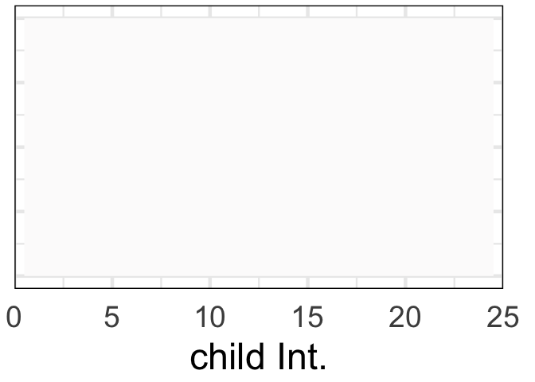<!-- -->

``` r
# get stats
bv=masterdf[masterdf$eventname=='baseline_year_1_arm_1',]
y2=masterdf[masterdf$eventname=='2_year_follow_up_y_arm_1',]
median(bv$cbcl_scr_syn_totprob_r[bv$Pov_v2=="Above Poverty Line"])
```

    ## [1] 12

``` r
median(bv$cbcl_scr_syn_totprob_r[bv$Pov_v2=="Below"])
```

    ## [1] 16

``` r
t.test(bv$cbcl_scr_syn_totprob_r[bv$Pov_v2=="Below"],bv$cbcl_scr_syn_totprob_r[bv$Pov_v2=="Above Poverty Line"])
```

    ## 
    ##  Welch Two Sample t-test
    ## 
    ## data:  bv$cbcl_scr_syn_totprob_r[bv$Pov_v2 == "Below"] and bv$cbcl_scr_syn_totprob_r[bv$Pov_v2 == "Above Poverty Line"]
    ## t = 5.2826, df = 596.95, p-value = 1.788e-07
    ## alternative hypothesis: true difference in means is not equal to 0
    ## 95 percent confidence interval:
    ##  3.252479 7.102088
    ## sample estimates:
    ## mean of x mean of y 
    ##  22.34165  17.16437

``` r
median(y2$cbcl_scr_syn_totprob_r[y2$Pov_v2=="Above Poverty Line"])
```

    ## [1] 11

``` r
median(y2$cbcl_scr_syn_totprob_r[y2$Pov_v2=="Below"])
```

    ## [1] 13

``` r
t.test(y2$cbcl_scr_syn_totprob_r[y2$Pov_v2=="Below"],y2$cbcl_scr_syn_totprob_r[y2$Pov_v2=="Above Poverty Line"])
```

    ## 
    ##  Welch Two Sample t-test
    ## 
    ## data:  y2$cbcl_scr_syn_totprob_r[y2$Pov_v2 == "Below"] and y2$cbcl_scr_syn_totprob_r[y2$Pov_v2 == "Above Poverty Line"]
    ## t = 3.8561, df = 656.19, p-value = 0.0001265
    ## alternative hypothesis: true difference in means is not equal to 0
    ## 95 percent confidence interval:
    ##  1.685798 5.183952
    ## sample estimates:
    ## mean of x mean of y 
    ##  19.37722  15.94235

``` r
# poverty child int
pov_Int=pNpFits1[,129:180]
MaxInt=quantile(masterdf$cbcl_scr_syn_internal_r, probs = 0.99)
# poverty
P_derivative_matrix <- matrix(0, nrow = nrow(pov_Int), ncol = ncol(pov_Int) - 1)
# Calculate the derivative for each column
for (i in 1:(ncol(pov_Int) - 1)) {
  # Calculate the differences in x (assuming a constant difference)
  dx <- 1
  # Calculate the differences in y (predicted values)
  dy <- pov_Int[, i + 1] - pov_Int[, i]
  # Calculate the derivatives (slopes)
  derivatives <- dy / dx
  # Store the derivatives in the derivative matrix
  P_derivative_matrix[, i] <- derivatives
}
# calc sig dervs
# get straightfoward of segment where 99% is over 0 or under
positive_counts <- colSums(P_derivative_matrix > 0, na.rm = TRUE)
negative_counts <- colSums(P_derivative_matrix < 0, na.rm = TRUE)
# find where each is 99% or greater
positive_countsSig=positive_counts>9500
negative_countsSig=negative_counts>9500
# make dataframe: 50th percentile of derivatives accompanied by posSig and NegSig vector
data <- apply(P_derivative_matrix, 2, function(x) quantile(x, probs = 0.5))
dervPlotDf<-data.frame(data,positive_countsSig,negative_countsSig)
# if either is sig at 99% plot
dervPlotDf$sig_derivMask=dervPlotDf[,2]+dervPlotDf[,3]>0
# use it to mask calculated derivs
dervPlotDf$sig_deriv=0
dervPlotDf$sig_deriv[dervPlotDf$sig_derivMask]=dervPlotDf$data[dervPlotDf$sig_derivMask]
dervPlotDf$seq=1:(dim(dervPlotDf)[1])
plot<-ggplot(data=dervPlotDf) + geom_raster(aes(x = seq, y = .5, fill = sig_deriv))+
    theme(panel.spacing = unit(-.01,"cm")) +
    scale_fill_gradientn(colors = my_palette(100),limits = c(min(-.1),max(0.1)))+theme_minimal(base_size = 35)+
    xlim(c(0,MaxInt))+xlab('child Int.')+
    guides(fill=FALSE)+
    theme(axis.title.y = element_blank(),axis.text.y=element_blank())+theme(panel.border = element_rect(color = "black", fill = NA, size = 1))+
    scale_x_continuous(limits = c(0,MaxInt),expand = expansion(mult = c(0, 0)))
```

    ## Scale for x is already present.
    ## Adding another scale for x, which will replace the existing scale.

``` r
plot + theme(plot.margin = margin(r = 30,l=5,t=5,b=5))
```

    ## Warning: Removed 27 rows containing missing values (`geom_raster()`).

<!-- -->

``` r
# poverty child ext
pov_Ext=pNpFits1[,181:228]
MaxExt=quantile(masterdf$cbcl_scr_syn_external_r, probs = 0.99)

# poverty
P_derivative_matrix <- matrix(0, nrow = nrow(pov_Ext), ncol = ncol(pov_Ext) - 1)
# Calculate the derivative for each column
for (i in 1:(ncol(pov_Ext) - 1)) {
  # Calculate the differences in x (assuming a constant difference)
  dx <- 1
  # Calculate the differences in y (predicted values)
  dy <- pov_Ext[, i + 1] - pov_Ext[, i]
  # Calculate the derivatives (slopes)
  derivatives <- dy / dx
  # Store the derivatives in the derivative matrix
  P_derivative_matrix[, i] <- derivatives
}
# calc sig dervs
# get straightfoward of segment where 99% is over 0 or under
positive_counts <- colSums(P_derivative_matrix > 0, na.rm = TRUE)
negative_counts <- colSums(P_derivative_matrix < 0, na.rm = TRUE)
# find where each is 99% or greater
positive_countsSig=positive_counts>9500
negative_countsSig=negative_counts>9500
# make dataframe: 50th percentile of derivatives accompanied by posSig and NegSig vector
data <- apply(P_derivative_matrix, 2, function(x) quantile(x, probs = 0.5))
dervPlotDf<-data.frame(data,positive_countsSig,negative_countsSig)
# if either is sig at 99% plot
dervPlotDf$sig_derivMask=dervPlotDf[,2]+dervPlotDf[,3]>0
# use it to mask calculated derivs
dervPlotDf$sig_deriv=0
dervPlotDf$sig_deriv[dervPlotDf$sig_derivMask]=dervPlotDf$data[dervPlotDf$sig_derivMask]
dervPlotDf$seq=1:(dim(dervPlotDf)[1])
plot<-ggplot(data=dervPlotDf) + geom_raster(aes(x = seq, y = .5, fill = sig_deriv))+
    theme(panel.spacing = unit(-.01,"cm")) +
    scale_fill_gradientn(colors = my_palette(100),limits = c(min(-.1),max(0.1)))+theme_minimal(base_size = 35)+
    xlim(c(0,MaxInt))+xlab('child Ext.')+
    guides(fill=FALSE)+
    theme(axis.title.y = element_blank(),axis.text.y=element_blank())+theme(panel.border = element_rect(color = "black", fill = NA, size = 1))+
    scale_x_continuous(limits = c(0,MaxExt),expand = expansion(mult = c(0, 0)))
```

    ## Scale for x is already present.
    ## Adding another scale for x, which will replace the existing scale.

``` r
plot + theme(plot.margin = margin(r = 30,l=5,t=5,b=5))
```

    ## Warning: Removed 23 rows containing missing values (`geom_raster()`).

<!-- -->

``` r
# nonpoverty
P_derivative_matrix <- matrix(0, nrow = nrow(npov_Ext), ncol = ncol(npov_Ext) - 1)
# Calculate the derivative for each column
for (i in 1:(ncol(npov_Ext) - 1)) {
  # Calculate the differences in x (assuming a constant difference)
  dx <- 1
  # Calculate the differences in y (predicted values)
  dy <- npov_Ext[, i + 1] - npov_Ext[, i]
  # Calculate the derivatives (slopes)
  derivatives <- dy / dx
  # Store the derivatives in the derivative matrix
  P_derivative_matrix[, i] <- derivatives
}
# calc sig dervs
# get straightfoward of segment where 99% is over 0 or under
positive_counts <- colSums(P_derivative_matrix > 0, na.rm = TRUE)
negative_counts <- colSums(P_derivative_matrix < 0, na.rm = TRUE)
# find where each is 99% or greater
positive_countsSig=positive_counts>9500
negative_countsSig=negative_counts>9500
# make dataframe: 50th percentile of derivatives accompanied by posSig and NegSig vector
data <- apply(P_derivative_matrix, 2, function(x) quantile(x, probs = 0.5))
dervPlotDf<-data.frame(data,positive_countsSig,negative_countsSig)
# if either is sig at 99% plot
dervPlotDf$sig_derivMask=dervPlotDf[,2]+dervPlotDf[,3]>0
# use it to mask calculated derivs
dervPlotDf$sig_deriv=0
dervPlotDf$sig_deriv[dervPlotDf$sig_derivMask]=dervPlotDf$data[dervPlotDf$sig_derivMask]
dervPlotDf$seq=1:(dim(dervPlotDf)[1])
plot<-ggplot(data=dervPlotDf) + geom_raster(aes(x = seq, y = .5, fill = sig_deriv))+
    theme(panel.spacing = unit(-.01,"cm")) +
    scale_fill_gradientn(colors = my_palette(100),limits = c(min(-.1),max(0.1)))+theme_minimal(base_size = 35)+
    xlim(c(0,MaxInt))+xlab('child Ext.')+
    guides(fill=FALSE)+
    theme(axis.title.y = element_blank(),axis.text.y=element_blank())+theme(panel.border = element_rect(color = "black", fill = NA, size = 1))+
    scale_x_continuous(limits = c(0,MaxExt),expand = expansion(mult = c(0, 0)))
```

    ## Scale for x is already present.
    ## Adding another scale for x, which will replace the existing scale.

``` r
plot + theme(plot.margin = margin(r = 30,l=5,t=5,b=5))
```

    ## Warning: Removed 39 rows containing missing values (`geom_raster()`).

<!-- -->

``` r
# poverty child somatic
pov_Som=pNpFits1[,457:470]
MaxSom=quantile(masterdf$cbcl_scr_syn_somatic_r, probs = 0.99)
plot_bootstraps_par(pov_Som,13,'Pov. child Somatic',MaxSom)
```

    ## Warning: Returning more (or less) than 1 row per `summarise()` group was deprecated in
    ## dplyr 1.1.0.
    ## ℹ Please use `reframe()` instead.
    ## ℹ When switching from `summarise()` to `reframe()`, remember that `reframe()`
    ##   always returns an ungrouped data frame and adjust accordingly.
    ## Call `lifecycle::last_lifecycle_warnings()` to see where this warning was
    ## generated.

    ## Warning: Removed 50010 rows containing missing values (`geom_line()`).

<!-- -->

``` r
# nonpoverty child p
npov_Som=pNpFits1[,471:484]
plot_bootstraps_par(npov_Som,13,'Npov. child Somatic',MaxSom)
```

    ## Warning: Returning more (or less) than 1 row per `summarise()` group was deprecated in
    ## dplyr 1.1.0.
    ## ℹ Please use `reframe()` instead.
    ## ℹ When switching from `summarise()` to `reframe()`, remember that `reframe()`
    ##   always returns an ungrouped data frame and adjust accordingly.
    ## Removed 50010 rows containing missing values (`geom_line()`).
    ## Call `lifecycle::last_lifecycle_warnings()` to see where this warning was
    ## generated.

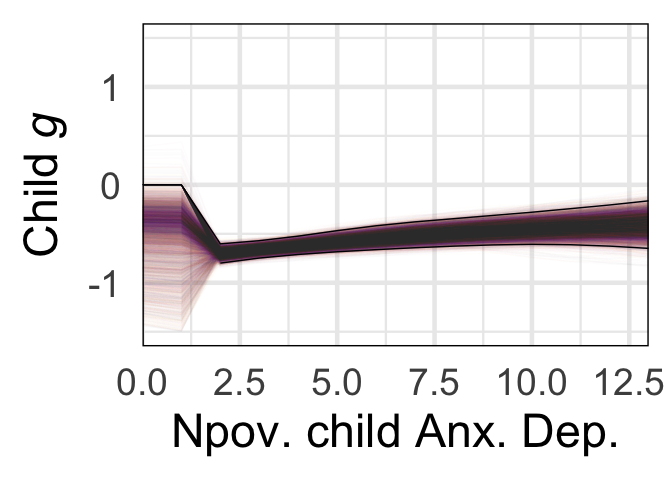<!-- -->

``` r
# both merged
plot<-plot_bootstraps_pnp(pov_Som,npov_Som,13,'child Somatic',MaxSom)
```

    ## Warning: Returning more (or less) than 1 row per `summarise()` group was deprecated in
    ## dplyr 1.1.0.
    ## ℹ Please use `reframe()` instead.
    ## ℹ When switching from `summarise()` to `reframe()`, remember that `reframe()`
    ##   always returns an ungrouped data frame and adjust accordingly.
    ## Call `lifecycle::last_lifecycle_warnings()` to see where this warning was
    ## generated.

    ## Warning: Returning more (or less) than 1 row per `summarise()` group was deprecated in
    ## dplyr 1.1.0.
    ## ℹ Please use `reframe()` instead.
    ## ℹ When switching from `summarise()` to `reframe()`, remember that `reframe()`
    ##   always returns an ungrouped data frame and adjust accordingly.
    ## Call `lifecycle::last_lifecycle_warnings()` to see where this warning was
    ## generated.

    ## Scale for alpha is already present.
    ## Adding another scale for alpha, which will replace the existing scale.
    ## Scale for y is already present.
    ## Adding another scale for y, which will replace the existing scale.

``` r
plot + theme(plot.margin = margin(r = 30,l=5,t=5,b=5))
```

    ## Warning: Removed 50010 rows containing missing values (`geom_line()`).

    ## Warning: Removed 50010 rows containing missing values (`geom_line()`).

<!-- -->

``` r
# poverty
P_derivative_matrix <- matrix(0, nrow = nrow(pov_Som), ncol = ncol(pov_Som) - 1)
# Calculate the derivative for each column
for (i in 1:(ncol(pov_Som) - 1)) {
  # Calculate the differences in x (assuming a constant difference)
  dx <- 1
  # Calculate the differences in y (predicted values)
  dy <- pov_Som[, i + 1] - pov_Som[, i]
  # Calculate the derivatives (slopes)
  derivatives <- dy / dx
  # Store the derivatives in the derivative matrix
  P_derivative_matrix[, i] <- derivatives
}
# calc sig dervs
# get straightfoward of segment where 99% is over 0 or under
positive_counts <- colSums(P_derivative_matrix > 0, na.rm = TRUE)
negative_counts <- colSums(P_derivative_matrix < 0, na.rm = TRUE)
# find where each is 99% or greater
positive_countsSig=positive_counts>9500
negative_countsSig=negative_counts>9500
# make dataframe: 50th percentile of derivatives accompanied by posSig and NegSig vector
data <- apply(P_derivative_matrix, 2, function(x) quantile(x, probs = 0.5))
dervPlotDf<-data.frame(data,positive_countsSig,negative_countsSig)
# if either is sig at 99% plot
dervPlotDf$sig_derivMask=dervPlotDf[,2]+dervPlotDf[,3]>0
# use it to mask calculated derivs
dervPlotDf$sig_deriv=0
dervPlotDf$sig_deriv[dervPlotDf$sig_derivMask]=dervPlotDf$data[dervPlotDf$sig_derivMask]
dervPlotDf$seq=1:(dim(dervPlotDf)[1])
plot<-ggplot(data=dervPlotDf) + geom_raster(aes(x = seq, y = .5, fill = sig_deriv))+
    theme(panel.spacing = unit(-.01,"cm")) +
    scale_fill_gradientn(colors = my_palette(100),limits = c(min(-.1),max(0.1)))+theme_minimal(base_size = 35)+
    xlim(c(0,MaxSom))+xlab('child Somatic')+
    guides(fill=FALSE)+
    theme(axis.title.y = element_blank(),axis.text.y=element_blank())+theme(panel.border = element_rect(color = "black", fill = NA, size = 1))+
    scale_x_continuous(limits = c(0,MaxSom),expand = expansion(mult = c(0, 0)))
```

    ## Scale for x is already present.
    ## Adding another scale for x, which will replace the existing scale.

``` r
plot + theme(plot.margin = margin(r = 30,l=5,t=5,b=5))
```

    ## Warning: Removed 6 rows containing missing values (`geom_raster()`).

<!-- -->

``` r
# nonpoverty
P_derivative_matrix <- matrix(0, nrow = nrow(npov_Som), ncol = ncol(npov_Som) - 1)
# Calculate the derivative for each column
for (i in 1:(ncol(npov_Som) - 1)) {
  # Calculate the differences in x (assuming a constant difference)
  dx <- 1
  # Calculate the differences in y (predicted values)
  dy <- npov_Som[, i + 1] - npov_Som[, i]
  # Calculate the derivatives (slopes)
  derivatives <- dy / dx
  # Store the derivatives in the derivative matrix
  P_derivative_matrix[, i] <- derivatives
}
# calc sig dervs
# get straightfoward of segment where 99% is over 0 or under
positive_counts <- colSums(P_derivative_matrix > 0, na.rm = TRUE)
negative_counts <- colSums(P_derivative_matrix < 0, na.rm = TRUE)
# find where each is 99% or greater
positive_countsSig=positive_counts>9500
negative_countsSig=negative_counts>9500
# make dataframe: 50th percentile of derivatives accompanied by posSig and NegSig vector
data <- apply(P_derivative_matrix, 2, function(x) quantile(x, probs = 0.5))
dervPlotDf<-data.frame(data,positive_countsSig,negative_countsSig)
# if either is sig at 99% plot
dervPlotDf$sig_derivMask=dervPlotDf[,2]+dervPlotDf[,3]>0
# use it to mask calculated derivs
dervPlotDf$sig_deriv=0
dervPlotDf$sig_deriv[dervPlotDf$sig_derivMask]=dervPlotDf$data[dervPlotDf$sig_derivMask]
dervPlotDf$seq=1:(dim(dervPlotDf)[1])
plot<-ggplot(data=dervPlotDf) + geom_raster(aes(x = seq, y = .5, fill = sig_deriv))+
    theme(panel.spacing = unit(-.01,"cm")) +
    scale_fill_gradientn(colors = my_palette(100),limits = c(min(-.1),max(0.1)))+theme_minimal(base_size = 35)+
    xlim(c(0,MaxSom))+xlab('child Somatic')+
    guides(fill=FALSE)+
    theme(axis.title.y = element_blank(),axis.text.y=element_blank())+theme(panel.border = element_rect(color = "black", fill = NA, size = 1))+
    scale_x_continuous(limits = c(0,MaxSom),expand = expansion(mult = c(0, 0)))
```

    ## Scale for x is already present.
    ## Adding another scale for x, which will replace the existing scale.

``` r
plot + theme(plot.margin = margin(r = 30,l=5,t=5,b=5))
```

    ## Warning: Removed 6 rows containing missing values (`geom_raster()`).

<!-- -->

``` r
# Anxious Depression
pov_Anx=pNpFits1[,485:510]
MaxAnx=quantile(as.numeric(masterdf$cbcl_scr_syn_anxdep_r), probs = 0.99)
plot_bootstraps_par(pov_Anx,25,'Pov. child Anx. Dep.',MaxAnx)
```

    ## Warning: Returning more (or less) than 1 row per `summarise()` group was deprecated in
    ## dplyr 1.1.0.
    ## ℹ Please use `reframe()` instead.
    ## ℹ When switching from `summarise()` to `reframe()`, remember that `reframe()`
    ##   always returns an ungrouped data frame and adjust accordingly.
    ## Call `lifecycle::last_lifecycle_warnings()` to see where this warning was
    ## generated.

    ## Warning: Removed 120028 rows containing missing values (`geom_line()`).

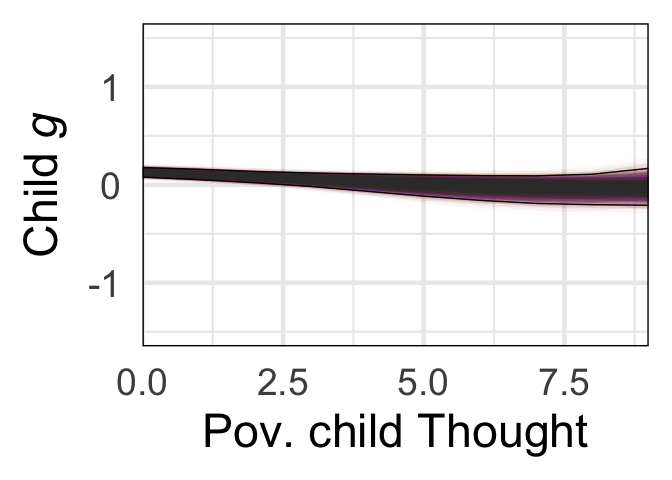<!-- -->

``` r
# nonpoverty child p
npov_Anx=pNpFits1[,511:536]
plot_bootstraps_par(npov_Anx,25,'Npov. child Anx. Dep.',MaxAnx)
```

    ## Warning: Returning more (or less) than 1 row per `summarise()` group was deprecated in
    ## dplyr 1.1.0.
    ## ℹ Please use `reframe()` instead.
    ## ℹ When switching from `summarise()` to `reframe()`, remember that `reframe()`
    ##   always returns an ungrouped data frame and adjust accordingly.
    ## Call `lifecycle::last_lifecycle_warnings()` to see where this warning was
    ## generated.

    ## Warning: Removed 120274 rows containing missing values (`geom_line()`).

<!-- -->

``` r
# both merged
plot<-plot_bootstraps_pnp(pov_Anx,npov_Anx,25,'child Anx. Dep.',MaxAnx)
```

    ## Warning: Returning more (or less) than 1 row per `summarise()` group was deprecated in
    ## dplyr 1.1.0.
    ## ℹ Please use `reframe()` instead.
    ## ℹ When switching from `summarise()` to `reframe()`, remember that `reframe()`
    ##   always returns an ungrouped data frame and adjust accordingly.
    ## Call `lifecycle::last_lifecycle_warnings()` to see where this warning was
    ## generated.

    ## Warning: Returning more (or less) than 1 row per `summarise()` group was deprecated in
    ## dplyr 1.1.0.
    ## ℹ Please use `reframe()` instead.
    ## ℹ When switching from `summarise()` to `reframe()`, remember that `reframe()`
    ##   always returns an ungrouped data frame and adjust accordingly.
    ## Call `lifecycle::last_lifecycle_warnings()` to see where this warning was
    ## generated.

    ## Scale for alpha is already present.
    ## Adding another scale for alpha, which will replace the existing scale.
    ## Scale for y is already present.
    ## Adding another scale for y, which will replace the existing scale.

``` r
plot + theme(plot.margin = margin(r = 30,l=5,t=5,b=5))
```

    ## Warning: Removed 120028 rows containing missing values (`geom_line()`).

    ## Warning: Removed 120274 rows containing missing values (`geom_line()`).

<!-- -->

``` r
# poverty
P_derivative_matrix <- matrix(0, nrow = nrow(pov_Anx), ncol = ncol(pov_Anx) - 1)
# Calculate the derivative for each column
for (i in 1:(ncol(pov_Anx) - 1)) {
  # Calculate the differences in x (assuming a constant difference)
  dx <- 1
  # Calculate the differences in y (predicted values)
  dy <- pov_Anx[, i + 1] - pov_Anx[, i]
  # Calculate the derivatives (slopes)
  derivatives <- dy / dx
  # Store the derivatives in the derivative matrix
  P_derivative_matrix[, i] <- derivatives
}
# calc sig dervs
# get straightfoward of segment where 99% is over 0 or under
positive_counts <- colSums(P_derivative_matrix > 0, na.rm = TRUE)
negative_counts <- colSums(P_derivative_matrix < 0, na.rm = TRUE)
# find where each is 99% or greater
positive_countsSig=positive_counts>9500
negative_countsSig=negative_counts>9500
# make dataframe: 50th percentile of derivatives accompanied by posSig and NegSig vector
data <- apply(P_derivative_matrix, 2, function(x) quantile(x, probs = 0.5))
dervPlotDf<-data.frame(data,positive_countsSig,negative_countsSig)
# if either is sig at 99% plot
dervPlotDf$sig_derivMask=dervPlotDf[,2]+dervPlotDf[,3]>0
# use it to mask calculated derivs
dervPlotDf$sig_deriv=0
dervPlotDf$sig_deriv[dervPlotDf$sig_derivMask]=dervPlotDf$data[dervPlotDf$sig_derivMask]
dervPlotDf$seq=1:(dim(dervPlotDf)[1])
plot<-ggplot(data=dervPlotDf) + geom_raster(aes(x = seq, y = .5, fill = sig_deriv))+
    theme(panel.spacing = unit(-.01,"cm")) +
    scale_fill_gradientn(colors = my_palette(100),limits = c(min(-.1),max(0.1)))+theme_minimal(base_size = 35)+
    xlim(c(0,MaxAnx))+xlab('child Anx. Dep.')+
    guides(fill=FALSE)+
    theme(axis.title.y = element_blank(),axis.text.y=element_blank())+theme(panel.border = element_rect(color = "black", fill = NA, size = 1))+
    scale_x_continuous(limits = c(0,MaxAnx),expand = expansion(mult = c(0, 0)))
```

    ## Scale for x is already present.
    ## Adding another scale for x, which will replace the existing scale.

``` r
plot + theme(plot.margin = margin(r = 30,l=5,t=5,b=5))
```

    ## Warning: Removed 13 rows containing missing values (`geom_raster()`).

<!-- -->

``` r
# nonpoverty
P_derivative_matrix <- matrix(0, nrow = nrow(npov_Anx), ncol = ncol(npov_Anx) - 1)
# Calculate the derivative for each column
for (i in 1:(ncol(npov_Anx) - 1)) {
  # Calculate the differences in x (assuming a constant difference)
  dx <- 1
  # Calculate the differences in y (predicted values)
  dy <- npov_Anx[, i + 1] - npov_Anx[, i]
  # Calculate the derivatives (slopes)
  derivatives <- dy / dx
  # Store the derivatives in the derivative matrix
  P_derivative_matrix[, i] <- derivatives
}
# calc sig dervs
# get straightfoward of segment where 99% is over 0 or under
positive_counts <- colSums(P_derivative_matrix > 0, na.rm = TRUE)
negative_counts <- colSums(P_derivative_matrix < 0, na.rm = TRUE)
# find where each is 99% or greater
positive_countsSig=positive_counts>9500
negative_countsSig=negative_counts>9500
# make dataframe: 50th percentile of derivatives accompanied by posSig and NegSig vector
data <- apply(P_derivative_matrix, 2, function(x) quantile(x, probs = 0.5))
dervPlotDf<-data.frame(data,positive_countsSig,negative_countsSig)
# if either is sig at 99% plot
dervPlotDf$sig_derivMask=dervPlotDf[,2]+dervPlotDf[,3]>0
# use it to mask calculated derivs
dervPlotDf$sig_deriv=0
dervPlotDf$sig_deriv[dervPlotDf$sig_derivMask]=dervPlotDf$data[dervPlotDf$sig_derivMask]
dervPlotDf$seq=1:(dim(dervPlotDf)[1])
plot<-ggplot(data=dervPlotDf) + geom_raster(aes(x = seq, y = .5, fill = sig_deriv))+
    theme(panel.spacing = unit(-.01,"cm")) +
    scale_fill_gradientn(colors = my_palette(100),limits = c(min(-.1),max(0.1)))+theme_minimal(base_size = 35)+
    xlim(c(0,MaxAnx))+xlab('child Anx. Dep.')+
    guides(fill=FALSE)+
    theme(axis.title.y = element_blank(),axis.text.y=element_blank())+theme(panel.border = element_rect(color = "black", fill = NA, size = 1))+
    scale_x_continuous(limits = c(0,MaxAnx),expand = expansion(mult = c(0, 0)))
```

    ## Scale for x is already present.
    ## Adding another scale for x, which will replace the existing scale.

``` r
plot + theme(plot.margin = margin(r = 30,l=5,t=5,b=5))
```

    ## Warning: Removed 13 rows containing missing values (`geom_raster()`).

<!-- -->

``` r
# Thought
pov_Tho=pNpFits1[,537:555]
MaxTho=quantile(as.numeric(masterdf$cbcl_scr_syn_thought_r), probs = 0.99)
plot_bootstraps_par(pov_Tho,18,'Pov. child Thought',MaxTho)
```

    ## Warning: Returning more (or less) than 1 row per `summarise()` group was deprecated in
    ## dplyr 1.1.0.
    ## ℹ Please use `reframe()` instead.
    ## ℹ When switching from `summarise()` to `reframe()`, remember that `reframe()`
    ##   always returns an ungrouped data frame and adjust accordingly.
    ## Call `lifecycle::last_lifecycle_warnings()` to see where this warning was
    ## generated.

    ## Warning: Removed 90018 rows containing missing values (`geom_line()`).

<!-- -->

``` r
# nonpoverty child p
npov_Tho=pNpFits1[,556:574]
plot_bootstraps_par(npov_Tho,18,'Npov. child Thought',MaxTho)
```

    ## Warning: Returning more (or less) than 1 row per `summarise()` group was deprecated in
    ## dplyr 1.1.0.
    ## ℹ Please use `reframe()` instead.
    ## ℹ When switching from `summarise()` to `reframe()`, remember that `reframe()`
    ##   always returns an ungrouped data frame and adjust accordingly.
    ## Removed 90018 rows containing missing values (`geom_line()`).
    ## Call `lifecycle::last_lifecycle_warnings()` to see where this warning was
    ## generated.

<!-- -->

``` r
# both merged
plot<-plot_bootstraps_pnp(pov_Tho,npov_Tho,18,'child Thought',MaxTho)
```

    ## Warning: Returning more (or less) than 1 row per `summarise()` group was deprecated in
    ## dplyr 1.1.0.
    ## ℹ Please use `reframe()` instead.
    ## ℹ When switching from `summarise()` to `reframe()`, remember that `reframe()`
    ##   always returns an ungrouped data frame and adjust accordingly.
    ## Call `lifecycle::last_lifecycle_warnings()` to see where this warning was
    ## generated.

    ## Warning: Returning more (or less) than 1 row per `summarise()` group was deprecated in
    ## dplyr 1.1.0.
    ## ℹ Please use `reframe()` instead.
    ## ℹ When switching from `summarise()` to `reframe()`, remember that `reframe()`
    ##   always returns an ungrouped data frame and adjust accordingly.
    ## Call `lifecycle::last_lifecycle_warnings()` to see where this warning was
    ## generated.

    ## Scale for alpha is already present.
    ## Adding another scale for alpha, which will replace the existing scale.
    ## Scale for y is already present.
    ## Adding another scale for y, which will replace the existing scale.

``` r
plot + theme(plot.margin = margin(r = 30,l=15,t=5,b=5))
```

    ## Warning: Removed 90018 rows containing missing values (`geom_line()`).

    ## Warning: Removed 90018 rows containing missing values (`geom_line()`).

<!-- -->

``` r
# poverty
P_derivative_matrix <- matrix(0, nrow = nrow(pov_Tho), ncol = ncol(pov_Tho) - 1)
# Calculate the derivative for each column
for (i in 1:(ncol(pov_Tho) - 1)) {
  # Calculate the differences in x (assuming a constant difference)
  dx <- 1
  # Calculate the differences in y (predicted values)
  dy <- pov_Tho[, i + 1] - pov_Tho[, i]
  # Calculate the derivatives (slopes)
  derivatives <- dy / dx
  # Store the derivatives in the derivative matrix
  P_derivative_matrix[, i] <- derivatives
}
# calc sig dervs
# get straightfoward of segment where 99% is over 0 or under
positive_counts <- colSums(P_derivative_matrix > 0, na.rm = TRUE)
negative_counts <- colSums(P_derivative_matrix < 0, na.rm = TRUE)
# find where each is 99% or greater
positive_countsSig=positive_counts>9500
negative_countsSig=negative_counts>9500
# make dataframe: 50th percentile of derivatives accompanied by posSig and NegSig vector
data <- apply(P_derivative_matrix, 2, function(x) quantile(x, probs = 0.5))
dervPlotDf<-data.frame(data,positive_countsSig,negative_countsSig)
# if either is sig at 99% plot
dervPlotDf$sig_derivMask=dervPlotDf[,2]+dervPlotDf[,3]>0
# use it to mask calculated derivs
dervPlotDf$sig_deriv=0
dervPlotDf$sig_deriv[dervPlotDf$sig_derivMask]=dervPlotDf$data[dervPlotDf$sig_derivMask]
dervPlotDf$seq=1:(dim(dervPlotDf)[1])
plot<-ggplot(data=dervPlotDf) + geom_raster(aes(x = seq, y = .5, fill = sig_deriv))+
    theme(panel.spacing = unit(-.01,"cm")) +
    scale_fill_gradientn(colors = my_palette(100),limits = c(min(-.1),max(0.1)))+theme_minimal(base_size = 35)+
    xlim(c(0,MaxTho))+xlab('child Thought')+
    guides(fill=FALSE)+
    theme(axis.title.y = element_blank(),axis.text.y=element_blank())+theme(panel.border = element_rect(color = "black", fill = NA, size = 1))+
    scale_x_continuous(limits = c(0,MaxTho),expand = expansion(mult = c(0, 0)))
```

    ## Scale for x is already present.
    ## Adding another scale for x, which will replace the existing scale.

``` r
plot + theme(plot.margin = margin(r = 30,l=15,t=5,b=5))
```

    ## Warning: Removed 10 rows containing missing values (`geom_raster()`).

<!-- -->

``` r
# nonpoverty
P_derivative_matrix <- matrix(0, nrow = nrow(npov_Tho), ncol = ncol(npov_Tho) - 1)
# Calculate the derivative for each column
for (i in 1:(ncol(npov_Tho) - 1)) {
  # Calculate the differences in x (assuming a constant difference)
  dx <- 1
  # Calculate the differences in y (predicted values)
  dy <- npov_Tho[, i + 1] - npov_Tho[, i]
  # Calculate the derivatives (slopes)
  derivatives <- dy / dx
  # Store the derivatives in the derivative matrix
  P_derivative_matrix[, i] <- derivatives
}
# calc sig dervs
# get straightfoward of segment where 99% is over 0 or under
positive_counts <- colSums(P_derivative_matrix > 0, na.rm = TRUE)
negative_counts <- colSums(P_derivative_matrix < 0, na.rm = TRUE)
# find where each is 99% or greater
positive_countsSig=positive_counts>9500
negative_countsSig=negative_counts>9500
# make dataframe: 50th percentile of derivatives accompanied by posSig and NegSig vector
data <- apply(P_derivative_matrix, 2, function(x) quantile(x, probs = 0.5))
dervPlotDf<-data.frame(data,positive_countsSig,negative_countsSig)
# if either is sig at 99% plot
dervPlotDf$sig_derivMask=dervPlotDf[,2]+dervPlotDf[,3]>0
# use it to mask calculated derivs
dervPlotDf$sig_deriv=0
dervPlotDf$sig_deriv[dervPlotDf$sig_derivMask]=dervPlotDf$data[dervPlotDf$sig_derivMask]
dervPlotDf$seq=1:(dim(dervPlotDf)[1])
plot<-ggplot(data=dervPlotDf) + geom_raster(aes(x = seq, y = .5, fill = sig_deriv))+
    theme(panel.spacing = unit(-.01,"cm")) +
    scale_fill_gradientn(colors = my_palette(100),limits = c(min(-.1),max(0.1)))+theme_minimal(base_size = 35)+
    xlim(c(0,MaxTho))+xlab('child Thought')+
    guides(fill=FALSE)+
    theme(axis.title.y = element_blank(),axis.text.y=element_blank())+theme(panel.border = element_rect(color = "black", fill = NA, size = 1))+
    scale_x_continuous(limits = c(0,MaxTho),expand = expansion(mult = c(0, 0)))
```

    ## Scale for x is already present.
    ## Adding another scale for x, which will replace the existing scale.

``` r
plot + theme(plot.margin = margin(r = 30,l=15,t=5,b=5))
```

    ## Warning: Removed 10 rows containing missing values (`geom_raster()`).

<!-- -->

``` r
# Withdrawn Depression
pov_Wit=pNpFits1[,575:591]
MaxWit=quantile(as.numeric(masterdf$cbcl_scr_syn_withdep_r), probs = 0.99)
plot_bootstraps_par(pov_Wit,16,'Pov. With. Depr.',MaxWit)
```

    ## Warning: Returning more (or less) than 1 row per `summarise()` group was deprecated in
    ## dplyr 1.1.0.
    ## ℹ Please use `reframe()` instead.
    ## ℹ When switching from `summarise()` to `reframe()`, remember that `reframe()`
    ##   always returns an ungrouped data frame and adjust accordingly.
    ## Call `lifecycle::last_lifecycle_warnings()` to see where this warning was
    ## generated.

    ## Warning: Removed 80065 rows containing missing values (`geom_line()`).

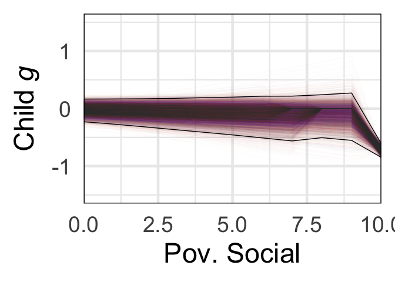<!-- -->

``` r
# nonpoverty child p
npov_Wit=pNpFits1[,592:608]
plot_bootstraps_par(npov_Wit,16,'Npov. child With. Depr.',MaxWit)
```

    ## Warning: Returning more (or less) than 1 row per `summarise()` group was deprecated in
    ## dplyr 1.1.0.
    ## ℹ Please use `reframe()` instead.
    ## ℹ When switching from `summarise()` to `reframe()`, remember that `reframe()`
    ##   always returns an ungrouped data frame and adjust accordingly.
    ## Call `lifecycle::last_lifecycle_warnings()` to see where this warning was
    ## generated.

    ## Warning: Removed 80016 rows containing missing values (`geom_line()`).

<!-- -->

``` r
# both merged
plot<-plot_bootstraps_pnp(pov_Wit,npov_Wit,16,'child With. Depr.',MaxWit)
```

    ## Warning: Returning more (or less) than 1 row per `summarise()` group was deprecated in
    ## dplyr 1.1.0.
    ## ℹ Please use `reframe()` instead.
    ## ℹ When switching from `summarise()` to `reframe()`, remember that `reframe()`
    ##   always returns an ungrouped data frame and adjust accordingly.
    ## Call `lifecycle::last_lifecycle_warnings()` to see where this warning was
    ## generated.

    ## Warning: Returning more (or less) than 1 row per `summarise()` group was deprecated in
    ## dplyr 1.1.0.
    ## ℹ Please use `reframe()` instead.
    ## ℹ When switching from `summarise()` to `reframe()`, remember that `reframe()`
    ##   always returns an ungrouped data frame and adjust accordingly.
    ## Call `lifecycle::last_lifecycle_warnings()` to see where this warning was
    ## generated.

    ## Scale for alpha is already present.
    ## Adding another scale for alpha, which will replace the existing scale.
    ## Scale for y is already present.
    ## Adding another scale for y, which will replace the existing scale.

``` r
plot + theme(plot.margin = margin(r = 30,l=15,t=5,b=5))
```

    ## Warning: Removed 80065 rows containing missing values (`geom_line()`).

    ## Warning: Removed 80016 rows containing missing values (`geom_line()`).

<!-- -->

``` r
# poverty
P_derivative_matrix <- matrix(0, nrow = nrow(pov_Wit), ncol = ncol(pov_Wit) - 1)
# Calculate the derivative for each column
for (i in 1:(ncol(pov_Wit) - 1)) {
  # Calculate the differences in x (assuming a constant difference)
  dx <- 1
  # Calculate the differences in y (predicted values)
  dy <- pov_Wit[, i + 1] - pov_Wit[, i]
  # Calculate the derivatives (slopes)
  derivatives <- dy / dx
  # Store the derivatives in the derivative matrix
  P_derivative_matrix[, i] <- derivatives
}
# calc sig dervs
# get straightfoward of segment where 99% is over 0 or under
positive_counts <- colSums(P_derivative_matrix > 0, na.rm = TRUE)
negative_counts <- colSums(P_derivative_matrix < 0, na.rm = TRUE)
# find where each is 99% or greater
positive_countsSig=positive_counts>9500
negative_countsSig=negative_counts>9500
# make dataframe: 50th percentile of derivatives accompanied by posSig and NegSig vector
data <- apply(P_derivative_matrix, 2, function(x) quantile(x, probs = 0.5))
dervPlotDf<-data.frame(data,positive_countsSig,negative_countsSig)
# if either is sig at 99% plot
dervPlotDf$sig_derivMask=dervPlotDf[,2]+dervPlotDf[,3]>0
# use it to mask calculated derivs
dervPlotDf$sig_deriv=0
dervPlotDf$sig_deriv[dervPlotDf$sig_derivMask]=dervPlotDf$data[dervPlotDf$sig_derivMask]
dervPlotDf$seq=1:(dim(dervPlotDf)[1])
plot<-ggplot(data=dervPlotDf) + geom_raster(aes(x = seq, y = .5, fill = sig_deriv))+
    theme(panel.spacing = unit(-.01,"cm")) +
    scale_fill_gradientn(colors = my_palette(100),limits = c(min(-.1),max(0.1)))+theme_minimal(base_size = 35)+
    xlim(c(0,MaxWit))+xlab('child Wit. Depr.')+
    guides(fill=FALSE)+
    theme(axis.title.y = element_blank(),axis.text.y=element_blank())+theme(panel.border = element_rect(color = "black", fill = NA, size = 1))+
    scale_x_continuous(limits = c(0,MaxWit),expand = expansion(mult = c(0, 0)))
```

    ## Scale for x is already present.
    ## Adding another scale for x, which will replace the existing scale.

``` r
plot + theme(plot.margin = margin(r = 30,l=15,t=5,b=5))
```

    ## Warning: Removed 9 rows containing missing values (`geom_raster()`).

<!-- -->

``` r
# nonpoverty
P_derivative_matrix <- matrix(0, nrow = nrow(npov_Wit), ncol = ncol(npov_Wit) - 1)
# Calculate the derivative for each column
for (i in 1:(ncol(npov_Wit) - 1)) {
  # Calculate the differences in x (assuming a constant difference)
  dx <- 1
  # Calculate the differences in y (predicted values)
  dy <- npov_Wit[, i + 1] - npov_Wit[, i]
  # Calculate the derivatives (slopes)
  derivatives <- dy / dx
  # Store the derivatives in the derivative matrix
  P_derivative_matrix[, i] <- derivatives
}
# calc sig dervs
# get straightfoward of segment where 99% is over 0 or under
positive_counts <- colSums(P_derivative_matrix > 0, na.rm = TRUE)
negative_counts <- colSums(P_derivative_matrix < 0, na.rm = TRUE)
# find where each is 99% or greater
positive_countsSig=positive_counts>9500
negative_countsSig=negative_counts>9500
# make dataframe: 50th percentile of derivatives accompanied by posSig and NegSig vector
data <- apply(P_derivative_matrix, 2, function(x) quantile(x, probs = 0.5))
dervPlotDf<-data.frame(data,positive_countsSig,negative_countsSig)
# if either is sig at 99% plot
dervPlotDf$sig_derivMask=dervPlotDf[,2]+dervPlotDf[,3]>0
# use it to mask calculated derivs
dervPlotDf$sig_deriv=0
dervPlotDf$sig_deriv[dervPlotDf$sig_derivMask]=dervPlotDf$data[dervPlotDf$sig_derivMask]
dervPlotDf$seq=1:(dim(dervPlotDf)[1])
plot<-ggplot(data=dervPlotDf) + geom_raster(aes(x = seq, y = .5, fill = sig_deriv))+
    theme(panel.spacing = unit(-.01,"cm")) +
    scale_fill_gradientn(colors = my_palette(100),limits = c(min(-.1),max(0.1)))+theme_minimal(base_size = 35)+
    xlim(c(0,MaxWit))+xlab('child Wit. Dep.')+
    guides(fill=FALSE)+
    theme(axis.title.y = element_blank(),axis.text.y=element_blank())+theme(panel.border = element_rect(color = "black", fill = NA, size = 1))+
    scale_x_continuous(limits = c(0,MaxWit),expand = expansion(mult = c(0, 0)))
```

    ## Scale for x is already present.
    ## Adding another scale for x, which will replace the existing scale.

``` r
plot + theme(plot.margin = margin(r = 30,l=15,t=5,b=5))
```

    ## Warning: Removed 9 rows containing missing values (`geom_raster()`).

<!-- -->

``` r
# Social
pov_Soc=pNpFits1[,609:626]
MaxSoc=quantile(as.numeric(masterdf$cbcl_scr_syn_social_r), probs = 0.99)
plot_bootstraps_par(pov_Soc,17,'Pov. Social',MaxSoc)
```

    ## Warning: Returning more (or less) than 1 row per `summarise()` group was deprecated in
    ## dplyr 1.1.0.
    ## ℹ Please use `reframe()` instead.
    ## ℹ When switching from `summarise()` to `reframe()`, remember that `reframe()`
    ##   always returns an ungrouped data frame and adjust accordingly.
    ## Call `lifecycle::last_lifecycle_warnings()` to see where this warning was
    ## generated.

    ## Warning: Removed 70014 rows containing missing values (`geom_line()`).

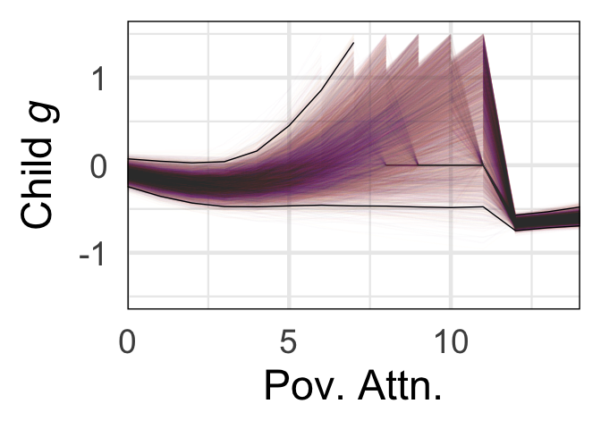<!-- -->

``` r
# nonpoverty child p
npov_Soc=pNpFits1[,627:644]
plot_bootstraps_par(npov_Soc,17,'Npov. Social',MaxSoc)
```

    ## Warning: Returning more (or less) than 1 row per `summarise()` group was deprecated in
    ## dplyr 1.1.0.
    ## ℹ Please use `reframe()` instead.
    ## ℹ When switching from `summarise()` to `reframe()`, remember that `reframe()`
    ##   always returns an ungrouped data frame and adjust accordingly.
    ## Call `lifecycle::last_lifecycle_warnings()` to see where this warning was
    ## generated.

    ## Warning: Removed 70716 rows containing missing values (`geom_line()`).

<!-- -->

``` r
# both merged
plot<-plot_bootstraps_pnp(pov_Soc,npov_Soc,17,'child Social',MaxSoc)
```

    ## Warning: Returning more (or less) than 1 row per `summarise()` group was deprecated in
    ## dplyr 1.1.0.
    ## ℹ Please use `reframe()` instead.
    ## ℹ When switching from `summarise()` to `reframe()`, remember that `reframe()`
    ##   always returns an ungrouped data frame and adjust accordingly.
    ## Call `lifecycle::last_lifecycle_warnings()` to see where this warning was
    ## generated.

    ## Warning: Returning more (or less) than 1 row per `summarise()` group was deprecated in
    ## dplyr 1.1.0.
    ## ℹ Please use `reframe()` instead.
    ## ℹ When switching from `summarise()` to `reframe()`, remember that `reframe()`
    ##   always returns an ungrouped data frame and adjust accordingly.
    ## Call `lifecycle::last_lifecycle_warnings()` to see where this warning was
    ## generated.

    ## Scale for alpha is already present.
    ## Adding another scale for alpha, which will replace the existing scale.
    ## Scale for y is already present.
    ## Adding another scale for y, which will replace the existing scale.

``` r
plot + theme(plot.margin = margin(r = 30,l=15,t=5,b=5))
```

    ## Warning: Removed 70014 rows containing missing values (`geom_line()`).

    ## Warning: Removed 70716 rows containing missing values (`geom_line()`).

<!-- -->

``` r
# poverty
P_derivative_matrix <- matrix(0, nrow = nrow(pov_Soc), ncol = ncol(pov_Soc) - 1)
# Calculate the derivative for each column
for (i in 1:(ncol(pov_Soc) - 1)) {
  # Calculate the differences in x (assuming a constant difference)
  dx <- 1
  # Calculate the differences in y (predicted values)
  dy <- pov_Soc[, i + 1] - pov_Soc[, i]
  # Calculate the derivatives (slopes)
  derivatives <- dy / dx
  # Store the derivatives in the derivative matrix
  P_derivative_matrix[, i] <- derivatives
}
# calc sig dervs
# get straightfoward of segment where 99% is over 0 or under
positive_counts <- colSums(P_derivative_matrix > 0, na.rm = TRUE)
negative_counts <- colSums(P_derivative_matrix < 0, na.rm = TRUE)
# find where each is 99% or greater
positive_countsSig=positive_counts>9500
negative_countsSig=negative_counts>9500
# make dataframe: 50th percentile of derivatives accompanied by posSig and NegSig vector
data <- apply(P_derivative_matrix, 2, function(x) quantile(x, probs = 0.5))
dervPlotDf<-data.frame(data,positive_countsSig,negative_countsSig)
# if either is sig at 99% plot
dervPlotDf$sig_derivMask=dervPlotDf[,2]+dervPlotDf[,3]>0
# use it to mask calculated derivs
dervPlotDf$sig_deriv=0
dervPlotDf$sig_deriv[dervPlotDf$sig_derivMask]=dervPlotDf$data[dervPlotDf$sig_derivMask]
dervPlotDf$seq=1:(dim(dervPlotDf)[1])
plot<-ggplot(data=dervPlotDf) + geom_raster(aes(x = seq, y = .5, fill = sig_deriv))+
    theme(panel.spacing = unit(-.01,"cm")) +
    scale_fill_gradientn(colors = my_palette(100),limits = c(min(-.1),max(0.1)))+theme_minimal(base_size = 35)+
    xlim(c(0,MaxSoc))+xlab('child Social')+
    guides(fill=FALSE)+
    theme(axis.title.y = element_blank(),axis.text.y=element_blank())+theme(panel.border = element_rect(color = "black", fill = NA, size = 1))+
    scale_x_continuous(limits = c(0,MaxSoc),expand = expansion(mult = c(0, 0)))
```

    ## Scale for x is already present.
    ## Adding another scale for x, which will replace the existing scale.

``` r
plot + theme(plot.margin = margin(r = 30,l=15,t=5,b=5))
```

    ## Warning: Removed 8 rows containing missing values (`geom_raster()`).

<!-- -->

``` r
# nonpoverty
P_derivative_matrix <- matrix(0, nrow = nrow(npov_Soc), ncol = ncol(npov_Soc) - 1)
# Calculate the derivative for each column
for (i in 1:(ncol(npov_Soc) - 1)) {
  # Calculate the differences in x (assuming a constant difference)
  dx <- 1
  # Calculate the differences in y (predicted values)
  dy <- npov_Soc[, i + 1] - npov_Soc[, i]
  # Calculate the derivatives (slopes)
  derivatives <- dy / dx
  # Store the derivatives in the derivative matrix
  P_derivative_matrix[, i] <- derivatives
}
# calc sig dervs
# get straightfoward of segment where 99% is over 0 or under
positive_counts <- colSums(P_derivative_matrix > 0, na.rm = TRUE)
negative_counts <- colSums(P_derivative_matrix < 0, na.rm = TRUE)
# find where each is 99% or greater
positive_countsSig=positive_counts>9500
negative_countsSig=negative_counts>9500
# make dataframe: 50th percentile of derivatives accompanied by posSig and NegSig vector
data <- apply(P_derivative_matrix, 2, function(x) quantile(x, probs = 0.5))
dervPlotDf<-data.frame(data,positive_countsSig,negative_countsSig)
# if either is sig at 99% plot
dervPlotDf$sig_derivMask=dervPlotDf[,2]+dervPlotDf[,3]>0
# use it to mask calculated derivs
dervPlotDf$sig_deriv=0
dervPlotDf$sig_deriv[dervPlotDf$sig_derivMask]=dervPlotDf$data[dervPlotDf$sig_derivMask]
dervPlotDf$seq=1:(dim(dervPlotDf)[1])
plot<-ggplot(data=dervPlotDf) + geom_raster(aes(x = seq, y = .5, fill = sig_deriv))+
    theme(panel.spacing = unit(-.01,"cm")) +
    scale_fill_gradientn(colors = my_palette(100),limits = c(min(-.1),max(0.1)))+theme_minimal(base_size = 35)+
    xlim(c(0,MaxSoc))+xlab('child Social')+
    guides(fill=FALSE)+
    theme(axis.title.y = element_blank(),axis.text.y=element_blank())+theme(panel.border = element_rect(color = "black", fill = NA, size = 1))+
    scale_x_continuous(limits = c(0,MaxSoc),expand = expansion(mult = c(0, 0)))
```

    ## Scale for x is already present.
    ## Adding another scale for x, which will replace the existing scale.

``` r
plot + theme(plot.margin = margin(r = 30,l=15,t=5,b=5))
```

    ## Warning: Removed 8 rows containing missing values (`geom_raster()`).

<!-- -->

``` r
# attention
# and also note increased y-axis
pov_Att=pNpFits1[,645:664]
MaxAtt=quantile(as.numeric(masterdf$cbcl_scr_syn_attention_r), probs = 0.99)
plot_bootstraps_par(pov_Att,19,'Pov. Attn.',MaxAtt)
```

    ## Warning: Returning more (or less) than 1 row per `summarise()` group was deprecated in
    ## dplyr 1.1.0.
    ## ℹ Please use `reframe()` instead.
    ## ℹ When switching from `summarise()` to `reframe()`, remember that `reframe()`
    ##   always returns an ungrouped data frame and adjust accordingly.
    ## Call `lifecycle::last_lifecycle_warnings()` to see where this warning was
    ## generated.

    ## Warning: Removed 50010 rows containing missing values (`geom_line()`).

<!-- -->

``` r
# nonpoverty child p
npov_Att=pNpFits1[,665:684]
plot_bootstraps_par(npov_Att,19,'Npov. Attn.',MaxAtt)
```

    ## Warning: Returning more (or less) than 1 row per `summarise()` group was deprecated in
    ## dplyr 1.1.0.
    ## ℹ Please use `reframe()` instead.
    ## ℹ When switching from `summarise()` to `reframe()`, remember that `reframe()`
    ##   always returns an ungrouped data frame and adjust accordingly.
    ## Removed 50010 rows containing missing values (`geom_line()`).
    ## Call `lifecycle::last_lifecycle_warnings()` to see where this warning was
    ## generated.

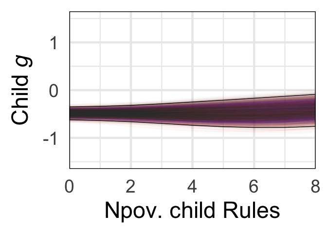<!-- -->

``` r
# both merged
plot<-plot_bootstraps_pnp(pov_Att,npov_Att,19,'child Attention',MaxAtt)
```

    ## Warning: Returning more (or less) than 1 row per `summarise()` group was deprecated in
    ## dplyr 1.1.0.
    ## ℹ Please use `reframe()` instead.
    ## ℹ When switching from `summarise()` to `reframe()`, remember that `reframe()`
    ##   always returns an ungrouped data frame and adjust accordingly.
    ## Call `lifecycle::last_lifecycle_warnings()` to see where this warning was
    ## generated.

    ## Warning: Returning more (or less) than 1 row per `summarise()` group was deprecated in
    ## dplyr 1.1.0.
    ## ℹ Please use `reframe()` instead.
    ## ℹ When switching from `summarise()` to `reframe()`, remember that `reframe()`
    ##   always returns an ungrouped data frame and adjust accordingly.
    ## Call `lifecycle::last_lifecycle_warnings()` to see where this warning was
    ## generated.

    ## Scale for alpha is already present.
    ## Adding another scale for alpha, which will replace the existing scale.
    ## Scale for y is already present.
    ## Adding another scale for y, which will replace the existing scale.

``` r
plot + theme(plot.margin = margin(r = 30,l=5,t=5,b=5))
```

    ## Warning: Removed 50010 rows containing missing values (`geom_line()`).

    ## Warning: Removed 50010 rows containing missing values (`geom_line()`).

<!-- -->

``` r
# poverty
P_derivative_matrix <- matrix(0, nrow = nrow(pov_Att), ncol = ncol(pov_Att) - 1)
# Calculate the derivative for each column
for (i in 1:(ncol(pov_Att) - 1)) {
  # Calculate the differences in x (assuming a constant difference)
  dx <- 1
  # Calculate the differences in y (predicted values)
  dy <- pov_Att[, i + 1] - pov_Att[, i]
  # Calculate the derivatives (slopes)
  derivatives <- dy / dx
  # Store the derivatives in the derivative matrix
  P_derivative_matrix[, i] <- derivatives
}
# calc sig dervs
# get straightfoward of segment where 99% is over 0 or under
positive_counts <- colSums(P_derivative_matrix > 0, na.rm = TRUE)
negative_counts <- colSums(P_derivative_matrix < 0, na.rm = TRUE)
# find where each is 99% or greater
positive_countsSig=positive_counts>9500
negative_countsSig=negative_counts>9500
# make dataframe: 50th percentile of derivatives accompanied by posSig and NegSig vector
data <- apply(P_derivative_matrix, 2, function(x) quantile(x, probs = 0.5))
dervPlotDf<-data.frame(data,positive_countsSig,negative_countsSig)
# if either is sig at 99% plot
dervPlotDf$sig_derivMask=dervPlotDf[,2]+dervPlotDf[,3]>0
# use it to mask calculated derivs
dervPlotDf$sig_deriv=0
dervPlotDf$sig_deriv[dervPlotDf$sig_derivMask]=dervPlotDf$data[dervPlotDf$sig_derivMask]
dervPlotDf$seq=1:(dim(dervPlotDf)[1])
plot<-ggplot(data=dervPlotDf) + geom_raster(aes(x = seq, y = .5, fill = sig_deriv))+
    theme(panel.spacing = unit(-.01,"cm")) +
    scale_fill_gradientn(colors = my_palette(100),limits = c(min(-.1),max(0.1)))+theme_minimal(base_size = 35)+
    xlim(c(0,MaxAtt))+xlab('child Attn.')+
    guides(fill=FALSE)+
    theme(axis.title.y = element_blank(),axis.text.y=element_blank())+theme(panel.border = element_rect(color = "black", fill = NA, size = 1))+
    scale_x_continuous(limits = c(0,MaxAtt),expand = expansion(mult = c(0, 0)))
```

    ## Scale for x is already present.
    ## Adding another scale for x, which will replace the existing scale.

``` r
plot + theme(plot.margin = margin(r = 30,l=5,t=5,b=5))
```

    ## Warning: Removed 6 rows containing missing values (`geom_raster()`).

<!-- -->

``` r
# nonpoverty
P_derivative_matrix <- matrix(0, nrow = nrow(npov_Att), ncol = ncol(npov_Att) - 1)
# Calculate the derivative for each column
for (i in 1:(ncol(npov_Att) - 1)) {
  # Calculate the differences in x (assuming a constant difference)
  dx <- 1
  # Calculate the differences in y (predicted values)
  dy <- npov_Att[, i + 1] - npov_Att[, i]
  # Calculate the derivatives (slopes)
  derivatives <- dy / dx
  # Store the derivatives in the derivative matrix
  P_derivative_matrix[, i] <- derivatives
}
# calc sig dervs
# get straightfoward of segment where 99% is over 0 or under
positive_counts <- colSums(P_derivative_matrix > 0, na.rm = TRUE)
negative_counts <- colSums(P_derivative_matrix < 0, na.rm = TRUE)
# find where each is 99% or greater
positive_countsSig=positive_counts>9500
negative_countsSig=negative_counts>9500
# make dataframe: 50th percentile of derivatives accompanied by posSig and NegSig vector
data <- apply(P_derivative_matrix, 2, function(x) quantile(x, probs = 0.5))
dervPlotDf<-data.frame(data,positive_countsSig,negative_countsSig)
# if either is sig at 99% plot
dervPlotDf$sig_derivMask=dervPlotDf[,2]+dervPlotDf[,3]>0
# use it to mask calculated derivs
dervPlotDf$sig_deriv=0
dervPlotDf$sig_deriv[dervPlotDf$sig_derivMask]=dervPlotDf$data[dervPlotDf$sig_derivMask]
dervPlotDf$seq=1:(dim(dervPlotDf)[1])
plot<-ggplot(data=dervPlotDf) + geom_raster(aes(x = seq, y = .5, fill = sig_deriv))+
    theme(panel.spacing = unit(-.01,"cm")) +
    scale_fill_gradientn(colors = my_palette(100),limits = c(min(-.1),max(0.1)))+theme_minimal(base_size = 35)+
    xlim(c(0,MaxAtt))+xlab('child Attn.')+
    guides(fill=FALSE)+
    theme(axis.title.y = element_blank(),axis.text.y=element_blank())+theme(panel.border = element_rect(color = "black", fill = NA, size = 1))+
    scale_x_continuous(limits = c(0,MaxAtt),expand = expansion(mult = c(0, 0)))
```

    ## Scale for x is already present.
    ## Adding another scale for x, which will replace the existing scale.

``` r
plot + theme(plot.margin = margin(r = 30,l=5,t=5,b=5))
```

    ## Warning: Removed 6 rows containing missing values (`geom_raster()`).

<!-- -->

``` r
# Rule breaking
pov_RB=pNpFits1[,685:703]
MaxRB=quantile(as.numeric(masterdf$cbcl_scr_syn_rulebreak_r), probs = 0.99)
plot_bootstraps_par(pov_RB,18,'Pov. Rules',MaxRB)
```

    ## Warning: Returning more (or less) than 1 row per `summarise()` group was deprecated in
    ## dplyr 1.1.0.
    ## ℹ Please use `reframe()` instead.
    ## ℹ When switching from `summarise()` to `reframe()`, remember that `reframe()`
    ##   always returns an ungrouped data frame and adjust accordingly.
    ## Call `lifecycle::last_lifecycle_warnings()` to see where this warning was
    ## generated.

    ## Warning: Removed 100068 rows containing missing values (`geom_line()`).

<!-- -->

``` r
# nonpoverty child p
npov_RB=pNpFits1[,704:722]
plot_bootstraps_par(npov_RB,18,'Npov. child Rules',MaxRB)
```

    ## Warning: Returning more (or less) than 1 row per `summarise()` group was deprecated in
    ## dplyr 1.1.0.
    ## ℹ Please use `reframe()` instead.
    ## ℹ When switching from `summarise()` to `reframe()`, remember that `reframe()`
    ##   always returns an ungrouped data frame and adjust accordingly.
    ## Call `lifecycle::last_lifecycle_warnings()` to see where this warning was
    ## generated.

    ## Warning: Removed 100020 rows containing missing values (`geom_line()`).

<!-- -->

``` r
# both merged
plot<-plot_bootstraps_pnp(pov_RB,npov_RB,18,'child Rules',MaxRB)
```

    ## Warning: Returning more (or less) than 1 row per `summarise()` group was deprecated in
    ## dplyr 1.1.0.
    ## ℹ Please use `reframe()` instead.
    ## ℹ When switching from `summarise()` to `reframe()`, remember that `reframe()`
    ##   always returns an ungrouped data frame and adjust accordingly.
    ## Call `lifecycle::last_lifecycle_warnings()` to see where this warning was
    ## generated.

    ## Warning: Returning more (or less) than 1 row per `summarise()` group was deprecated in
    ## dplyr 1.1.0.
    ## ℹ Please use `reframe()` instead.
    ## ℹ When switching from `summarise()` to `reframe()`, remember that `reframe()`
    ##   always returns an ungrouped data frame and adjust accordingly.
    ## Call `lifecycle::last_lifecycle_warnings()` to see where this warning was
    ## generated.

    ## Scale for alpha is already present.
    ## Adding another scale for alpha, which will replace the existing scale.
    ## Scale for y is already present.
    ## Adding another scale for y, which will replace the existing scale.

``` r
plot + theme(plot.margin = margin(r = 30,l=5,t=5,b=5))
```

    ## Warning: Removed 100068 rows containing missing values (`geom_line()`).

    ## Warning: Removed 100020 rows containing missing values (`geom_line()`).

<!-- -->

``` r
# poverty
P_derivative_matrix <- matrix(0, nrow = nrow(pov_RB), ncol = ncol(pov_RB) - 1)
# Calculate the derivative for each column
for (i in 1:(ncol(pov_RB) - 1)) {
  # Calculate the differences in x (assuming a constant difference)
  dx <- 1
  # Calculate the differences in y (predicted values)
  dy <- pov_RB[, i + 1] - pov_RB[, i]
  # Calculate the derivatives (slopes)
  derivatives <- dy / dx
  # Store the derivatives in the derivative matrix
  P_derivative_matrix[, i] <- derivatives
}
# calc sig dervs
# get straightfoward of segment where 99% is over 0 or under
positive_counts <- colSums(P_derivative_matrix > 0, na.rm = TRUE)
negative_counts <- colSums(P_derivative_matrix < 0, na.rm = TRUE)
# find where each is 99% or greater
positive_countsSig=positive_counts>9500
negative_countsSig=negative_counts>9500
# make dataframe: 50th percentile of derivatives accompanied by posSig and NegSig vector
data <- apply(P_derivative_matrix, 2, function(x) quantile(x, probs = 0.5))
dervPlotDf<-data.frame(data,positive_countsSig,negative_countsSig)
# if either is sig at 99% plot
dervPlotDf$sig_derivMask=dervPlotDf[,2]+dervPlotDf[,3]>0
# use it to mask calculated derivs
dervPlotDf$sig_deriv=0
dervPlotDf$sig_deriv[dervPlotDf$sig_derivMask]=dervPlotDf$data[dervPlotDf$sig_derivMask]
dervPlotDf$seq=1:(dim(dervPlotDf)[1])
plot<-ggplot(data=dervPlotDf) + geom_raster(aes(x = seq, y = .5, fill = sig_deriv))+
    theme(panel.spacing = unit(-.01,"cm")) +
    scale_fill_gradientn(colors = my_palette(100),limits = c(min(-.1),max(0.1)))+theme_minimal(base_size = 35)+
    xlim(c(0,MaxRB))+xlab('child Rules')+
    guides(fill=FALSE)+
    theme(axis.title.y = element_blank(),axis.text.y=element_blank())+theme(panel.border = element_rect(color = "black", fill = NA, size = 1))+
    scale_x_continuous(limits = c(0,MaxRB),expand = expansion(mult = c(0, 0)))
```

    ## Scale for x is already present.
    ## Adding another scale for x, which will replace the existing scale.

``` r
plot + theme(plot.margin = margin(r = 30,l=5,t=5,b=5))
```

    ## Warning: Removed 11 rows containing missing values (`geom_raster()`).

<!-- -->

``` r
# nonpoverty
P_derivative_matrix <- matrix(0, nrow = nrow(npov_RB), ncol = ncol(npov_RB) - 1)
# Calculate the derivative for each column
for (i in 1:(ncol(npov_RB) - 1)) {
  # Calculate the differences in x (assuming a constant difference)
  dx <- 1
  # Calculate the differences in y (predicted values)
  dy <- npov_RB[, i + 1] - npov_RB[, i]
  # Calculate the derivatives (slopes)
  derivatives <- dy / dx
  # Store the derivatives in the derivative matrix
  P_derivative_matrix[, i] <- derivatives
}
# calc sig dervs
# get straightfoward of segment where 99% is over 0 or under
positive_counts <- colSums(P_derivative_matrix > 0, na.rm = TRUE)
negative_counts <- colSums(P_derivative_matrix < 0, na.rm = TRUE)
# find where each is 99% or greater
positive_countsSig=positive_counts>9500
negative_countsSig=negative_counts>9500
# make dataframe: 50th percentile of derivatives accompanied by posSig and NegSig vector
data <- apply(P_derivative_matrix, 2, function(x) quantile(x, probs = 0.5))
dervPlotDf<-data.frame(data,positive_countsSig,negative_countsSig)
# if either is sig at 99% plot
dervPlotDf$sig_derivMask=dervPlotDf[,2]+dervPlotDf[,3]>0
# use it to mask calculated derivs
dervPlotDf$sig_deriv=0
dervPlotDf$sig_deriv[dervPlotDf$sig_derivMask]=dervPlotDf$data[dervPlotDf$sig_derivMask]
dervPlotDf$seq=1:(dim(dervPlotDf)[1])
plot<-ggplot(data=dervPlotDf) + geom_raster(aes(x = seq, y = .5, fill = sig_deriv))+
    theme(panel.spacing = unit(-.01,"cm")) +
    scale_fill_gradientn(colors = my_palette(100),limits = c(min(-.1),max(0.1)))+theme_minimal(base_size = 35)+
    xlim(c(0,MaxRB))+xlab('child Rules')+
    guides(fill=FALSE)+
    theme(axis.title.y = element_blank(),axis.text.y=element_blank())+theme(panel.border = element_rect(color = "black", fill = NA, size = 1))+
    scale_x_continuous(limits = c(0,MaxRB),expand = expansion(mult = c(0, 0)))
```

    ## Scale for x is already present.
    ## Adding another scale for x, which will replace the existing scale.

``` r
plot + theme(plot.margin = margin(r = 30,l=5,t=5,b=5))
```

    ## Warning: Removed 11 rows containing missing values (`geom_raster()`).

<!-- -->

``` r
# aggression
pov_Agg=pNpFits1[,723:755]
MaxAgg=quantile(as.numeric(masterdf$cbcl_scr_syn_attention_r), probs = 0.99)
plot_bootstraps_par(pov_Agg,32,'Pov. Aggr.',MaxAgg)
```

    ## Warning: Returning more (or less) than 1 row per `summarise()` group was deprecated in
    ## dplyr 1.1.0.
    ## ℹ Please use `reframe()` instead.
    ## ℹ When switching from `summarise()` to `reframe()`, remember that `reframe()`
    ##   always returns an ungrouped data frame and adjust accordingly.
    ## Call `lifecycle::last_lifecycle_warnings()` to see where this warning was
    ## generated.

    ## Warning: Removed 189347 rows containing missing values (`geom_line()`).

<!-- -->

``` r
# nonpoverty child p
npov_Agg=pNpFits1[,756:788]
plot_bootstraps_par(npov_Agg,32,'Npov. Aggr.',MaxAgg)
```

    ## Warning: Returning more (or less) than 1 row per `summarise()` group was deprecated in
    ## dplyr 1.1.0.
    ## ℹ Please use `reframe()` instead.
    ## ℹ When switching from `summarise()` to `reframe()`, remember that `reframe()`
    ##   always returns an ungrouped data frame and adjust accordingly.
    ## Call `lifecycle::last_lifecycle_warnings()` to see where this warning was
    ## generated.

    ## Warning: Removed 180051 rows containing missing values (`geom_line()`).

<!-- -->

``` r
# both merged
plot<-plot_bootstraps_pnp(pov_Agg,npov_Agg,32,'child Aggression',MaxAgg)
```

    ## Warning: Returning more (or less) than 1 row per `summarise()` group was deprecated in
    ## dplyr 1.1.0.
    ## ℹ Please use `reframe()` instead.
    ## ℹ When switching from `summarise()` to `reframe()`, remember that `reframe()`
    ##   always returns an ungrouped data frame and adjust accordingly.
    ## Call `lifecycle::last_lifecycle_warnings()` to see where this warning was
    ## generated.

    ## Warning: Returning more (or less) than 1 row per `summarise()` group was deprecated in
    ## dplyr 1.1.0.
    ## ℹ Please use `reframe()` instead.
    ## ℹ When switching from `summarise()` to `reframe()`, remember that `reframe()`
    ##   always returns an ungrouped data frame and adjust accordingly.
    ## Call `lifecycle::last_lifecycle_warnings()` to see where this warning was
    ## generated.

    ## Scale for alpha is already present.
    ## Adding another scale for alpha, which will replace the existing scale.
    ## Scale for y is already present.
    ## Adding another scale for y, which will replace the existing scale.

``` r
plot + theme(plot.margin = margin(r = 30,l=5,t=5,b=5))
```

    ## Warning: Removed 189347 rows containing missing values (`geom_line()`).

    ## Warning: Removed 180051 rows containing missing values (`geom_line()`).

<!-- -->

``` r
# poverty
P_derivative_matrix <- matrix(0, nrow = nrow(pov_Int), ncol = ncol(pov_Int) - 1)
# Calculate the derivative for each column
for (i in 1:(ncol(pov_Int) - 1)) {
  # Calculate the differences in x (assuming a constant difference)
  dx <- 1
  # Calculate the differences in y (predicted values)
  dy <- pov_Int[, i + 1] - pov_Int[, i]
  # Calculate the derivatives (slopes)
  derivatives <- dy / dx
  # Store the derivatives in the derivative matrix
  P_derivative_matrix[, i] <- derivatives
}
# calc sig dervs
# get straightfoward of segment where 99% is over 0 or under
positive_counts <- colSums(P_derivative_matrix > 0, na.rm = TRUE)
negative_counts <- colSums(P_derivative_matrix < 0, na.rm = TRUE)
# find where each is 99% or greater
positive_countsSig=positive_counts>9500
negative_countsSig=negative_counts>9500
# make dataframe: 50th percentile of derivatives accompanied by posSig and NegSig vector
data <- apply(P_derivative_matrix, 2, function(x) quantile(x, probs = 0.5))
dervPlotDf<-data.frame(data,positive_countsSig,negative_countsSig)
# if either is sig at 99% plot
dervPlotDf$sig_derivMask=dervPlotDf[,2]+dervPlotDf[,3]>0
# use it to mask calculated derivs
dervPlotDf$sig_deriv=0
dervPlotDf$sig_deriv[dervPlotDf$sig_derivMask]=dervPlotDf$data[dervPlotDf$sig_derivMask]
dervPlotDf$seq=1:(dim(dervPlotDf)[1])
plot<-ggplot(data=dervPlotDf) + geom_raster(aes(x = seq, y = .5, fill = sig_deriv))+
    theme(panel.spacing = unit(-.01,"cm")) +
    scale_fill_gradientn(colors = my_palette(100),limits = c(min(-.1),max(0.1)))+theme_minimal(base_size = 35)+
    xlim(c(0,MaxAgg))+xlab('child Aggr.')+
    guides(fill=FALSE)+
    theme(axis.title.y = element_blank(),axis.text.y=element_blank())+theme(panel.border = element_rect(color = "black", fill = NA, size = 1))+
    scale_x_continuous(limits = c(0,MaxAgg),expand = expansion(mult = c(0, 0)))
```

    ## Scale for x is already present.
    ## Adding another scale for x, which will replace the existing scale.

``` r
plot + theme(plot.margin = margin(r = 30,l=5,t=5,b=5))
```

    ## Warning: Removed 38 rows containing missing values (`geom_raster()`).

<!-- -->

``` r
# nonpoverty
P_derivative_matrix <- matrix(0, nrow = nrow(npov_Agg), ncol = ncol(npov_Agg) - 1)
# Calculate the derivative for each column
for (i in 1:(ncol(npov_Agg) - 1)) {
  # Calculate the differences in x (assuming a constant difference)
  dx <- 1
  # Calculate the differences in y (predicted values)
  dy <- npov_Agg[, i + 1] - npov_Agg[, i]
  # Calculate the derivatives (slopes)
  derivatives <- dy / dx
  # Store the derivatives in the derivative matrix
  P_derivative_matrix[, i] <- derivatives
}
# calc sig dervs
# get straightfoward of segment where 99% is over 0 or under
positive_counts <- colSums(P_derivative_matrix > 0, na.rm = TRUE)
negative_counts <- colSums(P_derivative_matrix < 0, na.rm = TRUE)
# find where each is 99% or greater
positive_countsSig=positive_counts>9500
negative_countsSig=negative_counts>9500
# make dataframe: 50th percentile of derivatives accompanied by posSig and NegSig vector
data <- apply(P_derivative_matrix, 2, function(x) quantile(x, probs = 0.5))
dervPlotDf<-data.frame(data,positive_countsSig,negative_countsSig)
# if either is sig at 99% plot
dervPlotDf$sig_derivMask=dervPlotDf[,2]+dervPlotDf[,3]>0
# use it to mask calculated derivs
dervPlotDf$sig_deriv=0
dervPlotDf$sig_deriv[dervPlotDf$sig_derivMask]=dervPlotDf$data[dervPlotDf$sig_derivMask]
dervPlotDf$seq=1:(dim(dervPlotDf)[1])
plot<-ggplot(data=dervPlotDf) + geom_raster(aes(x = seq, y = .5, fill = sig_deriv))+
    theme(panel.spacing = unit(-.01,"cm")) +
    scale_fill_gradientn(colors = my_palette(100),limits = c(min(-.1),max(0.1)))+theme_minimal(base_size = 35)+
    xlim(c(0,MaxAgg))+xlab('child Aggr.')+
    guides(fill=FALSE)+
    theme(axis.title.y = element_blank(),axis.text.y=element_blank())+theme(panel.border = element_rect(color = "black", fill = NA, size = 1))+
    scale_x_continuous(limits = c(0,MaxAgg),expand = expansion(mult = c(0, 0)))
```

    ## Scale for x is already present.
    ## Adding another scale for x, which will replace the existing scale.

``` r
plot + theme(plot.margin = margin(r = 30,l=5,t=5,b=5))
```

    ## Warning: Removed 19 rows containing missing values (`geom_raster()`).

<!-- -->

``` r
# end of child poverty plots
```

``` r
### poverty versus nonpoverty boots plot - ASR

### re-merge the 5, update indices to pull values from
pNpFits1=readRDS('~/Desktop/g_p/gpFitBoots_asr_pNp1.rds')
pNpFits2=readRDS('~/Desktop/g_p/gpFitBoots_asr_pNp2.rds')
pNpFits3=readRDS('~/Desktop/g_p/gpFitBoots_asr_pNp3.rds')
pNpFits4=readRDS('~/Desktop/g_p/gpFitBoots_asr_pNp4.rds')
pNpFits5=readRDS('~/Desktop/g_p/gpFitBoots_asr_pNp5.rds')

# sub in values created in other iteration
pNpFits1[2001:4000,]=pNpFits2[2001:4000,]
pNpFits1[4001:6000,]=pNpFits3[4001:6000,]
pNpFits1[6001:8000,]=pNpFits4[6001:8000,]
pNpFits1[8001:10000,]=pNpFits5[8001:10000,]


# poverty parental p
# p is 1:160, pov then nopov
pov_p=pNpFits1[,1:161]
# using 99th percentile as cutoff - sparser coverage in poverty bootstraps
MaxP=quantile(masterdf$parentPcount, probs = 0.99)
plot_bootstraps_par(pov_p,160,'Pov. Parental P',MaxP)
```

    ## Warning: Returning more (or less) than 1 row per `summarise()` group was deprecated in
    ## dplyr 1.1.0.
    ## ℹ Please use `reframe()` instead.
    ## ℹ When switching from `summarise()` to `reframe()`, remember that `reframe()`
    ##   always returns an ungrouped data frame and adjust accordingly.
    ## Call `lifecycle::last_lifecycle_warnings()` to see where this warning was
    ## generated.

    ## Warning: Removed 600120 rows containing missing values (`geom_line()`).

<!-- -->

``` r
# nonpoverty parental p
npov_p=pNpFits1[,162:322]
plot_bootstraps_par(npov_p,160,'Npov. Parental P',MaxP)
```

    ## Warning: Returning more (or less) than 1 row per `summarise()` group was deprecated in
    ## dplyr 1.1.0.
    ## ℹ Please use `reframe()` instead.
    ## ℹ When switching from `summarise()` to `reframe()`, remember that `reframe()`
    ##   always returns an ungrouped data frame and adjust accordingly.
    ## Removed 600120 rows containing missing values (`geom_line()`).
    ## Call `lifecycle::last_lifecycle_warnings()` to see where this warning was
    ## generated.

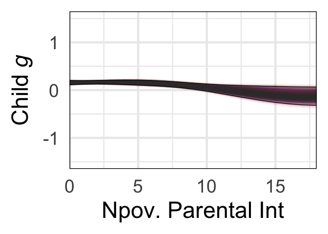<!-- -->

``` r
# both merged
plot<-plot_bootstraps_pnp(pov_p,npov_p,160,'Parental P',MaxP)
```

    ## Warning: Returning more (or less) than 1 row per `summarise()` group was deprecated in
    ## dplyr 1.1.0.
    ## ℹ Please use `reframe()` instead.
    ## ℹ When switching from `summarise()` to `reframe()`, remember that `reframe()`
    ##   always returns an ungrouped data frame and adjust accordingly.
    ## Call `lifecycle::last_lifecycle_warnings()` to see where this warning was
    ## generated.

    ## Warning: Returning more (or less) than 1 row per `summarise()` group was deprecated in
    ## dplyr 1.1.0.
    ## ℹ Please use `reframe()` instead.
    ## ℹ When switching from `summarise()` to `reframe()`, remember that `reframe()`
    ##   always returns an ungrouped data frame and adjust accordingly.
    ## Call `lifecycle::last_lifecycle_warnings()` to see where this warning was
    ## generated.

    ## Scale for alpha is already present.
    ## Adding another scale for alpha, which will replace the existing scale.
    ## Scale for y is already present.
    ## Adding another scale for y, which will replace the existing scale.

``` r
plot + theme(plot.margin = margin(r = 30,l=5,t=5,b=5))
```

    ## Warning: Removed 600120 rows containing missing values (`geom_line()`).

    ## Warning: Removed 600120 rows containing missing values (`geom_line()`).

<!-- -->

``` r
# derivatives
# poverty
P_derivative_matrix <- matrix(0, nrow = nrow(pov_p), ncol = ncol(pov_p) - 1)
# Calculate the derivative for each column
for (i in 1:(ncol(pov_p) - 1)) {
  # Calculate the differences in x (assuming a constant difference)
  dx <- 1
  # Calculate the differences in y (predicted values)
  dy <- pov_p[, i + 1] - pov_p[, i]
  # Calculate the derivatives (slopes)
  derivatives <- dy / dx
  # Store the derivatives in the derivative matrix
  P_derivative_matrix[, i] <- derivatives
}
# calc sig dervs
# get straightfoward of segment where 99% is over 0 or under
positive_counts <- colSums(P_derivative_matrix > 0, na.rm = TRUE)
negative_counts <- colSums(P_derivative_matrix < 0, na.rm = TRUE)
# find where each is 99% or greater
positive_countsSig=positive_counts>9500
negative_countsSig=negative_counts>9500
# make dataframe: 50th percentile of derivatives accompanied by posSig and NegSig vector
data <- apply(P_derivative_matrix, 2, function(x) quantile(x, probs = 0.5))
dervPlotDf<-data.frame(data,positive_countsSig,negative_countsSig)
# if either is sig at 99% plot
dervPlotDf$sig_derivMask=dervPlotDf[,2]+dervPlotDf[,3]>0
# use it to mask calculated derivs
dervPlotDf$sig_deriv=0
dervPlotDf$sig_deriv[dervPlotDf$sig_derivMask]=dervPlotDf$data[dervPlotDf$sig_derivMask]
dervPlotDf$seq=1:(dim(dervPlotDf)[1])
plot<-ggplot(data=dervPlotDf) + geom_raster(aes(x = seq, y = .5, fill = sig_deriv))+
    theme(panel.spacing = unit(-.01,"cm")) +
    scale_fill_gradientn(colors = my_palette(100),limits = c(min(-.1),max(0.1)))+theme_minimal(base_size = 35)+
    xlim(c(0,MaxP))+xlab(x_title)+
    guides(fill=FALSE)+
    theme(axis.title.y = element_blank(),axis.text.y=element_blank())+theme(panel.border = element_rect(color = "black", fill = NA, size = 1))+
    scale_x_continuous(limits = c(0,MaxP),expand = expansion(mult = c(0, 0)))
```

    ## Scale for x is already present.
    ## Adding another scale for x, which will replace the existing scale.

``` r
plot + theme(plot.margin = margin(r = 30,l=5,t=5,b=5))
```

    ## Warning: Removed 61 rows containing missing values (`geom_raster()`).

<!-- -->

``` r
# nonpoverty
P_derivative_matrix <- matrix(0, nrow = nrow(npov_p), ncol = ncol(npov_p) - 1)
# Calculate the derivative for each column
for (i in 1:(ncol(npov_p) - 1)) {
  # Calculate the differences in x (assuming a constant difference)
  dx <- 1
  # Calculate the differences in y (predicted values)
  dy <- npov_p[, i + 1] - npov_p[, i]
  # Calculate the derivatives (slopes)
  derivatives <- dy / dx
  # Store the derivatives in the derivative matrix
  P_derivative_matrix[, i] <- derivatives
}
# calc sig dervs
# get straightfoward of segment where 99% is over 0 or under
positive_counts <- colSums(P_derivative_matrix > 0, na.rm = TRUE)
negative_counts <- colSums(P_derivative_matrix < 0, na.rm = TRUE)
# find where each is 99% or greater
positive_countsSig=positive_counts>9500
negative_countsSig=negative_counts>9500
# make dataframe: 50th percentile of derivatives accompanied by posSig and NegSig vector
data <- apply(P_derivative_matrix, 2, function(x) quantile(x, probs = 0.5))
dervPlotDf<-data.frame(data,positive_countsSig,negative_countsSig)
# if either is sig at 99% plot
dervPlotDf$sig_derivMask=dervPlotDf[,2]+dervPlotDf[,3]>0
# use it to mask calculated derivs
dervPlotDf$sig_deriv=0
dervPlotDf$sig_deriv[dervPlotDf$sig_derivMask]=dervPlotDf$data[dervPlotDf$sig_derivMask]
dervPlotDf$seq=1:(dim(dervPlotDf)[1])
plot<-ggplot(data=dervPlotDf) + geom_raster(aes(x = seq, y = .5, fill = sig_deriv))+
    theme(panel.spacing = unit(-.01,"cm")) +
    scale_fill_gradientn(colors = my_palette(100),limits = c(min(-.1),max(0.1)))+theme_minimal(base_size = 35)+
    xlim(c(0,MaxP))+xlab(x_title)+
    guides(fill=FALSE)+
    theme(axis.title.y = element_blank(),axis.text.y=element_blank())+theme(panel.border = element_rect(color = "black", fill = NA, size = 1))+
    scale_x_continuous(limits = c(0,MaxP),expand = expansion(mult = c(0, 0)))
```

    ## Scale for x is already present.
    ## Adding another scale for x, which will replace the existing scale.

``` r
plot + theme(plot.margin = margin(r = 30,l=5,t=5,b=5))
```

    ## Warning: Removed 61 rows containing missing values (`geom_raster()`).

<!-- -->

``` r
# poverty parental int
pov_Int=pNpFits1[,323:353]
MaxInt=quantile(masterdf$ASRInt, probs = 0.99)
plot_bootstraps_par(pov_Int,30,'Pov. Parental Int',MaxInt)
```

    ## Warning: Returning more (or less) than 1 row per `summarise()` group was deprecated in
    ## dplyr 1.1.0.
    ## ℹ Please use `reframe()` instead.
    ## ℹ When switching from `summarise()` to `reframe()`, remember that `reframe()`
    ##   always returns an ungrouped data frame and adjust accordingly.
    ## Call `lifecycle::last_lifecycle_warnings()` to see where this warning was
    ## generated.

    ## Warning: Removed 120024 rows containing missing values (`geom_line()`).

<!-- -->

``` r
# nonpoverty parental int
npov_Int=pNpFits1[,354:384]
plot_bootstraps_par(npov_Int,30,'Npov. Parental Int',MaxInt)
```

    ## Warning: Returning more (or less) than 1 row per `summarise()` group was deprecated in
    ## dplyr 1.1.0.
    ## ℹ Please use `reframe()` instead.
    ## ℹ When switching from `summarise()` to `reframe()`, remember that `reframe()`
    ##   always returns an ungrouped data frame and adjust accordingly.
    ## Removed 120024 rows containing missing values (`geom_line()`).
    ## Call `lifecycle::last_lifecycle_warnings()` to see where this warning was
    ## generated.

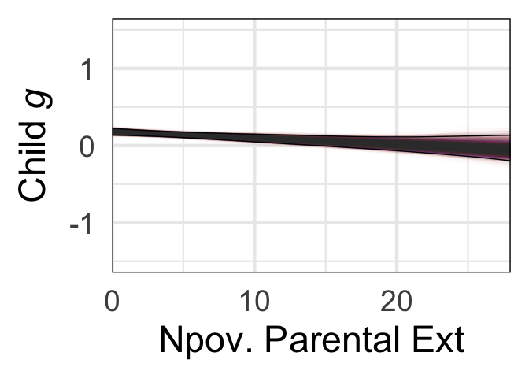<!-- -->

``` r
# both merged
plot<-plot_bootstraps_pnp(pov_Int,npov_Int,30,'Parental Int.',MaxInt)
```

    ## Warning: Returning more (or less) than 1 row per `summarise()` group was deprecated in
    ## dplyr 1.1.0.
    ## ℹ Please use `reframe()` instead.
    ## ℹ When switching from `summarise()` to `reframe()`, remember that `reframe()`
    ##   always returns an ungrouped data frame and adjust accordingly.
    ## Call `lifecycle::last_lifecycle_warnings()` to see where this warning was
    ## generated.

    ## Warning: Returning more (or less) than 1 row per `summarise()` group was deprecated in
    ## dplyr 1.1.0.
    ## ℹ Please use `reframe()` instead.
    ## ℹ When switching from `summarise()` to `reframe()`, remember that `reframe()`
    ##   always returns an ungrouped data frame and adjust accordingly.
    ## Call `lifecycle::last_lifecycle_warnings()` to see where this warning was
    ## generated.

    ## Scale for alpha is already present.
    ## Adding another scale for alpha, which will replace the existing scale.
    ## Scale for y is already present.
    ## Adding another scale for y, which will replace the existing scale.

``` r
plot + theme(plot.margin = margin(r = 30,l=5,t=5,b=5))
```

    ## Warning: Removed 120024 rows containing missing values (`geom_line()`).

    ## Warning: Removed 120024 rows containing missing values (`geom_line()`).

<!-- -->

``` r
# derivatives
# poverty
P_derivative_matrix <- matrix(0, nrow = nrow(pov_Int), ncol = ncol(pov_Int) - 1)
# Calculate the derivative for each column
for (i in 1:(ncol(pov_Int) - 1)) {
  # Calculate the differences in x (assuming a constant difference)
  dx <- 1
  # Calculate the differences in y (predicted values)
  dy <- pov_Int[, i + 1] - pov_Int[, i]
  # Calculate the derivatives (slopes)
  derivatives <- dy / dx
  # Store the derivatives in the derivative matrix
  P_derivative_matrix[, i] <- derivatives
}
# calc sig dervs
# get straightfoward of segment where 99% is over 0 or under
positive_counts <- colSums(P_derivative_matrix > 0, na.rm = TRUE)
negative_counts <- colSums(P_derivative_matrix < 0, na.rm = TRUE)
# find where each is 99% or greater
positive_countsSig=positive_counts>9500
negative_countsSig=negative_counts>9500
# make dataframe: 50th percentile of derivatives accompanied by posSig and NegSig vector
data <- apply(P_derivative_matrix, 2, function(x) quantile(x, probs = 0.5))
dervPlotDf<-data.frame(data,positive_countsSig,negative_countsSig)
# if either is sig at 99% plot
dervPlotDf$sig_derivMask=dervPlotDf[,2]+dervPlotDf[,3]>0
# use it to mask calculated derivs
dervPlotDf$sig_deriv=0
dervPlotDf$sig_deriv[dervPlotDf$sig_derivMask]=dervPlotDf$data[dervPlotDf$sig_derivMask]
dervPlotDf$seq=1:(dim(dervPlotDf)[1])
plot<-ggplot(data=dervPlotDf) + geom_raster(aes(x = seq, y = .5, fill = sig_deriv))+
    theme(panel.spacing = unit(-.01,"cm")) +
    scale_fill_gradientn(colors = my_palette(100),limits = c(min(-.1),max(0.1)))+theme_minimal(base_size = 35)+
    xlim(c(0,MaxInt))+xlab('Parental Int.')+
    guides(fill=FALSE)+
    theme(axis.title.y = element_blank(),axis.text.y=element_blank())+theme(panel.border = element_rect(color = "black", fill = NA, size = 1))+
    scale_x_continuous(limits = c(0,MaxInt),expand = expansion(mult = c(0, 0)))
```

    ## Scale for x is already present.
    ## Adding another scale for x, which will replace the existing scale.

``` r
plot + theme(plot.margin = margin(r = 30,l=5,t=5,b=5))
```

    ## Warning: Removed 13 rows containing missing values (`geom_raster()`).

<!-- -->

``` r
# nonpoverty
P_derivative_matrix <- matrix(0, nrow = nrow(npov_Int), ncol = ncol(npov_Int) - 1)
# Calculate the derivative for each column
for (i in 1:(ncol(npov_Int) - 1)) {
  # Calculate the differences in x (assuming a constant difference)
  dx <- 1
  # Calculate the differences in y (predicted values)
  dy <- npov_Int[, i + 1] - npov_Int[, i]
  # Calculate the derivatives (slopes)
  derivatives <- dy / dx
  # Store the derivatives in the derivative matrix
  P_derivative_matrix[, i] <- derivatives
}
# calc sig dervs
# get straightfoward of segment where 99% is over 0 or under
positive_counts <- colSums(P_derivative_matrix > 0, na.rm = TRUE)
negative_counts <- colSums(P_derivative_matrix < 0, na.rm = TRUE)
# find where each is 99% or greater
positive_countsSig=positive_counts>9500
negative_countsSig=negative_counts>9500
# make dataframe: 50th percentile of derivatives accompanied by posSig and NegSig vector
data <- apply(P_derivative_matrix, 2, function(x) quantile(x, probs = 0.5))
dervPlotDf<-data.frame(data,positive_countsSig,negative_countsSig)
# if either is sig at 99% plot
dervPlotDf$sig_derivMask=dervPlotDf[,2]+dervPlotDf[,3]>0
# use it to mask calculated derivs
dervPlotDf$sig_deriv=0
dervPlotDf$sig_deriv[dervPlotDf$sig_derivMask]=dervPlotDf$data[dervPlotDf$sig_derivMask]
dervPlotDf$seq=1:(dim(dervPlotDf)[1])
plot<-ggplot(data=dervPlotDf) + geom_raster(aes(x = seq, y = .5, fill = sig_deriv))+
    theme(panel.spacing = unit(-.01,"cm")) +
    scale_fill_gradientn(colors = my_palette(100),limits = c(min(-.1),max(0.1)))+theme_minimal(base_size = 35)+
    xlim(c(0,MaxInt))+xlab('Parental Int.')+
    guides(fill=FALSE)+
    theme(axis.title.y = element_blank(),axis.text.y=element_blank())+theme(panel.border = element_rect(color = "black", fill = NA, size = 1))+
    scale_x_continuous(limits = c(0,MaxInt),expand = expansion(mult = c(0, 0)))
```

    ## Scale for x is already present.
    ## Adding another scale for x, which will replace the existing scale.

``` r
plot + theme(plot.margin = margin(r = 30,l=5,t=5,b=5))
```

    ## Warning: Removed 13 rows containing missing values (`geom_raster()`).

<!-- -->

``` r
# poverty parental ext
pov_Ext=pNpFits1[,385:448]
MaxExt=quantile(masterdf$ASRExt, probs = 0.99)
plot_bootstraps_par(pov_Ext,63,'Pov. Parental Ext',MaxExt)
```

    ## Warning: Returning more (or less) than 1 row per `summarise()` group was deprecated in
    ## dplyr 1.1.0.
    ## ℹ Please use `reframe()` instead.
    ## ℹ When switching from `summarise()` to `reframe()`, remember that `reframe()`
    ##   always returns an ungrouped data frame and adjust accordingly.
    ## Call `lifecycle::last_lifecycle_warnings()` to see where this warning was
    ## generated.

    ## Warning: Removed 350070 rows containing missing values (`geom_line()`).

<!-- -->

``` r
# nonpoverty parental p
npov_Ext=pNpFits1[,449:512]
plot_bootstraps_par(npov_Ext,63,'Npov. Parental Ext',MaxExt)
```

    ## Warning: Returning more (or less) than 1 row per `summarise()` group was deprecated in
    ## dplyr 1.1.0.
    ## ℹ Please use `reframe()` instead.
    ## ℹ When switching from `summarise()` to `reframe()`, remember that `reframe()`
    ##   always returns an ungrouped data frame and adjust accordingly.
    ## Removed 350070 rows containing missing values (`geom_line()`).
    ## Call `lifecycle::last_lifecycle_warnings()` to see where this warning was
    ## generated.

<!-- -->

``` r
# both merged
plot<-plot_bootstraps_pnp(pov_Ext,npov_Ext,63,'Parental Ext.',MaxExt)
```

    ## Warning: Returning more (or less) than 1 row per `summarise()` group was deprecated in
    ## dplyr 1.1.0.
    ## ℹ Please use `reframe()` instead.
    ## ℹ When switching from `summarise()` to `reframe()`, remember that `reframe()`
    ##   always returns an ungrouped data frame and adjust accordingly.
    ## Call `lifecycle::last_lifecycle_warnings()` to see where this warning was
    ## generated.

    ## Warning: Returning more (or less) than 1 row per `summarise()` group was deprecated in
    ## dplyr 1.1.0.
    ## ℹ Please use `reframe()` instead.
    ## ℹ When switching from `summarise()` to `reframe()`, remember that `reframe()`
    ##   always returns an ungrouped data frame and adjust accordingly.
    ## Call `lifecycle::last_lifecycle_warnings()` to see where this warning was
    ## generated.

    ## Scale for alpha is already present.
    ## Adding another scale for alpha, which will replace the existing scale.
    ## Scale for y is already present.
    ## Adding another scale for y, which will replace the existing scale.

``` r
plot + theme(plot.margin = margin(r = 30,l=5,t=5,b=5))
```

    ## Warning: Removed 350070 rows containing missing values (`geom_line()`).

    ## Warning: Removed 350070 rows containing missing values (`geom_line()`).

<!-- -->

``` r
# poverty
P_derivative_matrix <- matrix(0, nrow = nrow(pov_Ext), ncol = ncol(pov_Ext) - 1)
# Calculate the derivative for each column
for (i in 1:(ncol(pov_Ext) - 1)) {
  # Calculate the differences in x (assuming a constant difference)
  dx <- 1
  # Calculate the differences in y (predicted values)
  dy <- pov_Ext[, i + 1] - pov_Ext[, i]
  # Calculate the derivatives (slopes)
  derivatives <- dy / dx
  # Store the derivatives in the derivative matrix
  P_derivative_matrix[, i] <- derivatives
}
# calc sig dervs
# get straightfoward of segment where 99% is over 0 or under
positive_counts <- colSums(P_derivative_matrix > 0, na.rm = TRUE)
negative_counts <- colSums(P_derivative_matrix < 0, na.rm = TRUE)
# find where each is 99% or greater
positive_countsSig=positive_counts>9500
negative_countsSig=negative_counts>9500
# make dataframe: 50th percentile of derivatives accompanied by posSig and NegSig vector
data <- apply(P_derivative_matrix, 2, function(x) quantile(x, probs = 0.5))
dervPlotDf<-data.frame(data,positive_countsSig,negative_countsSig)
# if either is sig at 99% plot
dervPlotDf$sig_derivMask=dervPlotDf[,2]+dervPlotDf[,3]>0
# use it to mask calculated derivs
dervPlotDf$sig_deriv=0
dervPlotDf$sig_deriv[dervPlotDf$sig_derivMask]=dervPlotDf$data[dervPlotDf$sig_derivMask]
dervPlotDf$seq=1:(dim(dervPlotDf)[1])
plot<-ggplot(data=dervPlotDf) + geom_raster(aes(x = seq, y = .5, fill = sig_deriv))+
    theme(panel.spacing = unit(-.01,"cm")) +
    scale_fill_gradientn(colors = my_palette(100),limits = c(min(-.1),max(0.1)))+theme_minimal(base_size = 35)+
    xlim(c(0,MaxInt))+xlab('Parental Ext.')+
    guides(fill=FALSE)+
    theme(axis.title.y = element_blank(),axis.text.y=element_blank())+theme(panel.border = element_rect(color = "black", fill = NA, size = 1))+
    scale_x_continuous(limits = c(0,MaxExt),expand = expansion(mult = c(0, 0)))
```

    ## Scale for x is already present.
    ## Adding another scale for x, which will replace the existing scale.

``` r
plot + theme(plot.margin = margin(r = 30,l=5,t=5,b=5))
```

    ## Warning: Removed 36 rows containing missing values (`geom_raster()`).

<!-- -->

``` r
# nonpoverty
P_derivative_matrix <- matrix(0, nrow = nrow(npov_Ext), ncol = ncol(npov_Ext) - 1)
# Calculate the derivative for each column
for (i in 1:(ncol(npov_Ext) - 1)) {
  # Calculate the differences in x (assuming a constant difference)
  dx <- 1
  # Calculate the differences in y (predicted values)
  dy <- npov_Ext[, i + 1] - npov_Ext[, i]
  # Calculate the derivatives (slopes)
  derivatives <- dy / dx
  # Store the derivatives in the derivative matrix
  P_derivative_matrix[, i] <- derivatives
}
# calc sig dervs
# get straightfoward of segment where 99% is over 0 or under
positive_counts <- colSums(P_derivative_matrix > 0, na.rm = TRUE)
negative_counts <- colSums(P_derivative_matrix < 0, na.rm = TRUE)
# find where each is 99% or greater
positive_countsSig=positive_counts>9500
negative_countsSig=negative_counts>9500
# make dataframe: 50th percentile of derivatives accompanied by posSig and NegSig vector
data <- apply(P_derivative_matrix, 2, function(x) quantile(x, probs = 0.5))
dervPlotDf<-data.frame(data,positive_countsSig,negative_countsSig)
# if either is sig at 99% plot
dervPlotDf$sig_derivMask=dervPlotDf[,2]+dervPlotDf[,3]>0
# use it to mask calculated derivs
dervPlotDf$sig_deriv=0
dervPlotDf$sig_deriv[dervPlotDf$sig_derivMask]=dervPlotDf$data[dervPlotDf$sig_derivMask]
dervPlotDf$seq=1:(dim(dervPlotDf)[1])
plot<-ggplot(data=dervPlotDf) + geom_raster(aes(x = seq, y = .5, fill = sig_deriv))+
    theme(panel.spacing = unit(-.01,"cm")) +
    scale_fill_gradientn(colors = my_palette(100),limits = c(min(-.1),max(0.1)))+theme_minimal(base_size = 35)+
    xlim(c(0,MaxInt))+xlab('Parental Ext.')+
    guides(fill=FALSE)+
    theme(axis.title.y = element_blank(),axis.text.y=element_blank())+theme(panel.border = element_rect(color = "black", fill = NA, size = 1))+
    scale_x_continuous(limits = c(0,MaxExt),expand = expansion(mult = c(0, 0)))
```

    ## Scale for x is already present.
    ## Adding another scale for x, which will replace the existing scale.

``` r
plot + theme(plot.margin = margin(r = 30,l=5,t=5,b=5))
```

    ## Warning: Removed 36 rows containing missing values (`geom_raster()`).

<!-- -->

``` r
# poverty parental somatic
pov_Som=pNpFits1[,513:533]
MaxSom=quantile(masterdf$ASRSomatic, probs = 0.99)
plot_bootstraps_par(pov_Som,20,'Pov. Parental Somatic',MaxSom)
```

    ## Warning: Returning more (or less) than 1 row per `summarise()` group was deprecated in
    ## dplyr 1.1.0.
    ## ℹ Please use `reframe()` instead.
    ## ℹ When switching from `summarise()` to `reframe()`, remember that `reframe()`
    ##   always returns an ungrouped data frame and adjust accordingly.
    ## Call `lifecycle::last_lifecycle_warnings()` to see where this warning was
    ## generated.

    ## Warning: Removed 80016 rows containing missing values (`geom_line()`).

<!-- -->

``` r
# nonpoverty parental p
npov_Som=pNpFits1[,534:554]
plot_bootstraps_par(npov_Som,20,'Npov. Parental Somatic',MaxSom)
```

    ## Warning: Returning more (or less) than 1 row per `summarise()` group was deprecated in
    ## dplyr 1.1.0.
    ## ℹ Please use `reframe()` instead.
    ## ℹ When switching from `summarise()` to `reframe()`, remember that `reframe()`
    ##   always returns an ungrouped data frame and adjust accordingly.
    ## Removed 80016 rows containing missing values (`geom_line()`).
    ## Call `lifecycle::last_lifecycle_warnings()` to see where this warning was
    ## generated.

<!-- -->

``` r
# both merged
plot<-plot_bootstraps_pnp(pov_Som,npov_Som,20,'Parental Somatic',MaxSom)
```

    ## Warning: Returning more (or less) than 1 row per `summarise()` group was deprecated in
    ## dplyr 1.1.0.
    ## ℹ Please use `reframe()` instead.
    ## ℹ When switching from `summarise()` to `reframe()`, remember that `reframe()`
    ##   always returns an ungrouped data frame and adjust accordingly.
    ## Call `lifecycle::last_lifecycle_warnings()` to see where this warning was
    ## generated.

    ## Warning: Returning more (or less) than 1 row per `summarise()` group was deprecated in
    ## dplyr 1.1.0.
    ## ℹ Please use `reframe()` instead.
    ## ℹ When switching from `summarise()` to `reframe()`, remember that `reframe()`
    ##   always returns an ungrouped data frame and adjust accordingly.
    ## Call `lifecycle::last_lifecycle_warnings()` to see where this warning was
    ## generated.

    ## Scale for alpha is already present.
    ## Adding another scale for alpha, which will replace the existing scale.
    ## Scale for y is already present.
    ## Adding another scale for y, which will replace the existing scale.

``` r
plot + theme(plot.margin = margin(r = 30,l=5,t=5,b=5))
```

    ## Warning: Removed 80016 rows containing missing values (`geom_line()`).

    ## Warning: Removed 80016 rows containing missing values (`geom_line()`).

<!-- -->

``` r
# poverty
P_derivative_matrix <- matrix(0, nrow = nrow(pov_Som), ncol = ncol(pov_Som) - 1)
# Calculate the derivative for each column
for (i in 1:(ncol(pov_Som) - 1)) {
  # Calculate the differences in x (assuming a constant difference)
  dx <- 1
  # Calculate the differences in y (predicted values)
  dy <- pov_Som[, i + 1] - pov_Som[, i]
  # Calculate the derivatives (slopes)
  derivatives <- dy / dx
  # Store the derivatives in the derivative matrix
  P_derivative_matrix[, i] <- derivatives
}
# calc sig dervs
# get straightfoward of segment where 99% is over 0 or under
positive_counts <- colSums(P_derivative_matrix > 0, na.rm = TRUE)
negative_counts <- colSums(P_derivative_matrix < 0, na.rm = TRUE)
# find where each is 99% or greater
positive_countsSig=positive_counts>9500
negative_countsSig=negative_counts>9500
# make dataframe: 50th percentile of derivatives accompanied by posSig and NegSig vector
data <- apply(P_derivative_matrix, 2, function(x) quantile(x, probs = 0.5))
dervPlotDf<-data.frame(data,positive_countsSig,negative_countsSig)
# if either is sig at 99% plot
dervPlotDf$sig_derivMask=dervPlotDf[,2]+dervPlotDf[,3]>0
# use it to mask calculated derivs
dervPlotDf$sig_deriv=0
dervPlotDf$sig_deriv[dervPlotDf$sig_derivMask]=dervPlotDf$data[dervPlotDf$sig_derivMask]
dervPlotDf$seq=1:(dim(dervPlotDf)[1])
plot<-ggplot(data=dervPlotDf) + geom_raster(aes(x = seq, y = .5, fill = sig_deriv))+
    theme(panel.spacing = unit(-.01,"cm")) +
    scale_fill_gradientn(colors = my_palette(100),limits = c(min(-.1),max(0.1)))+theme_minimal(base_size = 35)+
    xlim(c(0,MaxSom))+xlab('Parental Somatic')+
    guides(fill=FALSE)+
    theme(axis.title.y = element_blank(),axis.text.y=element_blank())+theme(panel.border = element_rect(color = "black", fill = NA, size = 1))+
    scale_x_continuous(limits = c(0,MaxSom),expand = expansion(mult = c(0, 0)))
```

    ## Scale for x is already present.
    ## Adding another scale for x, which will replace the existing scale.

``` r
plot + theme(plot.margin = margin(r = 30,l=5,t=5,b=5))
```

    ## Warning: Removed 9 rows containing missing values (`geom_raster()`).

<!-- -->

``` r
# nonpoverty
P_derivative_matrix <- matrix(0, nrow = nrow(npov_Som), ncol = ncol(npov_Som) - 1)
# Calculate the derivative for each column
for (i in 1:(ncol(npov_Som) - 1)) {
  # Calculate the differences in x (assuming a constant difference)
  dx <- 1
  # Calculate the differences in y (predicted values)
  dy <- npov_Som[, i + 1] - npov_Som[, i]
  # Calculate the derivatives (slopes)
  derivatives <- dy / dx
  # Store the derivatives in the derivative matrix
  P_derivative_matrix[, i] <- derivatives
}
# calc sig dervs
# get straightfoward of segment where 99% is over 0 or under
positive_counts <- colSums(P_derivative_matrix > 0, na.rm = TRUE)
negative_counts <- colSums(P_derivative_matrix < 0, na.rm = TRUE)
# find where each is 99% or greater
positive_countsSig=positive_counts>9500
negative_countsSig=negative_counts>9500
# make dataframe: 50th percentile of derivatives accompanied by posSig and NegSig vector
data <- apply(P_derivative_matrix, 2, function(x) quantile(x, probs = 0.5))
dervPlotDf<-data.frame(data,positive_countsSig,negative_countsSig)
# if either is sig at 99% plot
dervPlotDf$sig_derivMask=dervPlotDf[,2]+dervPlotDf[,3]>0
# use it to mask calculated derivs
dervPlotDf$sig_deriv=0
dervPlotDf$sig_deriv[dervPlotDf$sig_derivMask]=dervPlotDf$data[dervPlotDf$sig_derivMask]
dervPlotDf$seq=1:(dim(dervPlotDf)[1])
plot<-ggplot(data=dervPlotDf) + geom_raster(aes(x = seq, y = .5, fill = sig_deriv))+
    theme(panel.spacing = unit(-.01,"cm")) +
    scale_fill_gradientn(colors = my_palette(100),limits = c(min(-.1),max(0.1)))+theme_minimal(base_size = 35)+
    xlim(c(0,MaxSom))+xlab('Parental Somatic')+
    guides(fill=FALSE)+
    theme(axis.title.y = element_blank(),axis.text.y=element_blank())+theme(panel.border = element_rect(color = "black", fill = NA, size = 1))+
    scale_x_continuous(limits = c(0,MaxSom),expand = expansion(mult = c(0, 0)))
```

    ## Scale for x is already present.
    ## Adding another scale for x, which will replace the existing scale.

``` r
plot + theme(plot.margin = margin(r = 30,l=5,t=5,b=5))
```

    ## Warning: Removed 9 rows containing missing values (`geom_raster()`).

<!-- -->

``` r
# Anxious Depression
pov_Anx=pNpFits1[,555:586]
MaxAnx=quantile(masterdf$ASRAnxDepr, probs = 0.99)
plot_bootstraps_par(pov_Anx,31,'Pov. Parental Anx. Dep.',MaxAnx)
```

    ## Warning: Returning more (or less) than 1 row per `summarise()` group was deprecated in
    ## dplyr 1.1.0.
    ## ℹ Please use `reframe()` instead.
    ## ℹ When switching from `summarise()` to `reframe()`, remember that `reframe()`
    ##   always returns an ungrouped data frame and adjust accordingly.
    ## Call `lifecycle::last_lifecycle_warnings()` to see where this warning was
    ## generated.

    ## Warning: Removed 110022 rows containing missing values (`geom_line()`).

<!-- -->

``` r
# nonpoverty parental p
npov_Anx=pNpFits1[,587:618]
plot_bootstraps_par(npov_Anx,31,'Npov. Parental Anx. Dep.',MaxAnx)
```

    ## Warning: Returning more (or less) than 1 row per `summarise()` group was deprecated in
    ## dplyr 1.1.0.
    ## ℹ Please use `reframe()` instead.
    ## ℹ When switching from `summarise()` to `reframe()`, remember that `reframe()`
    ##   always returns an ungrouped data frame and adjust accordingly.
    ## Removed 110022 rows containing missing values (`geom_line()`).
    ## Call `lifecycle::last_lifecycle_warnings()` to see where this warning was
    ## generated.

<!-- -->

``` r
# both merged
plot<-plot_bootstraps_pnp(pov_Anx,npov_Anx,31,'Parental Anx. Dep.',MaxAnx)
```

    ## Warning: Returning more (or less) than 1 row per `summarise()` group was deprecated in
    ## dplyr 1.1.0.
    ## ℹ Please use `reframe()` instead.
    ## ℹ When switching from `summarise()` to `reframe()`, remember that `reframe()`
    ##   always returns an ungrouped data frame and adjust accordingly.
    ## Call `lifecycle::last_lifecycle_warnings()` to see where this warning was
    ## generated.

    ## Warning: Returning more (or less) than 1 row per `summarise()` group was deprecated in
    ## dplyr 1.1.0.
    ## ℹ Please use `reframe()` instead.
    ## ℹ When switching from `summarise()` to `reframe()`, remember that `reframe()`
    ##   always returns an ungrouped data frame and adjust accordingly.
    ## Call `lifecycle::last_lifecycle_warnings()` to see where this warning was
    ## generated.

    ## Scale for alpha is already present.
    ## Adding another scale for alpha, which will replace the existing scale.
    ## Scale for y is already present.
    ## Adding another scale for y, which will replace the existing scale.

``` r
plot + theme(plot.margin = margin(r = 30,l=5,t=5,b=5))
```

    ## Warning: Removed 110022 rows containing missing values (`geom_line()`).

    ## Warning: Removed 110022 rows containing missing values (`geom_line()`).

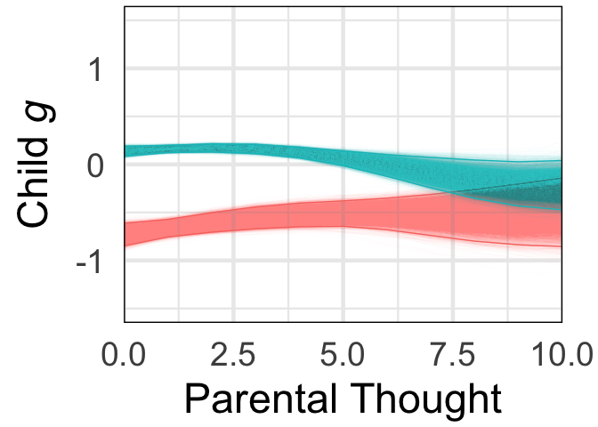<!-- -->

``` r
# poverty
P_derivative_matrix <- matrix(0, nrow = nrow(pov_Anx), ncol = ncol(pov_Anx) - 1)
# Calculate the derivative for each column
for (i in 1:(ncol(pov_Anx) - 1)) {
  # Calculate the differences in x (assuming a constant difference)
  dx <- 1
  # Calculate the differences in y (predicted values)
  dy <- pov_Anx[, i + 1] - pov_Anx[, i]
  # Calculate the derivatives (slopes)
  derivatives <- dy / dx
  # Store the derivatives in the derivative matrix
  P_derivative_matrix[, i] <- derivatives
}
# calc sig dervs
# get straightfoward of segment where 99% is over 0 or under
positive_counts <- colSums(P_derivative_matrix > 0, na.rm = TRUE)
negative_counts <- colSums(P_derivative_matrix < 0, na.rm = TRUE)
# find where each is 99% or greater
positive_countsSig=positive_counts>9500
negative_countsSig=negative_counts>9500
# make dataframe: 50th percentile of derivatives accompanied by posSig and NegSig vector
data <- apply(P_derivative_matrix, 2, function(x) quantile(x, probs = 0.5))
dervPlotDf<-data.frame(data,positive_countsSig,negative_countsSig)
# if either is sig at 99% plot
dervPlotDf$sig_derivMask=dervPlotDf[,2]+dervPlotDf[,3]>0
# use it to mask calculated derivs
dervPlotDf$sig_deriv=0
dervPlotDf$sig_deriv[dervPlotDf$sig_derivMask]=dervPlotDf$data[dervPlotDf$sig_derivMask]
dervPlotDf$seq=1:(dim(dervPlotDf)[1])
plot<-ggplot(data=dervPlotDf) + geom_raster(aes(x = seq, y = .5, fill = sig_deriv))+
    theme(panel.spacing = unit(-.01,"cm")) +
    scale_fill_gradientn(colors = my_palette(100),limits = c(min(-.1),max(0.1)))+theme_minimal(base_size = 35)+
    xlim(c(0,MaxAnx))+xlab('Parental Anx. Dep.')+
    guides(fill=FALSE)+
    theme(axis.title.y = element_blank(),axis.text.y=element_blank())+theme(panel.border = element_rect(color = "black", fill = NA, size = 1))+
    scale_x_continuous(limits = c(0,MaxAnx),expand = expansion(mult = c(0, 0)))
```

    ## Scale for x is already present.
    ## Adding another scale for x, which will replace the existing scale.

``` r
plot + theme(plot.margin = margin(r = 30,l=5,t=5,b=5))
```

    ## Warning: Removed 12 rows containing missing values (`geom_raster()`).

<!-- -->

``` r
# nonpoverty
P_derivative_matrix <- matrix(0, nrow = nrow(npov_Anx), ncol = ncol(npov_Anx) - 1)
# Calculate the derivative for each column
for (i in 1:(ncol(npov_Anx) - 1)) {
  # Calculate the differences in x (assuming a constant difference)
  dx <- 1
  # Calculate the differences in y (predicted values)
  dy <- npov_Anx[, i + 1] - npov_Anx[, i]
  # Calculate the derivatives (slopes)
  derivatives <- dy / dx
  # Store the derivatives in the derivative matrix
  P_derivative_matrix[, i] <- derivatives
}
# calc sig dervs
# get straightfoward of segment where 99% is over 0 or under
positive_counts <- colSums(P_derivative_matrix > 0, na.rm = TRUE)
negative_counts <- colSums(P_derivative_matrix < 0, na.rm = TRUE)
# find where each is 99% or greater
positive_countsSig=positive_counts>9500
negative_countsSig=negative_counts>9500
# make dataframe: 50th percentile of derivatives accompanied by posSig and NegSig vector
data <- apply(P_derivative_matrix, 2, function(x) quantile(x, probs = 0.5))
dervPlotDf<-data.frame(data,positive_countsSig,negative_countsSig)
# if either is sig at 99% plot
dervPlotDf$sig_derivMask=dervPlotDf[,2]+dervPlotDf[,3]>0
# use it to mask calculated derivs
dervPlotDf$sig_deriv=0
dervPlotDf$sig_deriv[dervPlotDf$sig_derivMask]=dervPlotDf$data[dervPlotDf$sig_derivMask]
dervPlotDf$seq=1:(dim(dervPlotDf)[1])
plot<-ggplot(data=dervPlotDf) + geom_raster(aes(x = seq, y = .5, fill = sig_deriv))+
    theme(panel.spacing = unit(-.01,"cm")) +
    scale_fill_gradientn(colors = my_palette(100),limits = c(min(-.1),max(0.1)))+theme_minimal(base_size = 35)+
    xlim(c(0,MaxAnx))+xlab('Parental Anx. Dep.')+
    guides(fill=FALSE)+
    theme(axis.title.y = element_blank(),axis.text.y=element_blank())+theme(panel.border = element_rect(color = "black", fill = NA, size = 1))+
    scale_x_continuous(limits = c(0,MaxAnx),expand = expansion(mult = c(0, 0)))
```

    ## Scale for x is already present.
    ## Adding another scale for x, which will replace the existing scale.

``` r
plot + theme(plot.margin = margin(r = 30,l=5,t=5,b=5))
```

    ## Warning: Removed 12 rows containing missing values (`geom_raster()`).

<!-- -->

``` r
# Thought
pov_Tho=pNpFits1[,619:637]
MaxTho=quantile(masterdf$ASRThought, probs = 0.99)
plot_bootstraps_par(pov_Tho,18,'Pov. Parental Thought',MaxTho)
```

    ## Warning: Returning more (or less) than 1 row per `summarise()` group was deprecated in
    ## dplyr 1.1.0.
    ## ℹ Please use `reframe()` instead.
    ## ℹ When switching from `summarise()` to `reframe()`, remember that `reframe()`
    ##   always returns an ungrouped data frame and adjust accordingly.
    ## Call `lifecycle::last_lifecycle_warnings()` to see where this warning was
    ## generated.

    ## Warning: Removed 80016 rows containing missing values (`geom_line()`).

<!-- -->

``` r
# nonpoverty parental p
npov_Tho=pNpFits1[,638:656]
plot_bootstraps_par(npov_Tho,18,'Npov. Parental Thought',MaxTho)
```

    ## Warning: Returning more (or less) than 1 row per `summarise()` group was deprecated in
    ## dplyr 1.1.0.
    ## ℹ Please use `reframe()` instead.
    ## ℹ When switching from `summarise()` to `reframe()`, remember that `reframe()`
    ##   always returns an ungrouped data frame and adjust accordingly.
    ## Removed 80016 rows containing missing values (`geom_line()`).
    ## Call `lifecycle::last_lifecycle_warnings()` to see where this warning was
    ## generated.

<!-- -->

``` r
# both merged
plot<-plot_bootstraps_pnp(pov_Tho,npov_Tho,18,'Parental Thought',MaxTho)
```

    ## Warning: Returning more (or less) than 1 row per `summarise()` group was deprecated in
    ## dplyr 1.1.0.
    ## ℹ Please use `reframe()` instead.
    ## ℹ When switching from `summarise()` to `reframe()`, remember that `reframe()`
    ##   always returns an ungrouped data frame and adjust accordingly.
    ## Call `lifecycle::last_lifecycle_warnings()` to see where this warning was
    ## generated.

    ## Warning: Returning more (or less) than 1 row per `summarise()` group was deprecated in
    ## dplyr 1.1.0.
    ## ℹ Please use `reframe()` instead.
    ## ℹ When switching from `summarise()` to `reframe()`, remember that `reframe()`
    ##   always returns an ungrouped data frame and adjust accordingly.
    ## Call `lifecycle::last_lifecycle_warnings()` to see where this warning was
    ## generated.

    ## Scale for alpha is already present.
    ## Adding another scale for alpha, which will replace the existing scale.
    ## Scale for y is already present.
    ## Adding another scale for y, which will replace the existing scale.

``` r
plot + theme(plot.margin = margin(r = 30,l=15,t=5,b=5))
```

    ## Warning: Removed 80016 rows containing missing values (`geom_line()`).

    ## Warning: Removed 80016 rows containing missing values (`geom_line()`).

<!-- -->

``` r
# poverty
P_derivative_matrix <- matrix(0, nrow = nrow(pov_Tho), ncol = ncol(pov_Tho) - 1)
# Calculate the derivative for each column
for (i in 1:(ncol(pov_Tho) - 1)) {
  # Calculate the differences in x (assuming a constant difference)
  dx <- 1
  # Calculate the differences in y (predicted values)
  dy <- pov_Tho[, i + 1] - pov_Tho[, i]
  # Calculate the derivatives (slopes)
  derivatives <- dy / dx
  # Store the derivatives in the derivative matrix
  P_derivative_matrix[, i] <- derivatives
}
# calc sig dervs
# get straightfoward of segment where 99% is over 0 or under
positive_counts <- colSums(P_derivative_matrix > 0, na.rm = TRUE)
negative_counts <- colSums(P_derivative_matrix < 0, na.rm = TRUE)
# find where each is 99% or greater
positive_countsSig=positive_counts>9500
negative_countsSig=negative_counts>9500
# make dataframe: 50th percentile of derivatives accompanied by posSig and NegSig vector
data <- apply(P_derivative_matrix, 2, function(x) quantile(x, probs = 0.5))
dervPlotDf<-data.frame(data,positive_countsSig,negative_countsSig)
# if either is sig at 99% plot
dervPlotDf$sig_derivMask=dervPlotDf[,2]+dervPlotDf[,3]>0
# use it to mask calculated derivs
dervPlotDf$sig_deriv=0
dervPlotDf$sig_deriv[dervPlotDf$sig_derivMask]=dervPlotDf$data[dervPlotDf$sig_derivMask]
dervPlotDf$seq=1:(dim(dervPlotDf)[1])
plot<-ggplot(data=dervPlotDf) + geom_raster(aes(x = seq, y = .5, fill = sig_deriv))+
    theme(panel.spacing = unit(-.01,"cm")) +
    scale_fill_gradientn(colors = my_palette(100),limits = c(min(-.1),max(0.1)))+theme_minimal(base_size = 35)+
    xlim(c(0,MaxTho))+xlab('Parental Thought')+
    guides(fill=FALSE)+
    theme(axis.title.y = element_blank(),axis.text.y=element_blank())+theme(panel.border = element_rect(color = "black", fill = NA, size = 1))+
    scale_x_continuous(limits = c(0,MaxTho),expand = expansion(mult = c(0, 0)))
```

    ## Scale for x is already present.
    ## Adding another scale for x, which will replace the existing scale.

``` r
plot + theme(plot.margin = margin(r = 30,l=15,t=5,b=5))
```

    ## Warning: Removed 9 rows containing missing values (`geom_raster()`).

<!-- -->

``` r
# nonpoverty
P_derivative_matrix <- matrix(0, nrow = nrow(npov_Tho), ncol = ncol(npov_Tho) - 1)
# Calculate the derivative for each column
for (i in 1:(ncol(npov_Tho) - 1)) {
  # Calculate the differences in x (assuming a constant difference)
  dx <- 1
  # Calculate the differences in y (predicted values)
  dy <- npov_Tho[, i + 1] - npov_Tho[, i]
  # Calculate the derivatives (slopes)
  derivatives <- dy / dx
  # Store the derivatives in the derivative matrix
  P_derivative_matrix[, i] <- derivatives
}
# calc sig dervs
# get straightfoward of segment where 99% is over 0 or under
positive_counts <- colSums(P_derivative_matrix > 0, na.rm = TRUE)
negative_counts <- colSums(P_derivative_matrix < 0, na.rm = TRUE)
# find where each is 99% or greater
positive_countsSig=positive_counts>9500
negative_countsSig=negative_counts>9500
# make dataframe: 50th percentile of derivatives accompanied by posSig and NegSig vector
data <- apply(P_derivative_matrix, 2, function(x) quantile(x, probs = 0.5))
dervPlotDf<-data.frame(data,positive_countsSig,negative_countsSig)
# if either is sig at 99% plot
dervPlotDf$sig_derivMask=dervPlotDf[,2]+dervPlotDf[,3]>0
# use it to mask calculated derivs
dervPlotDf$sig_deriv=0
dervPlotDf$sig_deriv[dervPlotDf$sig_derivMask]=dervPlotDf$data[dervPlotDf$sig_derivMask]
dervPlotDf$seq=1:(dim(dervPlotDf)[1])
plot<-ggplot(data=dervPlotDf) + geom_raster(aes(x = seq, y = .5, fill = sig_deriv))+
    theme(panel.spacing = unit(-.01,"cm")) +
    scale_fill_gradientn(colors = my_palette(100),limits = c(min(-.1),max(0.1)))+theme_minimal(base_size = 35)+
    xlim(c(0,MaxTho))+xlab('Parental Thought')+
    guides(fill=FALSE)+
    theme(axis.title.y = element_blank(),axis.text.y=element_blank())+theme(panel.border = element_rect(color = "black", fill = NA, size = 1))+
    scale_x_continuous(limits = c(0,MaxTho),expand = expansion(mult = c(0, 0)))
```

    ## Scale for x is already present.
    ## Adding another scale for x, which will replace the existing scale.

``` r
plot + theme(plot.margin = margin(r = 30,l=15,t=5,b=5))
```

    ## Warning: Removed 9 rows containing missing values (`geom_raster()`).

<!-- -->

``` r
# Withdrawn Depression
pov_Wit=pNpFits1[,657:675]
MaxWit=quantile(masterdf$ASRWithdrawn, probs = 0.99)
plot_bootstraps_par(pov_Wit,18,'Pov. With. Depr.',MaxWit)
```

    ## Warning: Returning more (or less) than 1 row per `summarise()` group was deprecated in
    ## dplyr 1.1.0.
    ## ℹ Please use `reframe()` instead.
    ## ℹ When switching from `summarise()` to `reframe()`, remember that `reframe()`
    ##   always returns an ungrouped data frame and adjust accordingly.
    ## Call `lifecycle::last_lifecycle_warnings()` to see where this warning was
    ## generated.

    ## Warning: Removed 90018 rows containing missing values (`geom_line()`).

<!-- -->

``` r
# nonpoverty parental p
npov_Wit=pNpFits1[,676:694]
plot_bootstraps_par(npov_Wit,18,'Npov. Parental With. Depr.',MaxWit)
```

    ## Warning: Returning more (or less) than 1 row per `summarise()` group was deprecated in
    ## dplyr 1.1.0.
    ## ℹ Please use `reframe()` instead.
    ## ℹ When switching from `summarise()` to `reframe()`, remember that `reframe()`
    ##   always returns an ungrouped data frame and adjust accordingly.
    ## Removed 90018 rows containing missing values (`geom_line()`).
    ## Call `lifecycle::last_lifecycle_warnings()` to see where this warning was
    ## generated.

<!-- -->

``` r
# both merged
plot<-plot_bootstraps_pnp(pov_Wit,npov_Wit,18,'Parental With. Depr.',MaxWit)
```

    ## Warning: Returning more (or less) than 1 row per `summarise()` group was deprecated in
    ## dplyr 1.1.0.
    ## ℹ Please use `reframe()` instead.
    ## ℹ When switching from `summarise()` to `reframe()`, remember that `reframe()`
    ##   always returns an ungrouped data frame and adjust accordingly.
    ## Call `lifecycle::last_lifecycle_warnings()` to see where this warning was
    ## generated.

    ## Warning: Returning more (or less) than 1 row per `summarise()` group was deprecated in
    ## dplyr 1.1.0.
    ## ℹ Please use `reframe()` instead.
    ## ℹ When switching from `summarise()` to `reframe()`, remember that `reframe()`
    ##   always returns an ungrouped data frame and adjust accordingly.
    ## Call `lifecycle::last_lifecycle_warnings()` to see where this warning was
    ## generated.

    ## Scale for alpha is already present.
    ## Adding another scale for alpha, which will replace the existing scale.
    ## Scale for y is already present.
    ## Adding another scale for y, which will replace the existing scale.

``` r
plot + theme(plot.margin = margin(r = 30,l=15,t=5,b=5))
```

    ## Warning: Removed 90018 rows containing missing values (`geom_line()`).

    ## Warning: Removed 90018 rows containing missing values (`geom_line()`).

<!-- -->

``` r
# poverty
P_derivative_matrix <- matrix(0, nrow = nrow(pov_Wit), ncol = ncol(pov_Wit) - 1)
# Calculate the derivative for each column
for (i in 1:(ncol(pov_Wit) - 1)) {
  # Calculate the differences in x (assuming a constant difference)
  dx <- 1
  # Calculate the differences in y (predicted values)
  dy <- pov_Wit[, i + 1] - pov_Wit[, i]
  # Calculate the derivatives (slopes)
  derivatives <- dy / dx
  # Store the derivatives in the derivative matrix
  P_derivative_matrix[, i] <- derivatives
}
# calc sig dervs
# get straightfoward of segment where 99% is over 0 or under
positive_counts <- colSums(P_derivative_matrix > 0, na.rm = TRUE)
negative_counts <- colSums(P_derivative_matrix < 0, na.rm = TRUE)
# find where each is 99% or greater
positive_countsSig=positive_counts>9500
negative_countsSig=negative_counts>9500
# make dataframe: 50th percentile of derivatives accompanied by posSig and NegSig vector
data <- apply(P_derivative_matrix, 2, function(x) quantile(x, probs = 0.5))
dervPlotDf<-data.frame(data,positive_countsSig,negative_countsSig)
# if either is sig at 99% plot
dervPlotDf$sig_derivMask=dervPlotDf[,2]+dervPlotDf[,3]>0
# use it to mask calculated derivs
dervPlotDf$sig_deriv=0
dervPlotDf$sig_deriv[dervPlotDf$sig_derivMask]=dervPlotDf$data[dervPlotDf$sig_derivMask]
dervPlotDf$seq=1:(dim(dervPlotDf)[1])
plot<-ggplot(data=dervPlotDf) + geom_raster(aes(x = seq, y = .5, fill = sig_deriv))+
    theme(panel.spacing = unit(-.01,"cm")) +
    scale_fill_gradientn(colors = my_palette(100),limits = c(min(-.1),max(0.1)))+theme_minimal(base_size = 35)+
    xlim(c(0,MaxWit))+xlab('Parental Wit. Depr.')+
    guides(fill=FALSE)+
    theme(axis.title.y = element_blank(),axis.text.y=element_blank())+theme(panel.border = element_rect(color = "black", fill = NA, size = 1))+
    scale_x_continuous(limits = c(0,MaxWit),expand = expansion(mult = c(0, 0)))
```

    ## Scale for x is already present.
    ## Adding another scale for x, which will replace the existing scale.

``` r
plot + theme(plot.margin = margin(r = 30,l=15,t=5,b=5))
```

    ## Warning: Removed 10 rows containing missing values (`geom_raster()`).

<!-- -->

``` r
# nonpoverty
P_derivative_matrix <- matrix(0, nrow = nrow(npov_Wit), ncol = ncol(npov_Wit) - 1)
# Calculate the derivative for each column
for (i in 1:(ncol(npov_Wit) - 1)) {
  # Calculate the differences in x (assuming a constant difference)
  dx <- 1
  # Calculate the differences in y (predicted values)
  dy <- npov_Wit[, i + 1] - npov_Wit[, i]
  # Calculate the derivatives (slopes)
  derivatives <- dy / dx
  # Store the derivatives in the derivative matrix
  P_derivative_matrix[, i] <- derivatives
}
# calc sig dervs
# get straightfoward of segment where 99% is over 0 or under
positive_counts <- colSums(P_derivative_matrix > 0, na.rm = TRUE)
negative_counts <- colSums(P_derivative_matrix < 0, na.rm = TRUE)
# find where each is 99% or greater
positive_countsSig=positive_counts>9500
negative_countsSig=negative_counts>9500
# make dataframe: 50th percentile of derivatives accompanied by posSig and NegSig vector
data <- apply(P_derivative_matrix, 2, function(x) quantile(x, probs = 0.5))
dervPlotDf<-data.frame(data,positive_countsSig,negative_countsSig)
# if either is sig at 99% plot
dervPlotDf$sig_derivMask=dervPlotDf[,2]+dervPlotDf[,3]>0
# use it to mask calculated derivs
dervPlotDf$sig_deriv=0
dervPlotDf$sig_deriv[dervPlotDf$sig_derivMask]=dervPlotDf$data[dervPlotDf$sig_derivMask]
dervPlotDf$seq=1:(dim(dervPlotDf)[1])
plot<-ggplot(data=dervPlotDf) + geom_raster(aes(x = seq, y = .5, fill = sig_deriv))+
    theme(panel.spacing = unit(-.01,"cm")) +
    scale_fill_gradientn(colors = my_palette(100),limits = c(min(-.1),max(0.1)))+theme_minimal(base_size = 35)+
    xlim(c(0,MaxWit))+xlab('Parental Wit. Dep.')+
    guides(fill=FALSE)+
    theme(axis.title.y = element_blank(),axis.text.y=element_blank())+theme(panel.border = element_rect(color = "black", fill = NA, size = 1))+
    scale_x_continuous(limits = c(0,MaxWit),expand = expansion(mult = c(0, 0)))
```

    ## Scale for x is already present.
    ## Adding another scale for x, which will replace the existing scale.

``` r
plot + theme(plot.margin = margin(r = 30,l=15,t=5,b=5))
```

    ## Warning: Removed 10 rows containing missing values (`geom_raster()`).

<!-- -->

``` r
# Rule breaking
pov_RB=pNpFits1[,695:726]
MaxRB=quantile(masterdf$ASRRulB, probs = 0.99)
plot_bootstraps_par(pov_RB,31,'Pov. Rules',MaxRB)
```

    ## Warning: Returning more (or less) than 1 row per `summarise()` group was deprecated in
    ## dplyr 1.1.0.
    ## ℹ Please use `reframe()` instead.
    ## ℹ When switching from `summarise()` to `reframe()`, remember that `reframe()`
    ##   always returns an ungrouped data frame and adjust accordingly.
    ## Call `lifecycle::last_lifecycle_warnings()` to see where this warning was
    ## generated.

    ## Warning: Removed 230046 rows containing missing values (`geom_line()`).

<!-- -->

``` r
# nonpoverty parental p
npov_RB=pNpFits1[,727:758]
plot_bootstraps_par(npov_RB,31,'Npov. Parental Rules',MaxRB)
```

    ## Warning: Returning more (or less) than 1 row per `summarise()` group was deprecated in
    ## dplyr 1.1.0.
    ## ℹ Please use `reframe()` instead.
    ## ℹ When switching from `summarise()` to `reframe()`, remember that `reframe()`
    ##   always returns an ungrouped data frame and adjust accordingly.
    ## Removed 230046 rows containing missing values (`geom_line()`).
    ## Call `lifecycle::last_lifecycle_warnings()` to see where this warning was
    ## generated.

<!-- -->

``` r
# both merged
plot<-plot_bootstraps_pnp(pov_RB,npov_RB,31,'Parental Rules',MaxRB)
```

    ## Warning: Returning more (or less) than 1 row per `summarise()` group was deprecated in
    ## dplyr 1.1.0.
    ## ℹ Please use `reframe()` instead.
    ## ℹ When switching from `summarise()` to `reframe()`, remember that `reframe()`
    ##   always returns an ungrouped data frame and adjust accordingly.
    ## Call `lifecycle::last_lifecycle_warnings()` to see where this warning was
    ## generated.

    ## Warning: Returning more (or less) than 1 row per `summarise()` group was deprecated in
    ## dplyr 1.1.0.
    ## ℹ Please use `reframe()` instead.
    ## ℹ When switching from `summarise()` to `reframe()`, remember that `reframe()`
    ##   always returns an ungrouped data frame and adjust accordingly.
    ## Call `lifecycle::last_lifecycle_warnings()` to see where this warning was
    ## generated.

    ## Scale for alpha is already present.
    ## Adding another scale for alpha, which will replace the existing scale.
    ## Scale for y is already present.
    ## Adding another scale for y, which will replace the existing scale.

``` r
plot + theme(plot.margin = margin(r = 30,l=5,t=5,b=5))
```

    ## Warning: Removed 230046 rows containing missing values (`geom_line()`).

    ## Warning: Removed 230046 rows containing missing values (`geom_line()`).

<!-- -->

``` r
# poverty
P_derivative_matrix <- matrix(0, nrow = nrow(pov_RB), ncol = ncol(pov_RB) - 1)
# Calculate the derivative for each column
for (i in 1:(ncol(pov_RB) - 1)) {
  # Calculate the differences in x (assuming a constant difference)
  dx <- 1
  # Calculate the differences in y (predicted values)
  dy <- pov_RB[, i + 1] - pov_RB[, i]
  # Calculate the derivatives (slopes)
  derivatives <- dy / dx
  # Store the derivatives in the derivative matrix
  P_derivative_matrix[, i] <- derivatives
}
# calc sig dervs
# get straightfoward of segment where 99% is over 0 or under
positive_counts <- colSums(P_derivative_matrix > 0, na.rm = TRUE)
negative_counts <- colSums(P_derivative_matrix < 0, na.rm = TRUE)
# find where each is 99% or greater
positive_countsSig=positive_counts>9500
negative_countsSig=negative_counts>9500
# make dataframe: 50th percentile of derivatives accompanied by posSig and NegSig vector
data <- apply(P_derivative_matrix, 2, function(x) quantile(x, probs = 0.5))
dervPlotDf<-data.frame(data,positive_countsSig,negative_countsSig)
# if either is sig at 99% plot
dervPlotDf$sig_derivMask=dervPlotDf[,2]+dervPlotDf[,3]>0
# use it to mask calculated derivs
dervPlotDf$sig_deriv=0
dervPlotDf$sig_deriv[dervPlotDf$sig_derivMask]=dervPlotDf$data[dervPlotDf$sig_derivMask]
dervPlotDf$seq=1:(dim(dervPlotDf)[1])
plot<-ggplot(data=dervPlotDf) + geom_raster(aes(x = seq, y = .5, fill = sig_deriv))+
    theme(panel.spacing = unit(-.01,"cm")) +
    scale_fill_gradientn(colors = my_palette(100),limits = c(min(-.1),max(0.1)))+theme_minimal(base_size = 35)+
    xlim(c(0,MaxRB))+xlab('Parental Rules')+
    guides(fill=FALSE)+
    theme(axis.title.y = element_blank(),axis.text.y=element_blank())+theme(panel.border = element_rect(color = "black", fill = NA, size = 1))+
    scale_x_continuous(limits = c(0,MaxRB),expand = expansion(mult = c(0, 0)))
```

    ## Scale for x is already present.
    ## Adding another scale for x, which will replace the existing scale.

``` r
plot + theme(plot.margin = margin(r = 30,l=5,t=5,b=5))
```

    ## Warning: Removed 24 rows containing missing values (`geom_raster()`).

<!-- -->

``` r
# nonpoverty
P_derivative_matrix <- matrix(0, nrow = nrow(npov_RB), ncol = ncol(npov_RB) - 1)
# Calculate the derivative for each column
for (i in 1:(ncol(npov_RB) - 1)) {
  # Calculate the differences in x (assuming a constant difference)
  dx <- 1
  # Calculate the differences in y (predicted values)
  dy <- npov_RB[, i + 1] - npov_RB[, i]
  # Calculate the derivatives (slopes)
  derivatives <- dy / dx
  # Store the derivatives in the derivative matrix
  P_derivative_matrix[, i] <- derivatives
}
# calc sig dervs
# get straightfoward of segment where 99% is over 0 or under
positive_counts <- colSums(P_derivative_matrix > 0, na.rm = TRUE)
negative_counts <- colSums(P_derivative_matrix < 0, na.rm = TRUE)
# find where each is 99% or greater
positive_countsSig=positive_counts>9500
negative_countsSig=negative_counts>9500
# make dataframe: 50th percentile of derivatives accompanied by posSig and NegSig vector
data <- apply(P_derivative_matrix, 2, function(x) quantile(x, probs = 0.5))
dervPlotDf<-data.frame(data,positive_countsSig,negative_countsSig)
# if either is sig at 99% plot
dervPlotDf$sig_derivMask=dervPlotDf[,2]+dervPlotDf[,3]>0
# use it to mask calculated derivs
dervPlotDf$sig_deriv=0
dervPlotDf$sig_deriv[dervPlotDf$sig_derivMask]=dervPlotDf$data[dervPlotDf$sig_derivMask]
dervPlotDf$seq=1:(dim(dervPlotDf)[1])
plot<-ggplot(data=dervPlotDf) + geom_raster(aes(x = seq, y = .5, fill = sig_deriv))+
    theme(panel.spacing = unit(-.01,"cm")) +
    scale_fill_gradientn(colors = my_palette(100),limits = c(min(-.1),max(0.1)))+theme_minimal(base_size = 35)+
    xlim(c(0,MaxRB))+xlab('Parental Rules')+
    guides(fill=FALSE)+
    theme(axis.title.y = element_blank(),axis.text.y=element_blank())+theme(panel.border = element_rect(color = "black", fill = NA, size = 1))+
    scale_x_continuous(limits = c(0,MaxRB),expand = expansion(mult = c(0, 0)))
```

    ## Scale for x is already present.
    ## Adding another scale for x, which will replace the existing scale.

``` r
plot + theme(plot.margin = margin(r = 30,l=5,t=5,b=5))
```

    ## Warning: Removed 24 rows containing missing values (`geom_raster()`).

<!-- -->

``` r
# attention
# NOTE: parents in poverty seem to be undersampled for attention, change max att to 16 just for this plot
# and also note increased y-axis
pov_Att=pNpFits1[,759:780]
MaxAtt=quantile(masterdf$ASRAttn, probs = 0.99)
MaxAtt=16
plot_bootstraps_par(pov_Att,21,'Pov. Attn.',MaxAtt)
```

    ## Warning: Returning more (or less) than 1 row per `summarise()` group was deprecated in
    ## dplyr 1.1.0.
    ## ℹ Please use `reframe()` instead.
    ## ℹ When switching from `summarise()` to `reframe()`, remember that `reframe()`
    ##   always returns an ungrouped data frame and adjust accordingly.
    ## Call `lifecycle::last_lifecycle_warnings()` to see where this warning was
    ## generated.

    ## Warning: Removed 56265 rows containing missing values (`geom_line()`).

<!-- -->

``` r
# nonpoverty parental p
npov_Att=pNpFits1[,781:802]
plot_bootstraps_par(npov_Att,21,'Npov. Attn.',MaxAtt)
```

    ## Warning: Returning more (or less) than 1 row per `summarise()` group was deprecated in
    ## dplyr 1.1.0.
    ## ℹ Please use `reframe()` instead.
    ## ℹ When switching from `summarise()` to `reframe()`, remember that `reframe()`
    ##   always returns an ungrouped data frame and adjust accordingly.
    ## Call `lifecycle::last_lifecycle_warnings()` to see where this warning was
    ## generated.

    ## Warning: Removed 50350 rows containing missing values (`geom_line()`).

<!-- -->

``` r
# both merged
plot<-plot_bootstraps_pnp(pov_Att,npov_Att,21,'Parental Attention',MaxAtt)
```

    ## Warning: Returning more (or less) than 1 row per `summarise()` group was deprecated in
    ## dplyr 1.1.0.
    ## ℹ Please use `reframe()` instead.
    ## ℹ When switching from `summarise()` to `reframe()`, remember that `reframe()`
    ##   always returns an ungrouped data frame and adjust accordingly.
    ## Call `lifecycle::last_lifecycle_warnings()` to see where this warning was
    ## generated.

    ## Warning: Returning more (or less) than 1 row per `summarise()` group was deprecated in
    ## dplyr 1.1.0.
    ## ℹ Please use `reframe()` instead.
    ## ℹ When switching from `summarise()` to `reframe()`, remember that `reframe()`
    ##   always returns an ungrouped data frame and adjust accordingly.
    ## Call `lifecycle::last_lifecycle_warnings()` to see where this warning was
    ## generated.

    ## Scale for alpha is already present.
    ## Adding another scale for alpha, which will replace the existing scale.
    ## Scale for y is already present.
    ## Adding another scale for y, which will replace the existing scale.

``` r
plot + theme(plot.margin = margin(r = 30,l=5,t=5,b=5))
```

    ## Warning: Removed 56265 rows containing missing values (`geom_line()`).

    ## Warning: Removed 50350 rows containing missing values (`geom_line()`).

<!-- -->

``` r
# poverty
P_derivative_matrix <- matrix(0, nrow = nrow(pov_Att), ncol = ncol(pov_Att) - 1)
# Calculate the derivative for each column
for (i in 1:(ncol(pov_Att) - 1)) {
  # Calculate the differences in x (assuming a constant difference)
  dx <- 1
  # Calculate the differences in y (predicted values)
  dy <- pov_Att[, i + 1] - pov_Att[, i]
  # Calculate the derivatives (slopes)
  derivatives <- dy / dx
  # Store the derivatives in the derivative matrix
  P_derivative_matrix[, i] <- derivatives
}
# calc sig dervs
# get straightfoward of segment where 99% is over 0 or under
positive_counts <- colSums(P_derivative_matrix > 0, na.rm = TRUE)
negative_counts <- colSums(P_derivative_matrix < 0, na.rm = TRUE)
# find where each is 99% or greater
positive_countsSig=positive_counts>9500
negative_countsSig=negative_counts>9500
# make dataframe: 50th percentile of derivatives accompanied by posSig and NegSig vector
data <- apply(P_derivative_matrix, 2, function(x) quantile(x, probs = 0.5))
dervPlotDf<-data.frame(data,positive_countsSig,negative_countsSig)
# if either is sig at 99% plot
dervPlotDf$sig_derivMask=dervPlotDf[,2]+dervPlotDf[,3]>0
# use it to mask calculated derivs
dervPlotDf$sig_deriv=0
dervPlotDf$sig_deriv[dervPlotDf$sig_derivMask]=dervPlotDf$data[dervPlotDf$sig_derivMask]
dervPlotDf$seq=1:(dim(dervPlotDf)[1])
plot<-ggplot(data=dervPlotDf) + geom_raster(aes(x = seq, y = .5, fill = sig_deriv))+
    theme(panel.spacing = unit(-.01,"cm")) +
    scale_fill_gradientn(colors = my_palette(100),limits = c(min(-.1),max(0.1)))+theme_minimal(base_size = 35)+
    xlim(c(0,MaxAtt))+xlab('Parental Attn.')+
    guides(fill=FALSE)+
    theme(axis.title.y = element_blank(),axis.text.y=element_blank())+theme(panel.border = element_rect(color = "black", fill = NA, size = 1))+
    scale_x_continuous(limits = c(0,MaxAtt),expand = expansion(mult = c(0, 0)))
```

    ## Scale for x is already present.
    ## Adding another scale for x, which will replace the existing scale.

``` r
plot + theme(plot.margin = margin(r = 30,l=5,t=5,b=5))
```

    ## Warning: Removed 6 rows containing missing values (`geom_raster()`).

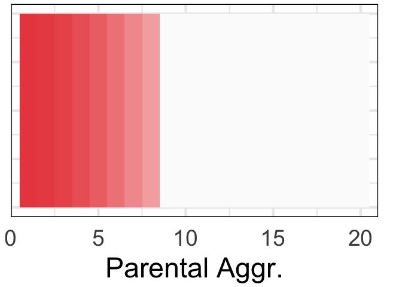<!-- -->

``` r
# nonpoverty
P_derivative_matrix <- matrix(0, nrow = nrow(npov_Att), ncol = ncol(npov_Att) - 1)
# Calculate the derivative for each column
for (i in 1:(ncol(npov_Att) - 1)) {
  # Calculate the differences in x (assuming a constant difference)
  dx <- 1
  # Calculate the differences in y (predicted values)
  dy <- npov_Att[, i + 1] - npov_Att[, i]
  # Calculate the derivatives (slopes)
  derivatives <- dy / dx
  # Store the derivatives in the derivative matrix
  P_derivative_matrix[, i] <- derivatives
}
# calc sig dervs
# get straightfoward of segment where 99% is over 0 or under
positive_counts <- colSums(P_derivative_matrix > 0, na.rm = TRUE)
negative_counts <- colSums(P_derivative_matrix < 0, na.rm = TRUE)
# find where each is 99% or greater
positive_countsSig=positive_counts>9500
negative_countsSig=negative_counts>9500
# make dataframe: 50th percentile of derivatives accompanied by posSig and NegSig vector
data <- apply(P_derivative_matrix, 2, function(x) quantile(x, probs = 0.5))
dervPlotDf<-data.frame(data,positive_countsSig,negative_countsSig)
# if either is sig at 99% plot
dervPlotDf$sig_derivMask=dervPlotDf[,2]+dervPlotDf[,3]>0
# use it to mask calculated derivs
dervPlotDf$sig_deriv=0
dervPlotDf$sig_deriv[dervPlotDf$sig_derivMask]=dervPlotDf$data[dervPlotDf$sig_derivMask]
dervPlotDf$seq=1:(dim(dervPlotDf)[1])
plot<-ggplot(data=dervPlotDf) + geom_raster(aes(x = seq, y = .5, fill = sig_deriv))+
    theme(panel.spacing = unit(-.01,"cm")) +
    scale_fill_gradientn(colors = my_palette(100),limits = c(min(-.1),max(0.1)))+theme_minimal(base_size = 35)+
    xlim(c(0,MaxAtt))+xlab('Parental Attn.')+
    guides(fill=FALSE)+
    theme(axis.title.y = element_blank(),axis.text.y=element_blank())+theme(panel.border = element_rect(color = "black", fill = NA, size = 1))+
    scale_x_continuous(limits = c(0,MaxAtt),expand = expansion(mult = c(0, 0)))
```

    ## Scale for x is already present.
    ## Adding another scale for x, which will replace the existing scale.

``` r
plot + theme(plot.margin = margin(r = 30,l=5,t=5,b=5))
```

    ## Warning: Removed 6 rows containing missing values (`geom_raster()`).

<!-- -->

``` r
# aggression
pov_Agg=pNpFits1[,803:848]
MaxAgg=quantile(masterdf$ASRAggr, probs = 0.99)
plot_bootstraps_par(pov_Agg,45,'Pov. Aggr.',MaxAgg)
```

    ## Warning: Returning more (or less) than 1 row per `summarise()` group was deprecated in
    ## dplyr 1.1.0.
    ## ℹ Please use `reframe()` instead.
    ## ℹ When switching from `summarise()` to `reframe()`, remember that `reframe()`
    ##   always returns an ungrouped data frame and adjust accordingly.
    ## Call `lifecycle::last_lifecycle_warnings()` to see where this warning was
    ## generated.

    ## Warning: Removed 240048 rows containing missing values (`geom_line()`).

<!-- -->

``` r
# nonpoverty parental p
npov_Agg=pNpFits1[,849:894]
plot_bootstraps_par(npov_Agg,45,'Npov. Aggr.',MaxAgg)
```

    ## Warning: Returning more (or less) than 1 row per `summarise()` group was deprecated in
    ## dplyr 1.1.0.
    ## ℹ Please use `reframe()` instead.
    ## ℹ When switching from `summarise()` to `reframe()`, remember that `reframe()`
    ##   always returns an ungrouped data frame and adjust accordingly.
    ## Removed 240048 rows containing missing values (`geom_line()`).
    ## Call `lifecycle::last_lifecycle_warnings()` to see where this warning was
    ## generated.

<!-- -->

``` r
# both merged
plot<-plot_bootstraps_pnp(pov_Agg,npov_Agg,45,'Parental Aggression',MaxAgg)
```

    ## Warning: Returning more (or less) than 1 row per `summarise()` group was deprecated in
    ## dplyr 1.1.0.
    ## ℹ Please use `reframe()` instead.
    ## ℹ When switching from `summarise()` to `reframe()`, remember that `reframe()`
    ##   always returns an ungrouped data frame and adjust accordingly.
    ## Call `lifecycle::last_lifecycle_warnings()` to see where this warning was
    ## generated.

    ## Warning: Returning more (or less) than 1 row per `summarise()` group was deprecated in
    ## dplyr 1.1.0.
    ## ℹ Please use `reframe()` instead.
    ## ℹ When switching from `summarise()` to `reframe()`, remember that `reframe()`
    ##   always returns an ungrouped data frame and adjust accordingly.
    ## Call `lifecycle::last_lifecycle_warnings()` to see where this warning was
    ## generated.

    ## Scale for alpha is already present.
    ## Adding another scale for alpha, which will replace the existing scale.
    ## Scale for y is already present.
    ## Adding another scale for y, which will replace the existing scale.

``` r
plot + theme(plot.margin = margin(r = 30,l=5,t=5,b=5))
```

    ## Warning: Removed 240048 rows containing missing values (`geom_line()`).

    ## Warning: Removed 240048 rows containing missing values (`geom_line()`).

<!-- -->

``` r
# poverty
P_derivative_matrix <- matrix(0, nrow = nrow(pov_Int), ncol = ncol(pov_Int) - 1)
# Calculate the derivative for each column
for (i in 1:(ncol(pov_Int) - 1)) {
  # Calculate the differences in x (assuming a constant difference)
  dx <- 1
  # Calculate the differences in y (predicted values)
  dy <- pov_Int[, i + 1] - pov_Int[, i]
  # Calculate the derivatives (slopes)
  derivatives <- dy / dx
  # Store the derivatives in the derivative matrix
  P_derivative_matrix[, i] <- derivatives
}
# calc sig dervs
# get straightfoward of segment where 99% is over 0 or under
positive_counts <- colSums(P_derivative_matrix > 0, na.rm = TRUE)
negative_counts <- colSums(P_derivative_matrix < 0, na.rm = TRUE)
# find where each is 99% or greater
positive_countsSig=positive_counts>9500
negative_countsSig=negative_counts>9500
# make dataframe: 50th percentile of derivatives accompanied by posSig and NegSig vector
data <- apply(P_derivative_matrix, 2, function(x) quantile(x, probs = 0.5))
dervPlotDf<-data.frame(data,positive_countsSig,negative_countsSig)
# if either is sig at 99% plot
dervPlotDf$sig_derivMask=dervPlotDf[,2]+dervPlotDf[,3]>0
# use it to mask calculated derivs
dervPlotDf$sig_deriv=0
dervPlotDf$sig_deriv[dervPlotDf$sig_derivMask]=dervPlotDf$data[dervPlotDf$sig_derivMask]
dervPlotDf$seq=1:(dim(dervPlotDf)[1])
plot<-ggplot(data=dervPlotDf) + geom_raster(aes(x = seq, y = .5, fill = sig_deriv))+
    theme(panel.spacing = unit(-.01,"cm")) +
    scale_fill_gradientn(colors = my_palette(100),limits = c(min(-.1),max(0.1)))+theme_minimal(base_size = 35)+
    xlim(c(0,MaxAgg))+xlab('Parental Aggr.')+
    guides(fill=FALSE)+
    theme(axis.title.y = element_blank(),axis.text.y=element_blank())+theme(panel.border = element_rect(color = "black", fill = NA, size = 1))+
    scale_x_continuous(limits = c(0,MaxAgg),expand = expansion(mult = c(0, 0)))
```

    ## Scale for x is already present.
    ## Adding another scale for x, which will replace the existing scale.

``` r
plot + theme(plot.margin = margin(r = 30,l=5,t=5,b=5))
```

    ## Warning: Removed 10 rows containing missing values (`geom_raster()`).

<!-- -->

``` r
# nonpoverty
P_derivative_matrix <- matrix(0, nrow = nrow(npov_Agg), ncol = ncol(npov_Agg) - 1)
# Calculate the derivative for each column
for (i in 1:(ncol(npov_Agg) - 1)) {
  # Calculate the differences in x (assuming a constant difference)
  dx <- 1
  # Calculate the differences in y (predicted values)
  dy <- npov_Agg[, i + 1] - npov_Agg[, i]
  # Calculate the derivatives (slopes)
  derivatives <- dy / dx
  # Store the derivatives in the derivative matrix
  P_derivative_matrix[, i] <- derivatives
}
# calc sig dervs
# get straightfoward of segment where 99% is over 0 or under
positive_counts <- colSums(P_derivative_matrix > 0, na.rm = TRUE)
negative_counts <- colSums(P_derivative_matrix < 0, na.rm = TRUE)
# find where each is 99% or greater
positive_countsSig=positive_counts>9500
negative_countsSig=negative_counts>9500
# make dataframe: 50th percentile of derivatives accompanied by posSig and NegSig vector
data <- apply(P_derivative_matrix, 2, function(x) quantile(x, probs = 0.5))
dervPlotDf<-data.frame(data,positive_countsSig,negative_countsSig)
# if either is sig at 99% plot
dervPlotDf$sig_derivMask=dervPlotDf[,2]+dervPlotDf[,3]>0
# use it to mask calculated derivs
dervPlotDf$sig_deriv=0
dervPlotDf$sig_deriv[dervPlotDf$sig_derivMask]=dervPlotDf$data[dervPlotDf$sig_derivMask]
dervPlotDf$seq=1:(dim(dervPlotDf)[1])
plot<-ggplot(data=dervPlotDf) + geom_raster(aes(x = seq, y = .5, fill = sig_deriv))+
    theme(panel.spacing = unit(-.01,"cm")) +
    scale_fill_gradientn(colors = my_palette(100),limits = c(min(-.1),max(0.1)))+theme_minimal(base_size = 35)+
    xlim(c(0,MaxAgg))+xlab('Parental Aggr.')+
    guides(fill=FALSE)+
    theme(axis.title.y = element_blank(),axis.text.y=element_blank())+theme(panel.border = element_rect(color = "black", fill = NA, size = 1))+
    scale_x_continuous(limits = c(0,MaxAgg),expand = expansion(mult = c(0, 0)))
```

    ## Scale for x is already present.
    ## Adding another scale for x, which will replace the existing scale.

``` r
plot + theme(plot.margin = margin(r = 30,l=5,t=5,b=5))
```

    ## Warning: Removed 25 rows containing missing values (`geom_raster()`).

<!-- -->
