Fig2
================
2024-04-18

``` r
plot_bootstraps <- function(data,maxval,Name,maxValuePlot,BorderlineClinical,Clinical) {
  # Melt the data frame
  data_melt <- melt(t(data))
  data_melt$Var1 <- rep(seq(0, maxval), nrow(data))

  # Calculate percentiles
  percentiles <- data %>%
    summarise(across(everything(), quantile, probs = c(0.01, 0.99), na.rm = TRUE))
  
  percentiles_long <- tidyr::pivot_longer(percentiles, cols = everything(), names_to = "Percentile", values_to = "YValue")

  # Add CI column
  data_melt$CI <- 0
  
  # Prepare CIs for insertion
  CIs <- data.frame(rep(seq(0, maxval), 2), c(rep(10001, maxval+1), rep(10002, maxval+1)), percentiles_long$YValue, rep(1, ((maxval+1)*2)))
  colnames(CIs) <- colnames(data_melt)
  
  # Add CIs
  data_melt2 <- rbind(data_melt, CIs)
  
  # Convert CI column to factor
  data_melt2$CI <- as.factor(data_melt2$CI)
  
  # Plotting the lines
  ggplot(data = data_melt2, aes(x = Var1, y = value, group = Var2, color = Var2)) +
    geom_line(aes(alpha = CI), show.legend = FALSE) +
    scale_color_viridis_c(option = "inferno", direction = -1) +
    scale_alpha_manual(values = c(0.01, 1), guide = FALSE) + ylim(c(-1.5,1.5)) +
    theme_minimal(base_size=34) + 
    ylab(expression(italic(g)))+xlab(Name)+
    geom_vline(xintercept = BorderlineClinical, linetype = "dashed")+
    geom_vline(xintercept = Clinical, linetype = "dashed")+
    theme(panel.border = element_rect(color = "black", fill = NA, size = 1))+
    scale_x_continuous(limits = c(0,maxValuePlot),expand = expansion(mult = c(0, 0)))
}

# and and a derivatives version. only change is ylim
plot_bootstrapDerivs <- function(data,maxval,Name,maxValuePlot,BorderlineClinical,Clinical) {
  # Melt the data frame
  data_melt <- melt(t(data))
  data_melt$Var1 <- rep(seq(1, maxval), nrow(data))

  # Calculate percentiles
  percentiles <- data %>%
    summarise(across(everything(), quantile, probs = c(0.01, 0.99), na.rm = TRUE))
  
  percentiles_long <- tidyr::pivot_longer(percentiles, cols = everything(), names_to = "Percentile", values_to = "YValue")

  # Add CI column
  data_melt$CI <- 0
  
  # Prepare CIs for insertion
  CIs <- data.frame(rep(seq(0, maxval), 2), c(rep(10001, maxval+1), rep(10002, maxval+1)), percentiles_long$YValue, rep(1, ((maxval+1)*2)))
  colnames(CIs) <- colnames(data_melt)
  
  # Add CIs
  data_melt2 <- rbind(data_melt, CIs)
  
  # Convert CI column to factor
  data_melt2$CI <- as.factor(data_melt2$CI)
  
  # Plotting the lines
  ggplot(data = data_melt2, aes(x = Var1, y = value, group = Var2, color = Var2)) +
    geom_line(aes(alpha = CI), show.legend = FALSE) +
    scale_color_viridis_c(option = "inferno", direction = -1) +
    scale_alpha_manual(values = c(0.01, 1), guide = FALSE) + ylim(c(-.15,.15)) +
    theme_minimal(base_size=35) + 
    ylab(expression(italic(g)))+xlab(Name)+
    geom_vline(xintercept = BorderlineClinical, linetype = "dashed")+
    geom_vline(xintercept = Clinical, linetype = "dashed")+
    theme(panel.border = element_rect(color = "black", fill = NA, size = 1))+
    scale_x_continuous(limits = c(0,maxValuePlot),expand = expansion(mult = c(0, 0)))
}


find_furthest_nonzero <- function(data) {
  numZeros=colSums(data==0)
  isZeroZeros=numZeros==0
  furthest_nonzero=sum(isZeroZeros)
}

# set colors
my_palette <- colorRampPalette(colors = c("#051099", "#1d5cb7", "white", "#e41a1c", "#a80009"))
```

``` r
library(ggplot2)
library(gganimate)
library(dplyr)
```

    ## 
    ## Attaching package: 'dplyr'

    ## The following objects are masked from 'package:stats':
    ## 
    ##     filter, lag

    ## The following objects are masked from 'package:base':
    ## 
    ##     intersect, setdiff, setequal, union

``` r
library(reshape2)
# load in masterdf (saved out from sample construction)
masterdf=readRDS('~/gp_masterdf.rds')
# load in data
Fits=readRDS('~/Downloads/gpR1/gpFitBoots_sRE.rds')
# convert all cbcl scores to numeric
masterdf$cbcl_scr_syn_totprob_r=as.numeric(masterdf$cbcl_scr_syn_totprob_r)
masterdf$cbcl_scr_syn_internal_r=as.numeric(masterdf$cbcl_scr_syn_internal_r)
masterdf$cbcl_scr_syn_external_r=as.numeric(masterdf$cbcl_scr_syn_external_r)
masterdf$cbcl_scr_syn_somatic_r=as.numeric(masterdf$cbcl_scr_syn_somatic_r)
masterdf$cbcl_scr_syn_anxdep_r=as.numeric(masterdf$cbcl_scr_syn_anxdep_r)
masterdf$cbcl_scr_syn_thought_r=as.numeric(masterdf$cbcl_scr_syn_thought_r)
masterdf$cbcl_scr_syn_withdep_r=as.numeric(masterdf$cbcl_scr_syn_withdep_r)
masterdf$cbcl_scr_syn_social_r=as.numeric(masterdf$cbcl_scr_syn_social_r)
masterdf$cbcl_scr_syn_attention_r=as.numeric(masterdf$cbcl_scr_syn_attention_r)
masterdf$cbcl_scr_syn_rulebreak_r=as.numeric(masterdf$cbcl_scr_syn_rulebreak_r)
masterdf$cbcl_scr_syn_aggressive_r=as.numeric(masterdf$cbcl_scr_syn_aggressive_r)
```

``` r
# find mean shape and plot it: p
PFits=Fits[,1:162]
IFits=Fits[,163:214]
EFits=Fits[,215:262]
SomFits=Fits[,263:279]
AnxFits=Fits[,280:305]
ThoFits=Fits[,306:328]
WitFits=Fits[,329:345]
SocFits=Fits[,346:363]
AttFits=Fits[,364:383]
RulFits=Fits[,384:402]
AggFits=Fits[,403:435]

# set to 99th percentile for accuracy
MaxP=quantile(masterdf$cbcl_scr_syn_totprob_r,.99)
MaxI=quantile(masterdf$cbcl_scr_syn_internal_r,.99)
MaxE=quantile(masterdf$cbcl_scr_syn_external_r,.99)
MaxAnx=quantile(masterdf$cbcl_scr_syn_anxdep_r,.99)
MaxTho=quantile(masterdf$cbcl_scr_syn_thought_r,.99)
MaxWit=quantile(masterdf$cbcl_scr_syn_withdep_r,.99)
MaxSoc=quantile(masterdf$cbcl_scr_syn_social_r,.99)
MaxSom=quantile(masterdf$cbcl_scr_syn_somatic_r,.99)
MaxAtt=quantile(masterdf$cbcl_scr_syn_attention_r,.99)
MaxRul=quantile(masterdf$cbcl_scr_syn_rulebreak_r,.99)
MaxAgg=quantile(masterdf$cbcl_scr_syn_aggressive_r,.99)

# pull clinical cutoff from master df: t scores > 65 = borderline clinical, 69 = clinical
masterdfP_bc<-masterdf[masterdf$cbcl_scr_syn_totprob_t==65,]
masterdfP_c<-masterdf[masterdf$cbcl_scr_syn_totprob_t==69,]
masterdfI_bc<-masterdf[masterdf$cbcl_scr_syn_internal_t==65,]
masterdfI_c<-masterdf[masterdf$cbcl_scr_syn_internal_t==69,]
masterdfE_bc<-masterdf[masterdf$cbcl_scr_syn_external_t==65,]
masterdfE_c<-masterdf[masterdf$cbcl_scr_syn_external_t==69,]
masterdfAnx_bc<-masterdf[masterdf$cbcl_scr_syn_anxdep_t==65,]
masterdfAnx_c<-masterdf[masterdf$cbcl_scr_syn_anxdep_t==69,]
# note no one has t==65 in this dataset for thought
masterdfTho_bc<-masterdf[masterdf$cbcl_scr_syn_thought_t==66,]
masterdfTho_c<-masterdf[masterdf$cbcl_scr_syn_thought_t==69,]
# note no one has t==65 in this dataset for withdrawn depression
masterdfWit_bc<-masterdf[masterdf$cbcl_scr_syn_withdep_t==66,]
masterdfWit_c<-masterdf[masterdf$cbcl_scr_syn_withdep_t==69,]
masterdfSom_bc<-masterdf[masterdf$cbcl_scr_syn_somatic_t==65,]
# no one has t==69
masterdfSom_c<-masterdf[masterdf$cbcl_scr_syn_somatic_t==70,]
masterdfSoc_bc<-masterdf[masterdf$cbcl_scr_syn_social_t==65,]
masterdfSoc_c<-masterdf[masterdf$cbcl_scr_syn_social_t==69,]
masterdfAtt_bc<-masterdf[masterdf$cbcl_scr_syn_attention_t==65,]
masterdfAtt_c<-masterdf[masterdf$cbcl_scr_syn_attention_t==69,]
masterdfRul_bc<-masterdf[masterdf$cbcl_scr_syn_rulebreak_t==65,]
masterdfRul_c<-masterdf[masterdf$cbcl_scr_syn_rulebreak_t==69,]
masterdfAgg_bc<-masterdf[masterdf$cbcl_scr_syn_aggressive_t==65,]
masterdfAgg_c<-masterdf[masterdf$cbcl_scr_syn_aggressive_t==69,]

# borderline clinical and clinical cutoffs
Pbc=mean(masterdfP_bc$cbcl_scr_syn_totprob_r)
Pc=mean(masterdfP_c$cbcl_scr_syn_totprob_r)
Ibc=mean(masterdfI_bc$cbcl_scr_syn_internal_r)
Ic=mean(masterdfI_c$cbcl_scr_syn_internal_r)
Ebc=mean(masterdfE_bc$cbcl_scr_syn_external_r)
Ec=mean(masterdfE_c$cbcl_scr_syn_external_r)
AnxBc=mean(as.numeric(masterdfAnx_bc$cbcl_scr_syn_anxdep_r))
AnxC=mean(as.numeric(masterdfAnx_c$cbcl_scr_syn_anxdep_r))
ThoBc=mean(as.numeric(masterdfTho_bc$cbcl_scr_syn_thought_r))
ThoC=mean(as.numeric(masterdfTho_c$cbcl_scr_syn_thought_r))
WitBc=mean(as.numeric(masterdfWit_bc$cbcl_scr_syn_withdep_r))
WitC=mean(as.numeric(masterdfWit_c$cbcl_scr_syn_withdep_r))
SomBc=mean(as.numeric(masterdfSom_bc$cbcl_scr_syn_somatic_r))
SomC=mean(as.numeric(masterdfSom_c$cbcl_scr_syn_somatic_r))
SocBc=mean(as.numeric(masterdfSom_bc$cbcl_scr_syn_social_r))
SocC=mean(as.numeric(masterdfSoc_c$cbcl_scr_syn_social_r))
AttBc=mean(as.numeric(masterdfAtt_bc$cbcl_scr_syn_attention_r))
AttC=mean(as.numeric(masterdfAtt_c$cbcl_scr_syn_attention_r))
RulBc=mean(as.numeric(masterdfRul_bc$cbcl_scr_syn_rulebreak_r))
RulC=mean(as.numeric(masterdfRul_c$cbcl_scr_syn_rulebreak_r))
AggBc=mean(as.numeric(masterdfAgg_bc$cbcl_scr_syn_aggressive_r))
AggC=mean(as.numeric(masterdfAgg_c$cbcl_scr_syn_aggressive_r))

# actually plot em
plot_bootstraps(PFits,161,'Total Problems',MaxP,Pbc,Pc)
```

    ## Warning: There was 1 warning in `summarise()`.
    ## ℹ In argument: `across(everything(), quantile, probs = c(0.01, 0.99), na.rm =
    ##   TRUE)`.
    ## Caused by warning:
    ## ! The `...` argument of `across()` is deprecated as of dplyr 1.1.0.
    ## Supply arguments directly to `.fns` through an anonymous function instead.
    ## 
    ##   # Previously
    ##   across(a:b, mean, na.rm = TRUE)
    ## 
    ##   # Now
    ##   across(a:b, \(x) mean(x, na.rm = TRUE))

    ## Warning: Returning more (or less) than 1 row per `summarise()` group was deprecated in
    ## dplyr 1.1.0.
    ## ℹ Please use `reframe()` instead.
    ## ℹ When switching from `summarise()` to `reframe()`, remember that `reframe()`
    ##   always returns an ungrouped data frame and adjust accordingly.
    ## Call `lifecycle::last_lifecycle_warnings()` to see where this warning was
    ## generated.

    ## Warning: The `size` argument of `element_rect()` is deprecated as of ggplot2 3.4.0.
    ## ℹ Please use the `linewidth` argument instead.
    ## This warning is displayed once every 8 hours.
    ## Call `lifecycle::last_lifecycle_warnings()` to see where this warning was
    ## generated.

    ## Warning: Removed 820164 rows containing missing values (`geom_line()`).

    ## Warning: The `guide` argument in `scale_*()` cannot be `FALSE`. This was deprecated in
    ## ggplot2 3.3.4.
    ## ℹ Please use "none" instead.
    ## This warning is displayed once every 8 hours.
    ## Call `lifecycle::last_lifecycle_warnings()` to see where this warning was
    ## generated.

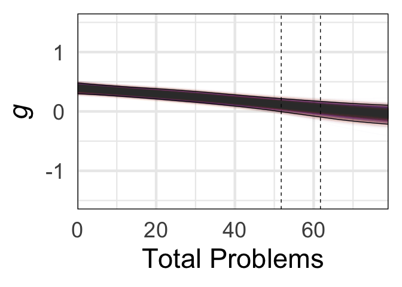<!-- -->

``` r
plot_bootstraps(IFits,51,'Internalizing',MaxI,Ibc,Ic)
```

    ## Warning: Returning more (or less) than 1 row per `summarise()` group was deprecated in
    ## dplyr 1.1.0.
    ## ℹ Please use `reframe()` instead.
    ## ℹ When switching from `summarise()` to `reframe()`, remember that `reframe()`
    ##   always returns an ungrouped data frame and adjust accordingly.
    ## Call `lifecycle::last_lifecycle_warnings()` to see where this warning was
    ## generated.

    ## Warning: Removed 260052 rows containing missing values (`geom_line()`).

<!-- -->

``` r
plot_bootstraps(EFits,47,'Externalizing',MaxE,Ebc,Ec)
```

    ## Warning: Returning more (or less) than 1 row per `summarise()` group was deprecated in
    ## dplyr 1.1.0.
    ## ℹ Please use `reframe()` instead.
    ## ℹ When switching from `summarise()` to `reframe()`, remember that `reframe()`
    ##   always returns an ungrouped data frame and adjust accordingly.
    ## Call `lifecycle::last_lifecycle_warnings()` to see where this warning was
    ## generated.

    ## Warning: Removed 210042 rows containing missing values (`geom_line()`).

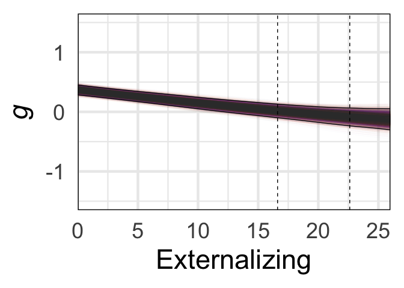<!-- -->

``` r
# for supplemental figure
plot_bootstraps(SomFits,16,"Somatic",MaxSom,SomBc,SomC)
```

    ## Warning: Returning more (or less) than 1 row per `summarise()` group was deprecated in
    ## dplyr 1.1.0.
    ## ℹ Please use `reframe()` instead.
    ## ℹ When switching from `summarise()` to `reframe()`, remember that `reframe()`
    ##   always returns an ungrouped data frame and adjust accordingly.
    ## Call `lifecycle::last_lifecycle_warnings()` to see where this warning was
    ## generated.

    ## Warning: Removed 80016 rows containing missing values (`geom_line()`).

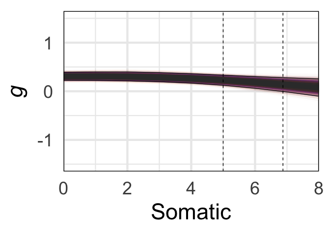<!-- -->

``` r
plot_bootstraps(AnxFits,25,'Anxious Depression',MaxAnx,AnxBc,AnxC)
```

    ## Warning: Returning more (or less) than 1 row per `summarise()` group was deprecated in
    ## dplyr 1.1.0.
    ## ℹ Please use `reframe()` instead.
    ## ℹ When switching from `summarise()` to `reframe()`, remember that `reframe()`
    ##   always returns an ungrouped data frame and adjust accordingly.
    ## Call `lifecycle::last_lifecycle_warnings()` to see where this warning was
    ## generated.

    ## Warning: Removed 120024 rows containing missing values (`geom_line()`).

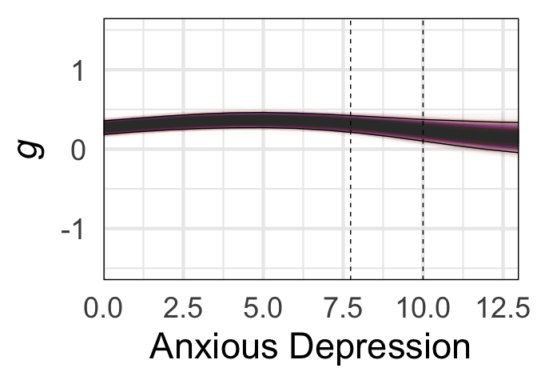<!-- -->

``` r
plot_bootstraps(ThoFits,22,'Thought',MaxTho,ThoBc,ThoC)
```

    ## Warning: Returning more (or less) than 1 row per `summarise()` group was deprecated in
    ## dplyr 1.1.0.
    ## ℹ Please use `reframe()` instead.
    ## ℹ When switching from `summarise()` to `reframe()`, remember that `reframe()`
    ##   always returns an ungrouped data frame and adjust accordingly.
    ## Call `lifecycle::last_lifecycle_warnings()` to see where this warning was
    ## generated.

    ## Warning: Removed 130026 rows containing missing values (`geom_line()`).

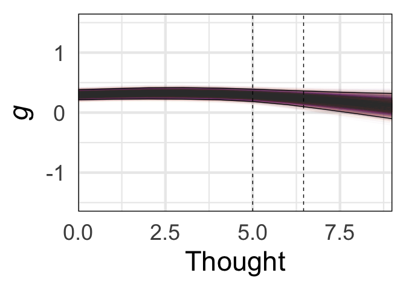<!-- -->

``` r
plot_bootstraps(WitFits,16,"Withdrawn Depression",MaxWit,WitBc,WitC)
```

    ## Warning: Returning more (or less) than 1 row per `summarise()` group was deprecated in
    ## dplyr 1.1.0.
    ## ℹ Please use `reframe()` instead.
    ## ℹ When switching from `summarise()` to `reframe()`, remember that `reframe()`
    ##   always returns an ungrouped data frame and adjust accordingly.
    ## Call `lifecycle::last_lifecycle_warnings()` to see where this warning was
    ## generated.

    ## Warning: Removed 80016 rows containing missing values (`geom_line()`).

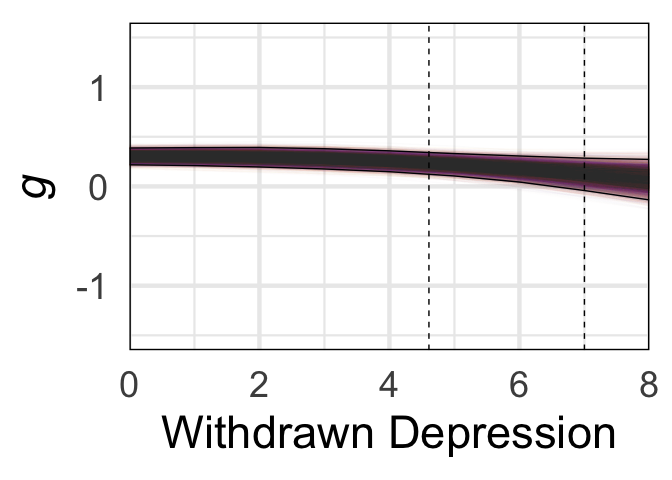<!-- -->

``` r
plot_bootstraps(SocFits,17,'Social',MaxSoc,SocBc,SocC)
```

    ## Warning: Returning more (or less) than 1 row per `summarise()` group was deprecated in
    ## dplyr 1.1.0.
    ## ℹ Please use `reframe()` instead.
    ## ℹ When switching from `summarise()` to `reframe()`, remember that `reframe()`
    ##   always returns an ungrouped data frame and adjust accordingly.
    ## Call `lifecycle::last_lifecycle_warnings()` to see where this warning was
    ## generated.

    ## Warning: Removed 70014 rows containing missing values (`geom_line()`).

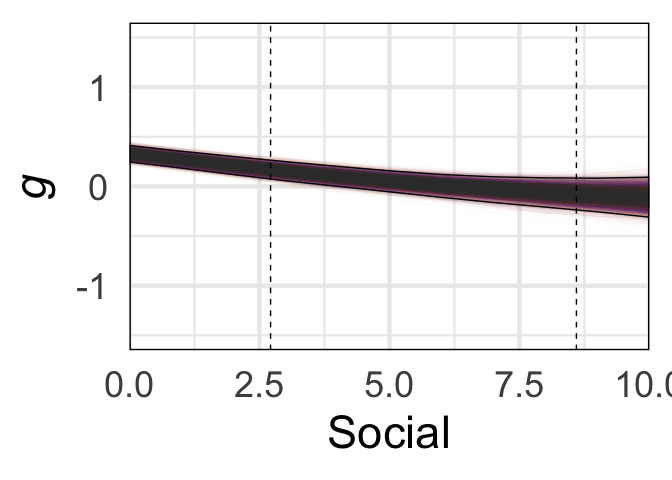<!-- -->

``` r
###
# re-run with MaxAtt instead
###
plot_bootstraps(AttFits,19,'Attention',MaxAtt,AttBc,AttC)
```

    ## Warning: Returning more (or less) than 1 row per `summarise()` group was deprecated in
    ## dplyr 1.1.0.
    ## ℹ Please use `reframe()` instead.
    ## ℹ When switching from `summarise()` to `reframe()`, remember that `reframe()`
    ##   always returns an ungrouped data frame and adjust accordingly.
    ## Call `lifecycle::last_lifecycle_warnings()` to see where this warning was
    ## generated.

    ## Warning: Removed 50010 rows containing missing values (`geom_line()`).

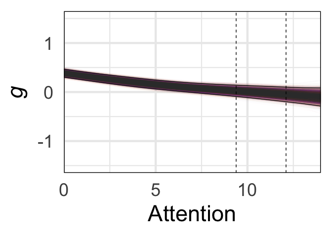<!-- -->

``` r
plot_bootstraps(RulFits,18,'Rule Breaking',MaxRul,RulBc,RulC)
```

    ## Warning: Returning more (or less) than 1 row per `summarise()` group was deprecated in
    ## dplyr 1.1.0.
    ## ℹ Please use `reframe()` instead.
    ## ℹ When switching from `summarise()` to `reframe()`, remember that `reframe()`
    ##   always returns an ungrouped data frame and adjust accordingly.
    ## Call `lifecycle::last_lifecycle_warnings()` to see where this warning was
    ## generated.

    ## Warning: Removed 100020 rows containing missing values (`geom_line()`).

    ## Warning: Removed 1 rows containing missing values (`geom_vline()`).

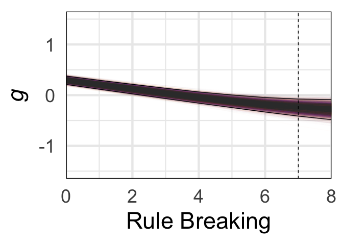<!-- -->

``` r
plot_bootstraps(AggFits,32,'Aggression',MaxAgg,AggBc,AggC)
```

    ## Warning: Returning more (or less) than 1 row per `summarise()` group was deprecated in
    ## dplyr 1.1.0.
    ## ℹ Please use `reframe()` instead.
    ## ℹ When switching from `summarise()` to `reframe()`, remember that `reframe()`
    ##   always returns an ungrouped data frame and adjust accordingly.
    ## Call `lifecycle::last_lifecycle_warnings()` to see where this warning was
    ## generated.

    ## Warning: Removed 140028 rows containing missing values (`geom_line()`).

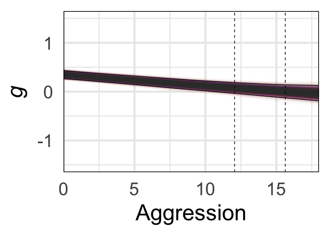<!-- -->

``` r
# calculate derivatives

# p-factor
P_derivative_matrix <- matrix(0, nrow = nrow(PFits), ncol = ncol(PFits) - 1)
# Calculate the derivative for each column
for (i in 1:(ncol(PFits) - 1)) {
  # Calculate the differences in x (assuming a constant difference)
  dx <- 1
  # Calculate the differences in y (predicted values)
  dy <- PFits[, i + 1] - PFits[, i]
  # Calculate the derivatives (slopes)
  derivatives <- dy / dx
  # Store the derivatives in the derivative matrix
  P_derivative_matrix[, i] <- derivatives
}
# calc sig dervs
# get straightfoward of segment where 99% is over 0 or under
positive_counts <- colSums(P_derivative_matrix > 0, na.rm = TRUE)
negative_counts <- colSums(P_derivative_matrix < 0, na.rm = TRUE)
# find where each is 99% or greater
positive_countsSig=positive_counts>9900
negative_countsSig=negative_counts>9900
# make dataframe: 50th percentile of derivatives accompanied by posSig and NegSig vector
data <- apply(P_derivative_matrix, 2, function(x) quantile(x, probs = 0.5))
dervPlotDf<-data.frame(data,positive_countsSig,negative_countsSig)
# if either is sig at 99% plot
dervPlotDf$sig_derivMask=dervPlotDf[,2]+dervPlotDf[,3]>0
# use it to mask calculated derivs
dervPlotDf$sig_deriv=0
dervPlotDf$sig_deriv[dervPlotDf$sig_derivMask]=dervPlotDf$data[dervPlotDf$sig_derivMask]
dervPlotDf$seq=1:(dim(dervPlotDf)[1])
ggplot(data=dervPlotDf) + geom_raster(aes(x = seq, y = .5, fill = sig_deriv))+
    theme(panel.spacing = unit(-.01,"cm")) +
    scale_fill_gradientn(colors = my_palette(100),limits = c(min(-.1),max(0.1)))+theme_minimal(base_size = 35)+
    xlim(c(0,MaxP))+xlab('Total Problems')+
    guides(fill=FALSE)+
    theme(axis.title.y = element_blank(),axis.text.y=element_blank())+theme(panel.border = element_rect(color = "black", fill = NA, size = 1))+
    scale_x_continuous(limits = c(0,MaxP),expand = expansion(mult = c(0, 0)))
```

    ## Warning: The `<scale>` argument of `guides()` cannot be `FALSE`. Use "none" instead as
    ## of ggplot2 3.3.4.
    ## This warning is displayed once every 8 hours.
    ## Call `lifecycle::last_lifecycle_warnings()` to see where this warning was
    ## generated.

    ## Scale for x is already present.
    ## Adding another scale for x, which will replace the existing scale.

    ## Warning: Removed 83 rows containing missing values (`geom_raster()`).

<!-- -->

``` r
########################

# Internalizing
Int_derivative_matrix <- matrix(0, nrow = nrow(IFits), ncol = ncol(IFits) - 1)
# Calculate the derivative for each column
for (i in 1:(ncol(IFits) - 1)) {
  # Calculate the differences in x (assuming a constant difference)
  dx <- 1
  # Calculate the differences in y (predicted values)
  dy <- IFits[, i + 1] - IFits[, i]
  # Calculate the derivatives (slopes)
  derivatives <- dy / dx
  # Store the derivatives in the derivative matrix
  Int_derivative_matrix[, i] <- derivatives
}
# calc sig dervs
# get straightfoward of segment where 99% is over 0 or under
positive_counts <- colSums(Int_derivative_matrix > 0, na.rm = TRUE)
negative_counts <- colSums(Int_derivative_matrix < 0, na.rm = TRUE)
# find where each is 99% or greater
positive_countsSig=positive_counts>9900
negative_countsSig=negative_counts>9900
# make dataframe: 50th percentile of derivatives accompanied by posSig and NegSig vector
data <- apply(Int_derivative_matrix, 2, function(x) quantile(x, probs = 0.5))
dervPlotDf<-data.frame(data,positive_countsSig,negative_countsSig)
# if either is sig at 99% plot
dervPlotDf$sig_derivMask=dervPlotDf[,2]+dervPlotDf[,3]>0
# use it to mask calculated derivs
dervPlotDf$sig_deriv=0
dervPlotDf$sig_deriv[dervPlotDf$sig_derivMask]=dervPlotDf$data[dervPlotDf$sig_derivMask]
dervPlotDf$seq=1:(dim(dervPlotDf)[1])
ggplot(data=dervPlotDf) + geom_raster(aes(x = seq, y = .5, fill = sig_deriv))+
    theme(panel.spacing = unit(-.01,"cm")) +
    scale_fill_gradientn(colors = my_palette(100),limits = c(min(-.1),max(0.1)))+theme_minimal(base_size = 35)+
    xlim(c(0,MaxI))+xlab('Internalizing')+
    guides(fill=FALSE)+
    theme(axis.title.y = element_blank(),axis.text.y=element_blank())+theme(panel.border = element_rect(color = "black", fill = NA, size = 1))+
    scale_x_continuous(limits = c(0,MaxI),expand = expansion(mult = c(0, 0)))
```

    ## Scale for x is already present.
    ## Adding another scale for x, which will replace the existing scale.

    ## Warning: Removed 27 rows containing missing values (`geom_raster()`).

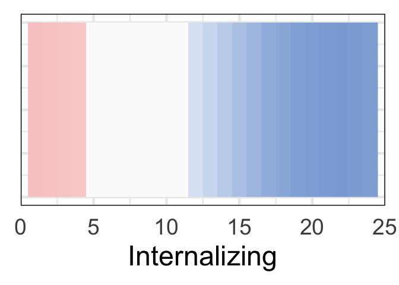<!-- -->

``` r
########################

# Externalizing
Ext_derivative_matrix <- matrix(0, nrow = nrow(EFits), ncol = ncol(EFits) - 1)
# Calculate the derivative for each column
for (i in 1:(ncol(EFits) - 1)) {
  # Calculate the differences in x (assuming a constant difference)
  dx <- 1
  # Calculate the differences in y (predicted values)
  dy <- EFits[, i + 1] - EFits[, i]
  # Calculate the derivatives (slopes)
  derivatives <- dy / dx
  # Store the derivatives in the derivative matrix
  Ext_derivative_matrix[, i] <- derivatives
}
# calc sig dervs
# get straightfoward of segment where 99% is over 0 or under
positive_counts <- colSums(Ext_derivative_matrix > 0, na.rm = TRUE)
negative_counts <- colSums(Ext_derivative_matrix < 0, na.rm = TRUE)
# find where each is 99% or greater
positive_countsSig=positive_counts>9900
negative_countsSig=negative_counts>9900
# make dataframe: 50th percentile of derivatives accompanied by posSig and NegSig vector
data <- apply(Ext_derivative_matrix, 2, function(x) quantile(x, probs = 0.5))
dervPlotDf<-data.frame(data,positive_countsSig,negative_countsSig)
# if either is sig at 99% plot
dervPlotDf$sig_derivMask=dervPlotDf[,2]+dervPlotDf[,3]>0
# use it to mask calculated derivs
dervPlotDf$sig_deriv=0
dervPlotDf$sig_deriv[dervPlotDf$sig_derivMask]=dervPlotDf$data[dervPlotDf$sig_derivMask]
dervPlotDf$seq=1:(dim(dervPlotDf)[1])
ggplot(data=dervPlotDf) + geom_raster(aes(x = seq, y = .5, fill = sig_deriv))+
    theme(panel.spacing = unit(-.01,"cm")) +
    scale_fill_gradientn(colors = my_palette(100),limits = c(min(-.1),max(0.1)))+theme_minimal(base_size = 35)+
    xlim(c(0,MaxE))+xlab('Externalizing')+
    guides(fill=FALSE)+
    theme(axis.title.y = element_blank(),axis.text.y=element_blank())+theme(panel.border = element_rect(color = "black", fill = NA, size = 1))+
    scale_x_continuous(limits = c(0,MaxE),expand = expansion(mult = c(0, 0)))
```

    ## Scale for x is already present.
    ## Adding another scale for x, which will replace the existing scale.

    ## Warning: Removed 22 rows containing missing values (`geom_raster()`).

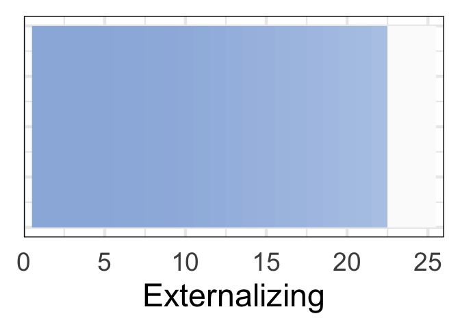<!-- -->

``` r
########################

# Somatic
Som_derivative_matrix <- matrix(0, nrow = nrow(SomFits), ncol = ncol(SomFits) - 1)
# Calculate the derivative for each column
for (i in 1:(ncol(SomFits) - 1)) {
  # Calculate the differences in x (assuming a constant difference)
  dx <- 1
  # Calculate the differences in y (predicted values)
  dy <- SomFits[, i + 1] - SomFits[, i]
  # Calculate the derivatives (slopes)
  derivatives <- dy / dx
  # Store the derivatives in the derivative matrix
  Som_derivative_matrix[, i] <- derivatives
}
# calc sig dervs
# get straightfoward of segment where 99% is over 0 or under
positive_counts <- colSums(Som_derivative_matrix > 0, na.rm = TRUE)
negative_counts <- colSums(Som_derivative_matrix < 0, na.rm = TRUE)
# find where each is 99% or greater
positive_countsSig=positive_counts>9900
negative_countsSig=negative_counts>9900
# make dataframe: 50th percentile of derivatives accompanied by posSig and NegSig vector
data <- apply(Som_derivative_matrix, 2, function(x) quantile(x, probs = 0.5))
dervPlotDf<-data.frame(data,positive_countsSig,negative_countsSig)
# if either is sig at 99% plot
dervPlotDf$sig_derivMask=dervPlotDf[,2]+dervPlotDf[,3]>0
# use it to mask calculated derivs
dervPlotDf$sig_deriv=0
dervPlotDf$sig_deriv[dervPlotDf$sig_derivMask]=dervPlotDf$data[dervPlotDf$sig_derivMask]
dervPlotDf$seq=1:(dim(dervPlotDf)[1])
ggplot(data=dervPlotDf) + geom_raster(aes(x = seq, y = .5, fill = sig_deriv))+
    theme(panel.spacing = unit(-.01,"cm")) +
    scale_fill_gradientn(colors = my_palette(100),limits = c(min(-.1),max(0.1)))+theme_minimal(base_size = 35)+
    xlim(c(0,MaxSom))+xlab('Somatic')+
    guides(fill=FALSE)+
    theme(axis.title.y = element_blank(),axis.text.y=element_blank())+theme(panel.border = element_rect(color = "black", fill = NA, size = 1))+
    scale_x_continuous(limits = c(0,MaxSom),expand = expansion(mult = c(0, 0)))
```

    ## Scale for x is already present.
    ## Adding another scale for x, which will replace the existing scale.

    ## Warning: Removed 9 rows containing missing values (`geom_raster()`).

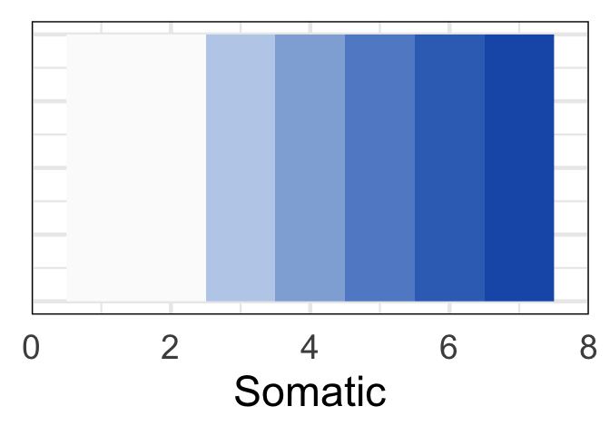<!-- -->

``` r
########################

# AnxDep
AnxDep_derivative_matrix <- matrix(0, nrow = nrow(AnxFits), ncol = ncol(AnxFits) - 1)
# Calculate the derivative for each column
for (i in 1:(ncol(AnxFits) - 1)) {
  # Calculate the differences in x (assuming a constant difference)
  dx <- 1
  # Calculate the differences in y (predicted values)
  dy <- AnxFits[, i + 1] - AnxFits[, i]
  # Calculate the derivatives (slopes)
  derivatives <- dy / dx
  # Store the derivatives in the derivative matrix
  AnxDep_derivative_matrix[, i] <- derivatives
}
# calc sig dervs
# get straightfoward of segment where 99% is over 0 or under
positive_counts <- colSums(AnxDep_derivative_matrix > 0, na.rm = TRUE)
negative_counts <- colSums(AnxDep_derivative_matrix < 0, na.rm = TRUE)
# find where each is 99% or greater
positive_countsSig=positive_counts>9900
negative_countsSig=negative_counts>9900
# make dataframe: 50th percentile of derivatives accompanied by posSig and NegSig vector
data <- apply(AnxDep_derivative_matrix, 2, function(x) quantile(x, probs = 0.5))
dervPlotDf<-data.frame(data,positive_countsSig,negative_countsSig)
# if either is sig at 99% plot
dervPlotDf$sig_derivMask=dervPlotDf[,2]+dervPlotDf[,3]>0
# use it to mask calculated derivs
dervPlotDf$sig_deriv=0
dervPlotDf$sig_deriv[dervPlotDf$sig_derivMask]=dervPlotDf$data[dervPlotDf$sig_derivMask]
dervPlotDf$seq=1:(dim(dervPlotDf)[1])
ggplot(data=dervPlotDf) + geom_raster(aes(x = seq, y = .5, fill = sig_deriv))+
    theme(panel.spacing = unit(-.01,"cm")) +
    scale_fill_gradientn(colors = my_palette(100),limits = c(min(-.1),max(0.1)))+theme_minimal(base_size = 35)+
    xlim(c(0,MaxAnx))+xlab('Anxious Depression')+
    guides(fill=FALSE)+
    theme(axis.title.y = element_blank(),axis.text.y=element_blank())+theme(panel.border = element_rect(color = "black", fill = NA, size = 1))+
    scale_x_continuous(limits = c(0,MaxAnx),expand = expansion(mult = c(0, 0)),n.breaks = 4)
```

    ## Scale for x is already present.
    ## Adding another scale for x, which will replace the existing scale.

    ## Warning: Removed 13 rows containing missing values (`geom_raster()`).

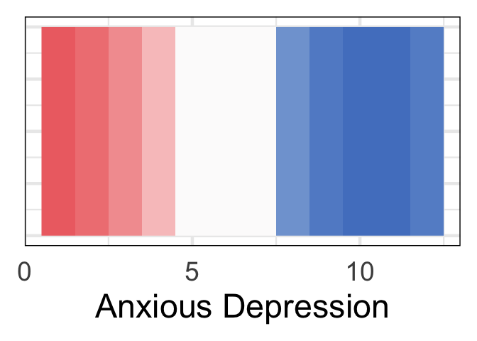<!-- -->

``` r
# saved at 420 x 200 for extra xlabel space
########################

# Thought
Thought_derivative_matrix <- matrix(0, nrow = nrow(ThoFits), ncol = ncol(ThoFits) - 1)
# Calculate the derivative for each column
for (i in 1:(ncol(ThoFits) - 1)) {
  # Calculate the differences in x (assuming a constant difference)
  dx <- 1
  # Calculate the differences in y (predicted values)
  dy <- ThoFits[, i + 1] - ThoFits[, i]
  # Calculate the derivatives (slopes)
  derivatives <- dy / dx
  # Store the derivatives in the derivative matrix
  Thought_derivative_matrix[, i] <- derivatives
}
# calc sig dervs
# get straightfoward of segment where 99% is over 0 or under
positive_counts <- colSums(Thought_derivative_matrix > 0, na.rm = TRUE)
negative_counts <- colSums(Thought_derivative_matrix < 0, na.rm = TRUE)
# find where each is 99% or greater
positive_countsSig=positive_counts>9900
negative_countsSig=negative_counts>9900
# make dataframe: 50th percentile of derivatives accompanied by posSig and NegSig vector
data <- apply(Thought_derivative_matrix, 2, function(x) quantile(x, probs = 0.5))
dervPlotDf<-data.frame(data,positive_countsSig,negative_countsSig)
# if either is sig at 99% plot
dervPlotDf$sig_derivMask=dervPlotDf[,2]+dervPlotDf[,3]>0
# use it to mask calculated derivs
dervPlotDf$sig_deriv=0
dervPlotDf$sig_deriv[dervPlotDf$sig_derivMask]=dervPlotDf$data[dervPlotDf$sig_derivMask]
dervPlotDf$seq=1:(dim(dervPlotDf)[1])
ggplot(data=dervPlotDf) + geom_raster(aes(x = seq, y = .5, fill = sig_deriv))+
    theme(panel.spacing = unit(-.01,"cm")) +
    scale_fill_gradientn(colors = my_palette(100),limits = c(min(-.1),max(0.1)))+theme_minimal(base_size = 35)+
    xlim(c(0,MaxTho))+xlab('Thought')+
    guides(fill=FALSE)+
    theme(axis.title.y = element_blank(),axis.text.y=element_blank())+theme(panel.border = element_rect(color = "black", fill = NA, size = 1))+
    scale_x_continuous(limits = c(0,MaxTho),expand = expansion(mult = c(0, 0)),n.breaks = 3)
```

    ## Scale for x is already present.
    ## Adding another scale for x, which will replace the existing scale.

    ## Warning: Removed 14 rows containing missing values (`geom_raster()`).

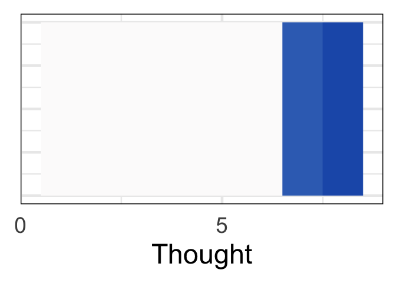<!-- -->

``` r
########################

# Withdrawn depression
WithDep_derivative_matrix <- matrix(0, nrow = nrow(WitFits), ncol = ncol(WitFits) - 1)
# Calculate the derivative for each column
for (i in 1:(ncol(WitFits) - 1)) {
  # Calculate the differences in x (assuming a constant difference)
  dx <- 1
  # Calculate the differences in y (predicted values)
  dy <- WitFits[, i + 1] - WitFits[, i]
  # Calculate the derivatives (slopes)
  derivatives <- dy / dx
  # Store the derivatives in the derivative matrix
  WithDep_derivative_matrix[, i] <- derivatives
}
# calc sig dervs
# get straightfoward of segment where 99% is over 0 or under
positive_counts <- colSums(WithDep_derivative_matrix > 0, na.rm = TRUE)
negative_counts <- colSums(WithDep_derivative_matrix < 0, na.rm = TRUE)
# find where each is 99% or greater
positive_countsSig=positive_counts>9900
negative_countsSig=negative_counts>9900
# make dataframe: 50th percentile of derivatives accompanied by posSig and NegSig vector
data <- apply(WithDep_derivative_matrix, 2, function(x) quantile(x, probs = 0.5))
dervPlotDf<-data.frame(data,positive_countsSig,negative_countsSig)
dervPlotDf$sig_derivMask=dervPlotDf[,2]+dervPlotDf[,3]>0
dervPlotDf$sig_deriv=0
dervPlotDf$sig_deriv[dervPlotDf$sig_derivMask]=dervPlotDf$data[dervPlotDf$sig_derivMask]
dervPlotDf$seq=1:(dim(dervPlotDf)[1])
ggplot(data=dervPlotDf) + geom_raster(aes(x = seq, y = .5, fill = sig_deriv))+
      theme(panel.spacing = unit(-.01,"cm")) +
      scale_fill_gradientn(colors = my_palette(100),limits = c(min(-.1),max(0.1)))+theme_minimal(base_size = 35)+xlim(c(0,MaxWit))+xlab('Withdrawn Depression')+
      guides(fill=FALSE)+
      theme(axis.title.y = element_blank(),axis.text.y=element_blank())+theme(panel.border = element_rect(color = "black", fill = NA, size = 1))+
      scale_x_continuous(limits = c(0,MaxWit),expand = expansion(mult = c(0, 0)),breaks = seq(0, MaxWit, by = 2))
```

    ## Scale for x is already present.
    ## Adding another scale for x, which will replace the existing scale.

    ## Warning: Removed 9 rows containing missing values (`geom_raster()`).

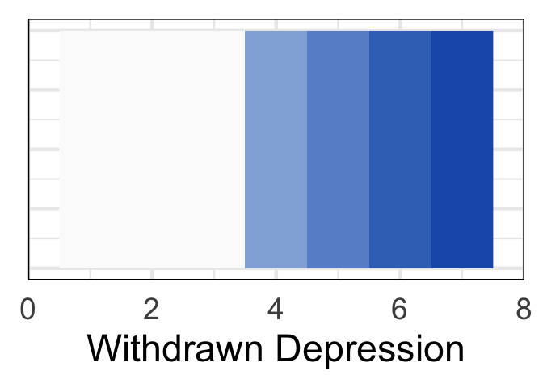<!-- -->

``` r
# saved at 480 x 210 for x-axis label space


# Social
Soc_derivative_matrix <- matrix(0, nrow = nrow(SocFits), ncol = ncol(SocFits) - 1)
# Calculate the derivative for each column
for (i in 1:(ncol(SocFits) - 1)) {
  # Calculate the differences in x (assuming a constant difference)
  dx <- 1
  # Calculate the differences in y (predicted values)
  dy <- SocFits[, i + 1] - SocFits[, i]
  # Calculate the derivatives (slopes)
  derivatives <- dy / dx
  # Store the derivatives in the derivative matrix
  Soc_derivative_matrix[, i] <- derivatives
}
# calc sig dervs
# get straightfoward of segment where 99% is over 0 or under
positive_counts <- colSums(Soc_derivative_matrix > 0, na.rm = TRUE)
negative_counts <- colSums(Soc_derivative_matrix < 0, na.rm = TRUE)
# find where each is 99% or greater
positive_countsSig=positive_counts>9900
negative_countsSig=negative_counts>9900
# make dataframe: 50th percentile of derivatives accompanied by posSig and NegSig vector
data <- apply(Soc_derivative_matrix, 2, function(x) quantile(x, probs = 0.5))
dervPlotDf<-data.frame(data,positive_countsSig,negative_countsSig)
dervPlotDf$sig_derivMask=dervPlotDf[,2]+dervPlotDf[,3]>0
dervPlotDf$sig_deriv=0
dervPlotDf$sig_deriv[dervPlotDf$sig_derivMask]=dervPlotDf$data[dervPlotDf$sig_derivMask]
dervPlotDf$seq=1:(dim(dervPlotDf)[1])
ggplot(data=dervPlotDf) + geom_raster(aes(x = seq, y = .5, fill = sig_deriv))+
      theme(panel.spacing = unit(-.01,"cm")) +
      scale_fill_gradientn(colors = my_palette(100),limits = c(min(-.1),max(0.1)))+theme_minimal(base_size = 35)+xlim(c(0,MaxSoc))+xlab('Social')+
      guides(fill=FALSE)+
      theme(axis.title.y = element_blank(),axis.text.y=element_blank())+theme(panel.border = element_rect(color = "black", fill = NA, size = 1))+
      scale_x_continuous(breaks=c(0,3,6,9,12),limits = c(0,MaxSoc),expand = expansion(mult = c(0, 0)))
```

    ## Scale for x is already present.
    ## Adding another scale for x, which will replace the existing scale.

    ## Warning: Removed 8 rows containing missing values (`geom_raster()`).

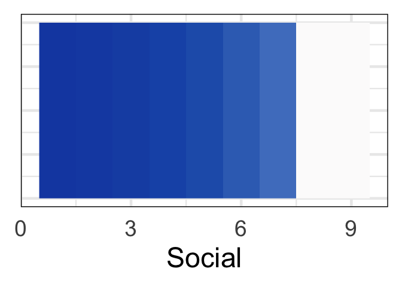<!-- -->

``` r
########################

# Attention
Att_derivative_matrix <- matrix(0, nrow = nrow(AttFits), ncol = ncol(AttFits) - 1)
# Calculate the derivative for each column
for (i in 1:(ncol(AttFits) - 1)) {
  # Calculate the differences in x (assuming a constant difference)
  dx <- 1
  # Calculate the differences in y (predicted values)
  dy <- AttFits[, i + 1] - AttFits[, i]
  # Calculate the derivatives (slopes)
  derivatives <- dy / dx
  # Store the derivatives in the derivative matrix
  Att_derivative_matrix[, i] <- derivatives
}
# calc sig dervs
# get straightfoward of segment where 99% is over 0 or under
positive_counts <- colSums(Att_derivative_matrix > 0, na.rm = TRUE)
negative_counts <- colSums(Att_derivative_matrix < 0, na.rm = TRUE)
# find where each is 99% or greater
positive_countsSig=positive_counts>9900
negative_countsSig=negative_counts>9900
data <- apply(Att_derivative_matrix, 2, function(x) quantile(x, probs = 0.5))
dervPlotDf<-data.frame(data,positive_countsSig,negative_countsSig)
dervPlotDf$sig_derivMask=dervPlotDf[,2]+dervPlotDf[,3]>0
dervPlotDf$sig_deriv=0
dervPlotDf$sig_deriv[dervPlotDf$sig_derivMask]=dervPlotDf$data[dervPlotDf$sig_derivMask]
dervPlotDf$seq=1:(dim(dervPlotDf)[1])
ggplot(data=dervPlotDf) + geom_raster(aes(x = seq, y = .5, fill = sig_deriv))+
      theme(panel.spacing = unit(-.01,"cm")) +
      scale_fill_gradientn(colors = my_palette(100),limits = c(min(-.1),max(0.1)))+theme_minimal(base_size = 35)+xlim(c(0,MaxAtt))+xlab('Attention')+
      guides(fill=FALSE)+
      theme(axis.title.y = element_blank(),axis.text.y=element_blank())+theme(panel.border = element_rect(color = "black", fill = NA, size = 1))+
      scale_x_continuous(limits = c(0,MaxAtt),expand = expansion(mult = c(0, 0)))
```

    ## Scale for x is already present.
    ## Adding another scale for x, which will replace the existing scale.

    ## Warning: Removed 6 rows containing missing values (`geom_raster()`).

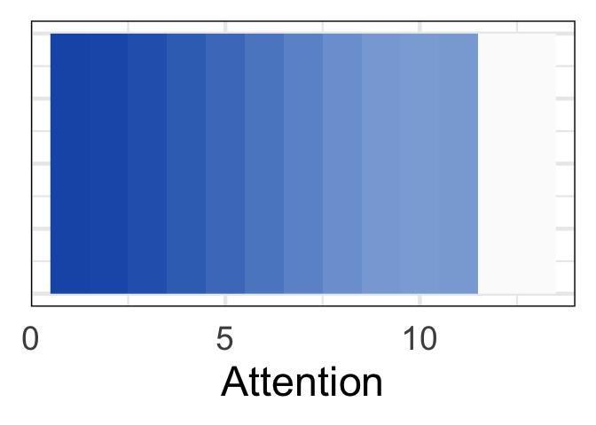<!-- -->

``` r
########################

# for Rul
Rul_derivative_matrix <- matrix(0, nrow = nrow(RulFits), ncol = ncol(RulFits) - 1)
# Calculate the derivative for each column
for (i in 1:(ncol(RulFits) - 1)) {
  # Calculate the differences in x (assuming a constant difference)
  dx <- 1
  # Calculate the differences in y (predicted values)
  dy <- RulFits[, i + 1] - RulFits[, i]
  # Calculate the derivatives (slopes)
  derivatives <- dy / dx
  # Store the derivatives in the derivative matrix
  Rul_derivative_matrix[, i] <- derivatives
}
# calc sig dervs
# get straightfoward of segment where 99% is over 0 or under
positive_counts <- colSums(Rul_derivative_matrix > 0, na.rm = TRUE)
negative_counts <- colSums(Rul_derivative_matrix < 0, na.rm = TRUE)
# find where each is 99% or greater
positive_countsSig=positive_counts>9900
negative_countsSig=negative_counts>9900
data <- apply(Rul_derivative_matrix, 2, function(x) quantile(x, probs = 0.5))
dervPlotDf<-data.frame(data,positive_countsSig,negative_countsSig)
dervPlotDf$sig_derivMask=dervPlotDf[,2]+dervPlotDf[,3]>0
dervPlotDf$sig_deriv=0
dervPlotDf$sig_deriv[dervPlotDf$sig_derivMask]=dervPlotDf$data[dervPlotDf$sig_derivMask]
dervPlotDf$seq=1:(dim(dervPlotDf)[1])
ggplot(data=dervPlotDf) + geom_raster(aes(x = seq, y = .5, fill = sig_deriv))+
      theme(panel.spacing = unit(-.01,"cm")) +
      scale_fill_gradientn(colors = my_palette(100),limits = c(min(-.1),max(0.1)))+theme_minimal(base_size = 35)+xlim(c(0,MaxRul))+xlab('Rule Breaking')+
      guides(fill=FALSE)+
      theme(axis.title.y = element_blank(),axis.text.y=element_blank())+theme(panel.border = element_rect(color = "black", fill = NA, size = 1))+
      scale_x_continuous(breaks=c(0,3,6,9,12),limits = c(0,MaxRul),expand = expansion(mult = c(0, 0)))
```

    ## Scale for x is already present.
    ## Adding another scale for x, which will replace the existing scale.

    ## Warning: Removed 11 rows containing missing values (`geom_raster()`).

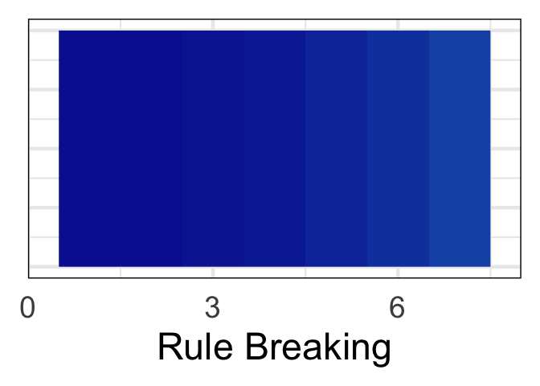<!-- -->

``` r
########################

# Aggression
Agg_derivative_matrix <- matrix(0, nrow = nrow(AggFits), ncol = ncol(AggFits) - 1)
# Calculate the derivative for each column
for (i in 1:(ncol(AggFits) - 1)) {
  # Calculate the differences in x (assuming a constant difference)
  dx <- 1
  # Calculate the differences in y (predicted values)
  dy <- AggFits[, i + 1] - AggFits[, i]
  # Calculate the derivatives (slopes)
  derivatives <- dy / dx
  # Store the derivatives in the derivative matrix
  Agg_derivative_matrix[, i] <- derivatives
}
# calc sig dervs
# get straightfoward of segment where 99% is over 0 or under
positive_counts <- colSums(Agg_derivative_matrix > 0, na.rm = TRUE)
negative_counts <- colSums(Agg_derivative_matrix < 0, na.rm = TRUE)
# find where each is 99% or greater
positive_countsSig=positive_counts>9900
negative_countsSig=negative_counts>9900
data <- apply(Agg_derivative_matrix, 2, function(x) quantile(x, probs = 0.5))

dervPlotDf<-data.frame(data,positive_countsSig,negative_countsSig)
dervPlotDf$sig_derivMask=dervPlotDf[,2]+dervPlotDf[,3]>0
dervPlotDf$sig_deriv=0
dervPlotDf$sig_deriv[dervPlotDf$sig_derivMask]=dervPlotDf$data[dervPlotDf$sig_derivMask]
dervPlotDf$seq=1:(dim(dervPlotDf)[1])
ggplot(data=dervPlotDf) + geom_raster(aes(x = seq, y = .5, fill = sig_deriv))+
      theme(panel.spacing = unit(-.01,"cm")) +
      scale_fill_gradientn(colors = my_palette(100),limits = c(min(-.1),max(0.1)))+theme_minimal(base_size = 35)+xlim(c(0,MaxAgg))+xlab('Aggression')+
      guides(fill=FALSE)+
      theme(axis.title.y = element_blank(),axis.text.y=element_blank())+theme(panel.border = element_rect(color = "black", fill = NA, size = 1))+
      scale_x_continuous(limits = c(0,MaxAgg),expand = expansion(mult = c(0, 0)))
```

    ## Scale for x is already present.
    ## Adding another scale for x, which will replace the existing scale.

    ## Warning: Removed 15 rows containing missing values (`geom_raster()`).

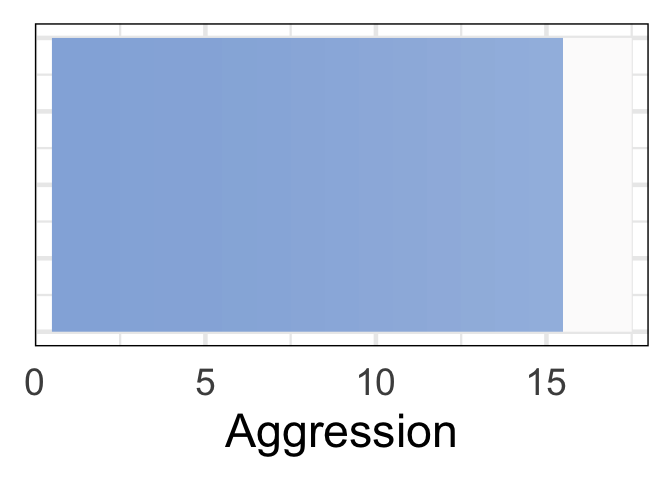<!-- -->
